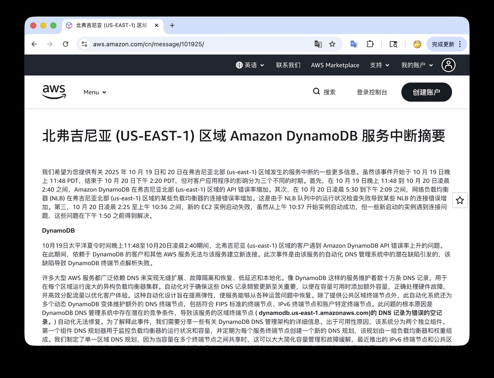
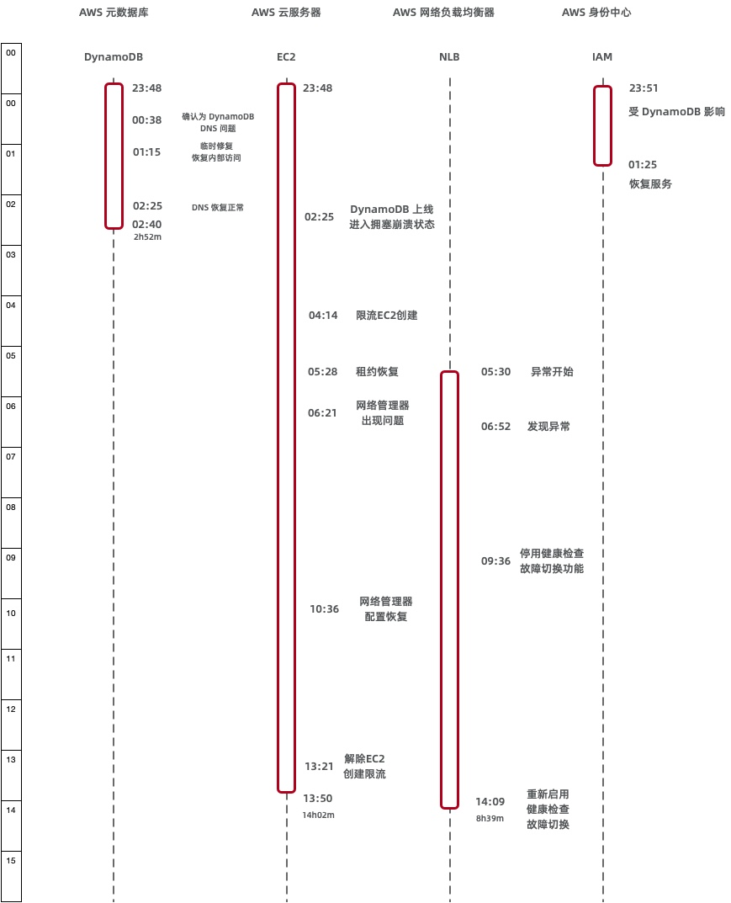
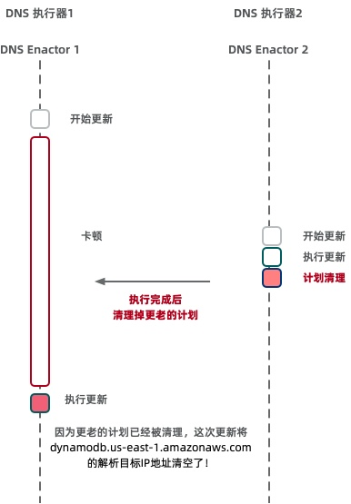

今天 AWS 官方发布了 [10-20 日美东大故障](https://mp.weixin.qq.com/s/sCAOwNva__0L_iMP1QHngQ) 的事后复盘报告，细节比较丰富，算是少有的第一手现场资料。所以老冯把它翻译成了中文，并附上解读与评论，供大家参考。

> 故障公告：https://aws.amazon.com/cn/message/101925/

## Amazon DynamoDB 服务中断总结

我们希望就2025年10月19日至20日发生在美国东部弗吉尼亚北部（us-east-1）区域的服务中断事件向您提供一些补充信息。
此次事件始于10月19日 PDT**23:48**，结束于10月20日 PDT**14:20**。
在此过程中，客户应用的影响大致可分为三个不同阶段：
首先，**10月19日23:48至10月20日02:40**，Amazon DynamoDB 在美国东部（弗吉尼亚北部，us-east-1）区域的 API 错误率显著升高。
其次，**10月20日05:30至14:09**，网络负载均衡器（Network Load Balancer，NLB）在该区域出现部分负载均衡实例连接错误率上升的情况（源于 NLB 集群的健康检查失败）。
第三，**10月20日02:25至10:36**，新的 EC2 实例启动均告失败；尽管从**10:37**开始实例启动逐步恢复成功，但部分新启动实例出现了网络连接问题，直到**13:50**才完全解决。

### DynamoDB

**2025年10月19日23:48 至 10月20日02:40**期间，美国东部（弗吉尼亚北部，us-east-1）区域的 Amazon DynamoDB API 错误率显著升高。在此期间，所有依赖 DynamoDB 的客户应用和其他 AWS 服务都无法与该服务建立新的连接。此次故障由 DynamoDB 服务的自动化 DNS 管理系统中的一个潜在缺陷所触发，该缺陷导致 DynamoDB 服务端点的 IP 地址解析失败。

AWS 许多大型服务都高度依赖 DNS 来实现无缝扩展、故障隔离与恢复、低延迟以及数据就近访问。例如，DynamoDB 在每个区域维护着数十万条 DNS 记录，以管理该区域内庞大且异构的负载均衡集群。通过自动化频繁更新这些 DNS 记录，可以在新扩容资源上线时立即添加对应记录，正确应对硬件故障，并高效地分配流量，优化客户体验。该自动化系统针对高弹性进行设计，使服务能够从各种运行问题中快速恢复。除了提供公共区域端点以外，该系统还维护了多个 DynamoDB 的动态 DNS 端点，包括符合 FIPS 标准的专用端点、IPv6 专用端点，以及账号级别的专属端点。

此次问题的根本原因在于 DynamoDB DNS 管理系统中存在一个潜伏的**竞态条件**（race condition）。该竞态问题导致服务的区域端点 **(dynamodb.us-east-1.amazonaws.com)** 的 DNS 记录被错误地清空，而自动化系统未能及时纠正这一状况。为解释这一情况，我们需要先介绍 DynamoDB DNS 管理系统的架构。出于高可用性的考虑，该系统分为两个相互独立的组件：

- **DNS 规划器（DNS Planner）**：监控负载均衡器的运行状况和容量，并定期为服务的每个端点创建新的 DNS “方案”（plan），其中包含一组负载均衡器及其权重。我们为整个区域生成统一的 DNS 方案，因为当多个端点共享资源容量时（例如公共区域端点和新推出的 IPv6 端点），统一的方案极大地简化了容量管理和故障处理。
- **DNS 执行器（DNS Enactor）**：被设计为几乎无依赖，以便在任何场景下都能独立运行恢复。DNS 执行器负责将 DNS 方案应用到 Amazon Route 53 服务中。为增强弹性，我们在三个不同的可用区（AZ）中各部署了一个完全独立运行的 DNS 执行器实例。每个 DNS 执行器都会监听新的方案生成，并通过 Route 53 事务尝试将当前方案替换为新方案。这种机制可确保即使有多个 DNS 执行器并发地更新同一端点，也能让该端点应用一致的方案。

此次竞态条件源于两个 DNS 执行器之间一次极为罕见的交互。正常情况下，DNS 执行器获取最新方案后，会依次将其应用到服务的各个端点上。这个过程通常非常迅速，能够确保 DNS 状态保持最新。在开始应用新方案之前，DNS 执行器会一次性检查其即将应用的方案是否比之前的方案更新。在遍历端点列表应用方案的过程中，如果某个 DNS 执行器在更新某端点时被另一执行器暂时阻塞，它将反复重试直到成功。

在本次事件发生前夕，一台 DNS 执行器在更新多个端点时遭遇了异常高的延迟，不得不对几个 DNS 端点进行了多次重试。当它以缓慢的速度逐步处理这些端点时，又发生了几件事：首先，DNS 规划器继续运行并生成了多代更新的方案；其次，另一台 DNS 执行器开始应用其中一个较新的方案，并快速地完成了对所有端点的更新。这一系列操作在时间上的巧合触发了那个潜伏的竞态条件。

当第二台（较快的）DNS 执行器完成端点更新后，它启动了方案清理进程，该进程会删除所有比刚应用方案“陈旧得多”的旧方案。恰在此时，第一台（较慢的）DNS 执行器终于将其早已过期的方案应用到了 DynamoDB 的区域主端点，结果把较新的方案覆盖掉了。由于该执行器在开始应用时所做的新旧方案校验因长时间延迟而变得过期无效，所以未能阻止旧方案覆盖新方案。随后，第二台执行器的清理进程检测到这个过期方案（相对于它刚应用的方案已过多代），便将其删除。随着这一方案被删除，该区域端点的所有 IP 地址也从 DNS 记录中被移除了。而且由于活动方案被移除，系统陷入不一致状态，导致之后无论哪台 DNS 执行器都无法再成功应用新的方案。最终，我们不得不通过人工干预来纠正这一状况。

当上述故障于 PDT 时间10月19日23:48 出现后，所有通过公共端点连接美国东部（弗吉尼亚北部，us-east-1）区域 DynamoDB 服务的系统立刻遭遇 DNS 解析失败，无法连接至 DynamoDB。这不仅影响了客户流量，也影响了依赖 DynamoDB 的 AWS 内部服务流量。启用了 DynamoDB 全局表（Global Tables）的客户虽然能够对其他区域的副本表成功发出请求，但与 us-east-1 区域对应副本之间出现了严重的复制延迟。相关 AWS 服务的工程团队在事故发生后立即投入调查。到10月20日00:38，我们的工程师确认 DynamoDB 的 DNS 状态正是这次中断的根源。到了01:15，通过实施一系列临时缓解措施，我们恢复了部分内部服务对 DynamoDB 的连接，并修复了关键的内部工具，为后续全面恢复扫清了障碍。到02:25，所有 DynamoDB 服务的 DNS 信息均已恢复正常，全球表的所有副本也在02:32 前完成了追赶同步。随着 DNS 缓存逐步过期，客户在02:25至02:40之间重新能够解析 DynamoDB 区域端点并建立连接。至此，与 DynamoDB 服务相关的主要中断阶段宣告结束。

### Amazon EC2

**2025年10月19日23:48 至 10月20日13:50**，在美国东部（弗吉尼亚北部，us-east-1）区域内，客户遇到了 EC2 API 错误率上升、延迟增加以及新实例启动失败的情况。在整个事件持续期间，故障发生前已运行的 EC2 实例始终保持正常，未受到影响。在**02:25**解决 DynamoDB DNS 问题后，客户启动新 EC2 实例依然出现大量错误。恢复工作于**10月20日12:01**展开，至**13:50** EC2 服务全面恢复。在此期间，新的实例启动请求要么失败并返回“**请求超过限制**”（request limit exceeded）错误，要么失败并返回“**资源不足**”（insufficient capacity）错误。

要理解这一问题，我们需要先介绍几个与 EC2 实例启动以及新实例网络配置相关的内部子系统。第一个子系统是 **Droplet Workflow Manager (DWFM)**，负责管理 EC2 用于承载实例的所有底层物理服务器——这些物理服务器我们称之为 “*droplet*”。第二个子系统是 **网络管理器（Network Manager）**，负责管理网络状态并将网络配置传播至所有 EC2 实例和网络设备。

每个 DWFM 在每个可用区内管理着一组 droplet，并为每个 droplet 维护一个租约（lease）。通过租约，DWFM 可以跟踪 droplet 的状态，确保无论是由 EC2 API 发起的操作，还是由实例操作系统内部触发的关机或重启操作，都能够在整个 EC2 系统中正确反映状态变化。为了维持这些租约，每台 DWFM 主机需要每隔几分钟就与其管辖的每个 droplet 进行一次状态检查。

从10月19日23:48开始，上述 DWFM 的状态检查开始失败——由于该过程依赖 DynamoDB 而 DynamoDB 当时不可用，检查无法完成。虽然这并未影响任何正在运行的 EC2 实例，但对于任何涉及实例状态变更的新操作，droplet 在执行前必须先与 DWFM 建立新的租约。于是，在10月19日23:48至10月20日02:24这段时间内，EC2 集群中 DWFM 与 droplet 之间的租约开始陆续因超时而失效。

**02:25**（DynamoDB API 恢复）之后，DWFM 开始在整个 EC2 集群中重新与各 droplet 建立租约。由于任何没有有效租约的 droplet 都不会被视为新实例启动的可用候选资源，因此此时 EC2 API 针对新的启动请求返回“资源不足”的错误。DWFM 虽然着手重新为集群中的 droplet 建立租约，但由于 droplet 数量庞大，重新建立租约所需时间过长，以至于还未完成就再次超时。这使得大量重试操作排队等待处理。此时，DWFM 陷入了一种**“拥塞崩溃”**（congestive collapse）的状态，无法继续推进租约恢复进程。

鉴于此前没有针对这种情况的现成应急方案，工程师在处理 DWFM 问题时格外谨慎。尝试了多种缓解步骤后，团队于**04:14**采取措施：一方面限制新的任务进入队列（对请求进行了限流），另一方面选择性地重启了部分 DWFM 主机。重启操作清除了 DWFM 队列，缩短了处理时间，并使 droplet 租约得以及时重新建立。到**05:28**，DWFM 已经与 us-east-1 区域内所有 droplet 恢复租约，新实例启动也再次开始成功。不过，由于我们之前实施的请求限流措施尚未完全解除，许多启动请求依然会遇到“请求超过限制”的错误。

当一个新的 EC2 实例启动时，一个名为网络管理器（Network Manager）的系统会将网络配置下发给该实例，以使其能够与同一虚拟私有云（VPC）内的其他实例、其他 VPC 的网络设备以及互联网进行通信。在**05:28**（DWFM 恢复后不久），网络管理器开始向新启动的实例以及事件期间曾经终止过的实例分发更新的网络配置。然而，由于之前 DWFM 故障导致网络配置传播事件积压，N. Virginia 区域的网络管理器累积了大量等待处理的网络状态更新。**06:21**起，网络管理器在处理这些积压的网络更新时出现了显著的延迟。尽管新的 EC2 实例可以成功启动，但由于网络状态传播延迟，这些实例无法及时获得必要的网络连接。工程师通过降低网络管理器的负载来缩短网络配置的传播延迟，并采取了额外措施加速恢复。到**10:36**，网络配置传播已恢复正常，新启动的 EC2 实例也重新具备了正常的网络连通性。

EC2 服务恢复的最后一步是解除此前为减轻各子系统负载而实施的请求限流措施。随着 API 调用频率和新实例启动请求逐步恢复正常，工程师于**11:23**开始逐步放宽并最终移除这些限流限制。至**13:50**，所有 EC2 API 和新实例启动均恢复正常运行。

### 网络负载均衡器（NLB）

新实例网络状态传播延迟的问题同样波及到了 **网络负载均衡器（Network Load Balancer，NLB）** 服务及其他使用 NLB 的 AWS 服务。在**10月20日05:30 至 14:09**期间，美国东部（弗吉尼亚北部，us-east-1）区域内部分客户的 NLB 出现了连接错误率上升的现象。NLB 基于高度可扩展的多租户架构构建，为用户提供负载均衡访问端点，并将流量路由至后端目标（通常是 EC2 实例）。该架构还包含一个独立的健康检查子系统，会定期对 NLB 体系结构内的所有节点执行健康检查，并将任何被判定为不正常的节点移出服务。

在此次事件期间，NLB 的健康检查子系统开始记录到大量健康检查失败。原因在于健康检查子系统将新启动的 EC2 实例纳入服务时，这些实例的网络配置尚未完全传播。因此，即使相关 NLB 节点和后端目标本身是健康的，这些实例的健康检查仍会失败。结果就是健康检查状态在“失败”和“正常”之间来回波动：一次检查失败，该节点及其目标就被从 DNS 中移除；下一次检查恢复正常时，它们又被重新加入服务。

我们的监控系统在**06:52**检测到了这一异常，工程师随即展开了补救工作。健康检查结果的反复“闪烁”使健康检查子系统负载加重，导致检查延迟，并触发了可用区级别的自动 DNS 故障切换（AZ Failover）。对于跨多个可用区部署的负载均衡器而言，这意味着部分可用区的负载均衡节点被判定故障而下线。如果剩余的可用容量不足以支撑应用负载，就会出现客户连接错误。**09:36**，工程师手动停用了 NLB 的自动健康检查故障切换功能，让所有健康的 NLB 节点和后端目标重新回到服务中。这一措施消除了受影响负载均衡器的连接错误。在 EC2 服务完全恢复后，我们已于**14:09**重新启用了 NLB 的自动 DNS 健康检查故障切换功能。

### 其他 AWS 服务

在**10月19日23:51 至 10月20日14:15**期间，us-east-1 区域的客户在使用 AWS Lambda 函数时遇到了 API 错误和延迟问题。最初，由于 DynamoDB 区域端点不可用，Lambda 函数的创建和更新请求无法完成，SQS/Kinesis 事件源的处理出现延迟并伴随调用错误。到**02:24**，除 SQS 队列拉取外的 Lambda 服务功能均已恢复；SQS 队列处理仍然受阻，是因为负责轮询 SQS 队列的内部子系统发生故障且未能自动恢复。我们于**04:40**修复了该子系统，并在**06:00**前清理完所有消息积压。但在**07:04**左右，受 NLB 健康检查故障影响，一部分 Lambda 内部系统实例被异常终止，导致计算容量不足。由于 EC2 实例启动尚未完全恢复，我们对 Lambda 事件源映射和异步调用实施了限流，以优先保障对延迟敏感的同步调用。到**11:27**，我们恢复了足够的运行容量，错误率开始下降。随后我们逐步解除限流，并于**14:15**之前处理完所有积压任务，Lambda 服务恢复正常。

在**10月19日23:45 至 10月20日14:20**期间，美国东部（弗吉尼亚北部，us-east-1）区域的 Amazon Elastic Container Service（ECS）、Amazon Elastic Kubernetes Service（EKS）和 AWS Fargate 服务均出现了容器启动失败和集群扩容延迟的问题。这些服务均已于**14:20**恢复正常。

在**10月19日23:56 至 10月20日13:20**期间，使用 Amazon Connect 的客户在处理呼叫、聊天和工单（Cases）时遇到了显著的错误提升。DynamoDB 区域端点恢复后，Amazon Connect 的大多数功能已经恢复，不过客户在**05:00**之前发送聊天消息时仍然会遇到错误。从**07:04**开始，由于 NLB 故障以及 Lambda 函数执行错误，客户在接入新来电、处理聊天、任务、邮件和工单时再次出现大量错误。具体来说：呼入电话的主叫方会遇到忙音、错误消息或连接失败；由座席发起的外呼电话（无论人工或通过 API）均无法接通；即使已接听的电话也可能出现提示音播放失败、无法路由至座席或通话中断等问题。此外，座席在处理联络时会遇到错误，一些座席甚至无法登录。客户在调用 Connect 提供的 API 或执行联系搜索时同样碰到错误。实时和历史仪表板的数据更新也出现延迟，数据湖的数据更新被延后，我们将在**10月28日**之前补齐所有数据。随着 Lambda 函数调用错误率的恢复下降，到**13:20** Amazon Connect 服务的可用性已经恢复。

在**10月19日23:51 至 10月20日09:59**期间，AWS 安全令牌服务（AWS Security Token Service，STS）在 us-east-1 区域出现了 API 调用错误率上升和延迟增加的情况。DynamoDB 区域端点恢复后，STS 已于**01:19**恢复正常。但在**08:31 至 09:59**期间，受到 NLB 健康检查故障的影响，STS API 错误率和延迟再次升高。到**09:59**，STS 从 NLB 健康检查故障中恢复，服务恢复正常运行。

在**10月19日23:51 至 10月20日01:25**期间，通过 IAM 用户登录 AWS 管理控制台的客户遇到了较高的身份验证失败率，原因是弗吉尼亚北部（us-east-1）区域的 DynamoDB 故障导致 IAM 验证服务受损。将 AWS IAM 身份中心（原 AWS SSO）配置在 us-east-1 区域的客户也无法通过身份中心完成登录。使用 Root 用户凭证登录，或使用指向 **signin.aws.amazon.com** 的身份联合登录方式尝试访问其他区域 AWS 管理控制台的客户，同样遇到了错误。随着 DynamoDB 区域端点在**01:25**重新可用，IAM 登陆服务恢复正常。

在**10月19日23:47 至 10月20日02:21**期间，客户在 us-east-1 区域创建、修改 Amazon Redshift 集群或对现有集群执行查询时遇到了 API 错误。Redshift 查询处理依赖 DynamoDB 来读写集群的元数据。随着 DynamoDB 区域端点的恢复，Redshift 查询操作得以恢复，到**02:21** 时，Redshift 客户已经可以成功查询集群并创建或修改集群配置。然而，一些 Redshift 计算集群在 DynamoDB 恢复后仍然处于受损不可用状态。原因是：当集群节点凭证过期且未被及时刷新时，Redshift 自动化会尝试启动流程，用新的 EC2 实例替换底层故障节点。但由于当时 EC2 实例无法启动，这些替换流程被阻塞，集群因此卡在“**修改中**”（modifying）状态，无法处理查询。我们的工程师在**06:45**采取措施，阻止替换流程队列继续增长。当 Redshift 集群从**14:46**开始陆续成功启动新的替换实例后，积压的替换流程也开始逐步消化。到**10月21日04:05**，AWS 运维人员已完成对所有受此问题影响集群的可用性恢复。

此外，在**10月19日23:47 至 10月20日01:20**期间，由于 Redshift 的一个缺陷——其在解析用户组时调用了 us-east-1 区域的 IAM API——导致所有 AWS 区域的 Amazon Redshift 客户都无法使用 IAM 用户凭证执行查询。在此期间 IAM 服务的故障使 Redshift 无法完成这些查询。使用 Redshift 本地用户凭证连接集群的客户不受该问题影响。

其他一些依赖 DynamoDB、新 EC2 实例启动、Lambda 执行和 Fargate 任务启动的 AWS 服务（例如 Amazon Managed Workflows for Apache Airflow、Outposts 生命周期管理操作以及 AWS Support Center 等）在 us-east-1 区域也受到了此次事件的影响。

### 结语

对于此次事件给我们的客户带来的影响，我们深表歉意。我们在高可用服务运营方面一直保持着良好的记录，但我们深知我们的服务对于客户、客户的应用及终端用户乃至其业务而言有多么关键。这次事件对许多客户产生了重大影响，我们将尽最大努力从中汲取经验教训，并以此进一步提升服务的可用性和可靠性。

--------

## 老冯评论与解读

老冯昨天也已经 [介绍过这次事故的经历与影响](https://mp.weixin.qq.com/s/sCAOwNva__0L_iMP1QHngQ)。
这次故障是一场让人叹为观止的级联雪崩，一个区域内的 DNS 服务的设计缺陷被级联放大到影响半个互联网。
毫无疑问是一次架构哲学的大失败。接下来，让我们一起看一下 AWS 在此次故障中的三个问题。

### DNS 问题

这份故障报告披露了 DNS 故障的原因 —— DNS 管理控制面的设计缺陷。其实这是一个相当标准的数据库事务问题，DNS 更新踩踏完全可以在元数据库层面用事务机制来规避 —— 当然 AWS 可能会主张他们的规模会有这样那样的问题没法实现操作的原子性，这也就算了；

但最离谱的是，一个执行器把另一个执行器的计划给清理了，另一个执行器的合理行为是 —— 执行计划都没了就别执行了 —— 而不是直接把 DNS 解析给删掉。然后，这个 BUG 还卡住了后续的 DNS 计划更新，导致最后只能依赖人工介入处理。

老实说看到这个原因，老冯真心觉得匪夷所思：都知道 DNS 是基础中的基础，更新 DNS 的服务竟然会有如此低级的 BUG ？任何并发程序设计都要考虑的竞态条件处理，竟然实现的如此粗糙？这种失智行为让人怀疑这些代码到底有没有经过测试？是不是用 Vibe Coding 糊出来的东西？

另一个槽点是几乎是整个运维圈都在吐槽的 —— 定位到是 DNS 的问题用了 40 分钟，手工修复这个问题又用了 37 分钟，最后又是 70 分钟才恢复正常，一个 DNS 故障处理总共历时 2小时 52 分钟，对于 AWS 这样的云厂商来说，这个战绩可谓是惨不忍睹了 —— 引用 Corey Quinn 的评论就是 —— “当你炒掉最优秀的工程师时，就别惊讶云厂商会忘记 DNS 是怎么工作的” 。

### EC2 问题

第二场次生故障是 EC2 Droplet 租约系统对 DynamoDB 的高度依赖与“拥塞崩溃”。

大体上来说，AWS 把 DynamoDB 当作 Consul，etcd 这样的 DCS 来用，存储各种核心系统的云数据，比如 EC2 的租约。AWS 把物理机叫做 “Droplet” （液滴），管理这些物理机的管控组件叫做 DWFM （液滴工作流管理者）。 DWFM 需要存储在 DynamoDB 里面的租约才可以执行管理操作，但是现在 DynamoDB 挂了，DWFM 的租约一过期，就失去管理权限了。

据称，这次故障并没有影响已有 EC2 的运行，影响的是EC2的管理操作，即管控面 。在故障的第一阶段 —— DynamoDB 下线阶段，EC2 表现为新启动 EC2 提示 “资源不足”，因为 DWFM 都因为丢失租约而失去权限。在故障的第二阶段，DynamoDB 重新上线，大量的 DWFM 争抢着去申请新的租约，这就直接把 DynamoDB 给打爆了。

按理说，AWS DynamoDB 号称可以自动弹性伸缩，但是现在底下的弹性计算 EC2 管控服务又处于故障状态，没有办法创建新的 EC2 ，于是就卡死了。 AWS 的解决办法是不让用户新创建 EC2，然后祭出了 **重启大法**。把 DWFM 分批重启了一遍清空了重试队列。

这个部分让老冯非常疑惑的点有：重试似乎没有指数退避拥塞控制机制？还是说根本没有重试前超时取消的机制？难道连个断路器都没有吗？当然，要说最滑稽的，应该是 ——  “鉴于此前没有针对这种情况的现成应急方案，工程师在处理 DWFM 问题时格外谨慎。”  通常来说，重启大法能解决 90% 的问题，但是重启 DWFM （都不是重启物理机）这个决定，AWS 团队花了 100 分钟才拍版决定下来。然后重启后又花了 74 分钟才恢复过来，这个决断能力实在是过于拉胯了。

### NLB 故障

当 EC2 开始恢复的时候，网络负载均衡器 NLB 又开始出问题了。这又重新导致 元数据库 DynamoDB，CloudWatch 监控，以及 Lambda 执行引擎出现网络连接问题。

因为网络配置没有及时下发，所以根据 NLB 的健康检查规则，就会将新节点从服务列表中移除。AWS 通过停用 NLB 的自动健康检查故障切换功能解决了这个问题。从 6:52 检测到问题，到 9:36 手工停用健康检查 —— 两个半小时的决断时间。

当然，DynamoDB，EC2，NLB 的故障其实还引发了许多服务的次生故障，比如 AWS 自己的工单支持系统，STS，IAM，Redshift，等等等等。这里特别提一下 IAM ，之前 [Google IAM 带崩半个互联网](https://mp.weixin.qq.com/s/yZOUzoEHQdBuNFrSIXVB9w)，以及 [阿里云全球全局服务大故障](https://mp.weixin.qq.com/s/OIlR0rolEQff9YfCpj3wIQ)，都与身份认证这项基础服务有关。而 IAM 是使用 DynamoDB 存储身份认证策略的，因此在 23:51 - 01:25 这94分钟里是受到影响的。这里 AWS 对IAM 故障轻描淡写一笔带过，但其实很有可能是 DynamoDB 故障扩散到 142 项服务的关键路径。

### 老冯感想

有 AWS 的客户在事故发生后和老冯吐槽 —— 看到这个故障处理的过程，他对 AWS 幻灭了，原来光鲜亮丽的云计算一哥也是草台班子。 当然，草台班子也有层次之分，相比某些云厂商讳莫如深，故障后装死，AWS 肯在故障事后公开技术细节和不足，这份坦诚还是难能可贵的。

老冯认为，云厂商的核心资产不仅是服务器和骨干网络，更是经验丰富的专家们。但对于云厂商来说，这些老专家是成本中心，他们的水平没法体现在财报里。因此在过去几年的裁员中，很大一部分精英都流失了，机构的记忆也随之离去。留下的新人已经不再知道老系统的隐秘依赖关系，再加上 “75%的代码由 AI 生成” ，最终导致工程团队缺乏诊断复杂级联故障的直觉，以及在危急关头拍版决断的能力，最终导致如此拉胯的响应表现。

老冯觉得，规模带来的复杂度已经开始反噬云厂商了。纵观最近几年的云故障，因为机房起火断电之类不可抗力事件的并不多，反而那些超大规模故障几乎都是因为管控软件缺陷，人为配置操作失当导致的。

额外复杂度是架构设计中的大敌，有时候，简简单单在数据中心里租俩机柜，跑几套数据库 + Docker 跑跑应用这种经典的架构，异地对象存储备份一下，足够绝大多数企业一路干到 IPO 了。如果你的问题本质复杂度如果没有 Amazon Google 的规模，却非要使用他们的基础架构 —— 那么成本可不仅是高昂的云上财务开销，还有架构复杂度带来的风险 —— 而这几次大故障毫无疑问的证实了这一点。

当一家云厂商内部的一条 DNS 记录损坏，就能让全球数千万用户的生活陷入混乱； 当一个区域的数据中心网络故障，能让遍布五大洲的企业同时瘫痪，老冯觉得：**云计算在带来便利的同时，也创造了前所未有的系统性风险**。 而这可不是互联网诞生的初衷！

要想解决这个问题，也许最后还是需要监管介入。像当年 FCC 拆分 AT&T 一样，拆分几大云厂商。公有 IaaS 硬件层成为类似电网，通信的公共基础设施接受强监管。而上面的 PaaS ，SaaS 软件层则由无数供应商与创业公司百花齐放。

