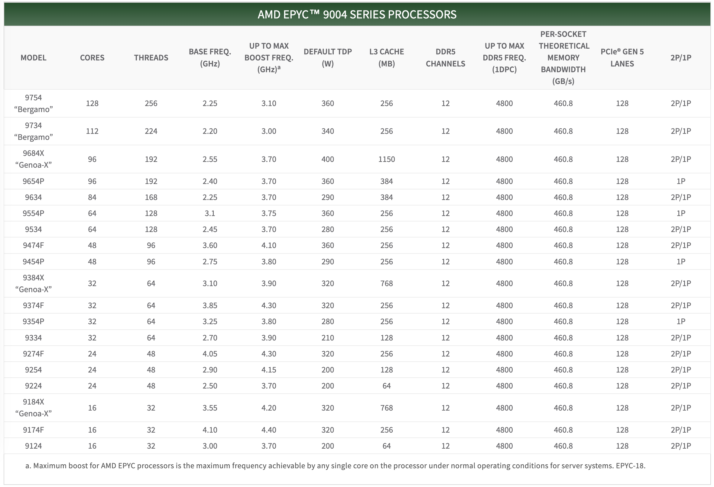

Hardware is interesting again, with the AI wave fueling a GPU frenzy. However, the intrigue isn’t limited to GPUs —— developments in CPUs and SSDs remain largely unnoticed by the majority of devs. A whole generation of developers is obscured by cloud hype and marketing noise.

Hardware performance is skyrocketing, and costs are plummeting, turning the public cloud from a decent service into a cash cow. These shifts necessitate a reevaluation of technology and software. It's time to get back to basics and reclaim the hardware dividend that belongs to users.

-----------

## Revolutionary New Hardware

If you've been unaware of computer hardware for a while, the specs of the latest gear might shock you.

Once, Intel’s CPUs saw marginal gains each generation, allowing old PCs to remain viable year after year. However, CPU evolution has recently accelerated, with significant leaps in core counts and regular 20-30% improvements in [single-core performance](https://www.tomshardware.com/pc-components/cpus/core-i9-14900ks-overclocked-to-91-ghz-breaking-numerous-world-records).

For instance, AMD's recently released desktop CPU, the [Threadripper 7995WX](https://www.amd.com/en/products/cpu/amd-ryzen-threadripper-pro-7995wx), is a performance beast with 96 cores and 192 threads at speeds ranging from 2.5 to 5.1 GHz, retailing on Amazon for \$5600. The server CPU series, EPYC, includes the previous generation [EPYC Genoa 9654](https://www.amd.com/en/products/cpu/amd-epyc-9654), with 96 cores and 192 threads at speeds ranging from 2.4 to 3.55 GHz, priced at $3940 on Amazon. This year's new [EPYC 9754](https://www.amd.com/zh-hans/products/cpu/amd-epyc-9754) goes even further, offering a single CPU with 128 cores and 256 threads. This means a standard dual-socket server could have an astonishing 512 threads! If we consider cloud computing/container platforms' 500% overselling rate, this could virtualize more than two thousand five hundred 1-core virtual machines.

Take AMD's new [Threadripper 7995WX](https://www.amd.com/en/products/cpu/amd-ryzen-threadripper-pro-7995wx), a 96-core, 192-thread behemoth clocked at 2.5 to 5.1 GHz, retailing at \$5600 on Amazon. On the server side, the previous-gen [EPYC Genoa 9654](https://www.amd.com/en/products/cpu/amd-epyc-9654) offered 96 cores and 192 threads at 2.4 to 3.55 GHz, priced at \$3940. The latest [EPYC 9754](https://www.amd.com/en/products/cpu/amd-epyc-9754) pushes boundaries further with 128 cores and 256 threads, enabling a dual-socket server to boast a staggering 512 vCPUs — enough to oversubscribe and virtualize over 2500+ 1c VMs at 500% oversell rates.

-----------

SSD/NVMe storage has seen even more dramatic generational jumps. Speeds have escalated from Gen2’s 500MB/s to Gen3’s 2.5GB/s, and now Gen4’s mainstream 7GB/s, with Gen5 at 14GB/s emerging. Gen6 is released, with Gen7 on the horizon, as I/O bandwidth doubles exponentially.

Consider the Gen5 NVMe SSD: [KIOXIA CM7](https://www.storagereview.com/review/kioxia-cm7-gen5-enterprise-ssd-review), which offers 128K sequential read bandwidth of 14GB/s and write bandwidth of 7GB/s, with 4K random IOPS of 2.7M for reads and 600K for writes. It's doubtful that many database software packages can fully utilize this insane read/write bandwidth and IOPS. For context, HDD generally fluctuates around a read/write bandwidth of a few hundred MB/s, with 7200 RPM drives achieving IOPS in the tens and 15000 RPM drives in the low hundreds. **NVMe SSDs' I/O bandwidth rates are already four orders of magnitude better than HDD — 10,000x better.**

In terms of 4K RankRW response times, which are of utmost concern for databases, NVMe SSDs have achieved 55/9 µs for reads & writes since several generations ago. Meanwhile, HDD seek time usually measures around 10ms, with an average rotational latency depending on speed between 2ms and 4ms, meaning a single I/O operation typically takes over a dozen milliseconds. Comparing dozens of milliseconds to 55/9µs, **NVMe SSDs are three orders of magnitude faster than mechanical disks — 1000x faster!**

-----------

Besides computing and storage, network hardware has also improved significantly. 40GbE and 100GbE are now commonplace — a 100GbE optical module network card costs just about several hundred dollars, offering a network transfer speed of 12 GB/s, **a hundred times faster** than the gigabit network cards familiar to older programmers.

> [1.6T Ethernet](https://www.synopsys.com/blogs/chip-design/1-6t-ethernet-specification-ip.html) is already on the radar.

As computing, storage, and networking hardware evolve exponentially following Moore's Law, hardware becomes fascinating again. But the real intrigue lies in how these technological leaps will impact the world.

-----------

## Distributed Losing Favor

The landscape of hardware has undergone monumental changes over the past decade, rendering many assumptions in the software realm obsolete, such as those concerning [distributed databases](/blog/db/distributive-bullshit/).

Today, the capabilities of a standard x86 server have reached astonishing levels. An intriguing [draft calculation](https://thume.ca/2023/01/02/one-machine-twitter/) roughly demonstrates the feasibility of running the entirety of Twitter on a modern server (Dell PowerEdge R740xd, with 32 cores, 768GB RAM, 6TB NVMe, 360TB HDD, GPU slots, and 4x40Gbe networking). While you wouldn't do this for production redundancy (using two or three servers might be safer), this calculation indeed raises an interesting question — **Is scalability still a real issue?**

At the turn of the century, an Apache server could barely handle a few hundred concurrent requests. The best software struggled with tens of thousands of concurrent connections — the industry's notorious C10K problem, where handling several thousand connections was seen as a feat. However, with the advent of Epoll and Nginx in 2003/2004, "high concurrency" ceased to be a challenge — any novice who learned to configure Nginx could achieve what masters only dreamed of a few years earlier. "Customers in the Eyes of Cloud Providers: Poor, Idle, and Lacking Love" details this evolution.

As of 2023, the impact of hardware has once again revolutionized distributed databases: **Scalability, much like the C10K problem two decades ago, has become a solved issue of the past**. If a service like Twitter can run on a single server, then 99.xxxx+% of services will not exceed the scalability needs that such a server can provide throughout their entire lifecycle. This means the once-prized "distributed" technology boasted by big tech companies has become redundant with the advent of new hardware — **Anyone still discussing partitioning, distributed databases, and high concurrency on a massive scale is living in the past, having ceased to learn and grow over the past decade.**

The foundational assumption of distributed databases — that a single machine's processing power is insufficient to support the load — has been shattered by contemporary hardware. Centralized databases don't even need to lift a finger; their capacity automatically scales to meet demands that most services will never reach in their lifetime. Some might argue that services like WeChat or Alipay require distributed databases, but setting aside whether distributed databases are the only solution, assuming these rare extreme cases can sustain a couple of distributed TP kernels, distributed OLTP databases will no longer be the main direction for database development as network hardware becomes more cost-effective than disk storage. Alibaba's choice of a distributed path for its database progeny, OceanBase, versus its current preference for centralized architectures with PolarDB, serves as a telling example.

In the realm of big data analytics (OLAP), distributed systems might have been essential, but now even this is questionable — for the majority of companies, their entire database volume could potentially be processed on a single server. Scenarios that previously demanded "distributed data warehouses" might now be addressed by running PostgreSQL or DuckDB on a modern server. True, large internet companies may have PB/ZB-level data scenarios, but even for core internet services, it's rare for a single service's data volume to exceed a single machine's processing limits. For instance, BreachForums' recent leak of 5 years of Taobao shopping records (2015-2020, 8.2 billion records) compressed to 600GB, and similarly, the data sizes for JD.com's billions and Pinduoduo's 14.5 billion records are on par. Moreover, companies like Dell or Inspur offer **PB-level** NVMe all-flash storage cabinets, capable of housing the entire U.S. insurance industry's historical data and analysis tasks in a single box for less than $200,000.

The core trade-off of distributed databases is "quality for quantity," sacrificing functionality, performance, complexity, and reliability in exchange for greater data capacity and throughput. However, "premature optimization is the root of all evil," and designing for unnecessary scale is futile. If scale is no longer an issue, then sacrificing other attributes for unneeded capacity, incurring extra complexity and costs, becomes utterly pointless.

-----------

## Cost of Owning Servers

With new hardware boasting such powerful performance, what about the cost? Moore's Law states that **every 18 to 24 months, processor performance doubles while the cost halves**. Compared to a decade ago, new hardware is not only more powerful but also cheaper.

In "[DHH: The Cloud-Exit Odyssey](/blog/cloud/odyssey)", we have a fresh example of a public procurement. DHH and 37 Signals purchased a batch of physical machines for their move away from the cloud in 2023: they bought 20 servers from Dell, totaling 4,000-core vCPUs, 7,680GB of memory, and 384TB of NVMe storage, among other things, for a total expenditure of \$500,000. 

The specific configuration of each server was as follows: Dell R7625 server, 192 vCPU / 384 GB memory: two AMD EPYC 9454 processors (48 cores/96 threads, 2.75 GHz), equipped with 2x vCPU memory (16 x 32GB memory), a 12 TB NVMe Gen4 SSD, plus other components, **at a cost of \$20,000 per server ($\19,980), amortized over five years is \$333 per month**.

To verify the validity of this quote, we can directly refer to the retail market prices of the core components: the CPU is the EPYC 9654, with a current retail price of \$3,725 each, totaling \$7,450 for two. 32GB DDR5 ECC server memory, retailing at \$128 per stick, 16 sticks total \$2,048. Enterprise-grade NVMe SSD 12TB, priced at \$2,390. 100G optical module 100GbE QSFP28 priced at \$1,804, adding up to around \$13,692, plus the server barebone, power supply, system disk, RAID card, fans, etc., the total price of \$20,000 is reasonable.

Of course, a server is not just made up of CPUs, memory, hard drives, and network cards; we also need to consider the total cost of ownership. Data centers need to provide these machines with electricity, rack space, and networking, maintenance fees, and reserve redundancy (prices in the US). After accounting for these costs, they are basically on par with the monthly hardware amortization cost, so the comprehensive monthly cost of a server with 192C / 384G / 12T NVMe storage is **$666, which is about $3.5 / vCPU·month**.

I believe DHH's figures are accurate, as at Tantan, from day one, we chose to build our IDC / resource cloud, and after several rounds of cost optimization, we achieved a similar price — our database server model (Dell R730, 64 vCPU / 512GB / 3.2 TB NVMe SSD) plus the cost of manpower, maintenance, electricity, and internet, the **TCO was about $10,400 , with a core-month cost of $2.71 / vCPU·month**. Here is a table for reference on the price per unit of computing power:

|                 BM / EC2 / ECS Specs                 | \$ / vCPU·Month |
|:----------------------------------------------------:|:---------------:|
|    DHH's self-hosted vCPU·Month Price (192C 384G)    |     **3.5**     |
|         TanTan IDC self-hosted DC (64C 384G)         |     **2.7**     |
| TanTan container platform (container, oversold 500%) |       1.0       |
|      Aliyun ECS family c 2x (us-east-1), hourly      |      23.8       |
|     Aliyun ECS family c 2x (us-east-1), monthly      |      18.2       |
|      Aliyun ECS family c 2x (us-east-1), yearly      |      15.6       |
|  Aliyun ECS family c 2x (us-east-1), 3-year upfront  |      10.0       |
|  Aliyun ECS family c 2x (us-east-1), 5-year upfront  |       6.9       |
|            AWS C5N.METAL 96C (On Demand)             |      35.0       |
|     AWS C5N.METAL 96C (1y Reserve, All Upfront)      |      20.6       |
|     AWS C5N.METAL 96C (3y Reserve, All Upfront)      |      12.8       |

-----------

## Cloud Rental Price

For reference, we can compare the cost to leasing compute power from AWS EC2. A monthly expense of \$666 can get you the best specification without storage, the [c6in.4xlarge](https://instances.vantage.sh/aws/ec2/c6in.4xlarge) on-demand instance (16 cores, 32G x 3.5GHz); while the on-demand cost for a [c7a.metal](https://instances.vantage.sh/aws/ec2/c6a.metal) instance, which has similar compute and memory specification (192C/384G) but excludes EBS storage, is \$7,200 per month, which is 10.8 times the comprehensive local build cost; the lowest monthly cost for a 3-year reserved instance can go down to \$2,756, which is still 4.1 times the cost of building your own server. If we calculate the cost per core-month, the price for the majority of AWS EC2 instances ranges between \$10 ~ \$30, which is roughly a hundred to a few hundred dollars, leading us to a rough conclusion: **the unit price of cloud compute is 5 to 10 times that of self-built solutions**.

Note that these prices do not include the hundredfold premium for EBS cloud storage. In "[Is Cloud Disk a Rip-off?](/blog/cloud/ebs/)", we've already detailed the cost comparison between enterprise SSDs and equivalent cloud disks. Here, we can provide two updated reference values: the cost per TB-month for the 12TB enterprise NVMe SSD purchased by DHH (with a five-year warranty) is 24 CNY, while the cost per TB-month for a retail Samsung consumer SSD 990Pro on GameStop can reach an astonishing 6.6 CNY... Meanwhile, the corresponding block storage TB-month cost on AWS and Alibaba Cloud, even after full discounts, is respectively 1,900 and 3,200 CNY. In the most outrageous scenarios (6400 vs 6.6), the premium can even reach a thousandfold. However, a more apples-to-apples comparison results in: **the unit price of cloud block storage is 100 to 200 times that of self-built solutions** (and the performance is not as good as local disks).

EC2 and EBS prices can be considered the anchor of cloud service pricing, for example, the premium rate of cloud databases RDS that mainly use EC2 and EBS compared to local self-built solutions fluctuates between the two, depending on your storage usage: **the unit price of cloud databases is dozens of times that of self-built solutions**. For more details, refer to "[Is Cloud Database a Dumb Tax?](/blog/cloud/rds/)".

Of course, we can't deny the cost advantages of public clouds for micro instances and startups — for example, the nano instances on public clouds used to patch together 1~~2C, 0.5~~2G configurations really can be offered to users at a core-month cost of a few dollars. In "[Exploiting Alibaba Cloud ECS for a Digital Homestead](/blog/cloud/cheap-ecs/)," I recommended exploiting Alibaba Cloud's Double 11 virtual machine deals for this reason. For instance, a 2C 2G server's compute cost, calculated with a 500% overselling, is 84 CNY per year, and the cost for 40G cloud disk storage, calculated with triple replication, is about 20 CNY per year, making the annual cost for these two parts over a hundred CNY. This doesn't include the cost of a public IP or the more valuable 3M bandwidth (for example, if you could fully utilize 3M bandwidth 24 hours a day, that would mean 32G of data per day, costing about 25 CNY). The list price for such cloud servers is ¥1500 per year, so the 99¥ price allowing for a low-cost renewal for four years indeed can be considered a loss-leading benefit.

However, when your business can no longer be covered by a bunch of micro instances, you really should do the math again carefully: in several key examples, the cost of cloud services is extremely high — whether for large physical machine databases, large NVMe storage, or just the latest and fastest compute. The rental price for such production-grade resources is so high — that a few months' rent could equal the cost of buying it outright. In such cases, you really should just buy the donkey!

-----------

## Reclaim Hardware Bonus from Cloud

I still remember on April 1, 2019, when the domestic value-added tax in China was officially reduced from 16% to 13%, Apple's official website immediately [implemented a price reduction](https://www.lifeweek.com.cn/article/71403) across the board, with the maximum discount reaching 8% — several iconic iPhone models were reduced by 500 yuan, effectively passing the tax cut benefits to the users. However, many manufacturers chose to turn a deaf ear and maintain their original prices, pocketing the benefits for themselves — why would they want to distribute this newfound wealth to the less fortunate? A similar situation has occurred in the cloud computing domain — the exponential decrease in hardware costs has not been fully reflected in the service prices of cloud providers, gradually turning public cloud from a universally accessible infrastructure into a monopolistic cash cow.

In the old days, developers had to deeply understand hardware to write code. However, the older generation of engineers and programmers, who had a keen sense of hardware, have mostly retired, changed positions, moved into management, or stopped learning. Subsequently, as operating systems and compiler technologies advanced and various VM programming languages emerged, software no longer needed to concern itself with how hardware executed instructions. Then came services like EC2, which encapsulated computing power, and S3/EBS, which encapsulated storage, leading applications to interact with HTTP APIs rather than system calls. Software and hardware diverged into two separate realms, each going its own way. An entire new generation of engineers grew up in the cloud environment, shielded from an understanding of computer hardware.

However, things are beginning to change, with hardware becoming interesting again, and cloud providers are unable to perpetually hide this dividend — **the wise are starting to crunch the numbers, and the brave have already taken action**. Pioneers like Musk and DHH have fully recognized this, moving off the cloud and onto solid ground — directly generating tens of millions of dollars in financial benefits, with returns in performance, and gaining more independence in operations. More and more people will come to the same realization, following in the footsteps of these trailblazers to make the wise choice of reclaiming their hardware bonus from the cloud.