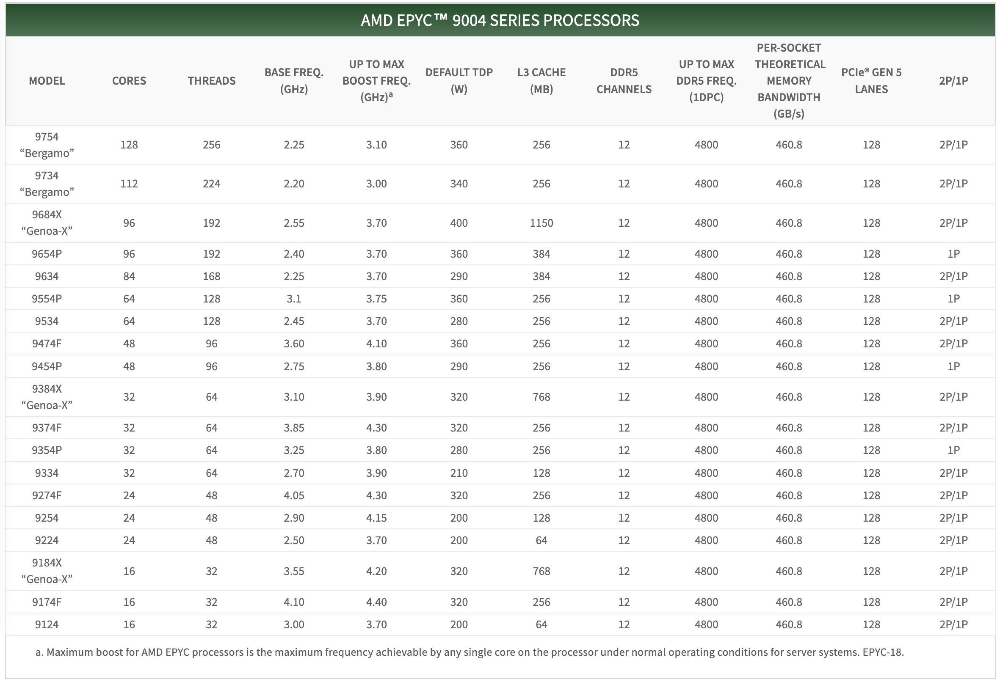
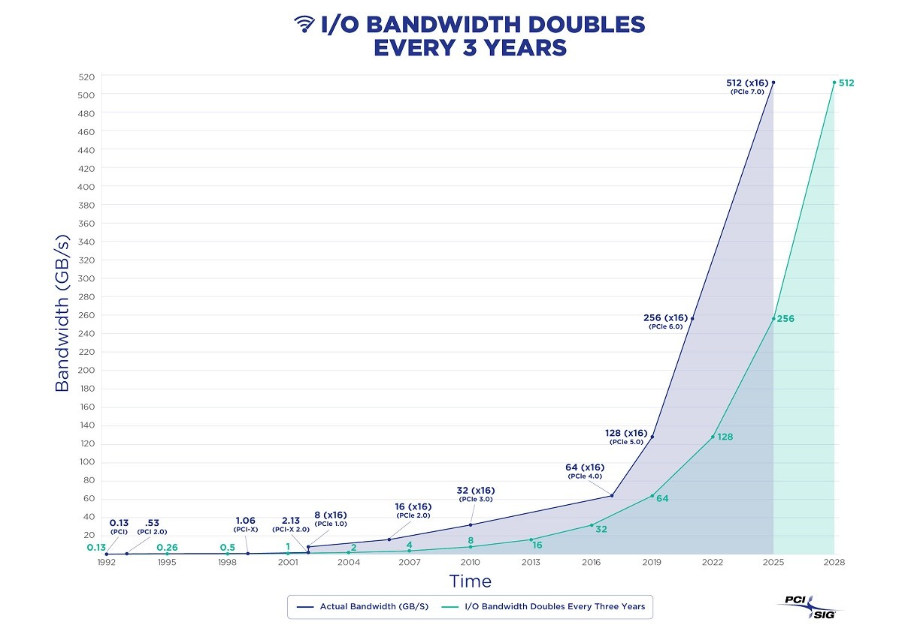
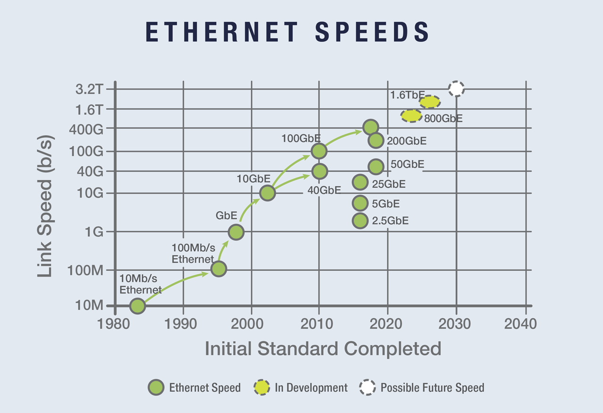

在当下，硬件重新变得有趣起来，AI 浪潮引发的显卡狂热便是例证。但有趣的硬件不仅仅是 GPU —— CPU 与 SSD 的变化却仍不为大多数开发者所知，有一整代软件开发者被云，或者炒作营销遮蔽了双眼，难以看清这一点。

许多软件与商业领域的问题的根都在硬件上：硬件的性能以指数模式增长，让分布式数据库几乎成为了伪需求。硬件的价格以指数模式衰减，让公有云从普惠基础设施变成了杀猪盘。基本工作假设的变化，将触发软件技术的重估。是时候拨云见日，正本清源了。让我们重新认识现代硬件，拿回属于用户自己的红利。

-----------

## 性能翻天的新硬件

如果您有一段时间没有接触过计算机硬件了，那么当下新硬件的这些数字可能会让你感到非常震惊。

曾几何时，Intel 的 CPU 以挤牙膏著称，每一代进步微乎其微，老电脑可以再战一年又一年。但最近，处理器演进的速度骤然加快，增益不再是“微不足道”，核数在迅速增长，单核性能定期跃进 20-30%，而且这种进步积累的很迅速。

例如，AMD 刚刚发布的桌面级 CPU Threadripper 7995WX ，单颗 96核192线程 ✖️ 2.5 ~ 5.1 GHz 的性能怪兽，亚马逊零售价也才 5600美元。服务器 CPU 霄龙 EPYC 系列：上一代 [EPYC Genoa 9654](https://www.amd.com/en/products/cpu/amd-epyc-9654) ，单颗 96核192线程✖️ 2.4 ~ 3.55 GHz ，Amazon 零售价 3940美元。今年新款[霄龙9754](https://www.amd.com/zh-hans/products/cpu/amd-epyc-9754) 更是干到了单 CPU 128 核 256 线程，这意味着一台普通双插槽服务器的 vCPU 数量可以达到惊人的 512 核！要是按云计算/容器平台 500% 超卖率，可以虚拟出两千五百多台1核虚拟机来。

SSD/NVMe 存储上的代际跃进幅度甚至比 CPU 领域还要大得多。我们快速地从Gen2约 500MB/s 的速度，到 Gen3 约2.5GB/s，再到目前主流 Gen4约 7GB/s；Gen5的 14GB/s 的SSD 刚开始崭露头角，Gen6 标准已经发布，Gen7 在路上，I/O带宽以翻倍的方式指数增长。

以 Gen5 NVMe SSD: [KIOXIA CM7](https://www.storagereview.com/review/kioxia-cm7-gen5-enterprise-ssd-review) 为例，128K顺序读带宽 14GB/s 写带宽 7GB/s，4K 随机IOPS 读 2.7M，写 600K。恐怕现在还没有多少数据库软件能够充分利用这种疯狂的读写带宽与 IOPS。作为一个简单对照，我们回头看一下机械硬盘的带宽和IOPS，机械硬盘总体读写带宽大概在一两百 MB/s 上下浮动。7200 转硬盘的 IOPS 约几十，15000 转硬盘的 IOPS约为一两百。是的，**NVMe SSD 的I/O带宽速率已经比机械硬盘好了四个数量级，整整一万倍。**

在数据库最关注的 4K 随机读/写响应时间上，NVMe SSD 的经典值为 读 55µs / 写 9μs，前几代就有这个水平了。这是什么概念？还是和机械硬盘比一下：机械硬盘的寻道时间通常在 10ms 量级， 平均旋转延迟视转速在 2ms - 4ms，那么一次 I/O 通常需要十几个毫秒。十几毫秒 vs 55/9µs ，**NVMe SSD 比机械磁盘快了三个数量级 —— 一千倍！**

除了计算与存储外，网络硬件当然也有进步，40GbE 和 100 GbE 已经烂大街了 —— 一个 100Gbps 的光模块网卡也就万把块钱，而 12 GB/s 的网络传输速度比老程序员耳熟能详的千兆网卡**快了整整一百倍**。

计算，存储，网络硬件的性能继续以摩尔定律指数增长的方式在演进与发展，硬件领域重新变得有趣起来。但更有趣的是硬件的技术飞跃会为世界带来什么？

-----------

## 分布式不再受待见

硬件十年间的变化已称得上沧海桑田，而这让许多软件领域的工作假设都不再成立：比如[分布式数据库](/db/distributive-bullshit/)。

在当下，一台普通x86服务器的能力上限已经达到了一个非常惊人的程度  —— 这里有一个有趣的[草稿演算](https://thume.ca/2023/01/02/one-machine-twitter/)，粗略证明了将整个 Twitter 运行在一台这样的现代服务器上的可行性（ Dell PowerEdge R740xd，32C，768GB RAM、6TB NVMe、360TB HDD、GPU插槽和 4x40Gbe 网络）。尽管出于生产冗余的考虑你并不会这么做（用两台或者三台可能更保险一些），但这个计算确实抛出了一个很有趣的问题 —— **可伸缩性是否还是一个真正的问题？**

在本世纪初，一台 Apache 服务器只能处理很可怜的一两百个并发请求。最优秀的软件也很难处理上万的并发 —— 业界有个著名的 C10K 高并发问题，谁要是能做到几千并发，那就是业界高手。但随着 Epoll 和 Nginx 在 2003/2004 年相继问世，“高并发” 不再是什么难题了 —— 随便一个小白只要学会配置 Nginx，就可以达到前几年大师们做梦都不敢想的程度。 《[云厂商眼中的客户又穷又闲又缺爱](https://mp.weixin.qq.com/s/N8AYreKZ5OzNGWFb3m0EsQ)》

在 2023 年的今天，硬件的冲击让同样的事再次发生在分布式数据库上：**可伸缩性（Scalability）和二十年前的 C10K 一样，成为了一个已解决的历史问题**。如果推特这样的业务可以跑在单台服务器上，那么99.xxxx+ % 的业务终其生命周期，对可伸缩性的需求都不会超出这样一台服务器。这意味着这些大厂高P骄傲的“分布式”独门技术，在新硬件的冲击下沦为鸡肋 —— **如果今天还有人津津乐道什么分表分布式海量规模高并发，只能说明一件事：这哥们过去十年已经停止学习了，还活在上一个时代里。**

分布式数据库的基本工作假设是：单机的处理能力不足以支撑负载。然而这个支撑其存在价值的基础工作假设，在当代硬件面前已经不攻自破 —— 集中式数据库甚至什么都不用做，它的载荷上限就自动拔高到绝大多数务终生都无法触及的地步。确实会有人抬杠说，我们微信/我们支付宝就是有这样的场景需要分布式数据库 —— 且不说这个问题是不是一定要分布式数据库来解决，就算我们假设这种屈指可数的极端场景足够养活一两个分布式TP内核，但在网络硬件的性价比重新击溃磁盘前，分布式 OLTP 数据库已经不可能是数据库领域发展的大方向了。作为大厂“分布式”显学代表的阿里巴巴就是一个很有代表性的例子 —— 数据库长子 OceanBase 选择了分布式的道路，而现在的数据库太子，二儿子 PolarDB 就又及时调整了方向，重新回到集中式的架构上。

在大数据分析 OLAP 领域，分布式以前也许可能是必不可少的，但是现在也存疑 —— 对绝大多数企业来说，其全部数据库量很有可能都能在一台服务器内完成处理。以前非要“分布式数仓”不可的场景，在当代的单机服务器上跑一个 PostgreSQL 或者 DuckDB 很可能就解决掉了。诚然像大型互联网公司确实有 PB/ZB 级别的数据场景，但即使是互联网核心业务，其单一业务数据量级也极少有超过单机处理极限的案例。举个例子，BreachForums 最近泄漏的淘宝5年的（2015-2020 82亿）购物记录数据大小压缩后 600GB，同理，京东百亿，拼多多 145亿数据的大小也基本类似。更何况，戴尔或者浪潮都提供了**PB级**的NVMe全闪存储机柜产品，整个美国保险行业的全量历史数据和分析任务就可以塞进这样单个盒子，而只要二十万美元不到的价格。

分布式数据库的核心权衡是：“**以质换量**”，牺牲功能、性能、复杂度、可靠性，换取更大的数据容量与请求吞吐量。然而“*过早优化是万恶之源* ”，为了不需要的规模去设计是白费功夫。如果量不再成为问题，那么为了不需要的量去牺牲其他属性，付出额外的复杂度成本与金钱成本就成了一件毫无意义的事情。

-----------

## 自建服务器的成本

新硬件的性能如此强悍，那成本又如何呢？摩尔定律指出，**每18～24个月，处理器性能翻倍，成本减半**。比起十年前，新硬件性能更加强悍，但价格反而更加便宜了。

在 《[下云奥德赛：是时候放弃云计算了吗？](/cloud/odyssey/)》中，我们有一个新鲜的公开采购样本可以参考。下云先锋 DHH，37 Signal 在 2023 年为下云采购了一批物理机：他们从戴尔买了20台服务器：共计 4000核 vCPU，7680GB 的内存，以及 384TB 的 NVMe 存储，加上其他东西，总开销为50万美金。每台服务器具体配置规格为：Dell R7625 服务器，192 vCPU / 384 GB 内存：两颗 AMD EPYC 9454 处理器（48核/96线程，2.75 GHz），配置 2 x vCPU 的内存（16根32G内存条），一块12 TB NVMe Gen4 SSD，再加上其他配件，**一台服务器成本两万美金（$19,980），按五年摊销是 333美元/每月**。

想要核实这个报价的有效性，我们可以直接参考零售市场上核心组件的价格：CPU 是 EPYC 9654 ，当下零售价格 3,725 美元一颗，两颗总计  \$7450。32GB 的 DDR5 ECC 服务器内存，零售单价 \$128 一条，16条共计 \$2048。企业级 NVMe SSD 12TB，售价 $2390。 100G 光模块 100GbE QSFP28 报价 1804 美元，加起来 \$13692 左右，加上服务器准系统，电源，系统盘，RAID 卡，风扇之类的东西，总价两万美元内并没有没什么问题。

当然，服务器并不是只有 CPU ，内存，硬盘，网卡这些零件，我们还需要考虑总体持有成本。数据中心里还要为这些机器提供电力、机位和网络，代维费用，并预留冗余量（美国的价格）。这部分开销核算后基本与每月硬件摊销费用持平，所以每台 192C / 384G / 12T NVMe 存储的**服务器每月综合成本为 666 美元，核月人民币成本为 25.32 元**。

我相信 DHH 给出这个数字没有什么问题，因为在探探时，我们从第一天就选择用 IDC / 资源云自建，经过了多轮成本优化做到的极致状态也差不多是这个价格 —— 我们采购的数据库服务器机型（Dell R730, 64 vCPU / 512GB / 3.2 TB NVMe SSD）加上人力代维网电成本后一台 **TCO 约为七万五人民币，按五年摊销计算核月成本为 19.53 元**。这里有一个表格，可以作为单位算力的价格参考：

|              EC2               |    核·月    |              RDS               |   核·月   |
|:------------------------------:|:---------:|:------------------------------:|:-------:|
|     DHH 自建核月价格（192C 384G）      | **25.32** |         初级开源数据库DBA参考工资         | 15K/人·月 |
|    IDC自建机房（独占物理机: 64C384G）     | **19.53** |         中级开源数据库DBA参考工资         | 30K/人·月 |
|       IDC自建机房（容器，超卖500%）       |     7     |         高级开源数据库DBA参考工资         | 60K/人·月 |
|    UCloud 弹性虚拟机（8C16G，有超卖）     |    25     |          ORACLE 数据库授权          |  10000  |
|     阿里云 弹性服务器 2x内存（独占无超卖）      |    107    |      阿里云 RDS PG 2x内存（独占）       |   260   |
|     阿里云 弹性服务器 4x内存（独占无超卖）      |    138    |      阿里云 RDS PG 4x内存（独占）       |   320   |
|     阿里云 弹性服务器 8x内存（独占无超卖）      |    180    |      阿里云 RDS PG 8x内存（独占）       |   410   |
| AWS C5D.METAL 96C 200G (按月无预付) |    100    | AWS RDS PostgreSQL db.T2 (2x)  |   440   |
| AWS C5D.METAL 96C 200G (预付三年)  |    80     | AWS RDS PostgreSQL db.M5 (4x)  |   611   |
| AWS C7A.METAL 192C 384G (预付三年) |   104.8   | AWS RDS PostgreSQL db.R6G (8x) |   786   |

-----------

## 与云租赁价格对比

作为参照，我们可以用 AWS EC2 算力租赁的价格作为对比。666 美元每月的价格，能买到的最好规格是不带存储的 [c6in.4xlarge](https://instances.vantage.sh/aws/ec2/c6in.4xlarge) 按需机型（16核32G x 3.5GHz）；而存算规格与这类服务器相同（192C/384G）但不含 EBS 存储的 [c7a.metal](https://instances.vantage.sh/aws/ec2/c6a.metal) 机型，按需费用是 7200 美元每月，是本地自建综合成本的 10.8 倍；预付3年的保留实例最低可以到 2756 美元每月，也就是自建服务器的 4.1 倍。如果我们以 vCPU / month 的方式计算核月成本，AWS 绝大多数 EC2 实例的核月单价在 \$10 ~ \$30 美元之间，也就是一两百块，所以我们可以得出一个粗略的计算结论：**云上算力的单位价格是自建的 5 ～ 10 倍**。

请注意，这里的价格并没有包括百倍溢价的 EBS 云盘存储。 在《[云盘是不是杀猪盘](/cloud/ebs/)》中，我们已经详细对比过企业级 SSD 和等效云盘的成本了。这里我们可以给出两个当下更新后的参考值，DHH 采购的 12TB 企业级 NVMe SSD（以质保五年算）TB·月成本为 24 元，而 GameStop 上零售的三星消费级 SSD 990Pro的TB·月价格更是能达到惊人的 6.6 元 …。而AWS与阿里云的对应块存储TB·月成本在满打满算折扣的情况下分别为 1900 与 3200。在最离谱的情况下（6400 vs 6.6 ）溢价甚至可以达到千倍，不过更为 Apple to Apple 的对比结果：**云上块存储的单位价格是自建的 100 ～ 200 倍** （且性能并没有本地磁盘好）。

EC2 和 EBS 的价格可以说是云服务的定价之锚，例如，主要使用 EC2 与 EBS 的云数据库 RDS 相对于本地自建的溢价倍率，视您的存储使用量就在两者间波动：**云数据库的单位价格是自建的十几倍到几十倍**。详情请参考《[云数据库是不是智商税](/cloud/rds/)》。

当然，我们也不能否认公有云在小微实例，企业初创起步阶段的成本优势 —— 比如，公有云上用来凑补的 1～2C，0.5～2G 的  nano 实例确实是可以按照十几块钱核月的成本价给到用户。在《[薅阿里云ECS羊毛，打造数字家园](/cloud/cheap-ecs/)》中我推荐薅阿里云双十一99虚拟机也是这个原因。比如，以五倍超卖算 2C 2G 的服务器算力成本是每年84元，40G 云盘价按三副本算一年存储成本20来块钱，光这两部分每年成本就过百了。这还没有算公网IP，以及价值更高的 3M 带宽（例如你真能把3M带宽24小时打满，那么一天流量32G就是25块钱）。这种云服务器的列表价是 ¥1500 一年，因此 99¥ 并允许低价续费用4年，确实可以算得上赔本赚吆喝的福利了。

但是当你的业务不再是一大堆小微实例可以 cover 的时候，你真的应该重新仔细再算一下账：在几个关键例子上，云的成本都极其高昂 —— 无论是大型物理机数据库、大型 NVMe 存储，或者只是最新最快的算力。租用生产队的驴价钱是如此高昂 —— 以至于几个月的租金就能与直接购买它的价格持平。在这种情况下，你确实应该直接把这头驴买下来！

-----------

## 重新拿回硬件红利

我还记得在 2019年4月1日，国内增值税正式从 16% 下调到 13% ，苹果官网随即[全面降价](https://www.lifeweek.com.cn/article/71403)，单品最高降价幅度达8% —— iPhone的几个典型产品都降了500元，把税点返还给了用户。但也有许多厂商选择装聋作哑维持原价，自己吃下这个福利 —— 白花花的银子怎么能随便散给穷人呢？类似的事情就发生在云计算领域 —— 硬件成本的指数下降，并没有在云厂商的服务价格上充分反映出来，而这一点，让公有云逐渐从普惠基础设施变成了垄断集中杀猪盘。

上古时代，开发者写代码是要深入了解硬件的，然而老一辈带有硬件 Sense 的工程师与程序员，很多已经退休/转岗/转管理/停止学习了。后来操作系统与编译器技术愈发强大，各种VM编程语言出现，软件已经完全不需要关心硬件是如何完成指令的；再后来，EC2 封装了算力，S3 / EBS 封装了存储，应用开始和 HTTP API 而不是系统调用打交道。软件和硬件分离为两个世界，分道扬镳。整整一代新工程师原生成长在云环境中，被屏蔽掉了对计算机硬件的了解。

然而事情正在起变化，硬件重新变得有趣起来，而云厂商是没有办法把这部分红利永远掩藏遮盖下去 —— **聪明的人开始计算数字，勇敢的人已经采取行动**。像马斯克和DHH这样的先锋已经充分认识到了这一点，从云上下来，脚踏实地 —— 直接产生千万美元的财务效益，并且还有性能上的回报，运营也变得更加自主独立。越来越多的人会同样意识到这一点，追随先驱者做出明智的选择，拿回属于自己的硬件红利。
