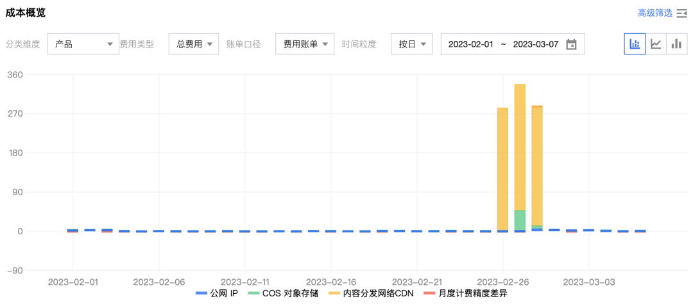
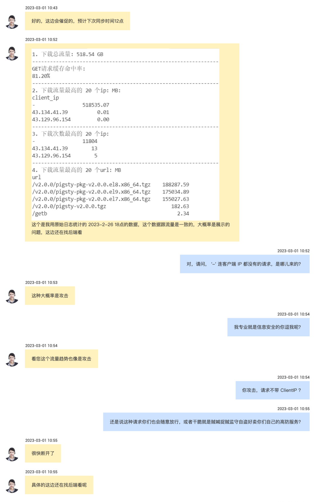
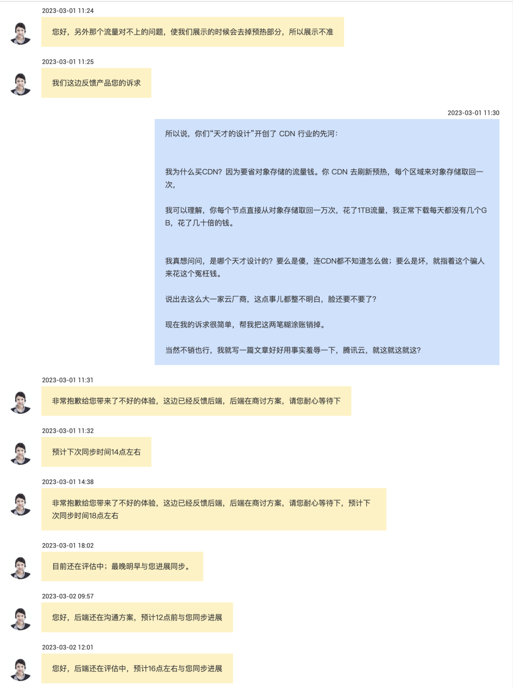

While Swedish Ma and I disagree sharply on [cloud databases](/cloud/rds) VS [**DBA**](https://mp.weixin.qq.com/s/Gk9bG_EOIv0IAkim41XRHg) issues, we can reach consensus on one point: **domestic public cloud vendors really make garbage**. In Ma's words: "**Alibaba Cloud is a legitimate cloud with poor engineering quality, but Tencent Cloud is a bunch of amateur salespeople plus business coders playing games**."

-------------

## Background

I have software hosted on **GitHub**, providing **1MB** source code packages and **1GB** offline software package downloads. Since mainland users can't download from **GitHub** domestically, I needed a domestic download address, so I used Tencent Cloud's **COS** (Object Storage) and **CDN** (Content Delivery Network) services.

My **CDN** intentions were simple: 1. Acceleration, 2. Cost savings. Internet traffic fees are usually 0.8 yuan per GB, using **CDN** traffic packages can save substantial traffic costs by half. Since CDN is exclusively for domestic users, I only bought domestic traffic packages. It worked reasonably well until late February, when I suddenly discovered some anomalous charges.

Clicking in, I saw CDN charged **several hundred yuan**. I thought maybe some channel made downloads popular? So I entered the data statistics analysis interface and saw that during this period, total software package downloads were less than **100GB**, at most tens of yuan — how could I be charged hundreds?

Clicking for analysis — good grief, 1TB access traffic, all from "**overseas other**" — what the hell?

**So I called Tencent Cloud customer service:**

**Deflection x1: Our TOP isn't accurate, you need to check logs.**

So I downloaded a log copy to see who was bored enough to brute-force attack. Result: a bunch of requests without even client IP addresses.

**Deflection x2: Customer service said this is probably an "attack"! So scary!**

This rhetoric trying to fool me? **Uninformed users hearing "attack" might get scared into buying public cloud vendors' "high-defense services."**

After going in circles for another half hour, they finally told me the real reason: **traffic fees were deducted for "warming up"**. So these requests without "source IPs" finally revealed the truth: **turns out it's "guarding and stealing, thief crying thief" — your own system came to brute-force my traffic!**

Engineer phone communication explained: Our CDN warming works like this — all CDN nodes come to origin for requests, so we got these 20,000 requests and **1TB** traffic.

Hearing this explanation, I nearly burst out laughing. **Why do I buy CDN? To save object storage traffic costs. CDN refreshing and warming is cloud vendor internal system traffic — why should users pay for it?** But **your one refresh warming cost more than a year's worth of direct object storage downloads.**

Fine, let's say warming requires payment — an engineering-logical approach would be each major region requesting object storage origin once, then distributing and syncing to each terminal node. Paying several times traffic fees, I wouldn't mind. **1GB** software costing **10GB** warming, customers wouldn't complain.

Tencent Cloud CDN is different — warming a 1MB/1GB software package, each terminal node directly requests, generating **1TB** "warming traffic." At 0.8 yuan per **1GB** traffic fee, hundreds of yuan vanished. More absurd: my CDN serves mainland users, overseas users don't need it — direct GitHub downloads work fine — yet all this traffic went "overseas," and **pre-purchased domestic traffic packages couldn't offset it at all**. Tencent Cloud's documentation never mentioned the volume and origin of this "warming." I believe this constitutes factual fraud and malicious pig-butchering schemes, far worse than [《Are Cloud Databases Intelligence Taxes?》](/cloud/rds/).

**So a simple 1MB/1GB software package going through CDN distribution, which might normally cost a few yuan daily, became hundreds of yuan with one button click**. **Hiding internal traffic well on monitoring charts; stuffing internal traffic that should be free onto users in billing logic.**

> **CDN warming internal traffic — how dare they charge users?**

A few hundred yuan cost doesn't hurt me, but as a user, I feel my intelligence was insulted. Tencent Cloud suggested refunding half — how about full refund? **I didn't take a cent — I just want to write an article telling everyone how crappy and idiotic this product is**.

**Alibaba Cloud, whatever else, at least gets some respect from me in certain areas. But Tencent Cloud's performance truly disgraces Chinese public cloud — such a large company coming out to do cloud without understanding such basic things. No wonder people say:**

**China has no cloud computing, only IDC 2.0**

Coming out to sell like this — better wash up and sleep early.

-------------

## Extended Reading

For more of Tencent Cloud's brilliant performances, enjoy previous articles from the Cloud Computing Shotgun series:

[1] [Why Does Tencent Cloud Team Use Alibaba Cloud Service Names?](https://mp.weixin.qq.com/s/tuyv9nGQPaQRWD_q4EXpMw)

[2] [Are Customers Lousy, or Is Tencent Cloud Lousy?](https://mp.weixin.qq.com/s/aP5FgFQ39u-UKC9mE4HKug)

[3] [Tencent Cloud: From Getting Started to Giving Up](https://mp.weixin.qq.com/s/JnK3sIPozZqe2kFoFO1mJg)

[4] [Are Tencent Cloud and Alibaba Cloud Really Doing Cloud Computing? -- From Customer Success Case Perspective](https://mp.weixin.qq.com/s/mMvDiTiMOt6eiTTYbHvbbQ)

[5] [Who Exactly Are Domestic Cloud Vendors Serving?](https://mp.weixin.qq.com/s/_eiZPNfz8OUP5iHBJ-oxJA)

[6] [Cloud Computing Vendors, You've Failed Chinese Users](https://mp.weixin.qq.com/s/wGuGrtzmfDj9gIFUGNJ30g)
