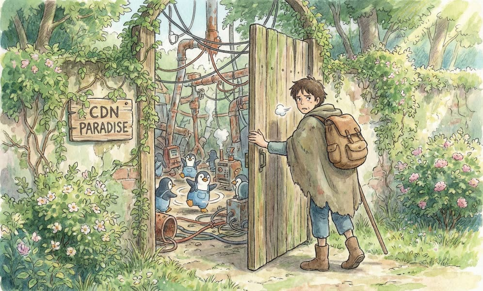
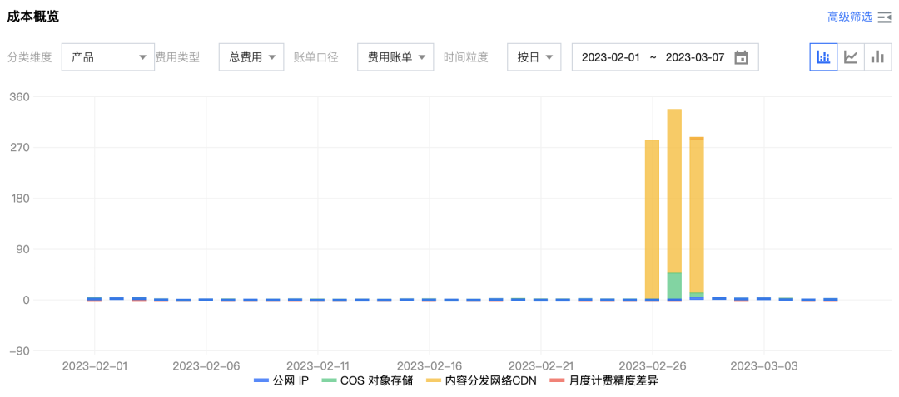
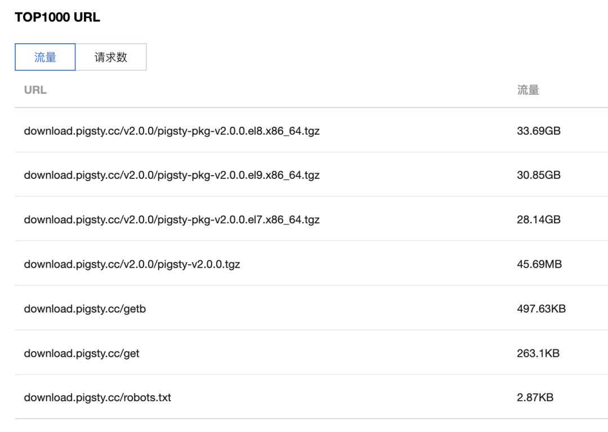
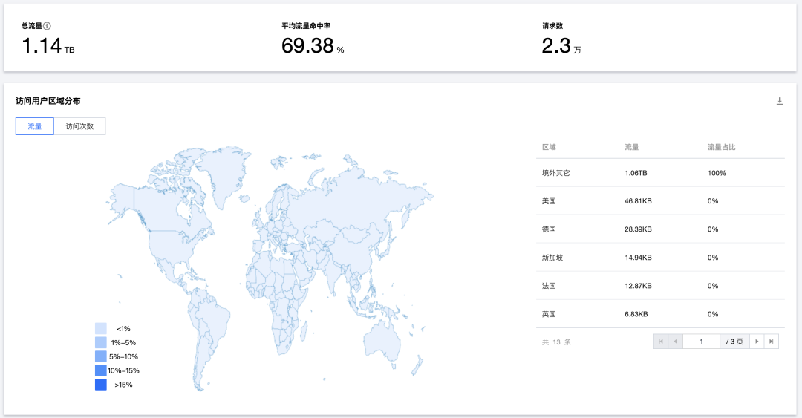
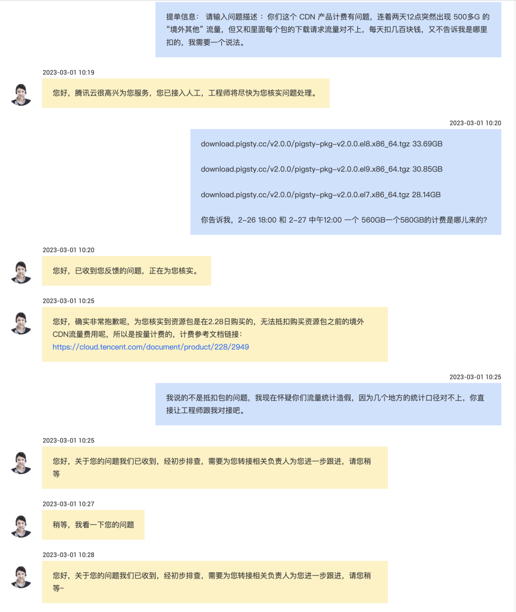
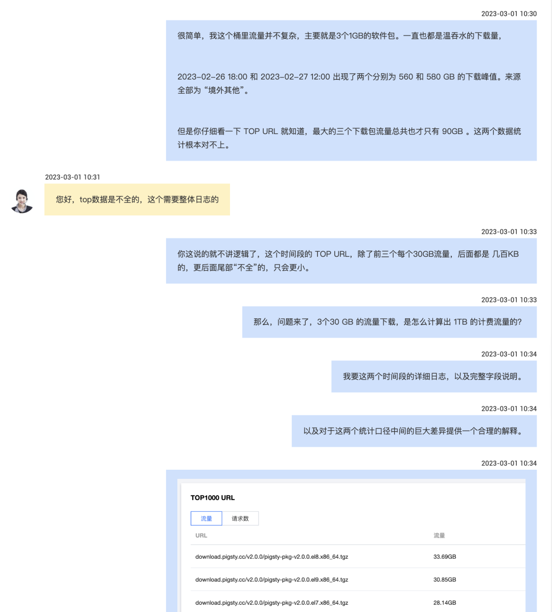
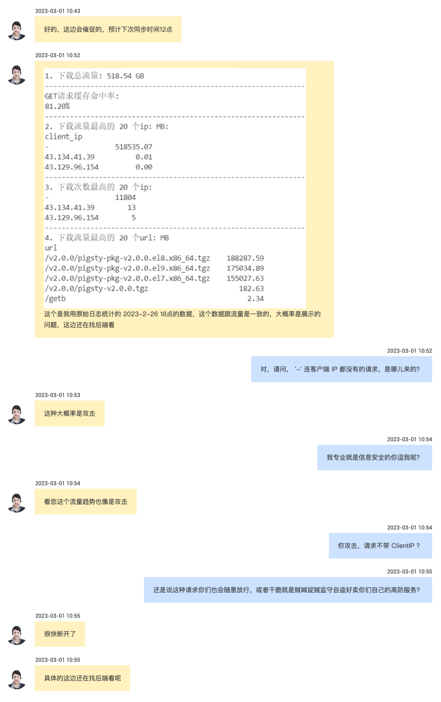
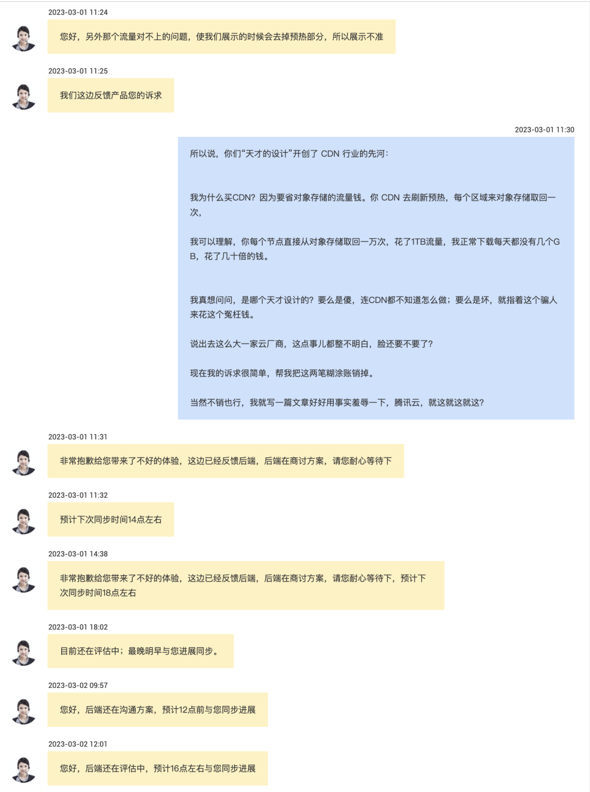
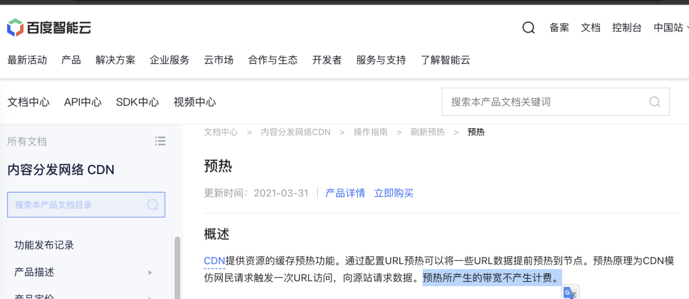

我和 瑞典马工虽然在 [云数据库](/zh/blog/cloud/rds) VS [**DBA**](https://mp.weixin.qq.com/s/Gk9bG_EOIv0IAkim41XRHg
) 这个议题上针锋相对，但在一点上能达成共识：至少**国内的公有云厂商做的是真垃圾**。用马工的话来说就是：“**阿里云是个工程质量差劲的正经云，但腾讯云是一群业余销售加业务码农玩游戏**”。

-------------

## 前因后果

我有个软件托管在 **GitHub** 上，提供了 **1MB** 的源码包和 **1GB** 的离线软件包下载。大陆用户因为 在境内 没法从 **GitHub** 下载，因此需要有一个境内的下载地址，于是我就用了腾讯云的 **COS**（对象存储） 与 **CDN**（内容分发网络）服务。

用 **CDN** 的初衷不外乎：1. 加速，2. 省钱。互联网流量费通常是 8毛钱1GB，使用 **CDN** 流量包可以节省不少流量费打对折。当然，因为 CDN 就是给境内用户专用的。所以我也只买了境内的流量包。一直以来也用的还算可以，直到 2月底，我突然发现，怎么冒出来几笔异常费用。

点进去一看，CDN 收了**几百块钱**，我还想，难道是哪里渠道带火了下载？于是进入 数据统计分析界面一看，这段时间里，总共软件包也就是 **100GB** 不到的下载流量，撑死了几十块钱，怎么会我收几百块呢？

点看分析一看好家伙，1TB的访问流量，全是 “**境外其他**”，什么鬼？

**于是，呼出腾讯云客服来：**

**甩锅 x 1，我们这个 TOP不准，要看日志哈**。

那我就下载一份日志来看看，究竟是谁吃饱了撑着来爆破。结果，里面一大堆请求连客户端 IP 地址都没有。

**甩锅 x 2 ，客服说，这种大概率是被**攻击**了！好怕怕啊！**

这种话术还想忽悠我？**不懂行的用户一听”攻击“，说不定就被拐带着跑去买公有云厂商的”高防服务“了。**

绕了一圈又等了半个小时，终于告知了我真正的原因，**流量费是“预热”扣除的**。所以这些没有 “来源IP”的请求终于真相大白了：**原来是“监守自盗，贼喊捉贼”，你们自己的系统跑过来爆破俺的流量啊！**

工程师电话沟通告知说：我们的 CDN 预热是这样的，所有的 CDN 节点都会来回源请求，所以才有的这两万次请求与 **1TB** 流量。

听到这样的解释，我都要笑喷了。**我为什么买CDN？因为要省对象存储的流量钱。CDN 去刷新预热，这是云厂商自己系统内部的流量，为啥要挂在用户身上付费？**但是**你刷新预热一下，一下花掉了我直接走对象存储下载一年都用不了的钱。**

好吧，就算我们退一万步讲预热要付费，一个合乎工程逻辑的做法是，每个大区域来对象存储回源一次，然后再下发同步到每个终端节点上。付个几倍流量费，我也不会介意的。**1GB** 的软件花个 **10GB** 预热一下，客户也不会说什么。

腾讯云 CDN则不然，一个1MB/1GB的软件包预热，每个终端节点直接来请求，产生 **1TB** 的“预热流量”。八毛钱**1GB** 流量费，几百块就没了。更滑稽的是，我 CDN 是给大陆用户使用的，墙外用户根本用不着，直接 Github 下载就好了，而这些流量全都跑到“境外”去了，**事先买好境内的流量包压根不能抵扣**。而腾讯云的文档上也压根没有提及，这些 “预热” 究竟有多大的量和来自哪里。我认为，这已经构成了事实上的欺诈与恶意引导杀猪盘。比 《[云数据库是不是智商税](/zh/blog/cloud/rds/)》还要恶劣的多。

**所以，一个简简单单的 1MB / 1GB 的软件包要走 CDN 分发，本来可能一天也没几块钱的东西，点一下按钮，大几百块就没了**。**在监控图表上，把内部的流量藏的好好的；在计费逻辑上，把本应免费的内部流量硬塞到用户头上。**

> **CDN预热内部流量也好意思向用户收钱？**

几百块钱的成本对我来说不痛不痒，但我作为用户，感觉到智商受到了羞辱。腾讯云提议退一半钱给你好不好？全退给你好不好？**我也一分没要，我就是要写一篇文章告诉大家，这个产品做的有多烂多傻逼**。

**阿里云不管怎么样，起码在某些方面我还会表示一下敬意。而腾讯云的表现，实实在在是彻底丢了中国公有云的脸，这么大一厂商，这点事儿都弄不明白就出来做云。也难怪别人会说：**

**中国没有云计算，有的只是 IDC 2.0**

就这个样子出来卖，还是早点洗洗睡吧。

-------------

## 扩展阅读

更多腾讯云的精彩表现，可以欣赏云计算霰弹枪的往期文章：

[1] [腾讯云团队为什么用阿里云的服务名？](https://mp.weixin.qq.com/s/tuyv9nGQPaQRWD_q4EXpMw)

[2] [究竟是客户差劲，还是腾讯云差劲？](https://mp.weixin.qq.com/s/aP5FgFQ39u-UKC9mE4HKug)

[3] [腾讯云：从入门到放弃](https://mp.weixin.qq.com/s/JnK3sIPozZqe2kFoFO1mJg)

[4] [腾讯云阿里云做的真的是云计算吗?--从客户成功案例的视角](https://mp.weixin.qq.com/s/mMvDiTiMOt6eiTTYbHvbbQ)

[5] [本土云厂家究竟在服务谁？](https://mp.weixin.qq.com/s/_eiZPNfz8OUP5iHBJ-oxJA)

[6] [云计算厂商们，你们辜负了中国的用户](https://mp.weixin.qq.com/s/wGuGrtzmfDj9gIFUGNJ30g)

