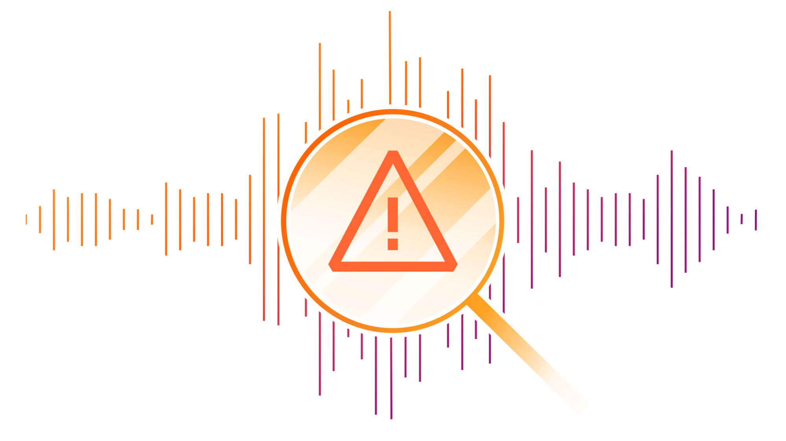
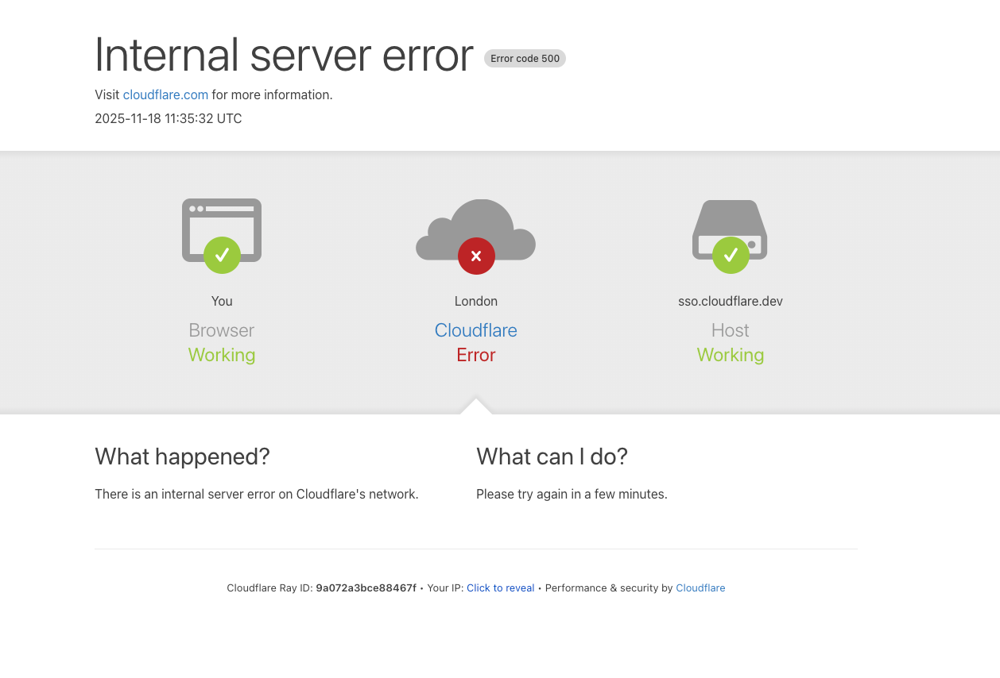
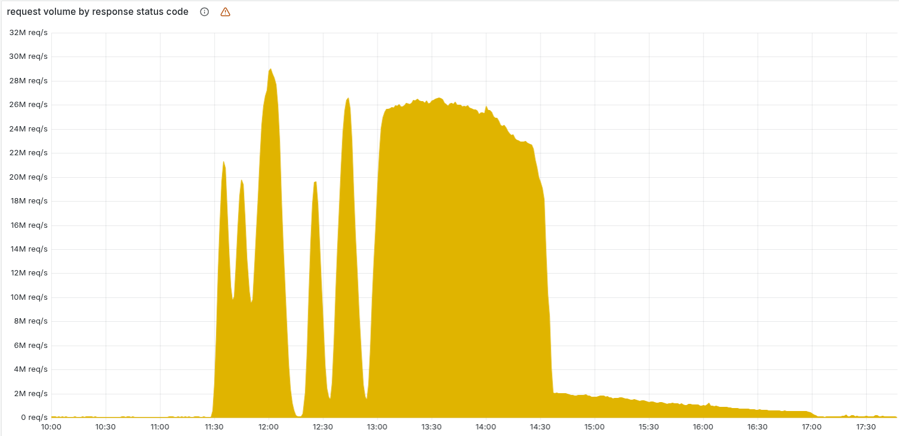
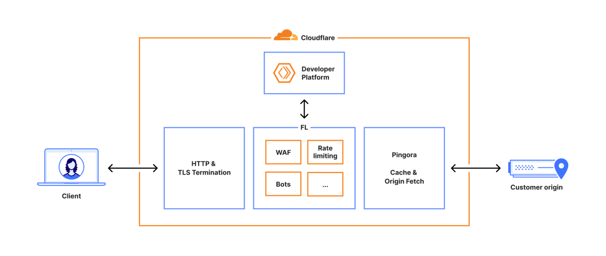
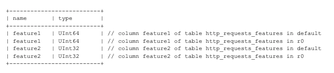
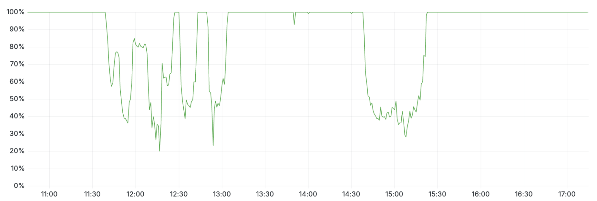
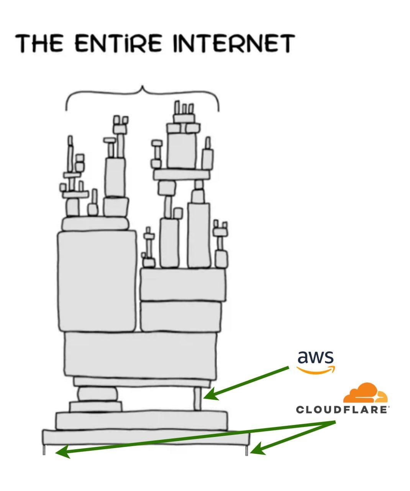
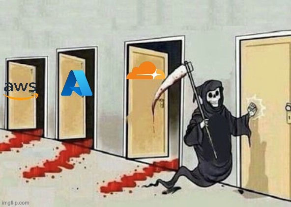

就在昨天，有 “赛博佛祖” 之称的 Cloudflare 遭遇自 2019 年以来的最严重故障 —— 正常的核心网络流量无法传输，长达六个小时。
ChatGPT、X（前 Twitter）、Spotify、Uber 等知名服务悉数中招。

故障的根因是修改了 ClickHouse 的权限，导致生成的反爬特征太大（200条），撑爆了 Rust 写的 Bot管理软件的硬编码限制，导致大量流量被标记为爬虫而被阻断。

Cloudflare 团队今天早上在其博客发布了[故障复盘文章](https://blog.cloudflare.com/18-november-2025-outage/)，老冯将其翻译为中文，并附上点评。


--------

## Cloudflare 2025年11月18日服务中断

> https://blog.cloudflare.com/18-november-2025-outage/



2025年11月18日11:20 UTC（本文所有时间均为 UTC），Cloudflare 的网络开始出现核心网络流量传输的严重故障。
对于尝试访问我们客户网站的 Internet 用户而言，这种故障表现为一个错误页面，提示 Cloudflare 网络内部发生了故障。



此次问题并非由任何形式的网络攻击或恶意活动直接或间接导致。相反，起因是我们一个数据库系统的权限更改，
导致该数据库将多个条目输出到了我们的 Bot 管理系统所使用的一个“特征文件”中。
该特征文件的大小因此翻了一倍。这个超出预期大小的特征文件随后被分发到构成我们网络的所有服务器上。

运行在这些服务器上的软件（用于在我们的网络中路由流量）会读取这个特征文件，以使我们的 Bot 管理系统能够应对不断变化的威胁。
该软件对特征文件的大小设有一个上限，而这个上限低于特征文件翻倍后的大小，导致软件发生了故障。

最初，我们误以为所观察到的症状是一场超大规模 DDoS 攻击所致。
后来，我们正确地识别出了问题的核心原因，并阻止了那个超出预期大小的特征文件继续传播， 将其替换为之前的一个版本。
到 14:30 时，我们的大部分核心流量已经基本恢复正常。此后几小时里，随着流量回升，我们团队持续努力减轻网络各部分面临的过载问题。
截至 17:06，Cloudflare 的所有系统均已恢复正常。

我们对本次事件给客户和整个 Internet 带来的影响深表歉意。
鉴于 Cloudflare 在互联网生态系统中的重要性，我们的任何系统发生中断都是不可接受的。
而我们的网络有一段时间无法路由流量，这让我们团队的每一名成员都深感痛心。我们知道，今天我们让大家失望了。

本文将深入详述事件的经过，以及哪些系统和流程出现了故障。
这也是我们开始着手采取行动以确保类似中断不再发生的起点（但绝非结束）。


## 故障概况

下图显示了 Cloudflare 网络返回的 HTTP 5xx 错误状态码数量。正常情况下，这个值应当非常低，事实在故障开始前也是如此。



在 11:20 之前，5xx 错误数量保持在我们预期的基线水平。之后的激增及随后的波动表明，由于加载了错误的特征文件，我们的系统发生了故障。
有一点值得注意：我们的系统随后一度自行恢复正常过一段时间——对于内部错误而言，这种现象非常不寻常。

原因在于，这个文件每隔五分钟由一个在 ClickHouse 数据库集群上运行的查询生成，而该集群当时正在逐步更新以改进权限管理。
只有当查询在已更新的集群节点上运行时，才会生成错误数据。因此，每隔五分钟，就有可能生成一套正确的或错误的配置文件，并迅速传播到整个网络。

这种波动使我们难以及时判断发生了什么，因为整个系统会先恢复正常，然后在下一次分发配置文件时（有时文件正确、有时文件错误）再次发生故障。
起初，这让我们认为故障可能是由攻击造成的。最终，当每个 ClickHouse 节点都开始生成错误的配置文件后，系统波动停止并稳定地处于故障状态。

错误一直持续到 14:30，我们才找到根本原因并着手解决问题。
我们通过停止生成和传播错误的特征文件，并手动将一份已知良好的文件插入特征文件分发队列来解决问题，随后强制重启了我们的核心代理。
上图中后面拖长的尾部曲线，代表我们的团队在逐步重启那些进入异常状态的服务；到 17:06 时，5xx 错误数量已恢复正常。

以下服务受到了影响：

- **核心CDN与安全服务**：返回 HTTP 5xx 状态码。（本文开头的截图展示了终端用户看到的典型错误页面。）
- **Turnstile**：无法加载。
- **Workers KV**：出现了显著升高的 HTTP 5xx 错误率，因为对 Workers KV “前端”网关的请求由于核心代理故障而失败。
- **Dashboard**：仪表盘基本保持可用，但由于登录页面上的 Turnstile 无法使用，大多数用户无法登录。
- **Email安全**：虽然邮件处理和传递未受影响，但我们观察到一度无法访问某个 IP 信誉数据源，导致垃圾邮件检测准确性降低，并使一些基于域名注册时长的检测未能触发（未发现严重的客户影响）。我们还观察到部分自动移动操作（Auto Move）失败；所有受影响的邮件均已过审查并得到处理。
- **Access**：从故障开始到 13:05 回滚期间，大多数用户的身份验证尝试都失败了（已有的 Access 会话不受影响）。所有这些失败的身份验证尝试都会出现错误页面，这意味着故障期间这些用户无法访问其目标应用。而在此期间成功的登录尝试都已被正确记录。尝试在故障期间进行的任何 Access 配置更新要么完全失败，要么传播非常缓慢；目前所有配置更新均已恢复正常。

除了返回 HTTP 5xx 错误，我们还观察到在故障影响期间 CDN 响应的延迟显著增加。
这是因为我们的调试和可观测性系统消耗了大量 CPU 资源——它们会在未捕获的错误中自动附加额外的调试信息。


## Cloudflare 请求处理流程及本次故障原因

每个发往 Cloudflare 的请求都会沿着我们网络中一条明确的路径进行处理。
请求可能来自加载网页的浏览器、调用 API 的移动应用，或者来自其他服务的自动化流量。
这些请求首先终止于我们的 HTTP 和 TLS 层，然后流入我们的核心代理系统（我们称之为 FL，即 “Frontline”），
最后经由 Pingora 执行缓存查找，或在需要时从源站获取数据。

我们曾在这里更详细地介绍过 [核心代理的工作原理](https://blog.cloudflare.com/20-percent-internet-upgrade/)。




当请求通过核心代理时，我们会运行网络中提供的各种安全和性能产品。
核心代理根据每个客户的特定配置和设置处理流量，从执行 WAF 规则、防御 DDoS 攻击，到将流量路由到开发者平台和 R2 等。
这一过程通过一系列特定领域的模块实现，这些模块对经过代理的流量应用相应的配置和策略规则。

这些模块中的一个 —— **Bot 管理模块**，正是此次故障的源头。

Cloudflare 的 [Bot管理系统](https://www.cloudflare.com/application-services/products/bot-management/) 包含多个子系统，
其中包括一个机器学习模型，我们用它为经过我们网络的每个请求生成“机器人分数”。
客户可以使用这个分数来控制哪些机器人被允许访问他们的网站，哪些则不被允许。

该模型使用一个“特征”配置文件作为输入。在这里，“特征”是指机器学习模型用来判断请求是否由自动程序发出的单个属性。特征配置文件是由各个独立的特征组合而成的集合。

这个特征文件每隔几分钟就会刷新并发布到我们整个网络上，使我们能够对 Internet 上不断变化的流量模式作出响应。
它让我们能够应对新型的机器人以及新的机器人攻击。因此，需要频繁且快速地发布该文件，因为恶意行为者往往很快改变策略。

在生成该文件的底层 ClickHouse 查询行为发生变化（详见下文）后，文件中出现了大量重复的“特征”行。
这使得原本固定大小的特征配置文件变得比预期更大，导致 Bot 模块触发了错误。

结果是，核心代理在处理任何依赖 Bot 模块的流量时都会返回 HTTP 5xx 错误。
这也影响到了依赖核心代理的 Workers KV 和 Access。

需要指出的是，我们当时正在将客户流量迁移到新版代理服务（内部称为 [FL2](https://blog.cloudflare.com/20-percent-internet-upgrade/)）。
旧版和新版代理引擎都受到了这一问题的影响，尽管表现出的影响有所不同。

使用新 FL2 代理引擎的客户遇到了 HTTP 5xx 错误。而使用旧版代理（FL）的客户虽然没有看到错误，但机器人分数未能正确生成，所有流量的机器人分数都变成了零。
那些基于机器人分数设置了封禁规则的客户会遇到大量误判；未在规则中使用机器人分数的客户则没有受到影响。

还有一个现象最初使我们误以为遇到了攻击：Cloudflare 的状态页也发生了故障。
状态页完全托管在 Cloudflare 基础设施之外，与 Cloudflare 系统没有任何依赖关系。
虽然事后证明这只是一个巧合，但它使得部分诊断团队成员一度认为攻击者可能同时针对了我们的系统和状态页。
在那段时间访问状态页的用户会看到如下的错误信息：


在内部事故聊天频道中，我们担心这可能是最近一系列高流量 [Aisuru DDoS 攻击](https://blog.cloudflare.com/defending-the-internet-how-cloudflare-blocked-a-monumental-7-3-tbps-ddos/) 的延续：


### 查询行为的变化

正如前文提到的，底层查询行为的更改导致特征文件中包含了大量重复行。此处涉及的数据库系统使用的是 ClickHouse 软件。

这里有必要说明一下 ClickHouse 分布式查询是如何工作的：一个 ClickHouse 集群由许多分片组成。
为了从所有分片查询数据，我们在名为 `default` 的数据库中使用所谓的分布式表（由 `Distributed` 表引擎提供支持）。
`Distributed` 引擎会查询名为 `r0` 的数据库中的底层表；这些底层表是每个分片上实际存储数据的地方。

对分布式表的查询是通过一个共享的系统账户执行的。作为提高分布式查询安全性和可靠性工作的其中一环，我们正在努力使这些查询改为在初始用户账户下运行。

在今天之前，当从 ClickHouse 的系统表（如 `system.tables` 或 `system.columns`）查询表的元数据时，用户只能看到 `default` 数据库中的表。

由于用户已经隐含拥有对 `r0` 数据库中底层表的访问权限，我们在 11:05 进行了改动，将这种访问权限显式化，以便用户也能看到这些表的元数据。
通过确保所有分布式子查询都在初始用户上下文中运行，我们可以更细粒度地评估查询限制和访问授权，从而避免某个用户的异常子查询影响到其他用户。

上述改动使得所有用户都可以获取到其有权限访问的表的准确元数据。
不幸的是，此前有些代码假定这类查询返回的列列表只会包含 “`default`” 数据库下的内容。例如下面的查询并没有按数据库名过滤：

```sql
SELECT name, type FROM system.columns 
WHERE table = 'http_requests_features' ORDER BY name;
```

注意，上述查询并未按数据库名称进行过滤。随着我们逐步在该 ClickHouse 集群上推出显式授权，
上述查询在 11:05 的改动后开始返回列的“重复”，因为结果中包含了存储在 `r0` 数据库中底层表的列。

不巧的是，Bot 管理特征文件的生成逻辑执行的正是上述类型的查询来构建文件中的每一个“特征”。

上述查询会返回一个类似下表所示的列清单（示例经过简化）：



然而，由于给用户授予了额外的权限，查询结果现在包含了 `r0` 模式下的所有相关元数据，有效地使响应行数增加了一倍多，最终导致输出文件中的特征数量大大超出正常范围。


### 内存预分配

我们的核心代理服务中的每个模块都设置了一些上限，以防止内存无限增长，并通过预分配内存来优化性能。在本例中，Bot 管理系统限定了运行时可使用的机器学习特征数量。
目前该上限设置为 200，远高于我们当前大约 60 个特征的使用量。再次强调，这个限制存在是出于性能考虑，我们会预先为这些特征分配内存空间。

当包含超过 200 个特征的错误文件被传播到我们的服务器时，这一限制被触发——系统因此发生了 panic。下面的 FL2（Rust）代码片段显示了执行该检查并导致未处理错误的部分：


由此产生了如下所示的 panic 日志，进而导致了 5xx 错误：

```
thread fl2_worker_thread panicked: called Result::unwrap() on an Err value
```

### 故障期间的其他影响

在此次事故中，其他依赖我们核心代理的系统也受到了影响，包括 Workers KV 和 Cloudflare Access。
在 13:04，我们对 Workers KV 实施了补丁以使其绕过核心代理，从而降低了这些系统所受的影响。
此后，所有依赖 Workers KV 的下游系统（例如 Access 本身）的错误率都降低了。

Cloudflare 仪表盘（Dashboard）也受到了影响，因为仪表盘内部使用了 Workers KV，且我们的登录流程中部署了 Cloudflare Turnstile。

这次中断也影响了 Turnstile：对于没有活跃仪表盘会话的用户，他们在事故期间无法登录。
仪表盘的可用性在两个时间段内下降：11:30 至 13:10，以及 14:40 至 15:30（如下图所示）。



第一个时间段（11:30 至 13:10）的可用性下降是由于 Workers KV 受到了影响——一些控制平面和仪表盘功能依赖于 Workers KV。
在 13:10，当 Workers KV 绕过核心代理系统后，这些功能恢复了正常。
第二个时间段的仪表盘可用性问题发生在恢复特征配置数据之后。
大量积压的登录尝试开始让仪表盘不堪重负。这些积压的请求结合用户重试操作，导致了高延迟，仪表盘可用性下降。
通过提升控制平面的并发处理能力，我们在大约 15:30 恢复了仪表盘的可用性。


## 补救措施和后续步骤

现在，我们的系统已经恢复正常运行，我们已经开始着手研究如何在未来加强系统抵御类似故障的能力。具体来说，我们将：

- 像对待用户生成的输入那样，强化对 Cloudflare 内部生成的配置文件的摄取和校验；
- 为功能启用更多全局性的紧急开关；
- 消除核心转储或其他错误报告占用过多系统资源的可能性；
- 审查所有核心代理模块在错误情况下的失效模式。

今天的事故是 Cloudflare 自 2019 年以来最严重的一次中断。
我们过去也出现过让仪表盘无法使用的停机，还有一些导致较新功能暂时不可用的故障。
但在过去超过 6 年的时间里，我们没有再出现过让大部分核心流量停止的中断。

像今天这样的中断是不可接受的。我们在架构设计上让系统具备高度的容错能力，以确保流量始终可以继续传输。
每次过去发生故障后，我们都会据此构建新的、更可靠的系统。

我谨代表 Cloudflare 全体团队，对我们今天给互联网带来的影响表示诚挚的歉意。

| 时间（UTC）     | 状态     | 描述                                                                                                                                                                     |
|-------------|--------|------------------------------------------------------------------------------------------------------------------------------------------------------------------------|
| 11:05       | 正常     | 数据库访问控制更改已部署。                                                                                                                                                          |
| 11:28       | 故障开始   | 新配置部署到客户环境，在客户的 HTTP 流量中首次观察到错误。                                                                                                                                       |
| 11:32–13:05 | 调查进行中  | 团队调查了 Workers KV 服务流量和错误率升高的问题。初始症状表现为 Workers KV 响应速度下降，导致 Cloudflare 其他服务受到下游影响。团队尝试通过流量调整和账户限制等措施使 Workers KV 恢复正常。11:31 自动测试首次检测到问题，11:32 开始人工调查，并在 11:35 发起了事故会议。 |
| 13:05       | 影响减轻   | 针对 Workers KV 和 Cloudflare Access 启用了内部绕过，使它们回退到较早版本的核心代理。虽然旧版核心代理也存在该问题，但其影响较小（如上文所述）。                                                                                |
| 13:37       | 准备回滚   | 我们确认 Bot 管理配置文件是事故的触发因素。各团队以多种途径着手修复服务，其中最快的方案是恢复该配置文件之前已知的良好版本。                                                                                                       |
| 14:24       | 停止发布   | 停止生成和传播新的 Bot 管理配置文件。                                                                                                                                                  |
| 14:24       | 测试完成   | 使用旧版本配置文件进行的恢复测试取得成功，我们随即开始加速在全球范围内部署修复。                                                                                                                               |
| 14:30       | 主要故障解除 | 部署了正确的 Bot 管理配置文件，大多数服务开始恢复正常。                                                                                                                                         |
| 17:06       | 全部恢复   | 所有下游服务均已重启，全部业务功能已完全恢复。                                                                                                                                                |


-------------

## 老冯评论

昨天在群里看到 Cloudflare 大故障的消息，老冯一看，自己托管在 Cloudflare 上的 [pigsty.io](https://pigsty.io) 站点也趴窝了，
还好老冯还有 Vercel 上的备用站点 [pgsty.com](https://pgsty.com)，和意一个中国区域的并行仓库站点 pigsty.cc 能用。
就在上周，老冯才刚刚把 Cloudflare Free 计划升级成 240 美元一年的计划，成为 “付费客户” ，就遇上这种戏剧效果，着实让我感到遗憾。

老冯是比较激进的下云派，但是对于 CDN 这样的服务，我还是依然心安理得的使用云 —— 主要是 Cloudflare，因为这玩意自建确实比较麻烦。
然而赛博佛祖慷慨归慷慨，但最近这几年的大型故障确实是越来越多了，而且一出现就是带崩百分之几十互联网的全局性大故障。
实话说，出故障大家都能理解，但整个行业都在一些低级错误上重复翻车，就实在是让人难绷了。


### 又一次多米诺骨牌事件

这份故障复盘报告揭示了一些有趣的细节 —— 这是又一次多米诺骨牌级联故障 —— 
从 ClickHouse 权限变更，传导到 Bot管理模块，再传导到核心流量分发功能上。

ClickHouse 权限变更，导致查询得到的特征数据从 < 60 行，变为 200 行。
然后 CF 因为出于性能考虑（well，也许是成本，省内存就是省钱，它们还特意强调下是出于性能的考虑），
静态分配了 Bot 管理软件使用的内存，指定了一个上限，而两百行特征数据打爆了这个上限，Rust 写的 Bot 管理工具就趴窝了。

于是，分数未能正确生成，所有流量的机器人分数都变成了零。（“大致意味着 —— 所有流量都是机器人流量”）
那些基于机器人分数设置了封禁规则的客户会遇到大量误判；未在规则中使用机器人分数的客户则没有受到影响。
（比如，网站设置了 —— “不允许爬虫访问” 的规则，结果现在所有的流量包括正常流量都被当成爬虫机器人流量给Ban了）

老实说这里的槽点实在太多了，ClickHouse 的糟糕设计，关键路径上缺失防御性编程，无谓的硬编码限制，Rust unwrap 不处理导致 panic，缺少应急降级预案。
这些因素叠加在一起产生了蝴蝶效应，一次看上去不起眼的 “权限小改进” ，如入无人之境，演变成带崩一大片互联网的灾难性事故。


### 行业通病：AWS、Azure、Google、阿里云无一幸免

实际上，这并非 Cloudflare 独有的问题，所有主要云厂商都有过类似的翻车记录：

1. [亚马逊 AWS 大规模故障（2025 年 10 月）](/cloud/aws-postmotem/) DNS 配置失误
2. [微软 Azure 门户瘫痪（2025 年 10 月）](https://azure.status.microsoft/en-us/status/history/) 配置更改失误
3. [Google云/Cloudflare全球故障（2025 年 6 月）](https://mp.weixin.qq.com/s/yZOUzoEHQdBuNFrSIXVB9w)：IAM 故障
4. [GCP 误删澳养老金私有云数据（2024 年 5 月）](/cloud/gcp-unisuper/)：误操作
4. [阿里云全球宕机（2023 年 11 月）](/cloud/aliyun/) – IAM OSS 循环依赖

老冯认为这些大故障的背后，有着共性的问题 —— **云计算规模效应带来的收益正在被相应复杂度带来的风险所吞噬。**

### 复杂度的诅咒

正如老冯在 《[从降本增效到降本增笑](/cloud/smile/)》中提到的，复杂度是一种成本。
现代云服务为了追求弹性和功能，堆叠了极其庞杂的组件：微服务拆得四分五裂、Kubernetes 集群一套接一套、各种模块千丝万缕依赖……

这些复杂度在平时潜伏不显山露水，一旦出事，就会极大加剧**排查和恢复的难度**。
当系统出现故障时，系统越复杂，修复就越困难，要做的 “功” 就越多，而故障处理需要的智力功率却难以在空间上叠加。
因此当系统复杂度膨胀到核心团队无法及时应对与响应时，大规模，长时间的故障就会开始频繁出现。

以 [AWS 10-20 DNS 史诗大故障](/cloud/aws-postmotem/) 为例，因为分布式的 DNS 修改器 BUG，带瘫了半个互联网。
对于一家普通规模公司来说，修改或者修复 DNS 问题可能也就是ansible/puppet 下发简单一行命令甚至手改就好了。
然而对于 AWS 这样的规模来说，完整这样一件事就需要用到如同杂耍一般的专用分布式组件，而修复问题的过程也表现的笨拙/业余的令人发指。

更严峻的是，整个互联网越来越集中到少数几家头部云计算厂商上。一家云厂商的小小配置错误，就有可能带崩大半个互联网。
这套系统的爆炸半径实在是太大了，已经形成了系统性风险。如今的互联网架构，**正在重复“所有鸡蛋放在一个篮子里”的错误**。




### 出路会在哪里

老冯觉得要解决这个问题，也许还是要借鉴其他行业的经验 —— 电力，航空，金融这类关乎国计民生的基础设施行业，最终的结局就是监管介入。
我的老对手瑞典马工写了一篇  [《云厂商需要有人管起来，CloudFlare又宕机了》](https://mp.weixin.qq.com/s/vDCaWQbda-_Fhcwt3BIi_A) ，讨论了这个问题。

云计算的愿景是让算力成为像水与电一样的公共基础设施，那么最终的结局也会大概率和水利与电力一样，受到公共监管。
当前的云服务巨头往往**既垄断基础资源 (IaaS)**，又掌控各种平台服务 (PaaS)、软件服务 (SaaS)。
这种垂直一体化模式带来了强大的技术生态，但也积聚了过多权力和风险。或许，**将 IaaS 和 PaaS 适度“分拆”，分别走向不同的发展路径**，是化解当前困局的出路。

> 《[本土云计算还不如挖沙子赚钱](/cloud/profit/)》

IaaS 层（基础设施即服务）可以类比为电力、自来水这类“资源供给行业”。它提供的是算力、存储、带宽等基础算网资源，本质上偏向公用事业属性。
随着云计算的深入普及，可以预见 **IaaS 资源部分终将被「剥离、整合、招安」**，演变成国家主导下的算力/存储“电网。

另一方面，**PaaS/SaaS 层（平台和软件服务）则应充分市场化竞争**，犹如家电行业百花齐放，保留云计算行业的创新活力。
用户也不必被绑死在一家云商生态里，可以自由组合基础设施和上层服务，形成更加健康的云计算市场格局。

最终，希望这个云计算行业能 **像基建那样稳健**，像高铁电网那样让人放心。要达成这个目标，技术优化是一方面，体制与监管的创新同样关键。
届时，无论是老冯的 [pigsty.io](https://pigsty.io) 这样的站点，还是承载亿万人生活的在线服务，
都能建立在更可靠、更健壮的云服务之上，不用再提心吊胆等待下一次“云崩塌”的惊魂时刻了。



