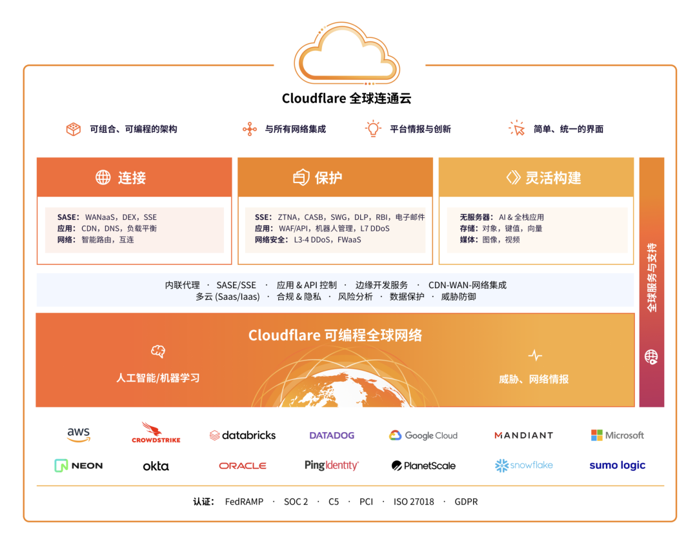
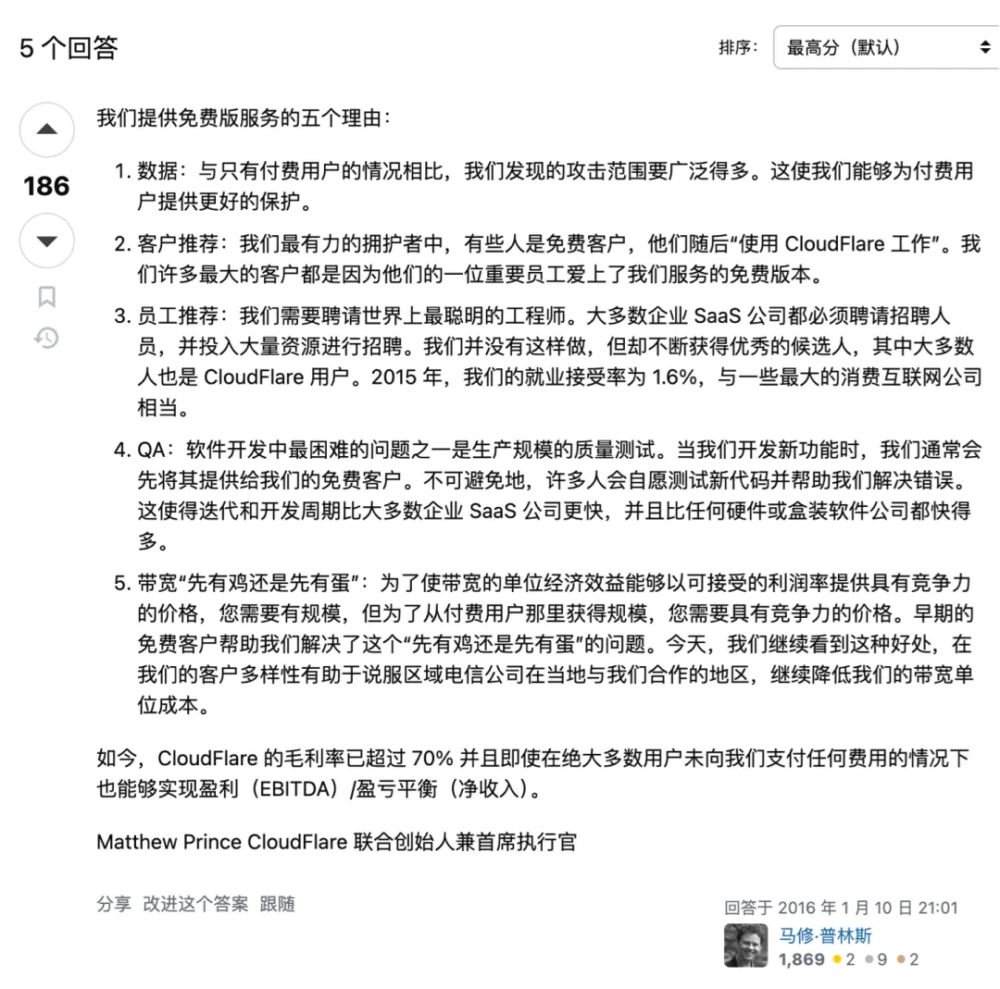
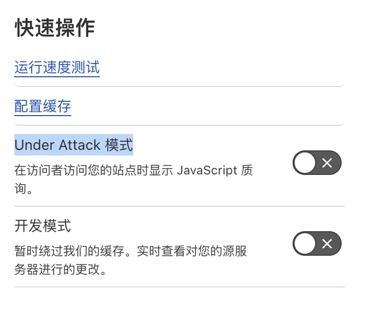
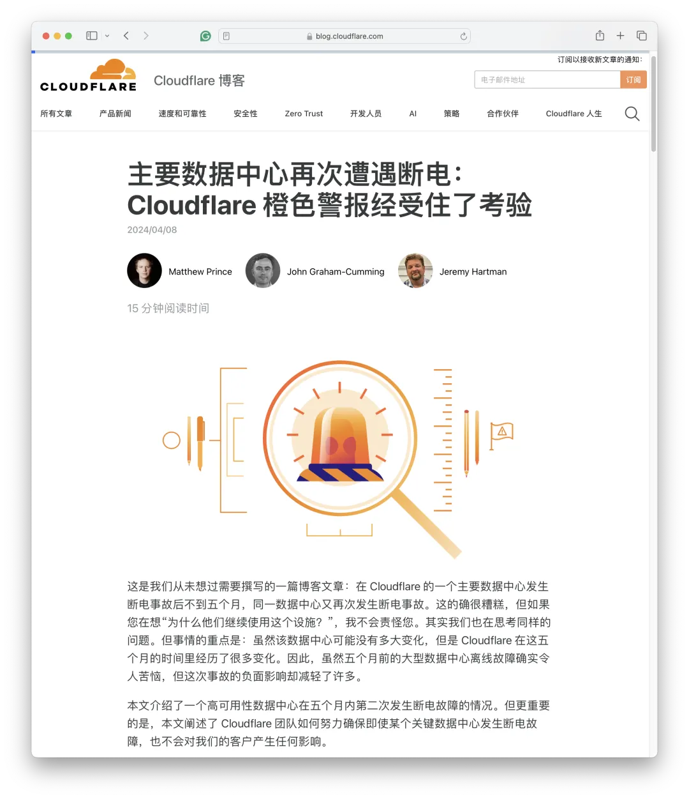
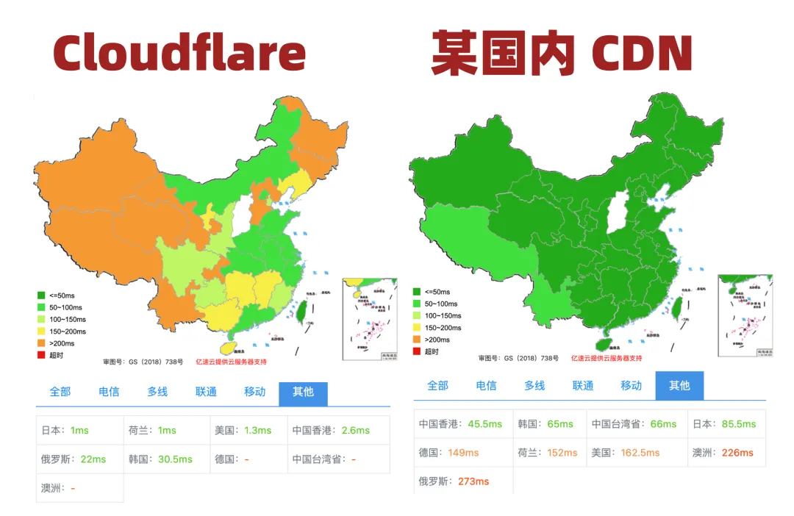

Last week, I was invited as a roundtable guest to participate in Cloudflare's Immerse conference in Shenzhen. During the Cloudflare Immerse cocktail party and dinner, I had in-depth discussions with Cloudflare's APAC CMO, Greater China Technical Director, and front-line engineers about many Cloudflare-related questions.

This article is an excerpt from the roundtable meeting minutes and Q&A interviews. For a user perspective review of Cloudflare, please refer to the previous article in this series: [**The Cyber Buddha Cloudflare That Outclasses Public Cloud**](/cloud/cloudflare).

------

## Part One: Roundtable Interview

**How did you come to know Cloudflare?**

I'm Vonng, currently working on **PostgreSQL** database distribution [**Pigsty**](https://pigsty.io/zh/), operating an open-source community, and as a KOL in the database & cloud computing field, promoting Cloud-Exit philosophy in China. Talking about Cloud-Exit at a Cloudflare event is quite interesting, but I'm not here to cause trouble.

Actually, I have several connections to Cloudflare, so I'm happy to share my **triple perspective** today: as an independent developer end-user, as an open-source community member and operator, and as a public cloud rebel, how I view Cloudflare.

As an **open-source software vendor**, we need a stable and reliable software distribution method. We initially used domestic Alibaba-Cloud and Tencent Cloud, with decent domestic experience, but when we needed to go overseas for international users, the experience was unsatisfactory. We tried AWS, Package Cloud, but ultimately chose Cloudflare. We also host several websites on CF.

As a **member of the PostgreSQL community**, we know Cloudflare deeply uses PostgreSQL as its underlying storage database. Unlike other cloud vendors who like to wrap it as RDS and freeload off the community, Cloudflare has always been an outstanding open-source community participant and builder. Even core components like Pingora and Workerd are open-source. I give this high praise — it's an exemplar of coexistence between open-source software communities and cloud vendors.

As an **advocate of Cloud-Exit philosophy**, I've always believed traditional public cloud uses a very unhealthy business model. So I'm leading a [**Cloud-Exit movement**](http://mp.weixin.qq.com/s?__biz=MzU5ODAyNTM5Ng==&mid=2247486813&idx=1&sn=ffb126fdd061c1e27626dd558f6fa26a&chksm=fe4b3886c93cb190e2acf7af6cfd25f298199f6ee73da566bed050c066b96753b913e3453d4f&scene=21#wechat_redirect) against public cloud in China. I believe Cloudflare might be an important ally in this movement — traditional IDC open-source self-building struggles with "online" connectivity issues, while Cloudflare's access capabilities and edge computing abilities fill this gap. So I'm very optimistic about this model.

------

**Which Cloudflare services have you used, and what attracted you?**

I've used Cloudflare's static website hosting service Pages, object storage service R2, and edge computing Workers. What most attracted me: ease of use, cost, quality, security, professional service attitude, and the prospects and future of this model.

Let's start with **ease of use**. The first service I used was Pages. I have a website with static HTML hosted there. How long did it take to move this website to Cloudflare? One hour! I just created a new GitHub repo, committed static content, then clicked buttons in Cloudflare, bound a new subdomain, linked to the GitHub repo, and the entire website was instantly accessible worldwide. You don't need to worry about high availability, high concurrency, global deployment, HTTPS certificates, anti-DDoS, etc. — this smooth user experience makes me very comfortable and happy to spend money unlocking additional features.

------

Now let's talk about **cost**. In the independent developer and personal webmaster circles, we've given Cloudflare a nickname — "**Cyber Buddha**." This is mainly because Cloudflare provides very generous free plans. Cloudflare has a quite unique business model — **no traffic fees, monetizing through security**.

For example, R2 — I think this was specifically designed to slap AWS S3 in the face. As a former major enterprise user, I've done precise calculations on various cloud services versus self-building costs — reaching conclusions that would shock ordinary users. Cloud [**object storage**](/cloud/s3) / [**block storage**](http://mp.weixin.qq.com/s?__biz=MzU5ODAyNTM5Ng==&mid=2247485745&idx=4&sn=93746ecea381afd8e2f9820447b09ec7&chksm=fe4b3ceac93cb5fc44f33ffff226747bc317854acbb3882aeb0d9a7e196eeb5df002d0e77275&scene=21#wechat_redirect) costs two orders of magnitude more than local self-building — truly epic pig-butchering schemes. AWS S3 standard pricing is $0.023/GB·month, while Cloudflare R2 is $0.015/GB·month — seemingly only 1/3 cheaper. But importantly, **traffic fees are completely free**! This creates qualitative change!

For example, my own website has decent traffic — last month ran 300GB, no charges. I have a friend who runs 3TB monthly, no charges. Then I saw on Twitter a friend using Free Plan for an adult image host, 1PB monthly traffic — that's pretty excessive, so CF contacted him — suggesting enterprise version purchase, just "suggesting."

------

Next, let's discuss **quality**. My Cloud-Exit premise is that all public cloud vendors sell interchangeable commodity standard products — like cloud servers sold in [**Luo Live Stream**](/cloud/aliyun/) between vacuum cleaners and toothpaste. But Cloudflare truly brings something different.

For example, Cloudflare Workers are genuinely interesting. Compared to traditional cloud's clunky development deployment experience, CF Workers truly achieve Serverless effects that delight developers. Developers don't need to worry about database connection strings, access points, AK/SK key management, database drivers, local log management, CI/CD pipeline setup — at most specifying simple information like storage bucket names in environment variables. Write Worker glue code implementing business logic, command-line deploy for global deployment and launch.

Corresponding traditional public cloud vendors' various so-called Serverless services, like RDS Serverless, are like bad jokes — purely billing model differences — neither Scale to Zero nor usability improvements — you still need console clicking to create RDS, not like true Serverless like Neon where connection strings instantly spin up new instances. More importantly, with a few dozen to hundreds of QPS, compared to annual/monthly bills, costs explode — such mediocre "Serverless" truly pollutes the word's original meaning.

------

Finally, I want to mention **security** — I believe security is Cloudflare's core value proposition. Why? Let me give an example. An independent webmaster friend used some major domestic cloud CDN and had mysteriously excessive traffic in recent years. Monthly overseas traffic of several TB, one IP consuming 10GB traffic then disappearing. After switching service providers, these strange traffic patterns vanished. Operating costs became 1/10 of original — this makes you think: **are these cloud vendors engaging in self-dealing, stealing traffic? Or are cloud vendors themselves (or affiliates) intentionally attacking to promote their high-defense IP services**? I've heard such examples.

Therefore, when using domestic cloud CDN, many users have natural concerns and distrust. But Cloudflare solves this problem — first, traffic is free, billing by request volume, so traffic theft is meaningless; second, it provides anti-DDoS even on Free Plan, CF can't damage its own reputation — this solves a user pain point of exploding bills — I've seen cases where public cloud accounts with tens of thousands of yuan got drained overnight. Using Cloudflare completely eliminates this problem — I can ensure highly predictable bills — if not definitely zero.

------

**What do you mean by professional service attitude?**

Domestic cloud vendors show quite amateur professional competency and service attitudes when facing major outages — I've written several articles criticizing this. Coincidentally, last Double 11, Alibaba-Cloud had an epic [**global outage**](/cloud/aliyun/). Cloudflare also had a data center power outage. A week ago on 4/8, Tencent Cloud had a copycat [**global outage**](http://mp.weixin.qq.com/s?__biz=MzU5ODAyNTM5Ng==&mid=2247487267&idx=1&sn=7d31d44e89560356b5c5a2e7a40bb1e1&chksm=fe4b3af8c93cb3ee9b8000cd90a12a798395f67205d4ba5b0c77b8c5b6ce9ea448d9fc014921&scene=21#wechat_redirect), and Cloudflare coincidentally had another Code Orange data center power outage the same day. As an engineer, I understand outages are unavoidable — **but the professional competency and service attitude shown after outages are vastly different**.

First, both Alibaba-Cloud and Tencent Cloud outages resulted from human operational errors/poor software engineering/architectural design, while Cloudflare's issue was data center power failure — somewhat force majeure natural disaster. Second, in handling attitude, Alibaba-Cloud still hasn't published a proper post-mortem — I did an [**unofficial post-mortem**](http://mp.weixin.qq.com/s?__biz=MzU5ODAyNTM5Ng==&mid=2247486468&idx=1&sn=7fead2b49f12bc2a2a94aae942403c22&chksm=fe4b39dfc93cb0c92e5d4c67241de0519ae6a23ce6f07fe5411b95041accb69e5efb86a38150&scene=21#wechat_redirect) for them; as for Tencent Cloud, I even issued an outage announcement for them — 10 minutes faster than their official website. Tencent Cloud did publish a [**post-mortem**](http://mp.weixin.qq.com/s?__biz=MzU5ODAyNTM5Ng==&mid=2247487348&idx=1&sn=412cf2afcd93c3f0a83d65219c4a28e8&chksm=fe4b3aafc93cb3b900cef33bd0510c7c86367d71877b0ee65d4847da0ae1298e2b1fd88d0b3f&scene=21#wechat_redirect) the day before yesterday, but it was rather perfunctory, lacking professional competency — such post-mortem reports would be considered substandard at Apple and Google...

Cloudflare is exactly the opposite — on the outage day, the CEO personally wrote a post-mortem with detailed information and sincere attitude. Have you seen domestic cloud vendors do this? No!

------

**What are your expectations for Cloudflare's future?**

My Cloud-Exit philosophy targets medium-to-large scale enterprises, like my former company Tantan and America's DHH 37 Signal. But IDC self-building has a problem — **access** issues, **online** issues — you can self-build KVM, K8S, RDS, even object storage. But you can't self-build CDN, right? Cloudflare fills this gap perfectly.

I believe Cloudflare is a solid ally of the Cloud-Exit movement. Cloudflare doesn't provide traditional public cloud elastic computing, storage, **K8S**, **RDS** services. But fortunately, Cloudflare can cooperate well with public cloud/IDC — in some sense, because Cloudflare successfully solved "online" issues, traditional data center IDC 2.0 can also have "online" capabilities comparable to or exceeding public cloud. Combined, they factually destroy some public cloud moats and squeeze traditional public cloud vendors' survival space.

I'm very optimistic about Cloudflare's model — actually, this smooth experience deserves to be called cloud, worthy of the temple, can comfortably enjoy high-tech industry high margins. Actually, **I think Cloudflare should proactively compete with traditional public cloud for cloud computing definition rights** — I hope when people mention cloud in the future, they refer to Cloudflare's generous and dignified connectivity cloud, not traditional public pig-butchering cloud.

------

## Part Two: Interactive Q&A

During the Cloudflare Immerse cocktail party and dinner, I had in-depth discussions with Cloudflare's APAC CMO, Greater China Technical Director, and front-line engineers about many Cloudflare questions, gaining much insight. Here are some publicly appropriate questions and answers. Since I don't record, this text represents my post-event recollection and interpretation, **for reference only, not representing CF official views**.

------

**How does Cloudflare position itself, and what's its relationship with AWS-type traditional public clouds?**

Actually, Cloudflare isn't traditional public cloud but a kind of **SaaS**. We now call ourselves "Connectivity Cloud" (translated as: **Global Connectivity Cloud**), aiming to establish connections between all things, integrate with all networks; built-in intelligence prevents security risks, providing unified, simplified interfaces to restore **visibility** and **control**. From traditional perspective, we're like an integration of security, CDN, and edge computing. AWS CloudFront competes with us.

------

**Why does Cloudflare provide such generous free plans? How do you actually make money?**

Cloudflare's free service is like Costco's $5 rotisserie chicken. Actually, besides free tiers, Workers and Pages paid plans are also $5 monthly — practically giving away — Cloudflare doesn't monetize from these users.

Cloudflare's core business model is **security**. Compared to serving only paying customers, more free users provide deeper data insights — enabling discovery of broader attacks and threat intelligence, providing better security services for paying customers.

> **What advantages does our Free plan offer?**
>
> At Cloudflare, our mission is helping build a better Internet. We believe the web should be open and free, and all websites and web users, however small, should be secure, stable, and fast. For [various reasons](https://webmasters.stackexchange.com/questions/88659/how-can-cloudflare-offer-a-free-cdn-with-unlimited-bandwidth), Cloudflare has always provided generous free plans.
>
> We work to minimize network operating costs, enabling us to provide tremendous value in our Free plan. Most importantly, by protecting more websites, we gain more comprehensive data about various attacks against our network, enabling us to provide better security and protection for all websites.
>
> As a privacy-first company, we never sell your data. In fact, Cloudflare recognizes personal data privacy as a fundamental human right and has taken [a series of measures](https://blog.cloudflare.com/certifying-our-commitment-to-your-right-to-information-privacy/) to demonstrate our privacy commitment.

Actually, Cloudflare's CEO personally [answered this question on StackOverflow](https://webmasters.stackexchange.com/questions/88659/how-can-cloudflare-offer-a-free-cdn-with-unlimited-bandwidth):

> Five reasons we offer a free version of the service and always will:
>
> 1. Data: we see a much broader range of attacks than we would if we only had our paid users. This allows us to offer better protection to our paid users.
> 2. Customer Referrals: some of our most powerful advocates are free customers who then "take CloudFlare to work." Many of our largest customers came because a critical employee of theirs fell in love with the free version of our service.
> 3. Employee Referrals: we need to hire some of the smartest engineers in the world. Most enterprise SaaS companies have to hire recruiters and spend significant resources on hiring. We don't but get a constant stream of great candidates, most of whom are also CloudFlare users. In 2015, our employment acceptance rate was 1.6%, on par with some of the largest consumer Internet companies.
> 4. QA: one of the hardest problems in software development is quality testing at production scale. When we develop a new feature we often offer it to our free customers first. Inevitably many volunteer to test the new code and help us work out the bugs. That allows an iteration and development cycle that is faster than most enterprise SaaS companies and a MUCH faster than any hardware or boxed software company.
> 5. Bandwidth Chicken & Egg: in order to get the unit economics around bandwidth to offer competitive pricing at acceptable margins you need to have scale, but in order to get scale from paying users you need competitive pricing. Free customers early on helped us solve this chicken & egg problem. Today we continue to see that benefit in regions where our diversity of customers helps convince regional telecoms to peer with us locally, continuing to drive down our unit costs of bandwidth.
>
> Today CloudFlare has 70%+ gross margins and is profitable (EBITDA)/break even (Net Income) even with the vast majority of our users paying us nothing.
>
> Matthew Prince Co-founder & CEO, CloudFlare

Founder vision and sentiment are quite important... Cloudflare's early services were mostly free, the first paid service was actually SSL certificates, now also free. Generally, enterprise customers pay for security.

------

**What are Cloudflare's paying users like? How do free users become paying users?**

Our free customers' main transition to enterprise paying customers is through security issues. Cloudflare console has an "**under attack**" button — when users click this "Under Attack" button, even free customers get immediate human response helping solve problems. For example, during the pandemic, a major video conferencing vendor suffered security attacks. We immediately allocated personnel to help customers solve problems — they were satisfied, so we signed deals.

------

**Could Cloudflare's free tier be cancelled in the future?**

Costco has a $1.50 hot dog soda combo, the founder promised never to raise hot dog and soda combo prices. I know SaaS vendors like Vercel, PlanetScale started cutting free tiers, but I think this basically won't happen to Cloudflare. Because as mentioned above, we have sufficient reasons to continue providing free plans. Actually, most of our customers don't pay, using Free Plan.

------

**Why does Cloudflare have the CEO personally write post-mortems after outages?**

Our CEO has technical background, engineering experience. When outages occur with lots of people arguing in IM, CEO jumps out saying: enough, I'll write the post-mortem report — then publishes it the same day as the outage. This is quite rare among public cloud vendors... We're actually quite shocked...

------

**Why is Cloudflare access so slow in China regions?**

China region bandwidth/traffic costs are too expensive, so ordinary users actually mainly access North American data centers and nodes. We have excellent latency performance in 95% of the world, but the remaining 5% mainly refers to... here.

If your main user base is domestic and you care about speed, consider Cloudflare Enterprise, or domestic CDN vendors. We cooperate with JD Cloud, enterprise customers can also use nodes they provide domestically.

------

**What are China region users' main motivations for using Cloudflare?**

Mainly **security**: even Cloudflare's free plan provides anti-DDoS services. Chinese users mainly use Cloudflare for going overseas. Those purely domestic Chinese customers willing to be slower to use CF are mainly motivated by security (anti-DDoS).

------

**Could Cloudflare be blocked in China? Any operational risks?**

I think this is unlikely — do you know how many websites are hosted on Cloudflare...? One shot would make half the internet inaccessible. Cloudflare itself doesn't operate in China... in China mainly serves C2G (China to Global) business.

You just asked why Cloudflare domains can be accessed without ICP filing — that's why — we're not operating in China at all.

------

**In cooperation with domestic cloud vendors, what form does resource exchange mainly take?**

Some domestic cloud vendors cooperate through resource exchange. So-called resource exchange, `<Redacted>`

**How do you view Tencent Cloud's EdgeOne product copying yours?**

Business harmony generates wealth, we can't publicly comment on other clouds. But privately speaking, CopyCat...

**What are Cloudflare Enterprise's main value points?**

Traffic priority. For example, your overseas traffic probably goes through certain cross-sea fiber from Shanghai. Normally this line utilization is `<Redacted>`%, but during peak periods, we prioritize enterprise user service quality.

**Does Cloudflare consider launching managed RDS, Postgres database services?**

Current D1 is actually SQLite, currently no plans for managed database services, but the ecosystem already has suppliers meeting such needs — you see many examples using Neon (Serverless Postgres) in Workers.