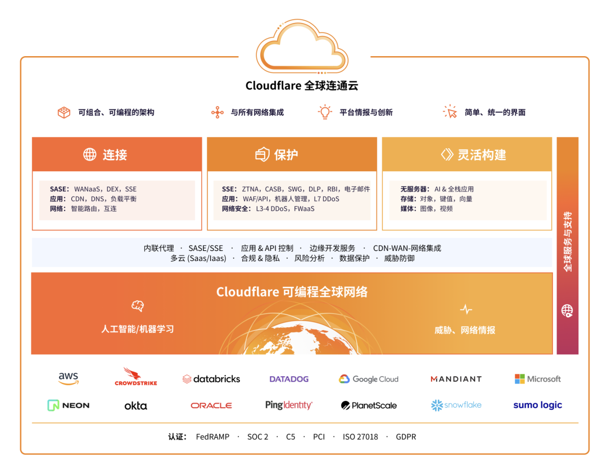
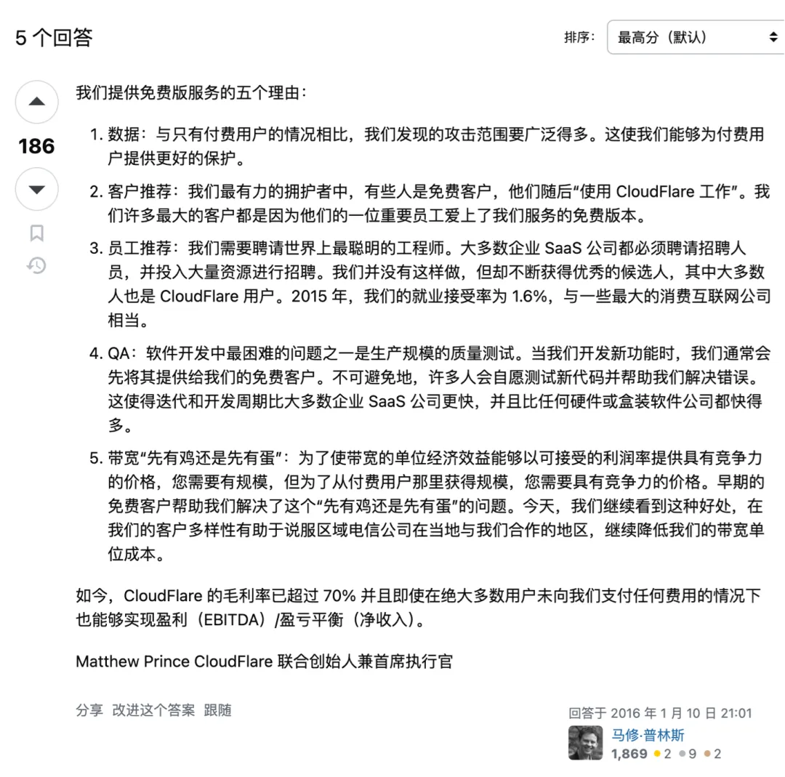
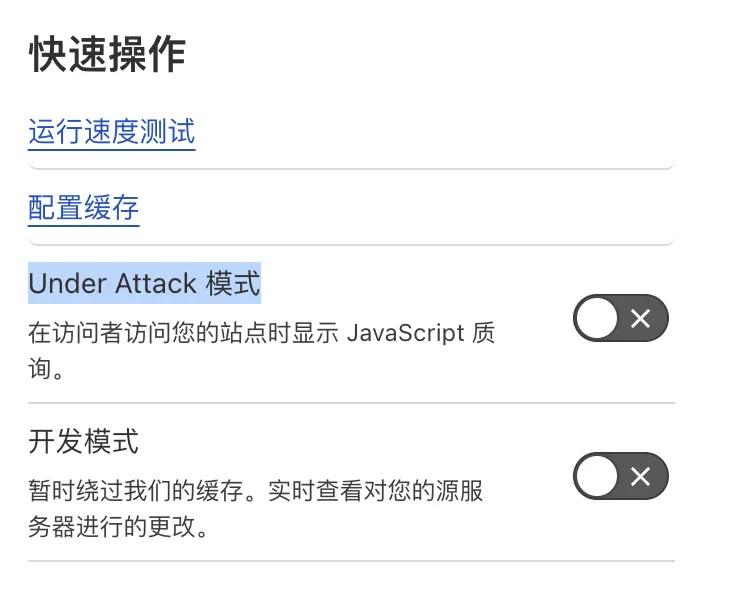
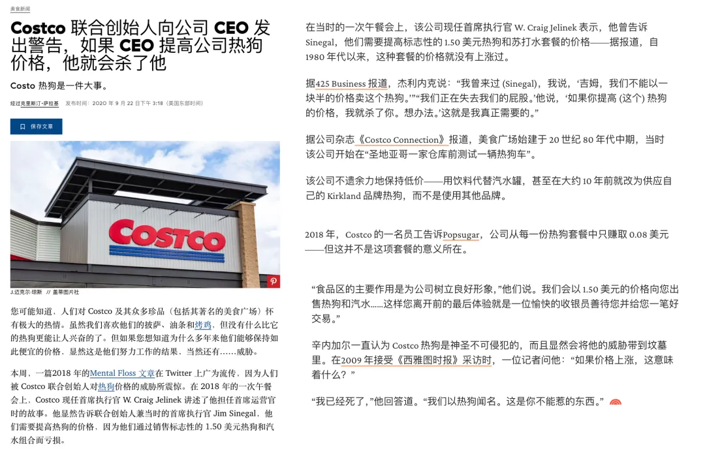
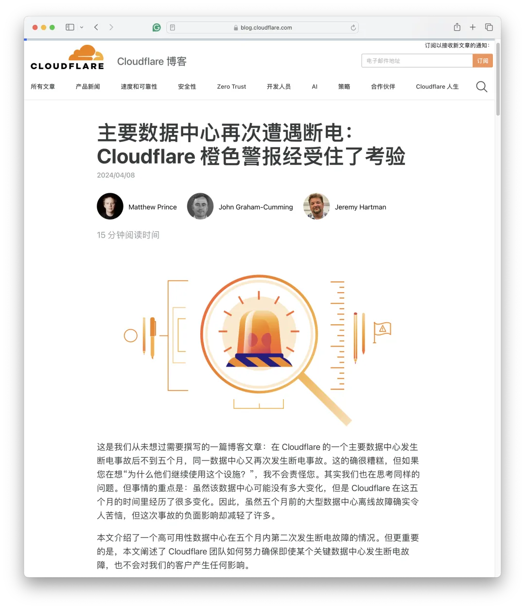
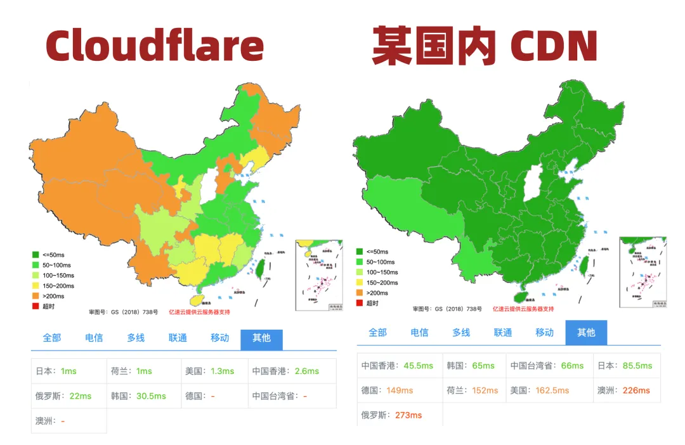
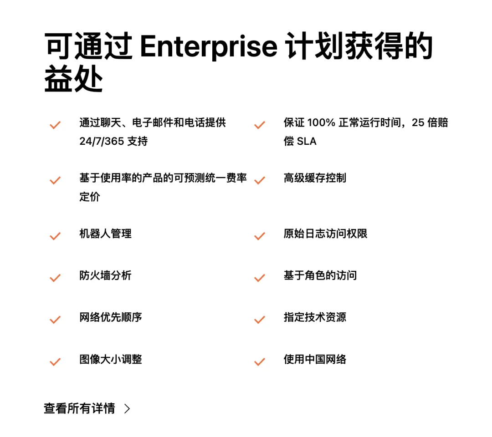

上周我作为圆桌嘉宾受邀参加了 Cloudflare 在深圳举办的 Immerse 大会，在 Cloudflare Immerse 鸡尾酒会和晚宴上，我与 Cloudflare 亚太区CMO，大中华区技术总监，以及一线工程师深入交流探讨了许多关于 Cloudflare 的问题。

本文是圆桌会谈纪要与问答采访的摘录，从用户视角点评 Cloudflare 请参考本号前一篇文章：《[**吊打公有云的赛博佛祖 Cloudflare**](/zh/blog/cloud/cloudflare)》

------

## 第一部分：圆桌访谈

**您与 Cloudflare 如何结缘？**

我是冯若航，现在做 **PostgreSQL** 数据库发行版 [**Pigsty**](https://pigsty.io/zh/)，运营着一个开源社区，同时作为一个数据库 & 云计算领域的 KOL，在国内宣扬下云理念。在 Cloudflare 的场子里讲下云挺有意思，但我并不是来踢馆的。

事实上我与 Cloudflare 还有好几层缘分，所以今天很高兴在这里和大家分享一下我的**三重视角** ：作为一个独立开发者终端用户，作为一个开源社区的成员与运营者，作为一个公有云计算反叛军，我是如何看待 Cloudflare 的。

作为一个**开源软件供应商**，我们需要一种稳定可靠的软件分发方式。我们最开始使用了本土的阿里云与腾讯云，在国内的体验尚可，但当我们需要走出海外，面向国外用户时，使用体验确实不尽如人意。我们尝试了 AWS，Package Cloud ，但最终选择了 Cloudflare。包括我们有几个网站也托管到了CF。

作为 **PostgreSQL 社区的一员**，我们知道 Cloudflare 深度使用了 PostgreSQL 作为底层存储的数据库。并且不同于其他云厂商喜欢将其包装为 RDS 白嫖社区，Cloudflare 一直是杰出的开源社区参与者与建设者。甚至像 Pingora 和 Workerd 这样的核心组件都是开源的。我对此给出高度评价，这是开源软件社区与云厂商共存的典范。

作为**下云理念的倡导者**，我一直认为传统公有云使用了一种非常不健康的商业模式。所以在中国引领着一场针对公有云的[**下云运动**](http://mp.weixin.qq.com/s?__biz=MzU5ODAyNTM5Ng==&mid=2247486813&idx=1&sn=ffb126fdd061c1e27626dd558f6fa26a&chksm=fe4b3886c93cb190e2acf7af6cfd25f298199f6ee73da566bed050c066b96753b913e3453d4f&scene=21#wechat_redirect)。我认为 Cloudflare 也许是这场运动中的重要盟友 —— 传统 IDC 开源自建，难以解决 “在线” 的问题，而 Cloudflare 的接入能力，边缘计算能力，都弥补了这一块短板。所以我非常看好这种模式。

------

**您用到了哪些 Cloudflare的服务，打动你的是什么？**

我用到了 Cloudflare 的静态网站托管服务 Pages，对象存储服务 R2 和边缘计算 Worker。最打动我的有这么几点：易用性，成本，质量，安全，专业的服务态度，以及这种模式的前景与未来。

首先聊一聊**易用性**吧，我使用的第一项服务是 Pages。我自己有一个网站，静态 HTML 托管在这里。我把这个网站搬上 Cloudflare 用了多长时间？一个小时！我只是创建了一个新的 GitHub Repo，把静态内容提交上去，然后在 Cloudflare 点点按钮，绑定一个新的子域名，链接到 GitHub Repo，整个网站瞬间就可以被全世界访问，你不需要操心什么高可用，高并发，全球部署，HTTPS 证书，抗 DDoS 之类的问题 —— 这种丝滑的用户体验让我非常舒适，并很乐意在这上面花点钱解锁额外功能。

------

再来聊一聊**成本**吧。在独立开发者，个人站长这个圈子里，我们给 Cloudflare 起了一个外号 —— “**赛博佛祖**”。这主要是因为 Cloudflare 提供了非常慷慨的免费计划。Cloudflare 有着相当独特的商业模式 —— **免流量费，靠安全赚钱**。

比如说 R2，我认为这就是专门针对 AWS S3 进行啪啪打脸的。我曾经作为大甲方对各种云服务与自建的成本进行过精算 —— 得出会让普通用户感到震惊的结论。云上的[**对象存储**](/zh/blog/cloud/s3) / [**块存储**](http://mp.weixin.qq.com/s?__biz=MzU5ODAyNTM5Ng==&mid=2247485745&idx=4&sn=93746ecea381afd8e2f9820447b09ec7&chksm=fe4b3ceac93cb5fc44f33ffff226747bc317854acbb3882aeb0d9a7e196eeb5df002d0e77275&scene=21#wechat_redirect) 比本地自建贵了两个数量级，堪称史诗级杀猪盘。AWS S3 标准档价格 0.023 $/GB·月，而 Cloudflare R2 价格 0.015 $/GB·月，看上去只是便宜了 1/3 。但重要的是**流量费全免**！这就带来质变了！

比如，我自己那个网站也还算有点流量，最近一个月跑了 300GB ，没收钱，我有一个朋友每月跑掉 3TB 流量，没收钱；然后我在推特上看到有个朋友 Free Plan 跑黄网图床，每月 1PB 流量，这确实挺过分了，于是 CF 联系了他 —— 建议购买企业版，也仅仅是 “建议”。

------

接下来我们来聊一聊**质量**。我讲下云的一个前提是：各家公有云厂商卖的是没有不可替代性的大路货标准品。比如那种在[**老罗直播间**](/zh/blog/cloud/luo-live)中，夹在吸尘器与牙膏中间卖的云服务器。但是 Cloudflare 确实带来了一些不一样的东西。

举个例子，Cloudflare Worker 确实很有意思，比起传统云上笨拙的开发部署体验来说，CF worker 真正做到了让开发者爽翻天的 Serverless 效果。开发者不需要操心什么数据库连接串，AccessPoint，AK/SK密钥管理，用什么数据库驱动，怎么管理本地日志，怎么搭建 CI/CD 流程这些繁琐问题，最多在环境变量里面指定一下存储桶名称这类简单信息就够了。写好 Worker 胶水代码实现业务逻辑，命令行一把梭就可以完成全球部署上线。

与之对应的是传统公有云厂商提供的各种所谓 Serverless 服务，比如 RDS Serverless，就像一个恶劣的笑话，单纯是一种计费模式上的区别 —— 既不能 Scale to Zero，也没什么易用性上的改善 —— 你依然要在控制台去点点点创建一套 RDS，而不是像 Neon 这种真 Serverless 一样用连接串连上去就能直接迅速拉起一个新实例。更重要的是，稍微有个几十上百的QPS，相比包年包月的账单就要爆炸上天了 —— 这种平庸的 “Serverless” 确实污染了这个词语的本意。

------

最后我想说一下**安全**，我认为安全才是 Cloudflare 核心价值主张。为什么这么说，还是举一个例子。有一个独立站长朋友用了某个头部本土云 CDN ，最近两年有莫名其妙的超多流量。一个月海外几个T流量，一个IP 过来吃个10G 流量然后消失掉。后来换了个地方提供服务，这些奇怪的流量就没了。运行成本变为本来的 1/10，这就有点让人细思恐极 —— **是不是这些云厂商坚守自盗，在盗刷流量？或者是是云厂商本身（或其附属）组织在有意攻击，从而推广他们的高防 IP 服务**？这种例子其实我是有所耳闻的。

因此，在使用本土云 CDN 的时候，很多用户会有一些天然的顾虑与不信任。但 Cloudflare 就解决了这个问题 —— 第一，流量不要钱，按请求量计费，所以刷流量没意义；第二，它替你抗 DDoS，即使是 Free Plan 也有这个服务，CF不能砸自己的招牌 —— 这解决了一个用户痛点，就是把账单刷爆的问题 —— 我确实有见过这样的案例，公有云账号里有几万块钱，一下子给盗刷干净了。用 Cloudflare 就彻底没有这个问题，我可以确保账单有高度的确定性 —— 如果不是确定为零的话。

------

**专业的服务态度指的是？**

本土云厂商在面对大故障时，体现出相当业余的专业素养与服务态度，这一点我专门写了好几篇文章进行批判。说起来特别赶巧，去年双十一，阿里云出了一个史诗级[**全球大故障**](/zh/blog/cloud/aliyun)。Cloudflare 也出了个机房断电故障。一周前 4.8 号，腾讯云也出了个翻版[**全球故障**](http://mp.weixin.qq.com/s?__biz=MzU5ODAyNTM5Ng==&mid=2247487267&idx=1&sn=7d31d44e89560356b5c5a2e7a40bb1e1&chksm=fe4b3af8c93cb3ee9b8000cd90a12a798395f67205d4ba5b0c77b8c5b6ce9ea448d9fc014921&scene=21#wechat_redirect)，Cloudflare 也恰好在同一天又出了 Code Orange 机房断电故障。作为一个工程师，我理解故障是难以避免的 —— **但出现故障后，体现出来的专业素养和服务态度是天差地别的**。

首先，阿里云和腾讯云的故障都是人为操作失误/糟糕的软件工程/架构设计导致的，而 Cloudflare 的问题是机房断电，某种程度上算不可抗力的天灾。其次，在处理态度上，阿里云到现在都没发布一个像样的故障复盘，我替它做了一个[**非官方故障复盘**](http://mp.weixin.qq.com/s?__biz=MzU5ODAyNTM5Ng==&mid=2247486468&idx=1&sn=7fead2b49f12bc2a2a94aae942403c22&chksm=fe4b39dfc93cb0c92e5d4c67241de0519ae6a23ce6f07fe5411b95041accb69e5efb86a38150&scene=21#wechat_redirect)；至于腾讯云，我干脆连故障通告都替他们发了 —— 比官网还快10分钟。腾讯云倒是在前天发布了一个[**故障复盘**](http://mp.weixin.qq.com/s?__biz=MzU5ODAyNTM5Ng==&mid=2247487348&idx=1&sn=412cf2afcd93c3f0a83d65219c4a28e8&chksm=fe4b3aafc93cb3b900cef33bd0510c7c86367d71877b0ee65d4847da0ae1298e2b1fd88d0b3f&scene=21#wechat_redirect)，但是也比较敷衍，专业素养不足，这种复盘报告拿到 Apple 和 Google 都属于不合格的 Post-Mortem ……

Cloudflare 则恰恰相反，在故障的当天 CEO 亲自出来撰写故障复盘，细节翔实，态度诚恳，你见过本土云厂商这么做吗？没有!

------

**您对 Cloudflare 未来有什么期待？**

我主张下云理念，是针对中型以上规模的企业。像我之前任职的探探，以及美国 DHH 37 Signal 这样的。但是 IDC 自建有个问题，**接入**的问题，**在线的问题** —— 你可以自建KVM，K8S，RDS，甚至是对象存储。但你不可能自建 CDN 吧？Cloudflare 就很好地弥补了这个缺憾。

我认为，Cloudflare 是下云运动的坚实盟友。Cloudflare 并没有提供传统公有云上的那些弹性计算、存储、**K8S**、**RDS** 服务。但幸运地是，Cloudflare 可以与公有云 / IDC 良好地配合协同 —— 从某种意义上来说，因为 Cloudflare 成功解决了 “在线” 的问题，这使得传统数据库中心 IDC 2.0 也同样可以拥有比肩甚至超越公有云的 “在线” 能力，两者配合，在事实上摧毁了一些公有云的护城河，并挤压了传统公有云厂商的生存空间。

我非常看好 Cloudflare 这种模式，实际上，这种丝滑的体验才配称的上是云，配享太庙，可以心安理得吃高科技行业的高毛利。实际上，**我认为 Cloudflare 应该主动出击，去与传统公有云抢夺云计算的定义权** —— 我希望未来人们说起云的时候，指的应该是 Cloudflare 这种慷慨体面的连接云，而不是传统公有杀猪云。

------

## 第二部分：互动问答

在 Cloudflare Immerse 鸡尾酒会和晚宴上，我与 Cloudflare 亚太区CMO，大中华区技术总监，以及一线工程师深入交流探讨了许多关于 Cloudflare 的问题，收获颇丰，这里给出了一些适合公开的问题与答案。因为我也不会录音，因此这里的文字属于我的事后回忆与阅读理解，**仅供参考，不代表 CF 官方观点**。

------

**Cloudflare 如何定位自己，和 AWS 这种传统公有云是什么关系？**

其实 Cloudflare 不是传统公有云，而是一种 **SaaS**。我们现在管自己叫做 “Connectivity Cloud”（翻译为：**全球联通云**），旨在为所有事物之间建立连接，与所有网络相集成；内置情报防范安全风险，并提供统一、简化的界面以恢复**可见性**与**控制**。从传统的视角来看，我们做的像是安全、CDN与边缘计算的一个整合。AWS 的 CloudFront 算是我们的竞品。

------

**Cloudflare 为什么提供了如此慷慨的免费计划，到底靠什么赚钱？**

Cloudflare 的免费服务就像 Costco 的5美元烤鸡一样。实际上除了免费套餐，那个 Workers 和 Pages 的付费计划也是每月五美元，跟白送的一样，Cloudflare 也不是从这些用户身上赚钱的。

Cloudflare 的核心商业模式是**安全**。相比于只服务付费客户，更多的免费用户可以带来更深入的数据洞察 —— 也就能够发现更为广泛的攻击与威胁情报，为付费用户提供更好的安全服务。

> **我们的 Free 计划有何优势？**
>
> 在 Cloudflare，我们的使命是帮助建立更好的互联网。我们认为 web 应该是开放和免费的，所有网站和 web 用户，无论多小，都应该是安全、稳固、快速的。由于[种种原因](https://webmasters.stackexchange.com/questions/88659/how-can-cloudflare-offer-a-free-cdn-with-unlimited-bandwidth)，Cloudflare 始终都提供慷慨的免费计划。
>
> 我们努力将网络运营成本降至最低，从而能在我们的 Free 计划中提供巨大价值。最重要的是，通过保护更多网站，我们能就针对我们网络的各类攻击获得更完善的数据，从而能为所有网站提供更佳的安全和保护。
>
> 作为隐私第一的公司，我们绝不出售您的数据。事实上，Cloudflare 承认个人数据隐私是一项基本人权，并已采取[一系列措施](https://blog.cloudflare.com/certifying-our-commitment-to-your-right-to-information-privacy/)来证明我们对隐私的承诺。

实际上 Cloudflare 的 CEO 在 StackOverflow [亲自对这个问题作出过回答](https://webmasters.stackexchange.com/questions/88659/how-can-cloudflare-offer-a-free-cdn-with-unlimited-bandwidth)：

> Five reasons we offer a free version of the service and always will:
>
> 1. Data: we see a much broader range of attacks than we would if we only had our paid users. This allows us to offer better protection to our paid users.
> 2. Customer Referrals: some of our most powerful advocates are free customers who then "take CloudFlare to work." Many of our largest customers came because a critical employee of theirs fell in love with the free version of our service.
> 3. Employee Referrals: we need to hire some of the smartest engineers in the world. Most enterprise SaaS companies have to hire recruiters and spend significant resources on hiring. We don't but get a constant stream of great candidates, most of whom are also CloudFlare users. In 2015, our employment acceptance rate was 1.6%, on par with some of the largest consumer Internet companies.
> 4. QA: one of the hardest problems in software development is quality testing at production scale. When we develop a new feature we often offer it to our free customers first. Inevitably many volunteer to test the new code and help us work out the bugs. That allows an iteration and development cycle that is faster than most enterprise SaaS companies and a MUCH faster than any hardware or boxed software company.
> 5. Bandwidth Chicken & Egg: in order to get the unit economics around bandwidth to offer competitive pricing at acceptable margins you need to have scale, but in order to get scale from paying users you need competitive pricing. Free customers early on helped us solve this chicken & egg problem. Today we continue to see that benefit in regions where our diversity of customers helps convince regional telecoms to peer with us locally, continuing to drive down our unit costs of bandwidth.
>
> Today CloudFlare has 70%+ gross margins and is profitable (EBITDA)/break even (Net Income) even with the vast majority of our users paying us nothing.
>
> Matthew Prince Co-founder & CEO, CloudFlare

创始人的情怀与愿景其实挺重要的 …… ，Cloudflare 早期的许多服务一直都是免费提供的，第一个付费服务其实是 SSL 证书，现在也不要钱了。总的来说，就是靠企业级客户为安全付费。

------

**Cloudflare付费用户都是什么样的？怎么从免费用户成为付费用户的。**

我们的免费客户转变为企业级付费客户的主要契机是安全问题。Cloudflare 控制台上有个 “**遭受攻击**” 的按钮 —— 是这样的，只要用户在控制台上点这个 “Under Attack” 按钮，即使是免费客户，我们也会第一时间有人响应，帮助客户解决问题。例如在疫情期间，某头部视频会议厂商遭受到了安全攻击。我们立即抽调人手替客户解决问题 —— 他们很满意，我们就签了单子。

------

**Cloudflare 的免费套餐有可能会在未来取消吗？**

Costco 有个 1.5 美元的热狗汽水套餐，创始人承诺永远不会提高热狗和苏打水套餐的价格。我知道像 Vercel，Planetscale 之类的 SaaS 厂商开始削减免费套餐，但我认为这事基本不太可能发生在 Cloudflare 上。因为如上所述，我们有充分的理由继续提供免费计划。实际上我们的大多数客户都没付钱，在使用 Free Plan。

------

**为什么Cloudflare 会在故障后由 CEO 亲自出马复盘？**

我们的 CEO 是技术出身，工程师背景。出现故障的时候 IM 里一堆人在掰扯，CEO 跳出来说：够了，我来写故障复盘报告 —— 然后故障当天就发出来了，这种事放在公有云厂商里绝对是相当罕见的了… 我们其实也很震惊…。

------

**Cloudflare 在中国区域访问为什么这么慢？**

中国区域带宽/流量费用太贵了，所以普通用户访问其实访问的其实主要是北美地区的机房与节点。我们在 全世界 95% 的地区都有非常优秀的延迟表现（比），但剩下 5% 嘛主要指的就是 …… ，在这里

如果你的主要用户群体都是国内，又比较在乎速度，可以考虑一下 Cloudflare 企业版，或者是本土 CDN 厂商。我们和京东云有合作，企业级客户在国内也可以使用他们提供的这些节点。

------

**中国区域用户使用 Cloudflare 的主要动机是什么？**

主要是因为**安全**：Cloudflare 即使是免费计划中，也提供了抗 DDoS 服务。中国的用户使用 Cloudflare 主要是为了出海。而那些纯粹面向本土的中国客户，宁可慢一点也要用 CF 的主要动机就是安全（抗DDoS）。

------

**Cloudflare 会在中国被封禁吗？有什么运营风险吗？**

我觉得这件事不太可能会发生，你知道现在有多少网站托管在 Cloudflare 上面吗 … 这一炮打下去，大半个互联网都访问不了了。Cloudflare 本身并没有在中国地区运营…… ，在中国也主要服务于 C2G （China to Global）业务。
你刚才问为什么 Cloudflare 域名不备案为什么就能访问，就是这个原因 —— 我们压根没在中国运营。

------

**在与本土云厂商合作中，资源互换主要是一种什么形式？**

有一些本土云厂商通过资源互换的方式合作，所谓资源互换嘛，`<Redacted>`

**你们如何看待腾讯云模仿你们的产品 EdgeOne ？**

做生意和气生财，我们不好公开评论其他云。但私下里说，CopyCat……

**Cloudflare 企业版的主要价值点在于？**

流量优先级。举个例子你出海的流量大概率是从上海的某一根跨海光纤出去的，平时这条线路的使用率是 `<Redacted>` % ，但是在高峰期，我们就会优先保证企业级用户的服务质量。

**Cloudflare 考虑推出托管的 RDS，Postgres数据库服务吗？**

现在那个 D1 其实是 SQLite，目前没有计划做这种托管数据库服务，但是生态里已经有可以满足这种需求的供应商了，你看有不少在 Worker 里使用 Neon （Serverless Postgres）的例子。