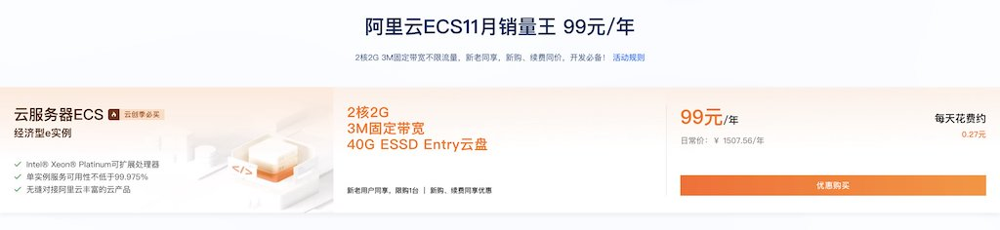
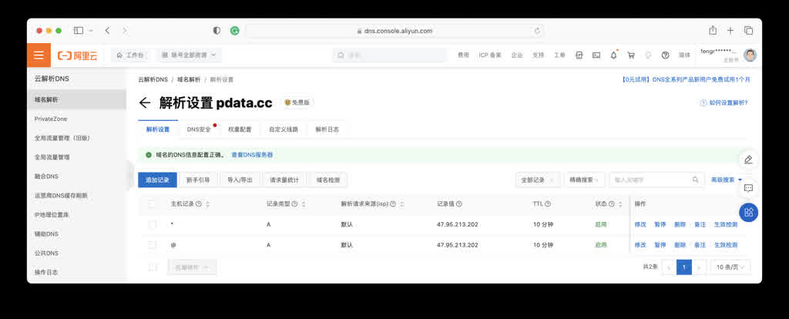
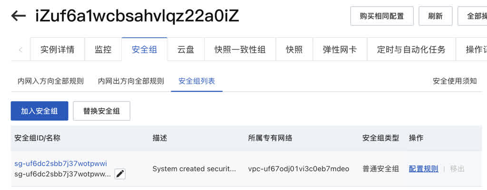
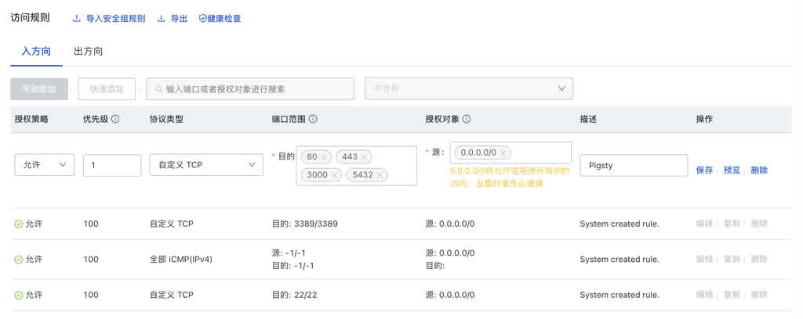
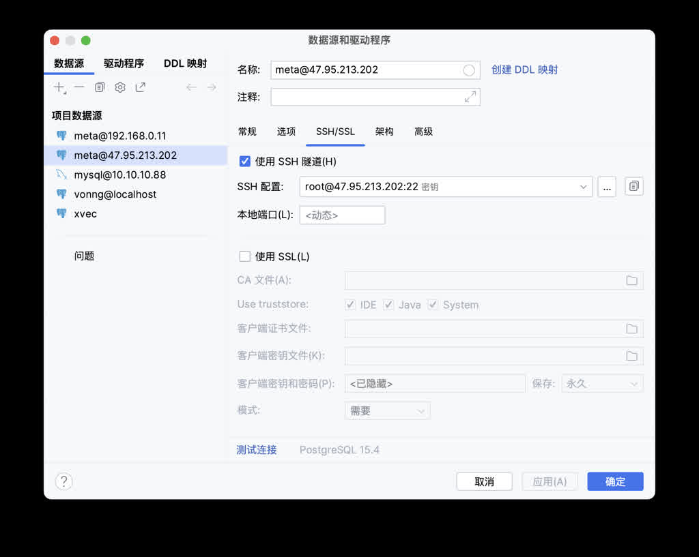

Alibaba Cloud's Double 11 offered a great deal: 2C/2G/3M ECS servers with a list price of **¥1500/year** for just **¥99/year** for three years (¥99 annual renewal available until 2026), plus they're reportedly giving every Chinese university student a free one.



While I often mock public cloud as **pig-butchering schemes**, that's targeted at users of our scale. For individual developers, such pricing is truly generous welfare. 2C/2G isn't worth much, but the 3M bandwidth and public IP are quite powerful. Both new and existing users can buy this. Until Double 11 ends, I recommend all developers harvest this wool for building a DevBox.

What can you do with an ECS? Use it as a jump server, temporary file transfer station, build a static website, personal blog, run scheduled scripts and services, set up a proxy, create your own Git repository, software sources, Wiki sites, deploy privately hosted forums/social media sites.

Students can use it to learn Linux, build software compilation environments, learn various databases: PostgreSQL, Redis, MinIO, do data analysis with SQL and Python, play with data visualization using Grafana and Echarts.

Pigsty provides a one-click installation, out-of-the-box foundation for these needs, giving you a production-grade DevBox on ECS immediately.

[](https://mp.weixin.qq.com/s/Nh28VahZkQMdR8fDoi0_rQ)

------------

### What's Next?

Pigsty provides out-of-the-box host/database monitoring systems, ready-to-use Nginx web servers for external services, and a fully-featured PostgreSQL database with complete plugins supporting various upper-layer software. Based on Pigsty, you can easily build static/dynamic websites. After installing Pigsty, you can explore the monitoring system (Demo: https://demo.pigsty.cc), which shows your complete host details and database monitoring.

We'll also introduce a series of interesting topics:

* [Sample Application: ISD, analyzing and visualizing global weather data](https://vonng.com/cn/blog/note/isd/)
* Database 101: Quick start with the database all-rounder: PostgreSQL
* Quick visualization start, using Grafana for data analysis charting
* Static websites: Using hugo to build your own static personal website
* Jump server: How to use this ECS as a jump server to access home computers?
* Site publishing: How to let users access your personal website through domain names
* SSL certificates: How to use Let's Encrypt free certificates for encryption
* Python environment: How to configure Python development environment in Pigsty
* Docker environment: How to enable Docker development environment in Pigsty
* MinIO: How to use this ECS as your file transfer station and share with others?
* Git repository: How to use Gitea + PostgreSQL to build your own Git repository?
* Wiki site: How to use Wiki.js + PostgreSQL to build your own Wiki knowledge base?
* Social networking: How to quickly build Mastodon and Discourse?

------------

## Purchasing and Configuring ECS

As a seasoned IaC user, I'm accustomed to [one-click provisioning](https://pigsty.io/zh/doc/provision) of required cloud resources, setting up everything. Console mouse-clicking is quite foreign to me now. However, I believe many readers aren't familiar with cloud operations, so we'll show these operations as comprehensively as possible. If you're already an expert, please skip this section and go directly to the Pigsty configuration section.

------------

### Buying Campaign Virtual Machines

If you don't have an Alibaba Cloud account, register with your phone number, then use Alipay to scan for real-name verification. Enter the campaign page, buy immediately. Choose a region closest to your location, availability zone can be higher alphabetically. Operating system and network don't matter, use defaults and change later. After selecting, check the bottom: I have read and agree to [ECS-Monthly Subscription Service Agreement](http://terms.aliyun.com/legal-agreement/terms/suit_bu1_ali_cloud/suit_bu1_ali_cloud201912232014_30443.html). Click "Buy Now," pay with Alipay, done.

If you're not short on money, I recommend directly topping up ¥300, locking in ¥99 annual renewal first. The remainder can buy a domain for tens of yuan, supplement some OSS/ESSD/traffic fees. After all, if you want to use pay-as-you-go services, you still need ¥100 deposit.

Directly click "Renew" on the instance page — current price for 1-year renewal is **¥99**, you can directly renew to lock in next year's discount. Of course, Alibaba Cloud only promises that in the third year you can continue using **¥99** pricing to renew until 2026 — can't operate that now.

------------

### System Reinstallation and Keys

After purchasing the cloud server, click console. Or click the menu icon beside the Logo in the upper left to enter ECS console, where you can see your purchased instance is running. We can further configure networking, operating system, passwords and keys here.


Directly click "Stop" beside the instance, click the instance name link to enter details page, select "Change Operating System." Then select "Public Images," choose your desired OS image. Pigsty supports EL 7/8/9 and compatible operating systems, Ubuntu 22.04/20.04, Debian 12/11.

Here we recommend using **RockyLinux 8.8 64-bit**, currently the mainstream enterprise OS, achieving balance between stability and software freshness. **OpenAnolis 8.8 RHCK**, **RockyLinux 9.2**, or **Ubuntu 22.04** are also good choices, but our demonstrations use **Rocky 8.8** — beginners better not mess around here.

> 《Which EL System Compatibility is Strongest?》

In security settings, you can set `root` user password/key. If you don't have SSH keys, use `ssh-keygen` to generate a pair, or directly set a text password. For convenience, we'll set a random one. After setting up, you can use `ssh root@<ip>` to login to the server (SSH client issues won't be expanded here — iTerm, putty, xshell, secureCRT all work).

```bash
ssh-keygen              # If you don't have SSH key pairs, generate one
ssh-copy-id root@<ip>   # Add your ssh key to the server (enter password)
```

------------

### Configuring Domain and DNS

Domains are very cheap now, just teens of yuan annually. I highly recommend getting one for great convenience. Mainly you can use different subdomains to distinguish different services, letting Nginx forward traffic to different upstreams, multi-service on one machine. Of course, if you prefer using IP addresses + port numbers to directly access different services, that's fine. Mainly it's a bit crude, and more open ports create more security risks.

For example, I bought a `pdata.cc` domain for tens of yuan on Alibaba Cloud, then in Alibaba Cloud DNS console I can add domain resolution pointing to the newly applied server IP address. One `@` record, one `*` wildcard record, A records pointing to the ECS instance's **public IP address**.



With a domain, you can login using `ssh root@pdata.cc` without remembering IP addresses. You can also configure more subdomains here pointing to different addresses. If the domain is for websites, in mainland China you also need ICP filing — Alibaba Cloud also provides one-stop service.

------------

### Configuring Security Group Rules

Newly created cloud servers have default security group rules only allowing SSH service (port 22) access. So to access web services on this server you need to open ports 80/443. If you're too lazy to set up domains and want to use IP + port direct access to respective services instead of going through Nginx's 80/443 ports via domain, then Grafana monitoring interface port 3000 should also be opened. Finally, if you want to access PostgreSQL database from local, consider opening `5432` port.

If you want to be lazy, you could indeed add a rule opening all ports, but cloud servers aren't your laptop — you don't want your ECS hacked and used for bad things getting your account banned. So let's follow proper procedures. Click security groups in instance details page, then click that specific security group to enter details page for configuration:



In default "Inbound" add an "Allow" rule, protocol select `TCP`, port range enter `80/443/3000/5432`, accessible from any address `0.0.0.0/0` to these ports.



The above operations are Linux 101 basics, old hat for veterans — using Terraform templates completes this in one command. But many beginners really don't know how to do this.

In summary, after the above steps, you have a ready cloud server! You can login/access this server using domain names from anywhere with network. Next, we can start building the digital homestead: installing Pigsty.

------------

## Installing and Configuring Pigsty

Now you can login to this server as root user via SSH. Next, download, install, configure Pigsty.

While using `root` user isn't production best practice, for personal DevBox it doesn't matter — we won't bother creating management users. Use `root` user directly:

```bash
curl -fsSL https://repo.pigsty.io/get | bash  # Download Pigsty and extract to ~/pigsty directory
cd ~/pigsty      # Enter Pigsty source directory, complete subsequent preparation, configuration, installation steps
./bootstrap      # Ensure Ansible properly installed, if /tmp/pkg.tgz offline package exists, use it
./configure      # Execute environment detection and generate corresponding recommended config file, skip if you know how to configure Pigsty
./install.yml    # Begin installation on current node according to generated config file, offline packages take ~10 minutes
```

Pigsty official documentation provides detailed installation configuration tutorials: https://pigsty.cc/doc/#/zh/INSTALL

After installation, you can access the web interface via domain or `80/443` ports through Nginx, access default PostgreSQL database service via `5432` port, login to Grafana via `3000` port.

Enter `http://<public-IP>:3000` in browser to access Pigsty's Grafana monitoring system. ECS's 3M bandwidth small pipe will take some effort initially loading Grafana. You can access anonymously or use default username/password `admin` / `pigsty` to login. Please change this default password to prevent others from randomly entering and causing damage.

The above tutorial looks really simple, right? Yes. As a machine that can be destroyed and rebuilt anytime for development, this approach is fine. But if you want to use it as an environment bearing your personal digital homestead, please refer to the **Configuration Details** and **Security Hardening** sections below before proceeding.

------------

### Configuration Details

When you install Pigsty and run `configure`, Pigsty generates a single-machine installation config file based on your machine environment: `pigsty.yml`. The default config file works directly, but you can further customize it to enhance security and convenience.

Below is a recommended config file example that should be at `/root/pigsty/pigsty.yml` by default, describing your required database. Pigsty provides 280+ customization parameters, but you only need to focus on a few for fine-tuning. Your machine's internal IP address, optional public domain, and various passwords. Domain is optional, but we recommend having one. Other passwords you can leave unchanged if lazy, but please change `pg_admin_password`.

```yaml
---
all:
  children:

    # The 10.10.10.10 here should all be your ECS internal IP address, used for installing Infra/Etcd modules
    infra: { hosts: { 10.10.10.10: { infra_seq: 1 } } }
    etcd:  { hosts: { 10.10.10.10: { etcd_seq: 1 } }, vars: { etcd_cluster: etcd } }

    # Define a single-node PostgreSQL database instance
    pg-meta:
      hosts: { 10.10.10.10: { pg_seq: 1, pg_role: primary } }
      vars:
        pg_cluster: pg-meta
        pg_databases:
          - { name: meta ,baseline: cmdb.sql ,schemas: [ pigsty ] }
        pg_users: # Better change these two example user passwords too
          - { name: dbuser_meta ,password: DBUser.Meta   ,roles: [ dbrole_admin ] }
          - { name: dbuser_view ,password: DBUser.Viewer ,roles: [ dbrole_readonly ] }
        pg_conf: tiny.yml   # 2C/2G cloud server, use tiny database config template
        node_tune: tiny     # 2C/2G cloud server, use tiny host node parameter optimization template
        pgbackrest_enabled: false # With this little disk space, skip database physical backups
        pg_default_version: 13   # Use PostgreSQL 13

  vars:
    version: v2.5.0
    region: china
    admin_ip: 10.10.10.10  # This IP address should be your ECS internal IP address
    infra_portal: # If you have your own DNS domain, replace the domain suffix pigsty with your own DNS domain
      home: { domain: h.pigsty }
      grafana: { domain: g.pigsty ,endpoint: "${admin_ip}:3000" , websocket: true }
      prometheus: { domain: p.pigsty ,endpoint: "${admin_ip}:9090" }
      alertmanager: { domain: a.pigsty ,endpoint: "${admin_ip}:9093" }
      minio: { domain: sss.pigsty  ,endpoint: "${admin_ip}:9001" ,scheme: https ,websocket: true }
      postgrest: { domain: api.pigsty  ,endpoint: "127.0.0.1:8884" }
      pgadmin: { domain: adm.pigsty  ,endpoint: "127.0.0.1:8885" }
      pgweb: { domain: cli.pigsty  ,endpoint: "127.0.0.1:8886" }
      bytebase: { domain: ddl.pigsty  ,endpoint: "127.0.0.1:8887" }
      gitea: { domain: git.pigsty  ,endpoint: "127.0.0.1:8889" }
      wiki: { domain: wiki.pigsty ,endpoint: "127.0.0.1:9002" }
      noco: { domain: noco.pigsty ,endpoint: "127.0.0.1:9003" }
      supa: { domain: supa.pigsty ,endpoint: "10.10.10.10:8000", websocket: true }
      blackbox: { endpoint: "${admin_ip}:9115" }
      loki: { endpoint: "${admin_ip}:3100" }

    # Change all these passwords! You don't want others randomly dropping by, right!
    pg_admin_password: DBUser.DBA
    pg_monitor_password: DBUser.Monitor
    pg_replication_password: DBUser.Replicator
    patroni_password: Patroni.API
    haproxy_admin_password: pigsty
    grafana_admin_password: pigsty
...
```

In the config file generated by `configure`, all `10.10.10.10` IP addresses will be replaced with your ECS instance's primary internal IP address. Note: **don't use public IP addresses here**. In the `infra_portal` parameter, you can replace all `.pigsty` domain suffixes with your newly applied domain, like `pdata.cc`, so Pigsty allows you to access different upstream services through Nginx using different domains. Later if you want to add several personal websites, you can directly modify and apply this configuration.

After modifying config file `pigsty.yml`, run `./install.yml` to begin installation.

### Security Hardening

Most people probably don't care about security, but I must mention it. As long as you change default passwords, ECS and Pigsty default configurations are secure enough for most scenarios. Here are some security hardening suggestions: https://pigsty.cc/doc/#/zh/SECURITY

First point: for security reasons, unless you really want to lazily access remote databases directly from local, generally don't recommend opening port 5432 to public — many database tools provide SSH Tunnel functionality — first SSH to server then locally connect to database. (Incidentally, IntelliJ's built-in Database Tool is the best database client I've used)

If you really want to directly connect remote databases from local, Pigsty default rules allow you to use default superuser `dbuser_dba` with SSL/password authentication access from anywhere. Please ensure you changed the `pg_admin_password` parameter and opened port 5432.



Second point: using domains instead of IP addresses for access requires some extra work: domains can be bought from cloud vendors, or use local `/etc/hosts` static resolution records as substitute. If you're really too lazy, IP address + port direct connection isn't impossible.

Third point: use HTTPS — SSL can use free certificates from various cloud vendors or Let's Encrypt, with Pigsty's default self-signed CA certificates as substitute.

Pigsty uses automatically generated self-signed CA certificates for Nginx SSL by default. If you want to access these pages via HTTPS without "unsafe" popup warnings, you usually have three choices:

- Trust Pigsty's self-signed CA certificate in your browser or OS: `files/pki/ca/ca.crt`
- If using Chrome, type `thisisunsafe` in the unsafe warning window to skip
- Consider using Let's Encrypt or other free CA certificate services to generate official CA certificates for Pigsty Nginx

We'll detail these in future tutorials, or you can refer to Pigsty documentation for self-configuration.