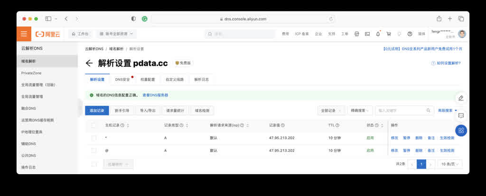
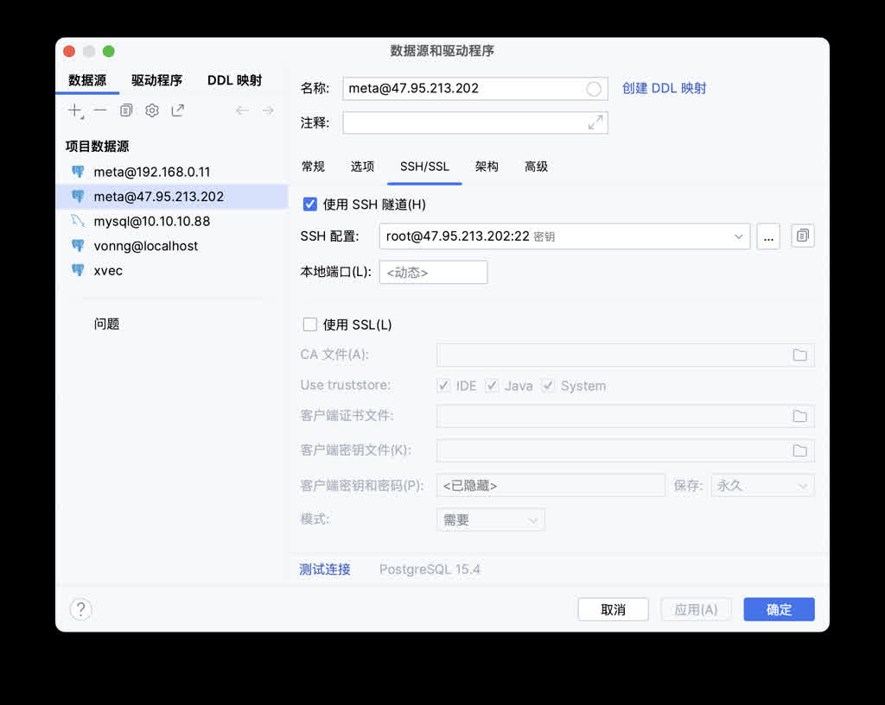

阿里云双十一提供了一个不错的福利，列表价 **¥1500/年** 的 2C/2G/3M ECS服务器，一年 **¥99** 给用三年（99¥ 每年可续费到2026），据说还要给中国所有大学生每人免费送一台。


虽然我经常揶揄公有云是**杀猪盘**，但那是针对我们这种体量的用户。对于个人开发者而言，这种价格真的可以说是很厚道的福利了。2C/2G 倒是不值几个钱，但这个 3M 带宽和公网IP 还是很给力的。新老用户都可以买，截止到双11，我建议所有开发者都薅了这个羊毛，用来建设一个 DevBox。

弄了 ECS 可以干啥用呢？你可以把它当成跳板机，临时文件中转站，搭建一个静态网站，个人博客，运行一些定时脚本跑一些服务，搭个梯子，打造自己的 Git 仓库，软件源，Wiki站点，搭建私有部署的论坛/社交媒体站点。

学生可以用来学习 Linux，构建一个软件编译环境，学习各种数据库：PostgreSQL，Redis，MinIO，用 SQL 和 Python 搞搞数据分析，用 Grafana 和 Echarts 玩玩数据可视化。

Pigsty 为这些需求提供了一个一键安装，开箱即用的底座，让您立刻在 ECS 上拥有一个生产级的 DevBox。

[](https://mp.weixin.qq.com/s/Nh28VahZkQMdR8fDoi0_rQ)


------------

### 然后呢？

Pigsty 提供了开箱即用的主机/数据库监控系统，开箱即用的 Nginx Web 服务器承用于对外服务，一个功能完备，插件齐全的 PostgreSQL 数据库可以用于支持各种上层软件。在 Pigsty 的基础上，你可以很轻松的搭建一个静态网站 / 动态服务。安装完 Pigsty 后，你可以自行探索一下监控系统（Demo： https://demo.pigsty.cc ），它展示了你的主机详情和数据库的完整监控。

我们也会在后续介绍一系列有趣的主题：

* [样例应用：ISD，对全球天气数据进行分析与可视化](https://vonng.com/cn/blog/note/isd/)
* 数据库101：快速上手数据库全能王：PostgreSQL
* 可视化快速上手，用 Grafana 画图进行数据分析
* 静态网站：使用 hugo 打造你自己的静态个人网站
* 跳板机：如何将这台 ECS 作为跳板，访问家中的电脑？
* 站点发布：如何让用户通过域名访问你的个人网站
* SSL证书：如何使用 Let's Encrypt 免费证书加密
* Python环境：如何在 Pigsty 配置 Python 开发环境
* Docker环境：如何在 Pigsty 中启用 Docker 开发环境
* MinIO：如何将这台 ECS 作为你的文件中转站并与他人分享？
* Git仓库：如何使用 Gitea + PostgreSQL 搭建自己的 Git 仓库？
* Wiki站点：如何使用 Wiki.js + PostgreSQL 搭建自己的 Wiki 知识库？
* 社交网络：如何使用快速搭建 Mastodon 与 Discourse？


------------

## 购买配置ECS

作为资深 IaC 用户，我早已习惯了[一键拉起](https://pigsty.io/zh/doc/provision)所需的云资源，置备好所有东西。在控制台上用鼠标点点点这种活儿对我已经非常陌生了。不过我相信也有不少读者其实还并不熟悉云上的操作，所以我们尽可能详尽的展示这里的操作。如果你已经是老司机了，请直接跳过这一部分，进入 Pigsty 配置部分。


------------

### 购买活动虚拟机

没有阿里云账号可以用手机号注册一个，然后用支付宝扫码实名认证完事。进入活动页面，立即购买。地区选一个离你位置最近的，可用区可以选字母序大一点的。操作系统网络无所谓用默认的就行后面再改，选好之后勾选最下面的：我已阅读并同意[云服务器ECS-包年包月服务协议](http://terms.aliyun.com/legal-agreement/terms/suit_bu1_ali_cloud/suit_bu1_ali_cloud201912232014_30443.html)。点击“立即购买”，支付宝付钱，完工。

不差钱的话我建议直接充个三百块，锁定 99¥ 续费一年先，剩下的零钱可以花个几十块钱买个域名，补充点零用的 OSS/ESSD/流量费啥的。毕竟如果你想使用按需付费的东西，还是需要一百块抵押在里面的。

直接在实例页面点 “续费”，续费1年目前的价格是 **99¥** ，可以直接续上锁定下一年的优惠。当然第三年阿里云只是说到时候你可以继续用 **99¥** 的价格继续续费一年到 2026，现在还操作不了。


------------

### 重装系统与密钥

购买完云服务器后，点击控制台。或者左上角 Logo 边上的菜单图标进入 ECS 控制台，然后就能看到你买的实例已经运行了。我们可以在这里进一步配置网络、操作系统，以及密码密钥。


直接点实例边上的  “停止”，点击实例名称链接进入详情页，选择“更换操作系统”。然后选择“公共镜像”，选择你想用的操作系统镜像就好了。Pigsty 支持 EL 7/8/9 以及兼容操作系统，Ubuntu 22.04/22.04 ，Debian 12/11。

这里我们推荐使用 **RockyLinux 8.8 64位**，这是目前主流的企业级操作系统，在稳定性和软件新鲜度上取得了一个均衡。 **OpenAnolis 8.8 RHCK**， **RockyLinux 9.2** ，或者 **Ubuntu 22.04** 也是不错的选择，不过我们后面演示用的都是 **Rocky 8.8**，初学者最好还是不要在这里过多折腾为妙。

> 《EL系统兼容性哪家强？》

在安全设置中，你可以设置 `root` 用户密码/密钥。如果你没有 SSH 密钥，可以使用 `ssh-keygen` 生成一对，或者直接填一个文本密码，这里我们方便起见随便设置一个。设置好了之后，你就可以使用 `ssh root@<ip>` 的方式登陆该服务器了（SSH客户端这种问题就不在这儿展开了，iTerm, putty, xshell, secureCRT 都行）

```bash
ssh-keygen              # 如果你没有 SSH 密钥对，生成一对。
ssh-copy-id  root@<ip>  # 将你的ssh密钥添加到服务器上（输入密码）
```


------------

### 配置域名与DNS

域名现在非常便宜了，一年也就十几块钱。我非常建议整一个，能够带来很大的便利。主要是你可以用不同的子域名来区分不同的服务，让 Nginx 把流量转发到不同的上游去，一机多用。当然，喜欢用 IP 地址 + 端口号直接访问不同服务也无所谓。主要是一来比较土鳖，二来端口开的太多也会有更多安全隐患。

比如这里，我花了十几块钱在阿里云上买了个 `pdata.cc` 的域名，然后在阿里云DNS控制台上就可以去添加域名的解析了，指向刚申请服务器的 IP 地址。一条 `@` 记录，一条 `*` 通配记录，A 记录，指向 ECS 实例的**公网IP地址**就行。



有了域名之后，你就可以用 `ssh root@pdata.cc` 的方式登陆，不用再记 IP 地址了。你也可以在这里配置更多的子域名，指向不同的地址。如果域名是拿来建站的，在中国大陆还需要申请备案，反正阿里云也有一条龙的服务。


------------

### 配置安全组规则

新创建的云服务器带有默认的安全组规则，只允许 SSH 服务也就是 22 端口访问。所以为了访问这台服务器上的 Web 服务你还需要打开 80/443 端口。如果你懒得折腾域名想用 IP + 端口直接访问相应服务，而不是通过域名走 Nginx 的 80/443 端口，那么 Grafana 监控界面的 3000 端口也应该打开。最后，如果你想从本地访问 PostgreSQL 数据库，也可以考虑打开 `5432` 端口。

如果你想偷懒，确实可以添加一条开放所有端口的规则，但云服务器不比自己的笔记本，你也不想自己的 ECS 被人黑了拿去干坏事被封号吧。所以这里我们还是按规矩来。实例详情页里点击安全组，然后点击那个具体的安全组进入详情页进行配置：


在默认的 “入方向” 上添加一条“允许”规则，协议选择 `TCP`，端口范围填入 `80/443/3000/5432`，从 `0.0.0.0/0` 任意地址都可以访问这些端口。


上面这些操作属于 Linux 101 基础知识老生常谈，对老司机来说，使用 Terraform 模板一行命令就完成了。但很多初学者确实不知道如何去弄。

总之，折腾完上面的步骤之后，你就有一台准备就绪的云服务器了！你可以在任意有网络的地方使用域名登陆/访问这台服务器。接下来，我们就可以在开始建设数字家园了：安装 Pigsty。


------------

## 安装配置Pigsty

现在，你已经可以使用 root 用户，通过 SSH 登陆这台服务器了，接下来就可以下载、安装、配置 Pigsty 了。

尽管使用 `root` 用户并非生产最佳实践，但对于个人 DevBox 来说没啥关系，我们就不折腾新建管理用户这摊子事儿了。直接使用 `root` 用户开干：

```bash
curl -fsSL https://repo.pigsty.io/get | bash  # 下载 Pigsty 并解压到 ~/pigsty 目录
cd ~/pigsty      # 进入 Pigsty 源码目录，完成后续 准备、配置、安装 三个步骤即可
./bootstrap      # 确保 Ansible 正常安装，如果存在 /tmp/pkg.tgz 离线软件包，便使用它。
./configure      # 执行环境检测，并生成相应的推荐配置文件，如果你知道如何配置 Pigsty 可以跳过
./install.yml    # 根据生成的配置文件开始在当前节点上执行安装，使用离线安装包大概需要10分钟完成
```

Pigsty 官方文档提供了详细的安装配置教程：https://pigsty.cc/doc/#/zh/INSTALL

安装完成后，您可以通过域名或`80/443`端口通过 Nginx 访问 WEB 界面，通过 `5432` 端口访问默认的 PostgreSQL 数据库服务，通过 `3000` 端口登陆 Grafana。

在浏览器中输入 `http://<公网IP>:3000`，即可访问 Pigsty 的 Grafana 监控系统。 ECS 的 3M 带宽小水管会在初次加载 Grafana 时费点功夫。 您可以匿名访问，也可以使用默认的用户名密码 `admin` / `pigsty` 登陆。请务必修改这个默认密码，避免别人随便从这里进入搞破坏。

上面这个教程看上去真的很简单对吧？对的。作为一台随时可以销毁重建的开发机，这么搞毫无问题。但如果你想把它作为一个承载个人数字家园的环境，请最好参考下面的 **配置详情**  和 **安全加固** 部分再进行动手。


------------

### 配置详情

当您安装 Pigsty 运行 `configure` 这一步时，Pigsty 会根据您的机器环境，生成一个单机安装的配置文件：`pigsty.yml`。默认的配置文件可以直接用，但你可以进一步进行定制修改，来增强其安全性与便利性。

下面是一个推荐的配置文件样例，它应当默认在 `/root/pigsty/pigsty.yml` 这里，描述你需要的数据库。Pigsty 提供了 280+ 定制参数，但你只需要关注几个进行微调即可。你的机器内网IP地址，可选的公网域名，以及各种密码。域名是可选的，但我们建议你最好用一个。其他的密码你懒得修改也就算了，`pg_admin_password` 请务必修改一个。

```yaml
---
all:
  children:

    # 这里的 10.10.10.10 都应该是你 ECS 的内网 IP 地址，用于安装 Infra/Etcd 模块
    infra: { hosts: { 10.10.10.10: { infra_seq: 1 } } }
    etcd:  { hosts: { 10.10.10.10: { etcd_seq: 1 } }, vars: { etcd_cluster: etcd } }

    # 定义一个单节点的 PostgreSQL 数据库实例
    pg-meta:
      hosts: { 10.10.10.10: { pg_seq: 1, pg_role: primary } }
      vars:
        pg_cluster: pg-meta
        pg_databases:
          - { name: meta ,baseline: cmdb.sql ,schemas: [ pigsty ] }
        pg_users: # 最好把这里的两个样例用户的密码也修改一下
          - { name: dbuser_meta ,password: DBUser.Meta   ,roles: [ dbrole_admin ] }
          - { name: dbuser_view ,password: DBUser.Viewer ,roles: [ dbrole_readonly ] }
        pg_conf: tiny.yml   # 2C/2G 的云服务器，使用微型数据库配置模板
        node_tune: tiny     # 2C/2G 的云服务器，使用微型主机节点参数优化模板
        pgbackrest_enabled: false # 这么点磁盘空间，就别搞数据库物理备份了
        pg_default_version: 13   # 用 PostgreSQL 13

  vars:
    version: v2.5.0
    region: china
    admin_ip: 10.10.10.10  # 这个 IP 地址应该是你 ECS 的内网IP地址
    infra_portal: # 如果你有自己的 DNS 域名，这里面的域名后缀 pigsty 换成你自己的 DNS 域名
      home: { domain: h.pigsty }
      grafana: { domain: g.pigsty ,endpoint: "${admin_ip}:3000" , websocket: true }
      prometheus: { domain: p.pigsty ,endpoint: "${admin_ip}:9090" }
      alertmanager: { domain: a.pigsty ,endpoint: "${admin_ip}:9093" }
      minio: { domain: sss.pigsty  ,endpoint: "${admin_ip}:9001" ,scheme: https ,websocket: true }
      postgrest: { domain: api.pigsty  ,endpoint: "127.0.0.1:8884" }
      pgadmin: { domain: adm.pigsty  ,endpoint: "127.0.0.1:8885" }
      pgweb: { domain: cli.pigsty  ,endpoint: "127.0.0.1:8886" }
      bytebase: { domain: ddl.pigsty  ,endpoint: "127.0.0.1:8887" }
      gitea: { domain: git.pigsty  ,endpoint: "127.0.0.1:8889" }
      wiki: { domain: wiki.pigsty ,endpoint: "127.0.0.1:9002" }
      noco: { domain: noco.pigsty ,endpoint: "127.0.0.1:9003" }
      supa: { domain: supa.pigsty ,endpoint: "10.10.10.10:8000", websocket: true }
      blackbox: { endpoint: "${admin_ip}:9115" }
      loki: { endpoint: "${admin_ip}:3100" }

    # 把这里的密码都改掉！你也不想别人随便来串门对吧！
    pg_admin_password: DBUser.DBA
    pg_monitor_password: DBUser.Monitor
    pg_replication_password: DBUser.Replicator
    patroni_password: Patroni.API
    haproxy_admin_password: pigsty
    grafana_admin_password: pigsty
...
```

在 `configure` 生成的配置文件中，所有 `10.10.10.10` 这个 IP 地址都会被替换为你的 ECS 实例的首要内网 IP 地址。注意：**不要在这里使用公网 IP 地址**。在 `infra_portal` 参数中，你可以把所有的 `.pigsty`  域名后缀换成你新申请的域名，比如 `pdata.cc` ，这样 Pigsty 会允许您通过 Nginx 使用不同域名来访问不同的上游服务。后面如果您希望添加几个个人网站，也可以在这个配置里直接修改并应用。

修改好配置文件 `pigsty.yml` 之后，运行 `./install.yml` 即可开始安装。


### 安全加固

大多数人可能都不在乎安全这个事，但我还是必须要说一下。只要你改了默认密码，ECS 和 Pigsty 的默认配置对大多数场景已经足够安全了。这里有一些安全加固的小建议：https://pigsty.cc/doc/#/zh/SECURITY

第一个要点是，出于安全考虑：除非你真的很想偷懒从本地直接访问远程数据库，一般不建议对公网开放 5432 端口，很多数据库工具都提供了 SSH Tunel 功能 —— 先 SSH 到服务器再本地连接数据库。（顺带一提，Intellij 自带的 Database Tool 是我用过最好用的数据库客户端工具）

如果你真的很想从本地直连远程数据库，Pigsty 默认规则也允许您使用默认的超级用户 `dbuser_dba` 使用 SSL / 密码认证从任何地方访问，请确保你改了 `pg_admin_password` 参数，并开放了 5432 端口。



第二个要点是使用域名而非 IP 地址访问，就要求你做一些额外的工作：域名可以在云厂商那里买，也可以使用本地 `/etc/hosts` 的静态解析记录作为下位替代。如果您实在懒得折腾，IP 地址 + 端口直连也不是不行。

第三个要点是使用 HTTPS， SSL 可以使用各家云厂商或 Let's Encrypt 提供的免费证书，使用 Pigsty 默认的自签名 CA 颁发的证书作为下位替代。

Pigsty默认使用自动生成的自签名的CA证书为Nginx启用SSL，如果您希望使用 HTTPS 访问这些页面，而不弹窗提示"不安全"，通常有三个选择：

- 在您的浏览器或操作系统中信任Pigsty自签名的CA证书： `files/pki/ca/ca.crt`
- 如果您使用 Chrome，可以在提示不安全的窗口键入 `thisisunsafe` 跳过提示
- 您可以考虑使用 Let's Encrypt 或其他免费的CA证书服务，为 Pigsty Nginx 生成正式的CA证书

我们会在后面的教程中详细介绍这些细节，你也可以参考 Pigsty 的文档进行自行配置。


