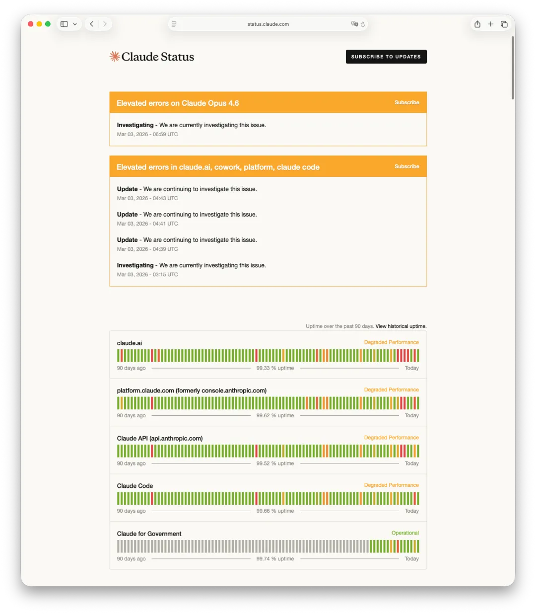
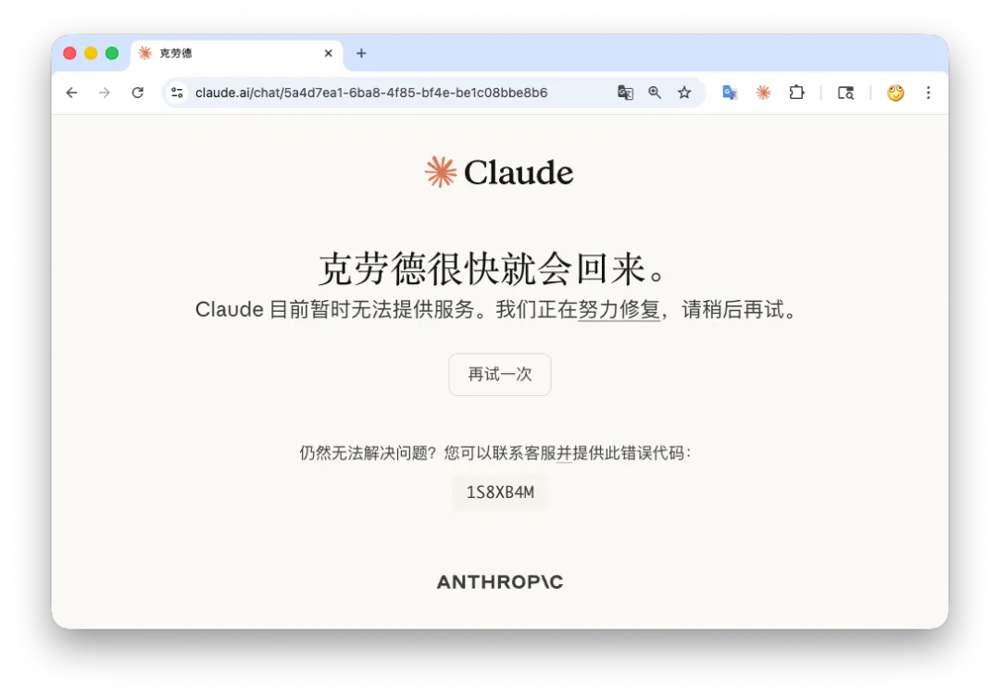

Claude went down globally on March 2, 2026.

The dramatic narrative that immediately formed was irresistible: AWS facilities in the Middle East had just been hit by drones, and now Claude was collapsing too. The story spread fast.

But it was probably wrong.

## Fact one: what failed, and what did not?

Anthropic's own status updates made one thing clear: the incident primarily hit **the web front end, login, session management, and adjacent user-facing services**.

The most important clue is that **the API stayed largely available**. The incident pattern looked like this:

- `claude.ai` was unstable or unavailable
- `platform.claude.com` showed failures
- Claude Code saw elevated errors because parts of its auth path depended on the same front-end infrastructure
- Anthropic's core API path remained much healthier

That looks much more like **the traffic entry points breaking first** than **the model-serving back end being physically destroyed**.

## Fact two: the AWS Middle East incident was real, but it is still the wrong explanation

The AWS event itself was serious. Public reporting described direct strikes, fire, and cascading outages across multiple availability zones in the region.

But that alone does not answer the question that matters:

**Was Claude running there?**

## Fact three: Claude's core infrastructure is not in the Middle East

Anthropic is a Bay Area company. Large-scale inference for Claude depends on U.S.-based GPU capacity, not on AWS regional footprints built primarily for Middle Eastern enterprise customers.

If Claude's core inference path had really depended on the Middle East, the API should have been the first thing to collapse. That is not what the incident pattern looked like.

## A more plausible explanation: success tax

A much better explanation is a traffic shock.

In the previous 48 hours, Anthropic had become the center of a political and commercial storm. Public backlash against OpenAI's Pentagon deal pushed a visible migration of user attention toward Claude. Reports described a sudden jump in app downloads, registrations, and public switching from ChatGPT to Claude.

If those numbers are even directionally right, then the failure mode makes perfect sense:

- APIs remain more stable because they already sit behind quota and rate controls.
- Web login and session systems get hammered by consumer traffic.
- Claude Code is partially affected because some auth paths are shared.

## The timeline fits the user-surge theory better

The AWS Middle East incident began much earlier than the Claude outage. If the outage had really been caused by that physical event, the delay and the failure pattern would be much harder to explain.

A cleaner timeline is this: the narrative spread over the weekend, user demand surged, Monday arrived in the United States, and the consumer front end hit a capacity wall.

That also explains why the outage looked so uneven. The model back end was not uniformly dead. The systems around access and identity were.

## Anthropic's own wording matters

Anthropic later said it had been dealing with **"unprecedented demand."**

That phrase is revealing. It points to scale stress, not to missile debris.

There are two classic kinds of outages:

1. An outage because nobody uses the product and it still breaks.
2. An outage because too many people suddenly want to use it.

This looked much more like the second kind: a **success tax**.

## What the incident teaches

The lesson is not that back-end GPU clusters are everything. Consumer AI products also need:

- elastic authentication systems,
- resilient web front ends,
- and capacity planning for social or political shocks that can change user numbers within 48 hours.

As of publication time, Anthropic's status page still showed residual instability:

That gradual recovery pattern is much more consistent with incremental capacity recovery than with physically destroyed inference infrastructure.

## Conclusion

Two things can both be true:

- AWS Middle East data centers suffered an extraordinary physical incident.
- Claude suffered a major global outage.

But putting an equals sign between them is lazy analysis.

The better reading is that Claude got hit by a front-end capacity crisis at the exact moment the internet was busy telling itself a much more cinematic story.
