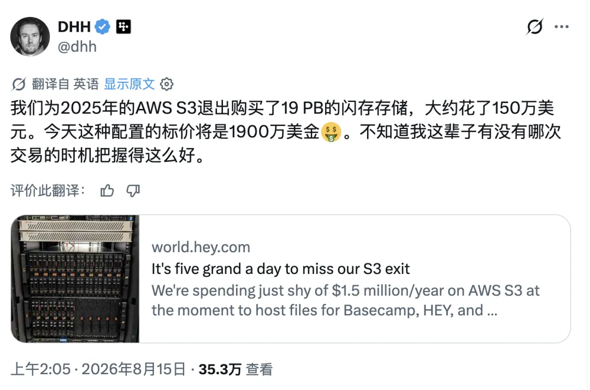
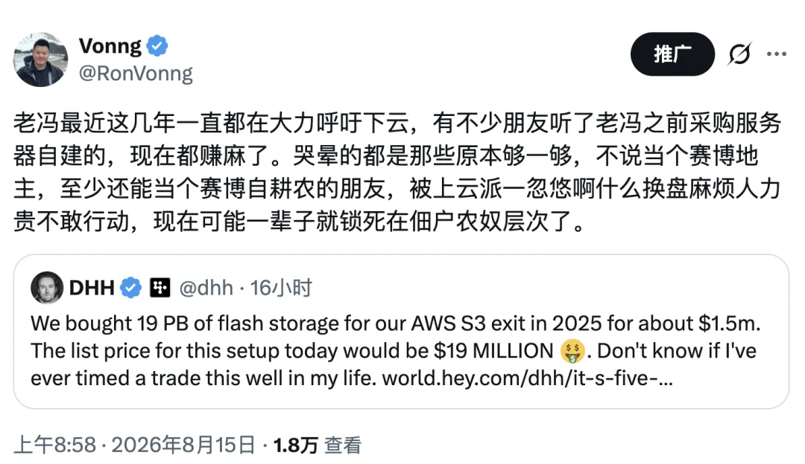
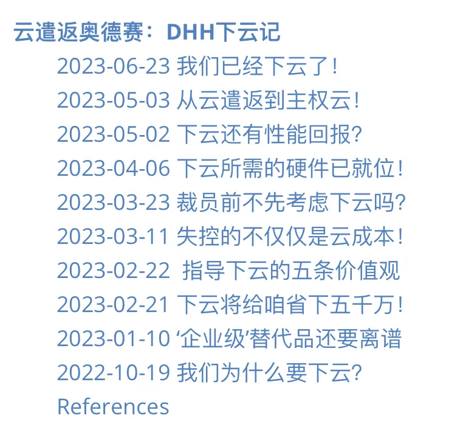
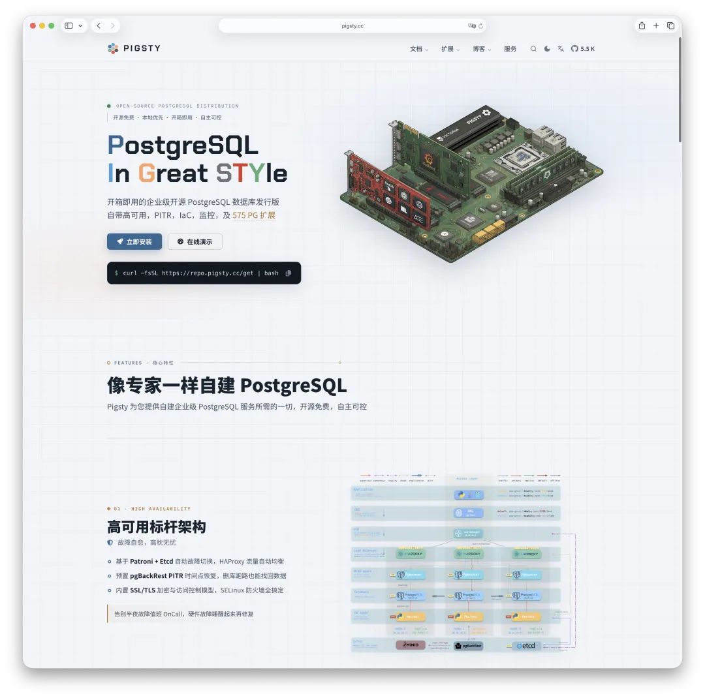

下云从来不只是省钱问题，更是赎身问题。成本曲线会动，主权逻辑不会。老冯喊了好几年下云了，前两年听劝的朋友已经赚麻了。

---

## 一、这辈子最好的一笔交易

今天早上老冯刷推，看到 DHH 发了条凡尔赛：

“我这辈子就没做过时机踩得这么准的交易。”150 万美元变 1900 万美元，一年出头，十几倍。

但这本来并不是一笔投资。DHH 只是嫌 S3 账单太贵，想把存储搬回家省点钱。结果省着省着，把一柜子硬盘省成了这辈子最好的持仓。

省钱的人发了财，观望的人拍大腿——这就是 2026 年存储市场的魔幻现实。这条推文背后的账，值得所有还在云上交租的朋友仔细看一遍。

---

## 二、一本翻了三年的账

DHH 和他的 37signals（Basecamp 和 HEY 的东家）这场下云长跑，老冯在《[云计算泥石流](/cloud/exit/)》专栏里从头追到尾。

**2022 年 10 月**，DHH 发出檄文《[我们为什么要离开云](/cloud/odyssey/#2022-10-19-我们为什么要下云)》。起因简单粗暴：年度云账单 320 万美元，忍无可忍。

**2023 年**，花约 70 万美元买了一批 Dell 服务器，半年时间把七个应用从云上迁了下来。当年省出来的钱，就把这批硬件的成本全部收了回来。

**2024 年**，第一个完整的“干净年”：一年省下近 200 万美元，账单从 320 万降到 130 万。剩下这 130 万全是 S3——被一纸四年合同锁着，要到 2025 年年中才到期。最终结果[比原先预计的还要好](/cloud/odyssey-done/)。

**2025 年 6 月 30 日**，S3 合同到期。他们提前在两个数据中心架好了共 18 PB 的 Pure Storage 全闪阵列：硬件约 150 万美元，五年维保不到 100 万美元。DHH 还专门写了《[S3 晚搬一天，就多花四万](https://world.hey.com/dhh/it-s-five-grand-a-day-to-miss-our-s3-exit-b8293563)》给全公司上发条：迁移要是拖过截止日，每多用一天 S3 就是 5000 美元——一周 3.5 万，一个月 15 万。最后 AWS 给了 60 天免费迁出窗口，相当于豁免了约 25 万美元出网费。数据搬完，好聚好散。

**五年总节省**，预估从最初的 700 万美元一路上修到 1000 万美元以上。运维团队一个人没加；相关的《[下云 FAQ](/cloud/cloud-exit-faq/)》和《[云下高可用秘诀](/cloud/uptime/)》也都给出了复盘。

这还只是成本账，性能账要另算。自建的本地 NVMe 全闪，跟云上走网络的云盘，根本是两个物种——老冯十年前就在 NVMe 全闪存上跑 PostgreSQL 了，而云上绝大多数用户至今还在用 IOPS 逊毙的乞丐云盘。

这样的账本也不是孤例。今天老冯群里还有位朋友晒了自己的账：**下云两年，累计省了一个多亿人民币。** 不过他也补了一句：“往后这条路走不通了，现在硬件涨得太贵了。”

---

## 三、窗口确实在收窄

从 2025 年下半年开始，AI 基建把整个存储市场抽干了。TrendForce 在 [2025 年 9 月](https://www.trendforce.com/presscenter/news/20250925-12736.html)预计，2025 年第四季度 NAND Flash 合同价环比上涨 5%～10%；到 [2026 年 2 月](https://www.trendforce.com/presscenter/news/20260202-12911.html)，又把 2026 年第一季度的涨幅预测从 33%～38% 上调至 55%～60%；同年 [3 月](https://www.trendforce.com/presscenter/news/20260331-12995.html)，第二季度的预测进一步升至 70%～75%。

零售端也明显跟涨：部分此前售价约 45 美元的 1 TB 入门级 SSD，一度涨到 90 美元上下。DRAM 更为紧张，[2025 年第三季度的同比涨幅约为 172%](https://www.z2data.com/guides/ai-memory-chip-shortage)。供给侧看不到迅速缓解的迹象：[企业级 SSD 已吃掉约六成 NAND 产出](https://www.blocksandfiles.com/data-management/2026/06/18/keep-your-data-and-your-budget-during-the-capacity-crunch/5248187)；[SK 海力士在 2025 年 10 月就宣布，2026 年的 DRAM 与 NAND 产能已有客户承接](https://news.skhynix.com/sk-hynix-announces-3q25-financial-results/)；能真正放量的新产能，最快也要等到 2027 年末。PC 厂商也开始压缩基础存储规格，或换用更便宜的 NAND：例如 [Dell 新款 XPS 13 重新提供 256 GB 选项](https://www.tomshardware.com/laptops/dell-xps-13-targets-macbook-neo-with-intels-wildcat-lake-usd699-starting-price-usd599-for-students)，[联想 ThinkBook 则开始采用更便宜的国产 SSD](https://www.techspot.com/news/112998-lenovo-starts-shipping-business-laptops-chinese-made-ymtc.html)。

消费级 SSD、内存和整机厂商因此都承受着涨价与减配压力。群里的朋友也在感慨：以前 10 万元一台的服务器，如今要 30 多万元。消费端也一样——老冯去年[一万出头买的 AMD AI Max 小主机](https://mp.weixin.qq.com/s?__biz=MzU5ODAyNTM5Ng==&mid=2247490389&idx=1&sn=c80d97f60ebe69fe303273de228e14c5&scene=21#wechat_redirect)，现在已经翻了整整一倍还要多。

**上云还是下云，本质是一条成本收益曲线的交叉点问题——规模越大，下云越划算。** 前两年硬件白菜价，这个交叉点压得极低，小微企业踮踮脚就够得着。所以老冯那两年扯着嗓子大喊：够一够，就下来吧。现在硬件三级跳，交叉点被抬到了中型企业以上。窗口，确实收窄了。

当年能听老冯一声劝，自己买服务器下云自建的朋友，现在都赚麻了。当年被上云党“换盘麻烦”“人力太贵”这些话术忽悠、犹豫没动的朋友，眼下多半已经哭晕在厕所。原本踮踮脚够一下，不说当个赛博地主，至少还能当个赛博自耕农；现在可能一辈子就锁死在赛博佃农或农奴层次了。

然而亡羊补牢，未为晚也。窗口变窄，并不等于下云逻辑已经失效。

---

## 四、租是敞口，买是对冲

DHH 那笔十几倍的“交易”提醒了一个常被忽略的事实：

**云是让你永远按现货价租硬件。**

你以为上了云，就躲过了硬件涨价？想多了。云厂商服务器里的 DRAM 和 NAND，也得从三星、海力士、美光手里真金白银买来。他们的采购成本涨了，你的账单迟早跟着涨——折扣收紧、续约加价、新实例价目表上调。你并没有躲过涨价，只是把涨价敞口原封不动留在自己身上，延迟结算而已。

自建者呢？买断的那一刻，未来五年的成本就锁死了。后面硬件涨到天上去，跟他一毛钱关系没有——甚至像 DHH 这样，账面反倒“赚”出十几倍。用金融行话说：**租云，是裸奔的空头敞口；买硬件，是对冲。**

过去二十年，摩尔定律把所有人惯坏了。大家默认硬件只会越来越便宜，“租”永远不吃亏，晚买还有折上折。AI 时代第一次把这个默认设置掀翻了：算力和存储成了硬通货，持有者坐地升值，租用者裸露在通胀里。

所以“硬件太贵了，快别想下云了”这句话，恰恰说反了。硬件越贵，越证明早下车的人赌对了；也越说明，你云账单里埋着的涨价空间，比你想象的大得多。

---

## 五、折扣是议价权的产物

当然，老冯从来不认为下云只是个省钱问题。省钱只是表象，主权才是灵魂。

你在云上能拿到多少折扣，归根结底取决于一件事——退出权：**你能不能走。**

DHH 那份 S3 合同的价格，为什么能压得那么低？签四年长约是一方面；更重要的是，AWS 知道他真的能走，也会走——2023 年他已经把计算全部搬走了，说到做到。所以最后离场时，AWS 豁免出网费、开免费迁出通道，客客气气把人送出门。

反过来，要是你的数据库、对象存储、消息队列全都焊死在某家云的专有 PaaS 上，连份像样的迁移方案都拿不出来，那就成了纯纯的肥羊。跑不掉的主，折扣给那么多干什么？

所以老冯反复说：**没有自建能力，就没有退出权；没有退出权，就没有议价权。** 混合云、多云，听着风光，前提都是你有能力自建——否则谈判桌上连 Plan B 都没有。没有 Plan B 的谈判，不叫谈判，叫求饶。

---

## 六、锁你的不是服务器，是数据

那到底是什么，把人锁死在云上的？不是服务器。服务器、带宽、磁盘这些 IaaS 资源，包括现在的模型 Token，本质上都是大宗商品：东家不行换西家，比价下单，谁便宜用谁。这一层，没人锁得住你。

真正锁你的是 PaaS，是数据。数据是有引力的：几百 GB 的时候，想走抬腿就走；几十 TB 的时候，走一趟脱层皮；到了 PB 级，光出网费就能让你打消念头——要不是 AWS 这两年迫于压力开了免费迁出通道，DHH 那几个 PB 的数据搬回家，光过路费就得几十万美元。

而所有 PaaS 里，真正的命门只有两个：**数据库和[对象存储](/db/long-live-silo/)。**

你可以不用 K8s——世界上一大半服务，一台裸 Linux 加 systemd 就跑得好好的。你也可以不用那些花里胡哨的托管中间件。但你不可能不用数据库；只要业务里有文件，对象存储或者文件系统也绕不开。**状态在哪里，锁链就在哪里。** 所以下云的第一步，根本不是买服务器、搬机房，而是**把依赖收敛到有开源实现的标准协议上**：

- 数据库，收敛到 PostgreSQL 协议；
- 对象存储，收敛到 S3 协议。

这两个协议的妙处在于：既是云上的事实标准，又有完整的开源实现。今天你可以心安理得地用云上的托管 PG 和对象存储，明天就能原地换成自建的 PostgreSQL 和开源对象存储，应用代码一行不用改。协议中立，进退自如。

反过来，那些只此一家、别无分号的专有 PaaS 接口，每接入一个，就是在卖身契上多摁一个手印。

有个细节值得玩味：DHH 在博客里说，Pure Storage 自带 S3 兼容接口，所以他们不需要 Ceph 或者 MinIO；但他紧接着补了一句：要是你打算用商品硬件干这件事，这类开源对象存储就是你要找的东西。你看，土豪有土豪的走法，150 万美元的一体机；平民有平民的走法，商品硬件加开源软件。殊途同归：接口还是那个 S3，主权回到自己手里。

---

## 七、三句祖传话术，挨个鞭一遍

聊到这儿，“上云派”的三句祖传话术，该拉出来遛遛了。

**话术一：“自建要换硬盘，麻烦死了，数据丢了怎么办？”**

这是老冯听过最经久不衰的鬼故事，仿佛一下云，CTO 就得半夜揣着螺丝刀蹲机房。

拆开看看。服务器都有 N 年质保，盘坏了打个电话，厂商上门给你换。就算你规模大到天天坏盘——比如那位两年省了一个多亿的朋友——从省下的钱里抠出零头的零头，也绝对有大把人上赶着 24 小时待命给你换盘。这算什么问题？

更根本的是，换盘恐惧是单机 RAID 5 时代留下的心理阴影。那年头一块盘挂了，整组阵列重建；重建到一半再挂一块，就全完蛋，确实吓人。但现代架构的冗余早就不在盘这一层，而在集群层：数据库有主从高可用，对象存储有纠删码、多副本。任何一块盘、任何一台机器挂掉，服务照跑不误。这都是在 SOP 里翻来覆去演练玩烂了的场景。只要 PaaS 这层的高可用做扎实了，换盘就跟宾馆换床单一样。**床单脏了换一条，客人该睡睡。** 哪家宾馆嫌“换床单麻烦”就不开业了？

**话术二：“自建要养人，人力太贵。”**

这话两年前还剩三分道理，今天已经彻底破产。从前自建数据库、对象存储，确实吃老师傅：调参、备份、恢复、疑难排障，全是经验活。市面上一个靠谱 DBA，几万元月薪起步，小公司确实养不起，这是实话。

现在呢？每月 200 美元的 Claude 或 Codex 订阅，7×24 小时待命，疑难杂症分析起来甚至比很多从业者都明白。工具侧同样如此：开源发行版早就把 know-how 产品化了。高可用、备份恢复、时间点回滚、监控告警——这些从前靠老师傅拿事故喂出来的经验，如今是开箱即用的默认配置。

说到底，云锁人锁的是三层：**资源层**，可替换，锁不住；**数据层**，有引力，最沉重；还有最隐蔽的一层——**技能层**。一个团队用云十年，就会组织性地遗忘自建的手艺。到时候不是不想走，而是不会走了。这才是最深的锁。而 AI 恰恰就在这一层开锁：失传的手艺，重新变得人人可得。

**话术三：“反正省的又不是我的钱。”**

为什么很多明明该下云的公司迟迟不动？因为对经办的打工人来说，下云省的是老板的钱，冒的是自己的险。上云出了事，“业界都这么干”，锅甩给云厂商就完了。没有人因为购买 IBM 和 Oracle 被开除；不做不错，永远立于不败之地——司马懿的传人，遍布各大公司的基础设施部门。所以下云从来不是技术决策，而是一把手决策。老板不拍板，神仙也推不动。

---

## 八、赛博封建等级表

把老冯这套“赛博封建论”按基础设施主权排下来，大致是五个等级：

**赛博国王**：各种大型科技公司与云厂商。

**赛博地主**：自有机房、自有硬件、自有软件栈，拥有完全主权。硬件涨价对他们不是成本，而是资产升值——DHH 现在就坐在 1900 万美元的“庄园”里喝茶。

**赛博骑士（游侠）**：租各家云的 IaaS，但 PaaS 层全部自建：数据库是自己的，对象存储是自己的，监控是自己的。云于他只是随时可换的资源供应商。今天这家贵了换那家，在各路云领主、赛博老爷之间纵横捭阖，横跳自如。

**赛博佃农**：用云，也用云的托管服务，但至少守住了标准协议——PG 协议、S3 协议。理论上随时能迁走，只是眼下年年交租。

**赛博农奴**：深度绑定专有 PaaS。数据格式、API、工作流全都长在一家云里，连迁移方案都做不出来。合同即卖身契，涨价只能受着，一辈子锁死在庄园里。

完全下云的门槛确实不低。如果要从 IDC 服务器托管开始自建，每年基础设施开销达到数百万元后才开始有性价比。但 **“硬件太贵”这件事，顶多拦住你当地主，根本拦不住你当骑士与游侠**——从农奴升级到骑士，不需要一分钱硬件投入。你完全可以继续租用云的机器、磁盘和带宽，只是把 PaaS 层收回自己手里。买不起地没关系，至少先把卖身契撕了。赎身不要钱，需要的只是你的认知与决心。

“自建能力”这件事，任何时候做都不晚，哪怕你一台物理服务器都不买。它不一定马上给你省钱，但它每一天都在替你保住退出权。而有退出权，才有议价权。

---

## 九、自由很贵，但从未这么便宜

最后，利益相关：老冯这几年做的 Pigsty，干的就是免费“铠甲马具铺”的营生。

开箱即用的 PostgreSQL 发行版，解决数据库的问题；接盘 MinIO 之后的 [Silo](/db/long-live-silo/)，解决对象存储的问题；配上完整的 VictoriaMetrics 可观测性全家桶——在裸 Linux 上零外部依赖，拉起一整套生产级的数据基础设施。开源，免费。跑在自己的物理机上，还是租来的云服务器上，随你——**主权在你。** 就在今天，[Pigsty v4.5 发布](/pigsty/v4.5/)：PostgreSQL 18.6、575 个扩展，对象存储正式换装 Silo。

这是老冯的来时路，是我自己走过的道路。我能做的，是把铠甲马具白送给你，把说明书写明白；剩下那点安装调试的活，如今有 AI 陪你干完。当然，比起在云控制台里点点点，这终归要多费一点心思。自由从来不免费——它只是从未像今天这样便宜过。

一边是省事，一边是自由。DHH 已经选完了，顺手还做成了这辈子最好的一笔交易。

你呢？

