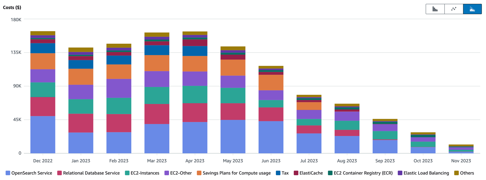

A year ago we announced our [plan to leave the cloud](https://world.hey.com/dhh/why-we-re-leaving-the-cloud-654b47e0), subsequently disclosed our [$3.2 million cloud bill details for 2022](https://dev.37signals.com/our-cloud-spend-in-2022/), and decided not to rely on [expensive enterprise-grade services](https://world.hey.com/dhh/the-only-thing-worse-than-cloud-pricing-is-the-enterprisey-alternatives-854e98f3) but to build our own tools for the cloud exit - our mission was set!

A month later, we ordered **$600,000** worth of Dell servers to achieve this goal, and conservatively estimated [we'd save $7 million over the next five years](https://world.hey.com/dhh/we-stand-to-save-7m-over-five-years-from-our-cloud-exit-53996caa). We also detailed the [five core values driving our cloud exit](https://world.hey.com/dhh/five-values-guiding-our-cloud-exit-638add47) — not just cost, but independence and staying true to the original internet spirit, among others.

In February, we introduced [Kamal](https://world.hey.com/dhh/introducing-kamal-9330a267), our self-reliant tool built in a few weeks to help us leave the cloud while retaining the innovations of cloud computing in containers and operations principles.

Soon after, all the hardware we needed [had arrived](https://world.hey.com/dhh/the-hardware-we-need-for-our-cloud-exit-has-arrived-99d66966) at data centers in two different geographic regions - a total of 4,000 vCPUs, 7,680GB of memory, and 384TB of NVMe storage!

By June, everything was ready. [We successfully left the cloud!](https://world.hey.com/dhh/we-have-left-the-cloud-251760fb)

If calling this cloud exit journey "controversial" would be putting it mildly - millions of people read the updates through LinkedIn, X/Twitter, and this mailing list. I received thousands of comments requesting clarification, providing feedback, and expressing disbelief at our "audacious" choice to take a different path - **while others were still figuring out cloud adoption, we'd already completed our cloud exit**.

But let's speak with results: not only did we complete the cloud exit quickly, but customers [barely noticed any difference](https://37status.com/uptime). Soon, the cost savings began snowballing, and by September, our cloud bill had already [saved us $1 million annually](https://world.hey.com/dhh/our-cloud-exit-has-already-yielded-1m-year-in-savings-db358dea). As prepaid instances gradually expired (those year-long commitments for discounts), the bill began collapsing further:

Today, the cloud exit is complete, but various questions keep coming: to avoid answering the same questions repeatedly, I wanted to compile a classic "Frequently Asked Questions" (FAQ) list. Here's the FAQ content:

***Will the savings on hardware be offset by larger team salaries?***

No, because our team composition hasn't changed after leaving the cloud. The same people who operated [HEY](https://hey.com/) and [Basecamp](https://basecamp.com/) in the cloud are the same ones operating these applications on our own hardware now.

This is the core fraud of cloud marketing: everything is so simple that you hardly need anyone to maintain it. I've never seen this come true, whether at [37signals](https://37signals.com/) or other companies running large internet applications. The cloud has some advantages, but usually not in reducing operations staff.

***Why did you choose to leave the cloud instead of optimizing your cloud bill?***

Our 2022 cloud bill was $3.2 million, while previous bills were more than double that. The current cloud bill has already been carefully reviewed, negotiated, and deeply optimized - through long-term repetitive cost-cutting work, we've completely squeezed out all the savings here.

This partially answers why I'm very bullish on cloud exit for medium-sized and larger software companies. Many businesses with similar customer scales to ours easily have monthly cloud expenses 2-4 times our pre-optimization bill. Therefore, the potential for cost reduction is only higher.

***Have you tried using "cloud-native" applications for the cloud?***

Cloud-native, usually contrasted with "Lift and Shift," is touted as the right path to fully leverage cloud advantages, but it's just another pile of cloud marketing nonsense. Cloud-native is fundamentally based on a false belief - that Serverless functions and various on-demand tools can save users money. But if you need a pound of sugar, individually wrapped sugar cubes won't be cheaper. I've written about this in "[Don't be fooled by Serverless](https://world.hey.com/dhh/don-t-be-fooled-by-serverless-776cd730)" and "[Even Amazon can't make sense of Serverless or microservices](https://world.hey.com/dhh/even-amazon-can-t-make-sense-of-serverless-or-microservices-59625580)."

***What about security? Aren't you worried about being hacked?***

Most security issues when running software on the internet stem from applications and their direct dependencies. Whether you rent computers from cloud providers to run applications or own these servers yourself, the work required to ensure security isn't fundamentally different.

If anything, running services in the cloud might give people a false sense of security - thinking security isn't something they should worry about - which is absolutely not the case!

A significant advantage of modern containerized application delivery is that you no longer need to spend much time manually patching machines. Most of the work is contained in the Dockerfile, allowing you to deploy and run the latest application versions on the latest Ubuntu or other operating systems - this process is the same whether you're renting machines in the cloud or managing your own.

***Don't you need a world-class team of super engineers to do this?***

I've never been shy about showing off and praising our excellent team at 37signals, and I'm genuinely proud of the team we've assembled. But claiming we operate hardware because they have some special magical insights would be far too arrogant.

The internet began in 1995, while the cloud didn't become the default option until at least 2015. So for over twenty years, companies operated their own hardware to run applications. This isn't some lost ancient knowledge - we may not know exactly how the pyramids were built, but we're crystal clear on how to connect a Linux machine to the internet.

Moreover, the expertise required to operate on your own hardware and the expertise required to operate through cloud rental are 90% the same. At least at our scale of millions of users and hundreds of thousands of dollars in monthly bills.

***Does this mean you're building your own data centers?***

Except for a few giants like Google, Microsoft, and Meta, nobody builds their own data centers. Everyone else just rents a few racks, a room, or an entire floor at professional data centers (like Equinix).

So, owning your own hardware doesn't mean you have to worry about security, power supply, fire suppression systems, and other various facilities and details - building these facilities could cost hundreds of millions of dollars.

***Who does the server racking and network cable plugging?***

We use a white-glove data center management service provider called [Deft](https://deft.com/). There are countless similar companies. You pay them to unbox Dell or other companies' servers, place them directly into data centers, rack the servers, and you can see new IP addresses appear, just like the cloud, except it's not instant.

Our operations team has basically never set foot in these data centers. They work remotely from around the world. Compared to the early internet days when everyone pulled their own cables, this operational experience is more deserving of being called "cloud."

***What about reliability? Doesn't the cloud do this for you?***

When we operated in the cloud, we used two geographically separated regions and implemented massive redundancy within each region. When we left the cloud, we did exactly the same thing. We host our own hardware in two geographically separated data centers, each capable of handling our entire load, with backups for every critical infrastructure component.

Reliability largely depends on redundancy - you should be able to lose any computer, any component at any time without causing problems. We had this capability in the cloud, and we have the same with our own hardware now.

***What about international business performance? Isn't the cloud faster?***

Our previous cloud deployment used two different regions, both within the US, and also used a CDN network with local edge nodes globally. Same as the reliability issue: after leaving the cloud, we also use two US regional data centers and use international CDN to accelerate content delivery.

Fundamentally, the challenges are the same on and off the cloud. The difficulty of international footprint usually isn't in configuring hardware and ensuring data center security, but in your application needing to handle multiple primary database writes, deal with replication delays, and various other interesting work needed to make applications run fast on global networks.

We're currently planning a European data center outpost for HEY, and we're leaving this configuration work to our friends at Deft. Like all hardware procurement, it's indeed slower to deliver than the cloud. For "I want to spin up 10 servers in Japan and see them in 30 seconds," nobody can match the cloud - that's truly amazing.

But for businesses like ours, paying the crazy massive premium for this instant elasticity capability simply isn't worth it. Waiting a few weeks to see servers come online is a completely acceptable trade-off for us.

***Have you considered the cost of replacing servers later?***

Yes, our calculations are based on the working assumption that servers can be used normally for five years. This is quite conservative - we have servers that have been running for seven or eight years and still perform well. But most people still use five years as the timeframe because it's more convenient for financial amortization calculations.

The key point here is: we spent $600,000 buying a large number of new servers. The savings from leaving the cloud have already paid for this investment! So if some amazing technological breakthrough appears next year and we want to buy a bunch of new stuff again, we have no pressure and still maintain a huge cost advantage.

***What about privacy regulations and GDPR?***

The cloud doesn't provide any real advantages in privacy compliance and GDPR. If anything, it has negative effects because all major hyperscale cloud providers are American. So if you're in Europe and buying cloud services from companies like Microsoft, Amazon, or Google, you must face this reality: the US government can legally force these providers to hand over data and records. I detailed this in "[American data spies will never care where the servers are](https://world.hey.com/dhh/american-data-spies-will-never-care-where-the-servers-are-371d4016)."

As a company operating in Europe, if strict GDPR compliance is important to you, you're better off owning your own hardware and running it at European data center providers.

***What about demand surges? Auto-scaling?***

What shocked us most when procuring our own hardware was finally realizing how powerful and cheap modern hardware actually is. The progress just in the past four or five years has been tremendous, which is also an important reason why cloud is becoming a bad business, getting worse year by year. Under Moore's Law's exponential rule, the products users can buy from Dell and other manufacturers keep getting more capable at lower prices. But Moore's Law has almost no impact on Amazon and other companies' cloud hosting service prices.

This means you can afford extremely generous over-provisioned hardware that lets you handle peaks with ease, with almost no impact on your long-term budget.

However, if you do regularly face peaks 5-10 times or higher than baseline demand, then you might be a potential cloud customer. After all, this was AWS's original motivation. Amazon's performance needs during "Black Friday" or "Double 11" far exceed what they need the rest of the year, so flexible elastic hardware makes sense for them.

But you can also do this with hybrid approaches. As the saying goes, "buy the baseline, rent the peaks." The vast majority of companies simply don't need to worry about this - just focus on usage patterns and procure some powerful servers ahead of the growth curve. If you do need unplanned expansion, a week is enough time to spin up an entire new server fleet.

***How much do you spend on service contracts and licensing fees?***

Nothing. Everything needed to run applications on the internet is usually available in open source form. All our stuff is the open source version of what we previously used in cloud services. Our RDS database became MySQL 8. Our OpenSearch became open source ElasticSearch.

Some companies might indeed prefer the comfort that service contracts bring, and there are many vendors in the market that can provide such services. We occasionally use excellent services from MySQL experts at Percona. This doesn't fundamentally change the underlying logic.

You should indeed stay as far away as possible from highly "enterprisey" service organizations - generally speaking, if their client list includes banks or governments, you should look elsewhere, unless you really enjoy burning money.

***If the cloud is so expensive, why did you choose it in the first place?***

Because we believed the cloud marketing promises: cheaper, simpler, faster. For us, only the last promise was actually delivered. In the cloud, you can indeed quickly spin up a bunch of servers, but this isn't something we do often, so it's not worth paying a huge premium for it.

We spent several years trying to unlock the "economies of scale" and "simplicity" cloud skill points, but never achieved them. Managed services still need management, and hardware improvements from Moore's Law rarely translate to cost savings for "us" through the cloud provider layer.

In hindsight, running in the cloud was actually pretty good: we learned a lot and improved our workflows. But I do wish we could have done this math several years earlier.

***I have other questions to ask you!***

Please email me: [dhh@hey.com](mailto:dhh@hey.com), and for questions of general interest, I'll update here.

> This article is translated from DHH's original: [The Big Cloud Exit FAQ](https://world.hey.com/dhh/the-big-cloud-exit-faq-20274010)