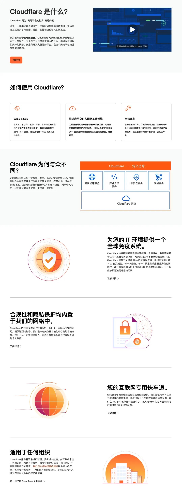
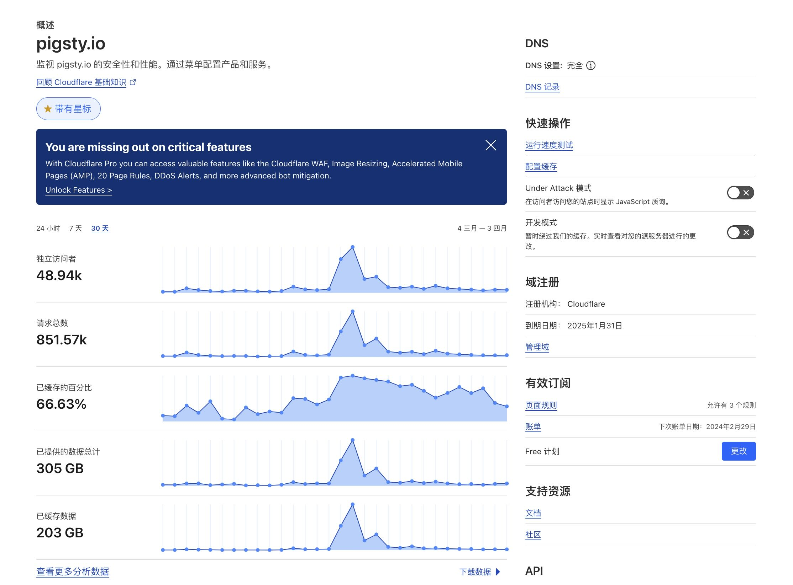

是在今天的 2024 开发者周上，Cloudflare 发布了一系列令人激动的新特性，例如 Python Worker 以及 Workers AI，把应用开发与交付的便利性拔高到了一个全新的程度。与 Cloudflare 的 Serverless 开发体验相比，传统云厂商号称 Serverless 的各种产品都显得滑稽可笑。

Cloudflare 更广为人知的是它的慷慨免费套餐，一些中小型网站几乎能以零成本运行在这里。在 Cloudflare 的鲜明对比之下，天价出租 [CPU](/cloud/ecs)、[磁盘](/cloud/ebs)、[带宽](/cloud/cdn/) 的公有云厂商显得面目可憎。Cloudflare 这样的云带来的开发体验，才真正配得上“云”的称号。在我看来， Cloudflare 应该主动出击，与传统公有云厂商抢夺云计算的定义权。

利益相关：Cloudflare 没给我钱，我倒是给 Cloudflare 付了钱。纯粹是因为 Cloudflare 产品非常出色，极好地解决了我的需求，让我非常乐意付点费支持一下，并告诉更多朋友有这项福利。与之相反的是，我付钱给传统公有云厂商之后的感受是这做的都是什么玩意 —— 必须写文章狠狠地骂他们，才能缓解内心的精神损失。


---------------

## Cloudflare 是什么

Cloudflare是一家提供内容分发网络（CDN）、互联网安全性、抗DDoS（分布式拒绝服务）和分布式DNS服务的美国公司。全世界互联网流量的 20% 由它服务。如果你挂着 VPN 访问一些网站，经常可以看到 Cloudflare 的抗 DDoS 验证码页面和 Logo。他们提供：

1. **内容分发网络（CDN）**：Cloudflare的CDN服务通过全球分布的数据中心缓存客户网站的内容，加快网站加载速度并减少服务器压力。
2. **网站安全性**：提供SSL加密、防止SQL注入和跨站脚本攻击的安全措施，增强网站的安全性。
3. **DDoS防护**：具备先进的DDoS防护功能，能够抵御各种规模的攻击，保护网站不受干扰。
4. **智能路由**：使用Anycast网络技术，能够智能识别数据传输的最佳路径，减少延迟。
5. **自动HTTPS重定向**：自动将访问转换为HTTPS，增强通信的安全性。
6. **Workers平台**：提供Serverless架构，允许在Cloudflare的全球网络上运行JavaScript或WASM（WebAssembly）代码，无需管理服务器。

当然，Cloudflare 还有一些非常不错的服务，例如托管网站的 Pages，对象存储 R2，分布式数据库D1 等，开发者体验非常不错。



> [Cloudflare 官网介绍](https://www.cloudflare.com/zh-cn/what-is-cloudflare/)


------------

## Pages：简单易用的网站托管

举个例子，如果您要托管一个静态网站。用 Cloudflare 有多简单？首先在 GitHub 创建一个 Repo，把网站内容丢进去，然后在 Cloudflare 链接到你的 [Git Repo](https://developers.cloudflare.com/pages/configuration/git-integration/)，分配一个子域名，然后你的网站就自动部署到全世界的各个角落了。如果你要更新网站内容，只要 git push 到特定分支就足够了。

如果你使用特定的 [**网站框架**](https://developers.cloudflare.com/pages/framework-guides/)，甚至还可以直接在线从仓库内容中构建：Blazor、Brunch、Docusaurus、Gatsby、Gridsome、Hexo、Hono、Hugo、Jekyll、Next.js、Nuxt、Pelican、Preact、Qwik、React、Remix、Solid、Sphinx、Svelte、Vite 3、Vue、VuePress、Zola、Angular、Astro、Elder.js、Eleventy、Ember、MkDocs。

我从完全没接触过 Cloudflare，到把 Pigsty 的网站搬运到 CF 上并完成部署，只用了一个小时左右。我不需要操心什么服务器，CI/CD / HTTPS 证书，安全高防抗 DDoS，Cloudflare 已经把一切都替我做好了 —— 更重要的是流量费全免，我唯一做的就是绑了个信用卡花了十几块钱买了个域名，但实际上根本不需要什么额外费用 —— 都已经包含在免费计划中了。

更令我震惊的是，虽然访问速度慢了一些，但在中国大陆是可以直接访问 CF 上的网站的，甚至不需要备案！说来也滑稽，本土云厂商虽然可以很快替你完成网站资源置备这件事，但耗时最久的步骤往往是卡在备案上。这一点确实算是 Cloudflare 的一个福利特性了。


------------

## Worker：极致的 Serverless 体验

尽管你可以把许多业务逻辑放在前端在浏览器中用 Javascript 解决，但一个复杂的动态网站也是需要一些后端开发的。而 Cloudflare 也把这一点简化到了极致 —— **你只需要编写业务逻辑的 Javascript 函数就可以了**。当然，也可以使用 Typescript，现在更是支持 Python 了 —— 直接调用 AI 模型，难以想象后面会出现多少新的花活！

用户编写的这个函数会被部署在 Cloudflare 全世界 CDN 边缘服务器节点上，执行用户定义的业务逻辑。你可以 [**干各种各样的事情**](https://developers.cloudflare.com/workers/examples/)，返回动态的HTML与JSON，自定义路由、重定向、转发、过滤、缓存、A/B测试，重写请求，聚合请求，执行认证。当然，你也可以直接使用业务代码中调用对象存储 R2 与 SQL 数据库 D1，或者把请求转发到你自己的数据中心服务器上处理。

```js
export interface Env {
  // If you set another name in wrangler.toml as the value for 'binding',
  // replace "DB" with the variable name you defined.
  DB: D1Database;
}

export default {
  async fetch(request: Request, env: Env) {
    const { pathname } = new URL(request.url);

    if (pathname === "/api/beverages") {
      // If you did not use `DB` as your binding name, change it here
      const { results } = await env.DB.prepare(
        "SELECT * FROM Customers WHERE CompanyName = ?"
      )
        .bind("Bs Beverages")
        .all();
      return Response.json(results);
    }

    return new Response(
      "Call /api/beverages to see everyone who works at Bs Beverages"
    );
  },
};
```

> [在 Worker 中查询 D1](https://developers.cloudflare.com/d1/get-started/#write-queries-within-your-worker)，简单到就是调用个变量。

```ini
[[d1_databases]]
binding = "DB" # available in your Worker on env.DB
database_name = "prod-d1-tutorial"
database_id = "<unique-ID-for-your-database>"
```

> 也不需要什么配置，指定一下D1数据库/R2对象存储名称就好了。


比起传统云上笨拙的开发部署体验来所，CF worker 真正做到了让开发者爽翻天的 Serverless 效果。开发者不需要操心什么数据库连接串，AccessPoint，AK/SK密钥管理，用什么数据库驱动，怎么管理本地日志，怎么搭建 CI/CD 流程这些繁琐问题，最多在环境变量里面指定一下存储桶名称这类简单信息就够了。写好 Worker 胶水代码实现业务逻辑，命令行一把梭就可以完成全球部署上线。

与之对应的是传统公有云厂商提供的各种所谓 Serverless 服务，比如 RDS Serverless，就像一个恶劣的笑话，单纯是一种计费模式上的区别 —— 既不能 Scale to Zero，也没什么易用性上的改善 —— 你依然要在控制台去点点点创建一套 RDS，而不是像 Neon 这种真 Serverless 一样用连接串连上去就能直接迅速拉起一个新实例。更重要的是，稍微有个几十上百的QPS，相比包年包月的账单就要爆炸上天了 —— 这种平庸的 “Serverless” 确实污染了这个词语的本意。


------------

## R2：吊打 S3 的对象存储

Cloudflare R2 提供了对象存储服务。与 AWS S3 相比，便宜了也许能有一个数量级 —— 我的意思是，尽管单纯看存储的价格 \$ / GB·月，Cloudflare（0.015 \$）价格与 S3 (0.023 \$) 差距并不大，但 Cloudflare 的 R2 是免流量费的！

|     每月免费额度     | Cloudflare R2  |   Amazon S3    |
|:--------------:|:--------------:|:--------------:|
|       存储       |   10 GB / 月    |    5 GB / 月    |
|      写请求       |    1 M / 月     |    2 K / 月     |
|      读请求       |    10 M / 月    |    20 K / 月    |
|      数据传输      |    **无限量！**    |     100 GB     |
| **超出免费额度后的价格** |                |                |
|       存储       |  ¥ 0.11 / GB   |  ¥ 0.17 / GB   |
|      写请求       | ¥ 32.63 / 百万请求 | ¥ 36.25 / 百万请求 |
|      读请求       | ¥ 2.61 / 百万请求  |  ¥ 2.9 / 百万请求  |
|      流量费       |    **免费！**     |  ¥ 0.65 / GB   |

> Cloudflare [R2 定价](https://www.cloudflare.com/pg-cloudflare-r2-vs-aws-s3/) 与 AWS S3 对比 

举个例子，我的网站，R2 在过去一个月内消耗了 300 GB 流量，按照本土云 1GB 流量八毛钱左右的价格，需要支付 240 元，但我一分钱也没付。而且，我还知道更极端的例子 —— 比如一个月消耗了 3TB 流量，也依然在免费套餐中……



Cloudflare R2 是与 CDN 二合一的。在传统的云服务商中，你还需要操心额外的 CDN 配置，回源流量，CDN流量包，抗DDoS等等问题。但 Cloudflare 不需要，只要勾选配置启用，你的 R2 Bucket 可以直接被全世界读取，而最重要的是，而你根本不用担心账单被刷爆的问题 —— 我知道好几个在传统云厂商上，因为攻击把 CDN 流量刷爆，几万块钱余额一夜耗干欠费的案例。（包括我自己还亲历过一个因为云厂商自己SB的CDN回源设计，[爆刷CDN流量的案例](/cloud/cdn/)）但是在 Cloudflare 上，你不需要像斗牛犬和猫头鹰一样监视着 [**账单**](/cloud/finops) 与流量，首先，Cloudflare 流量免费…… ，更强的是， Cloudflare 已经有了智能的抗 DDoS 服务了，即使是免费的 Plan 也默认提供这项服务，可以有效避免恶意攻击（在传统云厂商，这玩意单独卖几千上万的所谓高防IP服务）。再加上每月慷慨的免费 1千万读取请求（对于放图片、软件包来说这已经非常大了！），可以确保在这上面的费用是高度确定性的 —— 如果不是零的话。


------------

## Cloudflare：在线的价值

王坚博士那本讲云计算的书《在线》其实说得很明白，云计算的真正价值是 **在线**（而不是什么弹性、敏捷、便宜之类的东西）。举个例子：我有一些下云的客户与用户，虽然已经把主体业务从公有云上搬到了 IDC 或者自己办公室的服务器上，但依然在云上留一些 ECS 和 RDS 的尾巴 —— 因为他们收取数据的 API 放在那里，感觉公有云提供的网络接入要比自己的机房/办公室更稳定可靠 —— 注意是网络接入而不是存储计算。


很多云上的客户，[在算力上付出了几倍到十几倍溢价](/cloud/ebs)，[在存储上付出了几十倍到上百倍的溢价](/cloud/ebs)，都是为了这个网络 “在线” 的能力。但 Cloudflare 这样遍布全球的，带有边缘计算能力的 CDN ，将 “在线” 的能力拔高到了一个全新的高度上，比传统公有云更好地解决了这个问题。例如，AI 当红炸子鸡 OpenAI 的网站和 API 就是这么做的 —— 通过 CF 对外提供接入。

在这种模式下，用户完全可以把网站与 API 通过 Cloudflare 对外提供接入，而将重量级的存储与计算放在 IDC 中，而不是在传统公有云上用几倍的价格进行租赁。Cloudflare 提供的 Worker 可以在边缘用于发送、收取数据，并将请求转发至您自己的数据中心进行处理。如果希望实现更可靠的容灾，您还可以利用 Cloudflare 上的 R2 与 D1 作为临时性本地缓存，预处理汇总数据后，统一拉取到 IDC 进行处理。


------------

## CF 与 IDC 从两头挤压公有云

在 IT 规模光谱的一侧 —— 个人站长与小微企业上，新一代云服务 / SaaS（CF，Neon，Vercel，Supabase） 赛博菩萨们的免费套餐，对公有云产生了明显的替代与冲击 —— 别说 99 块钱包年的云服务器了，9块9 都不一定香了 —— **再便宜能便宜过免费吗？** —— 更何况用 CF 建站的体验比云服务器自建要好太多了。

但更重要的是，在光谱另一侧的中大型企业中，新出现的 IDC 2.0 与开源管控软件替代合流，短路掉公有云这个中间商，利用好[硬件摩尔定律](https://mp.weixin.qq.com/s/1OSRcBfd58s0tgZTUZHB9g)的累积优势，成为[终极FinOps实践](https://mp.weixin.qq.com/s/Yp_PU8nmyK-NVq0clD98RQ)，实现极为[惊人的降本增效能力](https://mp.weixin.qq.com/s/CicctyvV1xk5B-AsKfzPjw)。Cloudflare 的出现补齐了开源IDC自建模式的最后一块短板 —— “**在线**” 能力。

Cloudflare 并没有提供传统公有云上的那些弹性计算、存储、[K8S](/db/db-in-k8s/)、[RDS](/cloud/rds) 服务。但幸运地是，Cloudflare 可以与公有云 / IDC 良好地配合协同 —— 从某种意义上来说，因为 Cloudflare 成功解决了 “在线” 的问题，这使得传统数据库中心 IDC 2.0 也同样可以拥有比肩甚至超越公有云的 “在线” 能力，两者配合，在事实上摧毁了一些公有云的护城河，并挤压了传统公有云厂商的生存空间。

我非常看好 Cloudflare 这种模式，实际上，这种丝滑的体验才配称的上是云，配享太庙，可以心安理得吃高科技行业的高毛利。传统的 IDC 2.0 也在不断进步，租赁机柜、裸金属服务器的体验也并不逊色传统公有云（无非是服务器从两分钟到位变成几个小时到位）。而无法提供更多技术附加值，产品不可替代性的公有云厂商，生存空间会越来越小 —— [最终回退到传统 IDC / IaaS 业务中去](/cloud/profit/)。

