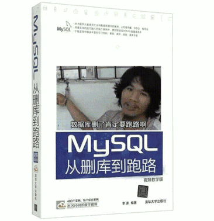
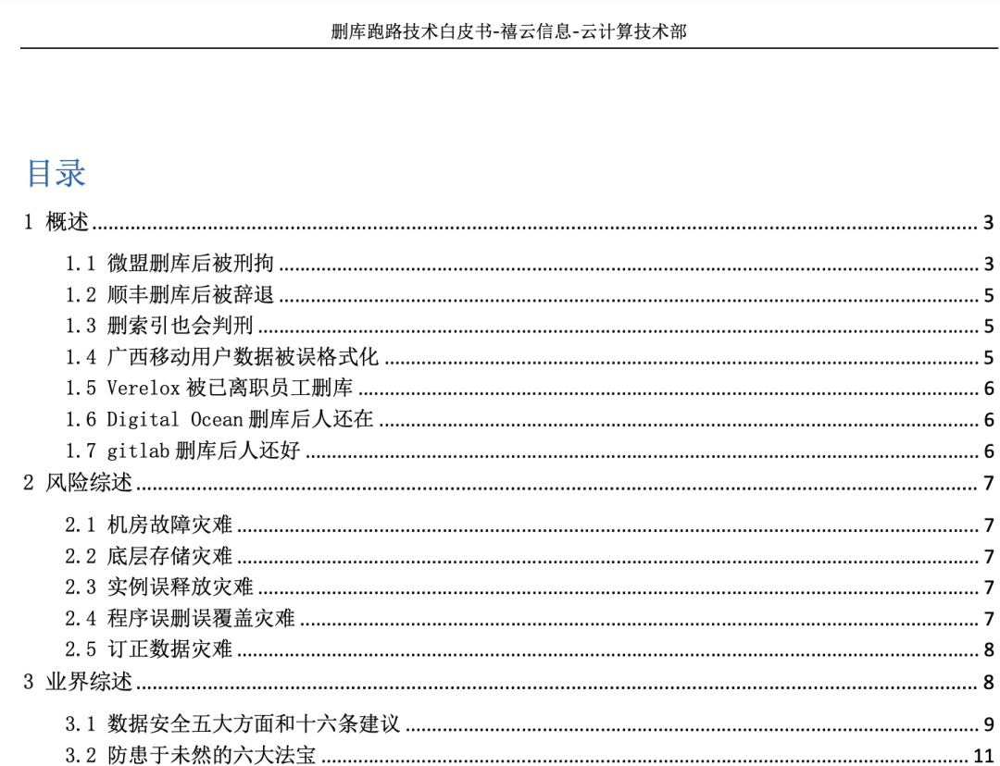
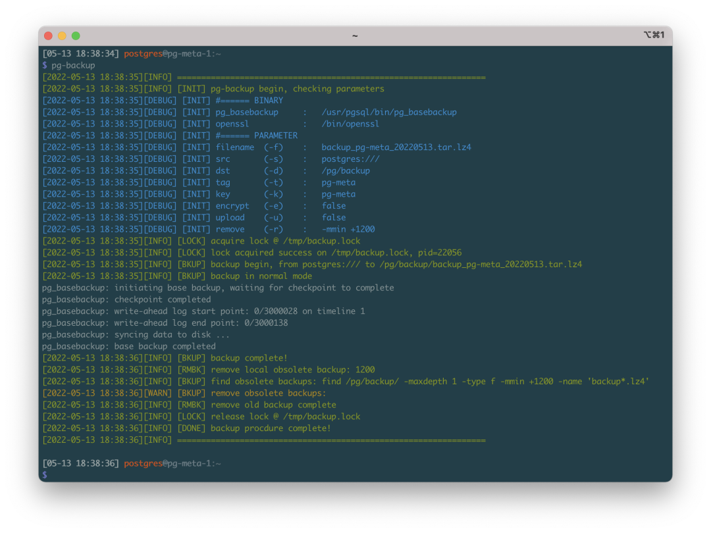
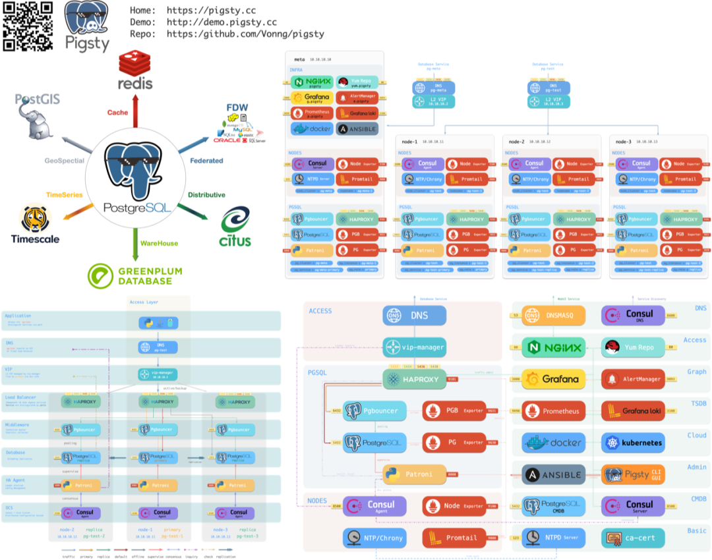
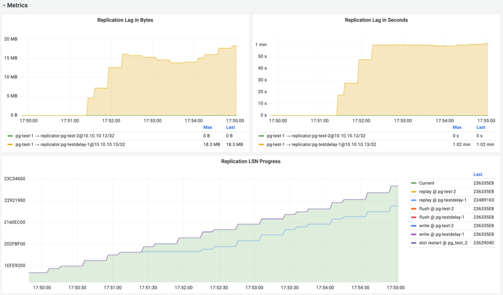
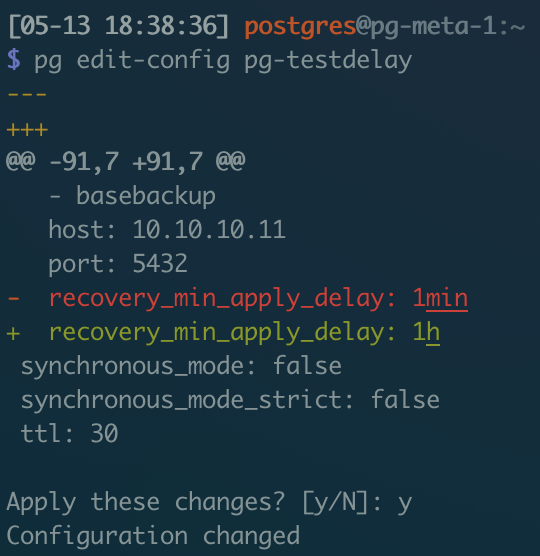

In my previous article "[Is DBA Still a Good Job](http://mp.weixin.qq.com/s?__biz=MzU5ODAyNTM5Ng==&mid=2247485064&idx=1&sn=6225a044d8f145cdb07a21a1e0c54ad8&chksm=fe4b3353c93cba4582576b4de151ac48247052a1494adcc820dc64a32dafb0b99e33085c7bbb&scene=21#wechat_redirect)", I mentioned: Although DBA as a profession is declining, who knows if DBAs might become trendy again after several terrifying large-scale cloud database failures.

[](https://mp.weixin.qq.com/s/AGEW1iHQkQy4NQyYC2GonQ)

Well, I recently witnessed a live cloud database drop-and-run incident. This article discusses how to handle accidentally deleted data when using PostgreSQL in production environments.






-------------

## Incident Scene 


-------------

## Solutions

After seeing the story, we can't help asking: I've already paid for '**ready-to-use**' cloud databases, why don't they even have basic PITR recovery backup?

Ultimately, cloud databases are still databases. Cloud databases aren't some maintenance-free outsourcing magic - improper configuration and usage can still risk data loss. Without enabling WAL archiving, PITR can't be used, and you can't even log into servers to get existing WALs for recovering accidentally deleted data.

Of course, this is also due to cloud providers' stingy scheming. WAL log archiving PITR - these basic PG high availability features - are castrated by cloud providers and put into so-called "high availability" versions. WAL archiving for locally deployed instances is just adding a disk and configuring a command. Object storage costs a few cents per GB per month - cheapest possible - but beggar-version cloud databases still save wherever possible, otherwise how would they sell "high availability" database versions?

In Pigsty, all PG database clusters enable WAL archiving by default with daily full backups: retaining recent daily base **cold backups** and WAL, allowing users to rollback to any moment within the day. It even provides ready-to-use **delayed replica** setup tools - preventing accidental deletion faster than anyone!

-------------

## How to Handle Database Drops?

Traditional "high availability" database clusters usually refer to database clusters based on master-slave physical replication.

Failures can be broadly divided into two categories: **hardware failures/resource shortages** (disk failures/crashes), **software bugs/human errors** (database drops/table drops). **Physical replication based on master-slave replication addresses the former, while delayed replicas and cold backups usually address the latter**. Because accidental data deletion operations are immediately replicated and executed on replicas, hot backups and warm backups can't solve errors like DROP DATABASE, DROP TABLE - requiring **cold backups** or **delayed replicas**.

### Cold Backups

In Pigsty, database instances in clusters can be assigned roles (`pg_role`) to create physical replication backups for recovery from machine and hardware failures. For example, the following configuration declares a high availability database cluster with one master and two slaves, featuring one hot backup, one warm backup, and automatic daily cold backups.



`pg-backup` is a Pigsty built-in ready-to-use backup playbook that automatically creates base backups.



In all Pigsty configuration file templates, the following archiving command is configured:

```
wal_dir=/pg/arcwal;
/bin/mkdir -p ${wal_dir}/$(date +%Y%m%d) && /usr/bin/lz4 -q -z %p > ${wal_dir}/$(date +%Y%m%d)/%f.lz4
```

By default on cluster primaries, all WAL files are automatically compressed and archived by day. When needed, combined with base backups, clusters can be recovered to any point in time.

Of course, you can also use Pigsty's included **pg_probackup**, **pg_backrest** and other tools to automatically manage backups and archiving. Throwing cold backups and archives to cloud storage or dedicated backup centers easily achieves **cross-region cross-datacenter disaster recovery**.

Cold backups are classic bottom-line backup mechanisms. With only cold backups, systems can only recover to backup moments. Combined with WAL logs, **clusters can be recovered to any point in time** by replaying WAL logs on base cold backups.

### Delayed Replicas

Cold backups are important, but for core business, downloading cold backups, uncompressing packages, and advancing WAL replay takes a long time - time waits for no one. To minimize RTO, another technique called **delayed replicas** can be used to handle accidental deletion failures.

Delayed replicas can receive real-time WAL changes from primaries but delay specific times before applying them. From user perspectives, delayed replicas are like historical snapshots of primaries at specific times earlier. For example, you can set up a 1-day delayed replica. When accidental data deletion occurs, you can fast-forward that instance to moments before deletion, then immediately query data from delayed replicas and restore to original primaries. The following Pigsty configuration declares two clusters: a standard high availability one-master-one-slave cluster **`pg-test`**, and a delayed replica of that cluster: **`pg-testdelay`**. For convenience, configure 1-minute replication delay:

```yaml
# pg-test is the original cluster
pg-test:
  hosts:
    10.10.10.11: { pg_seq: 1, pg_role: primary }
  vars: { pg_cluster: pg-test }

# pg-testdelay is pg-test's delayed cluster
pg-testdelay:
  hosts:
    10.10.10.12: { pg_seq: 1, pg_role: primary , pg_upstream: 10.10.10.11, pg_delay: 1d }
    10.10.10.13: { pg_seq: 2, pg_role: replica }
  vars: { pg_cluster: pg-test2 }
```



In the PGSQL REPLICATION monitoring dashboard, `pg-test` cluster replication metrics are shown above. After enabling replication delay configuration, delayed replica `pg-testdelay-1` has stable 1-minute "Apply Delay". In LSN progress charts, primary's LSN progress and delayed replica's LSN progress differ by exactly 1 minute on the horizontal time axis.

You can also create regular backup clusters, then use **`pg edit-config pg-testdelay `** to manually modify delay duration configuration.



> **Modify delay to 1 hour and apply**

Pigsty provides comprehensive backup support - ready-to-use master-slave physical replication without configuration, with most physical failures self-healing. It also provides delayed replica and cold backup support for handling software failures and human errors. You just need to prepare several physical machines/virtual machines/cloud/ servers to one-click create and own truly high availability database clusters!

Pigsty makes your databases rock solid. Besides high availability, it comes with monitoring systems - completely open source and free!

> **Note: You can still use** `pgsql-rm.yml` **to one-click delete all databases.**

> **Another note: This behavior is controlled by safety insurance parameters like** `pg_safeguard`, `pg_clean` **to avoid fat-finger accidents.**


