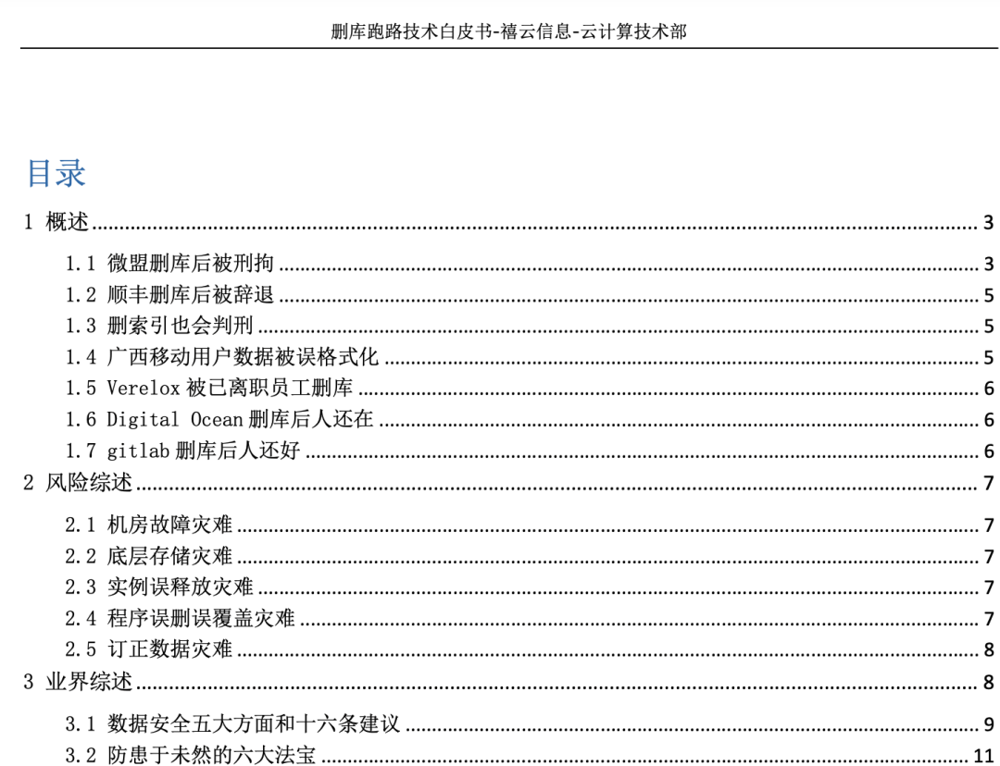
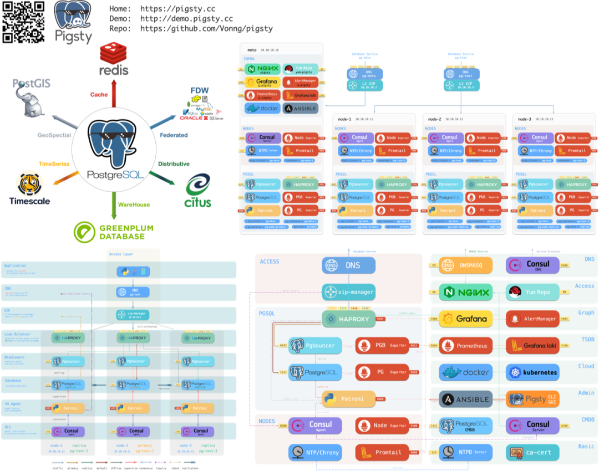

上一篇文章《[DBA还是份好工作吗](http://mp.weixin.qq.com/s?__biz=MzU5ODAyNTM5Ng==&mid=2247485064&idx=1&sn=6225a044d8f145cdb07a21a1e0c54ad8&chksm=fe4b3353c93cba4582576b4de151ac48247052a1494adcc820dc64a32dafb0b99e33085c7bbb&scene=21#wechat_redirect)》中提到：尽管DBA作为一份职业在没落，但谁也保不准DBA会不会在几次恐怖的大规模云数据库故障后，重新成为潮流。

[](https://mp.weixin.qq.com/s/AGEW1iHQkQy4NQyYC2GonQ)

这不，最近就目睹了一场云数据库删库跑路现场情景剧。本文就来聊一聊在生产环境使用PostgreSQL，如何应对误删数据的问题。





-------------

## 故障现场 


-------------

## 解决方案

看完了故事，我们不禁要问，我都已经花钱买了‘**开箱即用**’的云数据库了，为啥连PITR恢复这么基本的兜底都没有呢？

说到底，云数据库也是数据库，云数据库并不是啥都不用管的运维外包魔法，不当配置使用，一样会有数据丢失的风险。没有开启WAL归档就无法使用PITR，甚至无法登陆服务器获取现存WAL来恢复误删的数据。

当然，这也得怪云厂商抠门心机，WAL日志归档PITR这些PG的基础高可用功能被云阉割掉了，放进所谓的“高可用”版本。WAL归档对于本地部署的实例来说，无非是加块磁盘配置条命令的事情。对象存储1GB一个月几分钱，最是廉价不过，但乞丐版云数据库还是要应省尽省，不然怎么卖“高可用”版的数据库呢？

在Pigsty中，所有PG数据库集群都默认启用了WAL归档并每日进行全量备份：保留最近一日的基础**冷备份**与WAL，允许用户回溯至当日任意时刻的状态。更是提供了开箱即用的**延迟从库**搭建工具，防误删快人一步！


-------------

## 如何应对删库？

传统的“高可用”数据库集群通常指的是基于主从物理复制的数据库集群。

故障大体可以分为两类**：硬件故障/资源不足**（坏盘/宕机），**软件缺陷/人为错误**（删库/删表）。**基于主从复制的物理复制用于应对前者，延迟从库与冷备份通常用于应对后者**。因为误删数据的操作会立刻被复制到从库上执行，所以热备份与温备份都无法解决诸如 DROP DATABASE，DROP TABLE这样的错误，需要使用**冷备份**或**延迟从库**

### 冷备份

在Pigsty中，可以通过为集群中的数据库实例指定角色（ `pg_role` ），即可以创建物理复制备份，用于从机器与硬件故障中恢复。例如以下配置声明了一个一主两从的高可用数据库集群，带有一个热备一个温备，并自动制作每日冷备。


`pg-backup` 是一个Pigsty内置的开箱即用备份剧本，可自动制作基础备份。



在 Pigsty 所有的配置文件模板中，都配置有以下归档命令

```
wal_dir=/pg/arcwal;
/bin/mkdir -p ${wal_dir}/$(date +%Y%m%d) && /usr/bin/lz4 -q -z %p > ${wal_dir}/$(date +%Y%m%d)/%f.lz4
```

默认在集群主库上，所有WAL文件会自动压缩并按天归档，需要使用时，配合基础备份，即可将集群恢复至任意时间点。

当然，您也可以使用 Pigsty 带有的 **pg_probackup**, **pg_backrest** 等工具来自动管理备份与归档。将冷备份与归档丢到云存储或专用备份中心，轻松实现**异地跨机房容灾**。

冷备份是经典的兜底备份机制，如果只有冷备份本身，那么系统将只能恢复到备份时刻到状态。如果加之以WAL日志，就可以通过在基础冷备份上重放WAL日志，**将集群恢复到任意时间点**。


### 延迟从库

冷备份虽然很重要，但对于核心业务来说，下载冷备份，解开压缩包，推进WAL重放需要很长一段时间，时间不等人。为了最小化RTO，可以使用另一种称为 **延****迟从库**的技术来应对误删故障。

延迟从库可以从主库接受实时的WAL变更，但延迟特定的时间再应用。从用户的视角来看，延迟从库就像主库在特定时间前的一份历史快照。例如，您可以设置一个延迟1天的从库，当出现误删数据时，您可以将该实例快进至误删前的时刻，然后立刻从延迟从库中查询出数据，恢复至原始主库中。下面的Pigsty配置文件声明了两个集群：一个标准的高可用一主一从集群 **`pg-test`**，以及一个该集群的延迟从库：**`pg-testdelay`**，为方便起见，配置1分钟的复制延迟：

```yaml
# pg-test 是原始集群
pg-test:
  hosts:
    10.10.10.11: { pg_seq: 1, pg_role: primary }
  vars: { pg_cluster: pg-test }

# pg-testdelay 是 pg-test 的延迟集群
pg-testdelay:
  hosts:
    10.10.10.12: { pg_seq: 1, pg_role: primary , pg_upstream: 10.10.10.11, pg_delay: 1d }
    10.10.10.13: { pg_seq: 2, pg_role: replica }
  vars: { pg_cluster: pg-test2 }
```


在PGSQL REPLICATION监控面板中，`pg-test`集群的复制指标如上图所示，启用复制延迟配置后，延迟从库`pg-testdelay-1`有了稳定的1分钟“应用延迟”（Apply Delay），在LSN进度图表中，主库的LSN进度与延迟从库的LSN进度在水平时间轴上相差了正好1分钟。

您也可以创建一个普通的备份集群，然后使用 **`pg edit-config pg-testdelay `**的方式，来手工修改延迟的时长配置。


> **修改延迟为1小时并应用**

Pigsty提供了完善的备份支持，无需配置即可使用开箱即用的主从物理复制，绝大多数物理故障均可自愈。同时，还提供了延迟备库与冷备份支持，用于应对软件故障与人为误操作。您只需要准备几台物理机/虚拟机/或者云服务器，即可一键创建并拥有真正的高可用数据库集群！

Pigsty，让您的数据库坚若磐石，除了高可用，还自带监控系统，完全开源免费！

> **注：您依然可以使用** `pgsql-rm.yml` **一键删光所有数据库。

> 又注：此行为受 `pg_safeguard` ，`pg_clean` 等一系列安全保险参数控制，以避免胖手指误删。

