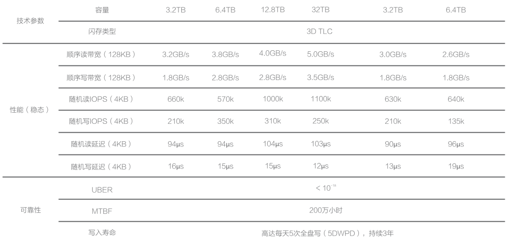
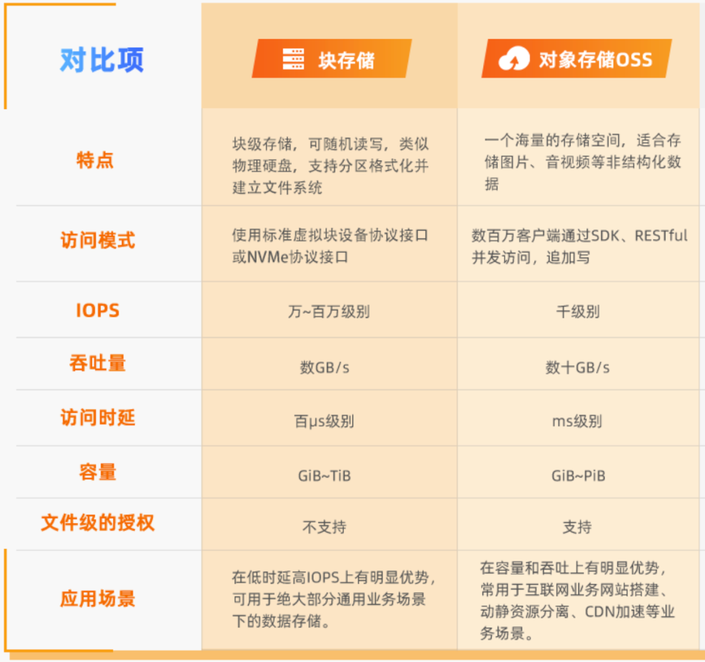
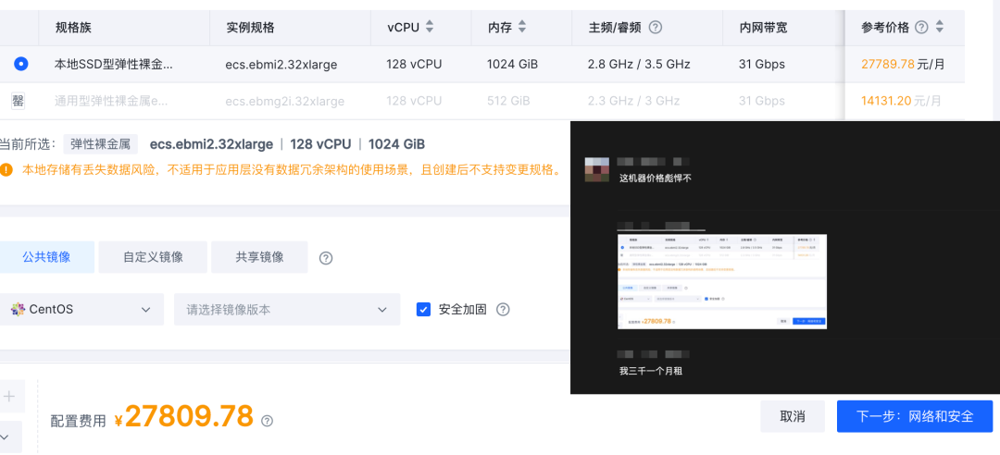
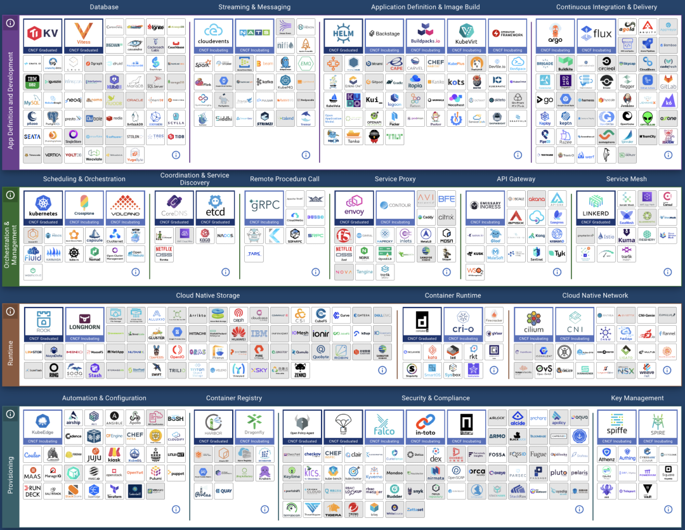
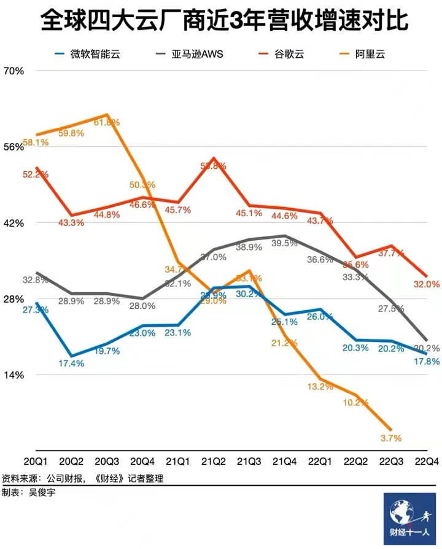

We already answer the question: [Is RDS an Idiot Tax?](/blog/cloud/rds/).
But when compared to the **hundredfold markup of public cloud block storage**, cloud databases seem almost reasonable. This article uses real data to reveal the true business model of public cloud: **"Cheap" EC2/S3 to attract customers, and fleece with "Expensive" EBS/RDS**. Such practices have led public clouds to diverge from their original mission and vision.

- [TLDR](#tl-dr)
- [WHAT a Scam](#what-a-scam)
- [WHY so pricing](#why-so-pricing)
- [HOW to do that](#how-to-do-that)
- [The Forgotten Vision](#the-forgotten-vision)
- [Where to Go](#where-to-go)
- [References](#references)

-------------

## TL; DR

EC2/S3/EBS pricing serves as the anchor for all cloud services pricing. While the pricing for EC2/S3 might still be considered reasonable, EBS pricing is outright extortionate. The best block storage services offered by public cloud providers are essentially on par with off-the-shelf PCI-E NVMe SSDs in terms of performance specifications. Yet, compared to direct hardware purchases, **the cost of AWS EBS can be up to 60 times higher, and Alibaba Cloud's ESSD can reach up to 100 times higher.**

Why is there such a staggering markup for plug-and-play disk hardware? Cloud providers fail to justify the exorbitant prices. When considering the design and pricing models of other cloud storage services, there's only one plausible explanation: **The high markup on EBS is a deliberately set barrier, intended to fleece cloud database customers**.

With EC2 and EBS serving as the pricing anchors for cloud databases, their markups are several and several dozen times higher, respectively, thus supporting the exorbitant profit margins of cloud databases. However, such monopolistic profits are unsustainable: the impact of IDC 2.0/telecom/national cloud on IaaS; private cloud/cloud-native/open source as alternatives to PaaS; and the tech industry's massive layoffs, AI disruption, and the impact of China's low labor costs on cloud services (through IT outsourcing/shared expertise). **If public clouds continue to adhere to their current fleecing model, diverging from their original mission of providing fundamental compute and storage infrastructure, they will inevitably face increasingly severe competition and challenges from the aforementioned forces.**

-------------

## WHAT a Scam!

When you use a microwave at home to heat up a ready-to-eat braised chicken rice meal costing 10 yuan, you wouldn't mind if a restaurant charges you 30 yuan for microwaving the same meal and serving it to you, considering the costs of rent, utilities, labor, and service. But what if the restaurant charges you 1000 yuan for the same dish, claiming: **"What we offer is not just braised chicken rice, but a reliable and flexible dining service"**, with the chef controlling the quality and cooking time, pay-per-portion so you get exactly as much as you want, pay-per-need so you get as much as you eat, with options to switch to hot and spicy soup or skewers if you don't feel like chicken, claiming it's all worth the price. Wouldn't you feel the urge to give the owner a piece of your mind? This is exactly what's happening with block storage!

With hardware technology evolving rapidly, **PCI-E NVMe SSDs** have reached a new level of performance across various metrics. A common 3.2 TB enterprise-grade MLC SSD offers incredible performance, reliability, and value for money, costing less than ¥3000, significantly outperforming older storage solutions.

Aliyun ESSD PL3 and our own IDC's procured PCI-E NVMe SSDs come from the same supplier. Hence, their maximum capacity and IOPS limitations are identical. AWS's top-tier block storage solution, io2 Block Express, also shares similar specifications and metrics. Cloud providers' highest-end storage solutions utilize these 32TB single cards, leading to a maximum capacity limit of 32TB (64TB for AWS), which suggests a high degree of hardware consistency underneath.

However, compared to direct hardware procurement, **the cost of AWS EBS io2 is up to 120 times higher, while Aliyun's ESSD PL3 is up to 200 times higher**. Taking a 3.2TB enterprise-grade PCI-E SSD card as a reference, the ratio of on-demand rental to purchase price is 15 days on AWS and less than 5 days on Aliyun, meaning you could own the entire disk after renting it for this duration. If you opt for a three-year prepaid purchase on Aliyun, taking advantage of the maximum 50% discount, the rental fees over three years could buy over 120 disks of the same model.

> Is that SSD made of gold ?

**Cloud providers argue that block storage should be compared to SAN** rather than local DAS, which should be compared to **instance storage (Host Storage)** on the cloud. However, public cloud instance storage is generally ephemeral (Ephemeral Storage), with data being wiped once the instance is paused/stopped【7,11】, making it unsuitable for serious production databases. Cloud providers themselves advise against storing critical data on it. Therefore, the only viable option for database storage is EBS block storage. Products like DBFS, which have similar performance and cost metrics to EBS, are also included in this category.

Ultimately, users care not about whether the underlying hardware is SAN, SSD, or HDD; the real priorities are tangible metrics: **latency, IOPS, reliability, and cost**. Comparing local options with the best cloud solutions poses no issue, especially when the top-tier cloud storage uses the same local disks.

Some "experts" claim that cloud block storage is stable and reliable, offering multi-replica redundancy and error correction. In the past, Share Everything databases required SAN storage, but many databases now operate on a Share Nothing architecture. Redundancy is managed at the database instance level, eliminating the need for triple-replica storage redundancy, especially since enterprise-grade disks already possess strong self-correction capabilities and safety redundancy (UBER < 1e-18). **With redundancy already in place at the database level, multi-replica block storage becomes an unnecessary waste for databases**. Even if cloud providers did use two additional replicas for redundancy, it would only reduce the markup from 200x to 66x, without fundamentally changing the situation.

**"Experts" also liken purchasing "cloud services" to buying insurance**: "An annual failure rate of 0.02% may seem negligible to most, but a single incident can be devastating, with the cloud provider offering a safety net." This sounds appealing, but a closer look at cloud providers' EBS SLAs reveals no guarantees for reliability. ESSD cloud disk promotions mention 9 nines of data reliability, but such claims are conspicuously absent from the SLAs. **Cloud providers only guarantee availability, and even then, the guarantees are modest**, as illustrated by the AWS EBS SLA:

> 《[Is the Cloud SLA Just a Placebo?](/blog/cloud/sla/)》

In plain language: if the service is down for a day and a half in a month (95% availability), you get a 100% coupon for that month's service fee; seven hours of downtime (99%) yields a 30% coupon; and a few minutes of downtime (99.9% for a single disk, 99.99% for a region) earns a 10% coupon. Cloud providers charge a hundredfold more, yet offer mere coupons as compensation for significant outages. Applications that can't tolerate even a few minutes of downtime wouldn't benefit from these meager coupons, reminiscent of the past incident, "The Disaster Tencent Cloud Brought to a Startup Company."

SF Express offers 1% insurance for parcels, compensating for losses with real money. Annual commercial health insurance plans costing tens of thousands can cover millions in expenses when issues arise. The insurance industry should not be insulted; it operates on a principle of value for money. **Thus, an SLA is not an insurance policy against losses for users. At worst, it's a bitter pill to swallow without recourse; at best, it provides emotional comfort.**

The premium charged for cloud database services might be justified by "expert manpower," but this rationale falls flat for plug-and-play disks, **with cloud providers unable to explain the exorbitant price markup**. When pressed, their engineers might only say:

"We're just following AWS; that's how they designed it."

-------------

## WHY so Pricing?

Even engineers within public cloud services may not fully grasp the rationale behind their pricing strategies, and those who do are unlikely to share. However, this does not prevent us from deducing the reasoning behind such decisions from the **design of the product** itself.

Storage follows a de facto standard: **POSIX file system + block storage**. Whether it's database files, images, audio, or video, they all use the same file system interface to store data on disks. But AWS's "divine intervention" splits this into two distinct services: **S3** (Simple Storage Service) and **EBS** (Elastic Block Store). Many "followers" have imitated AWS's product design and pricing model, yet the logic and principles behind such actions remain elusive.

> Aliyun EBS OSS Compare

**S3**, standing for **Simple Storage Service**, is a simplified alternative to file system/storage: sacrificing strong consistency, directory management, and access latency for the sake of low cost and massive scalability. It offers a simple, high-latency, high-throughput flat KV storage service, detached from standard storage services. This aspect, being cost-effective, serves as a major allure for users to migrate to the cloud, thus becoming possibly the only **de facto cloud computing standard across all public cloud providers**.

**Databases, on the other hand, require low latency, strong consistency, high quality, high performance, and random read/write block storage**, which is encapsulated in the EBS service: Elastic Block Store. This segment becomes the forbidden fruit for cloud providers: reluctant to let users dabble. **Because EBS serves as the pricing anchor for RDS — the barrier and moat for cloud databases**.

For IaaS providers, who make their living by selling resources, there's not much room for price inflation, as costs can be precisely calculated against the BOM. However, for PaaS services like cloud databases, which include "services," labor/development costs are significantly marked up, allowing for **astronomical pricing** and high profits. Despite storage, computing, and networking making up half of the revenue for domestic public cloud IaaS, their gross margin stands only at **15% to 20%**. In contrast, public cloud PaaS, represented by cloud databases, can achieve gross margins of **50%** or higher, vastly outperforming the IaaS model.

**If users opt to use IaaS resources (EC2/EBS) to build their own databases, it represents a significant loss of profit for cloud providers. Thus, cloud providers go to great lengths to prevent this scenario. But how is such a product designed to meet this need?**

Firstly, **instance storage**, which is best suited for self-hosted databases, must come with various restrictions: instances that are hibernated/stopped are reclaimed and wiped, preventing serious production database services from running on EC2's built-in disks. Although EBS's performance and reliability might slightly lag behind local NVMe SSD storage, it's still viable for database operations, hence the restrictions: but not without giving users an option, hence the **exorbitant pricing**! As compensation, the secondary, cheaper, and massive storage option, S3, can be priced more affordably to lure customers.

Of course, to make customers bite, some cloud computing KOLs promote the accompanying "public cloud-native" philosophy: "EC2 is not suitable for stateful applications. Please store state in S3 or RDS and other managed services, as these are the 'best practices' for using our cloud."

These four points are well summarized, but what public clouds will not disclose is the cost of these "best practices." To put [these four points](https://github.com/lipingtababa/cloud-native-best-practices/blob/main/云原生王四条.md) in layman's terms, they form a carefully designed trap for customers:

**Dump ordinary files in S3!** (With such cost-effective S3, who needs EBS?)

**Don't build your own database!** (Forget about tinkering with open-source alternatives using instance storage)

**Please deeply use the vendor's proprietary identity system** (vendor lock-in)

**Faithfully contribute to the cloud database!** (Once users are locked in, the time to "slaughter" arrives)

-------------

## HOW to Do that

The business model of public clouds can be summarized as: **Attract customers with cheap EC2/S3, make a killing with EBS/RDS**.

To slaughter the pig, you first need to raise it. No pains, no gains. Thus, for new users, startups, and small-to-medium enterprises, public clouds spare no effort in offering sweeteners, even at a loss, to drum up business. New users enjoy a significant discount on their first order, startups receive free or half-price credits, and the pricing strategy is subtly crafted.

Taking AWS RDS [pricing](https://instances.vantage.sh/) as an example, the unit price for mini models with 1 to 2 cores is only **a few dollars per core per month**, which translates to three to four hundred yuan per year (excluding storage): If you need a low-usage database for minor storage, this might be the most straightforward and affordable choice.

However, **as soon as you slightly increase the configuration, even by just a little, the price per core per month jumps by orders of magnitude**, reaching twenty to a hundred dollars, with the potential to skyrocket by dozens of times — **and that's before the doubling effect of the astonishing EBS prices**. Users only realize what has happened when they are faced with a suddenly astronomical bill.

For instance, using RDS for PostgreSQL on AWS, the price for a 64C / 256GB db.m5.16xlarge RDS for one month is $25,817, which is equivalent to about 180,000 yuan per month. The monthly rent is enough for you to buy two servers with even better performance and set them up on your own. **The rent-to-buy ratio doesn't even last a month; renting for just over ten days is enough to buy the whole server for yourself**.

| Payment Model                            | Price                | Cost Per Year (¥10k) |
|------------------------------------------|----------------------|----------------------|
| Self-hosted IDC (Single Physical Server) | ¥75k / 5 years       | 1.5                  |
| Self-hosted IDC (2-3 Server HA Cluster)  | ¥150k / 5 years      | 3.0 ~ 4.5            |
| Alibaba Cloud RDS (On-demand)            | ¥87.36/hour          | 76.5                 |
| Alibaba Cloud RDS (Monthly)              | ¥42k / month         | 50                   |
| Alibaba Cloud RDS (Yearly, 15% off)      | ¥425,095 / year      | 42.5                 |
| Alibaba Cloud RDS (3-year, 50% off)      | ¥750,168 / 3 years   | 25                   |
| AWS (On-demand)                          | $25,817 / month      | 217                  |
| AWS (1-year, no upfront)                 | $22,827 / month      | 191.7                |
| AWS (3-year, full upfront)               | $120k + $17.5k/month | 175                  |
| AWS China/Ningxia (On-demand)            | ¥197,489 / month     | 237                  |
| AWS China/Ningxia (1-year, no upfront)   | ¥143,176 / month     | 171                  |
| AWS China/Ningxia (3-year, full upfront) | ¥647k + ¥116k/month  | 160.6                |

Comparing the costs of self-hosting versus using a cloud database:

| Method                                                                                 | Cost Per Year (¥10k) |
|----------------------------------------------------------------------------------------|----------------------|
| Self-hosted Servers 64C / 384G / 3.2TB NVME SSD 660K IOPS (2-3 servers)                | 3.0 ~ 4.5            |
| Alibaba Cloud RDS PG High-Availability pg.x4m.8xlarge.2c, 64C / 256GB / 3.2TB ESSD PL3 | 25 ~ 50              |
| AWS RDS PG High-Availability db.m5.16xlarge, 64C / 256GB / 3.2TB io1 x 80k IOPS        | 160 ~ 217            |

> **RDS** pricing compared to self-hosting, see "[Is Cloud Database an idiot Tax?](/blog/cloud/rds/)"

Any rational business user can see the logic here: **If the purchase of such a service is not for short-term, temporary needs, then it is definitely considered a **major financial misstep**.

This is not just the case with Relational Database Services / RDS, but with all sorts of cloud databases. MongoDB, ClickHouse, Cassandra, if it uses EC2 / EBS, they are all doing the same. Take the popular NoSQL document database MongoDB as an example:

> This kind of pricing could only come from a product manager without a decade-long cerebral thrombosis

**Five years is the typical depreciation period for servers**, and with the maximum discount, a 12-node (64C 512G) configuration is priced at twenty-three million. The minor part of this quote alone could easily cover the five-year hardware maintenance, plus you could afford a team of MongoDB experts to customize and set up as you wish.

**Fine dining restaurants charge a 15% service fee on dishes, and users can understand and support this reasonable profit margin**. If cloud databases charge a few tens of percent on top of hardware resources for service fees and elasticity premiums (let's not even start on software costs for cloud services that piggyback on open-source), it can be justified as pricing for productive elements, with the problems solved and services provided being worth the money.

However, charging several hundred or even thousands of percent as a premium falls into the category of **destructive element distribution**: cloud providers bank on the fact that once users are onboard, they have no alternatives, and migration would incur significant costs, so they can confidently proceed with the slaughter! In this sense, the money users pay is not for the service, but rather a compulsory levy of a "no-expert tax" and "protection money".

-------------

## The Forgotten Vision

Facing accusations of "slaughtering the pig," cloud vendors often defend themselves by saying: "Oh, what you're seeing is the list price. Sure, it's said to be a minimum of 50% off, but for major customers, there are no limits to the discounts." As a rule of thumb: **the cost of self-hosting fluctuates around 5% to 10% of the current cloud service list prices**. If such discounts can be maintained long-term, cloud services become more competitive than self-hosting.

Professional and knowledgeable large customers, especially those capable of migrating at any time, can indeed negotiate steep discounts of up to 80% with public clouds, while smaller customers naturally lack bargaining power and are unlikely to secure such deals.

However, **cloud computing should not turn into 'calculating clouds'**: if cloud providers can only offer massive discounts to large enterprises while "shearing the sheep" and "slaughtering the pig" when dealing with small and medium-sized customers and developers, they are essentially **robbing the poor to subsidize the rich**. This practice completely contradicts the original intent and vision of cloud computing and is unsustainable in the long run.

When cloud computing first emerged, the focus was on the **cloud hardware / IaaS layer**: computing power, storage, bandwidth. Cloud hardware represents the founding story of cloud vendors: to make computing and storage resources as accessible as utilities, with themselves playing the role of infrastructure providers. This is a compelling vision: public cloud vendors can reduce hardware costs and spread labor costs through economies of scale; ideally, while keeping a profit for themselves, they can offer storage and computing power that is more cost-effective and flexible than IDC prices.

On the other hand, **cloud software (PaaS / SaaS)** follows a fundamentally different business logic: cloud hardware relies on economies of scale to optimize overall efficiency and earn money through resource pooling and overselling, which represents a progress in efficiency. Cloud software, however, relies on sharing expertise and charging service fees for outsourced operations and maintenance. Many services on the public cloud are essentially wrappers around free open-source software, relying on monopolizing expertise and exploiting information asymmetry to charge exorbitant insurance fees, which constitutes a transfer of value.

Unfortunately, for the sake of obfuscation, both cloud software and cloud hardware are branded under the "cloud" title. Thus, the narrative of cloud computing mixes breaking resource monopolies with establishing expertise monopolies: **it combines the idealistic glow of democratizing computing power across millions of households** with **the greed of monopolizing and unethically profiting from it**.

**Public cloud providers that abandon platform neutrality and their original intent of being infrastructure providers, indulging in PaaS / SaaS / and even application layer profiteering, will sink in a bottomless competition.**

-------------

## Where to Go

**Monopolistic profits vanish as competition emerges, plunging public cloud providers into a grueling battle.**

At the infrastructure level, telecom operators, state-owned clouds, and IDC 1.5/2.0 have entered the fray, offering highly competitive IaaS services. These services include turnkey network and electricity hosting and maintenance, with high-end servers available for either purchase and hosting or direct rental at actual prices, showing no fear in terms of flexibility.

> IDC 2.0's new server rental model: Actual price rental, ownership transfers to the user after a full term

On the software front, what once were the technical barriers of public clouds, various management software / **PaaS** solutions, have seen excellent open-source alternatives emerge. OpenStack / Kubernetes have replaced EC2, MinIO / Ceph have taken the place of S3, and on RDS, open-source alternatives like **Pigsty** and various K8S Operators have appeared.

The whole "cloud-native" movement, in essence, is the open-source ecosystem's response to the challenge of public cloud "freeloading": **users and developers have created a complete set of local-priority public cloud open-source alternatives to avoid being exploited by public cloud providers**.

> The term "CloudNative" is aptly named, reflecting different perspectives: public clouds see it as being "born on the public cloud," while private clouds think of it as "running cloud-like services locally." Ironically, the biggest proponents of Kubernetes are the public clouds themselves, akin to a salesman crafting his own noose.

In the context of economic downturn, cost reduction and efficiency gains have become the main theme. Massive layoffs in the tech sector, coupled with the future large-scale impact of AI on intellectual industries, will release a large amount of related talent. Additionally, the low-wage advantage in our era will significantly alleviate the scarcity and high cost of building one's own talent pool. Labor costs, in comparison to cloud service costs, offer much more advantage.

Considering these trends, the combination of IDC2.0 and open-source self-building is becoming increasingly competitive: for organizations with a bit of scale and talent reserves, bypassing public clouds as middlemen and directly collaborating with IDCs is clearly a more economical choice.

Staying true to the original mission is essential. Public clouds do an admirable job at the cloud hardware / IaaS level, except for being outrageously expensive, there aren’t many issues, and the offerings are indeed solid. If they could return to their original vision and truly excel as providers of basic infrastructure, akin to utilities, selling resources might not offer high margins, but it would allow them to earn money standing up. Continuing down the path of exploitation, however, will ultimately lead customers to vote with their feet.

## References

【1】[撤离 AWS：3年省下27.5亿元](https://mp.weixin.qq.com/s/w5XKsXf_NLWnKB6G-sbZaw)

【2】[云数据库是不是智商税](/blog/cloud/rds/)

【3】[范式转移：从云到本地优先](/blog/cloud/paradigm/)

【4】[腾讯云CDN：从入门到放弃](https://mp.weixin.qq.com/s/ANFnbDXwuhKI99fgYRZ9ug)

【5】[炮打 RDS，Pigsty v2.0 发布](https://mp.weixin.qq.com/s/WsR-c64OJfkMql7zX7XmDA)

【6】[Shannon NVMe Gen4 Series](https://en.shannon-sys.com/product.html?name=gen_4)

【7】[AWS实例存储](https://docs.aws.amazon.com/AWSEC2/latest/UserGuide/InstanceStorage.html)

【8】[AWS io2 gp3 存储性能与定价](https://aws.amazon.com/cn/blogs/storage/achieve-higher-database-performance-using-amazon-ebs-io2-block-express-volumes/)

【9】[AWS EBS SLA](https://aws.amazon.com/cn/ebs/sla/)

【10】[AWS EC2 / RDS 报价查询](https://instances.vantage.sh/)

【11】[Aliyun：Host Storage](https://help.aliyun.com/document_detail/63138.html)

【12】[阿里云：云盘概述](https://help.aliyun.com/document_detail/25383.html)

【13】[图说块存储与云盘](https://help.aliyun.com/document_detail/445806.html)

【14】[从狂飙到集体失速，云计算换挡寻出路](https://news.futunn.com/post/24656633)

【15】[云计算为啥还没挖沙子赚钱？](https://mp.weixin.qq.com/s/LC5jAhuVObRcrTLxI1FUQA)