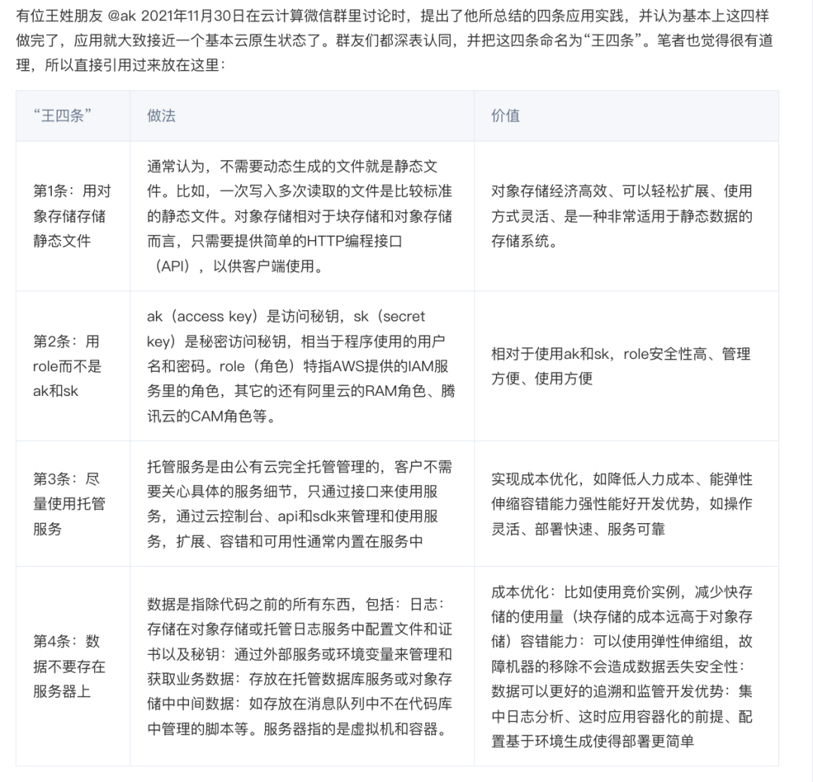

我们已经用数据回答了《[云数据库是不是智商税](/cloud/rds/)》这个问题，但在**公有云块存储的百倍溢价杀猪比率**前，云数据库只能说还差点意思。本文用实际数据揭示公有云真正的商业模式 —— 廉价EC2/S3获客，EBS/RDS杀猪。而这样的做法，也让公有云与其初心愿景渐行渐远。

- [TLDR：太长不看](#tldr-太长不看)
- [WHAT：真正的杀猪盘](#what真正的杀猪盘)
- [WHY：为什么要这样定价](#why为什么要这样定价)
- [HOW：还原杀猪盘内幕](#how还原杀猪盘内幕)
- [被遗忘的初心愿景](#被遗忘的初心愿景)
- [博弈将走向何方？](#博弈将走向何方)

-------------

## TL;DR 太长不看

EC2 / S3 / EBS 是所有云服务的定价之锚。如果说 EC2/S3 定价还勉强能算合理，那么 EBS 的定价乃是故意杀猪。公有云厂商最好的块存储服务与自建可用的 PCI-E NVMe SSD 在性能规格上基本相同。然而相比直接采购硬件，**AWS EBS 的成本高达 60 倍，而阿里云的 ESSD 则可高达 100 倍。**

即插即用的磁盘硬件，百倍溢价到底为何？云厂商无法解释如此的天价到底源于何处。结合其他云存储服务的设计思路与定价模型，只有一个合理的解释：**EBS的高溢价倍率是故意设置的门槛，以便于云数据库杀猪**。

作为云数据库定价之锚的 EC2 与 EBS，溢价分别为几倍与几十倍，从而支撑起云数据库的杀猪高毛利。但这样的垄断利润必定无法持久：IDC 2.0/运营商/国资云冲击 IaaS；私有云/云原生/开源平替冲击 PaaS；科技行业大裁员、AI冲击与天朝的低人力成本冲击云服务（运维人力外包/共享专家）。**公有云如果执着于目前的杀猪模式，背离“存算基础设施”的初心，那么必将在以上三者形成的合力下面临越来越严峻的竞争与挑战**。

-------------

## WHAT：真正的杀猪盘

你在家用微波炉加热黄焖鸡米饭料理包花费10元，餐馆老板替你用微波炉加热装碗上桌收费30元，你不会计较什么，房租水电人工服务也都是要钱的。但如果现在老板端出同样一碗饭跟你收费 1000 元并说：我们提供的不是黄焖鸡米饭，**而是可靠质保的弹性餐饮服务**，大厨品控掌握火候，按量付费想吃多少有多少，按需付费吃多少盛多少，不吃黄焖鸡还有麻辣烫串串香可选，反正就值这个价，你会不会有打一顿这个老板的冲动？这样的事情就发生在块存储上！

硬件技术日新月异，**PCI-E NVMe SSD** 在各种指标上都达到了一个全新水平。一块常见的 3.2 TB 规格企业级 MLC颗粒 SSD 有着极为强悍的性能、可靠性与性价比，价格 ¥3000 元不到，全方位吊打老存储。

Aliyun ESSD PL3 和我们 IDC 自建采购 PCI-E NVMe SSD 【1】是同一家供应商。所以在最大容量和 IOPS 限制上都一模一样。AWS 最好的块存储 io2 Block Express 的规格和各类指标也基本类似。云厂商提供的最高端存储就是使用这种 32 TB 的单卡，所以才会有 32TB 最大容量的限制（AWS 64T），可以认为底下的实际硬件基本是高度一致的。

然而相比直接采购硬件，**AWS EBS io2 的成本高达 120 倍，而阿里云的 ESSD PL3 则高达 200 倍**。以 3.2TB 规格的企业级 PCI-E SSD 卡为参照基准，AWS 上按需售租比为 15 天，阿里云上不到 5 天，租用此时长即可买下整块磁盘。若在阿里云以采购三年预付最大优惠五折计算，三年租金够买下 120 多块同款硬盘。

> 你这 SSD 是金子做的 ？

**当然，云厂商会争论说块存储的对标物是 SAN**，而本地 DAS 在云上的对标物应当是**实例存储（Host Storage）**。但是，公有云的实例存储基本都是临时性的（ Ephemeral Storage），实例一旦休眠/停止就会回收抹除数据【7，11】，难以用于严肃的生产数据库，云厂商自己也建议你不要把重要数据放在上面。因此唯一能用于数据库的存储就是 EBS 块存储 。类似于DBFS之类的产品指标与成本与 EBS 基本类似，也在此合并同类项。

说到底，用户在意的不是设备块底下到底是 SAN，SSD，还是HDD；真正重要的永远是实打实的硬指标：**延迟、IOPS，可靠性，成本**。拿本地与云上的最好选项对比，没有任何问题，更别提最好的云存储底下用的也是一样的本地盘了。

**有的“专家”又会说，云上的块存储稳定可靠，多副本冗余纠错**。在以前，Share Everything 的数据库要用 SAN 存储跑，然而现在很多数据库都是 Share Nothing 架构了。在数据库实例层面进行冗余，不需要存储层再搞个三副本，更何况企业级磁盘本身就有极强的自我纠错能力与安全冗余（ UBER < 1e-18 ）。**在上层数据库本身已经有冗余的情况下，多副本块存储对数据库来说属于毫无意义的浪费**。退一万步讲，如果云厂商真的用了多余的两副本来做无谓的冗余，那也不过是溢价率从 200x 降到 66x ，杀猪逻辑依然没有质变。

**“专家”还会说，买“云服务”其实类似于买保险**：“年化 0.02% 的故障看起来大部分人一次都遇不到，但是遇到一次就毁灭性的打击，而云厂商来为你兜底”。听上去好像很有吸引力。但翻开各家云厂商 EBS 的 SLA，你会发现压根没有为可靠性兜底的条款。ESSD 云盘介绍上是写了 9个9 的数据可靠性，但他也不敢把这句话写到 SLA 里。**云厂商敢兜的只有可用性，而且还是相当逊的可用性**，以 AWS EBS SLA 【9】为例：

> 《[云SLA是不是安慰剂](/cloud/sla/)》

翻译成大白话就是：如果一个月里挂一天半（95%），本月此项服务费补偿100%代金券，挂了7个小时（99%）补偿 30% 代金券，挂了几十分钟 （99.9%单盘，99.99%区域）补偿10%代金券。云厂商收了百倍费用，这么大的重大冲击就补偿点代金券？挂几分钟都受不了的应用，谁会稀罕这几毛钱代金券？莫过于前几年那篇《腾讯云给一家创业公司带来的灾难》

顺丰快递保价 1% ，搞丢了人家真的赔你。每年几万块的商业医保，出问题真能兜底几百万。不要侮辱“保险”这个行业，起码人家也是一分钱一分货的。**所以，SLA 对用户来说不是兜底损失的保险单。在最坏的情况下，它是吃不了兜着走的哑巴亏。在最好的情况下，它才是提供情绪价值的安慰剂。**

云数据库服务的溢价还可以用 “专家人力” 来解释，但这一点对于服务器插上就能用的磁盘完全说不通，**云厂商自己也讲不出这里几十倍的价格到底溢在哪里**。你去问他们的工程师，大概逼急了也只能告诉你：

“**我们抄 AWS ，人家就是这么设计的**”

-------------

## WHY：为什么要这样定价

即使是公有云自己的工程师可能也搞不清楚这样定价的意义，明白的人也不太可能会告诉你。但是这并不妨碍我们从**产品的设计**中推断出这样做背后的道理。

存储是有事实标准的：**POSIX 文件系统 + 块存储**。无论是数据库文件，图片音视频都使用同样的文件系统接口存储在磁盘上。但是 AWS 的“神之一手” 将其切分为两种不同的服务：**S3** （简单对象存储）与 **EBS** （弹性块存储）。很多“追随者”模仿了AWS 的产品设计与定价模型，却说不清这样做的逻辑与原理。

> 阿里云官网对 EBS 和 OSS 的定位

**S3** 的全称 是 **Simple Storage Service ，简单存储服务**。它是文件系统/存储的一种简化替代：牺牲了强一致性、目录管理，访问时延等功能属性，以换取廉价的成本与海量伸缩的能力。它提供了一个简单的、高延迟、高吞吐扁平 KV 存储服务，从标准的存储服务中剥离出来。这个部分物美价廉，是公有云用来吸引用户上云的一大杀手锏：因此成为了可能是唯一一个，**在各家公有云通行的云计算事实标准**。

**而数据库需要的是低延迟，强一致、高质量、高性能、可随机读写的块存储**，这一部分被包装为 EBS 服务：Elastic Block Store ，弹性块存储服务，这个部分成为了公有云厂商的 禁脔 ：不愿为用户染指。**因为EBS是 RDS 的定价之锚 —— 也就是云数据库的壁垒与护城河**。

卖资源吃饭的 IaaS 定价没有太大水分空间，可以对着 BOM 一笔一笔精算。但是像云数据库这样的 PaaS， 里面包含的“服务”，人力 / 研发成本就包含大量水分，难以厘定，就可以名正言顺的**卖出天价**，攫取高额利润。尽管国内公有云 IaaS 层存储、计算、网络三大件的收入能占营收一半的比例，但其毛利率只有 **15% ～ 20%**，而以云数据库为代表的公有云 PaaS 毛利率可以达到 **50%** 或更高，完爆卖资源吃饭的 IaaS。

**如果用户选择使用 IaaS 资源（EC2 / EBS）自行搭建数据库，对云厂商而言是一笔巨大的利润损失。所以公有云厂商会竭尽全力避免这样的情况出现，而怎样设计产品才能实现这个需求呢？**

首先，最适合用于自建数据库的**实例存储**必须添加各种限制：实例一旦休眠/停止就会回收并抹除数据，让你没法用 EC2 自带的盘跑严肃的生产数据库服务。其次尽管 EBS 相比本地 NVMe SSD 存储性能可靠性稍显拉胯，但用来跑数据库也是可以的，所以这里也要限制：但也不能不给用户，那么就**设置一个天价**！作为补偿，次一级的廉价海量存储 S3 就可以卖便宜一些来钓鱼获客。

当然要想客户买单，也需要一些云计算 KOL 来鼓吹配套 “公有云云原生” 哲学理念：“EC2 不适合放状态哟，请把状态放到 S3 或者 RDS 以及其他托管服务，这才是使用我们公有云的‘**最佳实践**’ ”。

这四条总结的很到位，但公有云绝对不会告诉你“最佳实践”的代价是什么。用白话解释一下[这四条](https://github.com/lipingtababa/cloud/-native-best-practices/blob/main/%E4%BA%91%E5%8E%9F%E7%94%9F%E7%8E%8B%E5%9B%9B%E6%9D%A1.md)的意思，这是一个为客户**精心设计的连环杀猪套**：

**普通文件丢S3**！（这么物美价廉的S3，还要啥 EBS？）

**不要自建数据库**！（别想着用实例存储折腾开源替代）

**请深度使用厂商专有的身份认证系统**（供应商锁定）

**乖乖给云数据库上贡**！（锁死用户后，杀猪时刻）

-------------

## HOW：还原杀猪盘内幕

公有云的商业模式可以概括为：**廉价EC2/S3获客，EBS/RDS杀猪**。

要想杀猪，先要养猪，舍不着孩子套不着狼。所以对于新用户、初创企业，小微用户，公用云都不吝于提供一些甜头，甚至赔本赚吆喝。新用户首单骨折，初创企业免费/半价 Credit，以及微妙的定价策略。

以 AWS RDS [报价](https://instances.vantage.sh/)为例可以看出，1核2核的迷你机型，单价也就是 **几$/核·月**，折合三四百块人民币一年，可以说是非常便宜实惠（不含存储）：如果你需要一个低频使用的小微数据库放点东西，这也许就是最简单便宜的选择【10】。

然而，**只要你稍微把配置往上抬哪怕一丁点儿，核月单价就出现了数量级的变化**，干到了二三十～一百来刀，最高可以翻到几十倍 —— **算上惊悚的 EBS 价格还要再翻番**。用户只有在看到突然出现的天价账单时，才会意识到到底发生了什么。

以 RDS for PostgreSQL 为例， AWS 上 64C / 256GB 的 db.m5.16xlarge RDS用一个月价格 $25,817 / 月，折合每月 18 万元人民币，一个月的租金够你把两台性能比这还要好的多得多的服务器直接买下来自建了。**租售比甚至都不到一个月，租十来天就够你买下来整台服务器自建**。

| 付费模式            | 价格              | 折合每年（万¥）  |
|-----------------|-----------------|-----------|
| IDC自建（单物理机）     | ¥7.5w / 5年      | 1.5       |
| IDC自建（2～3台组HA）  | ¥15w / 5年       | 3.0 ~ 4.5 |
| 阿里云 RDS 按需      | ¥87.36/时        | 76.5      |
| 阿里云 RDS 月付（基准）  | ¥4.2w / 月       | 50        |
| 阿里云 RDS 年付（85折） | ¥425095 / 年     | 42.5      |
| 阿里云 RDS 3年付（5折） | ¥750168 / 3年    | 25        |
| AWS 按需          | $25,817 / 月     | 217       |
| AWS 1年不预付       | $22,827 / 月     | 191.7     |
| AWS 3年全预付       | 12w$ + 17.5k$/月 | 175       |
| AWS 中国/宁夏按需     | ¥197,489 / 月    | 237       |
| AWS 中国/宁夏1年不预付  | ¥143,176 / 月    | 171       |
| AWS 中国/宁夏3年全预付  | ¥647k + 116k/月  | 160.6     |

我们可以对比一下自建与云数据库的成本差异：

| 方式                                                                 | 折合每年（万元）  |
|--------------------------------------------------------------------|-----------|
| IDC托管服务器 64C / 384G / 3.2TB NVME SSD 660K IOPS (2～3台)              | 3.0 ~ 4.5 |
| 阿里云 RDS PG 高可用版 pg.x4m.8xlarge.2c, 64C / 256GB / 3.2TB ESSD PL3    | 25 ～ 50   |
| AWS RDS PG 高可用版 db.m5.16xlarge, 64C / 256GB / 3.2TB io1 x 80k IOPS | 160 ～ 217 |

> **RDS** 定价与自建对比，详见《[云数据库是不是智商税](/cloud/rds/)》

任何理智的企业用户都看得明白这里面的道理：**如果采购这种服务不是为了短期的，临时性的需求，那么绝对算得上是****重大的财务失当****行为**。

不仅仅是 关系型数据库服务 / RDS 是这样，各种云数据库都在杀猪。MongoDB， ClickHouse，Cassandra，用 EC2 / EBS的有一个算一个。以流行的 NoSQL 文档数据库 MongoDB 为例：

> 这种报价没有十年脑血栓的产品经理真的想不出来

**五年时间正好是常见服务器折旧年限**，最大折扣，12节点（64C 512G），报价两千三百万。这个报价的零头就可以轻松把五年硬件代维轻松搞定，再加一个 MongoDB 专家天团为您按需定制随意自建了。

**高级餐厅加收菜品 15% 的服务费，而用户也可以理解并支持这种合理范围内的利润需求**。云数据库如果在硬件资源的基础上加收百分之几十的服务费与弹性溢价（白嫖开源的云服务就不要提软件费用了），可以解释为生产性要素的定价，解决的问题与提供的服务确实值这个钱。

然而加收百分之几百甚至几千的溢价，那就完全属于**破坏性要素参与分配**了：云厂商吃死了用户上来之后没有备选项，以及迁移会产生伤筋动骨的大成本，所以大可以放心杀猪！在这种意义下，用户掏的钱，买的不是服务，而是在被强制征收 “无专家税” 与 “保护费”。

-------------

## 被遗忘的初心愿景

因而面对杀猪的指责，云厂商也会辩解说：“***哎呀，你们看到的都是列表价啦，说是最低 5折，但大客户打起折来，可是没有底线的哦***“。作为一条经验法则：**自建成本差不多在目前云服务列表价的零点五到一折上下浮动**，如果能长期保有此折扣，云服务就会比自建更有竞争力。

专业懂行的大客户，特别是那种随时有能力迁移横跳的甲方去和公有云搞商务谈判，确实有可能获取两折的骨折折扣，而小客户天然在议价方面没有能力，通常不太可能有这种机会。

然而，**云计算不应成为云算计**：云厂商如果只能在大企业那边疯狂打折促销，而面对中小客户和开发者进行薅羊毛的方式进行杀猪，那实际上是**损不足以奉有余 —— 吸中小客户的血补贴大客户**。这种方式已经完全违背了云计算本身的初心与愿景，必然难以持续长久。

在云刚出现的时候，关注的焦点是 **云硬件 /  IaaS 层** ：算力、存储、带宽。云硬件 是云厂商的初心故事：让计算和存储资源像水电一样，而自己扮演基础设施的提供者的角色。这是一个很有吸引力的愿景：公有云厂商可以通过规模效应，压低硬件成本并均摊人力成本；理想情况下，在给自己留下足够利润的前提下，还可以向公众提供比 IDC 价格更有优势，更有弹性的存储算力。

而 **云软件（ PaaS / SaaS ）**，则是与云硬件有着迥然不同的商业逻辑：云硬件靠的是规模效应，优化整体效率赚取资源池化超卖的钱，总体来说算是一种效率进步。而云软件则是靠共享专家，提供运维外包来收取服务费。公有云上大量的服务，本质是对免费的开源软件进行封装，依靠的是垄断专家，利用信息不对称收取天价保险费，是一种价值的攫取转移。

不幸的是，出于混淆视线的目的，云软件与云硬件都使用了“云”这个 Title。因而在云的故事中，混杂着打破资源垄断与建立能力垄断的叙事：**同时混掺着将算力普及到千家万户的理想主义光辉**，**与达成垄断攫取不义利润杀猪的贪婪**。

**抛弃平台中立性与做基础设施的初心，沉沦在 PaaS / SaaS / 甚至应用层恰烂钱的公有云供应商，将在没有底线的竞争中沉沦。**

-------------

## 博弈将走向何方？

**垄断利润将随着竞争出现而消失，公有云厂商被卷入了一场苦战之中。**

在基础设施层面，运营商，国资云，IDC 1.5/2.0 都进入了赛道，并提供了非常有竞争力的 IaaS 服务，一条龙包网包电托管代维，高端服务器既可以自购托管，也完全可以用实价弹性直接租赁，论起弹性来一点不怵。

> IDC 2.0 服务器租赁新模式：实价租赁，满年限归用户

在软件层面，曾经作为公有云技术门槛的各类管控软件 / **PaaS** 已经出现了相当优秀的开源平替，OpenStack / Kubernetes 取代 EC2，MinIO / Ceph 取代 S3，RDS 上也出现了诸如 **Pigsty** 【5】与各种 K8S Operator 这样的开源替代品。

**整个“云原生”运动，说白了就是开源生态对公有云白嫖挑战的回应**：**用户与开发者们为了避免被公有云杀猪，打造了一套本地优先的完整公有云开源替代**。

> “CloudNative” 这个名字起的好，一中各表，公有云觉得是“公有云上出生”的，私有云想的是“在本地跑和云一样的东西”。推 Kubernetes 最狠的竟然还是公有云本身，就和销售绞死自己的绳索一样。

经济衰退的大环境下，降本增效成为主旋律。十几万规模的科技行业大裁员，以及未来AI对智力行业的大规模冲击将释放出大量相关人才，再加上本朝的低工资优势，**自建人才稀缺与昂贵的情状将大为缓解**。人力成本相比云服务成本要有优势的多。

结合以上三方面的趋势，IDC2.0 + 开源自建的组合越来越有竞争力：对于稍微有点规模和人才储备的组织来说，**短路掉公有云这个中间商，直接与 IDC 合作显然是一个更经济实惠的选择**。

不忘初心，方得始终。公有云在云硬件 / IaaS 层上做的确实不错，除了**贵到离谱**，没有太大问题，东西确实是不错的。如果能回归最初的愿景初心，真正做好水与电一样的基础设施提供者，**卖资源虽毛利虽不高，但可以站着把钱挣了。如果继续执迷不悟沉迷于杀猪，最终用户将用脚给出自己的选择**。

> 《[云计算为啥还没挖沙子挣钱？](/cloud/profit/)》

## References

【1】[撤离 AWS：3年省下27.5亿元](https://mp.weixin.qq.com/s/w5XKsXf_NLWnKB6G-sbZaw)

【2】[云数据库是不是智商税](/cloud/rds/)

【3】[范式转移：从云到本地优先](/cloud/paradigm/)

【4】[腾讯云CDN：从入门到放弃](https://mp.weixin.qq.com/s/ANFnbDXwuhKI99fgYRZ9ug)

【5】[炮打 RDS，Pigsty v2.0 发布](https://mp.weixin.qq.com/s/WsR-c64OJfkMql7zX7XmDA)

【6】[Shannon NVMe Gen4 Series](https://en.shannon-sys.com/product.html?name=gen_4)

【7】[AWS实例存储](https://docs.aws.amazon.com/AWSEC2/latest/UserGuide/InstanceStorage.html)

【8】[AWS io2 gp3 存储性能与定价](https://aws.amazon.com/cn/blogs/storage/achieve-higher-database-performance-using-amazon-ebs-io2-block-express-volumes/)

【9】[AWS EBS SLA](https://aws.amazon.com/cn/ebs/sla/)

【10】[AWS EC2 / RDS 报价查询](https://instances.vantage.sh/)

【11】[阿里云：本地盘](https://help.aliyun.com/document_detail/63138.html)

【12】[阿里云：云盘概述](https://help.aliyun.com/document_detail/25383.html)

【13】[图说块存储与云盘](https://help.aliyun.com/document_detail/445806.html)

【14】[从狂飙到集体失速，云计算换挡寻出路](https://news.futunn.com/post/24656633)

【15】[云计算为啥还没挖沙子赚钱？](https://mp.weixin.qq.com/s/LC5jAhuVObRcrTLxI1FUQA)