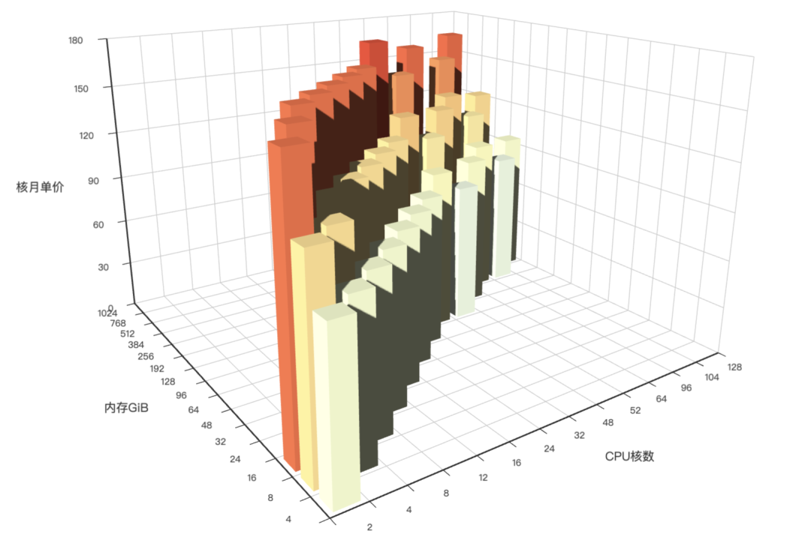

On Crazy Thursday, February 29, 2024, Alibaba-Cloud staged a **major price cut**, with [**promotional content**](https://mp.weixin.qq.com/s/CXkqD_d-pIpTl9sM_3iHoA) flying everywhere. As the **cloud computing mudslide**, many followers asked me to comment. The flashy 20%, 50% off banners look impressive, but outsiders see the spectacle while insiders see the real deal: [**the major cost driver in cloud services is storage**](/cloud/ebs).

The real cash cow for cloud providers - ESSD - didn't drop a penny. The price cuts for EC2 and OSS weren't on list prices, but on the minimum annual contract discounts - mainstream instance types can get about 10% off on 1, 3, and 5-year plans. So basically they cut nothing, and it's utterly useless for customers already enjoying lower commercial discounts.

We've analyzed before: cloud [**ECS computing**](/cloud/bonus/) can cost **ten times** local self-built infrastructure, while cloud [**ESSD storage**](/cloud/ebs/) can cost **one hundred times** local alternatives. Cloud databases [**RDS**](/cloud/rds) fall somewhere in between. A 10% computing discount compared to these premiums is like scratching an itch.

However, since Alibaba-Cloud claimed major price cuts, let me pull out the baseline resource prices and do another cost comparison using 2024 prices.

-------------

## TL;DR

Computing prices use **RMB/core·month** as the unified unit. Cloud server premiums are 5-12x self-built infrastructure.

As self-built reference cases, DHH and Tantan's large-scale compute/storage server unit costs are **20 RMB**/(core·month). Including 64x ratio local NVMe storage brings it to **22.4 RMB**/(core·month). Examining Alibaba-Cloud's domestic tier-1 availability zones' standard c/g/r instance families' latest three generations average computing prices, we can conclude:

Without considering storage, cloud on-demand, monthly, annual, and 5-year prepaid unit prices are **187 RMB, 125 RMB, 81 RMB, 37 RMB** respectively, representing **8x, 5x, 3x, 1x** premiums over self-built **20 RMB**. With common ratio block storage (1 core:64GB, ESSD PL3), unit prices become: **571 RMB, 381 RMB, 298 RMB, 165 RMB**, representing **24x, 16x, 12x, 6x** premiums over self-built **22.4 RMB**.

|     Key Numbers      | On-Demand Price | Monthly Price | Annual Price | 3-Year Prepaid | 5-Year Prepaid |
|:-------------------:|:---------------:|:-------------:|:------------:|:--------------:|:--------------:|
| **With 64x Storage Price** |    571 RMB     |   381 RMB    |   298 RMB   |    181 RMB    |    165 RMB    |
|   Multiple of Self-Built   |    **25x**     |     17x      |     13x     |      8x       |      7x       |
|  **Computing Unit Price**   |    187 RMB     |   125 RMB    |    81 RMB   |     53 RMB    |     37 RMB    |
|   Multiple of Self-Built   |       9x       |      6x      |     4x      |      3x       |    **2x**     |

We then further quantitatively analyze Alibaba-Cloud server pricing data, discovering the most impactful factors on unit prices: additional storage, payment method, availability zone, instance family (chip architecture, instance generation, memory ratio), and explain how the above numbers were calculated.

As a conclusion: even after the so-called "major price cuts," public cloud computing can hardly be called "cheap." In fact, cloud server costs are extremely high, especially for large-scale computing and large NVMe storage. If your business requires substantial block storage or more than one physical server's worth of computing, you should seriously calculate these costs and consider alternative options.

-------------

## Pure Computing Prices

We sampled the most representative domestic availability zones and the latest three generations of c/g/r instance families' pure computing prices, plotted as charts.

As shown in the table, the standard price for unit computing (1C4G) is the monthly price at **125 RMB**. Based on this: on-demand requires an additional 50% premium at **187 RMB**; annual prepaid gets 65% discount at **81 RMB**, 3-year gets 44% discount at **53 RMB**, 5-year prepaid gets 30% discount at **37 RMB**.

|    Key Numbers    | On-Demand Price | Monthly Price | Annual Price | 3-Year Prepaid | 5-Year Prepaid |
|:-----------------:|:---------------:|:-------------:|:------------:|:--------------:|:--------------:|
| **Computing Unit Price** |    187 RMB     |   125 RMB    |    81 RMB   |     53 RMB    |     37 RMB    |
|  Multiple of Self-Built  |       9x       |      6x      |     4x      |      3x       |      2x       |
|  Self-Built Cost Savings %  |      89%       |     84%      |     75%     |      62%      |      46%      |
| Self-Built Cost Reduces to % |      11%       |     16%      |     25%     |      38%      |      54%      |

We can use DHH's 2023 cloud exit self-built case and my personal experience with Tantan's off-cloud IDC self-built case as comparisons.
Excluding NVMe storage, DHH's self-built pure computing unit price is **22 RMB**, Tantan's self-built unit price is **18 RMB**.

{}
**Please note, these cost figures already include server costs plus allocated costs for switches/racks/network/power/maintenance/operations personnel. DHH's unit price includes 50% non-server costs, while Tantan's includes 20%. If only counting server costs, self-built unit prices can drop to 10 RMB. If calculated with container platform 500% oversell ratios...**
{}

Therefore, it's clear that cloud pure computing prices are 2-9 times self-built! To achieve the "ultimate elasticity" and "pay-as-you-go" touted by cloud providers, you need to pay an additional **8x** cost. If you don't care about elasticity at all and use it like normal server procurement with 5-year amortization, you still need to pay an additional **1x** cost.

-------------------

## Slaughter Plate Pricing

If cloud computing premiums in multi-year prepaid Saving Plans are barely acceptable, then cloud storage premiums are outright slaughter plates.

Large-scale computing often requires high-performance local storage - for example, an industry-common ratio specification is **1 core:64GB** NVMe storage. Both Tantan and DHH's self-built cases use this ratio. In Tantan's server case, 64 cores with 3.2TB NVMe SSD, procurement price 6000 yuan, current market price 2788 RMB. In DHH's case, 192 cores with 12TB NVMe SSD, procurement price $2390. With standard 5-year warranty and financial amortization, unit price **RMB/(GB·month)** is approximately **0.02**.

| Unit Price: RMB/GiB·month | IOPS | Bandwidth    |   Capacity   | On-Demand Price | Monthly Price | Annual Price | 3+ Year Prepaid |
|:-------------------------:|:----:|-------------|:------------:|:---------------:|:-------------:|:------------:|:---------------:|
| ESSD Cloud Disk PL0      | 10K  | 180 MB/s    | 40G-32T     |      0.76      |     0.50      |     0.43     |      0.25      |
| ESSD Cloud Disk PL1      | 50K  | 350 MB/s    | 20G-32T     |      1.51      |     1.00      |     0.85     |      0.50      |
| ESSD Cloud Disk PL2      | 100K | 750 MB/s    | 461G-32T    |      3.02      |     2.00      |     1.70     |      1.00      |
| ESSD Cloud Disk PL3      |  1M  | 4 GB/s      | 1.2T-32T    |      6.05      |     4.00      |     3.40     |      2.00      |
| Local NVMe SSD           |  3M  | 7 GB/s      | Max 64T per card |      0.02      |     0.02      |     0.02     |      0.02      |

Aside from system disks/HDDs and other budget options, Alibaba-Cloud offers four different specification levels of block storage: ESSD PL0 ~ PL3. Their unit prices are: **0.5, 1, 2, 4** respectively. ESSD PL3's performance barely approaches local Gen3 NVMe SSD, but its 4 RMB unit price is 200 times local self-built! Of course ESSD has its own discount strategy - with 3+ year prepaid, ESSD can get maximum 50% discount, but that's still 100x premium!

|     Key Numbers      | On-Demand Price | Monthly Price | Annual Price | 3-Year Prepaid | 5-Year Prepaid |
|:-------------------:|:---------------:|:-------------:|:------------:|:--------------:|:--------------:|
| **With 64x Storage Price** |    571 RMB     |   381 RMB    |   298 RMB   |    181 RMB    |    165 RMB    |
|   Multiple of Self-Built   |    **25x**     |     17x      |     13x     |      8x       |      7x       |
|  Self-Built Cost Savings %  |      96%       |     94%      |     92%     |      88%      |      86%      |
| Self-Built Cost Reduces to % |       4%       |      6%      |      8%     |      12%      |      14%      |

In "[Is Cloud Disk a Slaughter Plate](/cloud/ebs)" we've already detailed the performance, reliability, and cost comparison between cloud disks and local disks, so here we mainly use ESSD PL3 closest to local NVMe SSD for comparison. If we configure 64 GiB PL3 block storage per CPU core, the adjusted cloud server unit price becomes: **381 RMB**. Based on this: on-demand requires additional 50% premium at **571 RMB**; annual prepaid at **298 RMB**, 3-year gets 44% discount at **181 RMB**, 5-year prepaid gets 30% discount at **165 RMB**.

Compared to DHH/Tantan's self-built unit price with storage of **22.4 RMB**, cloud server unit prices reach **6-25 times** self-built!

> Chart: Unit price comparison with 64x storage

-------------

## Cloud Storage's Impact on Unit Prices

Among factors affecting server prices, storage has the largest variance.

For example, with the standard configuration above: **1 core:4x memory:64x storage**, when using different ESSD specifications, storage costs as a percentage of server costs vary dramatically.

With PL3 ESSD, **storage cost percentage** can reach **67% ~ 77%**. We can also choose worse budget disks as storage, trading IOPS/bandwidth throughput performance for "cost reduction." For example, using PL2 sacrifices **90%** IOPS performance to reduce this ratio to 51% ~ 63%, PL1/PL Auto sacrifices 95% performance to reduce this ratio to 34% ~ 46%. PL0 sacrifices 99% performance to reduce this ratio to 20% ~ 30%.

| **Cloud Disk Spec**     | **5-Year Prepaid** | **4-Year Prepaid** | **3-Year Prepaid** | **2-Year Prepaid** | **Annual Price** | **Monthly Price** | **On-Demand** |
|-------------------------|--------------------|--------------------|--------------------|--------------------|------------------|-------------------|---------------|
| **+PL3 ESSD**          | 165 RMB           | 172 RMB           | 181 RMB           | 247 RMB           | 298 RMB         | 381 RMB          | 571 RMB      |
| **+PL2 ESSD**          | 101 RMB           | 108 RMB           | 117 RMB           | 158 RMB           | 190 RMB         | 253 RMB          | 379 RMB      |
| **+PL1 ESSD**          | 69 RMB            | 76 RMB            | 85 RMB            | 113 RMB           | 135 RMB         | 189 RMB          | 283 RMB      |
| **+PL0 ESSD**          | 53 RMB            | 60 RMB            | 69 RMB            | 91 RMB            | 108 RMB         | 157 RMB          | 235 RMB      |
| **Pure Computing Price** | 37 RMB            | 44 RMB            | 53 RMB            | 68 RMB            | 81 RMB          | 125 RMB          | 187 RMB      |

Note that ESSD block storage and ECS computing have different discount structures. Since SSD's maximum discount (50% off) is weaker than pure computing's maximum discount (30% off), storage cost percentages increase with longer prepaid periods.

| **Cloud Disk Spec**     | **5-Year Prepaid** | **4-Year Prepaid** | **3-Year Prepaid** | **2-Year Prepaid** | **Annual Price** | **Monthly Price** | **On-Demand** |
|-------------------------|--------------------|--------------------|--------------------|--------------------|------------------|-------------------|---------------|
| **+PL3 ESSD**          | 77%               | 75%               | 71%               | 72%               | 73%             | 67%              | 67%          |
| **+PL2 ESSD**          | 63%               | 60%               | 55%               | 57%               | 57%             | 51%              | 51%          |
| **+PL1 ESSD**          | 46%               | 42%               | 38%               | 40%               | 40%             | 34%              | 34%          |
| **+PL0 ESSD**          | 30%               | 27%               | 23%               | 25%               | 25%             | 20%              | 20%          |
| **Pure Computing Price** | 0%                | 0%                | 0%                | 0%                | 0%              | 0%               | 0%           |

Some argue that cloud ESSD should be compared to SAN storage, while local NVMe SSD should be compared to instance storage. This issue was already explained in "[Is Cloud Disk a Slaughter Plate](/cloud/ebs)". Direct user-facing database services almost all use EBS rather than instance storage; furthermore, Alibaba-Cloud does have instance types with local NVMe SSD instance storage, like the `i` series, but unit prices here are far from cheap either.

-------------

## Prepaid Impact on Unit Prices

Prepaid payment methods significantly impact cloud server prices: **Computing prices use monthly prices as standard**, on-demand prices increase 50%, annual gets 65% discount, 2, 3, 4, 5-year discounts are 55%, 44%, 35%, 30% respectively. Storage prices also use monthly prices as baseline, on-demand prices increase 51.25%, annual gets 85% discount, 2-year gets 70% discount, 3+ years get 50% discount. ECS computing unit prices (RMB/core·month) and block storage ESSD unit prices (RMB/GiB·month) and discount rules are shown below:

| Payment Mode | Computing Discount | Computing Unit Price | ESSD Discount | PL3  | PL2  | PL1  | PL0  |
|:------------:|:------------------:|:--------------------:|:-------------:|:----:|:----:|:----:|:----:|
| On-Demand    |       150%        |        187          |   151.25%     | 6.05 | 3.02 | 1.51 | 0.76 |
| Monthly      |       100%        |        125          |     100%      | 4.00 | 2.00 | 1.00 | 0.50 |
| 1-Year Prepaid |       65%        |         81          |     85%       | 3.40 | 1.70 | 0.85 | 0.43 |
| 2-Year Prepaid |       55%        |         68          |     70%       | 2.80 | 1.40 | 0.70 | 0.35 |
| 3-Year Prepaid |       44%        |         53          |     50%       | 2.00 | 1.00 | 0.50 | 0.25 |
| 4-Year Prepaid |       35%        |         44          |     50%       | 2.00 | 1.00 | 0.50 | 0.25 |
| 5-Year Prepaid |    **30%**       |         37          |   **50%**     | 2.00 | 1.00 | 0.50 | 0.25 |

For pure computing, the latest three generations of mainstream instance families' prices and ratios are shown below, clearly demonstrating actual pricing closely matches the model above:

| **Instance Family Unit Price** | **5-Year Prepaid** | **4-Year Prepaid** | **3-Year Prepaid** | **2-Year Prepaid** | **Annual Price** | **Monthly Price** | **On-Demand** |
|--------------------------------|--------------------|--------------------|--------------------|--------------------|------------------|-------------------|---------------|
| **c6**                        | 27 RMB            | 31 RMB            | 38 RMB            | 49 RMB            | 58 RMB          | 88 RMB           | 133 RMB      |
| **c7**                        | 28 RMB            | 33 RMB            | 38 RMB            | 52 RMB            | 62 RMB          | 96 RMB           | 144 RMB      |
| **c8i**                       | 30 RMB            | 35 RMB            | 44 RMB            | 56 RMB            | 66 RMB          | 101 RMB          | 152 RMB      |
| **g6**                        | 34 RMB            | 40 RMB            | 49 RMB            | 62 RMB            | 74 RMB          | 114 RMB          | 170 RMB      |
| **g7**                        | 37 RMB            | 43 RMB            | 52 RMB            | 67 RMB            | 79 RMB          | 123 RMB          | 185 RMB      |
| **g8i**                       | 39 RMB            | 46 RMB            | 56 RMB            | 72 RMB            | 85 RMB          | 130 RMB          | 195 RMB      |
| **r6**                        | 45 RMB            | 53 RMB            | 65 RMB            | 83 RMB            | 98 RMB          | 150 RMB          | 225 RMB      |
| **r7**                        | 49 RMB            | 57 RMB            | 70 RMB            | 89 RMB            | 105 RMB         | 164 RMB          | 246 RMB      |
| **r8i**                       | 52 RMB            | 61 RMB            | 75 RMB            | 95 RMB            | 113 RMB         | 173 RMB          | 260 RMB      |

| **Instance Family Discount** | **5-Year Prepaid** | **4-Year Prepaid** | **3-Year Prepaid** | **2-Year Prepaid** | **Annual Price** | **Monthly Price** | **On-Demand** |
|------------------------------|--------------------|--------------------|--------------------|--------------------|------------------|-------------------|---------------|
| **c6**                      | 30%               | 35%               | 43%               | 55%               | 65%             | 100%             | 150%         |
| **c7**                      | 30%               | 35%               | 40%               | 54%               | 64%             | 100%             | 150%         |
| **c8i**                     | 30%               | 35%               | 43%               | 55%               | 65%             | 100%             | 150%         |
| **g6**                      | 30%               | 35%               | 43%               | 55%               | 65%             | 100%             | 150%         |
| **g7**                      | 30%               | 35%               | 43%               | 54%               | 64%             | 100%             | 150%         |
| **g8i**                     | 30%               | 35%               | 43%               | 55%               | 65%             | 100%             | 150%         |
| **r6**                      | 30%               | 35%               | 43%               | 55%               | 65%             | 100%             | 150%         |
| **r7**                      | 30%               | 35%               | 43%               | 54%               | 64%             | 100%             | 150%         |
| **r8i**                     | 30%               | 35%               | 43%               | 55%               | 65%             | 100%             | 150%         |

The chart above shows price comparisons for different instance families under various payment modes. If we average all instance prices (roughly equivalent to 1c4g standard pricing), the computing average prices under different payment modes are shown in the bar chart:

-------------

## Instance Family Impact on Pricing

Instance family impact on pricing mainly depends on three factors: **memory ratio**, **chip architecture**, **instance generation**.

First, within the same instance family, **instance unit prices are independent of CPU core count**, meaning the final computing portion price is linearly proportional to CPU cores. Therefore, there's no phenomenon where larger specifications are cheaper or more expensive per unit (this means cloud server instances have lower cost-effectiveness at larger scales).

Memory ratio refers to how many times memory per CPU core, with memory units in GiB. On Alibaba-Cloud, general-purpose (g) instances have 1:4 memory ratio, marked as `4x`, meaning one CPU core gets 4 GiB memory. Compute-optimized (c) instances have 1:2 memory ratio, memory-optimized (r) instances have 1:8 ratio.

| Gen | c Compute 2x | g General 4x | r Memory 8x | c / g | r / g |
|:---:|:------------:|:------------:|:-----------:|:-----:|:-----:|
|  6  |   88 RMB    |   114 RMB   |  150 RMB   |  78%  | 132%  |
|  7  |   96 RMB    |   123 RMB   |  164 RMB   |  78%  | 133%  |
|  8  |   101 RMB   |   130 RMB   |  173 RMB   |  78%  | 133%  |

Statistically, compared to `4x` general-purpose instance families, same-core memory-optimized instances `8x` with double memory cost **132%** of general-purpose instances; same-core compute-optimized instances `2x` with half memory cost **78%** of general-purpose instances.
We can also calculate from this pattern that Alibaba-Cloud's memory pricing is about 12 RMB/GiB·month: not cheap either - 16GB for two months could buy a memory stick.

Additionally, instance/CPU generation affects pricing. For example, using current eighth-generation instances as baseline, previous generation Gen7 instances get 95% discount, and Gen6 instances get 87% discount.

| Gen | Intel | ARM  | ARM / Intel | Yitian | Yitian / Intel |
|:---:|:-----:|:----:|:-----------:|:------:|:--------------:|
|  6  | 117 RMB | 104 RMB |     89%     |        |                |
|  7  | 128 RMB | 105 RMB |     82%     |        |                |
|  8  | 135 RMB | 125 RMB |     92%     | 96 RMB |      71%       |

From chip architecture perspective, ARM instances cost 90% of standard Intel instances, while Alibaba's self-developed Yitian chip instances cost 70% of standard Intel instances. 30% off to find guinea pigs for testing shows insufficient sincerity.

-------------

## Availability Zone Impact on Pricing

From a macro perspective, Alibaba-Cloud's availability zones can be divided into domestic/international regions, with distinctly different pricing. Overseas availability zones (including Hong Kong) cost much more than domestic zones, with Hong Kong being the most expensive - nearly double domestic zone prices across all instance families.

Domestic availability zones generally fall into two categories: central cities (Beijing, Shanghai, Guangzhou, Shenzhen, Hangzhou + Nanjing, Wuhan, Chengdu, Fuzhou, Qingdao) and remote corners (Ulanqab, Heyuan, Hohhot, Zhangjiakou). Central city availability zone instance pricing remains highly consistent (Chengdu is an exception, with some instance families slightly cheaper). Remote corner pricing can be cheaper, with up to 30% discounts compared to central cities.

