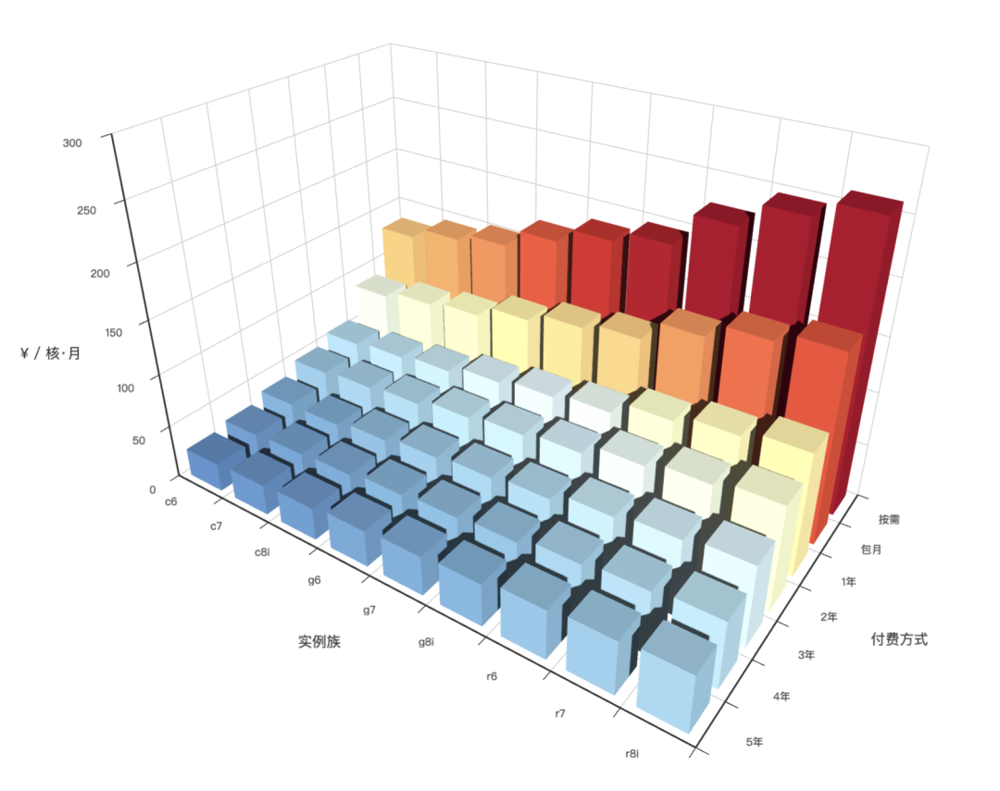

2024年2月29号疯狂星期四，阿里云搞了个[**大降价**](https://mp.weixin.qq.com/s/xO48vyZKwxLOZdQa5AD_gw)，[**软文**](https://mp.weixin.qq.com/s/CXkqD_d-pIpTl9sM_3iHoA)漫天飞舞，作为**云计算泥石流**，不少朋友在后台留言让我点评一下。满屏的 20%，50% off 看上去好像降的很壮观，但外行看热闹，内行看门道：[**云服务的成本大头在于存储**](/cloud/ebs)。

云厂商真正的杀猪刀 —— ESSD 可是一毛钱都没降。而 EC2 和 OSS 降价降的也不是列表价，而是包年的最低折扣 —— 主力机型包一、三、五年可降价 10% 左右，所以也基本上降了个寂寞，对于已经享受低于此商务折扣的客户更是毫无卵用。

我们之前有过分析：云上 [**ECS 算力**](/cloud/bonus/)单价可达本地自建的**十倍**，云上 [**ESSD 存储**](/cloud/ebs/)单价可以达到本地自建的**百倍**。云数据库 [**RDS**](/cloud/rds) 介于两者之间。算力降价 10%， 相对于这个溢价来说就跟挠痒痒一样。

不过，既然阿里云号称大降价了，我就把云上基础资源的价格拎出来，用 2024 年的价格，再做一次成本对比。

-------------

## 太长不看

算力的价格使用 **人民币/核·月** 作为统一单位 ，云服务器的溢价为自建的 5 ～ 12 倍。

作为自建的参照案例，DHH 与 探探自建大型计算/存储服务器的单价成本为 **20 ¥**/(核·月)，算上64x 配比的本地 NVMe 存储后为 **22.4 ¥**/(核·月)。我们考察阿里云国内一线可用区标准 c/g/r 实例族最近三代的算力均价，可以得出以下结论

在不考虑存储的情况下，云上按量，包月，包年，预付五年的单价分别为 **187¥，125¥，81¥，37¥**，相比自建的 **20¥** 分别溢价了 **8x, 5x, 3x, 1x**。在配置常用比例的块存储后（1核:64GB, ESSD PL3），单价分别为：**571¥，381¥，298¥，165¥**，相比自建的 **22.4¥** 溢价了 **24x, 16x, 12x, 6x** 。

|     关键数字      |  按需价格   | 包月价格  | 包年价格  | 预付三年  |  预付五年  |
|:-------------:|:-------:|:-----:|:-----:|:-----:|:------:|
| **配上64x存储价格** |  571 ¥  | 381 ¥ | 298 ¥ | 181 ¥ | 165 ¥  |
|   是自建价格的几倍    | **25x** |  17x  |  13x  |  8x   |   7x   |
|  **算力单位价格**   |  187 ¥  | 125 ¥ | 81 ¥  | 53 ¥  |  37 ¥  |
|   是自建价格的几倍    |   9x    |  6x   |  4x   |  3x   | **2x** |

随后，我们进一步定量分析阿里云服务器定价数据，发现了对单价影响最大的几项要素：附加存储，付费方式，可用区，实例族（芯片架构，实例代际，内存配比），并解释了上面的数字是如何计算得到的。

作为结论：即使是在所谓的“大降价”后，公有云提供的算力也远远称不上 “便宜” 。实际上云服务器的成本极其高昂，尤其是大型计算与大型 NVMe 存储。如果您的业务需要较大的块存储或一台物理服务器以上的算力，您确实应当仔细计算一下这里的成本，并考虑一下其他的备选项。

-------------

## 纯算力的价格

我们取样了最具有代表性的国内可用区，最近三代 c/g/r 实例族纯算力部分的的价格，绘制为图表。

如表所示，单位算力（1C4G）的标准价格是包月的价格，为 **125 ¥**。在此基础上：按量付费需要额外支付 50% 溢价，为 **187 ¥**；包年预付可以打 65折为 **81 ¥**，包三年可以打 44 折为 **53 ¥**，预付五年可以打三折为 **37 ¥**。

|    关键数字    | 按需价格  | 包月价格  | 包年价格 | 预付三年 | 预付五年 |
|:----------:|:-----:|:-----:|:----:|:----:|:----:|
| **算力单位价格** | 187 ¥ | 125 ¥ | 81 ¥ | 53 ¥ | 37 ¥ |
|  是自建价格的几倍  |  9x   |  6x   |  4x  |  3x  |  2x  |
|  自建成本可降低%  |  89%  |  84%  | 75%  | 62%  | 46%  |
| 自建成本可降至 %  |  11%  |  16%  | 25%  | 38%  | 54%  |

我们可以使用 DDH 2023 年下云自建的案例，以及我自己在探探亲身经历的云下 IDC 自建案例作为对比。
刨除 NVMe 存储部分后，DHH 自建的纯算力单价为 **22 ¥**，探探自建的单价为 **18 ¥**。

{}
**请注意，此成本数字中已经包含了服务器费用，以及交换机/机柜/网/电/代维/运维人员均摊后的费用。DHH 的单位价格中有 50% 是服务器之外的成本，探探中则为 20% 。如果只算服务器成本，自建单位价格可以降至 10 ¥。如果再以容器平台 500% 超卖比率计算…**
{}

因此不难看出，云上的纯算力的价格是自建的 2 ～ 9 倍！为了实现云厂商所鼓吹的 “极致弹性”，“按量付费”，您需要额外付出 **8倍**的成本。假如您完全不在乎弹性，就跟正常采购服务器五年摊销一样使用，那么仍然需要额外付出**1倍**的成本。

-------------------

## 杀猪盘的价格

如果云上的算力溢价在预付多年的 Saving Plan 中，价格还能勉强让人接受，那么云上存储的溢价就属于离谱的杀猪盘了。

大型算力往往要搭配高性能的本地存储使用 —— 例如业内经常使用的一种配比规格为 **1核:64GB** NVMe 存储。探探和 DHH 的自建案例中都使用此配比。 探探的服务器案例中，64核配 3.2TB NVMe SSD，采购价 6000 元，当下市价 ¥2788。在 DHH的案例中，192 核配 12 TB NVMe SSD，采购价 \$2390。以标准五年质保与财务摊销计算，单位价格 **¥/(GB·月)** 约为 **0.02**。

| 单位价格：¥/GiB月 | IOPS | 带宽       |    容量    | 按需价格 | 包月价格 | 包年价格 | 预付三年+ |
|:-----------:|:----:|----------|:--------:|:----:|:----:|:----:|:-----:|
| ESSD 云盘 PL0 | 10K  | 180 MB/s | 40G-32T  | 0.76 | 0.50 | 0.43 | 0.25  |
| ESSD 云盘 PL1 | 50K  | 350 MB/s | 20G-32T  | 1.51 | 1.00 | 0.85 | 0.50  |
| ESSD 云盘 PL2 | 100K | 750 MB/s | 461G-32T | 3.02 | 2.00 | 1.70 | 1.00  |
| ESSD 云盘 PL3 |  1M  | 4 GB/s   | 1.2T-32T | 6.05 | 4.00 | 3.40 | 2.00  |
| 本地 NVMe SSD |  3M  | 7 GB/s   | 最大单卡64T  | 0.02 | 0.02 | 0.02 | 0.02  |

抛开系统盘/HDD这种乞丐盘，在阿里云上提供了四种不同规格等级的块存储：ESSD PL0 ~ PL3。其单位价格分别为：**0.5, 1, 2, 4**。ESSD PL3 的性能勉强接近本地 Gen3 NVMe SSD，但它 4 块钱的单价是本地自建的 200 倍！当然 ESSD 也有自己独立的折扣策略 —— 预付费三年以上，ESSD 可以打满顶折 5 折，但那也是 100 倍溢价了！

|     关键数字      |  按需价格   | 包月价格  | 包年价格  | 预付三年  | 预付五年  |
|:-------------:|:-------:|:-----:|:-----:|:-----:|:-----:|
| **配上64x存储价格** |  571 ¥  | 381 ¥ | 298 ¥ | 181 ¥ | 165 ¥ |
|   是自建价格的几倍    | **25x** |  17x  |  13x  |  8x   |  7x   |
|   自建成本可降低%    |   96%   |  94%  |  92%  |  88%  |  86%  |
|   自建成本可降至 %   |   4%    |  6%   |  8%   |  12%  |  14%  |

在《[云盘是不是杀猪盘](/cloud/ebs)》中我们已经详细对比过云盘与本地盘的性能、可靠性与成本，因此这里主要使用与本地 NVMe SSD 最接近的 ESSD 云盘 PL3 作为对比。如果我们为每核 CPU 配置 64 GiB 的 PL3 块存储，则调整后的云服务器单价为：**381 ¥**。在此基础上：按量付费需要额外支付 50% 溢价，为 **571 ¥**；包年预付为 **298 ¥**，包三年可以打 44 折为 **181 ¥**，预付五年可以打三折为 **165**。

与 DHH / 探探自建的含存储单价 **22.4 ¥** 相比，云服务器单价达到了自建的 **6 ～ 25** 倍！

> 图：带64x存储单价对比

-------------

## 云存储对单价的影响

在影响服务器价格的因素中，存储是变数最大的一个。

例如，以上面的标准配置：**1核:4x内存:64x存储**，在使用不同规格的 ESSD 的情况下，存储费用占服务器费用的比例差异非常之大。

使用 PL3 ESSD 的情况下，**存储费用占比**可以达到 **67% ~ 77%**，我们也可以选择更烂的乞丐盘作为存储，以IOPS/带宽吞吐性能为代价 “降低成本”。例如，使用 PL2 以牺牲 **90%** 的 IOPS 性能为代价，将这一比例降低至 51% ～ 63%，PL1/PL Auto 以牺牲 95% 的性能为代价，将此比例降低至 34% ～ 46%。PL0 则以 99% 的性能为代价，将此比例降低至 20% ～ 30% 。

| **云盘规格**      | **预付五年** | **预付四年** | **预付三年** | **预付二年** | **包年价格** | **包月价格** | **按量付费** |
|---------------|----------|----------|----------|----------|----------|----------|----------|
| **+PL3 ESSD** | ¥165     | ¥172     | ¥181     | ¥247     | ¥298     | ¥381     | ¥571     |
| **+PL2 ESSD** | ¥101     | ¥108     | ¥117     | ¥158     | ¥190     | ¥253     | ¥379     |
| **+PL1 ESSD** | ¥69      | ¥76      | ¥85      | ¥113     | ¥135     | ¥189     | ¥283     |
| **+PL0 ESSD** | ¥53      | ¥60      | ¥69      | ¥91      | ¥108     | ¥157     | ¥235     |
| **纯算力价格**     | ¥37      | ¥44      | ¥53      | ¥68      | ¥81      | ¥125     | ¥187     |

请注意，ESSD 块存储和 ECS 算力的折扣力度是不同步的，由于 SSD 的顶配折扣（5折）比纯算力的顶配折扣（3折）要更弱，所以存储费用比例随着预付费时间增加会越来越高。

| **云盘规格**      | **预付五年** | **预付四年** | **预付三年** | **预付二年** | **包年价格** | **包月价格** | **按量付费** |
|---------------|----------|----------|----------|----------|----------|----------|----------|
| **+PL3 ESSD** | 77%      | 75%      | 71%      | 72%      | 73%      | 67%      | 67%      |
| **+PL2 ESSD** | 63%      | 60%      | 55%      | 57%      | 57%      | 51%      | 51%      |
| **+PL1 ESSD** | 46%      | 42%      | 38%      | 40%      | 40%      | 34%      | 34%      |
| **+PL0 ESSD** | 30%      | 27%      | 23%      | 25%      | 25%      | 20%      | 20%      |
| **纯算力价格**     | 0%       | 0%       | 0%       | 0%       | 0%       | 0%       | 0%       |

有人主张说，云上的 ESSD 应该和 SAN 存储对比，本地 NVMe SSD 应该与实例存储进行对比。在《**[云盘是不是杀猪盘](/cloud/ebs)**》中已经解释过这个问题。直接面向用户的数据库类服务使用的几乎都是 EBS 而非实例存储；此外，阿里云并非没有带本地 NVMe SSD 实例存储的机型，例如 `i` 系列，但这里的单价也远远说不上便宜。

-------------

## 预付费对单价的影响

预付费方式对云服务器的价格有着显著影响：**算力的价格以包月价格作为标准**，按需付费价格上浮 50%，包年打 65 折，包二、三、四、五年的折扣分别是55，44，35，30 折。存储的价格同样以包月价格作为基准，按需付费的价格上浮 51.25%，包年打85折，两年七折，三年以上五折。ECS 算力的单价（¥/核月）与块存储 ESSD 的单价（¥/GiB月）和折扣规则如下表所示：

| 付费模式 |  算力折扣   | 算力单价 | ESSD折扣  | PL3  | PL2  | PL1  | PL0  |
|:----:|:-------:|:----:|:-------:|:----:|:----:|:----:|:----:|
| 按量付费 |  150%   | 187  | 151.25% | 6.05 | 3.02 | 1.51 | 0.76 |
| 包月付费 |  100%   | 125  |  100%   | 4.00 | 2.00 | 1.00 | 0.50 |
| 预付一年 |   65%   |  81  |   85%   | 3.40 | 1.70 | 0.85 | 0.43 |
| 预付二年 |   55%   |  68  |   70%   | 2.80 | 1.40 | 0.70 | 0.35 |
| 预付三年 |   44%   |  53  |   50%   | 2.00 | 1.00 | 0.50 | 0.25 |
| 预付四年 |   35%   |  44  |   50%   | 2.00 | 1.00 | 0.50 | 0.25 |
| 预付五年 | **30%** |  37  | **50%** | 2.00 | 1.00 | 0.50 | 0.25 |

对于纯算力来说，最近三代主流实例族的价格与比例如下表所示，不难看出实际定价相当符合上面给出的模型：

| **实例族单价** | **预付五年** | **预付四年** | **预付三年** | **预付二年** | **包年价格** | **包月价格** | **按量付费** |
|-----------|----------|----------|----------|----------|----------|----------|----------|
| **c6**    | ¥27      | ¥31      | ¥38      | ¥49      | ¥58      | ¥88      | ¥133     |
| **c7**    | ¥28      | ¥33      | ¥38      | ¥52      | ¥62      | ¥96      | ¥144     |
| **c8i**   | ¥30      | ¥35      | ¥44      | ¥56      | ¥66      | ¥101     | ¥152     |
| **g6**    | ¥34      | ¥40      | ¥49      | ¥62      | ¥74      | ¥114     | ¥170     |
| **g7**    | ¥37      | ¥43      | ¥52      | ¥67      | ¥79      | ¥123     | ¥185     |
| **g8i**   | ¥39      | ¥46      | ¥56      | ¥72      | ¥85      | ¥130     | ¥195     |
| **r6**    | ¥45      | ¥53      | ¥65      | ¥83      | ¥98      | ¥150     | ¥225     |
| **r7**    | ¥49      | ¥57      | ¥70      | ¥89      | ¥105     | ¥164     | ¥246     |
| **r8i**   | ¥52      | ¥61      | ¥75      | ¥95      | ¥113     | ¥173     | ¥260     |

| **实例族折扣** | **预付五年** | **预付四年** | **预付三年** | **预付二年** | **包年价格** | **包月价格** | **按量付费** |
|-----------|----------|----------|----------|----------|----------|----------|----------|
| **c6**    | 30%      | 35%      | 43%      | 55%      | 65%      | 100%     | 150%     |
| **c7**    | 30%      | 35%      | 40%      | 54%      | 64%      | 100%     | 150%     |
| **c8i**   | 30%      | 35%      | 43%      | 55%      | 65%      | 100%     | 150%     |
| **g6**    | 30%      | 35%      | 43%      | 55%      | 65%      | 100%     | 150%     |
| **g7**    | 30%      | 35%      | 43%      | 54%      | 64%      | 100%     | 150%     |
| **g8i**   | 30%      | 35%      | 43%      | 55%      | 65%      | 100%     | 150%     |
| **r6**    | 30%      | 35%      | 43%      | 55%      | 65%      | 100%     | 150%     |
| **r7**    | 30%      | 35%      | 43%      | 54%      | 64%      | 100%     | 150%     |
| **r8i**   | 30%      | 35%      | 43%      | 55%      | 65%      | 100%     | 150%     |

上图展示了不同实例族在不同付费模式下的价格对比。如果我们对所有实例价格取一个平均（大致相当于 1c4g 机型的标准价），不同付费模式下的算力均价如柱状图所示：

-------------

## 实例族对价格的影响

实例族对价格的影响主要取决于三点：**内存配比**，**芯片架构**，**实例代际**。

首先，同一实例族内的 **实例单价与CPU核数无关**，即最终算力部分的价格线性正比于 CPU 核数。因此不会出现规格越大，单价越便宜或越贵的现象（这意味着云服务器实例规格越大，性价比越低）。

内存配比指的是一个 CPU 核配比多少倍的内存，内存的单位是 GiB。在阿里云上，通用型（g）实例的内存配比为1:4，标记为 `4x` ，即一核CPU配 4 GiB 内存。计算型（c）实例内存配比为 1:2，内存型（r）实例内存配比为 1:8 。

| 代际 | c 计算型 2x | g 通用型 4x | r 内存型 8x | c / g | r / g |
|:--:|:--------:|:--------:|:--------:|:-----:|:-----:|
| 6  |   ¥ 88   |  ¥ 114   |  ¥ 150   |  78%  | 132%  |
| 7  |   ¥ 96   |  ¥ 123   |  ¥ 164   |  78%  | 133%  |
| 8  |  ¥ 101   |  ¥ 130   |  ¥ 173   |  78%  | 133%  |

从统计上看，相比 `4x` 通用型实例族，同核数的内存型实例 `8x` 内存翻倍，价格是通用型实例的 **132%** ；同核数的计算型实例 `2x` 内存减半，价格是通用型实例的 **78%**。
我们还可以根据这里的规律计算出阿里云上内存的定价约为 12 元/GiB月：也不算便宜，16G用俩个月就够买一条了。

此外，实例/CPU 的代际也对价格有影响，例如以当下的八代实例为基准，上一代 Gen7 实例的价格会在本代基础上打 95 折，再上一代 Gen6 的实例会在本代基础上打 87 折。

| 代际 | Intel |  ARM  | ARM / Intel |  倚天  | 倚天 / Intel |
|:--:|:-----:|:-----:|:-----------:|:----:|:----------:|
| 6  | ¥ 117 | ¥ 104 |     89%     |      |            |
| 7  | ¥ 128 | ¥ 105 |     82%     |      |            |
| 8  | ¥ 135 | ¥ 125 |     92%     | ¥ 96 |    71%     |

从芯片架构上看，ARM 实例价格是标准 Intel 实例的九折，阿里自研倚天芯片实例的价格是标准 Intel 实例的七折。30% off 就想找小白鼠尝鲜，诚意有些不足了。

-------------

## 可用区对价格的影响

从大的层面上来说，阿里云的可用区可以分为国内/国际区域，两者的价格有着泾渭分明的区别。海外可用区（包括香港）的价格要比国内可用区高很多，最贵的可用区是香港，各实例族价格几乎是国内可用区的一倍。

国内可用区价格上大体分为两类：中心城市（北上广深杭+宁汉蓉榕青）和犄角旮旯（乌兰察布，河源，呼和浩特，张家口）。中心城市可用区的实例定价保持高度一致（成都例外，有几个实例族稍微便宜点）。犄角旮旯地方的实例价格会便宜一些，相比中心城市最高可能有 30% 的折扣。

