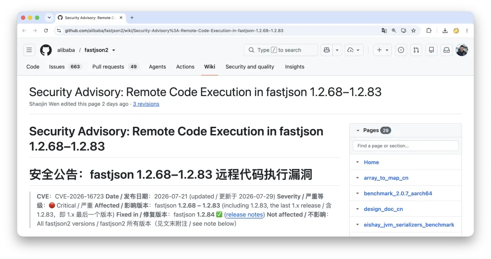
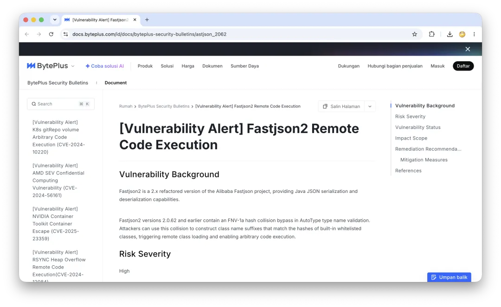

On July 21, [Alibaba published a FastJSON security advisory](https://github.com/alibaba/fastjson2/wiki/Security-Advisory%3A-Remote-Code-Execution-in-fastjson-1.2.68%E2%80%931.2.83) for `CVE-2026-16723`, rated 9.0 by its CNA and affecting versions 1.2.68 through 1.2.83.

The advisory explained the flaw, its trigger conditions, and why a specified target type was not necessarily safe. It also said `fastjson2` was unaffected: no equivalent resource-probing path, an allowlist-first design, and the now-deprecated `AutoType` disabled. Its users needed to take no action for this CVE.



Six days later, [a separate `AutoType` bypass in `fastjson2`](https://mp.weixin.qq.com/s/LJaul1jNjK9pXRAkoUiMEA) became public. On July 29, the project [released 2.0.63](https://github.com/alibaba/fastjson2/releases/tag/2.0.63), adding checks on type names, verification after allowlist hash matches, and stricter rules for dangerous base classes.

The advisory was not false: the bugs had different causes, and `fastjson2` remains unaffected by `CVE-2026-16723`. But it felt like proving a new building could not burn through the old one's chimney, only to see its electrical panel catch fire six days later. Different cause, same headline.



Since 2019, the pattern spans seven years, three vulnerabilities, and two implementations. How can a JSON parser still produce RCEs after a decade? The answer is neither JSON nor simply “Alibaba writes bad software.” It is a style I will call **ship rough, scale hard, move fast**: release the incomplete design, entrench it through scale, and book today's gains while deferring the risk. The Chinese phrase 糙猛快 compresses those instincts into three characters.

---

## Too Long; Didn't Read

- Letting external data choose a class was a mistake shared by Java's native serialization, Jackson, FastJSON, and .NET's `BinaryFormatter`.

- The difference is the exit: Jackson replaced its entry point; Microsoft removed the implementation; Java added filters; FastJSON built `SafeMode` but left it off by default.

- Different bugs can still reveal the same broken security boundary, even across a rewrite.

- “Ship rough, scale hard, move fast” is an accounting system: record benefits now and defer risk. A successful shortcut becomes doctrine.

- AI adds leverage and removes the old speed limit: humans writing code.

---

## 1. This Is Not JSON. It Is Control.

Consider what `AutoType` does when it sees this input:

```json
{"@type": "com.foo.Bar"}
```

The program loads `com.foo.Bar`, creates an instance, and fills it from the input. This restores polymorphic object trees without callers mapping every type. But ordinary deserialization asks how values fill an object; `AutoType` asks which object the program should create. It moves input from the data plane into the control plane. With untrusted JSON, a stranger helps decide which code your program loads.


Alibaba did not invent this mistake. Java's `ObjectInputStream` already let a stream choose object types; JDK 9 added filters in [`JEP 290`](https://openjdk.org/jeps/290), and Java 17 added context-specific policies in [`JEP 415`](https://openjdk.org/jeps/415). Jackson's polymorphic deserialization and .NET's `BinaryFormatter` had the same problem.

What distinguished FastJSON was how far it pushed convenience and speed. In a [2019 interview](https://gitee.com/gitee-stars/18), author Shaojin Wen named high performance and ease of use as its first two advantages. “Ship rough, scale hard, move fast” enters through such respectable choices: make the API effortless, win benchmarks, preserve compatibility, add another check, postpone the exit. Each can be reasonable alone. The combined ten-year bill is not.

---

## 2. One Mistake, Four Responses

The industry made the same mistake. What matters is what happened next.

### Jackson: Replace the Entry Point

Early Jackson releases also played denylist whack-a-mole. [Jackson 2.10, released in 2019](https://github.com/FasterXML/jackson/wiki/Jackson-Release-2.10), introduced `PolymorphicTypeValidator` and began deprecating the old default-typing APIs. Rules may match a base class, package, or custom predicate, but callers must explicitly define them: if input helps choose a type, the application must say which types are eligible.

### Java: Lock the Explosives Cabinet

JEP 290 provides process-wide and per-stream filters for allowed classes, object depth, references, and array size; JEP 415 selects filters by context. The capability remains, so someone must configure and maintain the lock.

### Microsoft: Remove the Implementation

Microsoft retired `BinaryFormatter` explicitly: [`.NET 5`](https://learn.microsoft.com/en-us/dotnet/core/compatibility/serialization/5.0/binaryformatter-serialization-obsolete) marked it obsolete; [`.NET 7`](https://learn.microsoft.com/en-us/dotnet/core/compatibility/serialization/7.0/binaryformatter-apis-produce-errors) turned calls into compile-time errors; [`.NET 8`](https://learn.microsoft.com/en-us/dotnet/core/compatibility/serialization/8.0/binaryformatter-disabled) disabled it at runtime for most projects; and [`.NET 9`](https://learn.microsoft.com/en-us/dotnet/standard/serialization/binaryformatter-migration-guide/) removed the implementation. A separate unsupported package preserves the old behavior—and its risks. [The migration guide](https://learn.microsoft.com/en-us/dotnet/standard/serialization/binaryformatter-migration-guide/) says, in effect: you may continue, but the platform will not call it safe.

### FastJSON: Leave a Switch

FastJSON had a real solution too. [Version 1.2.68 introduced `SafeMode`](https://github.com/alibaba/fastjson/wiki/fastjson_safemode), which rejects every `AutoType` request; `SafeMode=true` blocks `CVE-2026-16723` before its vulnerable path. But affected releases shipped with both `AutoType` and `SafeMode` off. The first setting suggested the dangerous feature was disabled; only the second guaranteed its type-resolution path could not run.

Defaulting to `SafeMode` would break legacy applications, and a third-party library cannot force migration like a platform vendor can. Yet compatibility needs an exit: deprecation, migration tooling, and an end date. It may refinance debt, not abolish maturity. A decade-old “temporary” exception is a constitution.

---

## 3. Forensics Is Not Pathology

The three vulnerabilities were different bugs with the same posture. The [2019 bypass](https://paper.vulsee.com/KCon/2022/Hacking%20JSON%E3%80%90KCon2022%E3%80%91.pdf) first used paths such as `java.lang.Class` to put a dangerous class into `TypeUtils`'s global map. A second request retrieved it from cache without reopening `checkAutoType`. Versions 1.2.25–1.2.32 were exploitable only with `AutoType` off; 1.2.33–1.2.47 could be affected either way. The cache proved that a name had been seen, not that it was safe, yet the fast path treated those as equivalent.

[`CVE-2026-16723`](https://github.com/alibaba/fastjson2/wiki/Security-Advisory%3A-Remote-Code-Execution-in-fastjson-1.2.68%E2%80%931.2.83) lived inside the check itself. `checkAutoType` probed for a resource using an attacker-controlled string; Spring Boot's executable fat-jar class loader could route a crafted type name through a nested URL to remote loading. Under that deployment, FastJSON 1.2.68–1.2.83 was vulnerable with its original settings—`AutoType` off and `SafeMode` off—and required no traditional classpath gadget. A target DTO was not enough if it contained broad fields such as `Object` or `Map`.

Users had followed normal advice: leave `AutoType` off and specify a type. But “off” is another code path, not a security property. It needs the same design, testing, and audit rigor as the main feature.

Six days later, `fastjson2` failed differently. With `AutoType` disabled, its allowlist matched incremental FNV-1a hashes but did not compare the actual text after a hit. Hashes make good indexes, not identities; attackers can construct collisions.

The [2.0.63 fix](https://github.com/alibaba/fastjson2/releases/tag/2.0.63) rejects URL-special characters before class loading, verifies text after a hash hit, and prevents package-prefix `accept` rules from admitting `ClassLoader`, `DataSource`, `RowSet`, and other dangerous base classes unless explicitly named. FastJSON 1.2.84 received the same hardening. The prefix change exposes a threat-model error, not merely a performance shortcut: a convenient business-package rule had drawn the security boundary too broadly.

The proximate causes—cache handling, resource loading, hash verification, type rules—are genuinely different. That is the forensic report. Pathology asks why convenient parsing and fast paths became primary while security stayed a patch layer; why `SafeMode` never became the default; why denylists grew without a retirement date; and why a high-risk, widely deployed parser depended on time its maintainer could spare.

Here, **ship rough** means releasing before the threat model, edge cases, safe defaults, and exit plan are complete. **Scale hard** turns an under-validated design into a fact until compatibility defends it. **Move fast** records visible features, benchmarks, and painless upgrades today while carrying invisible risk forward. That is the shared operating model beneath different bugs.

Technical debt has achieved a clever financial innovation: the principal never needs repayment as long as successors can keep covering the interest.

---

## 4. It Really Did Win

The model is dangerous because it can work. Around 2010, hardware was expensive, market windows were narrow, and growth outran engineering discipline. A library tens of percent faster and half as hard to deploy could win the market; trading some rigor for speed could be rational.

Success turns a shortcut into experience. Organizations confuse sequence with cause: we did this, then won, so this made us win. Timing, luck, capital, demographics, and competitors' errors collapse into one teachable sentence:

> This is how we did it back then.

A description becomes a prescription, then a performance system and muscle memory. One project's emergency plan—run first, patch later—becomes reusable engineering wisdom.

MySQL presents a larger bill. [Jepsen's analysis of MySQL 8.0.34](https://jepsen.io/analyses/mysql-8.0.34) found lost updates, internal-consistency violations, and non-monotonic views under default `Repeatable Read`. That behavior satisfies neither PL-2.99 repeatable read nor snapshot isolation and is only somewhat stronger than `Read Committed`. I discuss the result in [“Is MySQL's Correctness Really This Bad?”](/db/bad-mysql/).

When one server was insufficient, Cobar, TDDL, DRDS, and MyCat built an ecosystem around sharding. Discarded transactions then prompted GTS and Seata; skew, cross-shard joins, global IDs, and resharding produced specialist roles; finally came OceanBase and PolarDB. One shortcut's assumptions propagated until sunk cost pointed only further in.

---

## 5. Who Signs, Who Gets Promoted, Who Pays

No company says correctness is unimportant. Incentives say it more effectively. Releases must happen this quarter; the backlog reaches next year. Features have dates and enter weekly reports; security debt does neither. Three quiet years maintaining a library make a weak promotion story. A new system built in three months writes its own headline.

In a [2019 interview](https://gitee.com/gitee-stars/18), FastJSON author Shaojin Wen said he maintained FastJSON and Druid in his spare time: attention to one reduced attention to the other. He also said Alibaba backed some critical open-source projects, so this is not evidence that Alibaba never funded open source. It asks something narrower: did a massively deployed parser on a high-risk boundary receive governance proportional to its blast radius?


This is not an indictment of the maintainer. It is an unreasonable burden: production security should not depend on whether one person has energy tonight. Open source does not oblige a company to fund every project forever, but dependency scale, blast radius, and maintenance resources should bear some relationship.

“Ship rough, scale hard, move fast” privatizes gains and socializes maintenance. Launches and savings accrue to one group; the bill goes to security, operations, downstream users, and the engineer paged at 3 a.m. The borrower and payer are different people. Banks at least ask who you are. Code does not.

---

## 6. This Is a Choice, Not Fate

Ordinary web services need not meet aircraft standards. Assurance should match the consequences of failure: a campaign page and flight controls deserve different rigor. The internet industry has canaries, rollback, observability, SRE, game days, and chaos engineering, but expertise in recovery can obscure failures that should never be allowed. A stylesheet can be rolled back; untrusted input influencing class loading cannot be excused by a ten-minute recovery objective. Four boundaries should never be weakened without users' informed consent:

1. **Documented guarantees must match behavior.** An “allowlist” cannot mean only a hash hit; users build threat models around the documented contract.

2. **Untrusted input needs a hard control-plane boundary.** If a string can select classes, tools, or data, later filters mostly decide when the incident occurs.

3. **Security mechanisms must fail closed.** Bad configuration, missing rules, cache hits, and validation errors must cause rejection. A branch named “disabled” earns no automatic trust.

4. **Critical dependencies need an owner, response process, and exit.** End-of-maintenance policy must distinguish feature work, routine fixes, and critical-vulnerability response; downstream notice, alternatives, and final support dates belong in a plan, not an incident call.

Log4Shell showed that nationality does not immunize software. The useful question is what an incident leaves behind besides a CVE and postmortem.

The U.S. [Cyber Safety Review Board](https://www.cisa.gov/sites/default/files/2023-02/CSRB-Report-on-Log4j-PublicReport-July-11-2022-508-Compliant.pdf) made Log4j the subject of its first review. OpenSSF proposed a two-year, roughly $150 million [open-source security mobilization plan](https://www.linuxfoundation.org/press/press-release/linux-foundation-openssf-gather-industry-government-leaders-open-source-software-security-summit) and received initial commitments above $30 million. [Alpha-Omega](https://alpha-omega.dev/resources/reports/) funds critical maintainers and expert analysis. An incident can create budgets, jobs, and continuing programs—not just prose.

Institutions can retreat. In January 2026, U.S. OMB memorandum [M-26-05](https://www.whitehouse.gov/wp-content/uploads/2026/01/M-26-05-Adopting-a-Risk-based-Approach-to-Software-and-Hardware-Security.pdf) rescinded the previous uniform attestation policy in favor of agency-specific risk decisions and made the former form and SBOM requirements optional. Rules can shrink under political and cost pressure.

China also has the 2021 [Regulations on the Management of Security Vulnerabilities in Network Products](https://www.cac.gov.cn/2021-07/13/c_1627761607640342.htm), plus [GB/T 43698—2024 on software supply-chain security](https://std.samr.gov.cn/gb/search/gbDetailed?id=173829859D2E1AA5E06397BE0A0AA311) and [GB/T 43848—2024 on evaluating open-source code security](https://std.samr.gov.cn/gb/search/gbDetailed?id=173829859DA71AA5E06397BE0A0AA311). The gap is not documents versus no documents. It is turning dependency risk into durable budgets, accountable roles, and executable exits. A patch, a postmortem, and “more security awareness” are not enough: awareness has no headcount, and values have no budget.

---

## 7. This Time, Ammunition Is Free

The boundary is reappearing in AI agents. `AutoType` lets external type data influence class loading; prompt injection lets external text masquerade as instructions and influence tools, data, and behavior. They differ, but both blur data and control planes.

This case is harder. `AutoType` can be removed; prompt injection cannot, because instructions and data both reach language models as natural language. OpenAI calls it an evolving [frontier security challenge](https://openai.com/index/prompt-injections/). Defenses assume the model will eventually be deceived and limit the consequences through least privilege, isolation, sandboxes, confirmation for sensitive actions, and deterministic authorization. There is no universal model-level `SafeMode`; the surrounding system must provide one.

Deployment still starts by connecting production, attaching an MCP server, and granting write access for a better demo. Previously, difficulty imposed a brake: years spent learning consistency, recovery, concurrency, durability, and compatibility acted as tuition and a qualifying exam.

That filter is disappearing. A friend used Codex to produce and put online Rust rewrites of Kafka, Neo4j, and DuckDB in two weeks, complete with APIs, READMEs, architecture diagrams, benchmarks, and manifestos. They may be toys, but their creator may lack the knowledge to recognize them as toys. Ignorance no longer prevents a convincing imitation.

The result resembles gorillas with machine guns. Investors demand a two-week MVP, product wants next week's launch, sales wants tonight's demo, and the model multiplies the horsepower. Ammunition is nearly free; knowing where to aim, when to stop, and who repairs the walls is not bundled.


AI also accelerates propagation. Bad code once needed someone to copy an old project, blog, or 2013 Stack Overflow answer. Now yesterday's shortcuts and today's best practices enter training and retrieval, then emerge in the same calm voice: “Here is a concise and efficient implementation.” “Ship rough, scale hard, move fast” gains a uniform voice, infinite patience, and near-zero copying cost.

AI can also make fuzzing, property testing, dependency audits, regression tests for historical CVEs, and boundary-case generation cheaper. But savings can fund verification or three more systems; incentives decide. AI has not removed this operating model, only its biggest bottleneck: human coding speed.

---

## Epilogue

In 2010, speed was scarce; borrowing against the future for performance could be rational. Today, code and runnable systems are getting cheaper. Understanding a system, maintaining it for ten years, knowing what must not remain compatible, and saying “this cannot ship yet” are expensive. Someone who will sign their name after an incident and own the consequences is rarer still.

Engineering sometimes has to borrow under constraints. The problem is using a successor's credit card.

The person who approved “ship now” may be promoted with “led the system from zero to one” on the résumé. True—but one to ten, ten to a hundred, and the 3 a.m. rescue from one hundred back to 0.8 belong to the successors: tonight's on-call engineer, the engineer inheriting a hundred thousand lines, the incident lead who made none of the decisions.

Engineering is a relay, so inheriting debt is normal. The bitter part is repaying it while the borrowing method survives as “experience” for the next runner. Experience enters process, then muscle memory, then the training set. Spaghetti code once spread through mentorship and copy-paste. It has finally removed the human bottleneck.

That may be the finest performance optimization “ship rough, scale hard, move fast” has ever achieved.

> AI contribution to this article: Opus 40%, ChatGPT 30%.
