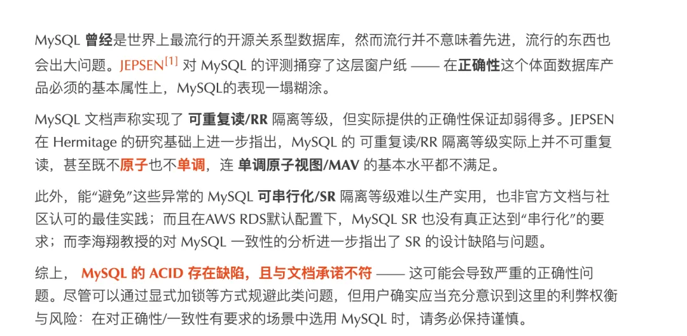

7 月 21 日，[阿里巴巴的 FastJSON 发布了一份安全公告](https://github.com/alibaba/fastjson2/wiki/Security-Advisory%3A-Remote-Code-Execution-in-fastjson-1.2.68%E2%80%931.2.83)：`CVE-2026-16723`，CNA 评分 9.0，影响 1.2.68 至 1.2.83。

公告写得很扎实。漏洞怎么进来的、在什么条件下触发、为什么指定目标类型也未必安全，全都讲清楚了。末了还专门辟出一节，逐条解释 `fastjson2` 为什么不受影响：没有同样的资源探测路径，白名单优先，
`AutoType` 默认关闭且已经废弃。最后一句尤其让人安心——`fastjson2` 用户无需针对此漏洞采取任何行动。


六天后，[`fastjson2` 的另一起 `AutoType` 绕过](https://mp.weixin.qq.com/s/LJaul1jNjK9pXRAkoUiMEA)被公开。7 月 29 日，[项目发布 2.0.63](https://github.com/alibaba/fastjson2/releases/tag/2.0.63)，补上类型名校验、白名单哈希回验和危险基类放行规则。

这不是前一份公告撒了谎。两个问题的根因确实不同，`fastjson2` 到今天也仍然不受 `CVE-2026-16723` 影响。只是这个节奏，多少有点像个隐喻：
消防队刚刚认真论证完新楼不会沿着旧楼的烟道着火，六天以后，新楼从配电箱烧起来了。专业上完全是两回事，新闻上还是那句话——又着了。


把日历再往前翻到 2019 年，七年、三个洞、两套代码，直接成因各不相同，姿势却颇有家学渊源。每次 FastJSON 出事，评论区都会冒出同一个问题：不就是个 JSON 库吗？
序列化、反序列化能有多少花样，怎么十年过去还在爆，动不动就是远程代码执行？

问得很好。答案跟 JSON 没什么关系，跟阿里的关系也没有大家以为的那么简单，但跟“糙猛快”的关系，比很多人愿意承认的更大。

---

## 太长不看

- 让外部数据决定程序加载哪个类，是一整代 Java 和 .NET 框架共同犯过的错。FastJSON 不是发明者，Java 原生序列化、Jackson 和 `BinaryFormatter` 的账单都不比它轻。

- 真正分出高下的，从来不是谁没犯过错，而是犯错以后，有没有给危险能力安排一条退出路线。Jackson 换了入口，微软把实现从运行时里拿掉，Java 给炸药柜配了把锁，
  FastJSON 做出了 `SafeMode`，然后把它长期留成一个默认不开的选项。

- 单看每个漏洞，直接原因都不一样；但同一类安全边界问题能够跨过七年、跨过一次大规模重写，又以相似的形状回来，答案就不在某一个 `if` 里了。

- 糙猛快不是一种编程风格，而是一套会计制度：收益今天入账，风险以后挂账。它最危险的地方也不只是糙，而是它真的赢过；失败的权宜之计叫教训，成功的权宜之计叫经验。

- AI 这一轮没有消灭这套制度，只是给它加了杠杆，并且顺手拆掉了人类写代码这道限速器。

---

## 一、这不是 JSON，是控制权

先说 `AutoType` 到底干了什么。假设输入里有这么一段：

```json
{"@type": "com.foo.Bar"}
```

程序看到以后，真的去加载 `com.foo.Bar`，创建实例，再按照输入内容往里面填字段。这个功能当然很方便：调用者不必提前知道数据的具体类型，也不用为每一种对象手写映射，
多态对象树“啪”一下就还原出来了，接口看上去近乎魔法。

问题在于，它悄悄回答了一个不该由数据回答的问题。普通反序列化回答的是“这些数据应该怎样填进对象”；`AutoType` 回答的却是“程序应该创建什么对象”。前一个问题还在数据平面，
后一个已经碰到了控制平面。当输入来自不可信的一方，事情就不再是“帮我解析一段 JSON”，而变成了“请陌生人参与决定我的程序应该加载哪段代码”。

剩下十年的安全故事，基本都是这句话的注脚。


不过，这种病并不是阿里发明的。Java 原生的 `ObjectInputStream` 早就允许输入流决定创建哪些对象，JDK 9 后来通过 [`JEP 290`](https://openjdk.org/jeps/290) 加入反序列化过滤器，
Java 17 又用 [`JEP 415`](https://openjdk.org/jeps/415) 补上按上下文选择过滤策略的机制。Jackson 的默认多态反序列化犯过同一类错，.NET 的 `BinaryFormatter` 也一样。

所以，把这件事概括成“阿里搞了个烂 JSON 库”，实在太便宜了。全行业都做错过，很多人甚至错得更早、更系统。FastJSON 真正特殊的地方，不在于它发明了危险的动态类型能力，
而在于它把“简单易用”和“尽可能快”做到了极致。温绍锦在 [2019 年的访谈](https://gitee.com/gitee-stars/18)里列举 FastJSON 的优势，前两项就是高性能、简单易用；这也很符合那个年代的互联网审美：接口最好像魔法，
性能榜单最好像军功章，框架替用户多做一点判断，调用者就可以少写一点代码。至于这些判断把什么权力交给了输入方，可以先包几层检查，实在不行，再让安全研究员来写续集。

糙猛快第一次出场时，从来不会表现成“程序员故意写了一个漏洞”。没有人会在需求单上写“本周目标：引入一处九分 RCE”。它总是以更自然、更体面，也更难反驳的方式出现：先让功能好用，先让性能领先，
先兼容已有用户；安全边界可以多包几层，退出方案以后再说。

每一条单独拿出来都很合理。十年以后一起结账，就不那么合理了。

---

## 二、同一道题，四份答卷

行业都犯过错，有意思的是后来怎么处理。

### Jackson：换入口

Jackson 早期同样靠黑名单阻止危险类型，补一个 gadget，研究人员就再找一个，安全公告逐渐写出了连续剧的气质。[2019 年发布的 Jackson 2.10](https://github.com/FasterXML/jackson/wiki/Jackson-Release-2.10) 明确承认，
黑名单路线已经不足以解决问题，于是引入 `PolymorphicTypeValidator`，并让旧的默认类型入口进入废弃流程。

新的 API 并不要求所有人逐个填写完整类名，它可以按基类、包名或自定义逻辑进行判断；但调用者必须显式给出一套验证规则。责任由此重新摆正：你想让输入参与选择类型，可以，请先说明哪些类型能够被选择。

### Java：给炸药柜加锁

Java 自己的答卷没有这么彻底。JEP 290 提供进程级和流级过滤器，可以限制允许反序列化的类、对象深度、引用数量和数组大小；JEP 415 又让应用能够根据调用上下文选择不同策略。
这当然比什么都不做强得多，但危险能力本身还在那里，过滤规则需要有人配置、有人维护、有人记得它存在。

Java 的选择不是拆掉炸药，而是给炸药柜配了一把不错的锁，然后把钥匙管理写进部署文档。

### 微软：拆掉实现

微软走得最狠。从 [`.NET 5`](https://learn.microsoft.com/en-us/dotnet/core/compatibility/serialization/5.0/binaryformatter-serialization-obsolete) 开始，`BinaryFormatter` 进入明确的退役流程；[`.NET 7`](https://learn.microsoft.com/en-us/dotnet/core/compatibility/serialization/7.0/binaryformatter-apis-produce-errors) 把相关调用提升为编译错误，[`.NET 8`](https://learn.microsoft.com/en-us/dotnet/core/compatibility/serialization/8.0/binaryformatter-disabled) 在绝大多数项目类型里默认让它运行时报错，
到了 [`.NET 9`](https://learn.microsoft.com/en-us/dotnet/standard/serialization/binaryformatter-migration-guide/)，实现直接从运行时中移除。你再怎么拨兼容开关，它也只会抛异常。实在离不开的，可以单独安装一个明确标注“不受支持”的兼容包，其中连原有漏洞和风险也一并保留。
[微软的迁移文档](https://learn.microsoft.com/en-us/dotnet/standard/serialization/binaryformatter-migration-guide/)把这件事说得很明白：你当然有权继续用，但平台不再替你假装这是一个安全选择。

### FastJSON：留一个开关

FastJSON 其实也做出了真正的解法。[1.2.68 引入 `SafeMode`](https://github.com/alibaba/fastjson/wiki/fastjson_safemode)，开启以后，无论黑名单、白名单和其他开关怎么配置，所有 `AutoType` 一律拒绝。
对于 `CVE-2026-16723`，官方公告也明确说明，`SafeMode=true` 能在漏洞路径到达之前截断所有 `@type`。

问题是，在受影响版本的原始默认配置里，`AutoType` 是关闭的，`SafeMode` 同样是关闭的。前一个配置告诉用户“危险功能没有打开”，后一个配置才真正保证那条类型解析路径不会被碰到。

维护者的难处是真的。把 `SafeMode` 直接设成默认，大量依赖旧行为的应用升级后会立刻报错；FastJSON 又只是第三方库，不像微软那样控制运行时、编译器、SDK 和发布渠道，
没法强迫旧用户迁移。这些约束都成立，但约束不是免罪符。不能立刻删除，可以废弃；不能马上改默认，可以提供迁移工具；不能今天断掉，可以宣布一个终止日期。

兼容性允许债务展期，不应该允许债务取消到期日。一个危险功能进入系统时说“先兼容一下”，十年后还在说“再兼容一下”，那就不再是权宜之计了。

那叫宪法。

---

## 三、法医报告，不是病理学

2019 年到 2026 年的三个洞，成因各不相同，姿势却颇有家学渊源。

[2019 年那次著名的绕过](https://paper.vulsee.com/KCon/2022/Hacking%20JSON%E3%80%90KCon2022%E3%80%91.pdf)走的是类缓存。攻击者先借 `java.lang.Class` 等路径，让某个危险类进入 `TypeUtils` 的全局映射；之后再次提交同一个类型名，
程序直接从缓存里拿出已经解析过的类，`checkAutoType` 那道门根本没有重新打开。在 1.2.25 至 1.2.32 的版本窗口里，这条路甚至只在 `AutoType` 关闭时成立；
1.2.33 至 1.2.47，则开关两边都可能受影响。

这里最值得注意的不是某个具体 gadget，而是安全模型的优先级。正常路径需要检查，缓存命中意味着“以前见过”，于是可以快一点、信任一点。可缓存只能证明程序见过这个名字，并不能证明这个名字安全。
安全大门没有被撞开，人家走的是员工通道。

[`CVE-2026-16723`](https://github.com/alibaba/fastjson2/wiki/Security-Advisory%3A-Remote-Code-Execution-in-fastjson-1.2.68%E2%80%931.2.83) 更有戏剧性。这一次，问题不在安全检查被绕过，而在安全检查本身。`checkAutoType` 为了判断输入类型，会拿用户可控的字符串做资源探测；
在 Spring Boot 可执行 fat-jar 的类加载环境里，经过构造的类型名可以把探测引向嵌套 URL，最终走到远程加载。守门人没有睡着，他非常认真地检查了证件，然后根据证件上的地址，
亲自替客人取了一件东西回来。

在 1.2.68 至 1.2.83、`AutoType` 关闭而 `SafeMode` 未开启、并以 Spring Boot executable fat-jar 运行的条件下，
这个漏洞可以在原始默认配置中触发，不要求显式打开 `AutoType`，也不依赖传统 classpath gadget。指定目标 DTO 同样不是可靠缓解，
因为 DTO 中只要存在 `Object` 或 `Map` 一类宽类型字段，载荷仍然可能进入相关路径。

这里最扎心的地方在于，用户做的恰恰是通常被认为正确的事：没有打开 `AutoType`，还指定了目标类型。安全开关不是一块写着“关闭”的牌子，它是另一套代码路径；
如果这条路径没有得到和主功能同样严格的设计、测试和审计，“关闭”就只是 UI 文案。

六天以后，轮到 `fastjson2`。这次问题出在 `AutoType` 未启用时的白名单校验：代码使用增量 FNV-1a 哈希快速匹配允许规则，哈希命中以后，却没有重新比较实际文本。哈希适合做索引，
不适合当身份证；攻击者也不会老老实实等待随机碰撞，而会专门构造能够命中允许值的输入。白名单问了一个人的身份证号，听见号码对上，就没有再抬头看脸。

[2.0.63 的修复内容](https://github.com/alibaba/fastjson2/releases/tag/2.0.63)，本身就是对旧安全模型最简洁的判决书：包含 URL 特殊字符的类型名，在到达类加载器之前直接拒绝；白名单哈希命中以后，必须回头比较真实文本；
包名前缀形式的 `accept` 规则，也不能再顺手覆盖 `ClassLoader`、`DataSource`、`RowSet` 等危险基类，除非用户明确写出完整类名。
同样的加固随后回移到了 FastJSON 1.2.84。

注意最后一条，它跟省不省几个 CPU 周期没有直接关系。用户允许了一个业务包前缀，结果规则画得太宽，顺手把危险基类也罩了进去。这是威胁模型本身画歪了。

三个洞不是同一个 Bug，甚至不属于同一种实现错误，但它们的形状十分相似：缓存路径觉得自己可以少检查一次，资源探测发生在“检查是否安全”的函数里，白名单认为哈希命中已经足够，
前缀规则又把使用方便放在了边界精确之前。主功能是正经设计出来的，安全机制则像后来围着大楼搭上的脚手架——每次都搭了，只是总有一块没有铺到。

---

说到这里，一定会有人反驳：这些洞又不全是为了省几个纳秒。资源探测、前缀白名单、默认开关和兼容性问题，有的跟性能有关，有的跟易用性有关，有的就是普通实现错误，凭什么统统归到“糙猛快”头上？

这个反驳在技术上完全成立。也正因为它太成立，所以错过了真正的问题。如果“根因”只指某个 CVE 最后落到哪一行代码，那么答案当然分别是缓存路径、资源加载、哈希回验和类型规则。那是法医报告，不是病理学。

一支车队十年里不断出事，每次直接原因都不同：这次刹车管裂了，下次轮胎磨穿了，再下次是司机连续工作二十个小时。你当然可以坚持说三起事故根因不同，材料不同、部件不同、驾驶员也不同；
但如果这支车队长期不做完整保养，按出车次数发奖金，车辆停一天就算损失，而事故成本由保险公司、乘客和下一任经理承担，那么真正的根因显然不在某一根刹车管里，而在那套经营方式里。

FastJSON 也一样。不是每个漏洞都源于某次 benchmark，但为什么危险的自动类型能力会被做得如此方便，为什么正常解析和性能捷径构成主路径，安全检查却长期像补丁层，
为什么 `SafeMode` 有了却成不了默认，为什么黑名单可以一版版补而退出日期始终排不上日程，为什么一个站在高风险解析边界、被广泛部署的基础库，长期依赖维护者从其他工作里挤时间——这些问题的答案，
是同一套优先级。

这里的“糙”，不是代码长得难看，而是先把能跑的部分做出来，完整威胁模型、边界条件、安全默认和退出计划以后再补；“猛”，不只是执行力强，而是用足够大的规模和足够快的增长，
把未经充分验证的设计直接变成既成事实，等用户足够多以后，兼容性就会倒过来替旧设计背书；至于“快”，也不只是每秒多解析几兆，而是所有收益都在今天入账，所有风险都在未来挂账。

功能上线算成绩，性能领先算成绩，升级不报错算成绩。至于某个理论上可能发生的安全事故，在真正发生以前，既不算成本，也不算任何人的贡献。所以，糙猛快不是说程序员敲键盘敲得快，
而是一套把近期可见收益放在首位、把长期不可见风险不断往后推的会计制度。

技术债于是完成了一次很漂亮的金融创新：本金不再需要偿还，只要后来者永远付得起利息。

---

## 四、它真的赢过

很多人以为糙猛快的问题在“糙”，其实不完全是。它真正危险的地方，是它很可能有效。

2010 年前后的互联网，硬件比今天贵，市场窗口比今天窄，用户增长又比工程制度跑得快。一个库性能领先几十个百分点、部署简单一半，真的可能决定它有没有机会进入主流。在那样的约束下，
先拿正确性、安全性或可维护性换一点速度，不必然是愚蠢决定，甚至可能是当时最合理的决定。

真正的问题发生在成功以后。一个失败的权宜之计，会被叫作教训；一个成功的权宜之计，会被叫作经验。组织又有一种非常朴素的归因本能：我们当年做过这些事，我们后来赢了，所以我们就是因为这些事才赢的。
市场、时机、运气、人口红利、资本环境和竞争对手的失误，最后都会被压缩成一句非常好传授的话：

> 当年我们就是这么干过来的。

一句描述于是变成处方，处方变成方法论，方法论进入绩效制度，绩效制度再把它喂进每个人的肌肉记忆。“先跑起来，出事再补”最初也许只是某个项目的应急策略，等它被一个成功组织证明过，
就会变成一套可以复制到任何地方的工程常识。

数据库世界里，MySQL 是一张更大的账单。[Jepsen 对 MySQL 8.0.34 的测试](https://jepsen.io/analyses/mysql-8.0.34)显示，默认的 `Repeatable Read` 会出现丢失更新、内部一致性违例和非单调视图；
它不满足 PL-2.99 的可重复读，也不满足快照隔离，实际语义只是比 `Read Committed` 强一些，却又很难用一个现成的一致性模型说清楚。
我在[《MySQL 正确性竟如此垃圾？》](/db/bad-mysql/)里专门掰开讲过这笔账。



单机扛不住，于是有了分库分表中间件，Cobar、TDDL、DRDS、MyCat，一个生态。分库分表把事务砍了，本来数据库白送的 ACID 没了，于是要补分布式事务，GTS、Seata，又一个生态。
复杂度上去了，中间件运维、数据倾斜、跨库 JOIN、全局唯一 ID、扩容搬迁，每一样都长出了专门的岗位。最后干脆自研分布式数据库，OceanBase、PolarDB。

这是一条清晰的路径依赖链，当时糙猛快的路径依赖被一路继承下去，沉没成本大到只能一路走到黑。

---

## 五、谁签字，谁升职，谁还债

糙猛快能够代代相传，不是因为哪家公司的墙上写着“正确性不重要”。恰恰相反，墙上通常写的是客户第一、长期主义、拥抱变化、追求卓越。墙上的字都很好，问题是，真正训练组织行为的从来不是墙，而是考核。

逼人跳过完整测试的，通常不是某位工程师突然失去了职业道德，而是这个季度必须上线；逼人复制一个“先能跑再说”的方案，也不是大家不知道它有问题，而是需求池已经排到了明年。新增功能有发布日期，安全债没有；
上线能写进周报，一次没有发生的事故不能。维护一个基础库三年不出事，很难讲成晋升故事；三个月从零到一做出一套新系统，标题已经替你写好了。

2019 年，FastJSON 作者温绍锦在[一次公开访谈](https://gitee.com/gitee-stars/18)中说，FastJSON 和 Druid “都是业余维护的，精力不够”，同时维护两个项目时，一个多花时间，另一个就会少花时间。同一篇访谈里，
他也提到阿里的一些关键开源项目已经有组织保障和资源投入，所以这段话不能被偷换成“阿里从来不为开源花钱”。它真正指向的是一个更具体的问题：
像 FastJSON 这样站在高风险解析边界、又被大规模部署的基础组件，它得到的长期治理资源，究竟有没有与影响面相匹配？


这不是维护者个人能力的罪证，恰恰相反，它说明维护者承担了远超正常范围的责任。真正荒谬的是，一个被大量生产系统依赖的基础组件，它的安全响应能力，长期可能取决于某个人今晚还有没有精力。

开源当然不等于企业有义务包养所有项目，但依赖规模、故障半径和维护资源之间，至少应该存在一点关系。不能平时把开源组件当公共基础设施使用，出了事以后又突然想起，它原来只是某个人下班以后写的。

糙猛快把收益私有化，把维护社会化。做出功能的人拿走项目成绩，节省成本的人拿走利润，没有出事的年份看起来什么也没发生；等真正出事，账单交给安全团队、运维团队、下游用户，
以及那个凌晨三点接到告警、此前甚至没听过 FastJSON 的人。

欠债人和还债人不是同一个，这正是技术债比金融债更好借的地方。银行至少会问你是谁，代码不会。

---

## 六、这是选择，不是命

每次讨论软件工程化，总会有人准时出现：你不能拿造飞机的标准要求普通互联网服务。

这话当然对。一个营销活动页和飞控系统，风险等级完全不同，把所有 CRUD 都按航空软件认证做一遍，成本荒唐，也没有必要。但这不等于互联网只能在“造飞机”和“随便写写”之间二选一。
航空、医疗、汽车和铁路软件真正值得借鉴的，不是把所有项目拖进同一套繁文缛节，而是先根据故障后果确定保证等级，再让需求、实现、验证和责任与风险相匹配。

互联网当然也有自己的工程化。灰度发布、自动回滚、可观测性、SRE、故障演练和混沌工程，都是很成熟的答案。它只是过度学会了一件事：出问题以后，怎样恢复得更快；
然后顺手忘记了另一件事——有些问题不应该先允许它发生。

页面样式错了可以回滚，推荐算法差了可以重新训练。解析器允许不可信输入影响类加载，就不能只靠“十分钟内恢复”来安慰自己。至少有四条红线，不应该在用户不知情的时候被悄悄打折：

1. 文档承诺的保证必须和真实行为一致。文档写的是白名单，代码里就不能只有哈希命中，因为用户是照着“白名单”三个字建立威胁模型的，不是照着维护者脑子里的隐含前提。

2. 不可信输入不能无约束地进入控制平面。外部字符串一旦能决定加载哪个类、调用哪个工具、读取哪份数据，后面的黑名单和过滤器通常只是在计算事故什么时候发生。

3. 安全机制必须失效关闭。配置写错、规则漏写、缓存命中或者验证异常时，正确结果应该是拒绝；一个名义上“关闭危险功能”的分支，同样需要得到最严格的设计和审计，不能因为名字里写了“关闭”就自动获得信任。

4. 关键依赖必须有负责人、响应机制和退出路线。连“停止维护”都应该说清楚：是停止新增功能、停止日常修复，还是连灾难级漏洞都不再响应；谁通知下游、替代方案是什么、最后一个安全版本维护多久，
   都不该等事故发生以后临时决定。

有人会说，美国大厂不也一样，Log4Shell 不也炸得满世界都是？当然。关键从来不是谁的国籍能让软件免疫 Bug，而是事故发生以后，除了 CVE、通告和复盘，还留下了什么。

Log4j 事件之后，美国的 [Cyber Safety Review Board](https://www.cisa.gov/sites/default/files/2023-02/CSRB-Report-on-Log4j-PublicReport-July-11-2022-508-Compliant.pdf) 把它作为首份正式审查报告的主题；
OpenSSF 随后提出一份预计两年需要约 1.5 亿美元的[开源安全动员计划](https://www.linuxfoundation.org/press/press-release/linux-foundation-openssf-gather-industry-government-leaders-open-source-software-security-summit)，并获得首批超过 3000 万美元的资金承诺；
[Alpha-Omega](https://alpha-omega.dev/resources/reports/) 则直接为关键项目提供维护者资助和专家分析。这里真正值得看的不是美元数字，而是事故除了生成一份复盘，还可以生成预算、岗位和长期项目。

这些机制当然不神圣，也会倒退。2026 年 1 月，美国 OMB 发布 [M-26-05](https://www.whitehouse.gov/wp-content/uploads/2026/01/M-26-05-Adopting-a-Risk-based-Approach-to-Software-and-Hardware-Security.pdf)，撤销了此前较统一的软件安全自证政策，改成由各机构按照自身风险制定保障要求，
原来的自证表和 SBOM 要求也退回成了可选工具。制度可以因为事故建立，也会因为政治和成本重新收缩。

国内也不是没有制度。2021 年生效的[《网络产品安全漏洞管理规定》](https://www.cac.gov.cn/2021-07/13/c_1627761607640342.htm)，已经明确了漏洞报告、修补和用户通知义务；2024 年又有 [GB/T 43698—2024《网络安全技术 软件供应链安全要求》](https://std.samr.gov.cn/gb/search/gbDetailed?id=173829859D2E1AA5E06397BE0A0AA311)和 [GB/T 43848—2024《网络安全技术 软件产品开源代码安全评价方法》](https://std.samr.gov.cn/gb/search/gbDetailed?id=173829859DA71AA5E06397BE0A0AA311)。所以，差距不是“一边有制度，一边什么都没有”。更具体的差距，是谁能把关键依赖的风险，从报告义务和评价标准，真正变成长期预算、专职岗位和可执行的退出机制。

这边不是没有文件，缺的是把依赖清单上的名字，变成预算表上的岗位。

如果一场事故最后只留下三样东西：一个补丁、一篇复盘、一句“以后加强安全意识”，那它大概率还会再来。意识没有编制，价值观没有预算，而风险最擅长寻找没人负责的地方。

---

## 七、这一轮，枪不要钱了

同一类边界问题，正在 AI Agent 上重新出现。`AutoType` 的风险在于，外部输入里的类型信息可能影响程序加载哪个类；Prompt Injection 的风险在于，
外部内容里的文字可能被模型当成指令，继而影响工具调用、数据访问和系统行为。两者并不相同，但都在模糊数据平面与控制平面之间的边界。

而且这一轮更麻烦。`AutoType` 是一个可以关闭、废弃，甚至从运行时整个删掉的功能；Prompt Injection 不是。对今天的语言模型来说，指令和数据最终都以自然语言进入上下文，
没有一个简单开关能够保证模型永远分得清“这是系统命令”和“这只是网页里的一段话”。OpenAI 也把它称为一个仍在演化的[前沿安全问题](https://openai.com/index/prompt-injections/)，现实中的防守思路不是相信模型绝不会受骗，
而是假设它迟早可能受骗，再用最小权限、数据隔离、沙箱、操作确认和确定性的授权边界限制后果。

模型层没有万能的 `SafeMode`，系统层必须有。

可现实中的部署节奏大家也很熟悉：先接生产库，先把 MCP Server 连上，先给写权限，不然演示不够震撼；等跑起来以后，再考虑权限是不是应该收一收。过去的糙猛快至少还有一道天然刹车，叫难度。
写一个数据库、消息队列或者存储引擎本身很难，而困难不只挡住许多人，也教育了剩下的人。你得花几年读论文、理解一致性、处理崩溃恢复，踩完并发、持久化和兼容性的坑，才能造出一个勉强像样的东西。产物可以很糙，
但那几年本身是一笔学费，也是一场资格审查。

现在这道筛子正在消失。我有朋友真的用 Codex 花两周搓出三个 Rust 重写版的 Kafka、Neo4j 和 DuckDB，并把它们上线。它们会有 API，有 README，有漂亮的架构图，
有 benchmark，甚至会有一篇解释为什么自己比原版更简单、更现代、更适合 AI 时代的宣言。

问题不只在于它们可能是三个玩具。更麻烦的是，造玩具的人已经不再具备判断它是不是玩具的能力。以前，一个人不知道某个系统有多难，通常也做不出一个看起来像样的版本；现在，不知道已经不妨碍它看起来很像。

于是画面变成了这样：一群拿着机关枪的大猩猩，兴高采烈地四处扫射。倒也不能全怪猩猩，融资要求两周做出 MVP，产品要求下周上线，销售今晚就要一个能演示的版本，模型只不过把这台机器的马力放大了一百倍。
弹药近乎免费，扳机极其好扣；至于枪口朝哪、什么时候应该停手，以及扫射结束以后谁来修墙，这些知识并没有随着代码生成能力一起免费附赠。


AI 带来的还不只是速度，还有传播。过去，一段坏代码的传播需要人：有人从旧项目复制到新项目，有人从博客抄进生产环境，有人从 Stack Overflow 那条 2013 年的高赞回答里复制一段早已过时的做法。
传播虽然稳定，多少还有点摩擦。

现在，这些代码、文章、问答和默认用法进入训练数据、检索结果和提示词上下文，再被模型平静地吐出来。昨天的坏习惯和今天的最佳实践，语气一样笃定。模型不会在代码旁边注明：
“这一段来自十一年前某个赶季度目标的人，他当时只打算临时用一下。”它只会说：“下面是一种简洁高效的实现方式。”

糙猛快于是获得了以前没有的东西：统一的语气、无限的耐心，以及接近于零的复制成本。

当然，AI 也可以站在另一边。模糊测试、属性测试、依赖审计、历史 CVE 回归和边界条件生成，这些枯燥又需要耐心的工作，确实会因为模型而便宜许多。但便宜不等于自动发生。代码生成成本下降以后，
团队可以把省下来的时间投入验证，也可以用来再生成三个新系统；这笔预算最后流向哪一边，仍然由绩效制度和截止日期决定。

所以，AI 没有消灭糙猛快的根因。它只是消灭了糙猛快原先最大的瓶颈：人类写代码的速度。

---

## 尾声

2010 年，“快”是一种稀缺资源。硬件贵，窗口短，竞争激烈，为了性能和交付速度欠一点债，也许完全划算。

但稀缺是会变化的。今天，生成代码越来越便宜，搭一套能跑的系统越来越便宜，JSON 再快几十个百分点当然仍有价值，却很难像十五年前那样决定一场战争。真正昂贵的东西换了：有人真正理解这个系统，很贵；
有人愿意维护它十年，很贵；有人知道哪些行为不能兼容，很贵；有人敢在截止日期前说“这个东西现在不能上”，更贵。至于出了事以后，有一个能签字、能解释、能承担后果的人，市面上几乎没有现货。

糙猛快的问题从来不是不能借债。工程本来就是约束下的交易，没有人能把每一行代码都一步到位。真正的问题是，它习惯使用后来者的信用卡。

当年拍板“先上再说”的人，多半已经升职，或者去了下一家公司，简历上写着“主导某系统从零到一”。这句话完全真实，他确实负责了从零到一。至于从一到十、从十到一百，以及凌晨三点从一百抢救回零点八的那一段，
是别人的项目。

账单最终会交给今晚被告警叫醒的人，交给接手十万行代码却找不到原作者的人，交给明明没有做错任何决定、却要坐在会议室里写事故复盘的人。

一代工程师替上一代还债，本身不算悲剧，工程就是接力。真正让人不甘心的是：债还完了，那套借债的方法还在，而且因为它曾经赢过，被郑重其事地包装成经验，交给了下一棒。

赢过一次，权宜就会变成经验；经验进入流程，流程进入肌肉，肌肉再进入训练集。以前，屎山主要靠师徒制和复制粘贴传播；现在，它终于去掉了人这个单点瓶颈。

这大概是糙猛快完成过的，最漂亮的一次性能优化。

> 本文 AI 含量：Opus 40%，ChatGPT 30%。
