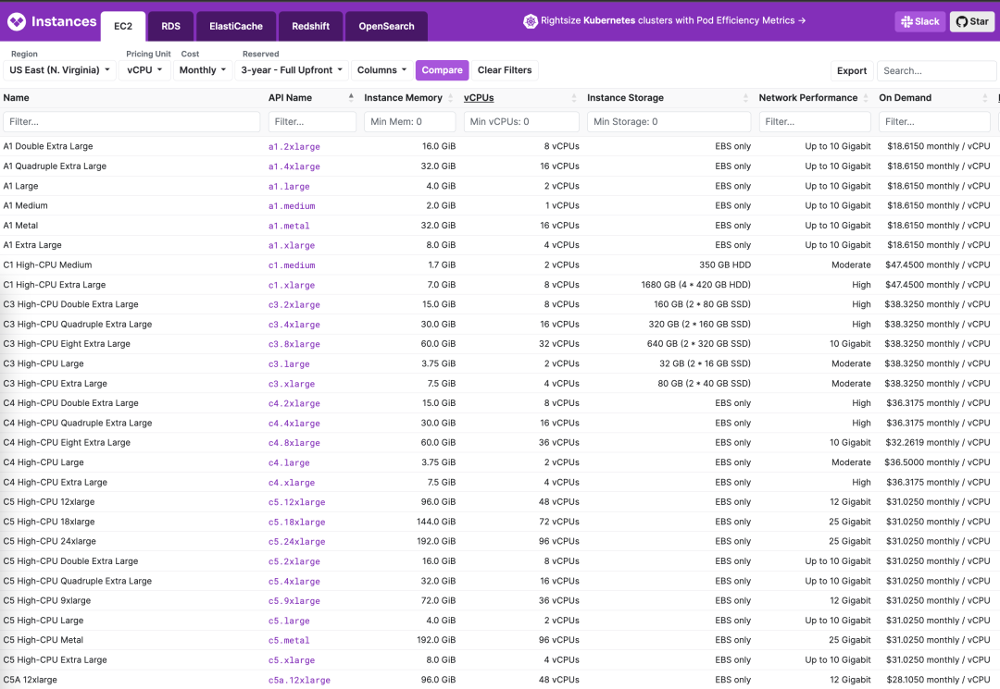
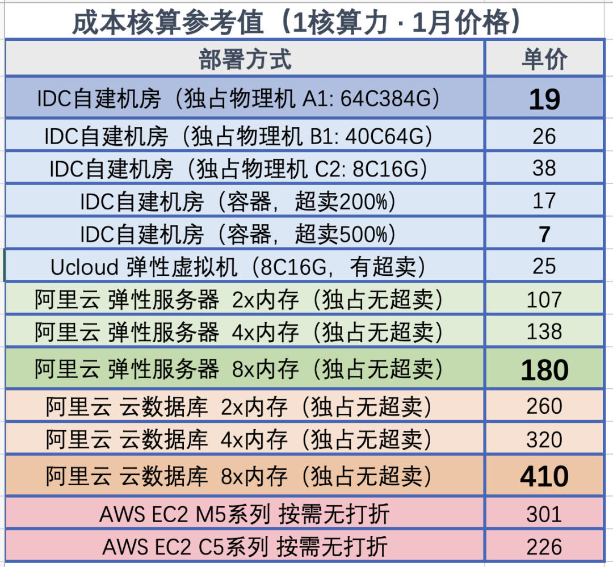
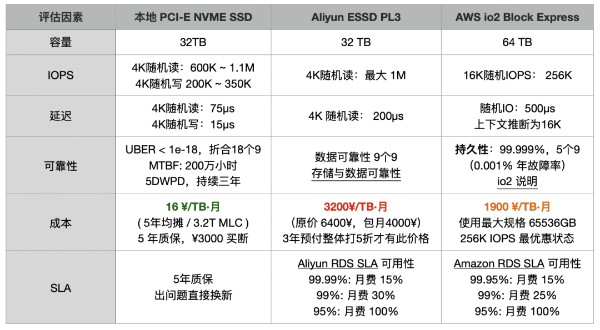
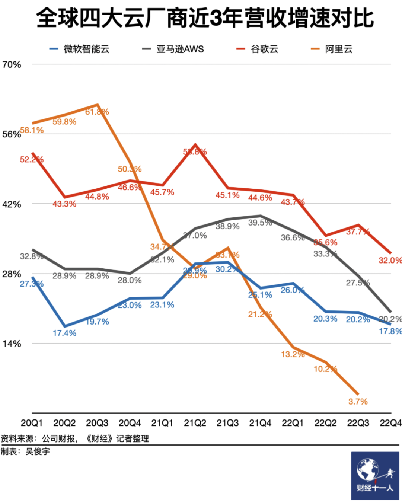
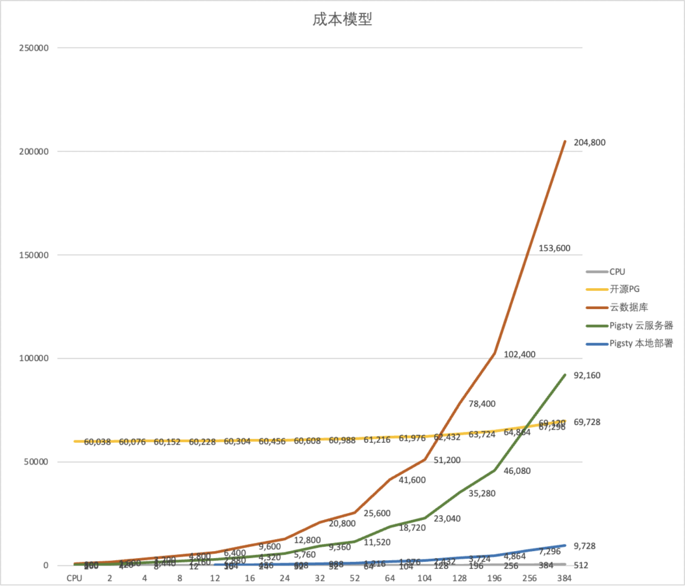

At the SACC 2023 FinOps session, I fiercely criticized cloud vendors. This is a transcript of my speech, introducing the ultimate FinOps concept — **cloud-exit** and its best practice.

-----------------

## TL; DR

**Misaligned FinOps Focus**: **Total Cost = Unit Price x Quantity**. FinOps efforts are centered around reducing the **quantity** of wasted resources, deliberately ignoring the elephant in the room — **cloud resource unit price**.

**Public Cloud as a Slaughterhouse**: Attract customers with cheap EC2/S3, then slaughter them with EBS/RDS. The cost of cloud compute is five times that of in-house, while block storage costs can be over a hundred times more, making it the ultimate cost assassin.

**The Endgame of FinOps is Going Off-Cloud**: For enterprises of a certain scale, the cost of in-house IDC is around 10% of the list price of cloud services. Going off-cloud is both the endgame of orthodox FinOps and the starting point of true FinOps.

**In-house Capabilities Determine Bargaining Power**: Users with in-house capabilities can negotiate extremely low discounts even without going off-cloud, while companies without in-house capabilities can only pay a high "no-expert tax" to public cloud vendors.

**Databases are Key to In-House Transition**: Migrating stateless applications on K8S and data warehouses is relatively easy. The real challenge is building databases in-house without compromising **quality and security**.

-----------------

## Misaligned FinOps Focus

> Compared to the amount of waste, the unit price of resources is the key point.

The FinOps Foundation states that FinOps focuses on "**cloud cost optimization**". However, we believe that emphasizing only **public clouds** deliberately narrows this concept — the focus should be on the cost control and optimization of **all** resources, not just those on public clouds — including "hybrid clouds" and "private clouds". Even without using public clouds, some FinOps methodologies can still be applied to the entire K8S cloud-native ecosystem. Because of this, many involved in FinOps are led astray — their focus is limited to **reducing the quantity of cloud resource waste**, neglecting a very important issue: **unit price**.

**Total cost** depends on two factors: **Quantity ✖️ Unit Price**. Compared to quantity, **unit price might be the key to cost reduction and efficiency improvement**. Previous speakers mentioned that about 1/3 of cloud resources are wasted on average, which is the optimization space for FinOps. However, if you use non-elastic services on public clouds, the **unit price of the resources** you use is already several to dozens of times higher, making the wasted portion negligible in comparison.

In the first stop of my career, I experienced a FinOps movement firsthand. Our BU was among the first internal users of Alibaba Cloud and also where the "**data middle platform**" concept originated. Alibaba Cloud sent over a dozen engineers to help us migrate to the cloud. After migrating to ODPS, our annual storage and computing costs were **70 million**, and through FinOps methods like health scoring, we did optimize and save tens of millions. However, running the same services with an in-house Hadoop suite in our data center cost **less than 10 million annually** — **savings are good, but they're nothing compared to the multiplied resource costs**.

As cost reduction and efficiency become the main theme, cloud repatriation is becoming a trend. Alibaba, the inventor of the middle platform concept, has already started dismantling its own middle platform. Yet, many companies are still falling into the trap of the slaughterhouse, repeating the old path of cloud migration - cloud repatriation.

-----------------

## Public Clouds: A Slaughterhouse in Disguise

> Attract customers with cheap EC2/S3, then slaughter them with EBS/RDS pricing.

The elasticity touted by public clouds is designed for their business model: **low startup costs, exorbitant maintenance costs**. Low initial costs lure users onto the cloud, and its good elasticity can adapt to business growth at any time. However, once the business stabilizes, vendor lock-in occurs, making it difficult to switch providers without incurring high costs, turning maintenance into a financial nightmare for users. This model is colloquially known as a [**pig slaughterhouse**](/cloud/ebs/).

**To slaughter pigs, one must first raise them**. You can't catch a wolf without putting your child at risk. Hence, for new users, startups, and small businesses, public clouds offer sweet deals, even at a loss, to make noise and attract business. New users get first-time discounts, startups receive free or half-price credits, and there's a sophisticated pricing strategy. Taking AWS RDS pricing as an example, the mini models with 1 or 2 cores are priced at just **a few dollars per core per month**, translating to a few hundred yuan per year (excluding storage). This is an affordable option for those needing a low-usage database for small data storage.

However, even a slight increase in configuration leads to a **magnitude** increase in the price per core month, skyrocketing to twenty or thirty to a hundred dollars, sometimes even more — not to mention the shocking EBS prices. Users may only realize what has happened when they see the exorbitant bill suddenly appearing.

Compared to in-house solutions, **the price of cloud resources is generally several to more than ten times higher, with a rent-to-buy ratio ranging from a few days to several months**. For example, the cost of a physical server core month in an IDC, including all costs for network, electricity, maintenance, and IT staff, is about 19 yuan. Using a K8S container private cloud, the cost of a virtual core month is only 7 yuan.

In contrast, the price per core month for Alibaba Cloud's ECS is a couple of hundred yuan, and for AWS EC2, it's two to three hundred yuan. If you "don't care about elasticity" and prepay for three years, you can usually get a discount of about 50-60%. But no matter how you calculate it, the price difference between cloud computing power and local in-house computing power is there and significant.

The pricing of **cloud storage** resources is even more outrageous. A common 3.2 TB enterprise-grade NVMe SSD, with its formidable performance, reliability, and cost-effectiveness, has a wholesale price of just over **¥3000**, significantly outperforming older storage solutions. However, for the same storage on the cloud, providers dare to charge 100 times the price. Compared to direct hardware procurement, **the cost of AWS EBS io2 is 120 times higher, while Alibaba Cloud's ESSD PL3 is 200 times higher**.

Using a 3.2TB enterprise-grade PCI-E SSD card as a benchmark, **the rent-to-buy ratio on AWS is 15 days, while on Alibaba Cloud it's less than 5 days**, meaning renting for this period allows you to purchase the entire disk outright. If you opt for a three-year prepaid purchase on Alibaba Cloud with the maximum discount of 50%, **the three-year rental fee could buy over 120 similar disks**.

> 《[EBS: a real Scam](/cloud/ebs/)》

The price markup ratio of cloud databases (RDS) falls between that of cloud disks and cloud servers. For example, using RDS for PostgreSQL on AWS, a 64C / 256GB RDS costs $25,817 per month, equivalent to 180,000 yuan per month. One month's rent is enough to purchase two servers with much better performance for in-house use. **The rent-to-buy ratio is not even a month**; renting for just over ten days would be enough to purchase an entire server.

Any rational enterprise user can see the folly in this: **If the procurement of such services is not for short-term, temporary needs, then it definitely qualifies as a significant financial misjudgment.**

| Payment Model                            | Price                | Cost Per Year (¥10k) |
|------------------------------------------|----------------------|----------------------|
| Self-hosted IDC (Single Physical Server) | ¥75k / 5 years       | 1.5                  |
| Self-hosted IDC (2-3 Server HA Cluster)  | ¥150k / 5 years      | 3.0 ~ 4.5            |
| Alibaba Cloud RDS (On-demand)            | ¥87.36/hour          | 76.5                 |
| Alibaba Cloud RDS (Monthly)              | ¥42k / month         | 50                   |
| Alibaba Cloud RDS (Yearly, 15% off)      | ¥425,095 / year      | 42.5                 |
| Alibaba Cloud RDS (3-year, 50% off)      | ¥750,168 / 3 years   | 25                   |
| AWS (On-demand)                          | $25,817 / month      | 217                  |
| AWS (1-year, no upfront)                 | $22,827 / month      | 191.7                |
| AWS (3-year, full upfront)               | $120k + $17.5k/month | 175                  |
| AWS China/Ningxia (On-demand)            | ¥197,489 / month     | 237                  |
| AWS China/Ningxia (1-year, no upfront)   | ¥143,176 / month     | 171                  |
| AWS China/Ningxia (3-year, full upfront) | ¥647k + ¥116k/month  | 160.6                |

Comparing the costs of self-hosting versus using a cloud database:

| Method                                                                                 | Cost Per Year (¥10k) |
|----------------------------------------------------------------------------------------|----------------------|
| Self-hosted Servers 64C / 384G / 3.2TB NVME SSD 660K IOPS (2-3 servers)                | 3.0 ~ 4.5            |
| Alibaba Cloud RDS PG High-Availability pg.x4m.8xlarge.2c, 64C / 256GB / 3.2TB ESSD PL3 | 25 ~ 50              |
| AWS RDS PG High-Availability db.m5.16xlarge, 64C / 256GB / 3.2TB io1 x 80k IOPS        | 160 ~ 217            |

> **RDS** pricing compared to self-hosting, see "[Is Cloud Database an idiot Tax?](/cloud/rds/)"

Any meaningful cost reduction and efficiency increase initiative cannot ignore this issue: if there's potential to slash resource prices by 50% to 200%, then focusing on a 30% reduction in waste is not a priority. As long as your main business is on the cloud, traditional FinOps is like scratching an itch through a boot — **migrating off the cloud is the focal point of FinOps**.

-----------------

## The Endgame of FinOps is Exiting from the Cloud

> The well-fed do not understand the pangs of hunger, human joys and sorrows are not universally shared.

I spent five years at Tantan — a Nordic-style internet startup founded by a Swede. Nordic engineers have a characteristic pragmatism. When it comes to choosing between cloud and on-premise solutions, they are not swayed by hype or marketing but rather make decisions based on quantitative analysis of pros and cons. We meticulously calculated the costs of building our own infrastructure versus using the cloud — the straightforward conclusion was that **the total cost of on-premise solutions (including labor) generally fluctuates between 10% to 100% of the list price for cloud services**.

Thus, from its inception, Tantan chose to build its own infrastructure. Apart from overseas compliance businesses, CDN, and a very small amount of elastic services using public clouds, the main part of our operations was entirely hosted in IDC-managed data centers. Our database was not small, with 13K cores for PostgreSQL and 12K cores for Redis, 4.5 million QPS, and 300TB of unique transactional data. The annual cost for these two parts was less than 10 million yuan: including salaries for two DBAs, one network engineer, network and electricity, managed hosting fees, and hardware amortized over five years. However, for such a scale, if we were to use cloud databases, even with significant discounts, the starting cost would be between 50 to 60 million yuan, not to mention the even more expensive big data sector.

However, digitalization in enterprises is phased, and different companies are at different stages. For many internet companies, they have reached the stage where they are fully engaged with building cloud-native K8S ecosystems. At this stage, focusing on resource utilization, mixed online and offline deployments, and reducing waste are reasonable demands and directions where FinOps should concentrate its efforts. Yet, for the vast majority of enterprises outside the digital realm, the urgent need is not reducing waste but **lowering the unit cost of resources** — Dell servers can be discounted by 50%, IDC virtual machines by 50%, and even cloud services can be heavily discounted. Are these companies still paying the list price, or even facing several times the markup in rebates? **A great many companies are still being severely exploited due to information asymmetry and lack of capability**.

Enterprises should evaluate their scale and stage, assess their business, and weigh the pros and cons accordingly. For small-scale startups, the cloud can indeed save a lot of manpower costs, which is very attractive — **but please be cautious not to be locked in by vendors due to the convenience offered**. If your annual cloud expenditure has already exceeded 1 million yuan, it's time to seriously consider **the benefits of descending from the cloud** — many businesses do not require the elasticity for massive concurrent spikes or training AI models. Paying a premium for temporary/sudden needs or overseas compliance is reasonable, but paying several times to tens of times more for **unnecessary elasticity** is wasteful. You can keep the truly elastic parts of your operations on the public cloud and transfer those parts that do not require elasticity to IDCs. Just by doing this, the cost savings could be astonishing.

**Descending from the cloud is the ultimate goal of traditional FinOps and the starting point of true FinOps.**

-----------------

## Self-Hosting Matters

> "To seek peace through struggle is to preserve peace; to seek peace through compromise is to lose peace."

When the times are favorable, the world joins forces; when fortune fades, even heroes lose their freedom: During the bubble phase, it was easy to disregard spending heavily in the cloud. However, in an economic downturn, cost reduction and efficiency become central themes. An increasing number of companies are realizing that using cloud services is essentially paying a "no-expert tax" and "protection money". Consequently, a trend of "cloud repatriation" has emerged, with 37Signals' DHH being one of the most notable proponents. Correspondingly, the revenue growth rate of major cloud providers worldwide has been experiencing a continuous decline, with Alibaba Cloud's revenue even starting to shrink in the first quarter of 2023.

> 《["Why Cloud Computing Hasn't Yet Hit Its Stride in Earning Profits"](/cloud/profit/)》

The underlying trend is the emergence of **open-source alternatives**, breaking down the **technical barriers** of public clouds; the advent of resource clouds/IDC2.0, offering a cost-effective alternative to public cloud resources; and the release of technical talents from large layoffs, along with the future of AI models, giving every industry the opportunity to possess the expert knowledge and capability required for self-hosting. Combining these trends, **the combination of IDC2.0 + open-source self-hosting is becoming increasingly competitive**: **Bypassing the public cloud intermediaries and working directly with IDCs is clearly a more economical choice**.

Public cloud providers are not incapable of engaging in the business of selling IDC resources profitably. Given their higher level of expertise compared to IDCs, they should, in theory, leverage their technological advantages and economies of scale to offer cheaper resources than IDC self-hosting. However, the harsh reality is that resource clouds can offer users virtual machines at a 80% discount, while public clouds cannot. Even considering the exponential growth law of Moore's Law in the storage and computing industry, public clouds are actually **increasing their prices** every year!

Well-informed major clients, especially those capable of migrating at will, can indeed negotiate for **80% off** the list prices with public clouds, a feat unlikely for smaller clients — in this sense, **clouds are essentially subsidizing large clients by bleeding small and medium-sized clients dry**. **Cloud vendors offer massive discounts to large clients while fleecing small and medium-sized clients and developers**, completely contradicting the original intention and vision of cloud computing.

Clouds lure in users with low initial prices, but once users are deeply locked in, the slaughter begins — the previously discussed discounts and benefits disappear at each renewal. Escaping the cloud entails a significant cost, leaving users in a dilemma between a rock and a hard place, forced to continue paying protection money.

However, for users with the capability to self-host, capable of flexibly moving between multi-cloud and on-premises hybrid clouds, this is not an issue: **The trump card in negotiations is the ability to go off-cloud or migrate to another cloud at any time**. This is more effective than any argument — as the saying goes, "**To seek peace through struggle is to preserve peace; to seek peace through compromise is to lose peace**." **The extent of cost reduction depends on your bargaining power, which in turn depends on your ability to self-host**.

**Self-hosting might seem daunting, but it is not difficult for those who know how**. The key is addressing the core issues of **resources** and **capabilities**. In 2023, due to the emergence of resource clouds and open-source alternatives, these issues have become much simpler than before.

**In terms of resources, IDC and resource clouds have solved the problem adequately**. The aforementioned IDC self-hosting doesn't mean buying land and building data centers from scratch but directly using the hosting services of resource clouds/IDCs — you might only need a network engineer to plan the network, with other maintenance tasks managed by the provider.

If you prefer not to hassle, IDCs can directly sell you virtual machines at 20% of the list price, or you can rent a physical server with 64C/256G for a couple thousand a month; whether renting an entire data center or just a single colocation space, it's all feasible. A retail colocation space with comprehensive services can be settled for about five thousand a year, running a K8S or virtualization on a couple of hundred-core physical servers, why bother with flexible ECS?

-----------------

## FinOps Leads to CLoud-Exit

Building your own infrastructure comes with the added perk of extreme FinOps—utilizing out-of-warranty or even second-hand servers. Servers are typically depreciated over three to five years, yet it's not rare to see them operational for eight to ten years. This contrasts with cloud services, where you're just consuming resources; owning your server translates to tangible assets, making any extended use essentially a gain.

For instance, a new 64-core, 256GB server could cost around \$7,000, but after a year or two, the price for such "electronic waste" drops to merely \$400. 
By replacing the most failure-prone components with brand new enterprise-grade 3.2TB NVMe SSDs (costing \$390), you could secure the entire setup for just $800.

In such scenarios, your vCPU·Month price could plummet to less than $0.15, a figure legendary in the gaming industry, where server costs can dip to mere cents.
With Kubernetes (K8S) orchestration and database high-availability switching, reliability can be assured through parallel operation of multiple such servers, achieving an astonishing cost-efficiency ratio.

In terms of capability, with the emergence of sufficiently robust open-source alternatives, the difficulty of self-hosting has dramatically decreased compared to a few years ago.

For example, Kubernetes/OpenStack/SealOS are open-source alternatives to cloud providers' EC2/ECS/VPS management software; MinIO/Ceph aim to replace S3/OSS; while Pigsty and various database operators serve as open-source substitutes for RDS cloud database management. There's a plethora of open-source software available for effectively utilizing these resources, along with numerous commercial entities offering transparently priced support services.

Your operations should ideally converge to using just virtual machines and object storage, the lowest common denominator across all cloud providers. Ideally, all applications should run on Kubernetes, which can operate in any environment—be it a cloud-hosted K8S, ECS, dedicated servers, or your own data center. External states like database backups and big data warehouses should be managed with compute-storage separation, using MinIO/S3 storage.

Such a CloudNative tech stack theoretically enables operation and flexible migration across any resource environment, thus avoiding vendor lock-in and maintaining control. This allows you to either significantly cut costs by moving off the cloud or leverage it to negotiate discounts with public cloud providers.

However, self-hosting isn't without risks, with RDS representing a major potential vulnerability.

-----------------

### Database: The Biggest Risk Factor

> **Cloud databases** may not be the most expensive line item, but they are definitely the most deeply locked-in and challenging to migrate.

Quality, security, efficiency, and cost represent different levels of a hierarchical pyramid of needs. The goal of FinOps is to reduce costs and increase efficiency **without compromising quality and security**.

Stateless apps on K8S or offline big data platforms pose little fatal risk when migrating. Especially if you have already achieved **big data compute-storage separation** and **stateless app cloud-native** transformation, moving these components is generally not too troublesome. The former can afford a few hours of downtime, while the latter can be updated through blue-green deployments and canary releases. **The database, serving as the working memory, is prone to major issues when migrated.**

Most IT system architectures are centered around the database, making it the key risk point in cloud migration, particularly with OLTP databases/RDS. Many users hesitate to move off the cloud and self-host due to the lack of reliable database services — traditional Kubernetes Operators don’t fully replicate the cloud database experience: hosting OLTP databases on K8S/containers with EBS is not yet a mature practice.

**There's a growing demand for a viable open-source alternative to RDS**, and that's precisely what we aim to address: enabling users to establish a local RDS service in any environment that matches or exceeds cloud databases — **Pigsty**, a free open-source alternative to RDS PG. It empowers users to effectively utilize [PostgreSQL, the world’s most advanced and successful database](/pg/pg-is-best/).

Pigsty is a non-profit, open-source software powered by community love. It offers a ready-to-use, feature-rich PostgreSQL distribution with automatic high availability, PITR, top-tier monitoring systems, Infrastructure as Code, cloud-based Terraform templates, local Vagrant sandbox for one-click installation, and SOP manuals for various operations, enabling quick RDS self-setup without needing a professional DBA.

Although Pigsty is a database distribution, it enables users to practice ultimate FinOps—running production-level PostgreSQL RDS services anywhere (ECS, resource clouds, data center servers, or even local laptop VMs) at almost pure resource cost. **It turns the cost of cloud database capabilities from being proportional to marginal resource costs to nearly zero in fixed learning costs**.

Perhaps it's the socialist ethos of Nordic companies that nurtures such pure free software. Our goal isn’t profit but to promote a philosophy: to democratize the expertise of using the advanced open-source database PostgreSQL for everyone, not just cloud monopolies. Cloud providers monopolize open-source expertise and roles, exploiting free open-source software, and we aim to break this monopoly—**Freedom is not free. You shouldn't concede the world to those you despise but rather overturn their table**.

**This is the essence of FinOps—empowering users with viable alternatives and the ability to self-host, thus negotiating with cloud providers from a position of strength**.

-----------------

## References

[1] [云计算为啥还没挖沙子赚钱？](https://mp.weixin.qq.com/s/JU4lznF6-5Q4LaJTnG8SSQ)

[2] [云数据库是不是智商税？](https://mp.weixin.qq.com/s/c8bpK4o3H7-EyRqVdNDndQ)

[3] [云SLA是不是安慰剂？](https://mp.weixin.qq.com/s/LC5jAhuVObRcrTLxI1FUQA)

[4] [云盘是不是杀猪盘？](https://mp.weixin.qq.com/s/UxjiUBTpb1pRUfGtR9V3ag)

[5] [范式转移：从云到本地优先](https://mp.weixin.qq.com/s/Yp6L0hh4b4HuJQRPD3aJYw)

[6] [杀猪盘真的降价了吗？](https://mp.weixin.qq.com/s/TksQ108v_nGaW11-87Es3A)

[7] [炮打 RDS，Pigsty v2.0 发布](https://mp.weixin.qq.com/s/WsR-c64OJfkMql7zX7XmDA)

[8] [垃圾腾讯云CDN：从入门到放弃](https://mp.weixin.qq.com/s/ANFnbDXwuhKI99fgYRZ9ug)

[9] [云RDS：从删库到跑路](https://mp.weixin.qq.com/s/AGEW1iHQkQy4NQyYC2GonQ)

[10] [分布式数据库是伪需求吗？](https://mp.weixin.qq.com/s/-eaCoZR9Z5srQ-1YZm1QJA)

[11] [微服务是不是个蠢主意？](https://mp.weixin.qq.com/s/mEmz8pviahEAWy1-SA8vcg)

[12] [更好的开源RDS替代：Pigsty](http://mp.weixin.qq.com/s?__biz=MzU5ODAyNTM5Ng==&mid=2247485518&idx=1&sn=3d5f3c753facc829b2300a15df50d237&chksm=fe4b3d95c93cb4833b8e80433cff46a893f939154be60a2a24ee96598f96b32271301abfda1f&scene=21#wechat_redirect)