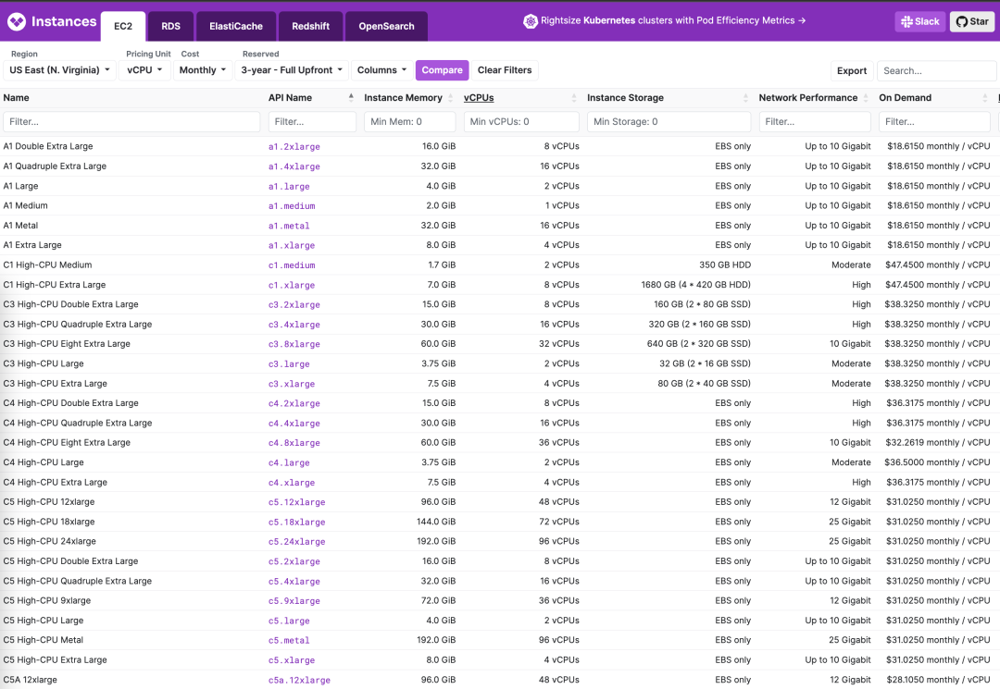
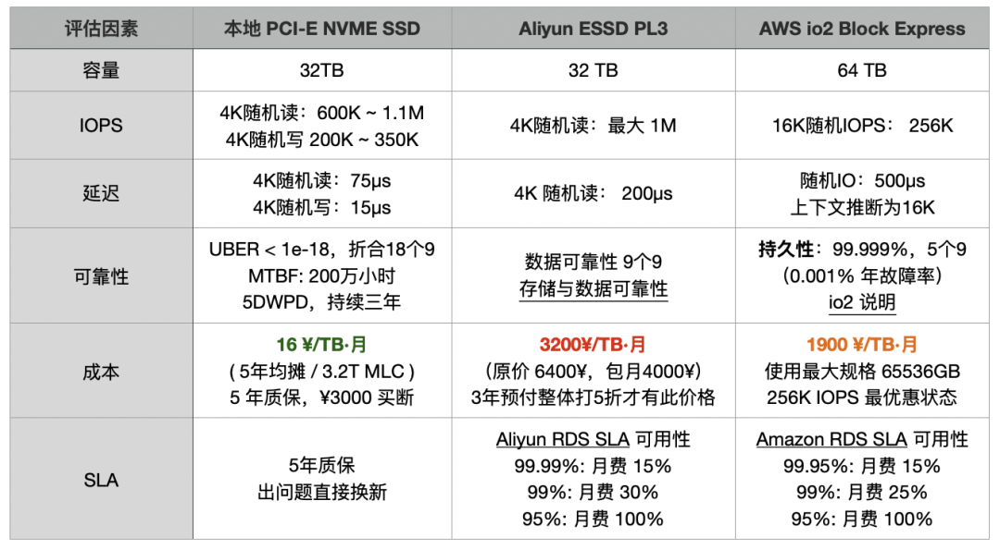
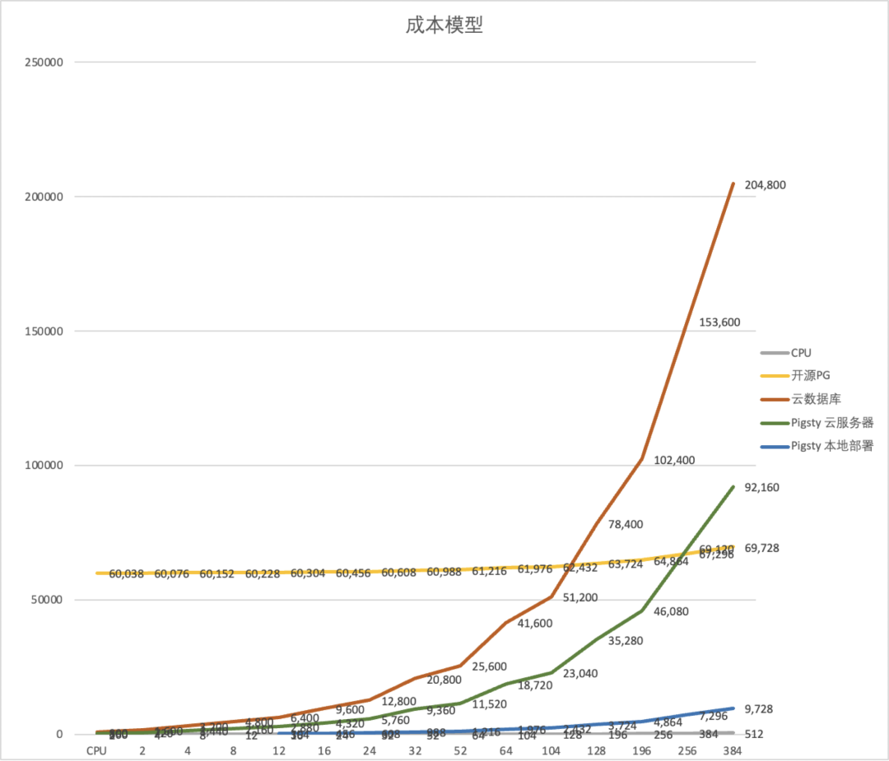

在 SACC 2023 FinOps专场上，我狠狠喷了一把云厂商。这是现场发言的文字整理稿，介绍了终极 FinOps —— **下云** 的理念与实践路径。

-----------------

## 太长不看

**FinOps关注点跑偏**：**总价 = 单价 x 数量**，搞 FinOps 的关注减少浪费资源的**数量**，却故意无视了房间里的大象 —— **云资源单价**。

**公有云是个杀猪盘**：廉价EC2/S3获客，EBS/RDS杀猪。云算力的成本是自建的五倍，块存储的成本则可达百倍以上，堪称终极成本刺客。

**FinOps终点是下云**：对于规模以上企业，IDC自建成本在云服务列表价1折上下。下云是原教旨 FinOps 的终点，也是真正 FinOps 的起点。

**自建能力决定议价权**：拥有自建能力的用户即使不下云也能谈出极低的折扣，没有自建能力的公司只能向公有云厂商缴纳高昂的 “无专家税” 。

**数据库是自建关键**：K8S 上的无状态应用与数据仓库搬迁相对容易，真正的难点是在不影响**质量安全**的前提下，完成数据库的自建。

-----------------

## FinOps关注点跑偏

> 比起浪费的数量，资源单价才是重点。

FinOps 基金会说，FinOPS关注的是“**云成本优化**”。但我们认为只强调**公有云**其实是**有意**把这个概念缩小了 —— 值得关注的是**全部的**资源的成本管控优化，而不仅仅局限在上公有云 —— 还有“混合云”与”私有云“。即使不用公有云，FinOps 的一些方法论也依然能用于 K8S 云原生全家桶。正因为这样，很多搞 FinOps 的人关注点被刻意带偏 —— 目光被局限在**减少云资源浪费数量**上，却忽视了一个非常重要的问题：**单价**。

**总成本**取决于两个因素：**数量 ✖️ 单价**。比起数量，**单价可能才是降本增效的关键**。前面几位嘉宾介绍过，云上资源平均有 1/3 左右的浪费，这也是 FinOps 的优化空间。然而如果你把不需要弹性的服务放在公有云上，本身使用的**资源单价**就已经溢价了**几倍到十几倍**，浪费的部分与之相比只能算三瓜两枣。

在我职业生涯的第一站，便亲历过一次 FinOps 运动。我们的BU曾是阿里云第一批内部用户，也是“**数据中台**”诞生的地方，阿里云出了十几个工程师直接加入带我们上云。上了 ODPS 后每年存储计算开销**七千万**，而通过健康分等 FinOps 手段确实优化了十几个M的浪费。然而原本使用自建机房 Hadoop 全家桶跑同样的东西，每年成本**不到一千万** —— **节约是好事，但与翻几番的资源成本相比根本算不了什么**。

随着降本增效成为主旋律，云遣返也成为一种潮流。发明中台这个概念的阿里，自己已经开始拆中台了。然而还有很多企业在重蹈杀猪盘的覆辙，重复着上云 - 云遣返的老路。

-----------------

## 公有云是个杀猪盘

> 廉价EC2/S3获客，EBS/RDS杀猪。

公有云所鼓吹的弹性是针对其商业模式而设计的：**启动成本极低，维持成本极高**。低启动成本吸引用户上云，而且良好的弹性可以随时适配业务增长，可是业务稳定后形成供应商锁定，尾大不掉，极高的维持成本就会让用户痛不欲生了。这种模式有一个俗称 —— [**杀猪盘**](/cloud/ebs/)。

**要想杀猪，先要养猪**，舍不着孩子套不着狼。所以对于新用户、初创企业，小微用户，公用云都不吝于提供一些甜头，甚至赔本赚吆喝。新用户首单骨折，初创企业免费/半价 Credit，以及微妙的定价策略。以 AWS RDS 报价为例可以看出，1核2核的迷你机型，单价也就是 **几$/核·月**，折合三四百块人民币一年，可以说是非常便宜实惠（不含存储）：如果你需要一个低频使用的小微数据库放点东西，这也许就是最简单便宜的选择。

然而，只要你稍微把配置往上抬哪怕一丁点儿，核月单价就出现了**数量级**的变化，干到了二三十～一百来刀，最高可以翻到几十倍 —— 这还没有算上惊悚的 EBS 价格。用户也许只有在看到突然出现的天价账单时，才会意识到到底发生了什么。

相比自建，**云资源单价普遍在几倍到十几倍的范围，租售比在十几天到几个月之间**。例如，探探IDC包网包电代维+运维网工所有成本均摊下来，一个物理机核算力核月成本在 19块钱，如果使用 K8S 容器私有云，一个虚拟核月成本只要7块钱。

与之对应，阿里云的 ECS 核月单价在一两百块钱，AWS EC2 的核月单价在两三百块钱。如果你“不在乎弹性”，预付买个三年，通常还能再打个五六折。但再怎么算，云算力和本地自建算力的**几倍**差价是放在这儿没跑的。

云**存储**资源的定价则更为离谱，一块常见的 3.2 TB 规格企业级 NVMe SSD 有着极为强悍的性能、可靠性与性价比，批发价 **¥3000** 元出头，全方位吊打老存储。然而，在云上同样的存储，就敢卖你 100 倍的价格。相比直接采购硬件，**AWS EBS io2 的成本高达 120 倍，而阿里云的 ESSD PL3 则高达 200 倍**。

以 3.2TB 规格的企业级 PCI-E SSD 卡为参照基准，**AWS 上按需售租比为 15 天，阿里云上不到 5 天**，租用此时长即可买下整块磁盘。若在阿里云以采购三年预付最大优惠五折计算，**三年租金够买下 120 多块同款硬盘**。

> 《[云盘是不是杀猪盘](/cloud/ebs/)》

云数据库RDS的的溢价倍率则介于云盘与云服务器之间。以 RDS for PostgreSQL 为例， AWS 上 64C / 256GB 的 RDS 用一个月价格 $25,817 / 月，折合每月 18 万元人民币，一个月的租金够你把两台性能比这还要好的多得多的服务器直接买下来自建了。**租售比甚至都不到一个月**，租十来天就够你买下来整台服务器。

任何理智的企业用户都看得明白这里面的道理：**如果采购这种服务不是为了短期的，临时性的需求，那么绝对算得上是重大的财务失当行为。**

| 付费模式            | 价格              | 折合每年（万¥）  |
|-----------------|-----------------|-----------|
| IDC自建（单物理机）     | ¥7.5w / 5年      | 1.5       |
| IDC自建（2～3台组HA）  | ¥15w / 5年       | 3.0 ~ 4.5 |
| 阿里云 RDS 按需      | ¥87.36/时        | 76.5      |
| 阿里云 RDS 月付（基准）  | ¥4.2w / 月       | 50        |
| 阿里云 RDS 年付（85折） | ¥425095 / 年     | 42.5      |
| 阿里云 RDS 3年付（5折） | ¥750168 / 3年    | 25        |
| AWS 按需          | $25,817 / 月     | 217       |
| AWS 1年不预付       | $22,827 / 月     | 191.7     |
| AWS 3年全预付       | 12w$ + 17.5k$/月 | 175       |
| AWS 中国/宁夏按需     | ¥197,489 / 月    | 237       |
| AWS 中国/宁夏1年不预付  | ¥143,176 / 月    | 171       |
| AWS 中国/宁夏3年全预付  | ¥647k + 116k/月  | 160.6     |

我们可以对比一下自建与云数据库的成本差异：

| 方式                                                                 | 折合每年（万元）  |
|--------------------------------------------------------------------|-----------|
| IDC托管服务器 64C / 384G / 3.2TB NVME SSD 660K IOPS (2～3台)              | 3.0 ~ 4.5 |
| 阿里云 RDS PG 高可用版 pg.x4m.8xlarge.2c, 64C / 256GB / 3.2TB ESSD PL3    | 25 ～ 50   |
| AWS RDS PG 高可用版 db.m5.16xlarge, 64C / 256GB / 3.2TB io1 x 80k IOPS | 160 ～ 217 |

> 《[云数据库是不是智商税](/cloud/rds/)》

任何有意义的降本增效行动都无法忽视这个问题：如果资源单价有打0.5～2折的潜力，那么折腾30%的浪费根本排不上优先级。只要你的业务主体还在云上，原教旨 FinOps 就如同隔靴搔痒 —— **下云，才是 FinOps 的重点**。

-----------------

## FinOps终点是下云

> 饱汉不知饿汉饥，人类的悲欢并不相通。

我在探探待了五年 —— 这是一家瑞典人创办的北欧风互联网创业公司。北欧工程师有个特点，**实事求是**。在云与自建选型这件事上不会受炒作营销影响，而是会定量分析利弊得失。我们仔细核算过自建与上云的成本 —— 简单的结论是，**自建（含人力）总体成本基本在云列表价的 0.5 ～ 1 折范围浮动**。

因此，探探从创立伊始就选择了自建。除了出海合规业务，CDN 与极少量弹性业务使用公有云，主体部分完全放在 IDC 托管代维的机房中自建。我们的数据库规模不小，13K 核的 PostgreSQL 与 12K 核的 Redis，450w QPS 与 300TB 不重复的TP数据。这两部分每年成本1000万不到：算上两个DBA一个网工的工资，网电托管代维费用，硬件五年均摊。但是这样的规模，如果使用公有云上的云数据库，即使打到骨折，也需要五六千万起步，更别提杀猪更狠的大数据部分了。

然而，企业数字化是有阶段的，不同的企业处于不同的阶段。对于不少互联网公司来说，已进入自建云原生 K8S 全家桶玩到飞起的阶段了。在这个阶段，关注资源利用率，在线离线混合部署，减少浪费是合理的需求，也是 FinOps 应该发力的方向。但是对那些占总量绝大多数的数字化门外汉企业来说，迫在眉睫的不是减少浪费，**而是压低资源单价** —— Dell服务器可以打两折，IDC虚拟机可以打两折，云骨折也能打两折，请问这些公司是不是还在掏原价采购，甚至还有几倍的回扣费用呢？**大把大把的公司还在因为信息不对称与能力缺失被嘎嘎割韭菜**。

企业应该根据自己的规模与阶段，评估审视自己的业务并进行利弊权衡。如果是小规模初创企业，云确实能节省不少人力成本，很有吸引力 —— **但请您保持警惕，不要因为贪图便利而被供应商锁定**。如果您在云上的年消费已经超过了 100万人民币，那么是时候认真考虑一下 **下云所带来的收益** —— 很多业务并不需要微博并发出轨，训练 AI 大模型那种弹性。为了临时/突发性需求，或出海合规支付溢价还算合情合理，但是为了**不需要的弹性**支付几倍到几十倍的资源溢价，那就是冤大头了。您可以把真正需要弹性的部分留在公有云上，把那些不需要弹性的部分转移到 IDC 。仅仅只是这样做就能省下的成本可能让用户惊掉下巴。

**下云是原教旨 FinOps 的终点，也是真正 FinOps 的起点。**

-----------------

## 下云核心是自建

> 以斗争求和平则和平存，以妥协求和平则和平亡

时来天地皆同力，运去英雄不自由：在泡沫阶段，大家可以不在乎在云上大撒币，在经济下行阶段，降本增效成为核心议题。越来越多的公司意识到，使用云服务其实是一种缴纳“无专家税”与“保护费”的行为。行业也出现了下云的思潮 —— **云遣返**，37 Signal DHH就是最著名的例子。与之对应，全球各大云厂商营收增速也出现了持续性下滑，阿里云的营收甚至已经增速为负 —— 开始负增长了（2023Q1）。

> 《[云计算为啥还没挖沙子赚钱](/cloud/profit/)》

背后的时代趋势是，**开源平替**的出现，打破了公有云的**技术壁垒**；资源云/IDC2.0的出现，提供了公有云资源的物美价廉替代；大裁员释放的技术人才与将来的AI大模型，让各行各业都有机会拥有自建所需的专家知识与能力。结合以上三方面的趋势，**IDC2.0 + 开源自建的组合越来越有竞争力**：**短路掉公有云这个中间商，直接与 IDC 合作显然是一个更经济实惠的选择**。

公有云厂商并非做不好 IDC 卖资源站着挣钱的生意，按理说云厂商的水平比IDC好不少，理应通过技术优势与规模效应降本增效，向公众提供比 IDC自建更便宜的资源才对。然而残酷的现状是，资源云可以爽快的给用户2折虚拟机，而公有云不行。甚至如果考虑到存储计算行业摩尔定律的指数增长规律，公有云其实每年都还在大幅**涨价** ！

专业懂行的大客户，特别是那种随时有能力迁移横跳的甲方去和公有云搞商务谈判，确实有可能获取**两折**的底价折扣，而小客户不太可能有这种机会 —— 在这种意义上，**云其实是吸血中小客户补贴大客户，损不足以奉有余的**。 **云厂商在大客户那边疯狂打折促销，而对中小客户和开发者进行薅羊毛杀猪**，这种方式已经完全违背了云计算本身的初心与愿景。

云用低起步价格把用户赚上来，当用户被深度锁定之后，杀猪就会开始 —— 聊好的折扣与优惠，在每年续约时没有了。从云下来又要支付一笔伤筋动骨的大费用，用户处在进退两难的困境中只能选择饮鸩止渴，继续缴纳保护费。

然而对于有自建能力，可以在多云/本地混合云灵活横跳的用户来说，就没有这个问题：**谈折扣的杀手锏，就是你自己有随时下云、或迁移至其他云上的自建能力**，这比什么口舌都好使 —— 正所谓 “**以斗争求和平则和平存，以妥协求和平则和平亡**” 。**成本能降多少取决于您的议价权，而议价权取决于您是否有能力自建**。

**自建听上去很麻烦，但其实会者不难**。关键是解决 **资源** 与 **能力** 两个核心问题。而在 2023 年，因为资源云与开源平替的出现，这两件事已经比以前要简单太多了。

**在资源方面，IDC与资源云已经解决得足够好了**。上面说的IDC自建，并不是自己从头买土地建机房，而是可以直接使用资源云/IDC的机房托管 —— 你可能只需要一位网工规划一下网络，其他的运维性工作都可以交由供应商打理。

如果您懒得折腾，IDC能爽快地直接卖你云列表价两折的虚拟机，您也可以直接每月两三千租用现成的物理机 64C/256G；无论是整租一整个机房，还是只要一个零售托管机位都没问题。一个零售机位网电代维全包，一年五千块全搞定，整两台百核物理机跑个 K8S 或虚拟化，还要啥弹性ECS ？

自建还有一个额外的好处 —— 如果您真的想做到**极致** FinOps，可以使用过保甚至二手服务器。服务器通常按三年五年均摊报废，但用八年十年的也不少见 —— 相比购买云服务的**消费**，这是实打实的**资产**，多用都算白赚。

上面所使用的 64C 256G 服务器全新价格也需要五万，但用了一两年二手甩卖的“电子垃圾”只需要两千八。换掉最容易坏的部件插块全新企业级3.2TB NVMe SSD （¥2800），整机六千块拿下。

在这种情况下，你的核月成本甚至可以做到1块钱以内 —— 游戏领域确实有这么个传奇案例，可以做到几毛钱一个服务器。有了K8S调度能力和数据库高可用切换能力，可靠性可以完全可以靠多台电子垃圾并联，最终做到令人震惊的成本效益比。

**在能力方面，随着足够好用的开源平替出现，当下自建的难度和几年前完全不可同日而语**。

例如，Kubernetes / OpenStack / SealOS，可以理解为云厂商 EC2/ECS/VPS 管控软件的开源替代；MinIO / Ceph 旨在作为为云厂商 S3 / OSS 管控软件的开源替代；而 **Pigsty** / 各种数据库 Operator 就是 RDS 云数据库管控软件的开源替代 —— **有许许多多的开源软件提供免费用好这些资源的能力；也有许许多多的商业公司提供明码标价的服务支持**。

**您的业务应该尽可能收敛到只用虚拟机和对象存储这种纯资源**，因为这是所有云厂商的提供服务的**最大公约数**。在理想的状态下，所有应用都完整运行在 Kubernetes 上，而这套 Kubernetes 可以运行在任意环境中 —— 不论是云提供的 K8S底座，ECS，独占物理机，还是你自己机房的服务器上。外部状态例如数据库备份，大数据数仓使用存算分离的方案放在 MinIO / S3 存储上。

这样一套 CloudNative 技术栈，理论上有了在任意资源环境上运行与灵活搬迁的能力，从而**避免了供应商锁定，掌握了主动权** —— **您可以选择直接下云省大钱， 也可以选择以此为筹码和公有云商务谈判，要一个骨折折扣出来继续使用**。

当然，下云自建也是有风险的，而最大的风险点就在 RDS 上。

-----------------

## 数据库是最大风险点

> **云数据库**也许不是最大的开销项，但一定是锁定最深，最难搬迁的服务。

质量、安全、效率、成本，是一个递进的需求金字塔上的不同层次。而 FinOps 的目标，是要在**不影响质量安全的前提下完成降本增效**。

无论是K8S上的无状态应用，还是离线大数据平台，搬迁起来都很难有致命风险。特别是如果您已经完成了**大数据存算分离**与**无状态应用云原生**改造，这两个部分搬动起来通常不会有太大困难。前者通常停几个小时也无所谓，后者则可以蓝绿部署，灰度切换。**唯有作为工作记忆的数据库动起来容易搞出大问题。**

可以说绝大多数 IT 系统的架构都服务于数据库这一核心，下云牵一发而动全身的关键风险点落在 OLTP 数据库 / RDS 上。**很多用户不下云自建的原因正是缺少自建靠谱数据库服务的能力** —— 土法的 Kubernetes Operator 似乎没法达到云数据库的完整功能体验：把 OLTP 数据库放在 K8S/容器 中，使用 EBS 运行也不是成熟的最佳实践。

**时代在呼唤一个足够好的 RDS 的开源替代品，而这正是我们要解决的问题**：让用户可以在任意环境上自建起比肩甚至超越云数据库的本地 RDS 服务 —— **Pigsty**，开源免费的 RDS PG 替代。帮助用户真正用好 [世界上最先进、最成功的数据库 —— PostgreSQL](http://mp.weixin.qq.com/s?__biz=MzU5ODAyNTM5Ng==&mid=2247485685&idx=1&sn=688f6d6d0f4128d7f77d710f04ff9024&chksm=fe4b3d2ec93cb438665b7e0d554511674091b2e486a70b8a3eb7e2c7a53681fb9834a08cb3c3&scene=21#wechat_redirect)。

Pigsty 是一个公益性质的自由软件，软件本身完全开源免费用爱发电。它提供了一个开箱即用扩展齐全的 PostgreSQL 发行版，带有自动配置的高可用与PITR，业界顶尖的监控系统，Infra as Code，提供一键安装部署的云端 Terraform 模板 与本地 Vagrant沙箱，针对各种操作都给出了 SOP 手册预案，让您无需专业 DBA 也可以快速完成 RDS 自建。

尽管 Pigsty 是一个数据库发行版，但它赋能用户践行最终极的 FinOps 理念 —— 用几乎接近于纯资源的价格，在任何地方（ECS，资源云，机房服务器甚至本地笔记本虚拟机）运行生产级的 PostgreSQL RDS 数据库服务。**让云数据库的能力成本，从正比于资源的边际成本，变为约等于0的固定学习成本**。

可能也就是北欧企业的社会主义氛围，才能孵化出这种的纯粹的自由软件。我们做这件事不是为了挣钱，而是要践行一种理念：把用好世界上最先进的开源数据库 PostgreSQL 的能力普及给每一个用户，而不是让使用软件的能力沦为公有云的禁脔。云厂商垄断开源专家与岗位，吸血白嫖开源软件，而我们要要打破云厂商对于能力的垄断 —— **Freedom is not free，你不应该把世界让给你所鄙视的人，而应该直接把他们的饭桌掀翻**。

**这才是最终极的 FinOps ——** **授人以渔，提供让用户真正用得上的更优备选，赋予用户自建的能力与面对云厂商的议价权**。

-----------------

## References

[1] [云计算为啥还没挖沙子赚钱？](https://mp.weixin.qq.com/s/JU4lznF6-5Q4LaJTnG8SSQ)

[2] [云数据库是不是智商税？](https://mp.weixin.qq.com/s/c8bpK4o3H7-EyRqVdNDndQ)

[3] [云SLA是不是安慰剂？](https://mp.weixin.qq.com/s/LC5jAhuVObRcrTLxI1FUQA)

[4] [云盘是不是杀猪盘？](https://mp.weixin.qq.com/s/UxjiUBTpb1pRUfGtR9V3ag)

[5] [范式转移：从云到本地优先](https://mp.weixin.qq.com/s/Yp6L0hh4b4HuJQRPD3aJYw)

[6] [杀猪盘真的降价了吗？](https://mp.weixin.qq.com/s/TksQ108v_nGaW11-87Es3A)

[7] [炮打 RDS，Pigsty v2.0 发布](https://mp.weixin.qq.com/s/WsR-c64OJfkMql7zX7XmDA)

[8] [垃圾腾讯云CDN：从入门到放弃](https://mp.weixin.qq.com/s/ANFnbDXwuhKI99fgYRZ9ug)

[9] [云RDS：从删库到跑路](https://mp.weixin.qq.com/s/AGEW1iHQkQy4NQyYC2GonQ)

[10] [分布式数据库是伪需求吗？](https://mp.weixin.qq.com/s/-eaCoZR9Z5srQ-1YZm1QJA)

[11] [微服务是不是个蠢主意？](https://mp.weixin.qq.com/s/mEmz8pviahEAWy1-SA8vcg)

[12] [更好的开源RDS替代：Pigsty](http://mp.weixin.qq.com/s?__biz=MzU5ODAyNTM5Ng==&mid=2247485518&idx=1&sn=3d5f3c753facc829b2300a15df50d237&chksm=fe4b3d95c93cb4833b8e80433cff46a893f939154be60a2a24ee96598f96b32271301abfda1f&scene=21#wechat_redirect)