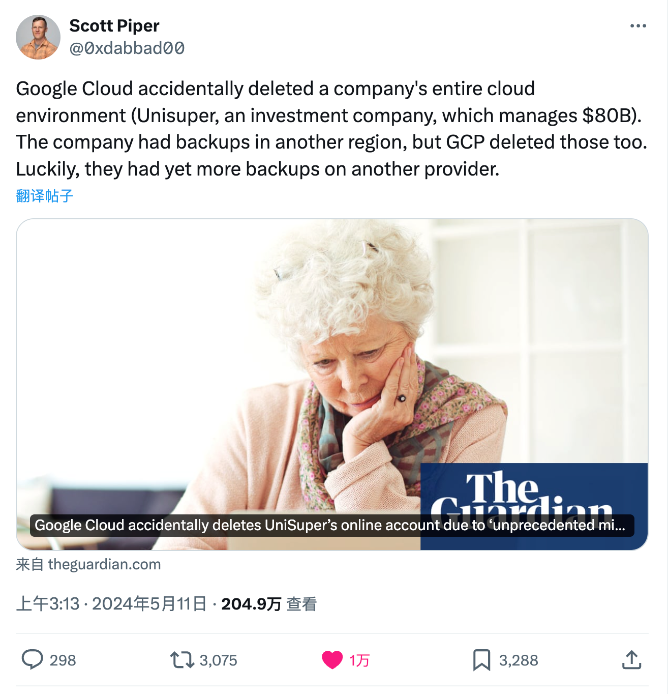
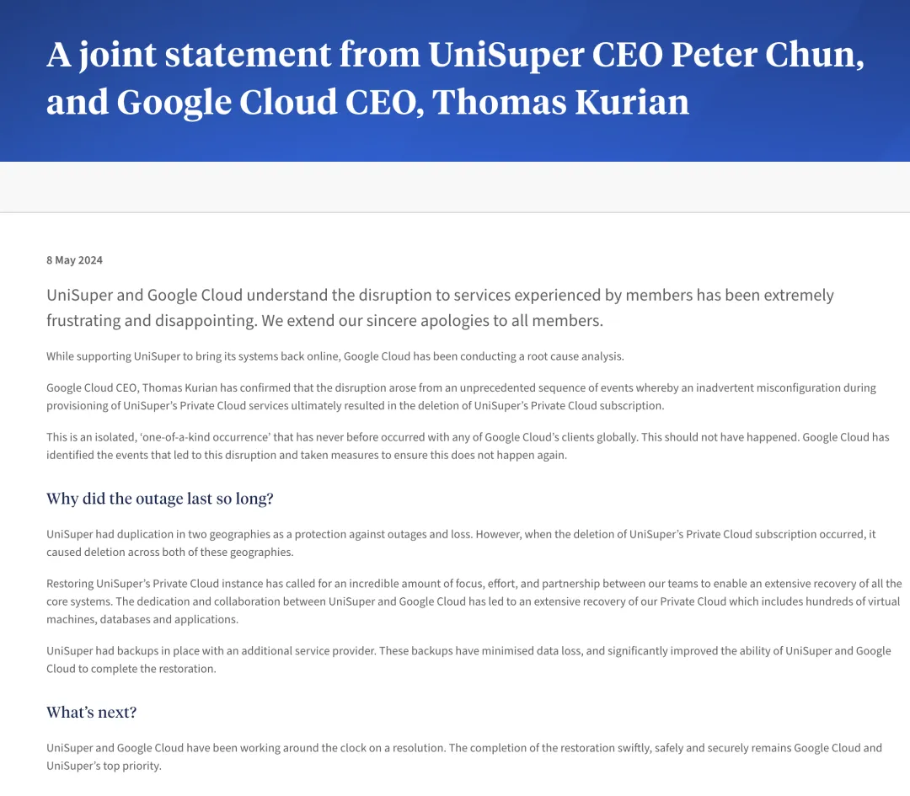

Due to an "***unprecedented configuration error***", Google Cloud mistakenly deleted **UniSuper**'s cloud account.

The Australian pension fund executive and Google Cloud's global CEO issued a joint statement apologizing for this "extremely frustrating and disappointing" outage.

> https://x.com/0xdabbad00/status/1789011008549450025

Due to Google Cloud's "**peerless**" configuration mistake, Australian pension fund UniSuper's entire cloud account was accidentally deleted. Over half a million UniSuper fund members couldn't access their pension accounts for a week. After the outage, service began recovering last Thursday, with UniSuper stating they would update investment account balances as soon as possible.

------

UniSuper CEO Peter Chun explained to 620,000 members on Wednesday evening that the disruption was not caused by a cyber attack, and no personal data was leaked during the incident. Chun clearly stated the problem originated from Google's cloud services.

In a joint statement from Peter Chun and Google Cloud global CEO Thomas Kurian, both apologized to members for the outage, calling the event "extremely frustrating and disappointing." They pointed out that due to a configuration error, UniSuper's cloud account was deleted, **an unprecedented event on Google Cloud**.

> [Joint Statement from UniSuper CEO and Google Cloud CEO](https://www.unisuper.com.au/about-us/media-centre/2024/a-joint-statement-from-unisuper-and-google-cloud)

Google Cloud CEO Thomas Kurian confirmed that the cause of this outage was an oversight during the setup of UniSuper's private cloud services, ultimately leading to the deletion of UniSuper's private cloud subscription. Both stated this was an isolated, unprecedented event, and Google Cloud has taken measures to ensure similar incidents won't happen again.

------

Although UniSuper typically sets up backups in two different geographical regions for quick recovery during service outages or losses, **the deletion of the cloud subscription also simultaneously deleted backups in both locations**.

Fortunately, UniSuper had another backup with a different vendor, so they ultimately succeeded in restoring service. These backups greatly mitigated data loss and significantly enhanced UniSuper and Google Cloud's ability to complete recovery.

"The complete restoration of UniSuper's private cloud instance was inseparable from the tremendous focused effort of both teams and close cooperation between both parties." Through joint effort and cooperation between UniSuper and Google Cloud, their private cloud was fully restored, including **hundreds of virtual machines, databases, and applications**.

UniSuper currently manages approximately **$125 billion** in funds.

------

### Cloud Exit Feng's Commentary

If [**Alibaba Cloud's global service unavailability**](/cloud/aliyun/) major outage could be called "**epic**," then this Google Cloud outage deserves to be called "**peerless**." The former mainly involved service **availability**, while this outage struck at the core of many enterprises - **data integrity**.

To my knowledge, this should be a new record in cloud computing history - the first such large-scale database deletion. The last similar data integrity incident was [**Tencent Cloud and the "Qianyan CNC" case**](/cloud/sla/#消失的可靠性).

But a small startup company and a major fund managing hundreds of billions are completely incomparable; the scope and scale of impact are completely incomparable - **everything under the entire cloud account was gone!**

This incident once again demonstrates the importance of (off-site, multi-cloud, different vendor) **backups** - UniSuper was lucky, they had other backups elsewhere.

But if you believe that public cloud providers' data backups in other regions/availability zones can "cover your back," then please remember this case - **Avoid Vendor Lock-in, and Always have Plan B**.

Reference: [Guardian UK report on this incident](https://www.unisuper.com.au/about-us/media-centre/2024/a-joint-statement-from-unisuper-and-google-cloud)