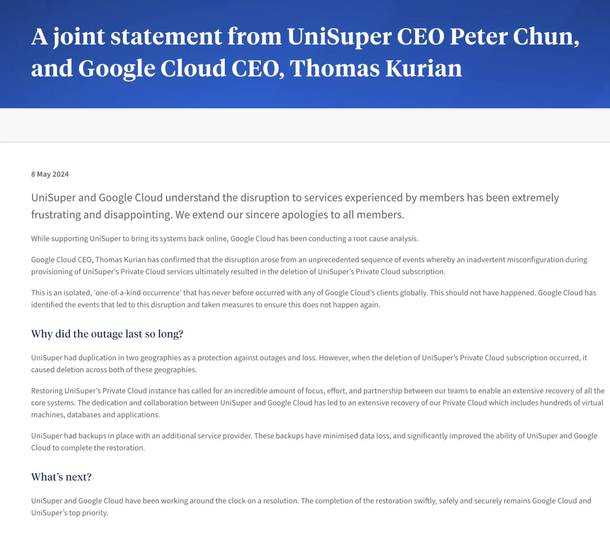

由于“***前所未有的配置错误***”，Google Cloud 误删了 **UniSuper** 的云账户。

澳洲养老金基金负责人与 Google Cloud 全球首席执行官联合发布声明，为这一“极其令人沮丧和失望”的故障表示道歉。

> https://x.com/0xdabbad00/status/1789011008549450025

因为一次 Google Cloud “**举世无双**” 的配置失误，澳洲养老金基金 Unisuper 的整个云账户被误删了，超过五十万名 UniSuper 基金会员一周都无法访问他们的养老金账户。故障发生后，服务于上周四开始恢复，UniSuper 表示将尽快更新投资账户的余额。

------

UniSuper首席执行官 Peter Chun 在周三晚上向62万名成员解释，此次中断非由网络攻击引起，且无个人数据在此次事件中泄露。Chun 明确指出问题源于 Google的云服务。

在 Peter Chun 和 Google Cloud 全球CEO Thomas Kurian 的联合声明中，两人为此次故障向成员们致歉，称此事件“极其令人沮丧和失望”。他们指出，由于配置错误，导致 UniSuper 的云账户被删除，**这是 Google Cloud 上前所未有的事件**。

> [UniSuper CEO 与 Google云 CEO 联合声明](https://www.unisuper.com.au/about-us/media-centre/2024/a-joint-statement-from-unisuper-and-google-cloud)

Google Cloud CEO Thomas Kurian 确认了这次故障的原因是，在设定 UniSuper 私有云服务过程中的一次疏忽，最终导致 UniSuper 的私有云订阅被删除。两人表示，这是一次孤立的、前所未有的事件，Google Cloud 已采取措施确保类似事件不再发生。

------

虽然 UniSuper 通常在两个不同的地理区域设置了备份，以便于服务故障或丢失时能够迅速恢复，**但此次删除云订阅的同时，两地的备份也同时被删除了**。

万幸的是，因为 UniSuper 在另一家供应商里还有一个备份，所以最终成功恢复了服务。这些备份在极大程度上挽回了数据损失，并显著提高了 UniSuper 与 Google Cloud 完成恢复的能力。

“UniSuper 私有云实例的全面恢复，离不开双方团队的极大专注努力，以及双方的密切合作” 通过 UniSuper 与 Google Cloud 的共同努力与合作，我们的私有云得到了全面恢复，包括 **数百台虚拟机、数据库和应用程序**。

UniSuper 目前管理着大约 **1250 亿美元** 的基金。

------

### 下云老冯评论

如果说 [**阿里云全球服务不可用**](/cloud/aliyun/) 大故障称得上是 “**史诗级**”，那么 Google 云上的这一次故障堪称 “**无双级**” 了。前者主要涉及服务的**可用性**，而这次故障直击许多企业的命根 —— **数据完整性**。

据我所知这应当是云计算历史上的新纪录 —— 第一次如此大规模的删库。上一次类似的数据完整性受损事件还是 [**腾讯云与 “前言数控” 的案例**](/cloud/sla/#消失的可靠性)。

但一家小型创业公司与掌管千亿美金的大基金完全不可同日而语；影响的范围与规模也完全不可同日而语 —— **整个云账户下的所有东西都没了！**

这次事件再次展示了（异地、多云、不同供应商）**备份**的重要性 —— UniSuper 是幸运的，他们在别的地方还有其他备份。

但如果你相信公有云厂商在其他的区域 / 可用区的数据备份可以帮你“兜底”，那么请记住这次案例 —— **避免 Vendor Lock-in，并且 Always has Plan B**。

参考：[英国卫报关于此次事件的报道](https://www.unisuper.com.au/about-us/media-centre/2024/a-joint-statement-from-unisuper-and-google-cloud)

