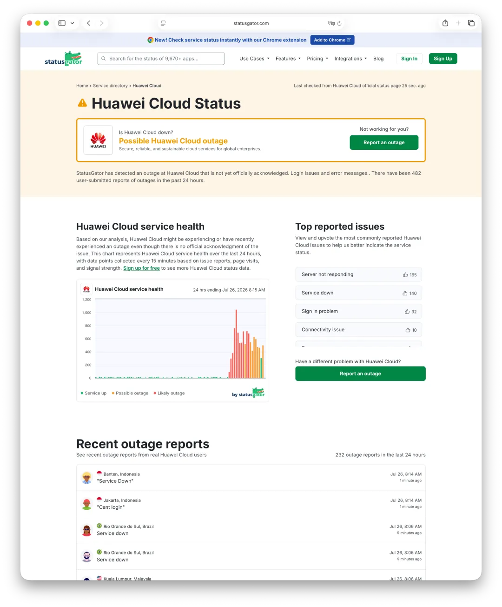
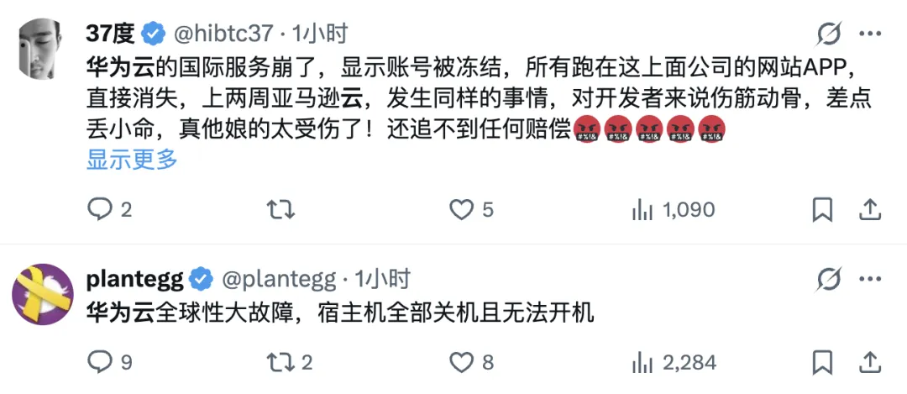
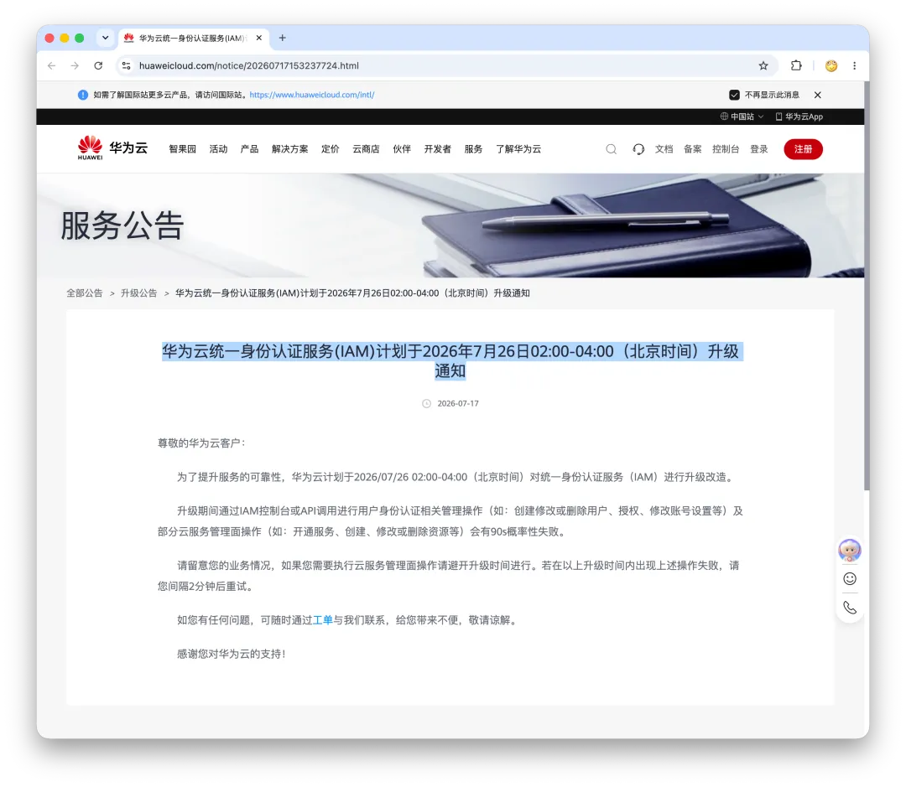

At 02:49 GMT+8 on July 26, 2026, [Huawei Cloud said](https://www.huaweicloud.com/intl/en-us/notice/20260726033454857.html) that it had detected abnormalities affecting some accounts on its International Site, disrupting access to related services. Huawei Cloud later marked the notice as resolved, saying that the affected accounts had been restored, services were operating normally, and data integrity had been maintained. The notice gives neither a precise recovery time nor a root cause.

The first dense cluster of third-party signals appeared on StatusGator at 03:32. In the data collected for this article, its rolling 24-hour submission count exceeded 450; the 08:15 snapshot below shows 482 user-submitted reports. Reports came from several International Site markets, including Argentina, Turkey, Brazil, Egypt, Thailand, Mexico, and Chile.

Third-party and social reports described failed sign-ins, broken console or management operations, resources shown as “frozen,” unresponsive servers, and connectivity failures. I found no reports concerning regions on Huawei Cloud's China site in the material collected at the time.

The evidence layers matter. Huawei Cloud officially confirmed only that a portion of International Site accounts were abnormal and that access to related services was affected. StatusGator's figures and the country-level posts are third-party or user reports. They show a multi-market signal, but they do not prove that every report had the same cause, establish the exact blast radius of a “global outage,” or identify a root cause.

## Why IAM Is a Suspect

On July 17, Huawei Cloud published [a maintenance notice](https://www.huaweicloud.com/intl/en-us/notice/20260717153414444.html) for an Identity and Access Management (IAM) upgrade scheduled from 02:00 to 04:00 GMT+8 on July 26. It warned that identity-related management operations through the IAM console or APIs, along with some cloud-service control-plane operations, could fail for about 90 seconds during the upgrade.

The account incident closely overlapped that maintenance window. A problem during maintenance that spread beyond its intended scope, or a cascading failure in a shared control plane, is therefore a reasonable hypothesis to investigate. But **correlation in time is not causation**. Huawei Cloud's incident notice does not attribute the event to the IAM upgrade, and I have no independent technical evidence that confirms the link.

## Symptoms and Inference

StatusGator initially described “login issues and error messages.” Its common issue categories included:

- unable to sign in;
- console or application failing to load;
- API or operation errors;
- failed service-management operations.

Those symptoms match the failure modes in Huawei Cloud's IAM maintenance notice: user management, authorization, account settings, and control-plane operations such as enabling services or creating, modifying, and deleting resources could all fail briefly.

Several reports also used the unusually specific word *frozen*:

- “all resources frozen”;
- “all servers frozen”;
- “server frozen.”

Others bypassed the console entirely and reported:

- `server not responding`;
- `service down`;
- `connectivity issue`;
- `servers down`.

If the failure had affected only IAM sign-in or the console, already-running ECS instances, databases, and public-facing data-plane services would not normally all lose connectivity. The direct server and network reports therefore hint at either a wider blast radius or user-visible secondary failures. User reports alone cannot establish that technical boundary.

The circumstantial case for an IAM connection is straightforward:

- Huawei Cloud had scheduled its IAM upgrade for the same time window;
- StatusGator's first signal arrived during that window;
- the earliest symptoms centered on sign-in, authentication, and error messages;
- reports were geographically dispersed rather than concentrated around one facility;
- third-party signals continued past the planned end of maintenance.

That is enough to say “possibly related,” not enough to name a root cause. If the events were connected, a failed upgrade or rollback, a state-propagation error, or cache contamination could all produce similar symptoms. An unrelated failure remains possible. Any firm conclusion must wait for a technical account from Huawei Cloud.

## Timeline

All times below are GMT+8. Official facts and third-party signals are labeled separately.

- **July 17 (official):** Huawei Cloud announced the IAM maintenance, scheduled for July 26 from 02:00 to 04:00. The notice did not specify a regional scope.
- **July 26, 02:00 (scheduled):** The IAM upgrade window began—18:00 UTC on July 25 and 03:00 in Tokyo.
- **02:49 (official):** Huawei Cloud detected abnormalities affecting some accounts on its International Site. Access to related services was affected, and the company initiated an emergency response.
- **03:32 (third party):** StatusGator first detected “login issues and error messages,” while the scheduled maintenance window was still open.
- **04:00 (scheduled):** The IAM maintenance window was due to end. Third-party signals did not disappear.
- **04:00–07:00 (third party):** User reports continued. Because the page exposed only a subset of recent reports, a minute-by-minute reconstruction is not possible.
- **07:08–07:23 (third party):** Reports from Argentina, Peru, Chile, and Thailand included “server not responding,” “service still unavailable,” and “connectivity issue.”
- **07:29–07:42 (third party):** More reports appeared from Argentina, Chile, Mexico, Thailand, and Egypt, describing unresponsive servers, service outages, and frozen servers or resources.
- **Around 07:45 (third party):** StatusGator showed roughly 457 submissions in the previous 24 hours and listed 219 outage reports. A later refresh showed about 458 submissions.
- **07:52 (author's check):** I could not find a public incident identifier, recovery notice, or root-cause explanation. StatusGator still labeled the event a possible outage.
- **08:15 (third-party snapshot):** StatusGator showed 482 user submissions in the previous 24 hours.
- **08:22 (author's monitoring):** The last report visible during my monitoring appeared. From 03:32 to 08:22, the third-party signal lasted at least **4 hours and 50 minutes**.

Large cloud failures involving identity and control-plane services are not unprecedented. In an earlier article, I analyzed Alibaba Cloud's 2023 outage as a suspected IAM/OSS circular dependency.

## Related Reading

- [Lessons from Alibaba Cloud's Epic Outage](https://mp.weixin.qq.com/s?__biz=MzU5ODAyNTM5Ng==&mid=2247486468&idx=1&sn=7fead2b49f12bc2a2a94aae942403c22&scene=21#wechat_redirect)
- [Lessons from Tencent Cloud's Outage Postmortem](https://mp.weixin.qq.com/s?__biz=MzU5ODAyNTM5Ng==&mid=2247487348&idx=1&sn=412cf2afcd93c3f0a83d65219c4a28e8&scene=21#wechat_redirect)
- [How an AWS DNS Failure Cascaded Across Half the Internet](https://mp.weixin.qq.com/s?__biz=MzU5ODAyNTM5Ng==&mid=2247490494&idx=1&sn=964ee450baae997f8036b26cae6328c4&scene=21#wechat_redirect)
- [AWS's Largest Regional Outage Took Down Multiple Services](https://mp.weixin.qq.com/s?__biz=MzU5ODAyNTM5Ng==&mid=2247490479&idx=1&sn=62bc2239ab634d167ac8a599ad910d58&scene=21#wechat_redirect)
- [AWS's Official Outage Postmortem](https://mp.weixin.qq.com/s?__biz=MzU5ODAyNTM5Ng==&mid=2247490504&idx=1&sn=963e7026f1e3dd9245bed5d2235e1553&scene=21#wechat_redirect)
