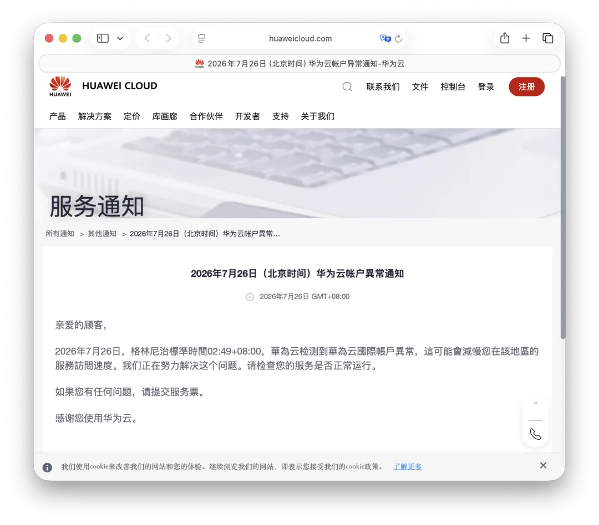
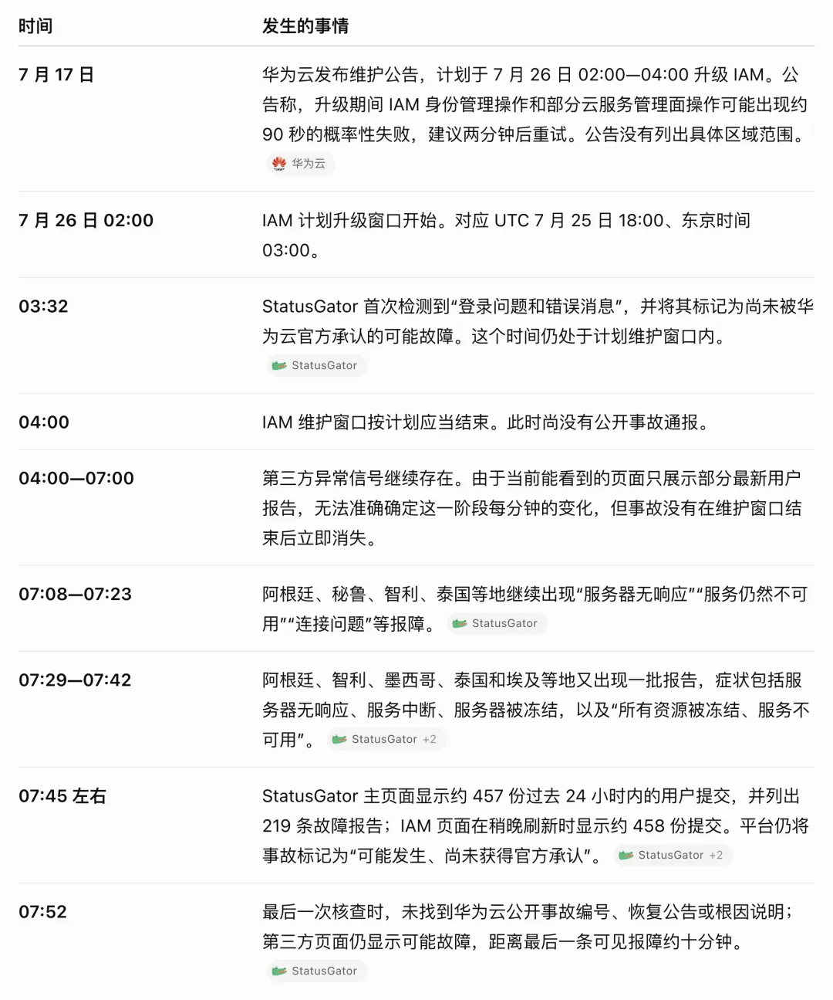

2026 年 7 月 26 日 02:49（北京时间），[华为云官方通知](https://www.huaweicloud.com/intl/zh-cn/notice/20260726032451059.html)称，国际站部分账号出现异常，影响了相关服务的访问。华为云随后将通知标记为“已恢复”，并表示受影响账号已经恢复、国际站服务正常运行且数据安全；通知没有披露具体恢复时间与根因。

第三方监控平台 StatusGator 从 03:32 起出现密集的用户报障信号。按本文当时采集的页面数据，24 小时内累计提交量超过 450；08:15 的截图显示为 482 条。报告来自阿根廷、土耳其、巴西、埃及、泰国、墨西哥、智利等多个国际站市场。

这些第三方与用户报告涉及登录失败、控制台无法加载或管理操作失败、资源“冻结”，以及服务器无响应、连接异常等症状。作者当时收集到的样本中，未见中国站区域的故障报告。

这里需要区分证据层级：华为云官方只确认了国际站部分账号异常及相关服务访问受影响；StatusGator 的统计和各地社交媒体帖子属于第三方或用户报告。它们说明异常信号跨越多个市场，但不能单独证明所有报告来自同一故障，更不能证明一次“全球故障”的精确范围与根因。

## 为什么怀疑 IAM

华为云在 7 月 17 日发布了[IAM 计划升级公告](https://www.huaweicloud.com/notice/20260717153237724.html)，计划于 7 月 26 日 02:00—04:00（北京时间）升级统一身份认证服务（IAM）。公告称，升级期间，通过 IAM 控制台或 API 执行的身份认证相关管理操作，以及部分云服务的管理面操作，可能出现约 90 秒的概率性失败。

账号异常与维护窗口在时间上高度重合，因此，计划维护异常扩大或触发共享控制面的级联故障，是一个值得调查的技术假设。但**时间重合并不等于因果关系**：华为云的账号异常通知没有把事件归因于 IAM 升级，本文也没有获得能够确认这一因果链的独立技术证据。

## 症状与推断

StatusGator 将最早的异常描述为“登录问题和错误消息”，页面上的常见问题包括：

- 无法登录；
- 控制台或应用无法加载；
- API 或操作返回错误；
- 服务管理操作失败。

这些症状与 IAM 维护公告所描述的预期影响相符：IAM 用户管理、授权、账号设置，以及开通、创建、修改、删除资源等管理面操作都可能短暂失败。

多名报告者还使用了非常具体的“Frozen／冻结”表述：

- “所有资源被冻结”；
- “所有服务器被冻结”；
- “服务器被冻结”。

另一部分报告则直接写道：

- `server not responding`；
- `service down`；
- `connectivity issue`；
- `servers down`。

如果异常只影响 IAM 登录或控制台，已经运行的数据面 ECS、数据库和公网服务通常不应普遍失去连接。因此，这些直接指向服务器与连接的报告，暗示影响可能超出单纯的认证管理面，或者引发了用户可见的次生故障。不过，用户报告本身不足以确认技术边界。

支持 IAM 关联假设的线索包括：

- 官方将 IAM 升级安排在同一时段；
- StatusGator 的首次异常信号出现在维护窗口内；
- 最初症状集中于登录、身份认证和错误消息；
- 报告分散在多个国家和地区，不像单个机房故障；
- 第三方异常信号延续到计划维护窗口之后。

这些线索只能支持“可能相关”，不能确认根因。若两者确有关联，升级失败、回滚异常、状态同步错误或缓存污染等都可能产生类似表现；也不能排除与 IAM 无关的其他原因。具体原因仍应以华为云后续技术说明为准。

## 时间线

以下时间均为北京时间，官方事实与第三方信号分别标注：

- **7 月 17 日（官方）**：华为云发布 IAM 维护公告，计划于 7 月 26 日 02:00—04:00 升级。公告没有列出具体区域范围。
- **7 月 26 日 02:00（官方计划）**：IAM 升级窗口开始，对应 UTC 7 月 25 日 18:00、东京时间 03:00。
- **02:49（官方）**：华为云监测到国际站部分账号异常，相关服务访问受到影响，并启动应急响应。
- **03:32（第三方）**：StatusGator 首次检测到“登录问题和错误消息”，当时仍处在计划维护窗口内。
- **04:00（官方计划）**：IAM 维护窗口按计划应当结束，但第三方异常信号没有立即消失。
- **04:00—07:00（第三方）**：StatusGator 上仍有用户报告；由于页面只展示部分最新条目，无法还原这一阶段每分钟的变化。
- **07:08—07:23（第三方）**：阿根廷、秘鲁、智利、泰国等地出现“服务器无响应”“服务仍不可用”“连接问题”等报告。
- **07:29—07:42（第三方）**：阿根廷、智利、墨西哥、泰国和埃及等地又出现服务器无响应、服务中断、服务器或资源被冻结等报告。
- **07:45 左右（第三方）**：StatusGator 页面显示约 457 次过去 24 小时内的用户提交，并列出 219 条故障报告；稍后刷新时，提交量约为 458。
- **07:52（作者核查）**：尚未找到公开的事故编号、恢复公告或根因说明；第三方页面仍将其标记为“可能故障”。
- **08:15（第三方截图）**：StatusGator 显示过去 24 小时内有 482 次用户提交。
- **08:22（作者采集记录）**：最后一条可见报障。按 03:32 至 08:22 计算，异常信号至少延续了 **4 小时 50 分钟**。

关键身份与控制面服务引发大范围云服务异常并非没有先例。作者此前曾将 2023 年阿里云故障分析为一种疑似的 IAM／OSS 循环依赖。

## 相关阅读

- [我们能从阿里云史诗级故障中学到什么](https://mp.weixin.qq.com/s?__biz=MzU5ODAyNTM5Ng==&mid=2247486468&idx=1&sn=7fead2b49f12bc2a2a94aae942403c22&scene=21#wechat_redirect)
- [我们能从腾讯云故障复盘中学到什么？](https://mp.weixin.qq.com/s?__biz=MzU5ODAyNTM5Ng==&mid=2247487348&idx=1&sn=412cf2afcd93c3f0a83d65219c4a28e8&scene=21#wechat_redirect)
- [一次 AWS DNS 故障如何级联瘫痪半个互联网](https://mp.weixin.qq.com/s?__biz=MzU5ODAyNTM5Ng==&mid=2247490494&idx=1&sn=964ee450baae997f8036b26cae6328c4&scene=21#wechat_redirect)
- [AWS 最大区域故障，带崩多项服务](https://mp.weixin.qq.com/s?__biz=MzU5ODAyNTM5Ng==&mid=2247490479&idx=1&sn=62bc2239ab634d167ac8a599ad910d58&scene=21#wechat_redirect)
- [AWS 故障官方复盘报告](https://mp.weixin.qq.com/s?__biz=MzU5ODAyNTM5Ng==&mid=2247490504&idx=1&sn=963e7026f1e3dd9245bed5d2235e1553&scene=21#wechat_redirect)
