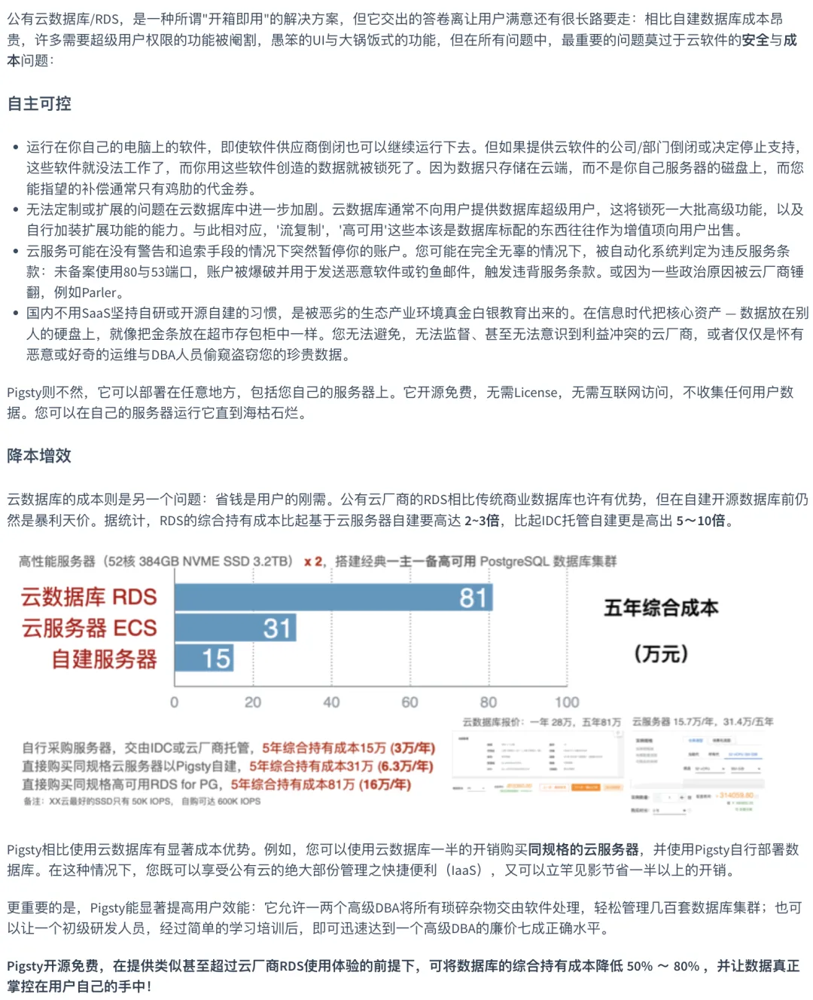
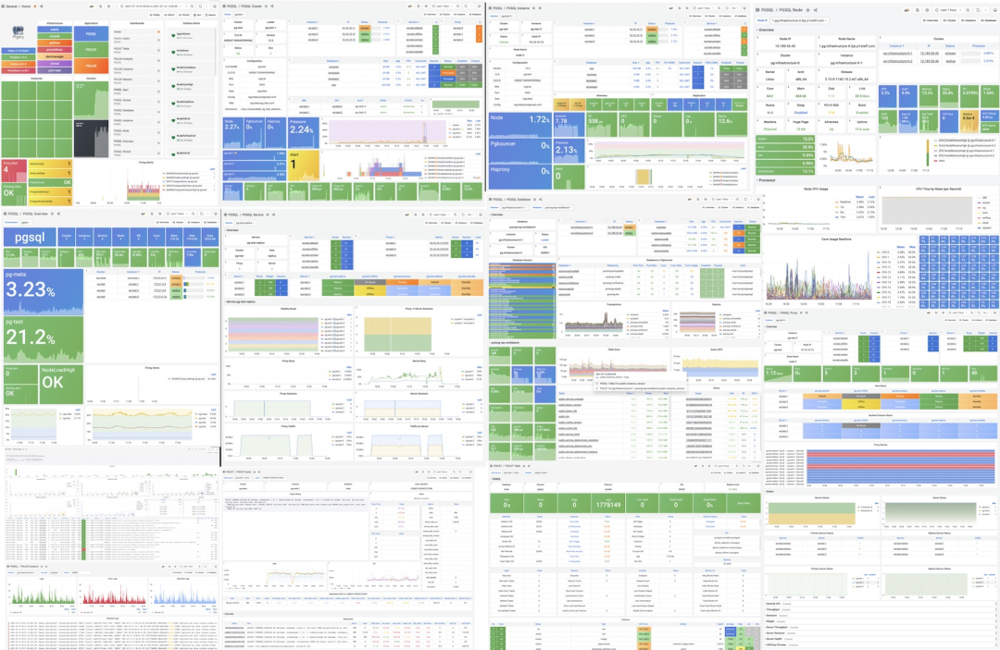

Ant Financial had a self-deprecating joke: besides regulation, only **DBAs** could bring down Alipay.

In the digital age, data is the core asset of many enterprises, especially for internet/software service companies. The people responsible for safeguarding these data assets are **DBAs (Database Administrators)**.

Imagine a scenario where all account balances and contacts are completely lost. Although the probability is minimal, even Alipay and WeChat would probably be in deep trouble if they experienced an unrecoverable core database deletion incident.

------------------

## Where Did It All Begin?

> Software eats the world, open source eats software, cloud devours open source - who will devour the cloud?

Long, long ago, developing software/information services required using very expensive commercial database software: like Oracle and SQL Server. Software licensing fees alone could reach six or seven figures, plus similar hardware costs and service subscription costs. If a company had already invested tens of millions in database hardware and software, then spending some more money to hire dedicated experts to care for these expensive and complex databases was natural. These experts were DBAs.

Then things took an interesting turn: with the rise of open source databases like PostgreSQL/MySQL, companies had a new option: they could use database software without licensing fees, and they began to (irrationally) stop paying for database experts. Database maintenance work became an implicit subsidiary responsibility of development and operations teams, and these two types of people usually: neither excel at, nor enjoy, nor care about database matters. Only after a company reached sufficient scale or learned enough hard lessons would some Dev/Ops develop corresponding capabilities, though this was quite rare.

Then came the cloud. Cloud is essentially outsourced operations, automating the most visualizable parts of DBA work that belong to operations: high availability, backup/recovery, configuration, provisioning. DBAs still had plenty of work left, but ordinary muggles couldn't understand the value of such work, so these responsibilities still quietly fell to development and operations engineers. "Free" open source databases allowed free and casual use of database software, so with the rise of microservices philosophy, users began giving each small service its own separate database instead of many applications sharing one huge central shared database. In this situation, databases were viewed as part of each service, making it more convenient to push DBA work to developers.

So, what comes after cloud? Will DBA still be a good job?

------------------

## Core Value

Many places need DBAs: terrible schema design, awful query performance, backups of unknown utility; and so on. Unfortunately, among people working in software, few understand what a DBA is. Becoming a DBA means engaging in endless battle against the entropy created by developers.

DBA, Database Administrator, database administrator, formerly also called database coordinator or database programmer. DBA is a broad role spanning development and operations teams, involving DA, SA, Dev, Ops, and SRE responsibilities, handling various data and database-related issues: setting management policies and operational standards, planning software and hardware architecture, coordinating database management, validating table schema design, optimizing SQL queries, analyzing execution plans, and even handling emergency outages and data rescue.

The first value of DBAs lies in **safety backup**: they are guardians of enterprise core data assets, and also people who can easily cause fatal damage to enterprises. At Ant Financial there's a joke that besides regulation, only DBAs could kill Alipay. Executives usually struggle to realize DBAs' importance to the company until a database incident occurs and a bunch of CXOs nervously stand behind the DBA watching the firefighting and recovery process.

The second value of DBAs lies in **performance optimization**. Many companies don't care that their queries are pure garbage; they just think "hardware is cheap" and throw money at hardware. However, the problem is that a poorly tuned query/SQL or poorly designed data model and table structure can have **several orders of magnitude** impact on performance. There will always be some scale where the cost of throwing hardware becomes prohibitively expensive compared to hiring a reliable DBA. Honestly, I think the biggest IT software and hardware expense for most companies is: **developers not using databases correctly**.

Excellent DBAs also handle **data model design and optimization**. Data modeling and SQL have almost become lost arts; this foundational knowledge is gradually forgotten by new generations of engineers who design outrageous schemas, don't know how to create indexes properly, then hastily conclude: relational databases and SQL are garbage, we must use rough-and-ready NoSQL to save time. However, people always need reliable systems to handle critical business data: in many enterprises, core data is still a regular relational database as the **Source of Truth**, with NoSQL databases used only for non-critical data.

For startups that haven't reached PMF, hiring a full-time DBA is luxurious behavior. However, in large organizations, a good DBA is crucial. But good DBAs are quite rare, so this role can only be outsourced in most organizations: outsourced to professional database service companies, outsourced to cloud database RDS service teams, or **insourced** to their own development/operations personnel.

------------------

## The Future of DBAs

Many companies hire DBAs. DBAs are similar to Cobol programmers, except outside tech companies/startups: those less fancy-sounding manufacturing industries, banking/insurance/securities, and numerous government/military/party departments running local software also heavily use these relational databases. In the foreseeable future, DBAs finding jobs somewhere won't be a problem.

Although database experts are very important for large organizations and large databases, unfortunately, DBA as a career may have obscure and dim prospects. The general trend is that databases themselves will become increasingly intelligent and user-friendly, and various tools, SaaS, PaaS will continue emerging, further lowering database usage barriers. The emergence of public/private cloud DBaaS further reduces database barriers - just pay money to quickly achieve the cheap 70% correctness level of excellent DBAs.

Lowered professional technical barriers for databases will reduce DBAs' irreplaceability: the good old days of charging hundreds of thousands for software installation and millions for data recovery are definitely gone forever. But for open source database software community ecosystems, this is good news: more developers will be capable of using them and more or less playing DBA roles.

### **Will Cloud Kill Operations and DBAs?**

Whether public cloud providers or cloud-native/private cloud represented by Kubernetes, their core value lies in **using software, not people, to handle system complexity**. So, will cloud software kill operations and DBAs?

From a long-term perspective, such cloud software represents the development direction of advanced productive forces. For the new generation of developers growing up in cloud-native environments, K8S is the operating system, with underlying Linux, networking, and storage all becoming "underlying details" that only a few people care about, like magic and witchcraft. This is roughly like how we as application developers view assembly language instruction sets and memory byte manipulation now. But like AI's three rises and falls: **people who chase trends too early may not be pioneers, but likely to become casualties**.

Whether system administrators or database administrators, the only way for administrator positions to disappear is to be renamed "DevOps Engineer" or SRE. Cloud won't eliminate administrators; you might need fewer people to manage these cloud software systems, but you still need people to manage them. From an industry-wide perspective, cloud software promotion will turn 100 junior-to-intermediate operations positions (traditional system administrators) into 10 intermediate-to-senior operations positions (DevOps/SRE). The same might happen to DBAs. For example, **DRE** corresponding to SRE has now emerged: **Database Reliability Engineer**.

](dre.webp)

> Database Reliability

On the other hand, cloud RDS provides performance and reliability that belongs to cheap 70% correctness cafeteria food, still far from the performance of local databases carefully tended by excellent dedicated DBAs. Cloud databases are like every round of hype in IT: things are popular, everyone is fascinated by toy demos, until they put them into production. Then they finally discover what the trendy garbage fire looks like and turn back to study proven real technology. Always the same - AI is a case in point.

> Public cloud RDS's two core problems: cost/autonomy and control

Although DBA sounds like a profession with glorious history and dim prospects, the future remains unknown. Who knows if DBAs might become trendy again after a few terrifying major cloud database incidents?

------

## What to Do?

**Open source and free** database distribution solutions can also enable large numbers of development/operations engineers to become qualified part-time DBAs. This is exactly what I'm doing: **Pigsty - Ready-to-use Open-Source Database Distribution**, ready to use out of the box, mass-producing DBAs.

> Pigsty Architecture Overview

> Pigsty Monitoring Interface Overview

I'm a PostgreSQL DBA, but also a software architect and full-stack application developer. Pigsty is my attempt to use software to complete my work as a DBA: it successfully completes most of my daily work. The unparalleled monitoring system provides solid data support for performance optimization and troubleshooting/early warning; automatic failover high-availability clusters allow me to handle outages with ease, even processing them slowly after waking up; one-click installation, deployment, scaling, backup, and recovery turn daily management tasks into a few scattered commands.

> What is Pigsty

If you want to use PostgreSQL / Redis / Greenplum and other databases, compared to hiring expensive and scarce dedicated DBAs or using costly and uncontrollable cloud databases, this might be a good alternative choice. Scan the QR code to join our WeChat official account and discussion groups to learn more.