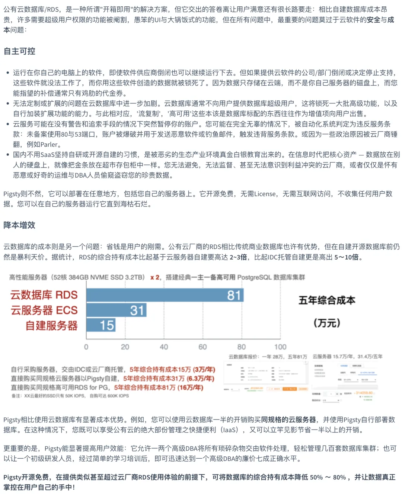
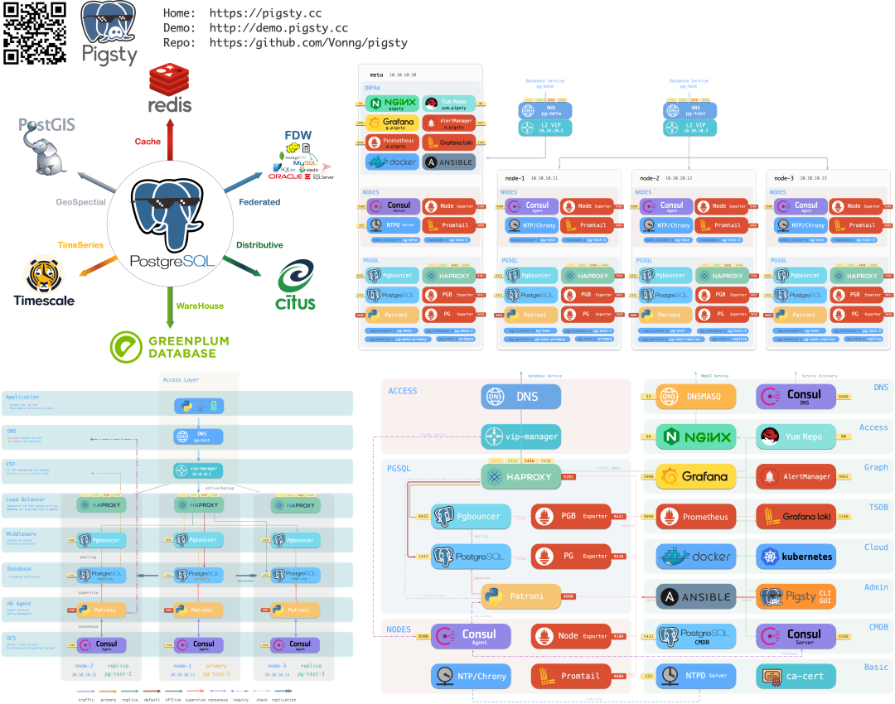
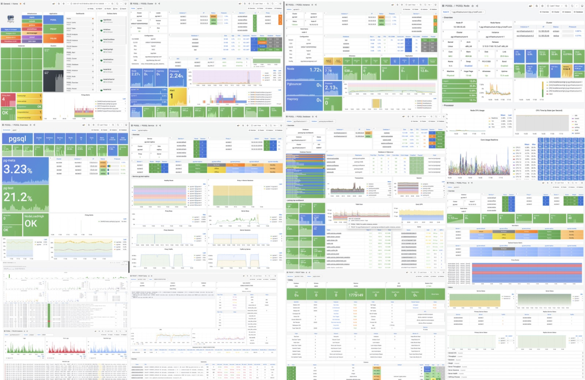
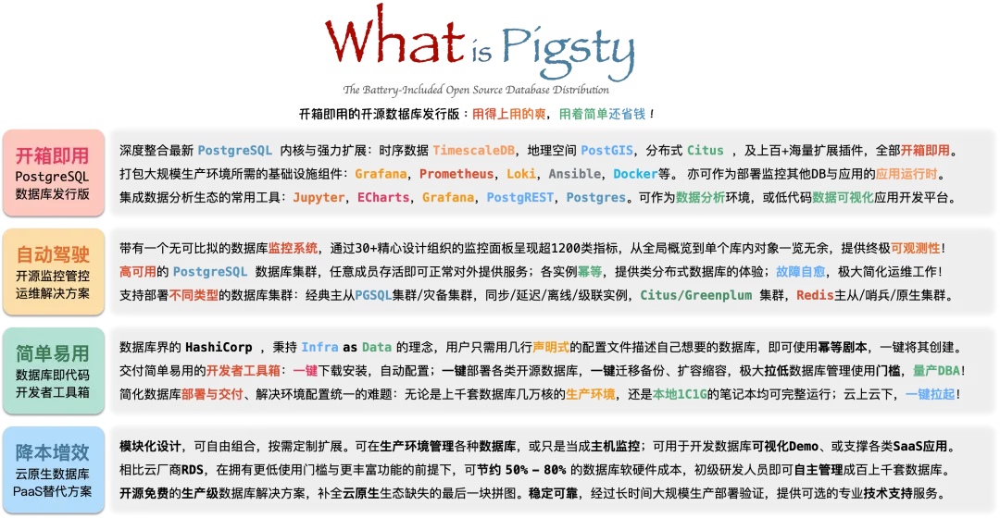

蚂蚁金服有过一个自嘲的段子：能干翻支付宝的，除了监管就是**DBA**了。

数字时代，数据是很多企业的核心资产，对于互联网/软件服务类企业更是如此。而负责保管这些数据资产的人，就是**DBA（数据库管理员）**。

想象一下所有账户余额和联系人全部丢失的场景，尽管发生概率微乎其微，即使是支付宝与微信，如果出现无法恢复的核心库删库事件，恐怕也只能吃不了兜着走了。

------------------

## 缘从何起？

> 软件吃世界，开源吃软件，云吞噬开源，谁来吞噬云？

很久很久以前，开发软件/信息服务需要使用非常昂贵的商业数据库软件：例如Oracle与SQL Server：单花在软件授权上的费用可能就有六七位数，加之相近的硬件成本与服务订阅成本。如果公司已经砸了成百上千万的钱在数据库软硬件上，那么再花一些钱雇佣一些专职专家来照顾这些昂贵且复杂的数据库，就是一件很自然的事情，这些专家就是DBA。

接下来事情出现了有趣的变化：随着PostgreSQL/MySQL这些开源数据库的兴起，公司们有了一个新选择：不用软件授权费用即可使用数据库软件，而它们也开始（不理性地）停止为数据库专家付费：维护数据库的工作被隐含在了研发与运维的附属职责中，而这两类人通常：既不擅长、也不喜欢、更不在乎照顾数据库的事情。直到公司的规模足够大，或者吃到足够的苦头之后，一些Dev/Ops才会培养出相应的能力来，不过这是相当罕见的事情。

接下来，云出现了。云实际上是一种运维外包，将DBA工作中属于运维部分，最具像化的部分给自动化了：高可用，备份/恢复，配置，置备。DBA仍然剩下很多事情，但普通麻瓜难以理解此类工作的价值，这部分职责依然静悄悄地落在了研发与运维工程师的身上。“不要钱” 的开源数据库可以让我们自由随意地使用数据库软件，因此随着微服务哲学兴起，用户开始给每个小服务弄一个单独的数据库，而不是很多应用共享一个巨大的中央共享数据库。在这种情况下，数据库被视作每个服务的一部分，可以更方便的把DBA的活推给研发了。

那么，云之后是什么？DBA还会是一份好的工作吗？

------------------

## 核心价值

很多地方都需要DBA：糟糕的模式设计，奇烂的查询性能，鬼知道有没有用的备份；等等等等。可惜的是，从事软件工作的人中，很少有人了解什么是DBA。成为DBA，意味着与研发人员创造的熵进行永无休止的战斗。

DBA，Database Administrator，数据库管理员，以前也叫做数据库协调员、数据库程序员。DBA是一个横跨于研发团队与运维团队的广博角色，涉及DA、SA、Dev、Ops、以及SRE的多种职责，负责各种与数据与数据库有关的问题：设置管理策略与运维标准，规划软硬件架构，协调管理数据库，验证表模式设计，优化SQL查询，分析执行计划，乃至于处理紧急故障以及抢救数据。

DBA的第一点价值在于**安全兜底**：他是企业核心数据资产的守护者，也是可以轻易对企业造成致命伤害的人。在蚂蚁金服有个段子，能搞死支付宝的，除了监管就是DBA了。高管们通常也很难意识到 DBA 对于公司的重要性，直到出了数据库事故，一堆CXO紧张地站在DBA背后观看救火修复过程时…。

DBA的第二点价值在于**性能优化**。许多公司并不在乎他们的查询是纯狗屎，他们只是觉得“硬件很便宜”，砸钱买硬件就好了。然而问题在于，一个调整不当的查询/SQL或设计不当的数据模型与表结构，可以对性能产生**几个数量级**的影响。总会在某一个规模，堆硬件的成本相比雇佣一个靠谱DBA的成本高得令人望而却步。实话说，我认为大多数公司在IT软硬件开销中花费最大的是：**开发人员没有正确使用数据库**。

优秀的DBA还会负责**数据模型设计与优化**。数据建模和SQL几乎已成为一门失传的艺术，这类基础知识逐渐为新一代工程师遗忘，他们设计出离谱的模式，不懂得正确地创建索引，然后草率得出结论：关系型数据库和SQL都是垃圾，我们必须使用糙猛快的NoSQL来省时间。然而人们总是需要可靠的系统来处理关键业务数据：在许多企业中，核心数据仍然是一个常规关系型数据库作为**Source of Truth**，NoSQL数据库仅用于非关键数据。

对于尚未进入PMF的初创企业，雇佣一个全职DBA是奢侈的行为。然而在一个大型组织中，一个好的DBA是至关重要的。不过好的DBA相当稀有，以至于这个角色在大多数组织中只能外包：包给专业的数据库服务公司，包给云数据库RDS服务团队，或者**内包**给自己的研发/运维人员。

------------------

## DBA的未来

许多公司都雇用DBA，DBA类似于Cobol程序员，除了科技公司/初创企业外：那些听上去不那么Fancy的制造业，银行保险证券、以及大量运行本地软件的党政军部门，也大量使用了这些关系型数据库。在可预见的未来，DBA在某个地方找工作是不会有什么问题的。

尽管数据库专家对于大型组织与大型数据库而言非常重要，不幸的是，DBA作为一份职业前景可能是晦涩暗淡的。大趋势是数据库本身会越来越智能，易用性越来越好，而各式各样的工具、SaaS、PaaS不断涌出，也会进一步压低数据库的使用门槛。公有云/私有云DBasS的出现更是让数据库的门槛进一步下降，只要掏钱就可以迅速达到优秀DBA的廉价七成正确水准。

数据库的专业技术门槛降低，将导致DBA的不可替代性降低：安装一套软件收费十几万，做一次数据恢复上百万的好日子肯定是一去不复返了。但对于开源数据库软件社区生态来说，却是一件好事：将会有更多的开发者有能力来使用它，并或多或少扮演着DBA的角色。

### **云会革了运维与DBA的命吗？**

无论是公有云厂商，还是以Kubernetes为代表的云原生/私有云，其核心价值都在于**使用软件，而不是人来应对系统复杂度**。那么，云软件会革了运维与DBA的命吗？

从长期来看，这类云软件代表着先进生产力的发展方向。对于云原生环境中成长起来的新一代开发者，对于他们来说K8S才是操作系统，底下的Linux、网络、存储都属于魔法巫术，成为极少数人才会关心的“底层细节”。大概就像现在我们作为应用研发人员，看待汇编语言指令集，摆弄内存扣字节差不多。但就像人工智能的三起三落一样：**过早追逐潮流的人不一定是先驱，而有大概率成为先烈**。

无论是系统管理员还是数据库管理员，管理员这个岗位消失的唯一方式是，它们被重命名为“DevOps Engineer”或SRE。云并不会消灭管理员，你可能需要更少的人手来打理这些云软件，但总归还是需要人来管理的：从整个行业的视角看，云软件的推广会让100个初中级运维（传统系统管理员）的工作岗位变成10个中高级运维岗位（DevOps/SRE），同样的事也有可能发生在DBA身上。例如，现在也出现了与SRE相对应的 **DRE**：**Database Reliability Enginee**r。

](dre.webp)

> Database Reliability

从另一方面来说，云RDS提供的性能与可靠性属于廉价七成正确的大锅饭，比起优秀专职DBA所精心照顾的本地数据库表现仍然相距甚远。云数据库就像IT中的每一轮炒作一样：东西很受欢迎，每个人都为玩具Demo着迷，直到将其投入生产。然后他们终于发现了时尚潮流的垃圾箱火灾是什么样的，并回头开始研究久经考验的真实技术。总是一样的，人工智能便是前车之鉴。

> 公有云RDS的两大核心问题：成本/自主可控

尽管DBA听上去是一个有着光辉历史与暗淡前景的行当，但未来仍未可知。天知道在几次恐怖的重大云数据库事故后，DBA会不会重新成为潮流呢？

------

## 做点什么？

**开源免费**的数据库发行版解决方案，也能让大批量研发/运维工程师成为合格的兼职DBA。而这就是我正在做的事情：**Pigsty —— 开箱即用的开源数据库发行版**， 上手即用，量产DBA。

> Pigsty 架构简介

> Pigsty监控界面概览

我是一个PostgreSQL DBA，但也是软件架构师与全栈应用开发者。Pigsty是我用软件来完成自己作为DBA的工作的一次尝试：它成功的完成了我大部分的日常工作：无可比拟的监控系统能为性能优化与故障排查预警提供扎实的数据支持，自动切换的高可用集群能让我在故障时游刃有余甚至睡醒了觉再慢慢处理，一键安装部署扩缩容备份恢复则将日常管理事务变为了零星几条命令的事。

> What is Pigsty

如果您想要使用PostgreSQL / Redis / Greenplum 等数据库，比起聘请昂贵稀缺的专职DBA，或使用费用高昂无法自主可控的云数据库，也许这是一个不错的替代选择。扫码加公众号与微信交流群了解更多。
