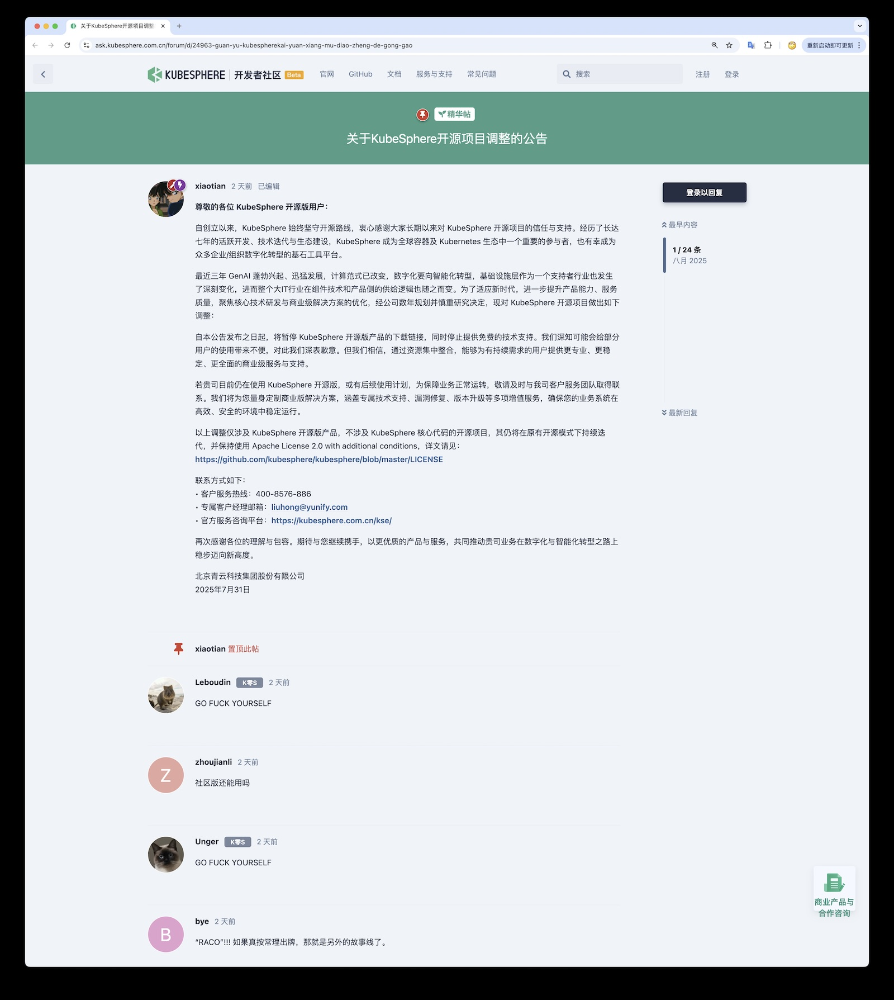
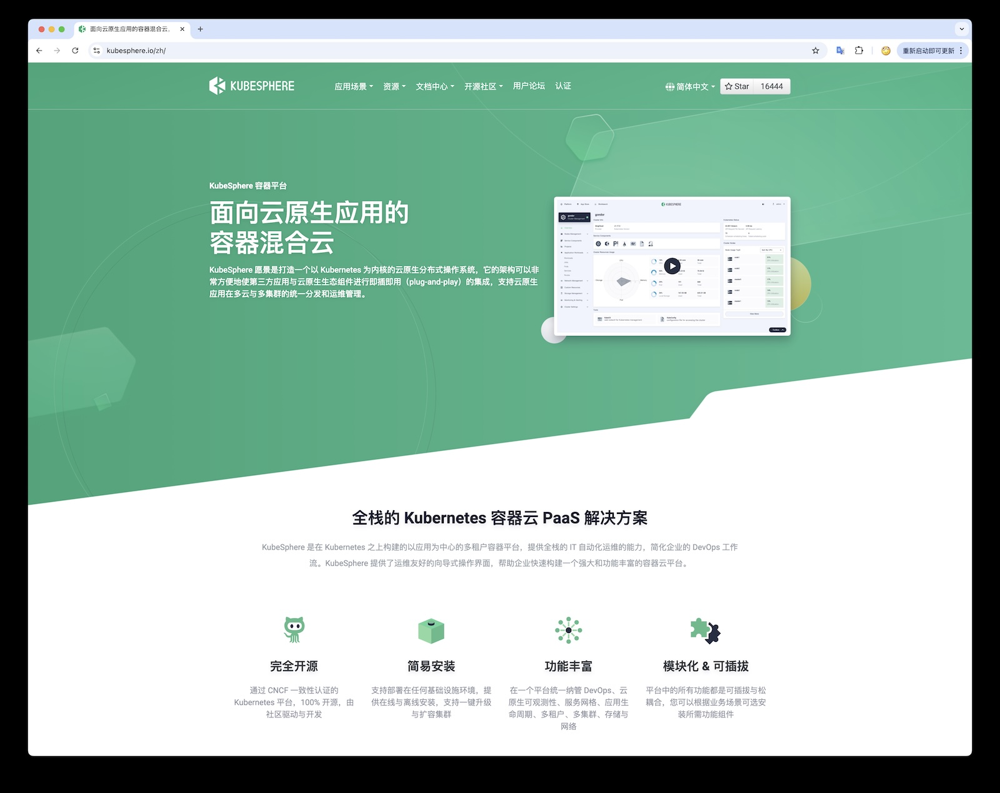
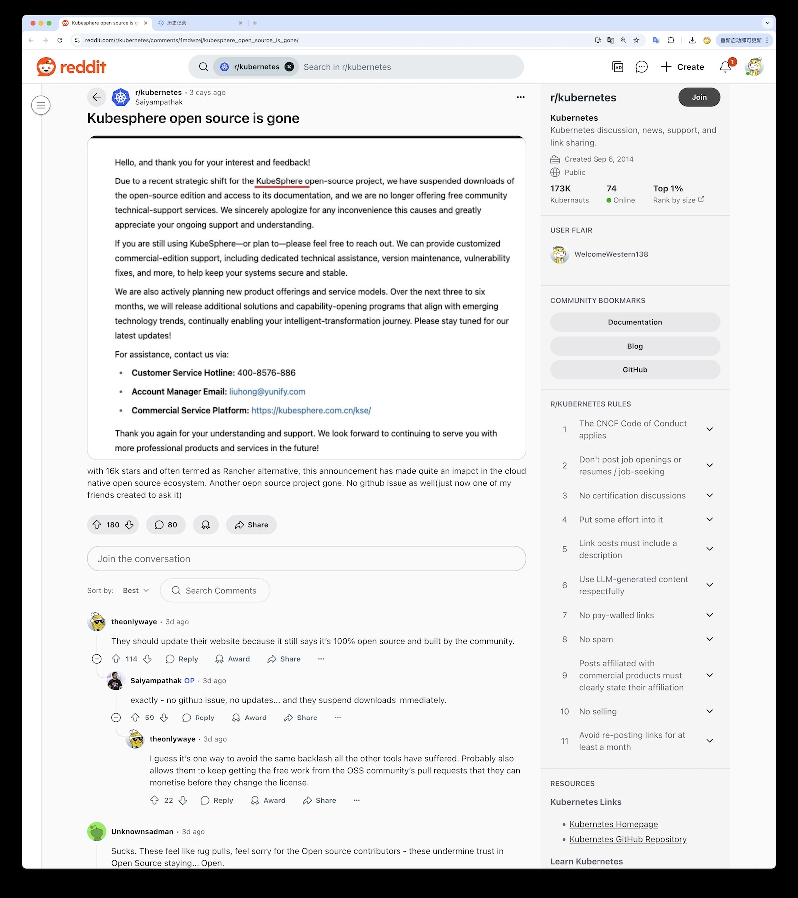
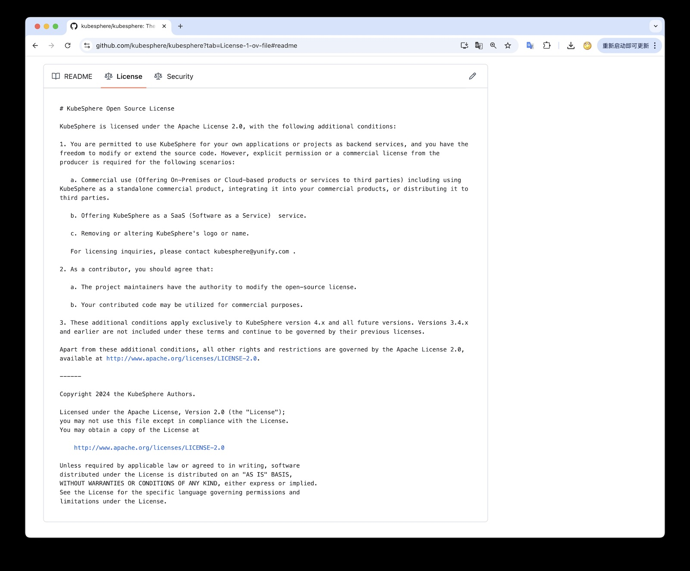
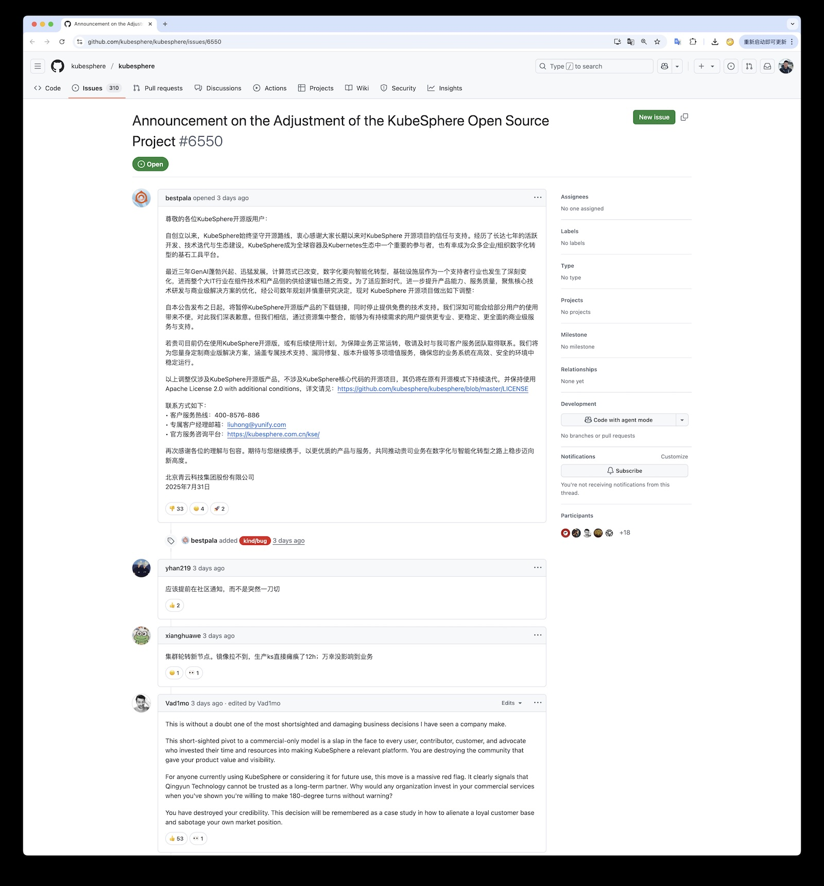
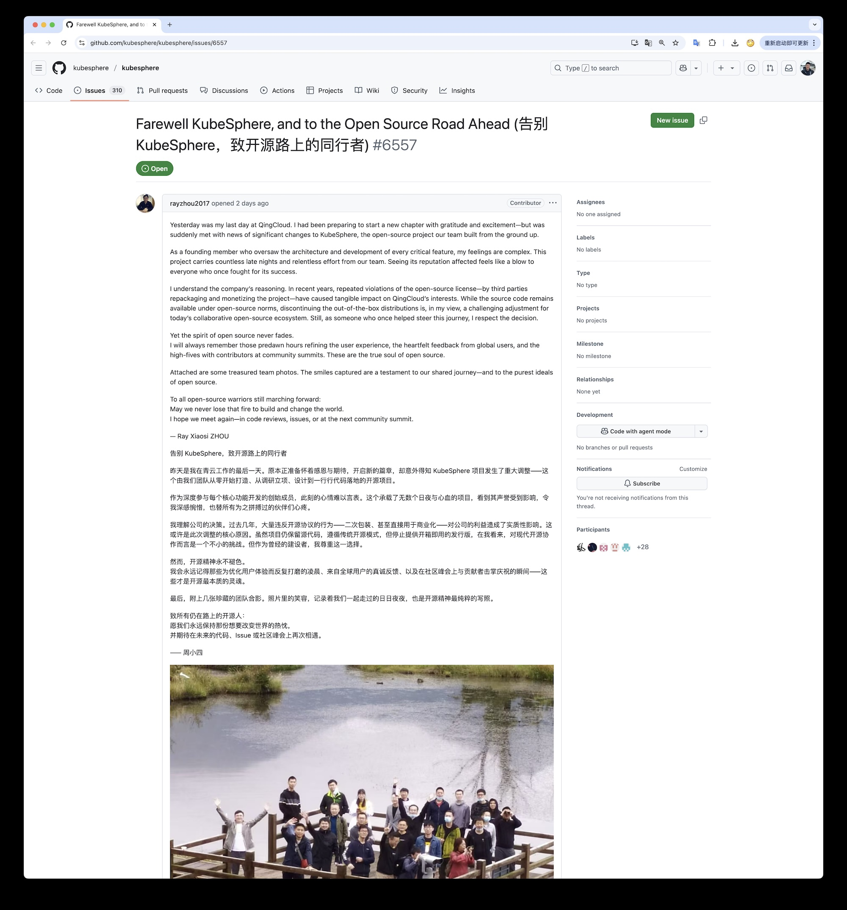
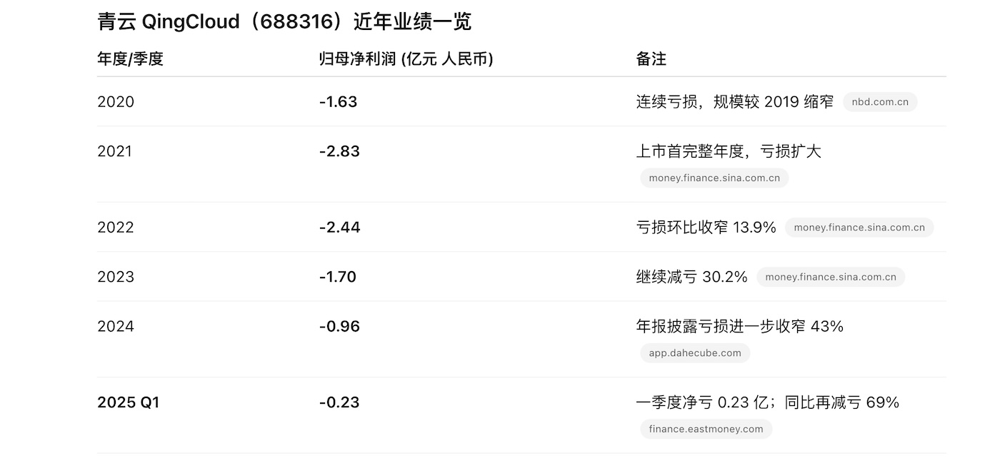

> KubeSphere Sudden Supply Cut: When Open-Source Trust Gets "Unplugged"

## A "Run" That Shocked the Cloud Native Circle

The day before yesterday, QingCloud announced **KubeSphere open source edition stops downloads and support**, requiring users to migrate to paid commercial versions. This was like a thunderbolt, awakening the community still immersed in open source dreams.

What's more shocking is that without warning or transition plans, overnight the official website documentation was taken down, image repositories were cleared, and forums and groups were filled with cries of anguish.
"They ran away! This is naked Rug Pull!" - open source project trust was instantly shattered.

## Former Star Project: What is KubeSphere

KubeSphere was born in 2018, open-sourced by QingCloud, and quickly grew into one of China's most prominent Kubernetes distributions, claiming to be "100% open source, built by the community together."
It added rich enterprise-needed features like **DevOps pipelines, microservice observability, app stores, multi-tenancy** to Kubernetes, providing an intuitive web console that lowered the barrier to container cloud usage through friendly interfaces.

With near-foolproof installation and full-stack functionality, KubeSphere gained favor from users in hundreds of countries globally, earning 16,000 GitHub Stars.
However, precisely because it was viewed as a star open source project in the K8S ecosystem, this sudden "supply cut" behavior is all the more heartbreaking.

## Background: Supply Cut and Run

This happened on August 1, 2025, when the KubeSphere team quietly posted an announcement on GitHub: "Effective immediately, suspend KubeSphere open source edition download links and stop providing free technical support." They also stated they would focus on commercial edition services to provide more professional and stable support.
What was even more unexpected was that this move came without warning: no prior issue notifications, no community discussions, just **overnight implementation**.

This move was like pulling the rug out from under users, triggering strong backlash. Many operations personnel discovered at dawn that deployment scripts failed to pull images, as KubeSphere's required container image repositories were directly removed by officials, nodes couldn't update, and production environments were affected -

Before the GitHub announcement was posted, there were no warnings; image repositories went directly offline, installation links were cleared, users reported inability to pull images, nodes couldn't update, production environments were affected - this is supply cut "断供", not some "transformation."

Amid shock and anger, furious users flooded GitHub with issues, requesting at least temporarily suspending resource removal and providing image backups.
There were rational suggestions for community handover maintenance, and emotional questioning of QingCloud's breach of faith, with "Go Fuck Yourself" voices echoing through comment sections.
The official response was to **lock discussion areas** and close issue comments - this isn't community governance, but corporate product control.

Community members' disappointment overflowed. One user lamented on Reddit: "Another open source project bites the dust. This feels like someone suddenly yanked the carpet out from under you, making open source promises instantly vanish."
Others mocked: "I'm glad I didn't use it, saving weeks of life from stepping into this 'open source fishing' trap." Within just days, KubeSphere went from cloud native star to public enemy, with community trust hitting rock bottom.

At first glance, KubeSphere's source code still hangs on GitHub, seemingly continuing to be "open source." However, closer examination reveals: **it's no longer truly an open source project**.
As early as 2024, QingCloud changed KubeSphere's license - nominally Apache 2.0, but with additional terms **prohibiting any unauthorized commercial use**, including providing it as a service, integrating into commercial products, or even removing logos.
This is equivalent to adding a lock after the Apache agreement, blocking competitors and commercial reuse.

This license **completely fails to meet open source definitions** (because it restricts commercial use and discriminates against usage methods), yet still wears Apache 2.0's cloak.
Unknowing users still think it's an open source project, but in reality, KubeSphere has definitionally become a "source available" project, not "open source."

## More Serious Than Closed Source is Trust Crisis

Some might ask: isn't this just closed-source commercialization? Why such outrage?
Actually, the anger triggered by this KubeSphere incident isn't fundamentally about **commercial transition** but about **trust collapse**.
Compared to conventional gentle approaches of announcing license changes in advance and gradually rolling out paid versions, KubeSphere chose the most extreme method: **hard supply cut** - withdrawing key resources without preparation.
This behavior is equivalent to breaking tacit agreements, **directly unplugging users' power cords**.

**Rug Pull style** infrastructure withdrawal is more betraying than simple closed-source. This adjustment mainly doesn't impact upstream developer communities but directly impacts downstream end-user communities.
In reality, most users don't need source code at all, but ready-to-use binary software products - those images in software repositories.

Open source project constitutions (licenses) do indeed require providing source code, and QingCloud does provide it. Licenses indeed don't promise obligations to provide binaries, packages, or software repositories beyond code.
But users trusted vendors and developers, treating them as upstream in their supply chains, as their dependencies, and this supply chain trust relationship was broken. "Supply cuts" became reality.

Trust building requires long years, but collapse happens overnight. This bad move almost **completely exhausted years of accumulated community credit**.
SUSE Cloud Native Department General Manager Peter Smalls stated: KubeSphere's sudden deviation from open source versions **destroyed the predictability and trust needed for open source ecosystems**.
A core founding member of KubeSphere (who announced departure from QingCloud the day before the announcement) also subtly acknowledged: recent years of third parties violating open source licenses, modifying and profiting from KubeSphere affected QingCloud's interests, but he also admitted "stopping open source distributions is a difficult adjustment for today's collaborative open source ecosystem."

## Why Did QingCloud Abandon Open-Source? Competition and Profit Dilemma

From QingCloud's official statements, they made this decision for multiple considerations.
The direct trigger appears to be **competitor intrusion** making QingCloud feel threatened.

As that departing employee said, third-party vendors using KubeSphere source code with minor modifications to launch their own solutions or even commercial services **infringed on QingCloud's interests**.
After all, QingCloud invested significant human and material resources developing features, only to have others freely take them for profit - anyone would feel aggrieved.

This "no upstream contribution" behavior is actually common in recent years - AWS once provided managed services for Elastic's open source code, forcing Elastic to change licenses; MongoDB, Redis, etc. all changed licenses for similar reasons.
For QingCloud, KubeSphere open source edition might have become competitors' "free lunch" while they lost potential customers.

**Revenue and survival pressure** may be the most important reason. Open source projects need continuous funding and team investment for long-term maintenance. QingCloud as a listed company ultimately must answer to financial reports and shareholders.
Unfortunately, QingCloud's performance hasn't been great in recent years, with many low-margin businesses cut, let alone open source R&D teams as "cost centers."

## Deceptive Open-Source Strategy for Conversion Guidance

From this perspective, QingCloud deserves sympathy. However, **understanding is understanding, but methods still have pros and cons**.
The problem isn't that QingCloud wants to make money, but that they adopted **the most damaging method to community and user trust** to achieve profitable transformation.

The logic behind this is thoroughly analyzed by Tison in "[Deceptive Open-Source Strategy for Conversion Guidance](https://mp.weixin.qq.com/s/HsgoUoBzsyXSmDfV00DlgQ)":
**Under current commercial environments, enterprises trying to directly profit from selling open source software is almost impossible - once facing commercial competition, they can't sustain**.
Therefore, they often use open source as early customer acquisition and reputation-building means. Once user base and visibility rise, but they discover competitors can "freeload," they quickly change licenses and close gaps.
At this point, open source has served them well - reputation gained, users acquired, software polished - but interests can no longer let others hitchhike.

KubeSphere precisely walked this path of deceptive open source followed by sharp commercial turn. It first won community trust and widespread deployment through Apache 2.0 open source,
then secretly changed licenses in 2024 with restrictions as groundwork, finally completely closing distributions in 2025 for full commercial monetization.

One netizen joked: "Look at their website still boasting 100% open source community building, yet secretly prepared for 9 months just waiting for this moment to ditch the community."
This behavior makes one sigh: **open source has been completely consumed by some enterprises**, ultimately becoming a marketing tool. When open source becomes bait, communities inevitably taste bitter fruit.

## Old Feng's Commentary

Old Feng maintains an open source PostgreSQL distribution [Pigsty](https://pgsty.com) with over 200 PG extensions, several PG branch kernels and tools, plus a nearly 3000-member open source community.
Old Feng also started companies, received investments, attempted commercial versions and enterprise edition sales, but ultimately liquidated and shut down.
Now returning to individual contractor and independent open source contributor status, not selling software but purely relying on professional consulting and service subscriptions, actually achieving stable profits, thriving business, time freedom, and happily contributing to open source.

Old Feng believes the soul core of the open source movement is "**software freedom**" - or we can use Chinese characteristics expression: "autonomous and controllable."
Unfortunately, freedom isn't free - in fact, quite the opposite - **freedom is a very expensive top-tier luxury**.

Poor people can only take care of themselves; wealthy ones benefit the world. If enterprises and individuals can't make money and survive, what open source work can they do? Charity and public welfare also require measuring one's capabilities.
Those truly capable of good open source work are either money-independent hobby-driven people, those comfortable in big companies with conditions for free exploration, or those with Nordic-style social safety nets as backup.
DeepSeek also relied on quantitative trading profits to have leisure time for AI large models.

For enterprises, don't think of open source as a "marketing customer acquisition" tool - treating it as a gift you give to the world and community is more appropriate.
You contribute to communities and give gifts, community trust gradually builds through bit-by-bit cultivation. Intentional flower planting may not bloom; unintentional willow insertion creates shade. Money-making business will come knocking.

Old Feng helps many developers build and distribute their tools and extensions, currently becoming the most comprehensive extension repository in the PG ecosystem.
The PostgreSQL kernel developer community also found me, hoping I'd help test PG multi-threaded version extension compatibility.
Some PostgreSQL vendors (Omnigres, AutoBase) also became Pigsty's supply chain downstream, with many ISVs using Pigsty for delivery.
Even Oracle Cloud SAs use Pigsty to deliver PostgreSQL services to their customers on OCI.

> Yes, although Old Feng has been firing at clouds, this doesn't violate AGPLv3 licensing

This deep participation in global software supply chain networks is the greatest significance of participating in open source - condensing synergy and consensus, creating greater value.
Maybe someday, Pigsty will naturally become the Debian or Ubuntu of the PostgreSQL world, or some kind of standard.

KubeSpace originally had the opportunity to become a very competitive open source distribution in the Kubernetes world, but unfortunately, QingCloud's short-sightedness destroyed this.
Fortunately, China still has [SealOS](https://sealos.io/) as an alternative.
My friend and schoolmate Boss Fang quickly launched migration tutorials from KubeSphere to SealOS, and I believe he can be more sustainable.

## Reference Reading

[KubeSphere Open-Source Project Adjustment Announcement](https://ask.kubesphere.com.cn/forum/d/24963-guan-yu-kubespherekai-yuan-xiang-mu-diao-zheng-de-gong-gao)

[Understanding KubeSphere's "Turn" But Regretting It Didn't Say Goodbye Properly](https://jimmysong.io/blog/kubesphere-opensource-exit)

[The Register: Another one bites the dust as KubeSphere kills open source edition](https://www.theregister.com/2025/08/01/kubesphere_open_source_edition)

[Farewell KubeSphere, To Fellow Travelers on the Open-Source Road](https://github.com/kubesphere/kubesphere/issues/6557)

[Night Sky Book #62 Deceptive Open-Source Strategy for Conversion Guidance](https://mp.weixin.qq.com/s/HsgoUoBzsyXSmDfV00DlgQ)

[Golden House #2 Should I Open-Source My Product?](https://mp.weixin.qq.com/s/HsgoUoBzsyXSmDfV00DlgQ)

[Understanding KubeSphere's "Turn" But Regretting It Didn't Say Goodbye Properly](https://mp.weixin.qq.com/s/YlAxMf3ezvKVmS_5P7pFQQ)