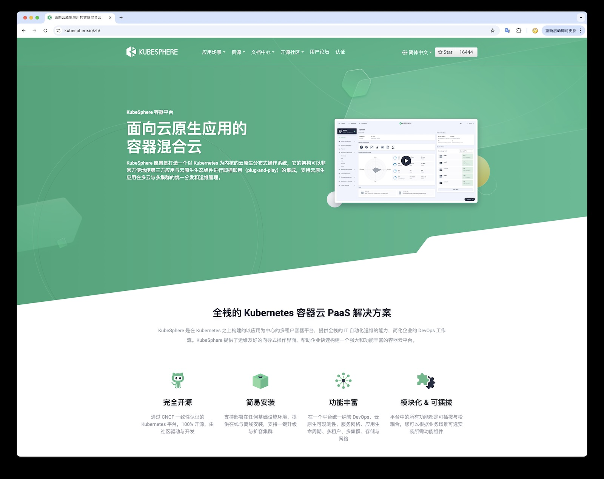
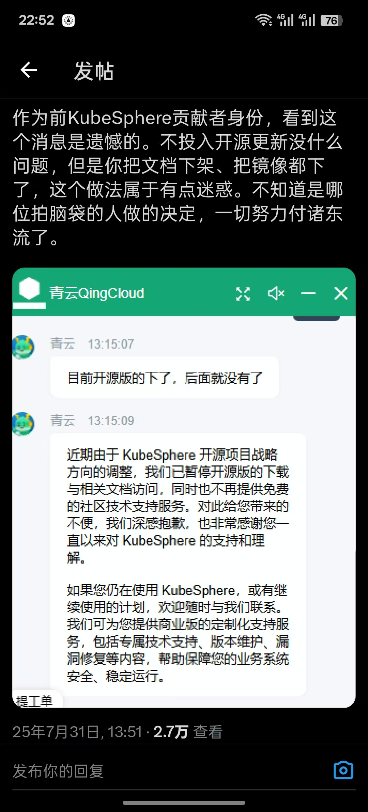
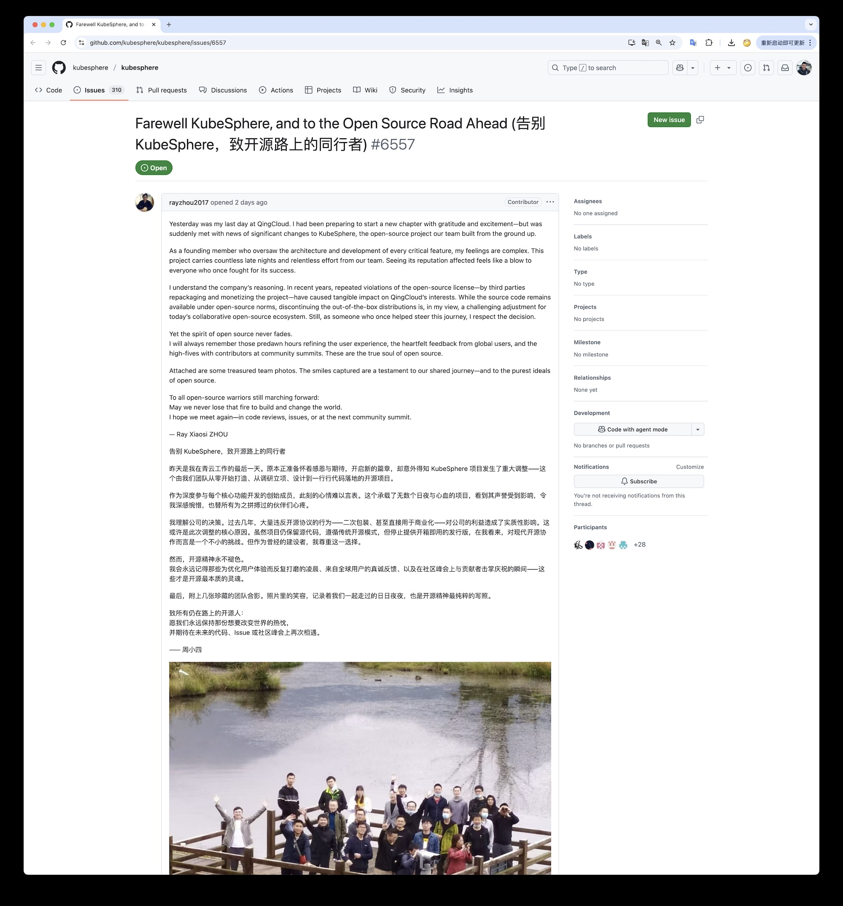

> KubeSphere 突然断供：当开源信任被“拔网线”

## 一次震惊云原生圈的“跑路”

前天青云科技宣布 **KubeSphere 开源版停止下载和支持**，用户被要求转向收费商业版。这仿佛一记闷雷，炸醒了还沉浸在开源美梦中的社区。

更让人震惊的事，在没有预警，没有过渡方案的情况下，一夜之间官网文档下架、镜像仓库清空，论坛和群里哀鸿遍野。
“跑路了！这是赤裸裸的 Rug Pull（卷款跑路）！” —— 开源项目的信任被瞬间击垮。

## 曾经的明星项目：KubeSphere 是什么

KubeSphere 诞生于 2018 年，由青云科技开源推出，很快成长为国内最受瞩目的 Kubernetes 发行版之一，号称“100% 开源，由社区共同打造”。
它为 Kubernetes 增加了企业所需的**DevOps流水线、微服务观测、应用商店、多租户**等丰富功能，提供了直观的 Web 控制台，通过友好界面降低了容器云的使用门槛。

凭借近似傻瓜化的安装和全栈功能，KubeSphere 获得全球上百个国家用户的青睐，GitHub 有这 1万6的 Star 数。
然而，正因为它曾被视作 K8S 生态开源的明星项目，这次突然“断供”的行为才更显得刺痛人心。

## 前情提要：断供跑路

事情发生在 2025年8月1号，KubeSphere 团队在 GitHub 悄然发布公告：“即刻起暂停 KubeSphere 开源版下载链接，停止提供免费技术支持”。 同时他们表示将专注商业版服务，以提供更专业稳定的支持。
更让人意外的是，此举毫无征兆：之前既无 issue 通知，也无社区讨论，就这样**隔夜生效**。

此举犹如釜底抽薪，引发用户强烈反弹，许多运维凌晨发现部署脚本拉取镜像失败，KubeSphere 所需的容器镜像仓库直接被官方移除，节点无法更新，生产环境受到影响 ——
在 GitHub 的公告发出之前，没有任何预警；镜像仓库直接下线、安装链接清空，用户反馈拉不动镜像、节点无法更新、生产环境受影响 —— 这是卡脖子 “断供”，而不是什么 “转型”。

震惊之余，愤怒的用户涌向 GitHub 提 Issue，请求至少暂缓撤下资源、提供镜像备份。
有理性的建议交接社区维护，有情绪的质问青云失信，评论区 “Go Fuck Yourself” 的声音不绝于耳。
官方的回应则是**锁定了讨论区**，关闭了 Issue 评论 —— 这不是社区治理的方式，而是企业控制产品的方式。

社区成员的失望溢于言表。一位用户在 Reddit 上哀叹：“又一个开源项目凉了。这感觉就像被人猛地抽走了地毯，开源承诺瞬间化为乌有”
也有人嘲讽：“我很庆幸没用它，省下了几周人生不必再踩这种‘开源钓鱼’的坑”。短短几天内，KubeSphere 从云原生领域的明星沦为众矢之的，其社区信任度跌至谷底。

乍看之下，KubeSphere 的源代码仍然挂在 GitHub 上，似乎“开源”仍在继续。然而稍加深究就会发现：**它早已不是真正的开源项目**。
早在 2024 年，青云就为 KubeSphere 更换了许可证 —— 标称 Apache 2.0，但附加了额外条款，**禁止任何未经授权的商业使用**，包括将其作为服务提供、集成进商业产品、甚至禁止去除 Logo 等
这等于在 Apache 协议后面加上了一把锁，把竞争对手和商业重用的路堵死。

这种许可证**完全不符合开源定义**（因限制了商业用途，歧视使用方式），却还披着 Apache2.0 的外衣，
不明就里的用户还以为它是个开源项目，实际上，KubeSphere 从定义上已经变成了“源码可用”项目，而非“开源”项目。

## 比闭源更严重的是信任危机

有人会问：不就是闭源商业化吗，至于如此群情激愤？
其实，这次KubeSphere事件引发的愤怒， 根本不在于**商业化转向**，而在于**信任塌方**。
相比那些提前宣布更改许可证、逐步推出收费版本的常规温和做法，KubeSphere 选择了最激烈的一种：**硬卡脖子式的断供** —— 在毫无准备的情况下撤走关键资源。
这种行为相当于违背默契，**直接拔掉了用户赖以运行的电源插头**。

**Rug Pull 式** 抽逃基础设施，比起单纯闭源更具背叛感。这次调整，冲击的主要还不是上游的开发者社区，而是直接冲击了下游的终端用户社区。
实际上绝大多数用户需要的根本不是源代码，而是开箱即用的二进制软件制成品，也就是放在软件仓库里的那些镜像。

开源项目的宪法章程（许可证）确实在规定了需要提供源代码，青云也确实提供了，许可证也确实不会承诺说他们有义务提供代码之外的二进制，软件包，软件仓库。
但用户信任厂商与开发者，将他们作为自己的供应链上游，作为自己的依赖，而这里的供应链信任关系被打破了。“卡脖子” 成了真实发生的事情。

信任建立需要漫长岁月，崩塌却只在一夜之间。这一步臭棋几乎 **彻底耗尽了社区多年来积累的信用**。
SUSE 云原生部门总经理 Peter Smalls 就表示：KubeSphere 如此突然地背离开源版，**破坏了开源生态所需的可预测性和信任**
KubeSphere 核心初创成员（在公告发布前一天宣布从青云离职）也含蓄地承认：近年来第三方违反开源许可证、改造并牟利 KubeSphere 的行为影响了青云利益，但他也坦言“停止开源发行版对当今协作的开源生态来说是艰难的调整”

## 青云为何放弃开源？竞争与盈利的两难

从青云官方的表态来看，他们做出这一决策有多重考量。
直接导火索看上去是，**竞争对手的侵入**让青云感受到威胁。

正如那位离职员工所说，第三方厂商利用 KubeSphere 源码稍作修改就推出自己的解决方案甚至商业服务，**侵犯了青云的利益** 
毕竟青云投入大量人力物力开发的功能，被他人免费拿去牟利，任谁都会心有不甘。

这种“不向上游回馈”的行为，其实近年来屡见不鲜——AWS 曾经把 Elastic 的开源代码提供托管服务，迫使 Elastic 改协议；MongoDB、Redis 等也都因类似原因修改了许可)。
对青云来说，KubeSphere 开源版可能已经成了竞争对手的“免费午餐”，自己反而丢失了潜在客户。

**营收和生存压力**可能是最重要原因。开源项目要长久维系，背后需要持续的资金和团队投入。青云作为上市公司，终究要对财报和股东负责。
不幸地是最近几年青云的业绩并不如人意，许多低毛利的业务都砍掉了，更别提开源研发团队这种 “成本中心” 了。

## 诱导转向的伪开源战略

从这个角度看，青云值得同情。然而，**理解归理解，方式仍有优劣**。
问题不在于青云要赚钱，而在于采取了 **最伤害社区与用户信任的方式** 来实现盈利转向。

这背后的逻辑，Tison 在《[诱导转向的伪开源战略](https://mp.weixin.qq.com/s/HsgoUoBzsyXSmDfV00DlgQ)》一文中分析得很透彻：
**在现有商业环境下，企业要直接靠卖开源软件赚钱几乎不可能，一旦遇到商业竞争就会撑不住**。
因此它们往往把开源作为前期获客和打名气的手段，等用户群和知名度起来了，却发现竞争对手可以“坐享其成”，就赶紧改协议、收口子。
这时候开源对他们来说，名声赚到了，用户有了，软件也打磨好了，但利益不能再让别人搭便车了。

KubeSphere 正是走上了这样一条诱导开源再急转商业的路。它先通过 Apache 2.0 开源赢得社区信任和广泛部署，
然后在 2024 年暗搓搓改许可证加限制，埋下伏笔，终于在 2025 年彻底关闭发行版、全力商业变现。

一位网友调侃道：“看看它官网还吹嘘 100% 开源社区打造，却背地里准备了9个月，就等这一刻甩开社区”。 
这种行为不禁令人感叹：**开源二字被某些企业消费殆尽**，到头来变成了一种营销手段。 当开源成了诱饵，社区终究会尝到苦果。

## 老冯评论

老冯维护着一个开源 PostgreSQL 发行版 [Pigsty](https://pgsty.com)，两百多个 PG 扩展，好几个 PG 分支内核与工具，同时还有一个近三千人的开源社区，
老冯自己也开过公司拿过投资，尝试过打造商业化，企业版销售，最后清算清盘了。
现在回归个体户与独立开源贡献者，不卖软件，纯靠专业咨询与服务订阅，反而稳定盈利，蒸蒸日上，时间自由，可以开开心心的搞开源。

老冯觉得，开源运动的灵魂内核是 “**软件自由**”，当然我们也可以用中国特色的表述 —— “自主可控”。
不幸的是，自由并不是免费的，事实上正好相反 —— **自由是非常昂贵的顶级奢侈品**

穷者独善其身，达则兼济天下，如果企业和个人都赚不到钱活不下去，来搞什么开源？ 做慈善和公益也要衡量自己的实力才行。
有能力真正做好开源的，要么是那种不差钱兴趣爱好驱动的人，在宽松大厂舒舒服服有条件自由探索的人，或者是北欧那种社会安全网提供了兜底的人。
Deepseek 也是靠量化赚的钵满盆翻，才有余闲去折腾 AI 大模型的。

对于企业来说，不要想着把开源当成一种 “营销获客” 的手段，把它当成一份你送给世界，送给社区的礼物会更合适。
你给社区做贡献，送礼物，社区的信任则在点滴浇灌之间逐渐培育起来，有心栽花花不开，无心插柳柳成荫，赚钱的生意会找上门来。

老冯帮助许多开发者构建分发他们的工具与扩展，目前已经成为了 PG 生态中收录扩展最多最全的仓库。
PostgreSQL 内核开发者社区也找到我，希望我帮助测试 PG 多线程版本下的扩展兼容性。
一些 PostgreSQL 供应商（Omnigres，AutoBase）也成为了 Pigsty 的供应链下游，许多 ISV 也使用 Pigsty 去做交付。
甚至 Oracle 云的 SA，也使用 Pigsty 在 OCI 上向他们的客户交付 PostgreSQL 服务。

> 啊是的，虽然老冯一直都在对云开火，但他们这样并不违反 AGPLv3 许可

这种深度参与全球软件供应链的关系网络，才是参与开源的最大意义 —— 凝聚合力与共识，产生更大的价值。
也许有一天，Pigsty 就会自然成为 PostgreSQL 世界里的 Debian 或者 Ubuntu，或者某种标准。

Kubesphere 本来有机会成为 Kubernetes 世界中一个很有竞争力的开源发行版，但很可惜的是，青云的短视毁掉了这些。
不过好在国内还有一个 [SealOS](https://sealos.io/) 可以作为替代，
我的朋友与校友方老板很迅速的推出了从 KubeSphere 迁移到 SealOS 的教程，我相信他一定能更持久。

## 参考阅读

[关于KubeSphere开源项目调整的公告](https://ask.kubesphere.com.cn/forum/d/24963-guan-yu-kubespherekai-yuan-xiang-mu-diao-zheng-de-gong-gao)

[理解 KubeSphere 的“转身”，但遗憾它没有好好告别](https://jimmysong.io/blog/kubesphere-opensource-exit)

[The Register: Another one bites the dust as KubeSphere kills open source edition](https://www.theregister.com/2025/08/01/kubesphere_open_source_edition)

[告别 KubeSphere，致开源路上的同行者](https://github.com/kubesphere/kubesphere/issues/6557)

[夜天之书 #62 诱导转向的伪开源战略](https://mp.weixin.qq.com/s/HsgoUoBzsyXSmDfV00DlgQ)

[黄金屋 #2 我应该将产品开源吗？](https://mp.weixin.qq.com/s/HsgoUoBzsyXSmDfV00DlgQ)

[理解 KubeSphere 的“转身”，但遗憾它没有好好告别](https://mp.weixin.qq.com/s/YlAxMf3ezvKVmS_5P7pFQQ)

