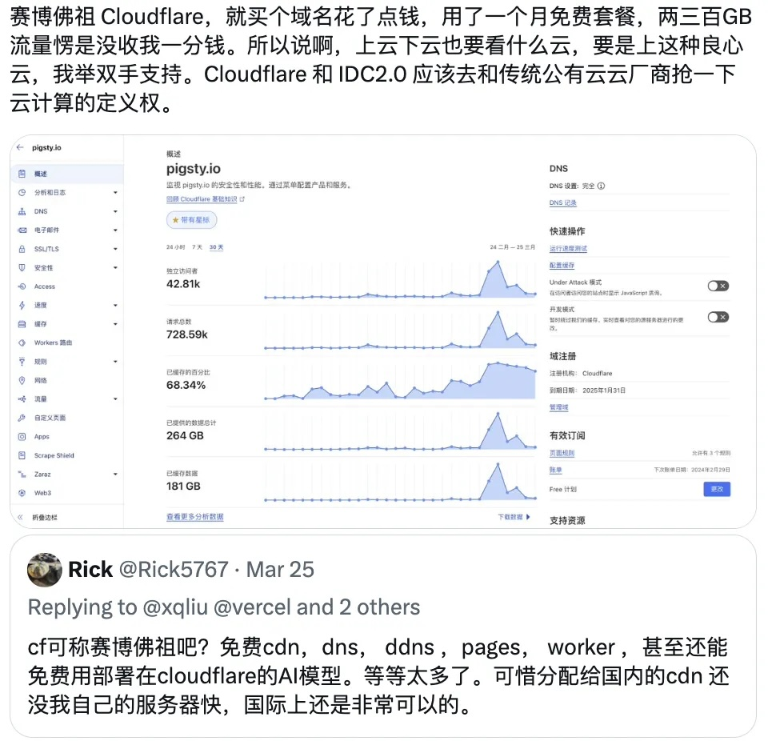

Luo Yonghao was once a brilliant digital product manager with decent IT industry credentials. But as they say, there's a world of difference between industries. Luo selling cloud is like a street vendor simultaneously hawking meat, vegetables, eggs, milk, and Office CDs. And that's exactly what happened — Luo's livestream first spent half an hour selling robot vacuums, then Luo himself belatedly appeared to read scripts selling "cloud computing" for forty minutes — before transitioning to selling Colgate enzyme-free toothpaste — leaving viewers bewildered between cloud computing and toothpaste.

> This toothpaste is actually pretty good, but these cloud servers...

---------------

## Can Cloud Computing Go B2C?

Cloud computing is a B2B business. Industry leader AWS clearly targets and markets to enterprise developers. While some individual webmasters, bloggers, students, or startups might impulsively purchase cloud servers during livestreams for low prices, this is obviously absurd. Even more absurd is that cloud servers in the livestream weren't even cheaper — the 99 yuan cloud server promotion [has been running continuously since last year's Double 11](https://mp.weixin.qq.com/s/Nh28VahZkQMdR8fDoi0_rQ)...

The ridiculous idea of selling cloud servers to individual users might stem from the recent popularity of *Palworld* self-hosted server demands. My friend Fangtao, founder of SealOS, wrote a tutorial on "[Setting Up a Private Palworld Server](https://mp.weixin.qq.com/s/Org8pee_cxGkzOYsMFu6sA)" and tasted the delicious profits of SaaS. Then various public cloud vendors quickly followed suit and started competing — going from 3-minute server deployment to 30 seconds to 3 seconds. As described in the article "[Domestic Cloud: Big Companies, No Big Brother]()," they shamelessly rolled up their sleeves and got into the business that should belong to gaming platforms like Haofang.

Another typical B2C scenario involves students and individual webmasters. In the past, individual webmasters running websites on small 2C 2G VMs with 3M bandwidth was quite decent — but since the arrival of Cloudflare, the cyber Buddha, forget about 99 yuan cloud servers, even 9.9 yuan isn't attractive anymore — **how can anything be cheaper than free?** — not to mention that using CF for website building provides a much better experience than cloud servers — even without considering various free plans, just the free traffic alone makes those "few megabytes of gifted bandwidth" look like garbage...

On one side of the IT scale spectrum — individual webmasters and small businesses — new-generation cloud services/SaaS (CF, Neon, Vercel, Supabase), these cyber bodhisattvas' free tiers, are clearly displacing and impacting public clouds. On the other side — medium and large enterprises — the emerging IDC 2.0 and open-source management software alternatives work together to bypass public cloud middlemen, leveraging [hardware Moore's law](https://mp.weixin.qq.com/s/1OSRcBfd58s0tgZTUZHB9g) accumulated advantages, becoming the [ultimate FinOps practice](https://mp.weixin.qq.com/s/Yp_PU8nmyK-NVq0clD98RQ), achieving [astonishing cost reduction capabilities](https://mp.weixin.qq.com/s/CicctyvV1xk5B-AsKfzPjw).

---------------

## Public Cloud Death Star Lights Up

The development of any industry generally follows the pattern: technology-driven → product-driven → operations-driven. Currently, except for large language models, public clouds have almost no unique technologies or irreplaceable products. Virtual machines, object storage, and cloud databases have become standardized commodities available from everyone, while open-source cloud management software like SealOS and Pigsty have popularized self-hosting capabilities. The industry has become a bloody ocean, moving from competing on technology and products to the endgame — competing on operations, which means [competing on sales and price wars](https://mp.weixin.qq.com/s/2w0bLJI7TvUNp1tzLYbvsA).

For cloud computing, B2C business is just mosquito legs. Let's roughly estimate — Palworld sold 20 million copies, with one-tenth being Chinese players; as a single-player game, assume another one-tenth of users need multiplayer; these few percent of local multiplayer users get tired within a month, ultimately generating demand for hundreds of thousands of core-months of cloud services, purchased from various cloud vendors A, B, C, D — each getting a market share of a few million. It sounds like a lot, enough to sustain a startup — but any enterprise cloud customer's annual spending, or a few programmers' salaries would equal this amount — this clearly isn't what cloud vendors should be doing.

The public cloud industry's growth has peaked. Previously overlooked mosquito legs have now become delicacies — major cloud vendors' revenue growth rates have dropped from dozens to single digits, barely sustained by GPU rentals and large models. But with no incremental market for the main business, market contraction has led to zero-sum games and brutal competition. Marketing has resorted to various ridiculous stunts — like [female college students buying servers for the first time](https://www.bilibili.com/video/BV1kp4y1o7mP), buying databases and getting Tmall supermarket vouchers, and the new phenomenon of selling cloud servers on Taobao livestreams.

Actually, Teacher Luo has an [excellent reputation as an industry barometer](https://mp.weixin.qq.com/s/fxOFHBrgqIbu1Sl_cJhwxA) — for whom does the death star light up, for whom do the bells toll? This performance art has the potential for self-fulfilling prophecy. Toothpaste Cloud has gradually transformed from representing advanced productivity as a domestic cloud computing leader to a computing resource provider only capable of price wars, [**having played itself into ruin**](https://mp.weixin.qq.com/s/BYu8nZjqAQbWc2yT8K_pFQ), which is indeed lamentable.