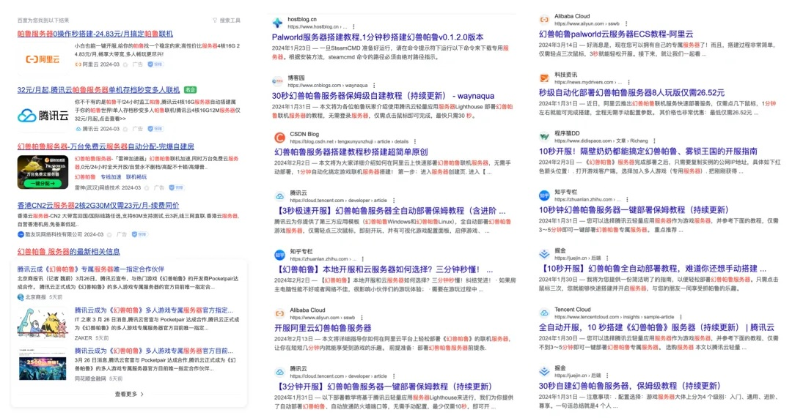
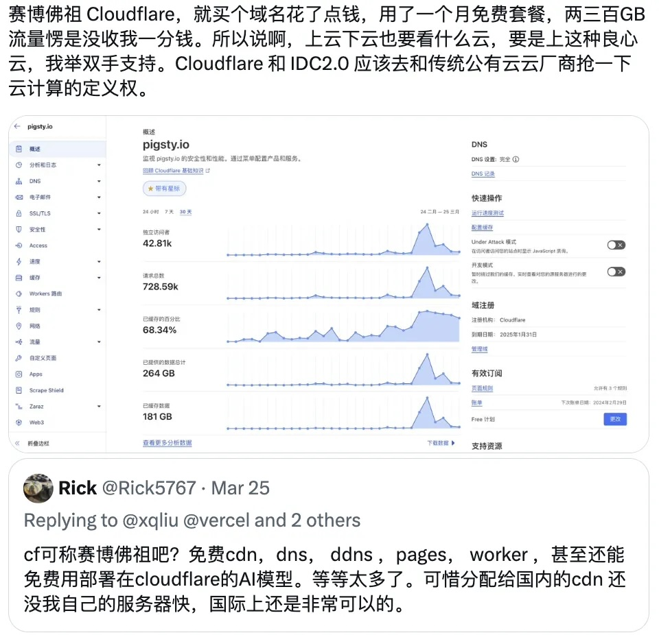

老罗曾是一位很牛B的数码产品经理，算与 IT 行业沾边。但隔行如隔山，老罗卖云，就好像同时卖肉菜蛋奶和 Office 光盘的路边摊。事实也是如此 —— 老罗直播间先铺垫卖了半个小时的扫地机器人，接着姗姗来迟的老罗照本宣科念台词卖了四十分钟”云计算“ —— 然后马不停蹄地卖起了 高露洁无水酵素牙膏 —— 留下在云计算与牙膏间迷惑凌乱的观众。

> 这牙膏确实还不错，但这云服务器嘛…

---------------

## 云计算可以2C吗？

云计算是 ToB 业务，行业翘楚 AWS 的服务对象和营销焦点，显然是面向企业级开发者的。尽管一些个人站长，博主，学生或初创企业可能会因为低价而在直播间拍板购买云服务器，但这显然非常滑稽。更滑稽的是直播间的云服务器也没有更便宜 ——  99 块钱的云服务器活动[从去年双十一就开始并持续至今](https://mp.weixin.qq.com/s/Nh28VahZkQMdR8fDoi0_rQ)……

把云服务器卖给个人用户这种滑稽想法，可能源于最近爆火的《幻兽帕鲁》自建服务器需求。我的朋友 SealOS 的创始人方海涛写了一篇《[自建幻兽帕鲁私服的教程](https://mp.weixin.qq.com/s/Org8pee_cxGkzOYsMFu6sA)》，尝到了泼天富贵 SaaS 的美味。然后各家公有云厂商也快速跟进卷了起来 —— 一路从3分钟开服到30秒到3秒种开服。正如 《[国内云：有大厂，没大哥]()》一文形容地那样，丝毫不顾颜面，撸起袖子下场，干起了浩方对战平台应该干的事情。

另一种 ToC 的典型场景是学生和个人站长。在以前，个人站长拿个 2C 2G 3M带宽的小虚拟机弄个网站还是挺不错的 —— 但是自从有了赛博佛祖 Cloudflare，别说 99 块钱的云服务器了，9块9 都不香了 —— **再便宜能便宜过免费吗？**  —— 何况用 CF 建站的体验比云服务器要好太多了 —— 都不用说各种Free Plan，就凭流量免费这一点，就足以让“送的几兆带宽”都统统变垃圾……

在 IT 规模光谱的一侧 —— 个人站长与小微企业上，新一代云服务/SaaS（CF，Neon，Vercel，Supabase），赛博菩萨们的免费套餐，对公有云产生了明显的替代与冲击；在光谱的另一侧 —— 中大型企业组织中，新出现的 IDC 2.0 与开源管控软件替代合流，短路掉公有云这个中间商，利用好[硬件摩尔定律](https://mp.weixin.qq.com/s/1OSRcBfd58s0tgZTUZHB9g)的累积优势，成为[终极FinOps实践](https://mp.weixin.qq.com/s/Yp_PU8nmyK-NVq0clD98RQ)，实现极为[惊人的降本增效能力](https://mp.weixin.qq.com/s/CicctyvV1xk5B-AsKfzPjw)。

---------------

## 公有云冥灯亮起

任何行业的发展基本都遵从：技术主导 → 产品主导→ 运营主导的脉络。而在当下，除了大模型之外，公有云几乎没有什么独一无二的技术，不可替代的产品了。虚拟机、对象存储、云数据库成为了各家都有售的标品大锅饭，开源的云管控软件比如 SealOS 与 Pigsty 也将自建的能力普及。行业卷成了一片血海，大家从拼技术、拼产品的阶段走向了终局 —— 拼运营，也就是[拼销售、打价格战](https://mp.weixin.qq.com/s/2w0bLJI7TvUNp1tzLYbvsA)的阶段。

对云计算来说，ToC 这种生意只能算蚊子腿。我们可以简单假设估算一下 —— 帕鲁爆卖了两千万份，十分之一中国玩家；作为单机游戏假设又有十分之一的用户有联机需求；这百分之几的本土联机用户一个月内玩腻，最后能产生个十几万核·月的云服务需求，分别从 A、B、C、D 等诸家云厂商采购 —— 每家分到个小几百万的市场规模。听上去不少，够养活一个创业公司了 —— 但随便一个云上 KA 企业客户年消，或者几个程序员工资就这个数了 —— 这显然不是云厂商应该干的事情。

公有云行业的增长已经到顶，原来看不上的蚊子腿，现在也变成了香饽饽 —— 各家云厂商的营收增速已经从原来的几十下降到了个位数，勉强靠着租GPU和大模型续了一口。但原本主营业务的增量市场没有了，市场萎缩，进入了零和博弈与斗兽厮杀阶段。营销也用出了各种荒腔走板草台班子的招数 —— 比如，[女大学生第一次买服务器](https://www.bilibili.com/video/BV1kp4y1o7mP)这种没品噱头，买数据库送天猫超市购物券这种滑稽戏，以及新出现的淘宝直播卖云服务器的新节目。

实际上，罗老师在 [行业晴雨表的能力上有着出色的的声誉](https://mp.weixin.qq.com/s/fxOFHBrgqIbu1Sl_cJhwxA)  —— 冥灯为谁而亮，丧钟为谁而鸣？这种行为艺术有着一语成谶的潜力。牙膏云逐渐从代表先进生产力的本土云计算领头羊，变成了只能够打价格战的计算资源提供商，[**自己把自己玩坏了**](https://mp.weixin.qq.com/s/BYu8nZjqAQbWc2yT8K_pFQ)，确实不禁让人嘘唏。

