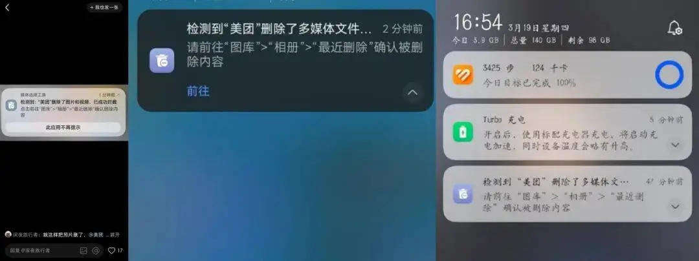
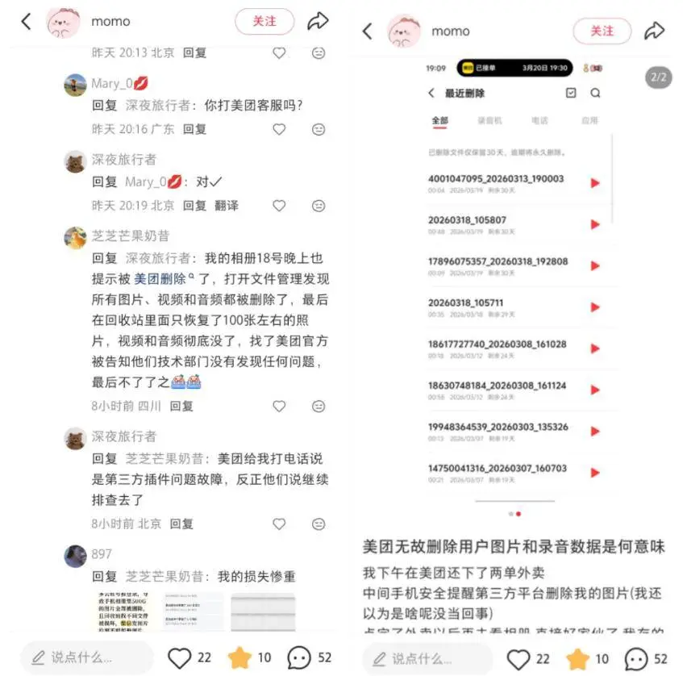
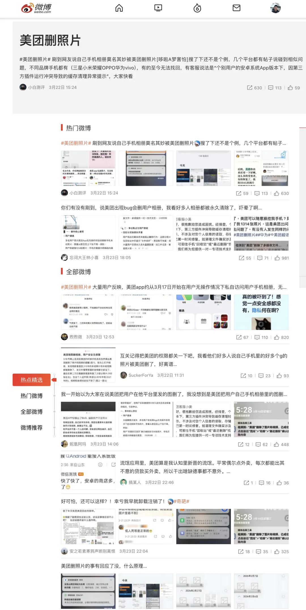
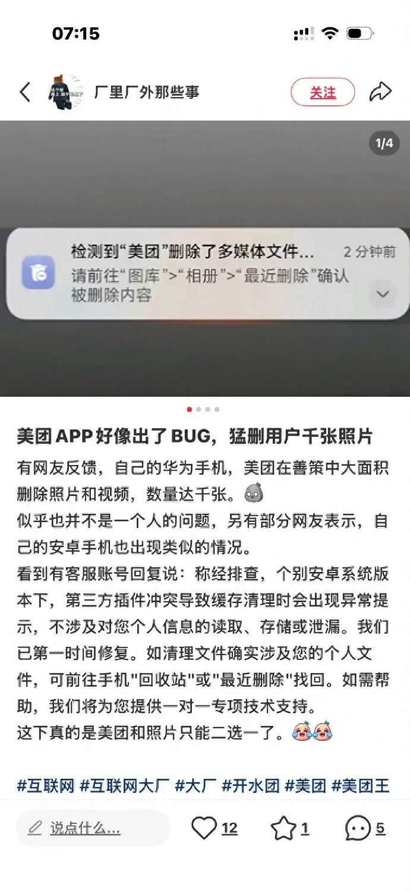
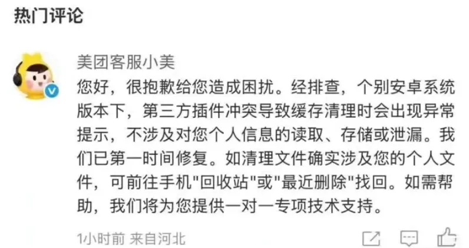

2026 年 3 月 18 日起，大量安卓用户发现自己的相册被美团清空。照片、视频、录音、PDF、Word，少则几百，多则上千。系统通知栏写得明明白白：**“检测到‘美团’删除了多媒体文件”**。有人 504 GB 数据永久丢失，6 年记忆不可恢复；也有人刚从回收站捞回来，过一会儿又被删了一遍。

随即，`#美团删照片#` 登上微博热搜。

美团随后发布说明，并把问题归因为“第三方插件冲突”。

美团客服的公开回应是这篇文章：《[美团客服回应删除用户手机中照片、数据：已第一时间修复，不涉及对个人信息的读取、存储或泄漏](https://mp.weixin.qq.com/s?__biz=MjM5MTI3MTY3Mg==&mid=2651588304&idx=4&sn=faed212e5a7802cd40c0460eb268104a&scene=21#wechat_redirect)》。

> “个别安卓系统版本下，第三方插件冲突导致缓存清理时会出现异常提示，不涉及对您个人信息的读取、存储或泄漏。已第一时间修复。”

这句话的问题在于，它试图把一次明显的权限事故，包装成一个无伤大雅的“异常提示”。

------

## 一、“第三方插件”的锅？

美团把锅甩给“第三方插件冲突”，这个说法挺滑稽的。不管是美团自己的代码在删，还是它集成的 SDK 在删，**向系统申请存储权限的主体是美团，执行删除的进程也是美团**。就算真是插件在删，作为总包，分包商闯了祸，业主找的也还是你。

况且，“缓存清理”这个说法在技术上也站不住脚。App 缓存在 `/sdcard/Android/data/com.meituan/`，用户照片通常在 `/sdcard/DCIM/` 和 `/sdcard/Pictures/`，这两类路径八竿子打不着。要删到用户相册，要么是路径判断写崩了，要么是直接调了系统媒体库的删除接口。无论哪种，都是代码级事故，不是“插件冲突”四个字就能交代过去的。

如果是 SDK 干的，说明集成测试和权限隔离没做好；如果是自己代码干的，那就更没什么可解释的了。

------

## 二、为什么美团能删你的照片

其实，Google 早就给出了解法。

Android 10 引入了 Scoped Storage（分区存储）：App 如果想删除不是自己创建的文件，系统会弹出确认对话框，必须由用户手动同意。Android 11 又补上了批量删除确认。也就是说，正常路线早就存在了。

到了 Android 13，Google 进一步引入了 Photo Picker。App 在选图时直接调用系统选择器，不需要拿整套存储权限。用户选哪张，App 才能访问哪张；用户不选，App 连原始文件都碰不到。

换句话说，如果美团老老实实用 Android 13 的 Photo Picker 去实现“评价上传照片”这类功能，它压根不需要拿到广泛的媒体访问能力，自然也就没有机会误删用户相册。

那为什么还是出事了？

因为国产 App 普遍不爱走这条路。它们更喜欢申请老式的大范围存储权限，或者通过等价手段拿到整个外部存储的读、写、删能力。Google Play 这几年一直在收紧这类权限的滥用，很多场景都要求改用 Photo Picker；但中国区 App 又不走 Google Play 分发，国内应用商店也不会替你卡这道门。

所以，这不是安卓系统的问题。Google 给了正确答案，也给了权限收紧的方向；真正的问题是，在中国安卓生态里，这套约束并没有被认真执行。Photo Picker 摆在那里，大厂不用；权限边界写在那里，商店不管。

对比一下 iOS。自 iOS 14 开始，用户就可以精确指定某个 App 只能访问哪些照片，而不是“全给”或“全不给”的二选一。操作上确实麻烦一些，但我宁愿麻烦一点，也不想把整个相册的生杀大权交给一个外卖 App。

------

## 三、这比“隐私泄露”更严重

泄露了，数据至少还在；这次更糟，是**数据毁灭**。几百 GB 的照片说没就没，文件损坏之后连恢复都未必做得到。

手机相册，很可能是普通人这辈子最重要的数据之一。婚礼、孩子、家人、旅行，这些东西不是重新下载一遍就能回来的。但在今天的安卓生态里，它却常常裸奔在手机上，只要一个 App 拿到了过大的存储权限，就有能力对它下手。

这件事我更倾向于相信是 Bug，而不是故意。但比 Bug 本身更严重的是，Bug 暴露出了整个生态的默认姿势：Google 给了 Photo Picker，大厂不用；商店拿着上架审核权，却不严格限制；用户点下“允许”时，也根本不知道自己交出去的究竟是什么。

**这个生态，该修了。**

------

## 参考

- [美团客服回应删除用户手机中照片、数据：已第一时间修复，不涉及对个人信息的读取、存储或泄漏](https://mp.weixin.qq.com/s?__biz=MjM5MTI3MTY3Mg==&mid=2651588304&idx=4&sn=faed212e5a7802cd40c0460eb268104a&scene=21#wechat_redirect)
- [IT 之家](https://www.ithome.com/0/931/988.htm)
- [知乎技术分析](https://www.zhihu.com/question/2019359659350254663)
- [凤凰网](https://tech.ifeng.com/c/8rihLy87wex)
- [搜狐](https://www.sohu.com/a/999496774_120506293)
- [Android Photo Picker 官方文档](https://developer.android.com/training/data-storage/shared/media)
- [Google Play 权限政策](https://support.google.com/googleplay/android-developer/answer/14115180)
