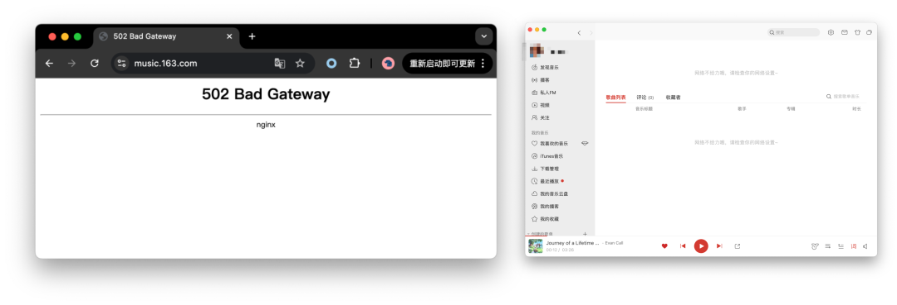
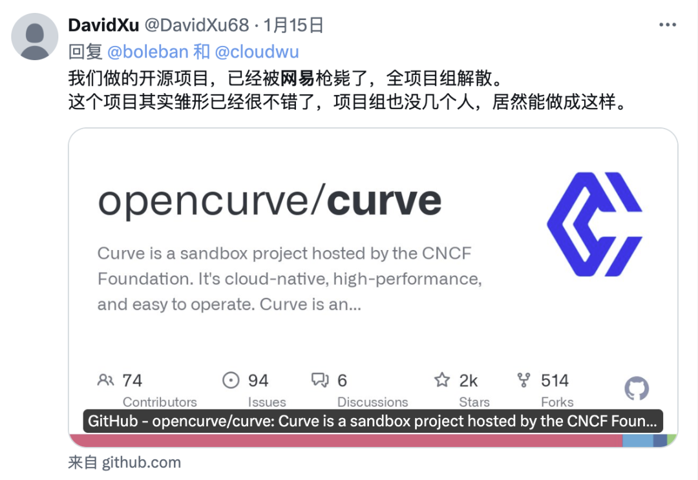
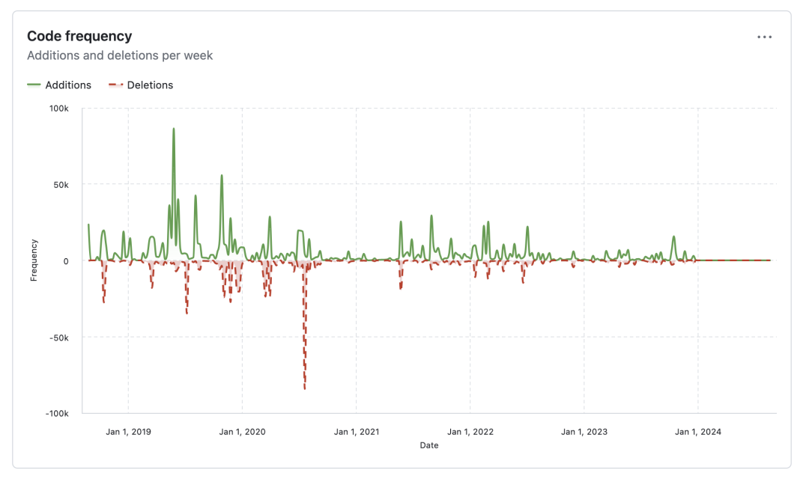
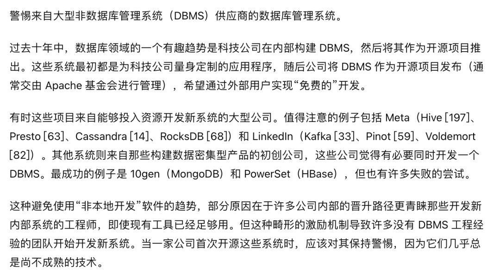

This afternoon around 14:44, NetEase Cloud Music experienced an [outage](http://mp.weixin.qq.com/s?__biz=MzU5ODAyNTM5Ng==&mid=2247488162&idx=1&sn=5913eb51b437e365c685ed11917a3302&chksm=fe4b2779c93cae6ff254f4568f3e7895e005ce249ab4e0e3111bf3665a54fed35b381ff55aa9&scene=21#wechat_redirect), recovering at 17:11. The rumored cause was **infrastructure/cloud/ disk storage** related issues.

------

## Incident Timeline

During the outage, NetEase Cloud Music clients could normally play offline downloaded music, but accessing online resources resulted in direct error messages, while the web version showed 502 server errors and was completely inaccessible.

During this period, NetEase's 163 portal also experienced 502 server errors and later redirected to the mobile version. Some users also reported that **NetEase News** and other services were affected.

Many users thought their internet was down when they couldn't connect to NetEase Cloud Music, leading some to uninstall and reinstall the app, while others assumed their company IT had blocked music streaming sites. Various comments quickly pushed this outage to Weibo trending topics:

The outage lasted until 17:11 when NetEase Cloud Music recovered, and the 163 main portal switched back from mobile to desktop version. The total outage duration was approximately two and a half hours — a P0 incident.

At 17:16, NetEase Cloud Music's Zhihu account posted an apology notice, stating that searching for "enjoy music" tomorrow would provide a 7-day Black Vinyl VIP **friend fee**.

------

## Root Cause Analysis

During this period, various rumors and hearsay emerged. Headquarters on fire 🔥 (old photos), TiDB crash (netizen speculation), downloading *Black Myth: Wukong* overloading the network, and programmers deleting databases and fleeing were obviously fake news.

However, there was a previously published article from NetEase Cloud Music's official account "[**Cloud Music Guizhou Data Center Migration Overall Plan Review**](https://mp.weixin.qq.com/s?__biz=MzI1NTg3NzcwNQ==&mid=2247491821&idx=1&sn=573dcc464a690a5b9a0a991c6f3c74e2&scene=21#wechat_redirect)" and two detailed leaked chat records that serve as references.

The rumored cause relates to cloud storage issues. While I won't post the leaked chat records, you can refer to screenshots in articles like "[NetEase Cloud Music Down, Cause Exposed! Data Center Migration Completed in July, Rumored Related to Cost Reduction](https://mp.weixin.qq.com/s/rcmhu16eZdx1JXJadZ8d-Q)" or authoritative media coverage "[Exclusive | NetEase Cloud Music Outage Truth: Technical Cost Reduction, Insufficient Staff Took Half a Day to Troubleshoot](https://mp.weixin.qq.com/s/nApqdf0ow6iY97TDZMEdsg)".

We can find some public information about NetEase's cloud storage team, for example, NetEase's self-developed cloud storage solution Curve project was terminated.

Checking the [Github Curve project homepage](https://github.com/opencurve/curve), we find the project has been stagnant since early 2024:

The last release remains at RC without an official version, and the project has essentially become unmaintained, entering silent mode.

The Curve team leader also published an article "Curve: Regretful Farewell, Unfinished Journey" on their official account, which was subsequently deleted. I had some impression of this because Curve was one of two open-source shared storage solutions recommended by PolarDB, so I specifically researched this project. Now it seems...

------

## Lessons Learned

We've discussed layoffs and cost reduction many times before. What additional lessons can we learn from this incident? Here are my thoughts:

The first lesson is: **Don't run serious databases on cloud disks!** On this matter, I can indeed say "[**Told you so**](http://mp.weixin.qq.com/s?__biz=MzU5ODAyNTM5Ng==&mid=2247486587&idx=1&sn=16521d6854711a4fe429464aeb2df6bd&chksm=fe4b39a0c93cb0b6d57c1345b79a6c87972e58eeed65831bc6ba8cf73d2a99d6a11d48d2f706&scene=21#wechat_redirect)". Underlying block storage is primarily used for databases. If failures occur here, the blast radius and debugging difficulty far exceed the [**intellectual bandwidth**](http://mp.weixin.qq.com/s?__biz=MzU5ODAyNTM5Ng==&mid=2247486527&idx=1&sn=8e26f644f2b908fd21c83b81d329155d&chksm=fe4b39e4c93cb0f22271127a154a6ac5c45947b2051b06b7667ee5c203d136b5d2e8f6577b10&scene=21#wechat_redirect) of typical engineers. Such significant outage duration (two and a half hours) clearly wasn't a stateless service problem.

The second lesson — **Self-developed solutions are fine, but keep people around to maintain them**. Cost reduction eliminated the entire storage team, leaving no one to help when problems arose.

The third lesson: **Beware of big company open source**. As an underlying storage project, once deployed, it's not something you can simply replace. When NetEase killed the Curve project, all infrastructure using Curve became unmaintained ruins. Stonebraker mentioned this in his famous paper "What Goes Around Comes Around":

--------

## Reference Reading

[NetEase Cloud Music Down](http://mp.weixin.qq.com/s?__biz=MzU5ODAyNTM5Ng==&mid=2247488162&idx=1&sn=5913eb51b437e365c685ed11917a3302&chksm=fe4b2779c93cae6ff254f4568f3e7895e005ce249ab4e0e3111bf3665a54fed35b381ff55aa9&scene=21#wechat_redirect)

[GitHub Global Outage, Another Database Rollover?](http://mp.weixin.qq.com/s?__biz=MzU5ODAyNTM5Ng==&mid=2247488151&idx=1&sn=556731d65228f07f443cfb27b5e7bd8b&chksm=fe4b274cc93cae5ae1a32d423f2f7285eff3e184903d62182ad5f17c4772b4baf38b6a9c89c8&scene=21#wechat_redirect)

[Alibaba Cloud Down Again, This Time Cable Cut?](http://mp.weixin.qq.com/s?__biz=MzU5ODAyNTM5Ng==&mid=2247487926&idx=1&sn=2edbd59c845944dc9ba38021f42d1d63&chksm=fe4b246dc93cad7b35b7517b489371eaa08244ec561359e0a610bc9f6f2aa11cf1e3c2b34fb3&scene=21#wechat_redirect)

[Global Windows Blue Screen: Both Parties Are Amateur Hour](http://mp.weixin.qq.com/s?__biz=MzU5ODAyNTM5Ng==&mid=2247488036&idx=1&sn=7bbcc3e8979a5f97a519a7a1684caa06&chksm=fe4b27ffc93caee9701d4a94830417e281c5c08e345d12b007ebaca84dc79c3224b880d75f4c&scene=21#wechat_redirect)

[Database Deletion: Google Cloud Wiped Out Fund's Entire Cloud Account](http://mp.weixin.qq.com/s?__biz=MzU5ODAyNTM5Ng==&mid=2247487552&idx=1&sn=799ae77dda3b80d2296070826142adea&chksm=fe4b259bc93cac8da2cc20f864e5a8b62ecb6f5dd57e7435db1d3fb2f2864a5d991b3a016358&scene=21#wechat_redirect)

[Cloud Dark Forest: Bankrupting AWS Bills with Just S3 Bucket Names](http://mp.weixin.qq.com/s?__biz=MzU5ODAyNTM5Ng==&mid=2247487536&idx=1&sn=0cd598f426de0b617c7f3318aed9bd95&chksm=fe4b25ebc93cacfd2d96a9704a0ae4dc2d330aee7cd4579641df513edce307ccdd3a9f94736e&scene=21#wechat_redirect)

[Internet Tech Master Crash Course](http://mp.weixin.qq.com/s?__biz=MzU5ODAyNTM5Ng==&mid=2247486766&idx=1&sn=b17b224eb2a2faa401957886cf7ea832&chksm=fe4b38f5c93cb1e3765c88f0cd4133090497527e50c747654f3e312c8db83f801b44bd562e74&scene=21#wechat_redirect)

[How State Enterprises Inside View Cloud Vendors Outside](http://mp.weixin.qq.com/s?__biz=MzU5ODAyNTM5Ng==&mid=2247486747&idx=1&sn=29cce4b791b274c966e05d2ce81ae09d&chksm=fe4b38c0c93cb1d6aa83c776f206791e79f172105c3f942a9a2e28da70889929ef3cb0c77839&scene=21#wechat_redirect)

[Alibaba Cloud Stuck at Government Enterprise Customer Gates](http://mp.weixin.qq.com/s?__biz=MzU5ODAyNTM5Ng==&mid=2247486691&idx=1&sn=6858441ede03a6e700155390cf0086f4&chksm=fe4b3938c93cb02eb36992769204ec829f4a9fe55c37329546a1db6039301ddf47094dddf7e1&scene=21#wechat_redirect)

[Amateur Hour Behind Internet Outages](https://mp.weixin.qq.com/s?__biz=MzU5ODAyNTM5Ng==&mid=2247486590&idx=1&sn=d4d85de483fafb867487f024631a3e6c&scene=21#wechat_redirect)

[Cloud Vendors' View of Customers: Poor, Idle, and Needy](https://mp.weixin.qq.com/s?__biz=MzU5ODAyNTM5Ng==&mid=2247486387&idx=1&sn=20ac92e33ed5a6b8e3120e99aefaf1cc&scene=21#wechat_redirect)

[taobao.com Certificate Expired](http://mp.weixin.qq.com/s?__biz=MzU5ODAyNTM5Ng==&mid=2247487367&idx=1&sn=d6e4abd2b2249d27bd8b8146b591b026&chksm=fe4b3a5cc93cb34a8e90e4b7f06803fa11ee8234014cd4f1aedff59e3bf3c846b3cb133090f2&scene=21#wechat_redirect)

[Are Cloud SLAs Placebo or Toilet Paper Contracts?](http://mp.weixin.qq.com/s?__biz=MzU5ODAyNTM5Ng==&mid=2247487339&idx=1&sn=fce4c0d415d87026013169c737faeacb&chksm=fe4b3ab0c93cb3a61bd2831fcad6dfb36419540e690420b1229053b1de2e3d3533a66f44fb4c&scene=21#wechat_redirect)

[Luo Yonghao Can't Save Toothpaste Cloud](http://mp.weixin.qq.com/s?__biz=MzU5ODAyNTM5Ng==&mid=2247487223&idx=1&sn=da885170d5d65a3c646d8b3d9da3aed3&chksm=fe4b3b2cc93cb23a5625e8c183860a9e1528eca0a1311439f1ec308a74d53f10cf5dbbb9a1d0&scene=21#wechat_redirect)

[Outages Aren't Why Tencent Cloud Is Amateur Hour, Arrogance Is](http://mp.weixin.qq.com/s?__biz=MzU5ODAyNTM5Ng==&mid=2247487319&idx=1&sn=7e38023ce115046b5318ee670c90fd58&chksm=fe4b3a8cc93cb39a961e396d1491b7bb77089c2d79b8f5e942c6a945cf0aa6dedbf5a8a42828&scene=21#wechat_redirect)

[Tencent Cloud Computing Epic Second Rollover](http://mp.weixin.qq.com/s?__biz=MzU5ODAyNTM5Ng==&mid=2247487267&idx=1&sn=7d31d44e89560356b5c5a2e7a40bb1e1&chksm=fe4b3af8c93cb3ee9b8000cd90a12a798395f67205d4ba5b0c77b8c5b6ce9ea448d9fc014921&scene=21#wechat_redirect)

[Redis Going Closed Source Is a Disgrace to "Open Source" and Public Cloud](http://mp.weixin.qq.com/s?__biz=MzU5ODAyNTM5Ng==&mid=2247487184&idx=1&sn=afa93b16ae95dba95d99a87ef6ff7605&chksm=fe4b3b0bc93cb21d07adb10713c1061a53b6438a5db0bd93a2e7a0f11ea365ba3d24ae02d13d&scene=21#wechat_redirect)

[Analyzing Cloud Computing Costs: Did Alibaba Cloud Really Lower Prices?](http://mp.weixin.qq.com/s?__biz=MzU5ODAyNTM5Ng==&mid=2247487089&idx=1&sn=ca16c2e7e534380eadcb3a3870d8e3b4&chksm=fe4b3baac93cb2bc8c4b68c468acf3e8ac5ee124080a3e738262fe99dd1765c3adf9c56ea650&scene=21#wechat_redirect)

[What Can We Learn from Tencent Cloud's Post-Mortem?](http://mp.weixin.qq.com/s?__biz=MzU5ODAyNTM5Ng==&mid=2247487348&idx=1&sn=412cf2afcd93c3f0a83d65219c4a28e8&chksm=fe4b3aafc93cb3b900cef33bd0510c7c86367d71877b0ee65d4847da0ae1298e2b1fd88d0b3f&scene=21#wechat_redirect)

[Tencent Cloud: Face-Lost Amateur Hour](http://mp.weixin.qq.com/s?__biz=MzU5ODAyNTM5Ng==&mid=2247487279&idx=1&sn=95231614887e129f298644ddc194909f&chksm=fe4b3af4c93cb3e29078b4716d3b633246db8e2081acff8b821181c9ae058a0daf91e45a40b9&scene=21#wechat_redirect)

[From "Cost Reduction LOL" to Real Cost Reduction and Efficiency](http://mp.weixin.qq.com/s?__biz=MzU5ODAyNTM5Ng==&mid=2247486527&idx=1&sn=8e26f644f2b908fd21c83b81d329155d&chksm=fe4b39e4c93cb0f22271127a154a6ac5c45947b2051b06b7667ee5c203d136b5d2e8f6577b10&scene=21#wechat_redirect)

[Alibaba Cloud Weekly Explosion: Cloud Database Management Down Again](http://mp.weixin.qq.com/s?__biz=MzU5ODAyNTM5Ng==&mid=2247486512&idx=1&sn=43d6340fce93bfbf5439cc2cd8e3b8dd&chksm=fe4b39ebc93cb0fd192c69d9f589ccd36f1c1eb5d34fffc357cf0b8177c746c4b3445ea5f63a&scene=21#wechat_redirect)

[What We Can Learn from Alibaba Cloud's Epic Outage](http://mp.weixin.qq.com/s?__biz=MzU5ODAyNTM5Ng==&mid=2247486468&idx=1&sn=7fead2b49f12bc2a2a94aae942403c22&chksm=fe4b39dfc93cb0c92e5d4c67241de0519ae6a23ce6f07fe5411b95041accb69e5efb86a38150&scene=21#wechat_redirect)

[Alibaba Cloud Computing Epic Rollover](http://mp.weixin.qq.com/s?__biz=MzU5ODAyNTM5Ng==&mid=2247486452&idx=1&sn=29cff4ee30b90483bd0a4f0963876f28&chksm=fe4b3e2fc93cb739af6ce49cffa4fa3d010781190d99d3052b4dbfa87d28c0386f44667e4908&scene=21#wechat_redirect)