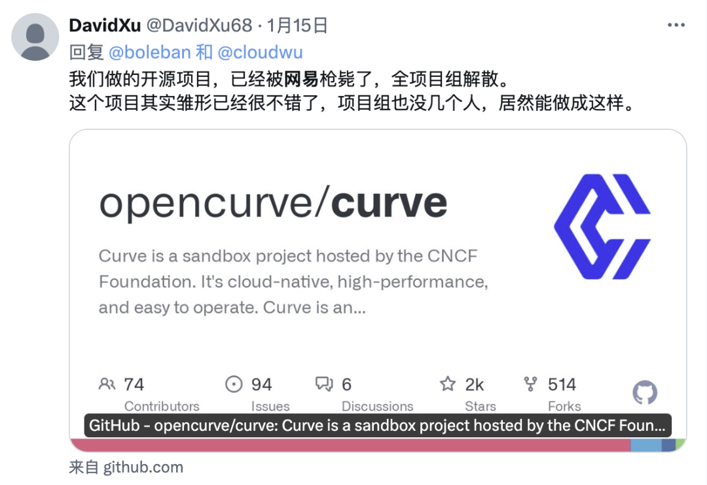
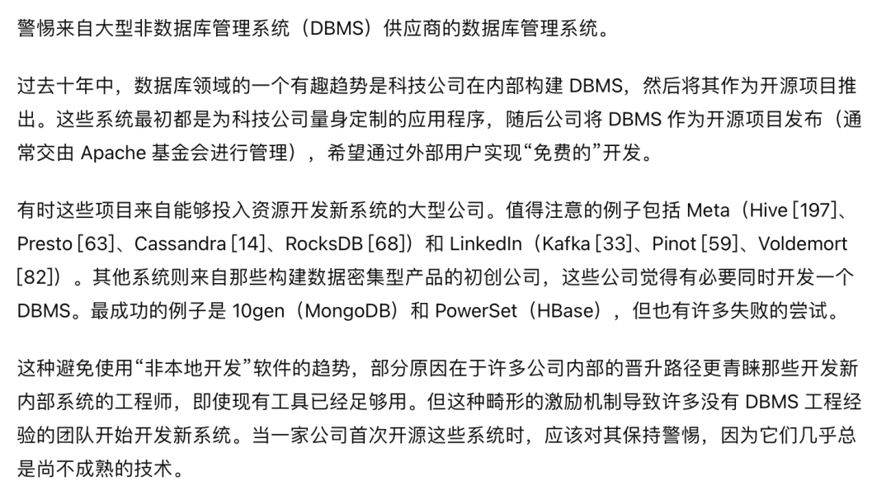

今天下午 14:44 左右，网易云音乐出现 [不可用故障](http://mp.weixin.qq.com/s?__biz=MzU5ODAyNTM5Ng==&mid=2247488162&idx=1&sn=5913eb51b437e365c685ed11917a3302&chksm=fe4b2779c93cae6ff254f4568f3e7895e005ce249ab4e0e3111bf3665a54fed35b381ff55aa9&scene=21#wechat_redirect)，至 17:11 分恢复。网传原因为 **基础设施/云盘存储** 相关问题。

------

## 故障经过

故障期间，网易云音乐客户端可以正常播放离线下载的音乐，但访问在线资源会直接提示报错，网页版则直接出现 502 服务器报错无法访问。

在此期间，网易 163门户也出现 502 服务器报错，并在一段时间后 302 重定向到移动版主站。期间也有用户反馈 **网易新闻** 与其他服务也受到影响。

许多用户都反馈连不上网易云音乐后，以为是自己网断了，卸了APP重装，还有以为公司 IT 禁了听音乐站点的，各种评论很快将此次故障推上微博热搜：

期间截止到 17:11 分，网易云音乐已经恢复，163 主站门户也从移动版本切换回浏览器版本，整个故障时长约两个半小时，P0 事故。

17:16 分，网易云音乐知乎账号发布通知致歉，并表示明天搜“畅听音乐”可以领取 7 天黑胶 VIP 的 **朋友费**。

------

## 原因推断

在此期间，出现各种流言与小道消息。总部着火🔥 （老图），TiDB 翻车（网友瞎编），下载《黑神话悟空》打爆网络，以及程序员删库跑路等就属于一眼假的消息。

但也有先前网易云音乐公众号发布的一篇文章《[**云音乐贵州机房迁移总体方案回顾**](https://mp.weixin.qq.com/s?__biz=MzI1NTg3NzcwNQ==&mid=2247491821&idx=1&sn=573dcc464a690a5b9a0a991c6f3c74e2&scene=21#wechat_redirect)》，以及两份有板有眼的网传聊天记录，可以作为一个参考。

网传此次故障与云存储有关，网传聊天记录就不贴了，可以参考《[网易云音乐宕机,原因曝光!7月份刚迁移完机房，传和降本增效有关。](https://mp.weixin.qq.com/s/rcmhu16eZdx1JXJadZ8d-Q)》一文截图，或者权威媒体的引用报道《[独家｜网易云音乐故障真相：技术降本增效，人手不足排查了半天](https://mp.weixin.qq.com/s/nApqdf0ow6iY97TDZMEdsg)》。

我们可以找到一些关于网易云存储团队的公开信息，例如，网易自研的云存储方案 Curve 项目被枪毙了。

查阅 [Github Curve 项目主页](https://github.com/opencurve/curve)，发现项目在 2024 年初后就陷入停滞状态：

最后一个 Release 一直停留在RC没有发布正式版，项目已经基本无人维护，进入静默状态。

Curve 团队负责人还发表过一篇《curve：遗憾告别 未竟之旅》的公众号文章，并随即遭到删除。我对这件事有些印象，因为 Curve 是 PolarDB 推荐的两个开源共享存储方案之一，所以特意调研过这个项目，现在看来……

------

## 经验教训

关于裁员与降本增效的老生长谈已经说过很多了，我们又还能从这场事故中学习到什么教训呢？以下是我的观点：

第一个教训是，**不要用云盘跑严肃数据库**！在这件事上，我确实可以说一句 “ [**Told you so**](http://mp.weixin.qq.com/s?__biz=MzU5ODAyNTM5Ng==&mid=2247486587&idx=1&sn=16521d6854711a4fe429464aeb2df6bd&chksm=fe4b39a0c93cb0b6d57c1345b79a6c87972e58eeed65831bc6ba8cf73d2a99d6a11d48d2f706&scene=21#wechat_redirect)” 。底层块存储基本都是提供给数据库用的。如果这里出现了故障，爆炸半径与 Debug 难度是远超出一般工程师的[**智力带宽**](http://mp.weixin.qq.com/s?__biz=MzU5ODAyNTM5Ng==&mid=2247486527&idx=1&sn=8e26f644f2b908fd21c83b81d329155d&chksm=fe4b39e4c93cb0f22271127a154a6ac5c45947b2051b06b7667ee5c203d136b5d2e8f6577b10&scene=21#wechat_redirect)的。如此显著的故障时长（两个半小时），显然不是在无状态服务上的问题。

第二个教训是 —— **自研造轮子没有问题，但要留着人来兜底**。降本增效把存储团队一锅端了，遇到问题找不到人就只能干着急。

第三个教训是，**警惕大厂开源**。作为一个底层存储项目，一旦启用那就不是简单说换就能换掉的。而网易毙掉 Curve 这个项目，所有这些用 Curve 的基建就成了没人维护的危楼。Stonebraker 老爷子在他的名著论文《What Goes Around Comes Around》中就提到过这一点：

--------

## 参考阅读

[网易云音乐崩了](http://mp.weixin.qq.com/s?__biz=MzU5ODAyNTM5Ng==&mid=2247488162&idx=1&sn=5913eb51b437e365c685ed11917a3302&chksm=fe4b2779c93cae6ff254f4568f3e7895e005ce249ab4e0e3111bf3665a54fed35b381ff55aa9&scene=21#wechat_redirect)

[GitHub全站故障，又是数据库上翻的车？](http://mp.weixin.qq.com/s?__biz=MzU5ODAyNTM5Ng==&mid=2247488151&idx=1&sn=556731d65228f07f443cfb27b5e7bd8b&chksm=fe4b274cc93cae5ae1a32d423f2f7285eff3e184903d62182ad5f17c4772b4baf38b6a9c89c8&scene=21#wechat_redirect)

[阿里云又挂了，这次是光缆被挖断了？](http://mp.weixin.qq.com/s?__biz=MzU5ODAyNTM5Ng==&mid=2247487926&idx=1&sn=2edbd59c845944dc9ba38021f42d1d63&chksm=fe4b246dc93cad7b35b7517b489371eaa08244ec561359e0a610bc9f6f2aa11cf1e3c2b34fb3&scene=21#wechat_redirect)

[全球Windows蓝屏：甲乙双方都是草台班子](http://mp.weixin.qq.com/s?__biz=MzU5ODAyNTM5Ng==&mid=2247488036&idx=1&sn=7bbcc3e8979a5f97a519a7a1684caa06&chksm=fe4b27ffc93caee9701d4a94830417e281c5c08e345d12b007ebaca84dc79c3224b880d75f4c&scene=21#wechat_redirect)

[删库：Google云爆破了大基金的整个云账户](http://mp.weixin.qq.com/s?__biz=MzU5ODAyNTM5Ng==&mid=2247487552&idx=1&sn=799ae77dda3b80d2296070826142adea&chksm=fe4b259bc93cac8da2cc20f864e5a8b62ecb6f5dd57e7435db1d3fb2f2864a5d991b3a016358&scene=21#wechat_redirect)

[云上黑暗森林：打爆AWS云账单，只需要S3桶名](http://mp.weixin.qq.com/s?__biz=MzU5ODAyNTM5Ng==&mid=2247487536&idx=1&sn=0cd598f426de0b617c7f3318aed9bd95&chksm=fe4b25ebc93cacfd2d96a9704a0ae4dc2d330aee7cd4579641df513edce307ccdd3a9f94736e&scene=21#wechat_redirect)

[互联网技术大师速成班](http://mp.weixin.qq.com/s?__biz=MzU5ODAyNTM5Ng==&mid=2247486766&idx=1&sn=b17b224eb2a2faa401957886cf7ea832&chksm=fe4b38f5c93cb1e3765c88f0cd4133090497527e50c747654f3e312c8db83f801b44bd562e74&scene=21#wechat_redirect)

[门内的国企如何看门外的云厂商](http://mp.weixin.qq.com/s?__biz=MzU5ODAyNTM5Ng==&mid=2247486747&idx=1&sn=29cce4b791b274c966e05d2ce81ae09d&chksm=fe4b38c0c93cb1d6aa83c776f206791e79f172105c3f942a9a2e28da70889929ef3cb0c77839&scene=21#wechat_redirect)

[卡在政企客户门口的阿里云](http://mp.weixin.qq.com/s?__biz=MzU5ODAyNTM5Ng==&mid=2247486691&idx=1&sn=6858441ede03a6e700155390cf0086f4&chksm=fe4b3938c93cb02eb36992769204ec829f4a9fe55c37329546a1db6039301ddf47094dddf7e1&scene=21#wechat_redirect)

[互联网故障背后的草台班子们](https://mp.weixin.qq.com/s?__biz=MzU5ODAyNTM5Ng==&mid=2247486590&idx=1&sn=d4d85de483fafb867487f024631a3e6c&scene=21#wechat_redirect)

[云厂商眼中的客户：又穷又闲又缺爱](https://mp.weixin.qq.com/s?__biz=MzU5ODAyNTM5Ng==&mid=2247486387&idx=1&sn=20ac92e33ed5a6b8e3120e99aefaf1cc&scene=21#wechat_redirect)

[taobao.com证书过期](http://mp.weixin.qq.com/s?__biz=MzU5ODAyNTM5Ng==&mid=2247487367&idx=1&sn=d6e4abd2b2249d27bd8b8146b591b026&chksm=fe4b3a5cc93cb34a8e90e4b7f06803fa11ee8234014cd4f1aedff59e3bf3c846b3cb133090f2&scene=21#wechat_redirect)

[云SLA是安慰剂还是厕纸合同？](http://mp.weixin.qq.com/s?__biz=MzU5ODAyNTM5Ng==&mid=2247487339&idx=1&sn=fce4c0d415d87026013169c737faeacb&chksm=fe4b3ab0c93cb3a61bd2831fcad6dfb36419540e690420b1229053b1de2e3d3533a66f44fb4c&scene=21#wechat_redirect)

[罗永浩救不了牙膏云](http://mp.weixin.qq.com/s?__biz=MzU5ODAyNTM5Ng==&mid=2247487223&idx=1&sn=da885170d5d65a3c646d8b3d9da3aed3&chksm=fe4b3b2cc93cb23a5625e8c183860a9e1528eca0a1311439f1ec308a74d53f10cf5dbbb9a1d0&scene=21#wechat_redirect)

[故障不是腾讯云草台的原因，傲慢才是](http://mp.weixin.qq.com/s?__biz=MzU5ODAyNTM5Ng==&mid=2247487319&idx=1&sn=7e38023ce115046b5318ee670c90fd58&chksm=fe4b3a8cc93cb39a961e396d1491b7bb77089c2d79b8f5e942c6a945cf0aa6dedbf5a8a42828&scene=21#wechat_redirect)

[【腾讯】云计算史诗级二翻车来了](http://mp.weixin.qq.com/s?__biz=MzU5ODAyNTM5Ng==&mid=2247487267&idx=1&sn=7d31d44e89560356b5c5a2e7a40bb1e1&chksm=fe4b3af8c93cb3ee9b8000cd90a12a798395f67205d4ba5b0c77b8c5b6ce9ea448d9fc014921&scene=21#wechat_redirect)

[Redis不开源是“开源”之耻，更是公有云之耻](http://mp.weixin.qq.com/s?__biz=MzU5ODAyNTM5Ng==&mid=2247487184&idx=1&sn=afa93b16ae95dba95d99a87ef6ff7605&chksm=fe4b3b0bc93cb21d07adb10713c1061a53b6438a5db0bd93a2e7a0f11ea365ba3d24ae02d13d&scene=21#wechat_redirect)

[剖析云算力成本，阿里云真的降价了吗？](http://mp.weixin.qq.com/s?__biz=MzU5ODAyNTM5Ng==&mid=2247487089&idx=1&sn=ca16c2e7e534380eadcb3a3870d8e3b4&chksm=fe4b3baac93cb2bc8c4b68c468acf3e8ac5ee124080a3e738262fe99dd1765c3adf9c56ea650&scene=21#wechat_redirect)

[我们能从腾讯云故障复盘中学到什么？](http://mp.weixin.qq.com/s?__biz=MzU5ODAyNTM5Ng==&mid=2247487348&idx=1&sn=412cf2afcd93c3f0a83d65219c4a28e8&chksm=fe4b3aafc93cb3b900cef33bd0510c7c86367d71877b0ee65d4847da0ae1298e2b1fd88d0b3f&scene=21#wechat_redirect)

[腾讯云：颜面尽失的草台班子](http://mp.weixin.qq.com/s?__biz=MzU5ODAyNTM5Ng==&mid=2247487279&idx=1&sn=95231614887e129f298644ddc194909f&chksm=fe4b3af4c93cb3e29078b4716d3b633246db8e2081acff8b821181c9ae058a0daf91e45a40b9&scene=21#wechat_redirect)

[从降本增笑到真的降本增效](http://mp.weixin.qq.com/s?__biz=MzU5ODAyNTM5Ng==&mid=2247486527&idx=1&sn=8e26f644f2b908fd21c83b81d329155d&chksm=fe4b39e4c93cb0f22271127a154a6ac5c45947b2051b06b7667ee5c203d136b5d2e8f6577b10&scene=21#wechat_redirect)

[阿里云周爆：云数据库管控又挂了](http://mp.weixin.qq.com/s?__biz=MzU5ODAyNTM5Ng==&mid=2247486512&idx=1&sn=43d6340fce93bfbf5439cc2cd8e3b8dd&chksm=fe4b39ebc93cb0fd192c69d9f589ccd36f1c1eb5d34fffc357cf0b8177c746c4b3445ea5f63a&scene=21#wechat_redirect)

[我们能从阿里云史诗级故障中学到什么](http://mp.weixin.qq.com/s?__biz=MzU5ODAyNTM5Ng==&mid=2247486468&idx=1&sn=7fead2b49f12bc2a2a94aae942403c22&chksm=fe4b39dfc93cb0c92e5d4c67241de0519ae6a23ce6f07fe5411b95041accb69e5efb86a38150&scene=21#wechat_redirect)

[【阿里】云计算史诗级大翻车来了](http://mp.weixin.qq.com/s?__biz=MzU5ODAyNTM5Ng==&mid=2247486452&idx=1&sn=29cff4ee30b90483bd0a4f0963876f28&chksm=fe4b3e2fc93cb739af6ce49cffa4fa3d010781190d99d3052b4dbfa87d28c0386f44667e4908&scene=21#wechat_redirect)
