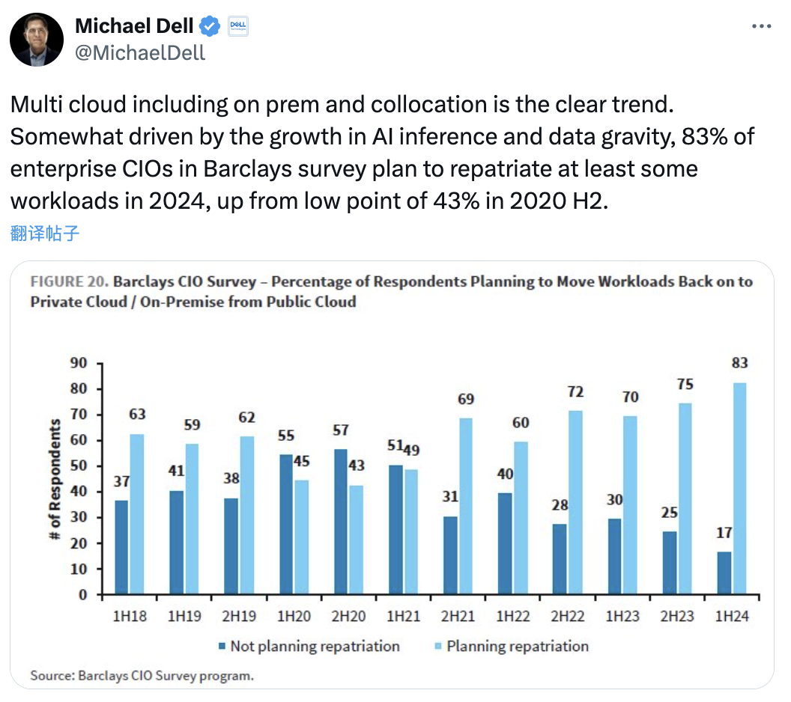
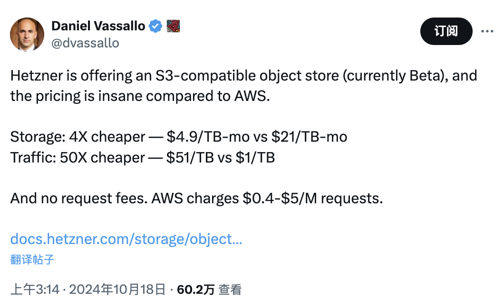
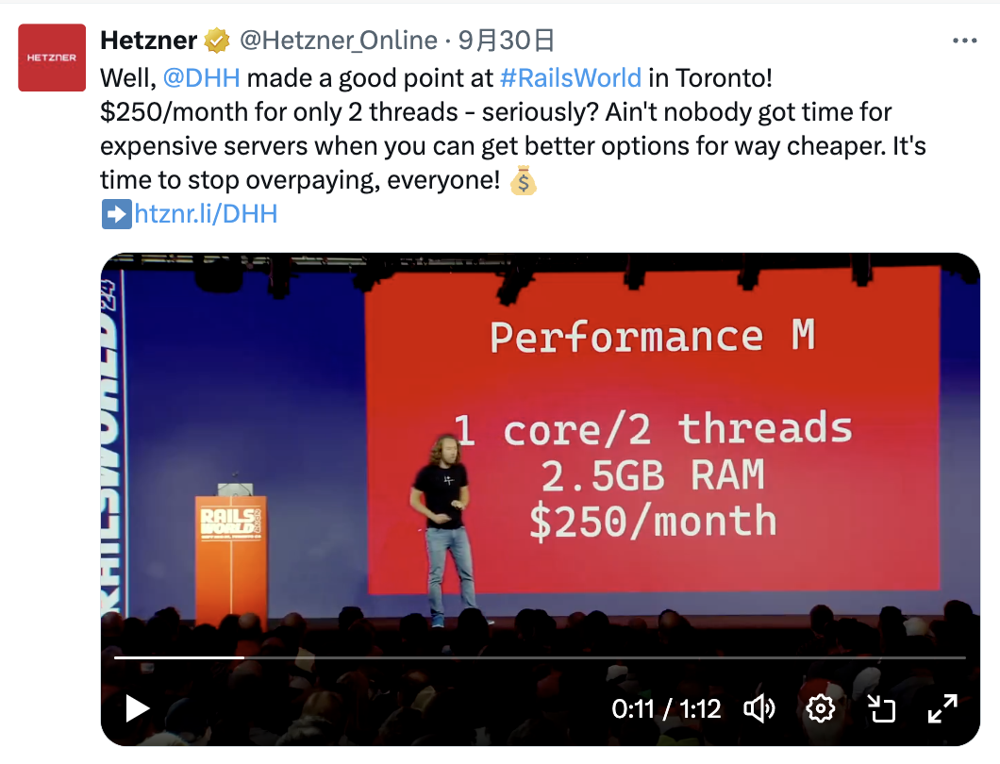

> Author: DHH, "[Our cloud-exit savings will now top ten million over five years](https://world.hey.com/dhh/our-cloud-exit-savings-will-now-top-ten-million-over-five-years-c7d9b5bd)"

Last summer, we [completed our cloud exit](https://world.hey.com/dhh/we-have-left-the-cloud-251760fb), migrating seven cloud applications including [HEY](https://hey.com/) from AWS to our own hardware. But it wasn't until year-end that all our long-term contracts ended, so 2024 is the first year of full savings realization. We're delighted to find the savings exceed our initial estimates.

In 2024, we've reduced our cloud bill from **$3.2 million annually to $1.3 million, saving nearly $2 million per year!** The savings exceed our initial [five-year $7 million estimate](https://world.hey.com/dhh/we-stand-to-save-7m-over-five-years-from-our-cloud-exit-53996caa) because we successfully fit all new hardware within our existing data center racks and power limits.

Purchasing this new [Dell hardware](https://world.hey.com/dhh/the-hardware-we-need-for-our-cloud-exit-has-arrived-99d66966) cost approximately $700,000, but we fully recouped costs during 2023 as long-term contracts gradually expired. Think about that - this is equipment we expect to use for the next five, maybe even seven years! All paid off from savings accrued during the second half of 2023. Pretty sweet!

But it gets even better. **The remaining $1.3 million we still spend on cloud services is entirely on AWS S3**. While all our former cloud compute and managed database/search services had one-year contracts, our file storage has been locked into a four-year contract since 2021, not expiring until next summer. That's when we plan our complete exit.

We now store nearly **10 PB** of data in S3, including critical customer files for Basecamp and HEY, with redundant storage across regions. We use mixed storage classes balancing reliability, access, and cost. But even with long-term contract discounts, storing this data costs over a million dollars annually!

When we exit next summer, we'll migrate to a dual-data-center [Pure Storage](https://www.purestorage.com/) system with 18 PB total capacity. Initial hardware cost roughly equals one year of AWS S3 usage. Thanks to Pure flash arrays' incredible density and power efficiency, we can fit these within our existing data center racks. Ongoing costs will just be modest service contracts, **saving us an additional $4 million over five years**.

Therefore, our total projected cloud exit savings will exceed **$10 million over five years!** **While gaining faster compute and much more storage**.

Of course, cloud vs on-premises comparisons are never perfectly apples-to-apples. If you're entirely in the cloud without existing data center racks, you'll pay to rent those too (but you'll probably be shocked how cheap it is compared to cloud!). Even for our savings estimates, targets keep moving as we need more hardware and storage as Basecamp and HEY continue growing.

But it's remarkable that we're reaping savings of this magnitude from leaving the cloud. We've been out over a year now, and our management team remains the same size. There were no hidden dragons of additional workload requiring team expansion, as some speculated when we announced it. All answers in our [Cloud Exit FAQ](https://world.hey.com/dhh/the-big-cloud-exit-faq-20274010) continue to hold.

It's still work though! Running applications like [Basecamp](https://basecamp.com/) and HEY across two data centers (soon at least one more internationally!) requires a dedicated team. There's always maintenance work for applications, databases, virtual machines, and occasionally requesting power supply or drive swaps for machines showing warning lights (handled by [Deft's](https://deft.com/) white-glove service) — but most of this work was required in the cloud too!

Since we originally announced our [cloud exit plans](https://world.hey.com/dhh/why-we-re-leaving-the-cloud-654b47e0), there's been [surging industry interest](https://x.com/MichaelDell/status/1780672823167742135) in similar moves. The 2010s-early 2020s motto — "all-cloud, everything, all the time" — seems to have finally peaked. Thank heavens!

Cloud can still make sense, especially in very early days when you don't need a whole computer or aren't sure you'll survive the year. Or when dealing with enormous load fluctuations, like what motivated Amazon to create AWS originally.

But once cloud bills become substantial, I think you owe it to yourself, investors, and common business sense to at least do the math. How much are we spending? What would buying these computers instead of renting cost? Could we try moving some setup to our own hardware, maybe using [Kamal](https://kamal-deploy.org/) or similar tools? The potential savings can be shocking.

At [37signals](https://37signals.com/), we look forward to literally deleting our AWS account this summer, while remaining grateful for the service and lessons learned using the platform. It's obvious why Amazon continues leading in cloud. I'm also grateful that [moving data out of S3 is now entirely free](https://aws.amazon.com/blogs/aws/free-data-transfer-out-to-internet-when-moving-out-of-aws/) when leaving the platform permanently. Makes the math even better. So long and thanks for all the fish!

--------

## Reference Reading

Here's DHH's complete cloud exit journey with Q&A:

- [Is It Time to Give Up on Cloud Computing?](https://mp.weixin.qq.com/s/CicctyvV1xk5B-AsKfzPjw)
- [Cloud Exit Odyssey](https://mp.weixin.qq.com/s/H2S3TV-AsqS43A5Hh-XMhQ)
- [Six Months Cloud Exit Saves Tens of Millions: DHH Cloud Exit FAQ](https://mp.weixin.qq.com/s/xaa079P4DRCz0hzNovGoOA)
- [Optimize Carbon-Based Bio Cores First, Then Silicon CPU Cores](https://mp.weixin.qq.com/s/Yxyir8kjRDUZwkkE_dscZQ)
- [Single-Tenant Era: SaaS Paradigm Shift](https://mp.weixin.qq.com/s/jKv9l_ro6rWei4QnXck-zw)
- [Refuse Complexity Masturbation, Maintain Stability Post-Cloud Exit](https://mp.weixin.qq.com/s/yIVal-9U6_TXX-dZpVtjBg)

--------

## Feng's Commentary

As a cloud exit advocate, I'm gratified to see DHH's tremendous success in the cloud exit process. The world always rewards leaders with the wisdom to discover problems and the courage to take action.

Over the past two years, cloud hype has peaked and declined while the cloud exit movement flourishes — according to Barclays' 2024 H1 CIO survey, the percentage of CIOs planning to migrate workloads back to on-premises/private cloud has jumped from 50-60% in previous years to 83%. Cloud exit, as a viable cost reduction option, has fully entered mainstream view and is generating huge real-world impact.

> Dell CEO: Percentage of CIOs choosing to move back to self-built/private cloud

In my "Cloud Computing Mudslide" series, I've deeply analyzed cloud resource costs, introduced the business model behind cloud, and provided viable cloud exit alternatives. I've helped numerous enterprises exit the cloud over the past two years — by solving their key cloud exit bottleneck: self-built database services.

The massive savings potential from cloud exit, using DHH's not-yet-migrated S3 object storage as an example, costs $1.3 million annually (approximately 9 million RMB) — 
With a one-time investment equal to one year's S3 costs, you can get a Pure Storage system with nearly double capacity, meaning first-year breakeven with four to six years of pure profit afterward.

The math is straightforward. Previously we calculated self-built object storage TCO (assuming 60-bay 12PB storage models, Century Internet hosting, three replicas) at approximately 200-300 ¥/TB (one-time purchase, five to seven years usage) — so 10 PB storage requires only 350k¥ one-time investment.
In contrast, AWS/Alibaba Cloud object storage costs 110-170 ¥/TB (**monthly**, just for storage space, excluding request volumes, traffic fees, retrieval fees), creating a two-order-of-magnitude cost difference versus self-built solutions.

Yes, self-built object storage can achieve two orders of magnitude, dozens of times cost savings versus cloud object storage. As someone who built 25 PB MinIO storage, I guarantee these cost figures' authenticity.

As simple proof, hosting service provider Hetzner offers object storage at 1/51 of AWS prices... They don't need high-tech black magic, just install Ceph/MinIO opensource software with a GUI on hardware and honestly sell to customers at this price while maintaining good margins.

> Hetzner provides S3-compatible object storage at 1/50 AWS pricing

Not just object storage — cloud bandwidth, traffic, compute, storage are all ridiculously expensive. If you're not the type satisfied with a few promotional 1-core VMs, you should really do the math.
The mathematics isn't complex — anyone with business sense having this information would wonder: paying several to dozens of times premium for cloud services, **what exactly am I buying?**

For example, DHH's Rails World conference presentation raised this question, showing that at Hetzner he could rent much more powerful dedicated servers for the same price:

The main obstacle previously preventing users from doing this was that [**PaaS self-building was too difficult**](/cloud/finops) for databases and k8s, but now countless PaaS specialty vendors can provide better solutions than cloud providers. (Like MinIO vs S3, [**Pigsty**](https://pigsty.io) vs RDS, SealOS vs K8S, AutoMQ vs Kafka, ...)

Actually, more cloud providers are realizing this. For example, DigitalOcean, Hetzner, Linode, Cloudflare are all launching "honest pricing" — high-quality, affordable cloud service products.
Users can enjoy cloud conveniences while purchasing resources at dozens of times lower costs from these "budget clouds."

Traditional cloud providers are also getting FOMO. They can't directly cut prices and abandon existing profits, but they're anxious about new-generation budget cloud competition and want to participate. For example, the recently emerged budget "ClawCloud" is a subsidiary of a major cloud provider competing with BandwagonHost and Linode.

I believe under such competitive pressure, the cloud computing market landscape will see exciting changes soon. More users will see through cloud hype and wisely, prudently spend their IT budgets.

--------

## Our cloud-exit savings will now top ten million over five years

We [finished](https://world.hey.com/dhh/we-have-left-the-cloud-251760fb) pulling seven cloud apps, including [HEY](https://hey.com/), out of AWS and onto our own hardware last summer. But it took until the end of that year for all the long-term contract commitments to end, so 2024 has been the first clean year of savings, and we've been pleasantly surprised that they've been even better than originally estimated.

For 2024, we've brought the cloud bill down from the original $3.2 million/year run rate to $1.3 million. That's a saving of almost two million dollars per year for our setup! The reason it's more than [our original estimate of $7 million over five years](https://world.hey.com/dhh/we-stand-to-save-7m-over-five-years-from-our-cloud-exit-53996caa) is that we got away with putting all the new hardware into our existing data center racks and power limits.

The expenditure on [all that new Dell hardware](https://world.hey.com/dhh/the-hardware-we-need-for-our-cloud-exit-has-arrived-99d66966) – about $700,000 in the end – was also entirely recouped during 2023 while the long-term commitments slowly rolled off. Think about that for a second. This is gear we expect to use for the next five, maybe even seven years! All paid off from savings accrued during the second half of 2023. Pretty sweet!

But it's about to get sweeter still. The remaining $1.3 million we still spend on cloud services is all from AWS S3. While all our former cloud compute and managed database/search services were on one-year committed contracts, our file storage has been locked into a four(!!)-year contract since 2021, which doesn't expire until next summer. So that's when we plan to be out.

We store almost 10 petabytes of data in S3 now. That includes a lot of super critical customer files, like for Basecamp and HEY, stored in duplicate via separate regions. We use a mixture of storage classes to get an optimized solution that weighs reliability, access, and cost. But it's still well over a million dollars to keep all this data there (and that's after the big long-term commitment discounts!).

When we move out next summer, we'll be moving to a dual-DC [Pure Storage](https://www.purestorage.com/) setup, with a combined 18 petabytes of capacity. This setup will cost about the same as a year's worth of AWS S3 for the initial hardware. But thanks to the incredible density and power efficiency of the Pure flash arrays, we can also fit these within our existing data center racks. So ongoing costs are going to be some modest service contracts, and we expect to save another four million dollars over five years.

This brings our total projected savings from the combined cloud exit to well over ten million dollars over five years! While getting faster computers and much more storage.

Now, as with all things cloud vs on-prem, it's never fully apples-to-apples. If you're entirely in the cloud, and have no existing data center racks, you'll pay to rent those as well (but you'll probably be shocked at how cheap it is compared to the cloud!). And even for our savings estimates, the target keeps moving as we require more hardware and more storage as Basecamp and HEY continues to grow over the years.

But it's still remarkable that we're able to reap savings of this magnitude from leaving the cloud. We've been out for just over a year now, and the team managing everything is still the same. There were no hidden dragons of additional workload associated with the exit that required us to balloon the team, as some spectators speculated when we announced it. All the answers in our [Big Cloud Exit FAQ](https://world.hey.com/dhh/the-big-cloud-exit-faq-20274010) continue to hold.

It's still work, though! Running apps the size of [Basecamp](https://basecamp.com/) and HEY across two data centers (and soon at least one more internationally!) requires a substantial and dedicated crew. There's always work to be done maintaining all these applications, databases, virtual machines, and yes, occasionally, even requesting a power supply or drive swap on a machine throwing a warming light (but [our white gloves at Deft](https://deft.com/) take care of that). But most of that work was something we had to do in the cloud as well!

Since we originally announced [our plans to leave the cloud](https://world.hey.com/dhh/why-we-re-leaving-the-cloud-654b47e0), there's been a [surge of interest](https://x.com/MichaelDell/status/1780672823167742135) in doing the same across the industry. The motto of the 2010s and early 2020s – all-cloud, everything, all the time – seems to finally have peaked. And thank heavens for that!

The cloud can still make a lot of sense, though. Especially in the very early days when you don't even need a whole computer or are unsure whether you'll still be in business by the end of the year. Or when you're dealing with enormous fluctuations in load, like what motivated Amazon to create AWS in the first place.

But as soon as the cloud bills start to become substantial, I think you owe it to yourself, your investors, and common business sense to at least do the math. How much are we spending? What would it cost to buy these computers instead of renting them? Could we try moving some part of the setup onto our own hardware, maybe using [Kamal](https://kamal-deploy.org/) or a similar tool? The potential savings from these answers can be shocking.

At [37signals](https://37signals.com/), we're looking forward to literally deleting our AWS account come this summer, but remain grateful for the service and the lessons we learned while using the platform. It's obvious why Amazon continues to lead in cloud. And I'm also grateful that it's [now entirely free to move your data out of S3](https://aws.amazon.com/blogs/aws/free-data-transfer-out-to-internet-when-moving-out-of-aws/), if you're leaving the platform for good. Makes the math even better. So long and thanks for all the fish!
