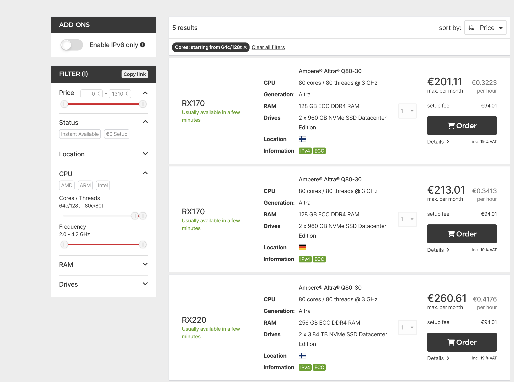

> Author: DHH, "[Our Cloud-Exit savings will now top ten million over five years](https://world.hey.com/dhh/our-Cloud-Exit-savings-will-now-top-ten-million-over-five-years-c7d9b5bd)"

--------

## Feng's Commentary

As a cloud exit advocate, I'm gratified to see DHH's tremendous success in the cloud exit process. The world always rewards leaders with the wisdom to discover problems and the courage to take action.

Over the past two years, cloud hype has peaked and declined while the cloud exit movement flourishes — according to Barclays' 2024 H1 CIO survey, the percentage of CIOs planning to migrate workloads back to on-premises/private cloud has jumped from 50-60% in previous years to 83%. Cloud exit, as a viable cost reduction option, has fully entered mainstream view and is generating huge real-world impact.

> Dell CEO: Percentage of CIOs choosing to move back to self-built/private cloud

In my "Cloud Computing Mudslide" series, I've deeply analyzed cloud resource costs, introduced the business model behind cloud, and provided viable cloud exit alternatives. I've helped numerous enterprises exit the cloud over the past two years — by solving their key cloud exit bottleneck: self-built database services.

The massive savings potential from cloud exit, using DHH's not-yet-migrated S3 object storage as an example, costs $1.3 million annually (approximately 9 million RMB) — 
With a one-time investment equal to one year's S3 costs, you can get a Pure Storage system with nearly double capacity, meaning first-year breakeven with four to six years of pure profit afterward.

The math is straightforward. Previously we calculated self-built object storage TCO (assuming 60-bay 12PB storage models, Century Internet hosting, three replicas) at approximately 200-300 ¥/TB (one-time purchase, five to seven years usage) — so 10 PB storage requires only 350k¥ one-time investment.
In contrast, AWS/Alibaba-Cloud object storage costs 110-170 ¥/TB (**monthly**, just for storage space, excluding request volumes, traffic fees, retrieval fees), creating a two-order-of-magnitude cost difference versus self-built solutions.

Yes, self-built object storage can achieve two orders of magnitude, dozens of times cost savings versus cloud object storage. As someone who built 25 PB MinIO storage, I guarantee these cost figures' authenticity.

As simple proof, hosting service provider Hetzner offers object storage at 1/51 of AWS prices... They don't need high-tech black magic, just install Ceph/MinIO opensource software with a GUI on hardware and honestly sell to customers at this price while maintaining good margins.

> Hetzner provides S3-compatible object storage at 1/50 AWS pricing

Not just object storage — cloud bandwidth, traffic, compute, storage are all ridiculously expensive. If you're not the type satisfied with a few promotional 1-core VMs, you should really do the math.
The mathematics isn't complex — anyone with business sense having this information would wonder: paying several to dozens of times premium for cloud services, **what exactly am I buying?**

For example, DHH's Rails World conference presentation raised this question, showing that at Hetzner he could rent much more powerful dedicated servers for the same price:

The main obstacle previously preventing users from doing this was that [**PaaS self-building was too difficult**](/cloud/finops) for databases and k8s, but now countless PaaS specialty vendors can provide better solutions than cloud providers. (Like MinIO vs S3, [**Pigsty**](https://pigsty.io) vs RDS, SealOS vs K8S, AutoMQ vs Kafka, ...)

Actually, more cloud providers are realizing this. For example, DigitalOcean, Hetzner, Linode, Cloudflare are all launching "honest pricing" — high-quality, affordable cloud service products.
Users can enjoy cloud conveniences while purchasing resources at dozens of times lower costs from these "budget clouds."

Traditional cloud providers are also getting FOMO. They can't directly cut prices and abandon existing profits, but they're anxious about new-generation budget cloud competition and want to participate. For example, the recently emerged budget "ClawCloud" is a subsidiary of a major cloud provider competing with BandwagonHost and Linode.

I believe under such competitive pressure, the cloud computing market landscape will see exciting changes soon. More users will see through cloud hype and wisely, prudently spend their IT budgets.

--------

## Reference Reading

Here's DHH's complete cloud exit journey with Q&A:

- [Is It Time to Give Up on Cloud Computing?](https://mp.weixin.qq.com/s/CicctyvV1xk5B-AsKfzPjw)
- [Cloud-Exit Odyssey](https://mp.weixin.qq.com/s/H2S3TV-AsqS43A5Hh-XMhQ)
- [Six Months Cloud-Exit Saves Tens of Millions: DHH Cloud-Exit FAQ](https://mp.weixin.qq.com/s/xaa079P4DRCz0hzNovGoOA)
- [Optimize Carbon-Based Bio Cores First, Then Silicon CPU Cores](https://mp.weixin.qq.com/s/Yxyir8kjRDUZwkkE_dscZQ)
- [Single-Tenant Era: SaaS Paradigm Shift](https://mp.weixin.qq.com/s/jKv9l_ro6rWei4QnXck-zw)
- [Refuse Complexity Masturbation, Maintain Stability Post-Cloud-Exit](https://mp.weixin.qq.com/s/yIVal-9U6_TXX-dZpVtjBg)

