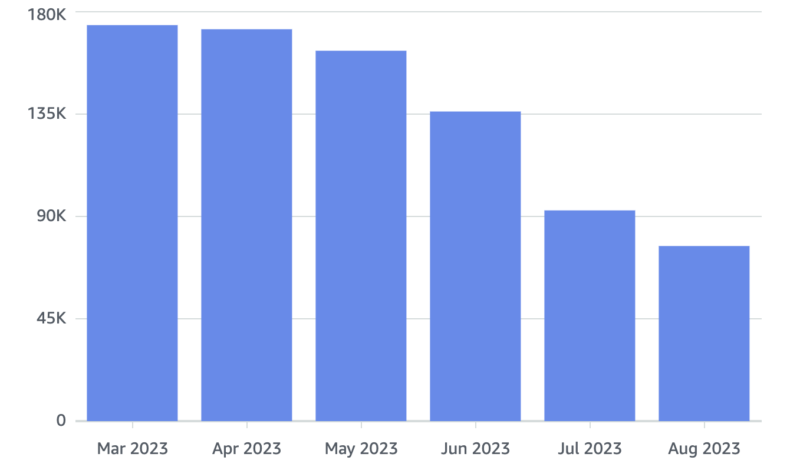
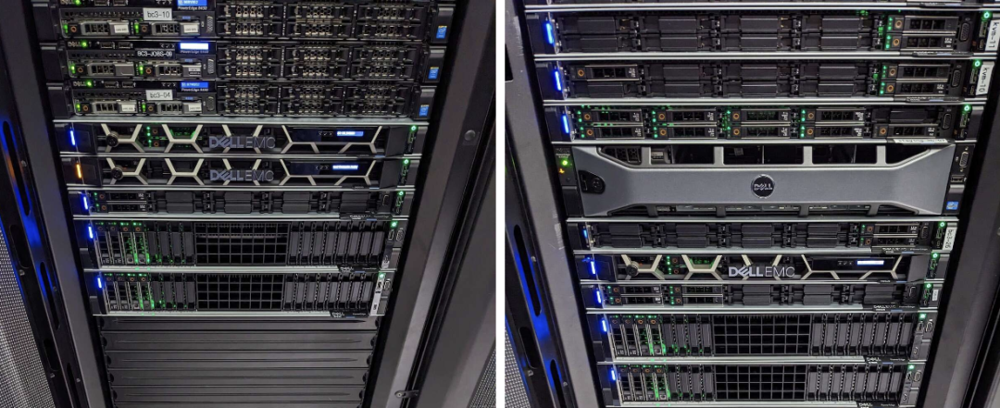
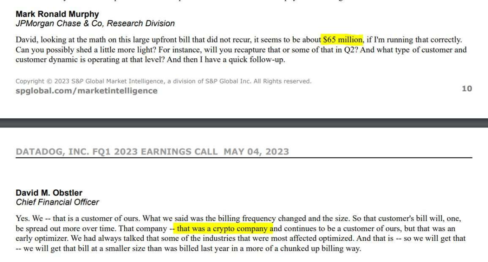

DHH has always been a cloud exit pioneer. This article excerpts ten DHH blog posts about cloud exit, documenting 37Signal's complete journey from cloud migration, organized in reverse chronological order and translated to English for readers. This article translates DHH's complete cloud exit journey, offering tremendous reference value for enterprises preparing for cloud adoption or already in the cloud.

- 01 2023-10-27 [Twitter X Saves 60% from Cloud Exit](#10-27-twitter-x-saves-60-from-cloud-exit)
- 02 2023-10-06 [The Price of Managed Cloud Services](#10-06-the-price-of-managed-cloud-services)
- 03 2023-09-15 [Cloud Exit Already Saved $1M Annually](#09-15-cloud-exit-already-saved-1m-annually)
- 04 2023-06-23 [We Have Left the Cloud!](#06-23-we-have-left-the-cloud)
- 05 2023-05-03 [From Cloud Repatriation to Sovereign Cloud!](#05-03-from-cloud-repatriation-to-sovereign-cloud)
- 06 2023-05-02 [Cloud Exit Pays Off in Performance Too](#05-02-cloud-exit-pays-off-in-performance-too)
- 07 2023-04-06 [Hardware for Cloud Exit Has Arrived!](#04-06-hardware-for-cloud-exit-has-arrived)
- 08 2023-03-23 [Consider Cloud Exit Before Layoffs?](#03-23-consider-cloud-exit-before-layoffs)
- 09 2023-03-11 [It's Not Just Cloud Costs Out of Control!](#03-11-its-not-just-cloud-costs-out-of-control)
- 10 2023-02-22 [Five Values Guiding Our Cloud Exit](#02-22-five-values-guiding-our-cloud-exit)
- 11 2023-02-21 [Cloud Exit Will Save Us $7 Million!](#02-21-cloud-exit-will-save-us-7-million)
- 12 2023-01-26 [Hardware Fun Returns](#01-26-hardware-fun-returns)
- 13 2023-01-10 [Enterprise Alternatives Even More Ridiculous](#01-10-enterprise-alternatives-even-more-ridiculous)
- 14 2022-10-19 [Why We're Leaving the Cloud?](#2022-10-19-why-were-leaving-the-cloud)
- [References](#references)

Author: **David Heinemeier Hansson**, aka DHH. 37signals co-founder & CTO, Ruby on Rails creator, cloud exit advocate, practitioner, and leader. Pioneer fighting tech giant monopolies. [Hey Blog](https://world.hey.com/dhh)

Translator: **Feng Ruohang**, aka Vonng. Founder & CEO of PangJi Cloud Data. Pigsty author, PostgreSQL expert and evangelist. Cloud computing mudslide, database veteran, cloud exit advocate, database cloud exit practitioner. [Vonng Blog](https://vonng.com/cn/)

-------------

## Translator's Preface

People say cloud is good, managed services reduce worries. I say cloud is a pig-killing scam, hundred-fold markup with brazen shamelessness.

Cyber landlords create monopolies, freeloading and bloodsucking open source. Renting servers, hyping concepts, sitting on the ground raising prices and exploiting sweat.

Everyone rushes to the cloud upstream, not noticing expenses flowing like water. Cloud rental sky-high prices are unsustainable, self-built path is more solid.

Cloud exit pioneer King David, leading the trend carrying the banner, not fearing floating clouds obscuring vision, only because standing at the forefront.

 

Once upon a time, "going to cloud" became almost politically correct in tech circles, with an entire generation of application developers' vision clouded by the cloud. DHH, and people like me, are willing to be questioners, using solid data and personal experience to explain the traps of public cloud rental models.

Many developers haven't realized that underlying hardware has undergone earth-shaking changes, with performance and cost growing and declining exponentially. Many taken-for-granted working assumptions have been broken, and countless trade-offs and architectural solutions deserve reconsideration and redesign.

We believe public cloud has its place — for very early-stage companies or those that won't exist in two years, for companies that completely don't care about spending money or truly have extremely irregular load fluctuations, for companies needing overseas compliance and CDN services, public cloud remains a very worthy service option.

However, for most companies that have developed and have a certain scale, if they can amortize assets within a few years, you really should seriously re-examine this cloud fever. Benefits have been greatly exaggerated — running things in the cloud is usually as complex as doing it yourself, but ridiculously expensive. I sincerely suggest you do the math properly.

In the past decade, hardware has continued evolving at Moore's Law pace, IDC 2.0 and resource clouds have provided affordable alternatives to public cloud resources, and the emergence of open source software and open source management/scheduling software has made self-built capabilities readily available — cloud exit and self-building will have very significant returns in cost, performance, security, and autonomy.

We advocate cloud exit concepts and provide practical paths and viable self-built alternatives — we will pave the ideological and technical roads for followers who agree with these conclusions. Not for anything else, just hoping all users can own their digital homes rather than renting farms from tech giant cloud lords.

This is also a movement against internet centralization and cyber landlord monopoly rent-seeking, helping the internet — this beautiful free haven and ideal land — go further.

-------------

## 10-27 Twitter X Saves 60% from Cloud Exit

> **X celebrates 60% savings from cloud exit**[1]

Musk has been aggressively cutting costs and simplifying processes at X (Twitter). While this process may not have been smooth, it's been remarkably effective. He's repeatedly proven wrong those who dismissed him. Despite [many voices](https://37signals.com/podcast/twitter-is-still-up/) saying Twitter would quickly crash after such massive personnel changes, this hasn't happened. X has not only successfully maintained stable site operations but accelerated experimental feature development during this period. Whether you love or hate the politics here, it's impressive.

I understand it's hard for many people to set politics aside. But regardless of which side you're on, you can always find charts proving X is either thriving or about to collapse, so arguing here is pointless.

What's really important is that X has made cloud exit (`#CloudExit`) a key component of their cost-saving plan. Here's what their engineering team said when [celebrating last year's achievements](https://twitter.com/XEng/status/1717754398410240018):

> *"We optimized public cloud usage and do more work locally. This shift reduced our monthly cloud costs by 60%. One change we made was moving all media/blob artifacts from cloud, reducing our total cloud data storage by 60%, and we also successfully reduced cloud data processing costs by 75%."*

Please read that again carefully: moving the same work from cloud to their own servers reduced monthly cloud costs by 60% (!!). According to [earlier reports](https://www.cloudzero.com/blog/twitter-aws), X spent $100 million annually on AWS, so based on this, their cloud exit results could save up to $60 million/year — astounding!

Even more impressive is that they achieved such rapid cloud bill cuts while their team shrank to a quarter of original size. Twitter had about 8,000 employees, while X now reportedly has fewer than 2,000.

CFOs and investors can't ignore this phenomenon: if companies like X can operate with a quarter of staff while greatly benefiting from cloud exit, then in many cases, most large companies have huge money-saving potential from cloud exit.

[#CloudExit](https://basecamp.com/cloud/-exit) may be about to go mainstream. Have you calculated your cloud bill?

-------------

## 10-06 The Price of Managed Cloud Services

> **The price of managed cloud services**[2]

Since [we left cloud computing](https://world.hey.com/dhh/we-have-left-the-cloud-251760fb), people often counter that we shouldn't expect simple cloud exit migration to bear fruit. Cloud's real value lies in managed services and new architectures, not just running the same software on rented cloud servers. Translated: "You're using cloud wrong!" This argument is complete nonsense!

First, [HEY](https://hey.com/) was born in the cloud. It never ran on our own hardware before launch. We started using Aurora/RDS for database management in 2020, OpenSearch for search, EKS for application and server management. We deeply used native cloud components, not just rented a bunch of VMs.

It was precisely because we used cloud-provided services so extensively that [our bills](https://dev.37signals.com/our-cloud-spend-in-2022/) were so high. And the required operational staffing didn't decrease significantly, which disappointed us greatly. The answer to this problem definitely can't be "just use more managed services" or waving a "Serverless magic wand" to solve it.

Take our AWS OpenSearch service usage as an example. We spent thirty thousand monthly ($43,333) providing search services for Basecamp, HEY, and our logging infrastructure — nearly four hundred thousand annually ($520,000) — just for search!

Now we've [just shut down](https://twitter.com/dhh/status/1712541981220786606) the last major log cluster on OpenSearch, so it's a good time to compare alternative costs. We spent about $150,000 purchasing required hardware (about $75,000 per data center for full redundancy), which if depreciated over five years equals about $2,500 monthly. We also need power, rack space, and networking for these machines in two data centers, costing about $2,500 monthly. So total monthly cost is $5,000, including buffer reserves.

This is a full order of magnitude less than our OpenSearch spending! Our $150,000 hardware investment paid for itself within three months. From month three onward, we save about $40,000 monthly — just for search!

At this point, people usually start asking about human costs. This is a fair question: if you need to hire a bunch of engineers to self-build and maintain services, what's $40,000 monthly savings? First, I'd say even if we had to hire someone **full-time** for search services, I'd still consider it very worthwhile, but we didn't.

Switching from OpenSearch to running Elasticsearch ourselves did require some initial configuration work, but long-term, we didn't expand team size for this switch. Because running on our own equipment versus running in cloud doesn't have fundamentally different work scope. This is our overall cloud exit core concept:

**The operations team size needed to run our scale in cloud is no smaller than what's needed running on our own hardware!**

This was originally just theory, but seeing it proven in reality is still shocking.

-------------

## 09-15 Cloud Exit Already Saved $1M Annually

> **Our cloud exit has already yielded $1m/year in savings**[3]

[**Moving our applications off cloud**](https://world.hey.com/dhh/we-have-left-the-cloud-251760fb) is worth celebrating, but seeing actual spending decrease is the real reward. You see, the only way to reduce cloud prices from "ridiculous" to "excessive" is "reserved instances" — you need to commit to maintaining consumption at a certain level for a year or longer. So our bills didn't immediately collapse after applications moved. But now, it's coming. Oh, it's coming!

Our cloud spending (excluding S3) has decreased by 60%. From about $180,000 monthly to under $80,000. Annual savings here equal $1 million, and we'll have a second major reduction in September, with remaining spending gradually decreasing before year-end.

Now we can compare saved cloud spending with our [server purchase](https://world.hey.com/dhh/the-hardware-we-need-for-our-cloud-exit-has-arrived-99d66966) costs. We spent $500,000 purchasing new servers to replace all cloud rental items. While there are some additional costs related to new servers, compared to the overall picture (like our operations team staying the same size), these are peanuts. We just need simple comparison of new money spent versus money saved to see this shocking fact: we'll save enough money to pay back this major server purchase expense in less than six months.

But wait, we haven't finished — look at final savings: using elementary arithmetic, you can see final savings amount to $2 million annually, or **$10 million over five years**!!! This is enormous money, directly impacting our bottom line.

We remind again that everyone's situation might differ. Maybe you didn't use expensive cloud services [like we did](https://dev.37signals.com/our-cloud-spend-in-2022/): Aurora/RDS and OpenSearch. Maybe your load has significant fluctuations, maybe this, maybe that, but I don't think our situation is some crazy outlier.

In fact, from other software companies' unoptimized cloud bills I've seen, our savings might actually not be large. Do you know [Snapchat spent **$3 billion** on cloud over the past five years](https://www.businessinsider.com/snap-google-cloud-aws-reducing-costs-2023-2?IR=C)? Previously when no one cared whether business was profitable, saving billions was "unimportant" and no one wanted to listen, but [now it really matters](https://world.hey.com/dhh/the-bubble-has-popped-for-unprofitable-software-companies-2a0a5f57).

-------------

## 06-23 We Have Left the Cloud!

> **We have left the cloud**[4]

We originally spent years moving to public cloud, so I initially thought cloud exit would take equally long. However, the preparation work for cloud migration — like containerizing applications — actually made cloud exit relatively simple. After six months of effort, we've achieved our goal — we've left the cloud. Last Wednesday, the final application was migrated to our own hardware. Hallelujah!

Over these six months, we migrated six legacy services back on-premises. While we no longer sell these services, we're committed to supporting existing customers and users until the internet's end. Basecamp Classic, Highrise, Writeboard, Campfire, Backpack, and Ta-da List are all over ten years old but still serve thousands of people, generating millions in annual revenue. Now our operational costs for these services will dramatically decrease, and thanks to powerful new hardware, user experience is silkier and faster.

However, the biggest change is HEY, an application born in the cloud. We'd never run it on our own hardware before, and as a full-featured email service, it has many components. But our team successfully migrated different databases, caches, mail services, and application instances to on-premises independently over weeks without any hiccups through phased migration.

The technology stack used to migrate all these applications back on-premises is completely open source — we use KVM to partition newly bought top-spec performance monsters — 192-thread Dell R7625s into independent virtual machines, then run containerized applications using Docker, finally using MRSK for zero-downtime application deployment and rollback — this approach lets us avoid Kubernetes complexity while eliminating various "enterprise" service contract entanglements.

Rough calculations show that owning our hardware instead of renting from Amazon saves us at least $1.5 million annually. The key is that throughout this process, our operations team size hasn't changed: cloud's claimed productivity gains from reduced team size are complete bullshit and never materialized.

Is this possible? Of course! Because how we operate our own hardware is actually quite similar to how people rent and use cloud services: we buy new hardware from Dell, ship directly to our two data centers, then have Deft's white-glove service providers rack the new machines. Then we see new IP addresses appear, immediately install KVM/Docker/MRSK, done!

The main difference here is **latency** between needing new servers and seeing them online. In cloud, you can spin up a hundred top-spec servers in minutes, which is indeed awesome, but you pay a hefty premium for this privilege. However, our business isn't so fickle as to need such expensive premium. Considering owning our own servers already saves us so much money, heavily over-provisioning servers isn't a problem — if we need more, it's just a week's wait.

From another perspective, we spent approximately **$500,000** buying two pallets of servers from Dell, adding 4,000 vCPU cores, 7,680GB memory, and 384TB NVMe storage capacity for our services. This hardware not only runs all our existing services but revives HEY at full capacity and gives our other Basecamp business a brand new heart. This hardware cost will depreciate over five years, but purchasing it costs less than one-third of what we save **annually**!

No wonder after we shared our cloud exit experience, many companies started re-examining their crazy monthly cloud bills. Our cloud budget last year was **$3.2 million**, already heavily optimized — like long-term service commitments, careful resource allocation and monitoring. There are plenty of companies paying several times more for less work. The potential optimization space is as stunning as AWS quarterly performance — Q4 2022, AWS created over **$5 billion** profit for Amazon (out of **$62.2 billion** revenue)!

As I mentioned before: for very early-stage companies, those that completely don't care about money, or those that won't exist in two years, I think cloud still has a place. Just be careful not to treat generous cloud credits as gifts! That's a hook — once you become too dependent on their proprietary managed services or Serverless products, you're trapped when bills skyrocket.

I also think there **may** indeed be some companies with extremely irregular, volatile loads where renting still makes sense. If you only need to plow three times a year, leaving the plow idle in the barn for the other 362 days doesn't make much sense.

But for most developed companies that can depreciate assets over several years, you should seriously re-examine this cloud fever. Benefits have been greatly exaggerated — running things in cloud is usually as complex as doing it yourself, but ridiculously expensive.

So if money matters (and when doesn't it?) — I really suggest you do the math: suppose you really have a service that benefits from constantly adjusting capacity, then imagine what it would look like after cloud exit. We moved seven applications off in six months — you can too. The tools are there, all open source and free. So don't stay in the cloud just because of hype.

-------------

## 05-03 From Cloud Repatriation to Sovereign Cloud!

> **Sovereign clouds**[5]

I've been discussing our cloud exit journey — "cloud repatriation." From renting servers on AWS to owning this hardware in local data centers. But I realize this term might mistakenly make some people uncomfortable — there's an entire generation of technologists labeled as "cloud native." Alienating them just because we want to own rather than rent servers won't help anyone. Most skills these "cloud native" talent possess are useful regardless of where their applications run.

Skills overlap is actually part of why we could exit AWS so quickly. Nowadays, knowledge needed to run on your own hardware is 80-90% identical to knowledge needed to run in cloud rentals. From containers to load balancing, monitoring and performance analysis, and a million other topics — the technology stack isn't just similar, it's almost identical.

Of course there are differences, like FinOps: if you own your hardware, you no longer need to understand bills like forensic accountants, nor defend against their crazy growth like bulldogs! But this also means occasionally handling disk failure alerts and requesting data center white-gloves to replace parts (but most work in cloud also requires us to do ourselves!).

But in the global picture, these are trivial differences. For someone proficient in cloud rentals, teaching them to run the same technology stack on owned hardware won't take long (this learning curve is definitely easier than keeping up with Kubernetes speed).

Some people suggest using the term "private cloud" for this issue. This name reminds me of creepy CIO whitepapers — though I don't think it has enough impact to clarify the difference for the public. But I admit for an entire industry that's just settled into some "cloud XX" self-identity, this term obviously provides more atmosphere buffer. This made me think.

Ultimately, I think the key difference here isn't public versus private, but — owned versus rented. We need to fight back against cloud rental's "**you will own nothing and be happy**" propaganda. This heretical view goes against the zeitgeist and will attract strong opposition from supporters of the internet — this distributed, permissionless world wonder.

Therefore, let me propose a new term: "**Sovereign Cloud**."

Sovereign cloud is built on ownership and independence. It's an optional upgrade: for all cloud tenants whose business is strong enough to bear some upfront costs. It's also a goal worth pursuing: owning your own digital homeland instead of renting farms from tech giant cloud lords. It's also a movement fighting internet centralization and rising cyber landlord monopoly rent.

Give it a try!

-------------

## 05-02 Cloud Exit Pays Off in Performance Too

> **Cloud exit pays off in performance too**[6]

Last week, we successfully completed our biggest cloud exit operation yet — migrating Basecamp Classic. This is our veteran application running since 2004. Now, after running on AWS for several years, it's back on our own hardware using MRSK management. Damn, performance is incredible — look at this monitoring chart:

Current request response time median is only 19ms, versus 67ms before; average dropped from 138ms to 95ms. Query time median halved (when you do many queries per request, this accumulates and amplifies). Basecamp Classic performed well in cloud, but now 95% of requests are under that 300ms "slow" threshold.

> Don't take these comparisons too seriously: this isn't rigorous clean-room scientific experiment, just peak performance from recently leaving finely-tuned cloud environment to self-owned alternative hardware.

Basecamp Classic previously ran on AWS EKS (their managed Kubernetes), with applications deployed on mixed c5.xlarge and c5.2xlarge instances. Databases ran on db.r4.2xlarge and db.r4.xlarge RDS instances. Now everything's back home, running on Dell R7625 servers with dual AMD EPYC 9454 CPUs.

The vCPU core count for running applications and tasks is the same: 122. Previously cloud vCPUs, now KVM-configured cores. And while maintaining this awesome performance, current load levels still have significant headroom.

Actually, considering each of our new Dell R7625s has 196 vCPUs, the entire Basecamp Classic application including databases and Redis could completely run on such a single machine! This is shocking. Of course, for safety redundancy you wouldn't actually do this. But this proves **hardware has become interesting again** — we've come full circle back to the "origin" — when Basecamp started, we ran on a single machine (**only 1 core!**), and in 2023, we can run on a single machine again.

Such machines cost under **$20,000** each. With five-year depreciation for all hardware except routers, that's $333/month. This is what running complete Basecamp Classic costs now — still a large SaaS application generating millions in real annual revenue! Most SaaS businesses serving customers require far less firepower.

We didn't expect cloud exit to improve application performance, but it did — a pleasant surprise. Especially for Basecamp Classic, our twenty-year veteran still serving a large, loyal, satisfied customer base that hasn't received any new features in the past decade — but hey, speed is also a feature, so you could say we just released a new feature!

Next comes the cloud exit main event — HEY! Stay tuned.

-------------

## 04-06 Hardware for Cloud Exit Has Arrived!

> **The hardware we need for our cloud exit has arrived**[7]

It's been a long time since I last saw physical server hardware running our 37signals company services. I vaguely remember the last time was ten years ago visiting our Chicago data center, but at some point, I lost interest in hardware. Now I'm interested again — **because hardware has become interesting again**. So let me share this excitement with you:

These are two pallets recently arrived at our Chicago data center. The same day, identical equipment also arrived at our second data center in Ashburn, Virginia. In total, we received twenty R7625 Dell servers — the workhorses supporting our cloud exit plan. Such shocking computing power occupies surprisingly little space.

This is our Chicago data center four-rack diagram (we have another four in Ashburn). As you can see, there's still a bunch of old hardware dedicated to Basecamp. Once we install new machines, most old servers will retire. The 2U servers marked "kvm" below are the new guys:

Here you can see new R7625 servers at rack bottom, next to old equipment:

Each R7625 contains two AMD EPYC 9454 processors, each with 48 cores/96 threads at 2.75 GHz. This means we've added nearly 4,000 virtual CPUs to our private deployment army capacity! Nearly ridiculous 7,680GB memory! And 384TB fourth-generation NVMe SSD storage! Besides powerful horsepower satisfying future years' needs, six more database servers are coming before summer, then we'll be all set.

Contrasting sharply with Basecamp's origins, we launched Basecamp in 2004 with a single-core Celeron server with only 256MB memory, using crappy 7200RPM hard drives. That was enough for us to turn it from part-time to full-time business within a year.

Twenty years later, we now have a bunch of legacy applications (because we promise to keep customer-dependent applications running until the internet's end!), some large flagship services like Basecamp and HEY, and the mission to get these running on our own hardware again.

Thinking that three months ago we decided to abandon Kubernetes and use MRSK to create a simpler cloud exit solution — that was pretty crazy. But look now, we've moved half our cloud applications back home!

Over the next month, we plan to bring home both Basecamp Classic (unchanged for 13 years but still a business earning millions annually — that's SaaS magic!) and the cloud exit main event — HEY! So by early May, we'll only have Highrise and a small auxiliary service called Portfolio left in cloud. I originally thought completing cloud exit by late summer was optimistic, but now it looks like we'll basically finish before spring ends — definitely an outstanding achievement by our team.

The accelerated timeline makes me more confident about cloud exit. I thought cloud exit would be as difficult as cloud migration, but it turns out not to be. I think maybe it's the **$38,000** monthly cloud consumption — it hangs like a carrot in front of us, motivating us to complete this faster.

I sincerely hope SaaS entrepreneurs looking at their daunting cloud bills notice this: going to cloud then coming back down seems nearly impossible, but don't believe a word of it!

Modern server hardware has made incredible leaps in performance, density, and cost over the past few years. If cloud has been your default option over the past decade, I suggest you re-examine the numbers. These numbers will likely shock you as much as they shocked us.

Therefore, cloud exit's finish line is in sight. We've solved all key technical challenges needed for cloud exit, making this practically feasible. We've been running production applications on MRSK for a while. The road is very bright, and I can't wait to see those huge cloud bills disappear. I think our previous rough cloud exit cost reduction estimates were highly conservative — let's wait and see, we'll share them too.

-------------

## 03-23 Consider Cloud Exit Before Layoffs?

> **Cut cloud before payroll**[8]

Recently we see tech company layoff news weekly, with several tech giants conducting second rounds of layoffs, and no one says there won't be a third round. While this is personally difficult — I'm struggling! — there's a positive aspect for the overall economy: releasing trapped talent.

You see, major tech companies devoured so much talent during the pandemic at such high salaries that they left almost no scraps for others in the ecosystem. In key technical talent competition, many companies besides tech giants couldn't afford the price and were squeezed out of the market. Long-term, this definitely isn't good for the economy. We need smart people focusing on problems beyond making people click ads.

While Facebook, Amazon and other tech giants' massive layoffs dominate headlines, smaller tech companies are also laying off. It's hard to believe there's any vitality here. Of course, small companies might also have ambitiously hired batches of people they not only don't need but who slow progress, like the giants. If so, that makes some sense.

But it's also possible these companies' technology markets are contracting, and investors are no longer willing to extend loss periods, forcing layoffs to cut costs to avoid bankruptcy. This is prudent, but personnel isn't the only cost.

In most tech companies I know, there are two major expenses: employees and cloud services. Employees are usually the biggest expense, but shockingly, cloud service costs can also be very, very large. Or for those who've actually calculated this account, "shocking" isn't the right word — the appropriate term is "terrifying."

I may be repetitive about cloud business matters, but when I see tech companies trying to cut costs through layoffs rather than controlling their cloud spending, I'm truly confused. The best way to cut cloud spending, especially for medium-sized and larger software companies, is partial/complete cloud exit!

So I urge all founders and executives reviewing budgets and wondering where to reduce costs to prioritize cloud spending. Maybe you can go further by optimizing existing resource usage (there's now a whole new industry doing this: FinOps), but maybe you've also overestimated the difficulty of purchasing hardware and cloud exit.

We've completed half our cloud exit work. We really started going all-out in January. We're not only migrating cutting-edge modern technology stacks but also many legacy applications. Yet our cloud exit progress is already far beyond what I dared imagine. We're far ahead of our cloud exit schedule, with dramatic spending reductions visible.

If we can do this so quickly, then when you're running a company preparing to print layoff notices, you at least have the responsibility to calculate these numbers and examine viable options — this is also the responsibility you should bear toward your employees.

-------------

## 03-11 It's Not Just Cloud Costs Out of Control!

> **It's not just cloud costs that are out of control**[9]

Our annual Datadog subscription expires at month's end, and we're not renewing.

Datadog is a performance monitoring tool — not because we dislike the service, it's actually fantastic! We're not renewing because it costs us $88,000 annually, which is ridiculous. This reflects a bigger problem: enterprise SaaS pricing is becoming stupidly absurd.

However, I originally thought our bill was pretty stupid. But there's actually a Datadog customer paying $65 million for their service!! This information was mentioned in their recent earnings call. This is obviously a cryptocurrency company that "optimized" their bill by admitting this astronomical expense.

At risk of cliché, I must say: this kind of spending on performance and monitoring services is like zero-interest investments: I can't imagine in which universe this would be considered reasonable expense. This can obviously be solved with open source alternatives, and if you do some internal secondary development and customization, it can be solved better and more elegantly.

But I find many enterprise SaaS software are like this. Like purchasing Salesforce's Slack at a 2000-person company, $15 per person per month: just for a chat tool, annual spending exceeds $300,000!

Now add tools like Asana at $30 per person per month. Then Dropbox at $20 per person per month. Just these three tools cost $65 per seat monthly. For that 2000-person company, annual cost is $1.5 million. Oh my!

I'm surprised there isn't more pressure forcing companies paying exorbitant fees for SaaS software to cut costs. But I think it's coming — feels like we're in a service bubble waiting to burst — someone will always see these profit margins and find opportunities.

This is also a key reason we stick to Basecamp's tone. The highest fee anyone pays us never exceeds $299 monthly — unlimited users, unlimited features, everything. Yes, are we throwing away big fish opportunities? Maybe. But I can't feel good selling software at prices I wouldn't pay myself.

We really need adjustment here.

-------------

## 02-22 Five Values Guiding Our Cloud Exit

> **Five values guiding our cloud exit**[10]

When discussing why we're leaving cloud, we've said a lot about **cost**. While cost is very important, it's not the only motivation. Here are five values guiding our decisions, which I recently outlined in internal 37signals articles:

**1. We value independence most**. Being trapped in Amazon's cloud, having to endure ridiculously expensive pricing humiliation when experimenting with new things (like solid-state caching), constitutes intolerable violation of this core value.

**2. We serve the internet itself**. This business's entire existence is thanks to a social and economic anomaly — the internet. It can be used for various activities including commerce, yet belongs to no single company or country. Free trade and free expression are realized at unprecedented scale in human history. We won't let our money be used to erode this ideal land — letting servers supporting this beautiful free haven be concentrated in the hands of a few hyperscale data centers.

**3. We spend money wisely**. In several key examples, cloud costs are extremely high — whether large physical machine databases, large NVMe storage, or just the latest fastest computing power. Renting the production team's donkey costs so much that several months' rent equals buying it outright. In this case, you should just buy the donkey! We'll spend our money on our own hardware and our own people, compressing everything else.

**4. We lead the way**. Over the past decade-plus, cloud has been marketed as the "standard answer" to SaaS companies like us. I believed this story, we all believed it, but this story isn't true. Cloud computing has its use cases — like when we started HEY, we used cloud well — however, this is a minority ecological niche. Many SaaS businesses at our scale should own their own infrastructure rather than rely on rentals. We'll pave ideological and technical roads for followers who agree with this conclusion.

**5. We seek adventure**. "Make no little plans, they have no magic to stir people's blood and probably won't be realized themselves. Make grand blueprints, aim high, and do your utmost" — Daniel Burnham. We've been in this business for over twenty years. To maintain inner passion, we should continue setting high standards, upholding our values, and exploring new frontiers in all aspects, or we'll wither. We don't need to be the biggest, we don't need to earn the most, but we do need to continue learning, challenging, and pursuing.

Let's go!

-------------

## 02-21 Cloud Exit Will Save Us $7 Million!

> **We stand to save $7m over five years from our cloud exit**[11]

Since announcing our cloud exit intentions last October, we've been steadily progressing. After a brief detour with an enterprise Kubernetes vendor, we started developing our own tools and successfully moved our first small application off cloud a few weeks ago. Now our goal is complete cloud exit before summer's end. According to initial calculations, this will save us approximately $7 million in server costs over five years without changing our operations team size.

Rough calculations go like this: our 2022 cloud spending was $3.2 million. Nearly $1 million was spent on S3 storing 8PB of files fully replicated across several different regions. The remaining approximately $2.3 million was spent on everything else: application servers, cache servers, database servers, search servers, everything else. This budget portion is what we plan to zero out in 2023. Then we'll tackle moving 8PB off S3 in 2024.

After careful consideration and multiple benchmarks, we're amazed by AMD's new Zen4 chips and fourth-generation NVMe disks' stunning speed. We're basically ready to order from Dell — about **$600,000**. We're still fine-tuning specific configurations needed, but for accounting purposes, whether we ultimately order 8 dual-socket 64-core CPU machines per data center (256 vCPUs in one box!) or 14 single-socket CPU machines with higher frequencies doesn't matter. We need to add about 2,000 vCPU cores to each data center. Our business runs in two data centers, so considering performance and redundancy needs, we need 4,000 vCPU cores — these are rough numbers.

In the cloud era, investing $600,000 purchasing a bunch of hardware might sound like a lot, but if you depreciate it over five years, that's only $120,000 annually! This is quite conservative — we still have many servers that have run seven or eight years.

Of course, that's just the server box price — they also need power and bandwidth. We currently have eight dedicated racks at Deft's two data centers, costing about $60,000 monthly. We deliberately over-provisioned space, so we can stuff these new servers into existing racks without paying for more space and power, keeping annual facility costs at **$720,000**.

All expenses total $840,000 annually: including bandwidth, power, and server boxes depreciated over five years. Compared to cloud's **$2.3 million**, our hardware is much faster, has more computing power, extremely cheap NVMe storage, and room for low-cost expansion (as long as our four racks per data center can fit them).

We can roughly say we save **$1.5 million** annually. Reserve **$500,000** for unforeseen expenses over the next five years, and **we can still save $7 million over five years!**

At this point, any medium-sized and larger SaaS business with stable workloads that hasn't tested and compared cloud server rental costs versus self-built servers can be called financial misconduct. I suggest calling Dell, then calling Deft. Get real data, then make your own decision.

We'll complete cloud exit in 2023 (except S3) and continue sharing our experiences, tools, and calculation methods.

-------------

## 01-26 Hardware Fun Returns

> **Hardware is fun again** [12]

In the 2010s, my interest in computer hardware almost completely disappeared. Year after year, progress seemed minimal. Intel was stuck, CPU progress was limited. The only thing that impressed me was Apple's A-series chip progress on phones. But that felt like a different world from regular computers. Not anymore!

Now computer hardware is active again! Since Apple's M1 debut, the channel for hardware interest and major improvements has opened. Not just Apple, but also AMD and Intel. Generational leaps happen more frequently, and gains are no longer "insignificant." Processor core counts are rapidly growing, single-core performance regularly leaps forward 20-30%, and this progress accumulates quickly.

While I'm interested in the technology itself, I care more about what these new leaps bring. For example, in the 2010s, we had to create a dedicated mobile version for Basecamp web application because phones ran JavaScript too slowly. Now most iPhones are faster than most computers, and even Android chips are catching up. So the complexity of maintaining separate build versions has disappeared.

Similar things happened with SSD/NVMe storage, where generational leaps are even larger than in CPU field. We quickly went from second-generation ~500MB/s speeds to third-generation ~2.5GB/s, fourth-generation ~5GB/s, and now fifth-generation brings ridiculously high ~13GB/s speeds! Such magnitude leaps require rethinking your working assumptions.

We're exploring transforming Basecamp's caching and task queues from memory implementation to NVMe disk implementation. Now latency between the two is close enough that abundant and fast enough NVMe storage has advantages. We just bought some 12TB fourth-generation NVMe cards using new [E1/E3 NVMe interface specs](https://www.servethehome.com/e1-and-e3-edsff-to-take-over-from-m-2-and-2-5-in-ssds-kioxia/) for under twenty thousand ($2,390) — that's 12TB! We're now considering single-cabinet PB-level all-flash storage servers for about two hundred thousand — this is insane!

There's an entire generation of application developers who only know cloud, blinding them to hardware's direct progress speed. As more and more companies start recalculating [cloud bills](https://dev.37signals.com/our-cloud-spend-in-2022/) and [withdrawing their applications](https://world.hey.com/dhh/why-we-re-leaving-the-cloud-654b47e0) from server rental markets, I think we'll see more and more developers caring about bare metal servers again.

For example, I love this [rough draft proof](https://thume.ca/2023/01/02/one-machine-twitter/) showing Twitter could run on a single server. You probably wouldn't actually do this, but the mathematics here is very interesting. I think this does make a point that we might eventually easily do this: run all our high-level services serving millions of users on a single server (or three for redundancy).

I can't wait to get an AMD Zen4 machine with Gen 5 NVMe. Having 384 vCPUs and 13GB/s bandwidth storage all running in a dual-CPU socket blade server. I can't wait to sign up for this upcoming future!

-------------

## 01-10 Enterprise Alternatives Even More Ridiculous

> **The only thing worse than cloud pricing is the enterprisey alternatives**[13]

We've been thinking for the past few months that bringing HEY back home from cloud might involve SUSE Rancher and Harvester. These enterprise software product combinations running on owned hardware would give us cloud-like experience while requiring minimal changes to existing HEY packaging and deployment. But when we needed several online meetings just to get basic pricing information, we should have realized something was wrong and looked elsewhere, because the final quote was complete **bullshit**.

We spend approximately **$3 million** annually renting hardware and services in cloud. Owning our own hardware and running open source software replacements partly aims to slash that ridiculous bill. But the quote we received from SUSE was even more ridiculous — $2 million, just for licensing and support costs, just for running Rancher and Harvester on our own hardware.

Initially, we thought this wouldn't be a problem. Enterprise sales are notorious for sky-high list prices, then discounting back to actual prices to close deals. When we purchase our beloved Dell servers, we often get 80% discounts! So configuring a $10,000 server doesn't feel extravagant — if actual transaction price is only $2,000.

If the situation here were similar, this $2 million contract would be $400,000 annually. Still too high, but we could trim here and there and maybe get acceptable results. But when we started bargaining and pressuring for discounts, the answer was 3, 3%. Well, forget it, never mind!

I'm not here to tell others what prices the market can bear. I hear SUSE sells these packages well to military and insurance companies — good luck to them.

**But why the hell do these people waste our time being secretive about price discounts in meeting after meeting?**

Because that's the enterprise sales game. Haggling, fraud, manipulation. See how much bullshit we can get away with, making those suited negotiators' lives meaningful. That's what **winning** deals means — obstructing and deceiving the other party.

**I'm fed up. In fact, I extremely loathe it.**

So now I bottle that resentment, shake it twice, then gulp it down to drive me to choose another path: we're building our own theme park, with blackjack, and... no damn enterprise salespeople.

-------------

## 2022-10-19 Why We're Leaving the Cloud?

> **Why we're leaving the cloud**[14]

For over a decade, Basecamp has had one foot in cloud, while HEY has been exclusively cloud-based since launching two years ago. We've played extensively on Amazon and Google clouds, we've run on bare metal and virtual machines, we've raced on Kubernetes. We've seen cloud's flashy world and tried most of it. Finally it's time to draw conclusions: for stable, growing medium-sized companies like us, renting computers is (in most cases) a worse deal than terrible. Promised complexity reduction savings haven't materialized. So we're making cloud exit plans.

Cloud excels at two extremes of the ecological spectrum, and we're only interested in one. The first is when your application is very simple, traffic is low, and using fully managed services can indeed save a lot of complexity. This is the glorious path pioneered by Heroku, later carried forward by Render and other companies. When you have no customers yet, this remains an excellent starting point, and even when you start having some customers, it can take you far. (Then as usage increases and bills shoot through the sky, you face a big problem, but this is reasonable trade-off.)

The second is when your load is highly irregular. When your usage fluctuates dramatically or has towering spikes, with baseline being just a small fraction of your maximum needs; or when you're uncertain whether you need ten servers or a hundred. When this happens, nothing beats cloud — like our situation launching HEY: suddenly 300,000 users registered to try our service in three weeks instead of our predicted 30,000 over six months.

But neither situation applies to us now. For Basecamp, it never has. Continuing cloud operations costs us a nearly ridiculous premium for situations that **might** happen. It's like paying a quarter of your property value for earthquake insurance when you don't even live near fault lines. Yes, if an earthquake two states away cracks the ground and damages your foundation, you might be glad you bought insurance, but the proportionality here is all wrong, right?

Take HEY as an example. We pay AWS over **$500,000** annually for database (RDS) and search (ES) services. Yes, when you handle email for thousands of customers, there's indeed massive data to analyze and store, but this still feels somewhat ridiculous. You know how many performance monster servers **$500,000** annually can buy?

The current narrative is: sure, but you have to manage those machines! Cloud is so much simpler! You save on human costs! However, this isn't true. Anyone thinking running large services like HEY or Basecamp in cloud is "simple" obviously has never tried it themselves. Some things are simpler, others more complex, but overall, I haven't heard of organizations at our scale significantly reducing operations teams by moving to cloud.

But this is indeed a brilliant marketing trick. Selling with analogies like "you wouldn't develop your own power plant, right?" or "is infrastructure service really your core competency?" then layering on gloss, cloud's glow is so dazzling that only ignorant Luddites (strongly resisting technological innovation) would operate their own servers in its shadow.

Meanwhile, Amazon makes huge profits renting servers. Despite massive investments in future capacity and new services, AWS profit margins can reach 30% (**$62.2 billion** revenue, **$18.5 billion** profit). This margin will certainly soar further as the company states "plans to extend server lifespan from four to five years and network equipment lifespan from five to six years."

Great! Renting computers from others is certainly expensive. But it's never presented this way — cloud is described as on-demand computing, sounding cutting-edge and cool, definitely not like mundane "computer rental," though that's basically what it is.

But this isn't just about cost — it's about what kind of internet we want to operate in the future. This decentralized world wonder now mainly runs on computers owned by a few large companies, which makes me very sad. If one of AWS's main regions fails, seemingly half the internet goes down with it. This wasn't DARPA's design intent!

Therefore, I think we at 37signals have a responsibility to swim against the current. Our business model is very suitable for owning our own hardware and depreciating over years. Growth trajectories are mostly predictable. We have professional talent who can completely use their abilities to maintain our own machines rather than machines belonging to Amazon or Google. And I think many other companies are in similar situations as us.

But before we bravely set sail back to low-cost and decentralized shores, we need to steer away from cloud service marketing nonsense — like operating your own power plant bullshit.

Until recently, tools needed for people to build their own servers have made tremendous progress. Most tools that made cloud possible can also be used on your own servers. Don't believe entrenched cloud vested interests' ghost stories — self-built operations are too complex. The predecessors who started with one dog and built the entire internet from scratch had it much harder than now.

It's time to clear the clouds and let the internet shine on earth again.
