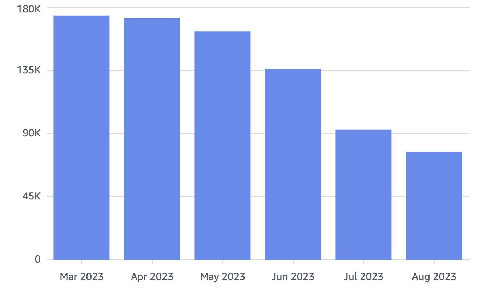
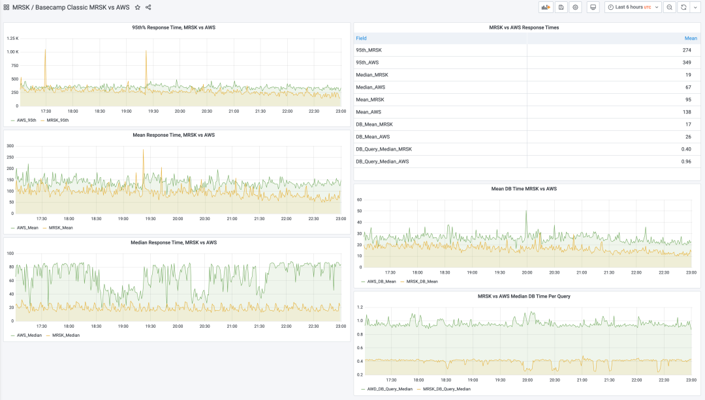
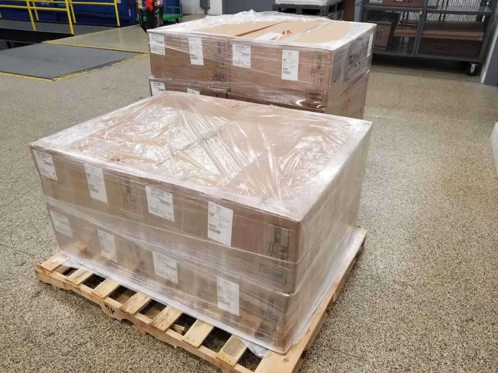
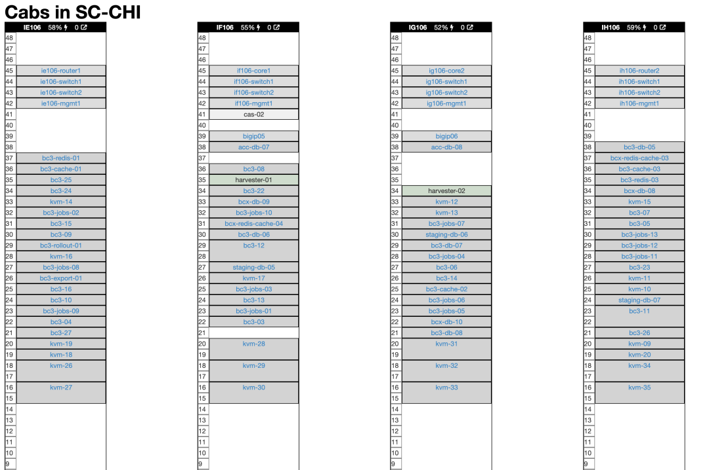
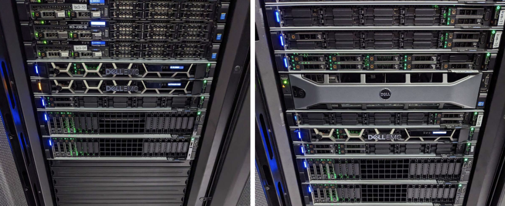
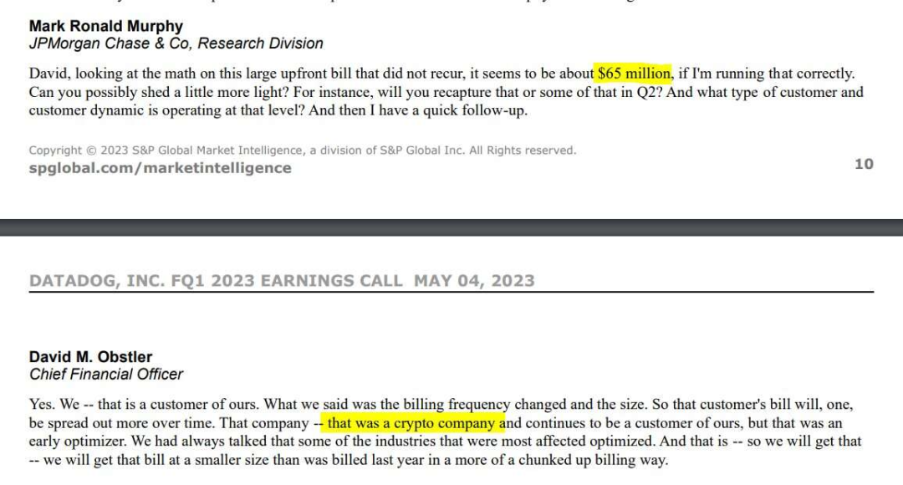

DHH一直以来都是下云先锋，本文摘取了DHH博客关于下云相关的十篇文章，记录了 37Signal 从云上搬下来的完整旅程，按照时间倒序排列组织，译为中文，以飨读者。本文翻译了DHH从云上下来的完整旅程，对于准备上云，云上的企业都非常有借鉴与参考价值。

- 01 2023-10-27 [推特X下云省掉60%](#10-27-推特x下云省掉60)
- 02 2023-10-06 [托管云服务的代价](#10-06-托管云服务的代价)
- 03 2023-09-15 [下云后已省百万美金](#09-15-下云后已省百万美金)
- 04 2023-06-23 [我们已经下云了！](#06-23-我们已经下云了)
- 05 2023-05-03 [从云遣返到主权云！](#05-03-从云遣返到主权云)
- 06 2023-05-02 [下云还有性能回报？](#05-02-下云还有性能回报)
- 07 2023-04-06 [下云所需的硬件已就位！](#04-06-下云所需的硬件已就位)
- 08 2023-03-23 [裁员前不先考虑下云吗？](#03-23-裁员前不先考虑下云吗)
- 09 2023-03-11 [失控的不仅仅是云成本！](#03-11-失控的不仅仅是云成本)
- 10 2023-02-22 [指导下云的五条价值观](#02-22-指导下云的五条价值观)
- 11 2023-02-21 [下云将给咱省下五千万！](#02-21-下云将给咱省下五千万)
- 12 2023-01-26 [折腾硬件的乐趣重现](#01-26-折腾硬件的乐趣重现)
- 13 2023-01-10 [‘企业级’替代品还要离谱](#01-10-企业级替代品还要离谱)
- 14 2022-10-19 [我们为什么要下云？](#2022-10-19-我们为什么要下云)
- [References](#references)

作者：**David Heinemeier Hansson**，网名DHH。 37 Signal 联创与CTO，Ruby on Rails 作者，下云倡导者、实践者、领跑者。反击科技巨头垄断的先锋。[Hey博客](https://world.hey.com/dhh)

译者：**Vonng**，磐吉云数创始人与CEO。Pigsty 作者，PostgreSQL 专家与布道师。云计算泥石流，数据库老司机，下云倡导者，数据库下云实践者。[Vonng博客](https://vonng.com/cn/)

-------------

## 译序

世人常道云上好，托管服务烦恼少。我言云乃杀猪盘，溢价百倍实厚颜。

赛博地主搞垄断，白嫖吸血开源件。租服务器炒概念，坐地起价剥血汗。

世人皆趋云上游，不觉开销似水流。云租天价难为持，自建之路更稳实。

下云先锋大卫王，引领潮流把枪扛，不畏浮云遮望眼，只缘身在最前锋。

 

曾几何时，“上云“近乎成为技术圈的政治正确，整整一代应用开发者的视野被云遮蔽。DHH，以及像我这样的人愿意成为这个质疑者，用实打实的数据与亲身经历，讲清楚公有云租赁模式的陷阱。

很多开发者并没有意识到，底层硬件已经出现了翻天覆地的变化，性能与成本以指数方式增长与降低。许多习以为常的工作假设都已经被打破，无数利弊权衡与架构方案值得重新思索与设计。

我们认为，公有云有其存在意义 —— 对于那些非常早期、或两年后不复存在的公司，对于那些完全不在乎花钱、或者真正有着极端大起大落的不规则负载的公司来说，对于那些需要出海合规，CDN等服务的公司来说，公有云仍然是非常值得考虑的服务选项。

然而对绝大多数已经发展起来，有一定规模的公司来说，如果能在几年内摊销资产，你真的应该认真重新审视一下这股云热潮。好处被大大夸张了 —— 在云上跑东西通常和你自己弄一样复杂，却贵得离谱，我真诚建议您好好算一下帐。

最近十年间，硬件以摩尔定律的速度持续演进，IDC2.0与资源云提供了公有云资源的物美价廉替代，开源软件与开源管控调度软件的出现，更是让自建的能力变得唾手可及 —— 下云自建，在成本，性能，与安全自主可控上都会有非常显著的回报。

我们提倡下云理念，并提供了实践的路径与切实可用的自建替代品 —— 我们将为认同这一结论的追随者提前铺设好意识形态与技术上的道路。不为别的，只是期望所有用户都能拥有自己的数字家园，而不是从科技巨头云领主那里租用农场。

这也是一场对互联网集中化与反击赛博地主垄断收租的运动，让互联网 —— 这个美丽的自由避风港与理想乡可以走得更长。

-------------

## 10-27 推特X下云省掉60%

> **X celebrates 60% savings from cloud exit**[1]

马斯克在X公司（Twitter）大力削减成本，简化流程。这个过程或许并非一帆风顺，但却效果显著。他不止一次地证明了那些对他嗤之以鼻的人们是错的。尽管有[许多声音](https://37signals.com/podcast/twitter-is-still-up/)说，在经历了这么大的人事变动后，推特很快会翻车，但事实并非如此。X不仅成功地维持了网站的稳定运行，还在此期间加速了实验功能的推进。无论你喜欢还是讨厌这里的政治立场，这都是令人印象深刻的。

我明白对于很多人来说，很难置政治于不顾。但无论你站哪一边，总是能找到一张图表来证明，X要么正在繁荣，要么即将崩溃，所以在这里抬杠没有意义。

真正重要的是，X 已经将下云（`#CloudExit`）作为它们节省成本计划的关键组成部分。以下是其工程团队在[庆祝去年成果](https://twitter.com/XEng/status/1717754398410240018)时的发言：

> *"我们优化了公有云的使用，并在本地进行更多的工作。这一转变使我们每月的云成本降低了60%。我们进行的改变里有一个是将所有的媒体/Blob工件从云端移出，这让我们的总体云数据存储量减少了60%，另外我们还成功地将云上的数据处理成本降低了75%。"*

请再仔细读一遍上面那段话：把同样的工作从云端转移到自己的服务器上，让每月的云费用降低了60% （！！）。根据[早先的报道](https://www.cloudzero.com/blog/twitter-aws)，X 每年在 AWS 上的开销是1亿美元，所以如果以此为基础，他们从云退出的成果可以节省高达6000万美元/年，堪称惊人！

更令人印象深刻的是，他们在团队规模缩小到原来的四分之一的情况下，还能够如此迅速地削减云账单。Twitter 曾有大约八千名员工，而现在据报道 X 的员工数量不到2,000。

CFO 和投资人无法忽视这一现象：如果像X这样的公司能够以四分之一的员工运营，并且从下云过程中大大获利，那么在许多情况下，大多数大公司从云端退出都有巨大的省钱潜力。

[#CloudExit](https://basecamp.com/cloud/-exit)或许即将成为主流，你算过你的云账单吗？

-------------

## 10-06 托管云服务的代价

> **The price of managed cloud services**[2]

自从[我们离开云计算](https://world.hey.com/dhh/we-have-left-the-cloud-251760fb)后，常有人反驳说，我们不应该指望一个简单的下云迁移能有什么好果子吃。云的真正价值在于托管服务和新架构，而不仅仅是在租来的云服务器上运行同样的软件。翻译过来就是：“你用云的姿势不对！” ，这种论调简直是胡说八道！

首先 [HEY](https://hey.com/) 是在云中诞生的。在发布前，它从未在我们自己的硬件上运行过。我们在2020年开始使用 Aurora/RDS 来管理数据库，使用 OpenSearch 进行搜索，使用 EKS 来管理应用和服务器。我们深度使用了原生的云组件，而不仅仅是租了一堆虚拟机。

正是因为我们如此广泛地使用了云提供的各种服务，[账单](https://dev.37signals.com/our-cloud-spend-in-2022/)才如此之高。而且运营所需的人手也没有明显减少，我们对此深感失望。这个问题的答案绝不可能是“只管使用更多的托管服务”，或者挥一挥 “Serverless 魔法棒” 就解决了。

以我们在AWS上使用 OpenSearch 服务为例。我们每月花费三十万（$43,333）来为 Basecamp、HEY 以及我们的日志基础设施提供搜索服务，每年近四百万（52万美元），这仅仅是搜索啊！

而现在，我们[刚刚关闭](https://twitter.com/dhh/status/1712541981220786606)了在 OpenSearch 上的最后一个大型日志集群，所以现在是一个很好的时机来对比替代选项的开销。我们购买所需硬件大约花费了$150,000（每个数据中心 $75,000 以实现完全冗余），如果在五年内折旧摊销，大约是每月 $2,500。我们在两个数据中心里还要为这些机器提供电力、机位和网络，每月开销大约 $2,500。所以每月总共是五千美元，这还是包含了预留缓冲的情况。

这比我们在 OpenSearch 上的开销少了整整一个数量级！我们在硬件上花费的 $150,000 在短短三个月内就回本了，从三个月后我们每月将节省约 $40,000，这仅仅是搜索啊！

这时，人们通常会开始问人力成本的问题。这是一个合理的问题：如果你得雇佣一大堆工程师来自建自维服务，那么每月节省 $40,000 又算得上啥呢？首先，我得说即使我们不得不**全职**雇佣一个人来负责搜索服务，我仍然认为这是一件很划算的事，但我们没有这么做。

从 OpenSearch 切换到自己运行 Elastic Search 确实需要一些初始配置工作，但长远来看，我们没有因为这次切换而扩大团队规模。因为在自己的设备上运行，与在云上运行并没有本质上的工作范围差异。这就是我们整体下云的核心理念：

**在云上运营我们这种规模所需的运维团队，并不会比在我们自己硬件上运行所需的规模更小！**

这原本只是一个理论，但在现实中看到它被证实，仍然是令人震惊的。

-------------

## 09-15 下云后已省百万美金

> **Our cloud exit has already yielded $1m/year in savings**[3]

把我们的应用 [**搬下云**](https://world.hey.com/dhh/we-have-left-the-cloud-251760fb) 非常值得庆祝，但看到实际开支减少才是真正的奖励。你看，要将云端的价格从“荒谬”的程度降至“过份”的唯一方式是“预留实例”。就是你需要签约承诺在一年或者更长时间范围里，消费支出保持在某个水平上。因此，我们账单并没有在应用搬离后立即塌缩。但是现在，它要来了。哦，它就要来了！

我们的云支出（不包括S3）已经减少了 60% 。从每月大约十八万美元（$180,000）减少到不到八万美元（$80,000）。每年可以在这里省下的钱折合一百万美元，而且我们在九月还会有第二轮大幅降低，剩余的支出将在年底前逐渐减少。

现在可以将省下的云开销与我们[自己购买服务器](https://world.hey.com/dhh/the-hardware-we-need-for-our-cloud-exit-has-arrived-99d66966)的支出相比。我们需要花五十万美元来采购新服务器，用于替换云上所有的租赁项目。虽然会产生一些与新服务器有关的额外开销，但与整体图景相比（例如我们的运维团队规模保持不变）这只能算三瓜俩枣。我们只需要把新花掉的钱和省下来的钱进行简单对比，就能看出这个令人震惊的事实：我们会在不到六个月的时间内，省下来足够多的钱，让这笔采购服务器的大开销回本。

但是请等我们把话说完，看一看最终省下来的结果：用不着小学算术就能看出，最终能节省下的开销金额高达每年两百万美元，按五年算也就是整整 **一千万美元**！！！。这真是一笔巨大的钱款，直接击穿了我们的底线。

我们要再次提醒，每个人的情况都可能有所不同，也许你没有[像我们之前那样](https://dev.37signals.com/our-cloud-spend-in-2022/)使用这些昂贵的云服务：Aurora/RDS，以及 OpenSearch。也许你的负载确实有着很大的波动，也许这，也许那，但我并不认为我们的情况是某种疯狂的特例。

事实上，从我看到的其他软件公司未经优化的云账单来看，我们节省下来的钱实际上可能不算大。你知道[过去五年Snapchat在云上花费了**三十亿美元**](https://www.businessinsider.com/snap-google-cloud-aws-reducing-costs-2023-2?IR=C)吗？在以前没人在乎业务是否盈利，能省个十几亿这种事“不重要”，没人愿意听，但[现在确实很重要了](https://world.hey.com/dhh/the-bubble-has-popped-for-unprofitable-software-companies-2a0a5f57)。

-------------

## 06-23 我们已经下云了！

> **We have left the cloud**[4]

我们当初花了几年时间才搬上公有云，所以最初我以为下云也要耗费同样漫长的时间。然而当初上云时做准备的工作 —— 比如将应用容器化，实际上使下云过程相对简单很多。如今经过六个月的努力，我们完成了这个目标 —— 我们已经从云上下来了。上周三，最后一个应用被迁移到了我们自己的硬件上。哈利路亚！

在这六个月中，我们将六个历史悠久的服务迁回了本地。虽然我们已经不再销售这些服务了，但我们承诺为现有的客户和用户提供支持，直到互联网的终点。Basecamp Classic、Highrise、Writeboard、Campfire、Backpack 和 Ta-da List 都已经有十多年的历史了，但仍在为成千上万的人提供服务，每年创造数百万美元的收入。但现在，我们在这些服务上的运营开支将大大减少，而且归功于强大的新硬件，用户体验更加丝滑迅捷了。

不过，变化最大的是 HEY，这是一个诞生于云端的应用。我们以前从未在自己的硬件上跑过它，而且作为一个功能齐全的电子邮件服务，它有许多组件。但是我们的团队通过分阶段迁移，在几周内成功地将不同的数据库、缓存、邮件服务和应用实例独立地迁移到本地，而没有出现任何岔子。

将所有这些应用迁回本地的过程中，我们所使用的技术栈完全是开源的 —— 我们使用 KVM 将新买的顶配性能怪兽 —— 192 线程的 Dell R7625s 切分为独立的虚拟机，然后使用 Docker 运行容器化的应用，最后使用 MRSK 完成不停机应用部署与回滚 —— 这种方式让我们规避了 Kubernetes 的复杂度，也省却了各种形式的 “企业级” 服务合同纠葛。

粗略的计算表明，购置自己的硬件而不是从亚马逊租赁，每年至少可以为我们节省150万美元。关键是在完成这一切的过程中，我们的运维团队规模并没有变化：云所号称的缩减团队规模带来生产力增益纯属放屁，压根没有实现过。

这可能吗？当然！因为我们运维自己硬件的方式，实际上与人们租赁使用云服务的方式差不多：我们从戴尔买新硬件，直接运到我们使用的两个数据中心，然后请 Deft 公司那些白手套代维服务商把新机器上架。接着，我们就能看到新的 IP 地址蹦出来，然后立即装上 KVM / Docker / MRSK ，完事！

这里的主要区别是，从需要新服务器和看到它们在线之间的**滞后时间**。在云上，你可以在几分钟内拉起一百台顶配服务器，这一点确实很牛逼，只不过你也得为这个特权掏大价钱。只不过，我们的业务没有那么反复无常，以至于需要支付这么高昂的溢价。考虑到拥有自己的服务器已经为我们省了这么多钱，使劲儿超配些服务器根本不算个事儿 —— 如果还需要更多的话，也就是等个把星期的事儿。

从另一个角度看，我们花了大概 **50万美元**从戴尔买了两托盘服务器，为我们的服务容量添加了 4000核的 vCPU，7680GB 的内存，以及 384TB 的 NVMe 存储。这些硬件不仅能运行我们所有的存量服务，还能让 HEY 满血复活，并为我们的 Basecamp 其他业务换个崭新的心脏。这些硬件成本会在五年里摊销，然而购买它们的总价还不到我们**每年**省下来钱的三分之一 ！

这也难怪为什么当我们分享了自己的下云经验后，许多公司都开始重新审视他们每个月那疯狂的云账单了。我们去年的云预算是 **320万** 美元，而且已经优化得很厉害了 —— 像长期服务承诺、精打细算的资源配置和监控。有大把的公司比我们掏了几倍多的钱却办了更少的事儿。潜在的优化空间和 AWS 的季度业绩一样惊人 —— 2022 Q4 ，AWS 为亚马逊创造了超过 **50亿美元** 的利润！

正如我之前提到过的：对于那些非常早期、完全不在乎花钱、或者两年后不复存在的公司，我认为云仍然是有一席之地的。只是要小心，别把那些慷慨的云代金券当作礼物！那是个鱼钩，一旦你过于依赖他们的专有托管服务或Serverless产品。当账单飙上天际时，你就无处可逃了。

我还认为**可能**确实会有一些公司，有着极端大起大落的不规则负载，以至于租赁还是有意义的。如果你一年只需要犁三次地，那么在其余的363天里把犁放在谷仓里闲置，确实是没有多大意义。

但是对绝大多数已经发展起来的公司来说，如果能在几年内摊销资产，你真的应该认真重新审视一下这股云热潮。好处被大大夸张了 —— 在云上跑东西通常和你自己弄一样复杂，却贵得离谱。

所以，如果钱很重要（话说回来，什么时候不重要呢？）—— 我真的建议您好好算一下账：假设您真的有一个能从不断调整容量大小中获益的服务，然后设想它下云之后的样子。我们在六个月内搬下来七个应用，你也可以的。工具就在那里，都是开源免费的。所以不要仅仅因为炒作，就停留在云端。

-------------

## 05-03 从云遣返到主权云！

> **Sovereign clouds**[5]

我一直在讨论我们的下云之旅 —— “云遣返”。从在AWS上租服务器，到在一个本地数据中心拥有这些硬件。但我意识到这个术语可能会错误地让一些人感到不舒服 —— 有一整代技术人员给自己标记上"云原生"。仅仅只是因为我们想拥有而非租用服务器这种理由而疏远他们，并不能帮到任何人。这些“云原生”人才所拥有的大部分技能都是有用的，无论他们的应用跑在哪儿。

技能的重叠实际上是为什么我们能从AWS退出如此之快的部分原因。现如今，在你自有硬件上运行所需 的知识，和在云上租赁运行所需的知识十有八九是相同的。从容器到负载均衡，再到监控和性能分析，还有其他一百万个主题 —— 技术栈不仅仅是相似而已，几乎可以说一模一样。

当然也会有地方会有差别，比如 FinOps：如果你拥有自己的硬件，就不再需要像法医和会计师那样理解账单，也不需要像斗牛犬一样防止它疯狂增长了！但这确实也意味着，你偶尔需要处理磁盘损坏告警，找数据中心的白手套来换备件。

但是在全局图景中，这些都是微不足道的差异。对于一个云上租赁弓马娴熟的人来说，教会他在自有硬件上运行同样的技术栈并不会耗费太长时间（这个学习曲线肯定比跟上Kubernetes的速度要容易多了）

针对这个问题，有些人建议使用"私有云"这个术语。这个名字让我联想到毛骨悚然的CIO白皮书 —— 虽然我也不认为它有足够的冲击力让公众明了其中的差异。但我得承认，对于刚刚沉淀下一些“云XX”自我身份认同的整个行业来说，这个术语显然更能缓和气氛。这不禁让我思考起来。

最终，我认为这里的关键区别不是公有还是私有，而是 —— 自有还是租赁。我们需要反击云上租赁的 “**你将一无所有并乐在其中** ” 的宣传。这种异端观点有悖于时代精神，会招致互联网（ —— 这个分布式的，无需许可的世界奇观）支持者的强烈反感。

因此，让我提出一个新术语：“**主权云**”。

主权云建立在所有权与独立性上。这是一个的可选的升级项：对所有的云租户来说，只要他们的业务强大到足以承担一部分前期成本。这也是一个值得追求的目标：拥有自己的数字家园，而不是从科技巨头云领主那里租用农场。这也是一场对互联网集中化，和正在兴起的赛博地主垄断租金的反击运动。

试试看吧！

-------------

## 05-02 下云还有性能回报？

> **Cloud exit pays off in performance too**[6]

上周，我们成功完成了迄今为止最大的一次下云行动，这次是搬迁 Basecamp Classic。这是我们从2004年开始就整起来的元老应用。而现在，在AWS上运行了几年之后，它又回到了我们自己的硬件上使用 MRSK 管理，天哪，性能实在是太屌了，看看这张监控图：

现在的请求响应时间中位数只有 19ms，而以前要 67ms；平均值从138ms 降至 95ms。查询耗时的中位数降了一半（当你一个请求做很多查询时，这可是会累积起来放大的）。Basecamp Classic 在云上的表现一直还不错，但是现在95%的请求RT都低于那个的 300ms "慢"界限。

> 也别把这些比较太当回事：这并非严谨的净室科学实验，只是我们刚刚离开精细微调的云环境，放到自有替代硬件上刚跑出来的峰值。

Basecamp Classic 以前跑在 AWS EKS 上（那是他们的托管 Kubernetes ），应用本身混用 c5.xlarge 和 c5.2xlarge 实例部署。数据库跑在 db.r4.2xlarge 和 db.r4.xlarge 规格的 RDS 实例上。现在都搬回老家，跑在配备了双 AMD EPYC 9454 CPU 的 Dell R7625 服务器上。

用来跑应用和任务的 vCPU 核数规格都一样，122个。以前是云上的 vCPU，现在是 KVM 配置的核数。而且，在保持上面牛逼性能的前提下，现在负载水平还有很大压榨空间。

实际上，考虑到我们的每一台新的 Dell R7625 都有196个 vCPU，所以包含数据库与 Redis 在内的整个 Basecamp Classic 应用其实可以完整跑在这样的单台机器上！这简直太震撼了，当然，出于安全冗余的考虑你并不会真的这么做。但这确实证明了**硬件领域重新变得有趣起来**，我们绕了一圈又回到了 “原点” —— 当 Basecamp 起步时，我们就是在单个机器（**只有1核！**）上跑起来的，而到了 2023 年，我们又能重新在一台机器上跑起来了。

这样的机器每台不到**两万美元**，除路由器外的所有硬件五年摊销，就是333美元/每月。这就是当下运行完整 Basecamp Classic 所需的费用 —— 而这仍然是一个每年实打实产出数百万美元收入大型的 SaaS 应用！而市场上绝大多数 SaaS 业务服务客户所需的火力将远远少于此。

我们并未期望下云能提高应用的性能，但它确实做到了，这真是个意外之喜。尤其是 Basecamp Classic，我们业务中的二十年老将，依然在为一个庞大的，忠诚的，满意的客户群提供服务，这些客户在过去十年里都没获得任何新功能 —— 不过，嘿，速度也是一种特性，所以呢，你也可以说我们刚刚发布了一个新特性吧！

接下就是下云的重头戏了 —— HEY！敬请期待。

-------------

## 04-06 下云所需的硬件已就位！

> **The hardware we need for our cloud exit has arrived**[7]

距离我上次看到运行我们 37Signal 公司服务所使用的物理服务器硬件已经过去很长时间了。我依稀记得上次是十年前参观我们在芝加哥的数据中心，但是在某个时间点，我对硬件就失去兴趣了。然而现在我又重新对它感兴趣了 —— **因为硬件领域变得越来越有趣起来**。所以让我来和你们分享一下这种兴奋吧：

这是最近运抵我们芝加哥数据中心的两个托盘。同一天，一套同样的设备也到达了我们在弗吉尼亚州 Ashburn 的第二个数据中心。总的来说，我们收到了二十台R7625 Dell 服务器，是支撑我们的下云计划的主力。如此令人震惊的算力，占用的空间却惊人的小。

这是我们在芝加哥数据中心四个机柜的示意图（我们在 Ashburn 还有另外四个）。正如你所见，还有一堆专门给 Basecamp 用的老硬件。一旦我们装好新机器，大部分老服务器就该退役了。在下面带有 "kvm" 标记的2U服务器是新家伙：

这儿你可以看到新的R7625服务器位于机架底部，挨着旧设备：

每台R7625都包含两个 AMD EPYC 9454 处理器，每个处理器 48个核心/96个线程，频率 2.75 GHz。这意味着我们为私有部署大军的容量添加了近4000个虚拟CPU！近乎荒谬的 7680GB 内存！以及 384TB 的第四代 NVMe SSD 存储！除了足以满足未来数年需求的强大马力外，在夏季前还有另外六台数据库服务器要过来，然后我们就全准备好啦。

与 Basecamp 起源形成鲜明对比的是，我们在2004年以一台只有256MB内存的单核Celeron服务器启动了Basecamp，用的还是 7200转的破烂硬盘。而那些玩意已经足够我们在一年间把它从兼职业务转为全职工作。

二十年后，我们现在有一大堆历史遗留应用（因为我们承诺让客户依赖的应用运行到互联网的终点！），一些诸如 Basecamp 和 HEY 的大型旗舰服务，以及让这些重新运行在我们自己硬件上的使命任务。

想想三个月前，我们决定放弃 Kubernetes 并使用 MRSK 打造更简单的下云解决方案，这还是挺疯狂的一件事儿。但是看看现在，我们已经把一半跑在云上的应用搬回了家中！

在接下来的一个月中，我们计划将 Basecamp Classic（这玩意13年没有更新了，但仍然是一个每年赚数百万美元的业务 —— 这就是SaaS的魔法！），以及下云的重头戏 —— HEY！全部都带回家。这样在五月初的话，我们云上就只剩下 Highrise 和一个名叫 Portfolio 的小型辅助服务了。我原本以为，在夏末完成下云已经是很乐观的估计了，但现在看来，基本上会在春天结束之前就能搞定，绝对算是我们团队的一个杰出成就。

加速的时刻表让我对下云大业更加充满信心，我本以为下云会跟上云一样困难，但事实表明并非如此。我想也许是每月**三万八千美元**的云消费的原因，它就像吊在我们面前的胡萝卜一样，激励着我们更快地去完成这件事。

我真诚地希望那些看着自己令人生畏的云账单的 SaaS 创业者注意到这一点：上云之后再下来这件事，看起来几乎是不可能的，但你一个字儿也别信！

现代服务器硬件在过去几年中，在性能、密度和成本上都有了不可思议的巨大飞跃。如果在过去十年中云已经成为了你的默认选项，那么我建议你重新了解一下相关数字。这些数字很可能会像震惊我们一样吓到你们。

因此，下云的终点就在眼前，我们已经解决了所有下云所需的关键技术挑战，让这件事变得切实可行起来。我们已经在 MRSK 上运行生产应用一段时间了。道路是非常光明的，我已经迫不及待地想看到那些巨大的云账单赶紧消失掉。我觉得之前粗略估算的下云降本数额已经高度保守了，让我们拭目以待，我们也会分享出来。

-------------

## 03-23 裁员前不先考虑下云吗？

> **Cut cloud before payroll**[8]

最近每周都能看到科技公司大裁员的新闻，几个科技巨头已经进行了第二轮裁员，而且没人说不会有第三轮。尽管在个人层面上这是很难受但 —— 我太难了！—— 但对整个经济来说，还算是有一个积极的方面：释放了被束缚的人才。

你看，大型科技公司在疫情期间以如此高的薪资吞噬吸收了大量人才，以至于几乎没有给生态中其他人留点渣。在关键技术人才的竞争中，除了科技巨头之外的许多公司都出不起价，被挤出了市场。长期来看，这对经济来说肯定不是啥好事。我们需要聪明人去关注一些除了让人点击广告之外的问题。

尽管 Facebook、Amazon 这些科技巨头的巨额裁员占据了新闻头条，小型科技公司也在进行裁员，很难相信这里还有什么生机。当然，小公司也有可能和巨头们一样，雄心勃勃地雇佣了一批他们不仅不需要，反而会拖慢进度的人。如果是这样，那还算有点道理。

但也有这种可能，这些公司的技术的市场正在收缩，而投资者不再愿意延长亏损期，所以不得不裁员以削减成本以免破产。这是谨慎的做法，但是人力并不是唯一的成本。

在我所了解的大部分科技公司中，主要有两项大的开支：员工 与 云服务。员工通常是最大的开支，但令人震惊的是，云服务的费用也可以非常非常大。或者对真正算过这笔账的人来说，“震惊”这个词不太合适，恰当的用词是 —— “可怖”。

在与云业务有关的事上我可能有些老生常谈了，但当我看到科技公司试图通过裁员，而不是控制他们的云支出来削减成本时，我真的感到非常困惑。削减云开支最好的方式，特别是对于中等及以上规模的软件公司来说，就是部分/全部下云！

所以我敦促所有正在检阅预算，想知道在哪里可以降本增效的创始人和高管们优先关注云开支。也许你可以通过优化现有的资源使用来走的更远（现在有一整个新冒出来的小行业在干这事：FinOps），但也许你也高估了自己采购硬件自建与下云的难度。

我们已经完成了一半的下云工作。我们真正开始全力以赴是在1月份。我们不仅在搬迁那些最先进的现代技术栈，还要迁移很多历史遗留领域的应用。然而在下云的进度上，这已经比我敢想到的速度要快太多了。我们已经在下云日程表上远超预期了，大幅度的开支缩减肉眼可见。

如果我们可以这么快地做到这些，那么当你经营一家公司而准备打印那些解雇通知前，至少有责任计算一下这些数字并检视一下可行的选项，这也是对你的员工应当负起的责任。

-------------

## 03-11 失控的不仅仅是云成本！

> **It's not just cloud costs that are out of control**[9]

这个月底我们在 Datadog 上的年度订阅要到期了，我们不打算续费。

Datadog 是一个性能监控工具，倒不是因为我们不喜欢这项服务 —— 实际上它非常棒！我们不续订是因为它每年花费我们 88,000 美元，这实在是太离谱了。而且这反映出一个更大的问题：企业SaaS定价越来越愚蠢荒谬。

然而，我原本以为我们的账单已经够傻逼了。但是竟然有一个 Datadog 的客户为他们的服务支付了 6500 万美元！！这个信息是在他们最近的财报电话会议上提到的。这显然是一家加密货币公司，用“优化”账单的方式承认了这项蠢出天际的开支。

冒着陈词滥调的风险我也要说：这种花在性能和监控服务上的支出就像零利率投资一样：我无法想象在哪个宇宙里会认为这是一项合理的开支。这种事儿明显能用开源替代解决，如果你要做点内部二开魔改定制还能解决的更好更优雅。

但我发现很多企业级 SaaS 软件都是这样的，比如在一个2000人的公司里采购 Salesforce 的 Slack， 每人每月 15$ ：仅仅是为了一个聊天工具，每年的开支就超过了三十万美元！

现在，再加上像 Asana 这样的工具，每人每月30刀。然后是 Dropbox 每人每月20美元。只是这三个工具，每个席位每月就需要每月65刀的费用。对那家2000人的公司来说，每年的成本就是一百五十万刀。哎妈呀！

我很惊讶于目前还没有更多的压力迫使那些为他们的SaaS软件支付高昂费用的公司去削减成本。但我觉得快了 —— 感觉我们现在正处在一个服务的泡沫里，等待着破裂 —— 总会有人看到这些利润空间并发现机会。

这也是我们坚持 Basecamp 调性的一个关键原因。任何人向我们支付的最高费用不会超过每月299美元 —— 不限用户，不限功能，所有一切。是的，我们是不是扔掉了钓大鱼的机会？可能吧。但我不能心安理得地以我自己都不愿支付的价格来出售这些软件。

我们确实需要在这儿调整一下。

-------------

## 02-22 指导下云的五条价值观

> **Five values guiding our cloud exit**[10]

当谈及我们离开云的原因时，已经说了很多关于 **成本** 的事儿。尽管成本非常重要，但它并不是唯一的动机。以下是五条引领我们决策的价值观，我最近在37signals的内网文章里阐述了这些原则：

**1. 我们最看重的是独立性**。被困在亚马逊的云里，在实验新东西（比如固态缓存）时，不得不忍受高昂到荒诞的定价带来的羞辱，这已经构成对此核心价值观无法容忍的侵犯。

**2. 我们服务于互联网本身**。这个业务的整个存在，都归功于社会与经济上的异类 —— 互联网。可以用来进行包括商业在内的各种活动，却不归属任何一家公司或任何一个国家。自由贸易和自由表达得以在一个人类历史上前所未有的规模上实现。我们不会让手中的钱，被用于侵蚀这个理想乡 —— 让支撑这个美丽的自由避风港的服务器在集中到少数几个超大规模数据中心的手中。

**3. 我们明智地花钱**。在几个关键例子上，云的成本都极其高昂 —— 无论是大型物理机数据库、大型 NVMe 存储，或者只是最新最快的算力。租生产队的驴所花的钱是如此高昂，以至于几个月的租金就能与直接购买它的价格持平。在这种情况下，你应该直接直接把这头驴买下来！我们将把我们的钱，花在我们自己的硬件和我们自己的人身上，其他的一切都会被压缩。

**4. 我们引领道路**。在过去十多年间，云作为 “标准答案” 被推销给我们这样的 SaaS 公司。我相信了这个故事，我们都相信了这一套，然而这个故事并不是真的。云计算有它的适用场景，例如我们在 HEY 起步时就很好地使用了云，然而这是一个少数派生态位。许多像我们一样规模的 SaaS 业务应当拥有他们自己的基础设施而不是靠租赁。我们将为认同这一结论的追随者提前铺设好意识形态与技术上的道路。

**5. 我们寻求冒险**。"不要弄些小打小闹的计划，它没有激发人们热血的魔力，本身也可能无法实现。要绘制宏伟蓝图，志存高远，并竭尽所能" —— 丹尼尔·伯纳姆。我们已经在这一行打拼了二十多年了。为了维持内心的热情，我们应当继续设定高标准，坚守我们的价值观，并在各个方面探索新边疆，否则我们会枯萎的。我们不需要成为最大的，我们也不需要成为赚得最多的，但我们确实需要继续学习，挑战和追求。

我们走！

-------------

## 02-21 下云将给咱省下五千万！

> **We stand to save $7m over five years from our cloud exit**[11]

自从去年十月份我们宣布打算下云以来，我们一直在脚踏实地的推进。在一个企业级Kubernetes供应商那儿走了一条短暂的弯路后，我们开始自己开发工具，并在几周前成功地将第一个小应用从云上搬下来。现在我们的目标是在夏天结束前完全下云，根据我们的初步计算，这样做将在五年内为我们节省大约700万美元的服务器费用，而无需改变我们运维团队的规模。

粗略的计算方式是这样的：我们在2022年的云开销是320万美元。其中有将近100万美元用在 S3 上，用于存储 8PB 的文件，这些文件在几个不同区域中进行了全量复制。而剩下的大约230万美元用在其他所有东西上：应用服务器、缓存服务器、数据库服务器、搜索服务器，其他所有的事情。这部分预算是我们打算在2023年归零的部分。然后我们将在2024年再来着手把 S3 上的 8PB 给搬走。

经过深思熟虑与多次基准测试，我们叹服于 AMD新的 Zen4 芯片，以及四代NVMe磁盘的惊人速度。我们基本上准备好向 Dell 下订单了，大约 **60万** 美元。我们仍在仔细调整所需的具体配置，但是对算总账来说，无论我们最终是每个数据中心订购8台双插槽64核CPU的机器（一个箱子里256个vCPU！），还是14台运行单插槽CPU但主频更高的机器，这种细节并不重要。我们需要为每个数据中心添加约 2000核vCPU算力，而我们的业务跑在两个数据中心里，所以考虑到性能和冗余的需求，我们需要 4000 核vCPU 算力，这都是粗略的数字。

在云的时代，投入60万美元购买一堆硬件可能听上去不少，但如果你把它摊销到五年里，那就只有12万美元一年！这已经很保守了，我们还有不少服务器已经跑了七八年了。

当然，那只是服务器盒子本身的价格，它们还需要接上电源和带宽。我们目前在Deft的两个数据中心上有八个专用机架，每月花费大约6万美元。我们特意超配了一些空间，所以我们呢可以把这些新服务器塞进现有的机架中，而无需为更多机位与电力付钱，因而每年机房本身开销仍然是 **72万** 美元。

所有的花销总计每年84万美元：包括了带宽、电力，以及按照五年折旧的服务器盒子。与云上的**230万**美元相比，我们的硬件要快得多，有更多的算力，极其便宜的 NVMe 存储，以及用极低的成本进行扩展的空间（只要我们每个数据中心的四个机架里还放得下）。

我们大致可以说，每年节省了**150万**美元。预留出一个**50万**美元应对未来五年中尚未预见到的开销，那么**在未来五年，我们仍然可以省下 700万 美元！！**

在当下时间点，任何中型及以上的SaaS业务，如果他们的工作负载稳定，却没有对云服务器的租赁费用和自建服务器进行测试比对，那么可以称得上是财务渎职行为。我建议你打电话给 Dell，然后再打给Deft。拿到一些真实的数据，然后自己做决定。

我们将在2023年完成下云（除了S3），并将继续分享我们的经验，工具，以及计算方法。

-------------

## 01-26 折腾硬件的乐趣重现

> **Hardware is fun again** [12]

2010 年代，我对计算机硬件的兴趣几乎消失殆尽。一年又一年，进步似乎微乎其微。Intel陷入困境，CPU的进步也很有限。唯一能让我眼前一亮的是Apple在手机上的A系列芯片的进步。但那更像是与常规计算机不同的另一个世界。现在却不再是这样了！

现在，计算机硬件再次活跃起来！自从Apple的M1首次亮相以来，硬件有趣程度和大幅改进的通道已经打开。不仅仅是 Apple ，还有 AMD 和 Intel 。世代跃变发生得更加频繁，增益也不再是“微不足道”。处理器核数在迅速增长，单核性能定期向前跃进 20-30%，而且这种进步积累得很迅速。

虽然我对技术本身很感兴趣，但我更关心这些新飞跃会带来什么。例如在2010年代，我们曾经因为手机运行 JavaScript 速度太慢，所以不得不为 Basecamp Web应用创建一个专门的移动版本。现在大多数 iPhone 的速度已经超过了大多数计算机，甚至安卓的芯片也在迎头赶上。因而维护单独构建版本的复杂性已经消失了。

在 SSD/NVMe 存储上也发生了类似的情况，这里的这里的代际跃进幅度甚至比 CPU 领域还要大。我们快速地从第二代约 500MB/秒的速度，到第三代的大约2.5GB/秒，再到第四代大约 5GB/秒，而现在第五代为我们带来高到荒谬的约 13GB/秒 的速度！这种数量级的飞跃，需要你重新想想你的工作假设了。

我们正在探索将 Basecamp 的缓存和任务队列从内存实现转变为NVMe磁盘实现。现在两者的延迟已经足够接近了，所以容量充足且足够快的 NVMe存储更有优势。我们刚买了一些 12TB 的第四代NVMe卡，使用新的 [E1/E3 NVMe接口规格](https://www.servethehome.com/e1-and-e3-edsff-to-take-over-from-m-2-and-2-5-in-ssds-kioxia/)，价格两万块不到（$2,390），这可是 12TB 啊！我们现在正在考虑单机柜 PB级全闪存储服务器的可能性，大概二十万美元，这简直太疯狂啦！

有整整一代的应用开发者只知道云，这使他们一叶障目，无法充分认知到硬件的直接进步速度。随着越来越多的公司开始重新计算[云账单](https://dev.37signals.com/our-cloud-spend-in-2022/)，并把他们的应用从服务器租赁市场上[撤回来](https://world.hey.com/dhh/why-we-re-leaving-the-cloud-654b47e0)，我认为我们将看到越来越多的开发者，重新关心起裸金属服务器来。

举个例子，我很喜欢这个[粗略的草稿证明](https://thume.ca/2023/01/02/one-machine-twitter/)，它证明了 Twitter 可以在单台服务器上运行。你可能不会真的这样做，但这里的数学计算非常有趣。我认为这确实提出了一种观点，那就是我们最终可能会很容易地做到这一点：运行我们所有的高级服务，为数百万用户服务，运行于单台服务器上（或为了冗余考虑，还是三台吧）。

我迫不及待地想要一台配备 Gen 5 NVMe 的 AMD Zen4 机器。拥有 384 个 vCPU 和 13GB/秒带宽的存储，全跑在一台双CPU插槽的刀片服务器内。我已经等不及报名参加这个即将到来的未来了！

-------------

## 01-10 “企业级“替代品还要离谱

> **The only thing worse than cloud pricing is the enterprisey alternatives**[13]

我们在过去几个月一直在想，把 HEY 从云中带回家可能会涉及到 SUSE Rancher 和 Harvester。这些企业级软件产品的组合跑在自有硬件上，却会给我们提供类似于云上的使用体验，而且对现有 HEY 的打包和部署只需进行最小化的改造。但是，当我们需要几次在线会议才能获取关于定价的基本信息时，我们就应该觉察到有些不对劲了，然后看看别的，因为最后的报价完全就是个**狗屎**。

我们每年在云上租用硬件和服务的开销大约为 **300万**美元。拥有我们自己的硬件，运行开源软件来替换，有一部分很重要的目的就是为了砍低那个荒谬的账单。但是我们从 SUSE 收到的报价竟然更为荒谬，200万美元，仅仅是许可和支持成本，仅仅是在我们自己的硬件上运行Rancher和Harvester。

最初，我们其实认为这不会是一个问题。企业销售以高出天际的标价而臭名昭著，然后打折回到实际价格以成交。当我们采购我们热爱的戴尔服务器时，经常能得到 80% 的折扣！所以，配置出一个一万美元的服务器并没有挥霍的感觉 —— 如果实际成交价只是2000美元。

如果这里的情况也类似，那么这个两百万美元的合同将会是每年40万美元。仍然太高，但是我们可以在这里那里削减一点，也许最后能得到我们可以接受的结果。但当我们开始讨价还价施加压力以获得折扣时，答案是 3， 3%。好吧，服了，拉倒吧！

我并不是来告诉别人市场能承受什么价格的。我听说 SUSE 把这些套餐卖给军队和保险公司的生意还不错，祝他们好运。

**但是为什么他妈的这帮人要在一个又一个的会议中对价格折扣守口如瓶，浪费我们的时间？**

因为那就是企业销售游戏。讨价还价，欺诈，玩弄。看看我们能逃脱多少狗屎的游戏，让那些在谈判中搏斗的西装革履的人生活有意义。那就是**赢得**交易的含义 —— 阻挠欺骗另一方。

**我受够了。事实上，我极其厌恶它。**

所以现在我把那种怨气装瓶摇两下，然后大口闷下去以驱使我选择另一条路：我们要建造自己的主题公园，有二十一点，以及……没有那些该死的企业销售人员。

-------------

## 2022-10-19 我们为什么要下云？

> **Why we're leaving the cloud**[14]

过去十多年间 Basecamp 这个业务一只脚在云上，而 HEY 自两年前推出以来就一直独占云端。我们在亚马逊云和谷歌云上大展身手，我们在裸金属与虚拟机上运行，我们在 Kubernetes 上飞驰。我们见识了云上的花花世界，也都尝试过大部分。终于是时候画上句号了：对于像我们这样稳定增长的中型公司来说，租用计算机（在绝大多数情况下）是比糟糕的交易。简化复杂度带来的节省并未变成现实。所以，我们正在制定下云的计划。

云在生态位光谱的两个极端上表现出色，而我们只对其中一个感兴趣。第一个是当你的应用非常简单，流量很低，使用完全托管的服务确实可以省却很多复杂性。这是由 Heroku 开创的光辉之路，后来被 Render 和其他公司发扬光大。当你还没有客户时，这仍然是一个绝佳的起点，即使你开始有一些客户了，它也能支撑你走得很远。（然后随着使用量增加，而账单蹭蹭往上涨突破天际时，你会面临一个大难题，但这是合理的利弊权衡。）

第二个是当你的负载高度不规则时。当你的使用量波动剧烈或者就是高耸的尖峰，基线只是你最大需求的一小部分；或者当你不确定是否需要十台服务器还是一百台。当这种情况发生时，没有什么比云更合适的了，就像我们在推出 HEY 时遇到的情况：突然有 30 万用户在三周内注册尝试我们的服务，而不是我们预计的六个月内 3 万用户。

但是，这两种情况现在对我们都不适用了。对 Basecamp 来说则是从来没有过。继续在云上运营的代价是，我们为**可能**发生的情况支付了近乎荒谬的溢价。这就像你为地震保险支付四分之一的房产价值，而你根本不住在断层线附近一样。是的，如果两个州之外的地震让地面裂开，导致你的地基开裂，你可能会很高兴自己买了保险，但这里的比例感很不对劲，对吧？

以 HEY 为例。我们在数据库（RDS）和搜索（ES）服务上，每年要支付给 AWS 超过**50万**美元的费用。是的，当你为成千上万的客户处理电子邮件时，确实有大量的数据需要分析和存储，但这仍然让我感到有些荒谬。你知道每年**50万**美元能买多少性能怪兽一般的服务器吗？

现在的论调都是这样：没错，但你必须管理这些机器！而云要简单得太多啦！节省下来的都是人工成本！然而，事实并非如此。任何认为在云中运行像 HEY 或 Basecamp 这样的大型服务是“简单”的人，显然从未自己动手试过。有些事情更简单了，而其他事情更复杂了，但总的来说，我还没有听说过我们这个规模的组织因为转向云而能够大幅缩减运维团队的。

不过，这确实是一个绝妙的营销妙招。用类比来推销，比如 “你不会自己开发电厂，对吧？” 或者 “基础设施服务真的是你的核心能力吗？” ，然后再刷上层层脂粉，云的光芒如此闪耀，以至于只有愚昧的路德分子（强烈抵制技术革新的人）才会在它的阴影下运维自己的服务器。

与此同时，亚马逊以高额利润出租服务器来大发横财。尽管在未来的产能和新服务上进行了巨大的投资，AWS 的利润率还能高达 30%（**622亿**美元营收，**185亿**美元的利润）。这个利润率肯定还会飙升，因为该公司表示，“计划将服务器的使用寿命从四年延长到五年，将网络设备的使用寿命从五年延长到将来的六年”。

很好！从别人那里租用计算机当然是很昂贵的。但它从来没有以这种方式呈现 —— 云被描述为按需计算，听起来很前卫很酷，而绝非像“租用电脑”这样平淡无奇的东西，尽管它基本上就是这么回事。

但这不仅仅关乎成本，也关乎我们希望在未来运营一个什么样的互联网。这个去中心化的世界奇迹现在主要是在少数几个大公司拥有的计算机上运行，这让我感到非常悲哀。如果 AWS 的主要区域之一出现故障，看似一半的互联网都会随之下线。这可不是 DARPA 的设计初衷啊！

因此，我认为我们在 37signals 有责任逆流而上。我们的商业模式非常适合拥有自己的硬件，并在多年内进行折旧。增长轨迹大多是可预测的。我们有专业的人才，他们完全可以将他们的才华用于维护我们自己的机器，而不是属于亚马逊或谷歌的机器。而且，我认为还有很多其他公司处于与我们类似的境地。

但在我们勇敢扬帆起航，回到低成本和去中心化的海岸之前，我们需要转舵以扭转公共议题的风向，远离云服务营销的胡言乱语 —— 比如营运你自己的发电厂这类屁话。

直到最近，人们自建服务器所需的工具已经有了巨大的进展，让云成为可能的大部分工具也可以用在你自己的服务器上。不要相信根深蒂固的云上既得利益集团的鬼话 —— 自建运维过于复杂。当年的先辈，开局一条狗，平地起高楼搞起了整个互联网，而现在这件事已经容易太多了。

是时候让拨云见日，让互联网再次闪耀人间了。

-------------

## References

[1] [X celebrates 60% savings from cloud exit](https://world.hey.com/dhh/x-celebrates-60-savings-from-cloud-exit-7cc26895)

[2] [The price of managed cloud services](https://world.hey.com/dhh/the-price-of-managed-cloud-services-4f33d67e)

[3] [Our cloud exit has already yielded $1m/year in savings](https://world.hey.com/dhh/our-cloud-exit-has-already-yielded-1m-year-in-savings-db358dea)

[4] [We have left the cloud](https://world.hey.com/dhh/we-have-left-the-cloud-251760fb)

[5] [Sovereign clouds](https://world.hey.com/dhh/sovereign-clouds-661eb5e4)

[6] [Cloud exit pays off in performance too](https://world.hey.com/dhh/cloud/-exit-pays-off-in-performance-too-4c53b697)

[7] [The hardware we need for our cloud exit has arrived](https://world.hey.com/dhh/the-hardware-we-need-for-our-cloud-exit-has-arrived-99d66966)

[8] [Cut cloud before payroll](https://world.hey.com/dhh/cut-cloud-before-payroll-a4530ebd)

[9] [It's not just cloud costs that are out of control](https://world.hey.com/dhh/it-s-not-just-cloud-costs-that-are-out-of-control-efcd098c)

[10] [Five values guiding our cloud exit](https://world.hey.com/dhh/five-values-guiding-our-cloud-exit-638add47)

[11] [We stand to save $7m over five years from our cloud exit](https://world.hey.com/dhh/we-stand-to-save-7m-over-five-years-from-our-cloud-exit-53996caa)

[12] [Hardware is fun again](https://world.hey.com/dhh/hardware-is-fun-again-b819d0b4)

[13]  [The only thing worse than cloud pricing is the enterprisey alternatives](https://world.hey.com/dhh/the-only-thing-worse-than-cloud-pricing-is-the-enterprisey-alternatives-854e98f3)

[14] [Why we're leaving the cloud](https://world.hey.com/dhh/why-we-re-leaving-the-cloud-654b47e0)
