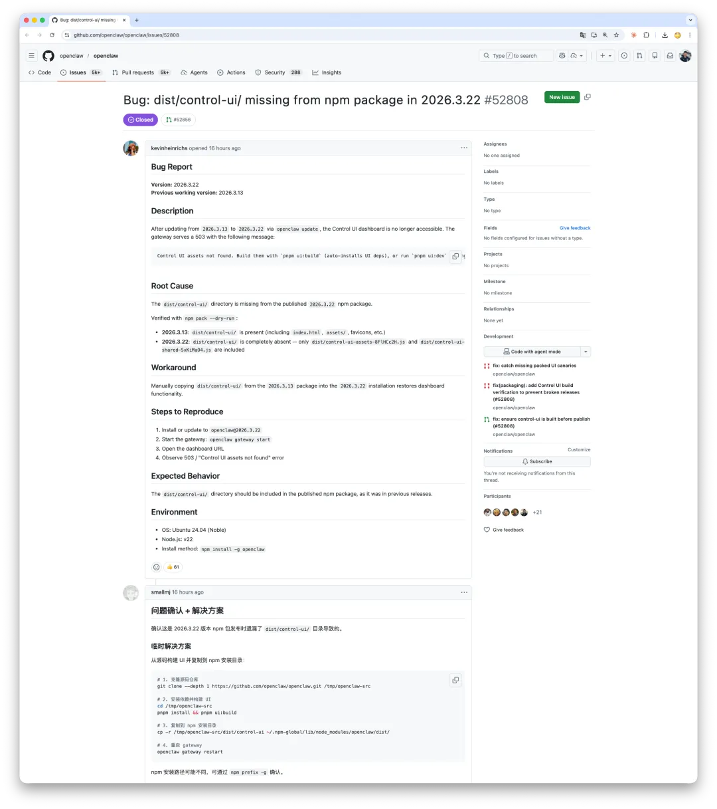

Last night OpenClaw released `v2026.3.22`.
The npm package shipped without the console frontend, so users around the world upgraded, opened the browser, and went straight to `503`.


------

## 1. What Actually Happened

`v2026.3.22` was a substantial release.
ClawHub launched, the browser toolchain was reworked, a long list of security hardening landed, and the release notes looked busy enough.

Then users upgraded and discovered the console was gone.



Inside the published npm tarball, the entire `dist/control-ui/` directory was missing.
The previous release, `v2026.3.13`, still had it.
This one simply dropped it.

The error message then suggested running `pnpm ui:build` locally to rebuild the frontend.
Nice idea, except the `scripts/` directory was also omitted from the package.
The official recovery path was a dead end.

In the same release, WhatsApp integration also broke.
The code had been split into a separate package, `@openclaw/whatsapp`, but that package had not actually been published to npm yet.

So two packaging failures stacked on top of each other.
Docker users were fine. Git users were fine. npm users were wiped out.

------

## 2. This Was Not the First Time

If you read the GitHub issues, this was not OpenClaw's first npm release failure.

In January, `v2026.1.29` technically included the UI assets, but the path resolution logic assumed `process.argv[1]` pointed into `dist/`.
With a global npm install, the entrypoint lives at the package root instead, so the assets were still invisible at runtime.
The files were there, but the code could not find them, which is functionally the same as shipping nothing.

In February, users reported that `scripts/ui.js` was missing from the npm package, so `pnpm ui:build` could not run.

In March, the entire frontend artifact disappeared.

Three months. Same distribution channel. Three different failures.
That strongly suggests one thing:

**there is no automated verification after `npm publish`.**

No person, and no CI job, is checking the one question that matters:
**"After installation, does the thing actually run?"**

Even a four-line smoke test would have blocked this release:

```bash
npm pack
npm install -g ./openclaw-2026.3.22.tgz
openclaw doctor --non-interactive
curl -s http://127.0.0.1:18789 | grep -q '<!DOCTYPE html>'
```

Apparently nobody wrote it.

------

## 3. AI Can Write Code. It Does Not Build Release Discipline

One comment on Weibo stood out:

> "This is all AI-written code, nobody understands it, and when it breaks you can only ask AI to fix AI. A good reminder for the bosses who want to fire programmers: when production breaks, you can argue with the AI yourself."

Some GitHub issues are labeled "Generated via Claude Code agent." Some PRs were generated by Codex.
That is not the problem.
Pigsty `v4.x` is also overwhelmingly written by Claude and Codex.

AI can help you write code.
It does not automatically build process.

AI will not spontaneously say, "we should add a pre-publish smoke test."
It will not reliably remind you, while splitting packages, that the new package has not actually been published yet.

**AI can create and fix code-level bugs. It does not see process-level holes unless someone makes those holes part of the process.**

This incident stood out to me because I had just cut a Pigsty patch release the day before.
One tiny-looking change in that release was an ETCD bump from `3.6.8` to `3.6.9`.
By semantic versioning logic, that should have been harmless.
Then the smoke test ran, and the cluster broke.

ETCD `3.6.9` quietly added auth requirements to the Member List API.
An endpoint that regular users could call before now required authentication.
Pigsty's health checks and member management immediately failed.

**You do not always catch that by reading changelogs, and you definitely do not always catch it by skimming diffs.**
You catch it by installing the thing, starting it, and making the components talk to each other in a clean environment.

After I found it, I did three things:

- Rolled ETCD back to `3.6.8`
- Pinned that version in the release
- Wrote down explicitly why the newest upstream version was not adopted

I ran into the same pattern previously when upgrading MinIO.
The answer was the same: roll back, pin the known-good version, document the reason.

There is nothing sophisticated about this.
Install on a clean system. Start it. Verify it. If it breaks, roll it back. Only then release it.

It is slow. It is annoying. A patch release sometimes takes several rounds.
But people run your software in production.
You owe them that level of care.

If anyone had actually installed OpenClaw once, started it once, and opened the console once before publishing, this entire failure would have been caught immediately.

------

**If you build infrastructure software, is it really too much to ask that you install it and test it once before shipping it?**
