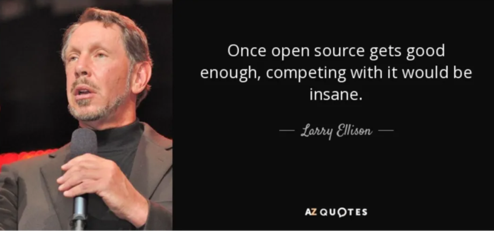
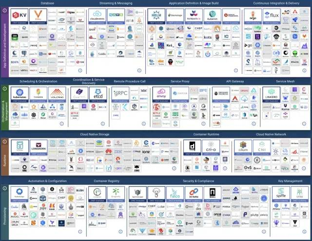

In the previous article, we used data to answer "[Are Cloud Databases an Intelligence Tax?](/cloud/rds/)"—**the exorbitant markups of several to over ten times are undoubtedly a scam for users outside the applicable spectrum**. But we can dig deeper: why are public clouds, especially cloud databases, like this? And based on their underlying logic, make predictions and judgments about the industry's future.

The software industry has undergone several paradigm shifts, and databases are no exception.

----------------

## Past Lives and Present Incarnations

> The general trend of the world: unity after long division, division after long unity.
>
> —— The pendulum of the software industry.

The software industry has experienced several paradigm shifts, and databases are no exception.

> Software eats the world, open source eats software, cloud eats open source—who will eat the cloud?

**Initially, software ate the world**. Commercial databases like Oracle replaced manual bookkeeping with software for data analysis and transaction processing, dramatically improving efficiency. However, Oracle-style commercial databases were extremely expensive—software licensing alone could cost over 10,000 RMB per core per month, affordable only to large institutions. Even deep-pocketed companies like Taobao eventually had to "de-Oracle" due to scale.

**Then, open source ate software**. "**Open source** and free" databases like PostgreSQL and MySQL emerged. Open source software itself is free, requiring only tens of RMB per core per month in hardware costs. In most scenarios, if you could find one or two database experts to help enterprises use open source databases well, it would be far more cost-effective than foolishly paying Oracle.

Open source software brought massive industry transformation—**the history of the internet is the history of open source software**. However, while open source software is free, **experts are scarce and expensive**. Experts who can help enterprises **use/manage** open source databases well are extremely scarce, sometimes priceless. In some sense, this is the business logic of the "open source" model: **free open source software attracts users, user demand creates expert positions, experts produce better open source software**. But expert scarcity also hindered further open source database adoption. Thus, "cloud software" emerged.

**Next, cloud ate open source**. Public cloud software is the productized external output of internet giants' ability to use open source software. Public cloud vendors wrap open source database kernels in shells, run them on managed hardware with shared DBA expert support, creating **cloud database services** (RDS). **This is indeed valuable service, providing new monetization paths for much software. But cloud vendors' free-riding behavior undoubtedly exploits and extracts from open source software communities**, and open source organizations and developers defending computational freedom naturally fight back.

The rise of cloud software triggers new balancing counterforces: **local-first software** corresponding to cloud software begins emerging like mushrooms after rain. **And we are witnessing this paradigm shift firsthand.**

----------------

## Dialectical Contradictions

> "**I want to be frank: for years, we've been like idiots while they made a fortune with what we developed**."
>
> Redis Labs CEO Ofer Bengal

The Cold War has ended, but in the **software industry**, the struggle between monopoly and anti-monopoly is flourishing.

**Unlike the physical world**, information replication costs near zero, giving these two models actual meaning in their struggle within the software world. **Commercial software and cloud software follow monopolistic capitalist logic; while free software, open source software, and emerging local-first software follow communist logic**[2]. The prosperity of the information technology industry today, and people's enjoyment of so many free information services, results from this struggle.

Just as the concept of open source software completely changed the software world: commercial software companies spent massive funds fighting this idea for decades. Ultimately, they couldn't resist the rise of open source software—software, this core means of production in the IT industry, became publicly owned by developers worldwide, distributed according to need. Developers contribute according to ability, everyone for me, me for everyone—this directly spawned the golden prosperity era of the internet.

However, prosperity leads to decline, extremes lead to reversal. Commercial software made a comeback in the form of cloud services, while open source software concepts encountered problems in the cloud computing era. **Cloud software is essentially an upgraded form of commercial software**: if software can only run on vendor servers rather than users' local servers, new monopolies can form. Even better, cloud software can completely freeload off open source, using their spear against their shield. Free open source software plus vendor operations and servers, packaged as ethereal services, saves R&D costs while charging markups of several to over ten times.

When cloud first appeared, their core was hardware/**IaaS** layer: storage, bandwidth, computing power, servers. Cloud vendors' origin story was: **make computing and storage resources like water and electricity, playing the role of infrastructure providers**. This was an attractive vision: public cloud vendors could use economies of scale to reduce hardware costs and amortize labor costs; ideally, while retaining sufficient profit margins, they could provide storage and computing **resources** to the public with better pricing and elasticity than IDCs.

**Cloud software** (PaaS/SaaS) has vastly different business logic from **cloud hardware**: cloud hardware relies on economies of scale, optimizing overall efficiency to profit from resource pooling and overselling—generally representing efficiency progress. **Cloud software** relies on shared experts, providing operations outsourcing to collect service fees. Large amounts of **software** on public clouds essentially package free open source software, relying on information asymmetry to charge astronomical service fees—a form of value extraction and transfer[1].

|               Hardware Computing                |  Unit Price   |
|:---------------------------------:|:-----:|
|    IDC Self-built (Dedicated Physical A1: 64C384G)     |  19   |
|     IDC Self-built (Dedicated Physical B1: 40C64G)     |  26   |
|     IDC Self-built (Dedicated Physical C2: 8C16G)      |  38   |
|        IDC Self-built (Container, 200% Oversell)         |  17   |
|        IDC Self-built (Container, 500% Oversell)         |   7   |
|      UCloud Elastic VM (8C16G, with oversell)      |  25   |
|       Alibaba-Cloud Elastic Server 2x Memory (Dedicated)       |  107  |
|       Alibaba-Cloud Elastic Server 4x Memory (Dedicated)       |  138  |
|       Alibaba-Cloud Elastic Server 8x Memory (Dedicated)       |  180  |
|  AWS C5D.METAL 96C 200G (Monthly, No Upfront)   |  100  |
|   AWS C5D.METAL 96C 200G (3-Year Prepaid)    |  80   |
|              **Database**              |       |
|   AWS RDS PostgreSQL db.T2 (4x)   |  440  |
|   AWS RDS PostgreSQL db.M5 (4x)   |  611  |
|  AWS RDS PostgreSQL db.R6G (8x)   |  786  |
| AWS RDS PostgreSQL db.M5 24xlarge | 1328  |
|        Alibaba-Cloud RDS PG 2x Memory (Dedicated)        |  260  |
|        Alibaba-Cloud RDS PG 4x Memory (Dedicated)        |  320  |
|        Alibaba-Cloud RDS PG 8x Memory (Dedicated)        |  410  |
|            Oracle Database License            | 10000 |

> How cloud sells ~20 RMB hardware at ten-times markups

Unfortunately, for obfuscation purposes, both cloud software and cloud hardware use the name "cloud." Thus, the cloud story simultaneously mixes the idealistic brilliance of popularizing computing power to thousands of households with the greed of achieving monopolistic ill-gotten profits.

----------------

## Contradiction Evolution

> **In 2022, the enemy of software freedom is cloud computing software.[3]**

Cloud computing software—software that mainly runs on vendor servers, with all your data stored on these servers. PaaS represented by cloud databases and various SaaS services belong to this category. These "cloud software" may have client components (mobile apps, web consoles, JavaScript running in your browser), but they only work with vendor servers. Cloud software has many problems:

- If cloud software vendors go bankrupt or discontinue products, your cloud software dies, and documents and data created with this software get locked up. For example, many startup SaaS services get acquired by large companies uninterested in maintaining these products.
- Cloud services may suddenly suspend your service without warning or recourse (like Parler). You might be completely innocent yet judged by automated systems as violating terms of service: others might hack your account and use it to send malware or phishing emails without your knowledge, triggering terms violations. Thus, you might suddenly find all documents created with various cloud documents or other apps permanently locked and inaccessible.
- Software running on your own computer can continue running even if the software vendor goes bankrupt—for as long as you want. In contrast, if cloud software shuts down, you have no way to save it since you never had copies of server software, whether source code or compiled form.
- Cloud software greatly increases software customization and extension difficulty. With closed-source software running on your computer, at least someone can reverse-engineer its data formats, giving you at least a Plan B of using alternative software. But cloud software data is stored only in the cloud, not locally—you can't even do that.

If all software were free and open source, these problems would automatically solve themselves. However, **open source and free are actually not necessary conditions for solving cloud software problems; even paid or closed-source software can avoid the above problems**: as long as it runs on your own computers, servers, or data centers rather than vendor cloud servers. Having source code makes things easier, but it's not critical—**the most important thing is having a local copy of the software**.

Today, **cloud software, not closed-source or commercial software, has become the number one threat to software freedom**. **Cloud software vendors can access your data or suddenly lock all your data at will without your ability to audit, investigate, or seek recourse—this potential harm far exceeds the inability to view and modify software source code**. Meanwhile, many "open source software companies" view "open source" as customer acquisition marketing packaging or a means of forming monopolistic standards, rather than truly pursuing "software freedom" goals.

**"Open source" vs "closed source" is no longer the core contradiction in the software industry—the focus of struggle has shifted to "cloud" vs "local."**

----------------

## Local-First

The opposition of "**local**" vs "**cloud**" manifests in various forms: sometimes "**Native Cloud**" vs "**Cloud Native**," sometimes "private cloud" vs "public cloud," mostly overlapping with "open source" vs "closed source," and in some sense involving "autonomous control" vs "dependence on others."

The **Cloud Native** movement represented by **Kubernetes** is the most typical example: cloud vendors interpret **Native** as "native"—"software natively born in public cloud environments" to confuse matters. But in terms of purpose and effect, **Native** really means "local"—corresponding to **Cloud** as "**Local**"—native cloud/private cloud/dedicated cloud/local cloud, the name doesn't matter. What matters is it runs wherever users want it to run (including cloud servers), not exclusively on public clouds!

Local-first software runs on your own hardware using local data storage while retaining cloud software convenience features like real-time collaboration, simplified operations, cross-device sync, resource scheduling, flexible scaling, etc. Open source local-first software is certainly great, but it's not necessary—90% of local-first software advantages apply equally to closed-source software. Similarly, free software is good, but local-first software doesn't exclude commercialization and paid services.

Before open source/local-first alternatives to cloud software appear, public cloud vendors can harvest freely, extracting monopolistic profits. Once better, easier, much cheaper open source alternatives emerge, the good days end. Just as Kubernetes replaces cloud computing services like EC2, MinIO/Ceph replaces cloud storage services like S3, and Pigsty aims to replace cloud database services: RDS PostgreSQL. More and more open source/local-first alternatives to cloud software are sprouting like mushrooms after rain.

> CNCF Landscape

----------------

## Historical Experience

The cloud computing story parallels the electricity promotion process exactly—let's look back to the early 20th century, drawing historical experience from electricity promotion, popularization, monopolization, and regulation.

> ChatGPT: The electricity promotion process

**Power supply may move toward monopoly, centralization, and nationalization, but you can't control appliances**. If cloud hardware (computing power) is like electricity, then cloud software is like appliances. Living in modern times, we can hardly imagine washing machines, refrigerators, water heaters, and computers having to be used in machine rooms next to power stations, nor can we easily imagine residents needing their own generators rather than public power plants for electricity.

Therefore, in the long term, public cloud vendors will probably have such a day: in cloud hardware, through monopolistic mergers and acquisitions similar to the electricity industry, they'll form "economies of scale," use "peak-valley electricity," "elastic pricing," and various methods to optimize overall resource utilization, continuously driving down computing costs to new bottoms through mutual beastly competition, achieving "electricity for every household." Of course, government regulation will eventually intervene, public-private partnerships will become state-owned, becoming similar to State Grid and telecom operators, ultimately achieving IaaS layer storage, bandwidth, and computing monopoly.

Correspondingly, functions for manufacturing light bulbs, air conditioners, and washing machines will be stripped from power companies, flourishing diversely. Cloud vendors' PaaS/SaaS will gradually shrink under impact from better, higher-quality, cheaper alternatives, or return to sufficiently low price levels.

Just as Microsoft, once the arch-enemy of the open source movement, now chooses to embrace open source, public cloud vendors will surely have this day—reaching reconciliation with the free software world, peacefully accepting the role of infrastructure suppliers, providing water and electricity-like storage and computing resources for society. **Cloud software will eventually** return to normal profit margins. **I hope when that day comes, people will remember this wasn't because cloud vendors showed mercy, but because someone brought open source alternatives.**

----------------

## Further Reading

[1] [Are Cloud Databases an Intelligence Tax?](/cloud/rds/)

[2] [Why Software Should Be Free](https://www.gnu.org/philosophy/shouldbefree.zh-cn.html)

[3] [It's Time to Say Goodbye to GPL](https://martin.kleppmann.com/2021/04/14/goodbye-gpl.html)
