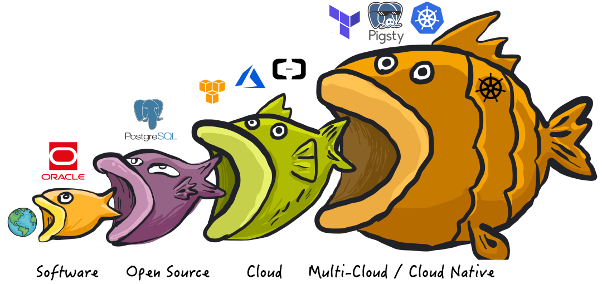
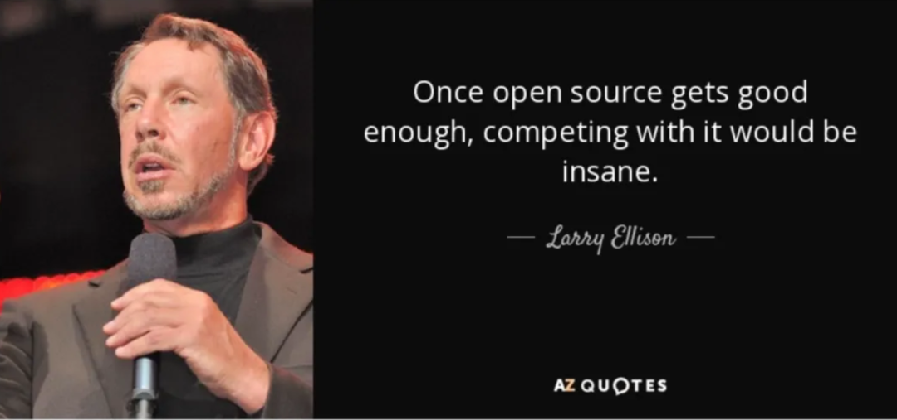
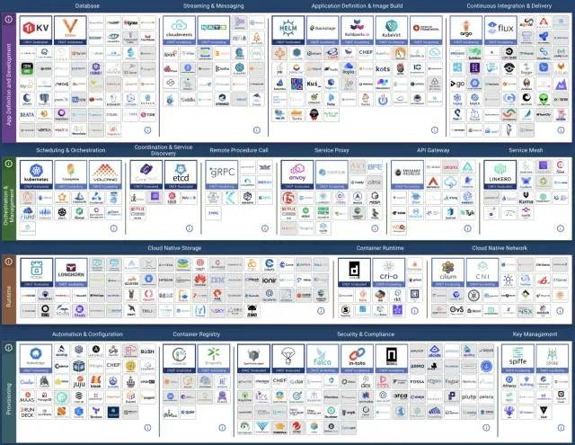
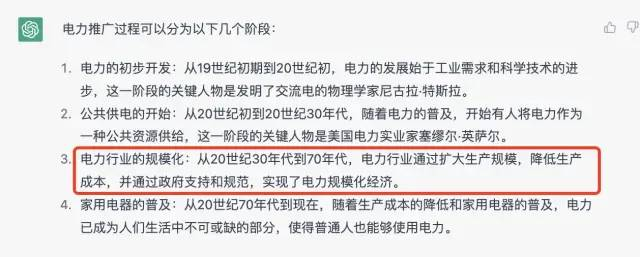

上一篇里，我们用数据回答了《[**云数据库是不是智商税**](/zh/blog/cloud/rds/)》 这个问题：**高达几倍到十几倍的溢价，对于云适用光谱外的用户是毫无疑问的杀猪**。但我们还可以进一步探究：公有云特别是云数据库为什么会是这样？并基于其底层逻辑此对行业的未来进行预测与判断。

软件行业经历了几次范式转移，数据库也不例外

----------------

## 前生今世

> 天下大势，分久必合，合久必分。
>
> —— The pendulum of the software industry.

软件行业经历了几次范式转移，数据库也不例外。

> 软件吞噬世界，开源吞噬软件，云吞噬开源，谁来吃云？

**最初，软件吞噬世界**，以 Oracle 为代表的商业数据库，用软件取代了人工簿记，用于数据分析与事务处理，极大地提高了效率。不过 Oracle 这样的商业数据库非常昂贵，一核·一月光是软件授权费用就能破万，不是大型机构都不一定用得起，即使像壕如淘宝，上了量后也不得不”去O“。

**接着，开源吞噬软件**，像 PostgreSQL 和 MySQL 这样”**开源**免费“的数据库应运而生。软件开源本身是免费的，每核每月只需要几十块钱的硬件成本。大多数场景下，如果能找到一两个数据库专家帮企业用好开源数据库，那可是要比傻乎乎地给 Oracle 送钱要实惠太多了。

开源软件带来了巨大的行业变革，可以说，**互联网的历史就是开源软件的历史**。尽管如此，开源软件免费，但 **专家稀缺昂贵**。能帮助企业 **用好/管好** 开源数据库的专家非常稀缺，甚至有价无市。某种意义上来说，这就是”开源“这种模式的商业逻辑：**免费的开源软件吸引用户，用户需求产生开源专家岗位，开源专家产出更好的开源软件**。但是，专家的稀缺也阻碍了开源数据库的进一步普及。于是，“云软件”出现了。

**然后，云吞噬开源**。公有云软件，是互联网大厂将自己使用开源软件的能力产品化对外输出的结果。公有云厂商把开源数据库内核套上壳，包上管控软件跑在托管硬件上，并雇佣共享 DBA 专家提供支持，便成了**云数据库服务** （RDS） 。**这诚然是有价值的服务，也为很多软件变现提供了新的途径。但云厂商的搭便车行径，无疑对开源软件社区是一种剥削与攫取**，而捍卫计算自由的开源组织与开发者自然也会展开反击。

云软件的崛起会引发新的制衡反作用力：与云软件相对应的**本地优先软件**开始如雨后春笋一般出现。**而我们，就在亲历见证这次范式转移。**

----------------

## 二律背反

> “**我想直率地说：多年来，我们就像个傻子一样，他们拿着我们开发的东西大赚了一笔**”。
>
> Redis Labs 首席执行官 Ofer Bengal

冷战已经结束，但在**软件行业**中，垄断和反垄断的斗争却方兴未艾。

**与****物理世界****不同，信息复制近乎为0的成本，让两种模式在软件世界有了相互争斗的实际意义**。**商业软件与云软件遵循垄断资本主义的逻辑；而自由软件、开源软件以及正在崛起的本地优先软件，遵循的是共产主义的逻辑**【2】。信息技术行业之所以有今天的繁荣，人们能享受到如此多的免费信息服务，正是这种斗争的结果。

正如开源软件的概念已经彻底改变了软件世界：商业软件公司耗费了海量资金与这个想法斗争了几十年。最终还是难以抵挡开源软件的崛起 —— 软件这种IT业的核心生产资料变为全世界开发者公有，按需分配。开发者各尽所能，人人为我，我为人人，这直接催生了互联网的黄金繁荣时代。

然而，盛极而衰，物极必反。商业软件改头换面以云服务的方式卷土重来，而开源软件的理念在云计算时代出了大问题。**云软件在本质上是商业软件的形态升级**：如果软件只能运行在供应商的服务器上，而不是跑在用户本地的服务器上，就可以形成新的垄断。更妙的是云软件完全可以白嫖开源，以彼之矛攻彼之盾。免费的开源软件加上供应商的运维与服务器，整合包装为虚实莫辨的服务，即可省却研发成本，溢价几倍甚至十几倍大赚一笔。

在云刚出现的时候，他们的核心是硬件 / **IaaS**层 ：存储、带宽、算力、服务器。云厂商的初心故事是：让计算和存储资源像水电一样，自己扮演基础设施的提供者的角色。这是一个很有吸引力的愿景：公有云厂商可以通过规模效应，压低硬件成本并均摊人力成本；理想情况下，在给自己留下足够利润的前提下，还可以向公众提供比 IDC 价格更有优势，更有弹性的存储算力。

而云软件（ PaaS / SaaS ），则是与**云硬件**有着迥然不同的商业逻辑：云硬件靠的是规模效应，优化整体效率赚取资源池化超卖的钱，总体来说算是一种效率进步。而**云软件**则是靠共享专家，提供运维外包来收取服务费。公有云上大量的**软件**，本质是对免费的开源软件进行封装，依靠的是信息不对称收取天价服务费，是一种价值的攫取转移。【1】

|               硬件算力                |  单价   |
|:---------------------------------:|:-----:|
|    IDC自建机房（独占物理机 A1: 64C384G）     |  19   |
|     IDC自建机房（独占物理机 B1: 40C64G）     |  26   |
|     IDC自建机房（独占物理机 C2: 8C16G）      |  38   |
|        IDC自建机房（容器，超卖200%）         |  17   |
|        IDC自建机房（容器，超卖500%）         |   7   |
|      UCloud 弹性虚拟机（8C16G，有超卖）      |  25   |
|       阿里云 弹性服务器 2x内存（独占无超卖）       |  107  |
|       阿里云 弹性服务器 4x内存（独占无超卖）       |  138  |
|       阿里云 弹性服务器 8x内存（独占无超卖）       |  180  |
|  AWS C5D.METAL 96C 200G (按月无预付)   |  100  |
|   AWS C5D.METAL 96C 200G(预付3年)    |  80   |
|              **数据库**              |       |
|   AWS RDS PostgreSQL db.T2 (4x)   |  440  |
|   AWS RDS PostgreSQL db.M5 (4x)   |  611  |
|  AWS RDS PostgreSQL db.R6G (8x)   |  786  |
| AWS RDS PostgreSQL db.M5 24xlarge | 1328  |
|        阿里云 RDS PG 2x内存（独占）        |  260  |
|        阿里云 RDS PG 4x内存（独占）        |  320  |
|        阿里云 RDS PG 8x内存（独占）        |  410  |
|            ORACLE数据库授权            | 10000 |

> 论云如何把 20来块的单位硬件卖出十几倍溢价

不幸的是，出于混淆视线的目的，云软件与云硬件都使用了“云”这个名字。因而在云的故事中，同时混掺着将算力普及到千家万户的理想主义光辉，与达成垄断攫取不义利润的贪心。

----------------

## 矛盾嬗变

> **在 2022 年，软件自由的敌人是云计算软件。【3】**

云计算软件，即主要在供应商的服务器上运行的软件，而你的所有数据也存储在这些服务器上。以云数据库为代表的 PaaS 与各类 SaaS 服务都属于此类。这些“云软件”也许有一个客户端组件（手机App，网页控制台，跑在你浏览器中的JavaScript），但它们只能与供应商的服务端共同工作。而云软件存在很多问题：

- 如果云软件供应商倒闭或停产，您的云软件就歇菜了，而你用这些软件创造的文档与数据就被锁死了。例如，很多初创公司的 SaaS 服务会被大公司收购，而大公司没有兴趣继续维护这些产品。
- 云服务可能在没有任何警告和追索手段的情况下突然暂停您的服务（例如 Parler ）。您可能在完全无辜的情况下，被自动化系统判定为违反服务条款：其他人可能入侵了你的账户，并在你不知情的情况下使用它来发送恶意软件或钓鱼邮件，触发违背服务条款。因而，你可能会突然发现自己用各种云文档或其它App创建的文档全部都被永久锁死无法访问。
- 运行在你自己的电脑上的软件，即使软件供应商破产倒闭，它也可以继续跑着，想跑多久跑多久。相比之下，如果云软件被关闭，你根本没有保存的能力，因为你从来就没有服务端软件的副本，无论是源代码还是编译后的形式。
- 云软件极大加剧了软件的定制与扩展难度，在你自己的电脑上运行的闭源软件，至少有人可以对它的数据格式进行逆向工程，这样你至少有个使用其他替代软件的PlanB。而云软件的数据只存储在云端而不是本地，你甚至连这一点都做不到了。

如果所有软件都是免费和开源的，这些问题就都自动解决了。然而，**开源和免费实际上并不是解决云软件问题的必要条件；即使是收钱的或者闭源的软件，也可以避免上述问题**：只要它运行在你自己的电脑、服务器、机房上，而不是供应商的云服务器上就可以。拥有源代码会让事情更容易一些，但这并不是不关键，**最重要的还是要有一份软件的本地副本**。

在当今，**云软件，而不是闭源软件或商业软件，成为了软件自由的头号威胁**。**云软件供应商可以在您****无法审计，无法取证，无法追索的情况下访问您的数据，或突然心血来潮随心所欲地锁定你的所有数据****，这种可能性的潜在危害，要比无法查看和修改软件源码的危害大得多**。与此同时，也有不少“开源软件公司”将“开源”视作一种获客营销包装、或形成垄断标准的手段，而不是真正追求“软件自由”的目的。

**”开源“ 与 ”闭源“ 已经不再是软件行业中最核心的矛盾，斗争的焦点变为 “云” 与 “本地”。**

----------------

## 本地优先

“**本地**” 与 “**云**” 的对立体现为多种不同的形式：有时候是 “**Native Cloud**” vs “**Cloud Native**”，有时候叫体现为 “私有云” vs “公有云”，大部分时候与 ”开源“ vs “闭源”重叠，某种意义上也牵扯着 “自主可控” vs “仰人鼻息”。

以 **Kubernetes** 为代表的 **Cloud Native** 运动就是最典型的例子：云厂商将 **Native** 解释 “原生”：“原生诞生在公有云环境里的软件” 以混淆视听；但究其目的与效果而言，**Native** 真正的含义应为 “本地”，即与 **Cloud** 相对应的 “**Local**” —— 本地云 / 私有云 / 专有云 / 原生云，叫什么不重要，重要的是它运行在用户想运行的任何地方（包括云服务器），而不是仅仅是公有云所独有！

本地优先的软件在您自己的硬件上运行，并使用本地数据存储，但也保留云软件的便利特性，比如实时协作，简化运维，跨设备同步，资源调度，灵活伸缩等等。开源的本地优先的软件当然非常好，但这并不是必须的，本地优先软件90%的优点同样适用于闭源的软件。同理，免费的软件当然好，但本地优先的软件也不排斥商业化与收费服务。

在云软件没有出现开源/本地优先的替代品前，公有云厂商尽可大肆收割，攫取垄断利润。而一旦更好用，更简易，成本低得多的开源替代品出现，好日子便将到达终点。正如 Kubernetes 用于替代云计算服务 EC2， MinIO / Ceph 用于替代云存储服务 S3， 而 Pigsty 则指在替代云数据库服务：RDS PostgreSQL。越来越多的云软件开源/本地优先替代正如雨后春笋一样冒出来。

> CNCF Landscape

----------------

## 历史经验

云计算的故事与电力的推广过程如出一辙，让我们把目光回退至上个世纪初，从电力的推广普及垄断监管中汲取历史经验。

> ChatGPT: 电力的推广过程

**供电也许会走向垄断、集中、国有化，但你管不住电器**。如果云硬件（算力）类似于电力，那么云软件便是电器。生活在现代的我们难以想象：洗衣机，冰箱，热水器，电脑，竟然还要跑到电站边的机房去用，我们也很难想象，居民要由自己的发电机而不是公共发电厂来供电。

因此从长期来看，公有云厂商大概也会有这么一天：在云硬件上通过类似于电力行业，通过垄断并购与兼并形成“规模效应”，利用“峰谷电”，“弹性定价”等各种方式优化整体资源利用率，在相互斗兽竞争中将算力成本不断压低至新的底线，实现“家家有电用”。当然，最后也少不了政府监管介入，公私合营收归国有，成为如同国家电网与电信运营商类似的存在，最终实现 IaaS 层的存储带宽算力的垄断。

而与之对应，制造灯泡、空调、洗衣机这类电器的职能会从电力公司中剥离，百花齐放。云厂商的 PaaS / SaaS 在被更好，更优质，更便宜的替代物冲击下逐渐萎缩，或回归到足够低廉的价格水平。

正如当年开源运动的死对头微软，现在也选择拥抱开源。公有云厂商肯定也会有这一天，与自由软件世界达成和解，心平气和地接受基础设施供应商的角色定位，为大家提供水与电一般的存算资源。而**云软件终将**会回归正常毛利，**希望那一天人们能记得人们能记得，这不是因为云厂商大发慈悲，而是因为有人带来过开源平替。**

----------------

## 参考阅读

【1】[云数据库是不是智商税？](/zh/blog/cloud/rds/)

【2】[为什么软件应该是自由的](https://www.gnu.org/philosophy/shouldbefree.zh-cn.html)

【3】[是时候和GPL说再见了](https://martin.kleppmann.com/2021/04/14/goodbye-gpl.html)