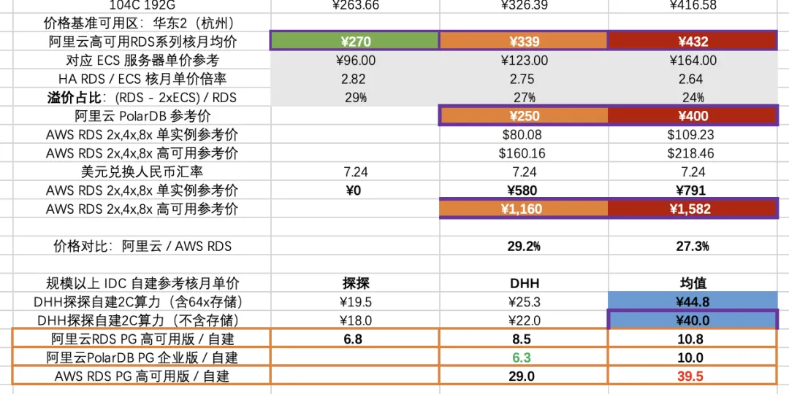

> This article comes from a real consultation case. Any resemblance to your situation is purely due to cloud vendors' deep affinity with your wallet.

Yesterday a user came to consult, asking if PostgreSQL distributed database extension Citus has any pitfalls, whether Pigsty supports it. I thought, "Great, going distributed—your data volume must be pretty huge?"

The result was both laughable and crying-worthy. He wasn't dealing with data bursting through server cabinet doors, but had fallen into the [AWS EBS cloud disk](https://mp.weixin.qq.com/s/UxjiUBTpb1pRUfGtR9V3ag) "pig-butchering" scam.

-------

## Clutching Wallet, Frantically Going Distributed

"Does Citus distributed database have many pitfalls? Does Pigsty support it?" A user frantically ran over to consult a few days ago, opening with "Citus."

I thought: Going distributed already, must have massive data, crazy QPS—definitely a tough customer? Probably hundreds of TB minimum?

Open source distributed extension Citus does have quite a reputation in the PostgreSQL ecosystem, especially after Microsoft's acquisition, even packaged as CosmosDB/Hyperscale PG on Azure. Making PG upgrade to distributed database in place sounds pretty cool.

But old friends know I'm not fond of distributed databases. ([Are Distributed Databases Fake Requirements?](/db/distributive-bullshit/))

The basic principle of distributed databases is: if your problem can be solved within classic master-slave scope, don't mess with distributed. So as routine, I had to ask about the actual scale.

When I asked specific metrics: data volume **60TB**, compressed to **14TB** with TimescaleDB extension; QPS 5K, queries mostly point queries, scanning 100 records max—hey, typical "data volume not small, throughput not large."

This scale might have needed distributed in 2015, but in 2025 with single 64TB cards, wouldn't a decent NVMe SSD for tens of thousands RMB running native PG easily solve this? Single-machine PG can easily handle millions of point queries/writes per second
—— so why distributed? Disk can't fit?

The user said: "*Because of burst traffic, adding a replica takes several days.*"

This puzzled me: 14TB data, in a 10Gbps network environment, one sync backup would take 4-5 hours max? I've used broken 2016 hardware with speed limits, dragging a 3TB replica took less than half an hour.

Besides, adding replicas is mainly limited by I/O capability. If I/O is the bottleneck, distributed scaling won't help either—distributed also needs partition rebalancing, what problem does it solve?

So the user said again: "Network's fine, mainly disk cost is too expensive: current architecture is one master three replicas, one replica per data copy, total four copies."

The user especially emphasized "disk too expensive" twice—this puzzled me even more. Enterprise-grade large-capacity NVMe SSDs are now cheap as cabbage, 200 RMB/TB/year. With this dozen TB data, plus messing with TimescaleDB, Citus labor costs, no money for hardware?

Then I figured since dragging replicas is slow not due to network issues, it's basically disk issues? Disk this slow, not still using HDD mechanical drives? How expensive could HDD be?

Of course, since the user can manually drag replicas, play with PG extensions, has decent data volume, and dares go distributed, I'd already assumed he wasn't a newbie who only knows cloud databases and console clicking.

But I still thought of one possibility—could it be you bought the public cloud vendor's [astronomical pig-butchering scam](https://mp.weixin.qq.com/s/UxjiUBTpb1pRUfGtR9V3ag)?

This guy mentioned: "Yes, we're currently self-building on AWS."

Hey, case closed—another pig-butchering scam victim paying for pain.

-------

## Astronomical Pig-Butchering Making Moves Look Deformed

After deep conversation, I found the user's cloud spending was shocking—database alone roughly 2 million RMB annually, yet getting a beggar's disk that takes days to drag a 14TB replica
——converting that's throughput around 100 MB/s. A Gen5 NVMe SSD's 12 GB/s bandwidth, 3M IOPS performance could obliterate this beggar's disk, at less than 1% the cost.

According to AWS EBS io2 disk discounted pricing, roughly 1900 RMB/TB/month, 14TB data × 4 copies × 12 months, storage alone nearly 1.28 million annually;
Plus EC2 host costs (usually cloud database storage/compute cost ratio estimated 2:1), over 2 million annually easy.

More outrageous: spending this much money gets incredibly poor performance storage. "Paying protection money and still getting beaten"—that's exactly what this is.

To save this cloud disk cost, they'd rather tear apart business architecture, or have ops spend days adding replicas, throwing bottomless labor and time costs in. Finally even wanting distributed databases for "self-rescue," thinking this could save storage costs.

But the result? Still locked tight by the "pig-butchering scheme." Burning 2 million annually, getting slow and troublesome service, plus bearing the cost of tearing business into puzzle pieces.

So tracing the source, where did distributed database requirements come from?—— **Not because business or data truly needs distributed, but because cloud block storage is expensive and performs poorly**.

This problem can't be cured just by switching to "distributed database" or using S3 databases. To truly cure it, first ask: why is cloud block storage so outrageous?

Actually, in [Are Public Clouds Pig-Butchering Schemes?](/cloud/ebs/), I already told you the answer long ago.

-------

## Paying for Pain, Don't Be the Big Cloud Fool

Major public cloud vendors' core routine is nothing new: use extremely cheap micro instances and free quotas to lure users to cloud, then rely on database and other cloud PaaS technical barriers to lock users in. Once users scale up and "can't escape," they can only stay on cloud bleeding continuously—the so-called "pig-butchering scheme."

Of course some will say: major public cloud vendors have Serverless, or elastic storage shared storage cloud database services—surely this client's **cloud usage posture is wrong**.

But actually, go look at those cloud database's absurd pricing! [Are Cloud Databases Intelligence Tax](https://mp.weixin.qq.com/s/LefEAXTcBH-KBJNhXNoc7A)
—using cloud databases costs only more shocking than pure resource pricing. After all, PaaS 50%-70% gross margins don't fall from the sky.

As [Cloud-Exit Odyssey: Is It Time to Abandon Cloud Computing?](https://mp.weixin.qq.com/s/CicctyvV1xk5B-AsKfzPjw) DHH said:
"In several key examples, cloud costs are extremely high—whether large physical machine databases, large NVMe storage, or just the latest fastest computing power.
Renting the production team's donkey costs so much that a few months' rent equals directly buying it. In this situation, you should directly buy the donkey!"

And "Being locked trapped in Amazon's cloud, having to endure humiliatingly absurd pricing when experimenting with new things (like solid-state drives), constitutes intolerable violation of core values."

I think this case is typical **paying for pain**—spending 2 million annually, getting unacceptably poor performance junk.

More critically, do you think cloud vendors will be responsible for your business to the end?
Users spend huge money buying hardware marked up 100x, basically getting the after-sales support from [Amateur Hour Show: Alibaba-Cloud RDS Failure Chronicle](https://mp.weixin.qq.com/s/kOIw8uPjZUZ0-QisC1TBOA)
—thinking you can throw responsibility to cloud vendors for peace of mind? When real problems hit, boomerangs still hit your own head.

-------

## Don't Let This Paid Sequel Keep Playing

With self-building PG capability, moving databases back to self-built data centers or switching to non-PaaS-binding affordable clouds could reduce costs by several tiers, even choosing AWS instances with built-in Host Storage directly.

Let's do elementary third-grade arithmetic: putting this type of database instance off-cloud, buying several managed physical machines, one-time investment of hundreds of thousands, annual maintenance of tens of thousands, usable for five or even six-seven years.

Of course you ask what if you can't handle it? Many PG professional suppliers provide technical consulting and support services. For example, I can provide mature, large-scale battle-tested PG RDS solutions.

In this case, I can guarantee using 200-400k one-time hardware investment to completely solve the annual 2 million astronomical bill, while performance can be N times higher than cloud beggar's disks, charging only 150-400k consulting fees.

Even if you must run on cloud, I strongly recommend choosing affordable clouds without PaaS binding—retaining cloud "elasticity" core advantages while cutting costs to around 10k monthly.

After all, Hetzner, Linode, DigitalOcean all provide high-quality affordable (+15% margins, very reasonable) fully managed dedicated servers.
These affordable cloud prices are enough to make users accustomed to 10x-100x markups from traditional cloud computing scam mills jaw-dropping.

> Hey, I mean, how much do you think AWS would charge monthly for this spec?

-------

## Open-Source RDS Solves Key Cloud-Exit Challenges

Databases are the key bottleneck for cloud exit. Microsoft CEO Nadella said: These apps and applications you see are just pretty wrappers around databases——
So the biggest cloud exit bottleneck is: can you run PostgreSQL well on your own servers? How should this problem be solved?

When business scale grows beyond the "cloud computing applicable spectrum," only having database self-building capabilities gives users true freedom to choose again;
only then can all cloud vendors be treated as pure resource suppliers—whichever charges protection fees, immediately migrate to another, achieving true "freedom" and "autonomous control."

I've always advocated cloud database capabilities should be democratized to all users, not only rentable at astronomical prices from a few monopolistic cyber feudal lords.

Therefore I made open source RDS for PostgreSQL: Pigsty, letting you spin up PostgreSQL stronger than RDS with one click on physical/virtual machines without depending on DBA experts,
fully utilizing new hardware's high performance and low costs. Solving the key cloud exit bottleneck.

Pigsty contains PostgreSQL ecosystem's unique [351 extension plugins](https://pgext.cloud/zh), [far superior to cloud's pitiful dozens of castrated plugins](https://mp.weixin.qq.com/s/EH7RPB6ImfMHXhOMU7P5Qg), plus provides zero-configuration out-of-box [high availability architecture](https://pgext.cloud/zh/pgsql/arch) and industry-leading monitoring systems.

It's widely used in internet, finance, new energy, military, manufacturing industries, currently ranking 22nd on [OSSRANK](https://ossrank.com/cat/368-postgresql-extension-ecosystem?page=2) global PostgreSQL ecosystem open source rankings.

Pigsty uses AGPLv3 open source license, open source and free. If someone feels "still hopes to pay for peace of mind," we also provide clearly-priced commercial consulting services as backup—solving real problems at fair prices, not playing those fancy "pig-butchering" schemes.

True "elasticity" was never "throwing money at cloud vendors while being clueless yourself," but knowing when to spend money and how to spend it. May all database users avoid being big fools, making their time and money spent more meaningfully.
