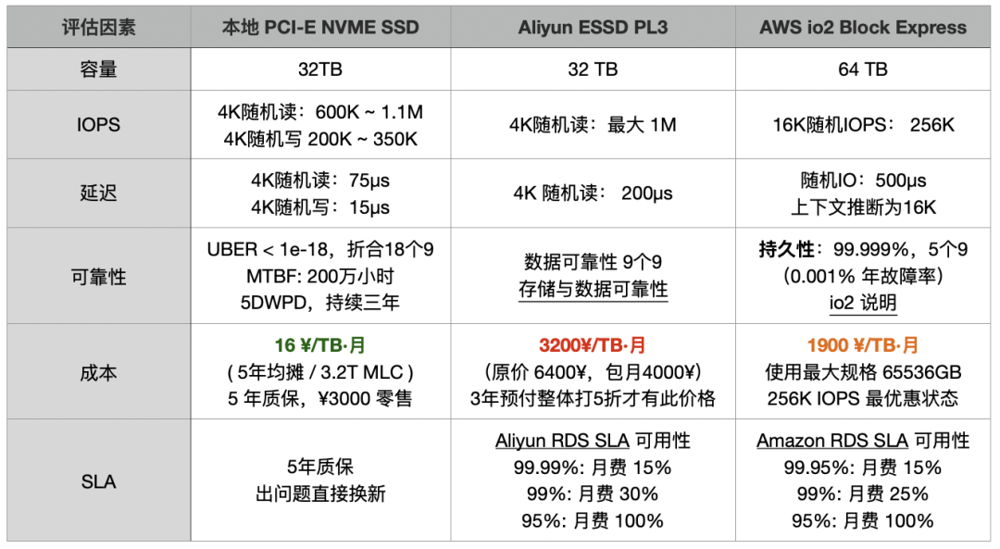
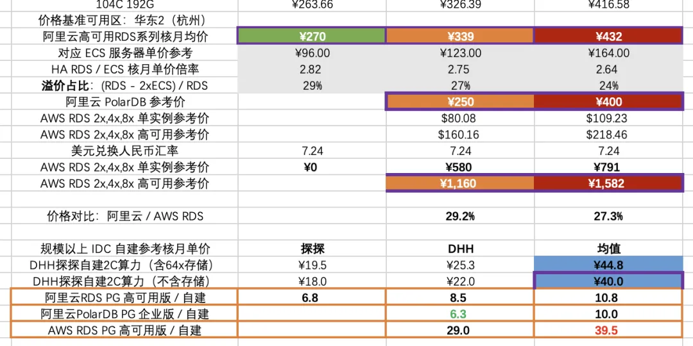
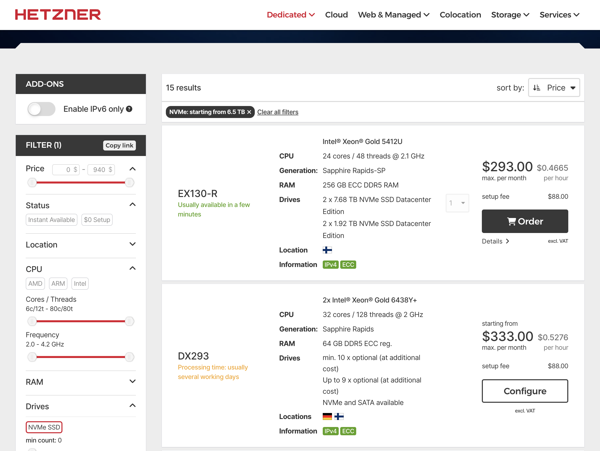

> 本文来自真实咨询案例，如有雷同，纯属云厂商和钱包缘分太深。

昨天一用户来咨询，问我 PostgreSQL 分布式数据库扩展 Citus 有没有什么坑，Pigsty 支持不。我想好家伙都要上分布式了，那你这数据量应该挺大了？

结果令人啼笑皆非，原来他并不是因为数据大到要冲破服务器柜门，而是栽在了 [AWS EBS 云盘](https://mp.weixin.qq.com/s/UxjiUBTpb1pRUfGtR9V3ag) 的“杀猪盘”套路里。

-------

## 捂着钱包慌忙上分布式数据库

“Citus 分布式数据库坑多吗？Pigsty 支持不？” 前两天一个用户火急火燎地跑来咨询，开口就提“Citus”。
我心想：都要上分布式了，想必有着海量数据、疯狂QPS，一定是个狠角色？估计得几百 TB 起步吧？

开源分布式扩展 Citus 在 PostgreSQL 生态里确实名气不小，尤其被微软收购后，在 Azure 上干脆还被包装成了 CosmosDB / Hyperscale PG。让 PG 原地升级成分布式数据库，一听就很酷炫。

但是老朋友们也知道，我是不太待见分布式数据库的。（《[分布式数据库是伪需求吗](/db/distributive-bullshit/)》），
分布式数据库的基本原则就是如果你的问题能在经典主从范围内搞定就不要去折腾分布式，所以例行公事我也要问问这到底得多大负载。

一问具体指标，数据量 **60TB**，用 TimescaleDB 扩展压缩后到 **14 TB**； QPS 5K，查询基本都是点查，扫个 100 条数据最多 —— 嗨，典型的 “数据量不算小，吞吐量不算大”。
不过这种量级在 2015 年也许要分布式，但在单卡 64 TB 的 2025 年，随便来个万把块的 NVMe SSD 跑个原生 PG 不就轻松解决了？单机 PG 随便每秒百万点查点写更是不在话下
 ——  那么用分布式是什么原因？磁盘装不下了吗？

用户说：“*因为会有突发流量，我要扩容加个从库，需要好几天。*”

这就让我有点不解了：14TB 数据，万兆网卡环境下一次同步备份也就四五个小时吧？ 我用 2016 年的破旧硬件限速跑，拖个3TB的从库都用不了半小时。
再说，加从库耗时主要取决于 I/O 能力，要是 I/O 卡脖子了，那扩容分布式也没用啊，分布式不也得做分区再平衡，能解决啥问题？

于是用户又说：“网络没问题，主要是磁盘成本太贵了：现在架构是一主三从，一个从库就一份数据，总共四份“。

用户还特意强调了两次 “磁盘太贵” 这就更让我纳闷了 —— 这年头企业级大容量 NVMe SSD 已经便宜的跟白菜价一样了，200 ¥/TB/年，你有这十几T数据，和折腾TimescaleDB，Citus人力，没钱买硬盘？
然后我看既然拖从库慢不是因为网络问题，那基本那就是磁盘问题了？磁盘这么慢，不会还在用 HDD机械硬盘吧，HDD 能贵到哪里去？

当然，因为用户都会手工拖从库，玩转 PG 扩展了，数据量也挺大，还敢上分布式，我已经默认他不是只会用云数据库，控制台点点点的菜鸟了。
但我还是想到了一种可能性 —— 难道说 …… 你买的是公有云厂商的 [天价杀猪盘](https://mp.weixin.qq.com/s/UxjiUBTpb1pRUfGtR9V3ag) ？

这位哥们说到：“是，我们现在用的 AWS 自建”。

嗨，破案了，又是一个花钱买罪受的杀猪盘受害用户。

-------

## 天价杀猪盘，让动作都走形了

深聊后发现，用户在云上的开销非常惊人，光数据库毛估每年就有 200 万人民币，而得到的却是一个拉 14 TB 从库都要花几天的乞丐盘 ——
换算下来吞吐也就不到 100 MB/s。 一块 Gen5 NVMe SSD 的 12 GB/s 带宽，3M IOPS 性能，可以把这种乞丐盘轰杀成渣，而只要百分之一不到的成本。

按照 AWS EBS io2 盘折后价，大约 1900 元 / TB / 月，14 TB 数据 × 4 份 × 12 个月，光存储就差不多一年 128 万；
再加上 EC2 主机费用（通常云数据库存储/计算费用配比估算比例 2:1），每年 200 万往上走。
更离谱的是，花这么多钱换来的，却是性能奇差无比的存储。“交了保护费还得挨打”，可不就是这么回事？

为了省这笔云盘费，他们宁可把业务架构改得七零八落，或让运维花几天时间加从库，把无底洞似的人力和时间成本都扔进去。最后甚至想靠分布式数据库来“自救”，以为这样能省点存储费。
但结果呢？依然被“杀猪盘”牢牢锁死。每年烧掉 200 万，换来又慢又折腾的服务，还要自己额外承担把业务拆成拼图的成本。

那么追本溯源，分布式数据库的需求是怎么来的？—— **不是因为业务或数据真的需要分布式，而是云上块存储价格昂贵、性能太差**。
这问题光靠换个“分布式数据库”或者用个 S3数据库是治不了本的。要真正治本，得先问：为什么云上的块存储会这么离谱？

其实，在 [公有云是不是杀猪盘？](/cloud/ebs/) 中，我早就告诉过你们答案。

-------

## 花钱买罪受，别当云上大冤种

大型公有云厂商的核心套路无非是：用极便宜的小微实例和免费额度先把用户诱上云，再依托数据库等云 PaaS 技术壁垒锁定用户，用户上了规模之后“跑不掉”，只能留在云上持续出血，也就是所谓“杀猪盘”。

当然肯定会有人会说：大公有云厂商都有 Serverless ，或者弹性存储共享存储的云数据库服务嘛，肯定是这位客户 **用云的姿势不对**。
但实际上，去看看那些云数据库的荒谬定价吧！《[云数据库是不是智商税](https://mp.weixin.qq.com/s/LefEAXTcBH-KBJNhXNoc7A)》
，用云数据库的成本只会比纯用资源的价格更震撼 —— 毕竟，PaaS 50% - 70% 的毛利可不是从天上掉下来的。

正如《[下云奥德赛：是时候放弃云计算了吗？](https://mp.weixin.qq.com/s/CicctyvV1xk5B-AsKfzPjw)》中 DHH 所说：
“在几个关键例子上，云的成本都极其高昂 —— 无论是大型物理机数据库、大型 NVMe 存储，或者只是最新最快的算力。
租生产队的驴所花的钱是如此高昂，以至于几个月的租金就能与直接购买它的价格持平。在这种情况下，你应该直接直接把这头驴买下来！”

以及 “被锁死困在亚马逊的云里，在实验新东西（比如固态硬盘）时，不得不忍受高昂到荒诞的定价带来的羞辱，这已经构成对核心价值观无法容忍的侵犯”。
我认为这一案例就是很典型的**花钱买罪受** —— 花了每年两百万的巨款，得到的却是性能不堪入目的破烂。

而更关键地是，你以为云厂商会为你的业务负责到底吗？
用户耗费巨款买到的，除了加价一百倍卖给你的硬件，基本就是《[草台班子唱大戏，阿里云RDS翻车记](https://mp.weixin.qq.com/s/kOIw8uPjZUZ0-QisC1TBOA)》这个案例里提供的售后支持
 —— 你以为可以把锅甩给云厂商就能高枕无忧？真出了事，回旋镖还得打在自己头上。

-------

## 别让这种付费续集不断上映

只要具备自建 PG 的能力，把数据库搬回自建机房或换家不捆绑 PaaS 的平价云，哪怕在 AWS 上直接选自带 Host Storage 的实例，都能把成本降好几个档次。
让我们做个小学三年级的算术：这类数据库实例放在云下，买几台托管物理机，一次性投入几十万、每年维护几万，五年甚至六七年都能用。

当然你要问搞不定怎么办？有不少 PG 专业供应商都提供技术咨询与技术支持服务，比如我就可以提供成熟且经过大规模实战验证的PG RDS解决方案，
在这一例中，我可以保证用20~40万一次性的硬件投入彻底解决每年两百万天价账单，同时性能还能比云上的乞丐盘高出 N 倍不止，而只收取只 15-40 万的咨询费。

即使你不得不在云上跑，我也强烈建议选择那些没有 PaaS 绑定的平价云 —— 在保留云端“弹性”这一核心优势的同时，却能把成本打到每月万把块。
毕竟 Hetzner、Linode、DigitalOcean 都提供物美价廉（通常+15%毛利，很合理）的全托管专属服务器，
这些平价云的价格，足以让习惯了十倍百倍溢价的传统云计算妙瓦底的用户瞠目结舌。

> 嘿，我的意思是，你觉得 AWS 会为这样的规格每月收你多少钱？

-------

## 开源 RDS 解决下云关键难题

数据库是下云的关键卡点，微软 CEO 纳德拉说：你看到的这些 App 与应用不过都是数据库的漂亮封装而已 ——
所以下云最大的卡点就在于：能否在自己的服务器上跑好 PostgreSQL？应该怎么样解决这个问题？

当业务规模增长超出“云计算适用光谱”后，只有拥有了数据库自建的能力，用户才真正有自由去重新选择；
才能把所有云厂商当作纯资源供应商 —— 哪家收保护费，就能立马迁到另一家，实现真正的 “自由” 与 “自主可控”。

我一直主张，云数据库能力应该民主化普及到所有用户，而不是只能从几个垄断的赛博封建领主以天价租赁。
因此我做了开源版的 RDS for PostgreSQL：Pigsty，让你不依赖 DBA 专家，也能在物理机/虚拟机上一键拉起比 RDS 更强劲的 PostgreSQL，
并充分利用新硬件的高性能、低成本。解决下云的关键卡点。

Pigsty 包含 PG 生态里独一无二的 [351 个扩展插件](https://ext.pigsty.io)，[远胜云上那些可怜的几十个阉割版插件](https://mp.weixin.qq.com/s/EH7RPB6ImfMHXhOMU7P5Qg)，还提供免配置开箱即用的 [高可用架构](https://ext.pgsty.com/zh/pgsql/arch) 与业内领先的监控系统。
它已在互联网、金融、新能源、军工、制造业等行业广泛应用，目前在 [OSSRANK](https://ossrank.com/cat/368-postgresql-extension-ecosystem?page=2) 全球 PostgreSQL 生态开源榜单里排第 22 名。

Pigsty 采用 AGPLv3 开源协议，开源免费。如果有人觉得“还是希望付费买个安心”，我们也提供明码标价的商业咨询服务兜底。—— 用公道的价格解决实际问题，不玩那些花里胡哨的“杀猪盘”套路。

真正的“弹性”从来都不是“把钱丢给云厂商，自己却一脸懵逼”，而是知道什么时候该花钱、怎么花钱。愿所有数据库用户都能别做大冤种，让自己的时间与金钱花费的更有意义。

