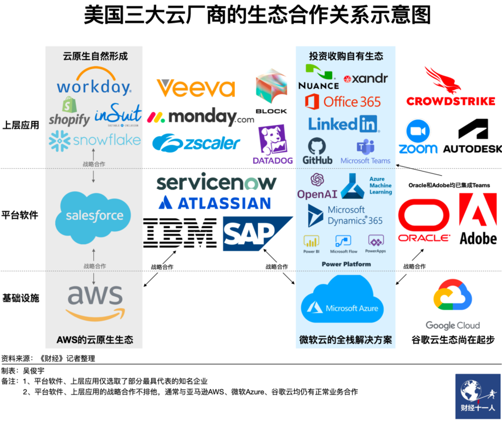
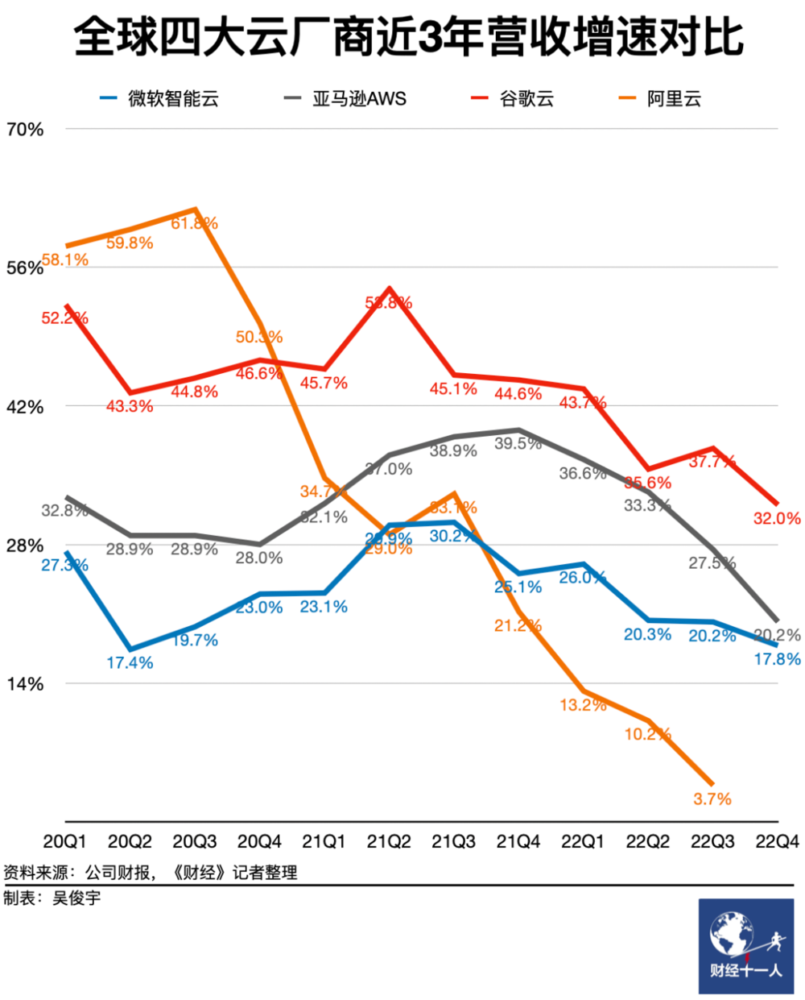
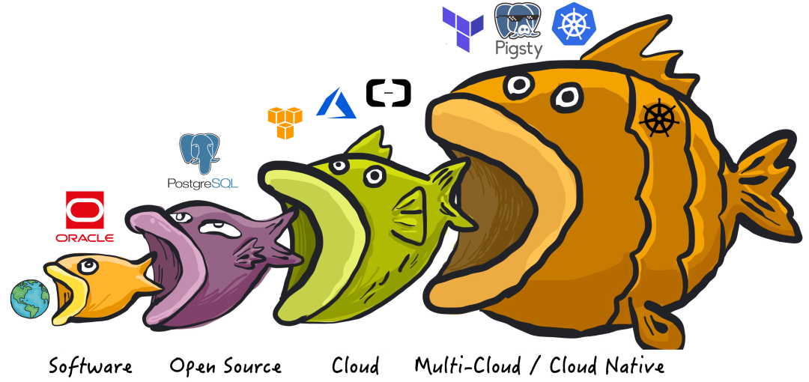

[Public cloud margins worse than sand mining](#public-cloud-margins-worse-than-sand-mining),

[Why are pig-butchering schemes losing money](#why-are-pig-butchering-schemes-losing-money)?

[Resource-selling models heading toward price wars](#resource-selling-models-heading-toward-price-wars),

[Open source alternatives breaking monopoly dreams](#open-source-alternatives-breaking-monopoly-dreams)!

[Service competitiveness gradually neutralized](#service-competitiveness-gradually-neutralized),

[Where is the cloud computing industry heading](#where-is-the-cloud-computing-industry-heading)?

-------------------

## Public Cloud Margins Worse Than Sand Mining

In "[Are Cloud Disks Pig-Butchering Schemes](/cloud/ebs/)," "[Are Cloud Databases Intelligence Tax](/cloud/rds/)," and "[Are Cloud SLAs Placebo or Toilet Paper Contracts](/cloud/sla/)," we've studied the true costs of key cloud services. Enterprise-scale cloud servers cost 5-10x self-building per core·month, cloud databases can reach over 10x, cloud disks can be 100x+ higher. With this pricing model, cloud margins of 80-90% wouldn't be surprising.

Industry benchmarks AWS and Azure easily achieve 60% and 70% margins. Looking at domestic cloud computing, margins generally hover between single digits to **15%**. Top dog Alibaba-Cloud at most gives a "projected long-term overall margin of 40%." As for cloud vendors like Kingsoft Cloud, margins directly drop to **2.1%**—worse than working sand mining jobs.

Regarding net profits, domestic public cloud vendors are even more miserable. AWS/Azure net profit margins can reach 30%-40%. Benchmark Alibaba-Cloud merely struggles around the break-even line. This begs the question: how did these cloud vendors turn a 30-40% pure profit business into this state?

-------------------

## Why Are Pig-Butchering Schemes Losing Money

We can list many possible reasons: revenue-above-all KPIs, sales-driven growth models, big company disease and internal friction, high costs from overstaffing, malicious competitive price wars with peers, corruption from kickback rebates, forgetting ecosystem to personally grab food, losing direction after forgetting original intentions, etc.

But the core problem of domestic cloud vendors losing money is **profit margins squeezed from both ends**, **and user value provided diminishing due to resource clouds (state clouds/IDC2.0) and open source alternatives**. To understand this, we need to start with public cloud business structure.

Public clouds can be divided into IaaS, PaaS, SaaS three layers. Although all three carry **S**(ervice), there are significant differences: **lower layers lean toward selling resources, upper layers lean toward selling capabilities** (services/technology/knowledge/cognition/insurance). **IaaS layer dominated by resources, SaaS layer dominated by capabilities, PaaS layer between the two**—for example, databases can be viewed as **capability** utilizing and integrating underlying storage/compute resources, or as higher-level abstract software **resources**.

When cloud first appeared, the core was hardware/**IaaS** layer: storage, bandwidth, computing power, servers. Cloud vendors' origin story was: **make computing and storage resources like water and electricity, playing infrastructure provider roles**. This was an attractive vision: public cloud vendors could use economies of scale to reduce hardware costs and amortize labor costs; ideally, while retaining sufficient profit margins, they could provide storage/compute **resources** to the public with better pricing and elasticity than IDCs.

But soon, public clouds weren't satisfied just selling packaged hardware resources in IaaS: resource-selling **IaaS** pricing has limited markup space, calculable line-by-line against BOMs. But **PaaS** like cloud databases, containing "**services/insurance**," labor/R&D costs contain massive markups difficult to determine, justifying astronomical pricing and high profit extraction.

Although domestic public cloud **IaaS** layer storage, computing, networking revenues can constitute half of total revenue, their margins are only **15%-20%**, while public cloud **PaaS** represented by cloud databases can achieve **50%** or higher margins, completely crushing resource-selling **IaaS**.

For public clouds, **PaaS is the core technical barrier**, **IaaS is the revenue foundation**. Cloud vendors' main revenue comes from both. However, **the former faces open source alternative impact, the latter faces price war challenges.**

AWS's barrier is first-mover advantage and thriving software ecosystem, Azure's barrier is Office SaaS and large model PaaS, GCP's barrier is global unified network. Looking at domestic cloud vendor barriers: Alibaba-Cloud's databases, Tencent Cloud's WeChat ecosystem, Baidu Cloud's large models?

-------------------

## Resource-Selling Models Heading Toward Price Wars

Plucked phoenix worse than chicken—public clouds losing technical monopolies will sink into resource-selling price war quagmires. When **quality**, **security**, **efficiency** can't create highlights, the only choice to grab market share is working on **costs**—**price wars**.

However, competing with public cloud **IaaS** cloud hardware are telecom operators/state clouds/IDC2.0. These opponents' characteristics are various resources—special pedigree identity relationships, self-owned data centers/networks/land, cheap bandwidth/low-interest loans; selling resources while lying down making money, focusing on quality and affordability: no high-tech PaaS/SaaS, but IDCs can happily sell VMs at 20% of public cloud list prices or lower, self-building rack rentals even cheaper. Comprehensive costs 1/5 to 1/10 of cloud list prices, not playing [cloud disk pig-butchering](http://mp.weixin.qq.com/s?__biz=MzU5ODAyNTM5Ng==&mid=2247485391&idx=1&sn=4cec9af2b58160eb345a6b12411f0b68&chksm=fe4b3214c93cbb023c13a89133c75bf1e88e1543de9359df7447498e4a9d5ec555313a954566&scene=21#wechat_redirect) fancy stuff, just pure resource selling.

When public cloud vendors face these opponents, their biggest **barrier** for daring to charge astronomical prices or even "raise prices" (note: **resource price reduction slower than Moore's Law equals price increases**) is having "technology"—IaaS layer can't pull too big gaps, relying on decent PaaS as barriers to attract users—databases, K8S, large models, and supporting infrastructure. **Technical experts with capabilities are mostly monopolized by internet/cloud/ computing giants, many customers go to cloud because they can't find scarce experts to self-build these services, forced to pay high "no-expert tax" and "protection fees" to public clouds**.

**However, open source management software achieves dimension-reducing strike effects through inclusive empowerment**. When these resource-type players or users themselves can easily use open source software to pull up, build, and organize their own "private cloud platforms," public cloud-constructed technical barrier moats get broken. Cloud vendors once high above through technical monopolies get pulled down from altars, dragged to similar starting lines as lying-flat pure resource-selling peers. Public cloud vendors must join quagmire brawls, fighting with these once "looked-down-upon" opponents.

-------------------

## Open-Source Alternatives Breaking Monopoly Dreams

Free software/open source software once completely changed the entire software and internet industry, and we will witness history again.

**Initially, software ate the world**. For example, commercial software represented by Oracle/Unix replaced manual work with machines, dramatically improving efficiency and saving much overhead. Commercial software achieved monopolistic advantages through "what others don't have," firmly controlling pricing power. Commercial databases like Oracle were extremely expensive—software licensing alone could cost over 10k per core·month, unaffordable except by large institutions. Even deep-pocketed companies like Taobao eventually had to "de-Oracle" at scale.

**Then, open source ate software**. "Open source and free" software like PostgreSQL and Linux emerged, breaking commercial software monopolies. Open source software itself is free, requiring only tens of RMB per core·month hardware costs to achieve near-commercial software performance. For example, in most scenarios, if experts could help enterprises use open source operating systems/databases well, it would be far more cost-effective than commercial software. Internet history is open source software history—internet prosperity is built on open source software.

Open source "business logic" isn't "selling products" but creating expert positions: free open source software attracts users, user demand creates expert positions, experts produce better open source software, forming a closed loop. Open source software is free, but experts who can help enterprises **use/manage** open source databases well are **extremely scarce and expensive**. This also creates new monopoly opportunities—**can't monopolize products, then monopolize experts. Monopolizing experts means monopolizing service provision capability**. Thus, "cloud services" emerged.

**Next, cloud ate open source**. Public cloud software is internet giants productizing their open source software usage capabilities for external output. Public cloud vendors wrap open source database kernels in shells, run them on their hardware resources, hire experts to write management software and provide managed operations plus expert consulting services. Large numbers of high-end expert talent are monopolized by top internet companies with high salaries. Most ordinary companies wanting to **use** open source software well, except lucky few finding "experts" for self-building, must choose cloud services and pay 10x+ or even 100x resource premiums.

So, **who will eat cloud**? **Cloud native movement** is open source community's counterattack against public cloud monopolies—in public cloud discourse, CloudNative is interpreted as services growing on public clouds; while the open source world understands this as running "cloud-like" services locally. How to run cloud-like services locally? **Services' true barriers aren't software/resources themselves, but knowledge to use these software well**—whether in direct expert manpower form, expert experience precipitated as management software/K8S Operator form, or expert experience-trained large model form.

Actually, truly responsible for cloud services' daily, high-frequency, operational core work is often not experts themselves, but **management software**—**meta-software precipitating expert experience**. Once these cloud management software have open source alternatives, open source software breaking commercial software monopolies will replay.

This time, [**local-first**](/cloud/paradigm/) management software overturns cloud management software. PaaS losing **monopoly degree** will make cloud vendors lose partial **pricing power**, then **profits suffer**. But what truly hurts cloud is **fundamental IaaS resource business losing barriers, forced to directly face pure resource vendor price wars.**

-------------------

## Service Competitiveness Gradually Neutralized

**Profits come from pricing power, pricing power comes from monopoly degree, monopoly degree depends on products' relative competitiveness in markets**. As open source communities snowball into combined force, open source management software vs cloud management software competitiveness is gradually neutralized, even **surpassed** in some areas.

For example, Kubernetes/OpenStack/SealOS can be understood as open source alternatives to cloud vendor EC2/ECS/VPS management software; MinIO/Ceph aim as open source alternatives to cloud vendor S3/OSS management software; while [**Pigsty**](http://mp.weixin.qq.com/s?__biz=MzU5ODAyNTM5Ng==&mid=2247485349&idx=1&sn=96fde26dd9efd399ef7ae11e52e05843&chksm=fe4b327ec93cbb688e2708ff4e709a7ba32eee2be9d8637e9b941f47e6600dc7fcd2710a42c4&scene=21#wechat_redirect)/various database Operators are open source alternatives to RDS cloud database management software.

These software characteristics: they aim to solve managing **resources** well and provide capabilities to **use** software itself well. Such self-built services' quality levels in many aspects match or exceed targeted cloud services, with similar complexity and labor costs, but requiring only fractions to one-tenth pure resource costs: **The more you run, the more you save!**

Self-building thresholds are also dropping at stunning speeds. Beginner-intermediate developers can easily use software like Sealos to create Kubernetes clusters with elastic scaling and resource scheduling capabilities for stateless applications; can also easily use [**Pigsty**](http://mp.weixin.qq.com/s?__biz=MzU5ODAyNTM5Ng==&mid=2247485518&idx=1&sn=3d5f3c753facc829b2300a15df50d237&chksm=fe4b3d95c93cb4833b8e80433cff46a893f939154be60a2a24ee96598f96b32271301abfda1f&scene=21#wechat_redirect) to deploy PostgreSQL/Redis/MinIO/Greenplum clusters, declaratively pulling up "autopilot" local cloud database (warehouse/cache/object storage) storage states, completing K8S shortcomings.

Even cloud vendors must admit Kubernetes success: it's become the de facto standard for running stateless elastic applications, with high probability of becoming next-generation data center-level "operating system"—between applications and underlying physical machine resources, maybe no need for EC2/VM middle layer.

Similarly, when users' average database usage level was yum install + scheduled backup + password setting, cloud database RDS services could dominate with qualified standard product advantages in quality/security/efficiency. However, when top-level users output best practices in replicable forms, producing superior open source free alternatives, cafeteria-level qualified RDS can only pale in comparison.

Cloud PaaS as public cloud barriers will head toward independence/disintegration/shrinkage/extinction under open source alternative impact. However, when whales fall, all things grow—this also means more PaaS/SaaS startup teams will be liberated.

-------------------

## Where Is the Cloud Computing Industry Heading?

Looking back to early 20th century, drawing historical experience from electricity promotion/popularization/monopolization/regulation, it's not hard to see cloud computing industry script direction—the cloud story parallels electricity industry exactly. **Resource and capability separation is the future direction**.

**Resource and infrastructure-natured industries' ultimate destination is state monopoly**. Public cloud resource parts—IaaS layers will be stripped, integrated, recruited, becoming computing/storage "State Grid." As state enterprises, State Grid doesn't generate electricity or manufacture appliances—it does power monopoly resource transmission and distribution. Cloud IaaS also won't manufacture chips, hard drives, fiber, servers, but integrate them into storage/compute/network resources, delivering to users. State clouds, telecom clouds, Alibaba-Cloud/Huawei Cloud will divide this market.

**Capability-natured industries' main theme will be free competition, flourishing diversity**. If IaaS is power supply industry, then PaaS/SaaS is appliance industry—providing various different capabilities using storage/compute/network resources. Washing machines, refrigerators, water heaters, computers will see countless startups and open source communities competing on same stage, fully competing. Of course, some software can enjoy exceptional monopoly protection status—like domestic security and innovation.

**Public clouds with both IaaS/PaaS/SaaS may disintegrate**. Internal cloud gaming may be more intense than external competition: IaaS teams will think, even self-used IDC data centers have 30% margins, why should opportunities for lying down selling resources be sacrificed to accompany PaaS/SaaS rolling? Capable cloud software teams will think, selling on any cloud or even private clouds is still selling—why tie to one tree and work for IaaS? Going independent like OceanBase or starting own businesses—isn't that better?

**Public cloud vendor oligopoly price wars are just the beginning of this process**. Cloud vendor IaaS in mutual beastly competition will form "economies of scale" through monopolistic mergers, use "peak-valley electricity," "elastic pricing," and various methods to optimize overall resource utilization, continuously driving computing costs to new bottoms, ultimately achieving "electricity for every household." Small-medium cloud vendors probably can't survive this round. Of course, government regulation intervention and state capital entry are inevitable. Various cloud IaaS become state-owned monopoly enterprises similar to telecom operators, maintaining observable profit margins by controlling competition intensity, earning while lying down.

Public cloud PaaS/SaaS will gradually shrink under better, higher-quality, cheaper alternative impacts, or return to sufficiently low price levels. Database, K8S, cloud security business teams will split and become independent from clouds. **Capable cloud software teams will inevitably choose to go solo**, adopting cloud-neutral stances, competing on various cloud bases with various suppliers and open source communities, each showing strengths.

Just as Microsoft, once open source movement's arch-enemy, now chooses to embrace open source, public cloud vendors will surely have this day—reaching reconciliation with free software world, peacefully accepting infrastructure supplier role positioning, providing water and electricity-like affordable storage/compute/network resources for society. **Cloud software will also** return to normal margins—neither humble nor arrogant, neither deceiving nor robbing, procuring software as commonplace as buying appliances.

The game's endpoint is crystal clear, though the road is long and arduous. But one thing is certain: our next generation will take cloud **storage** and **computing** for granted, just as the previous generation viewed **water** and **gas**, this generation views **electricity** and **networks**.