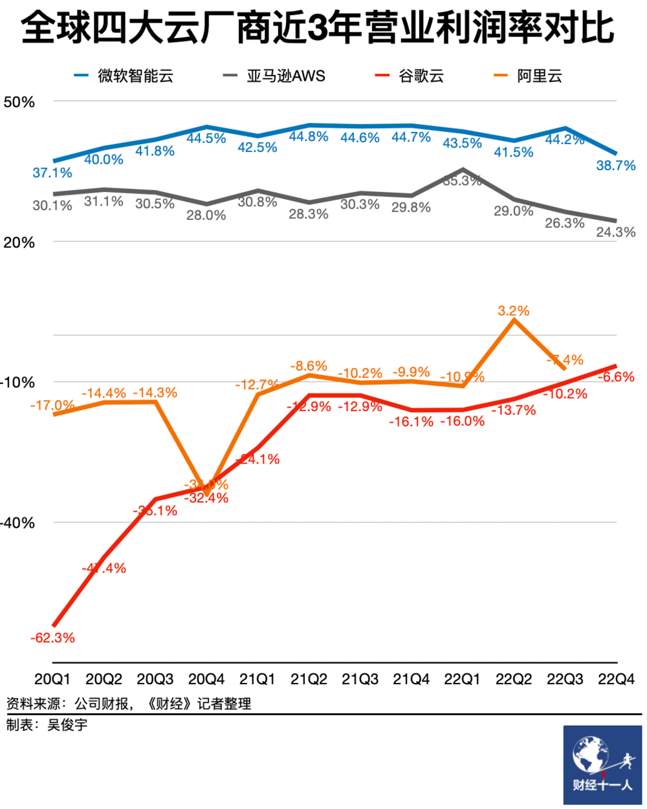
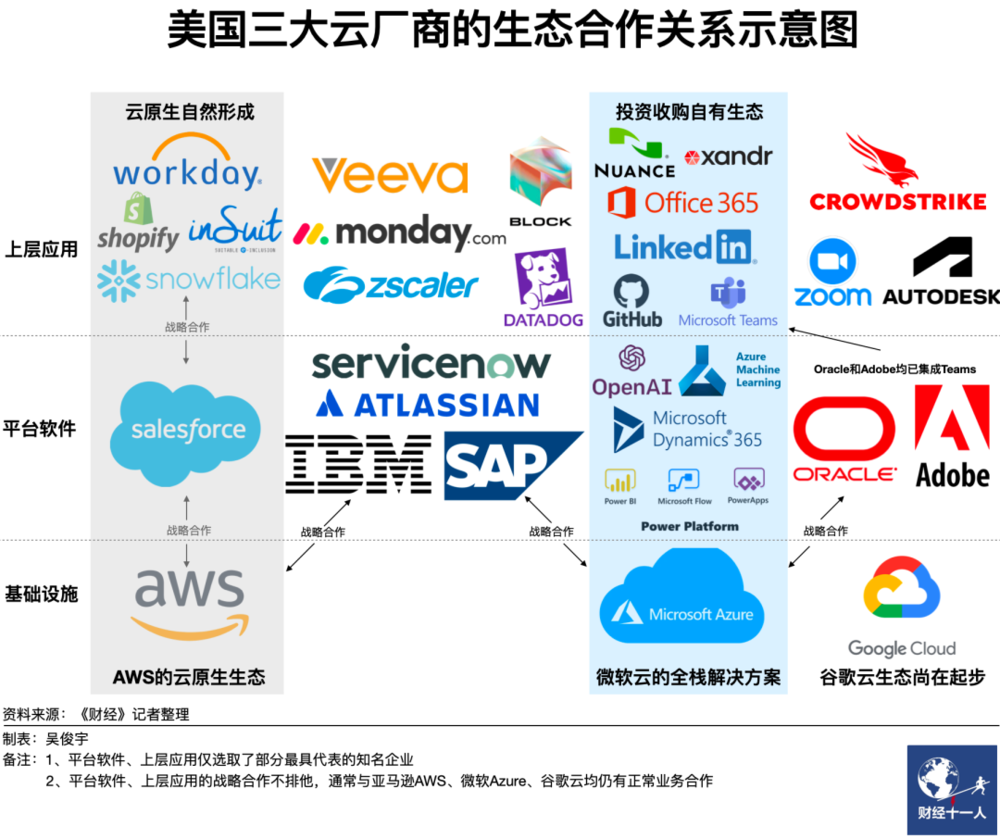
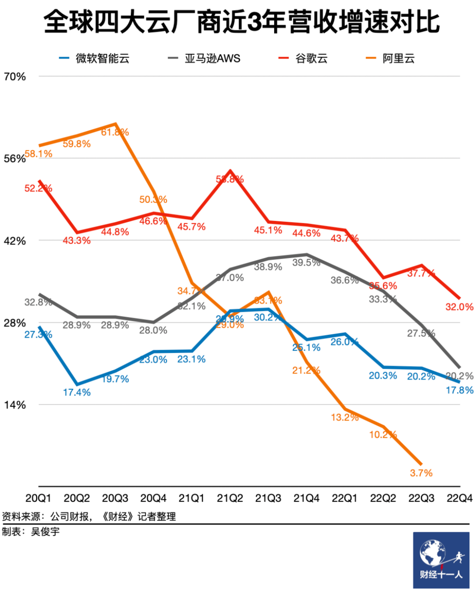
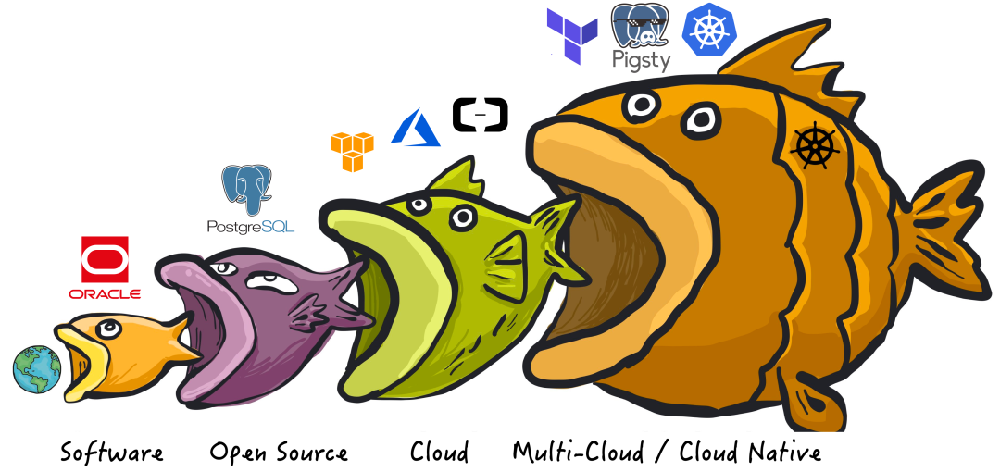
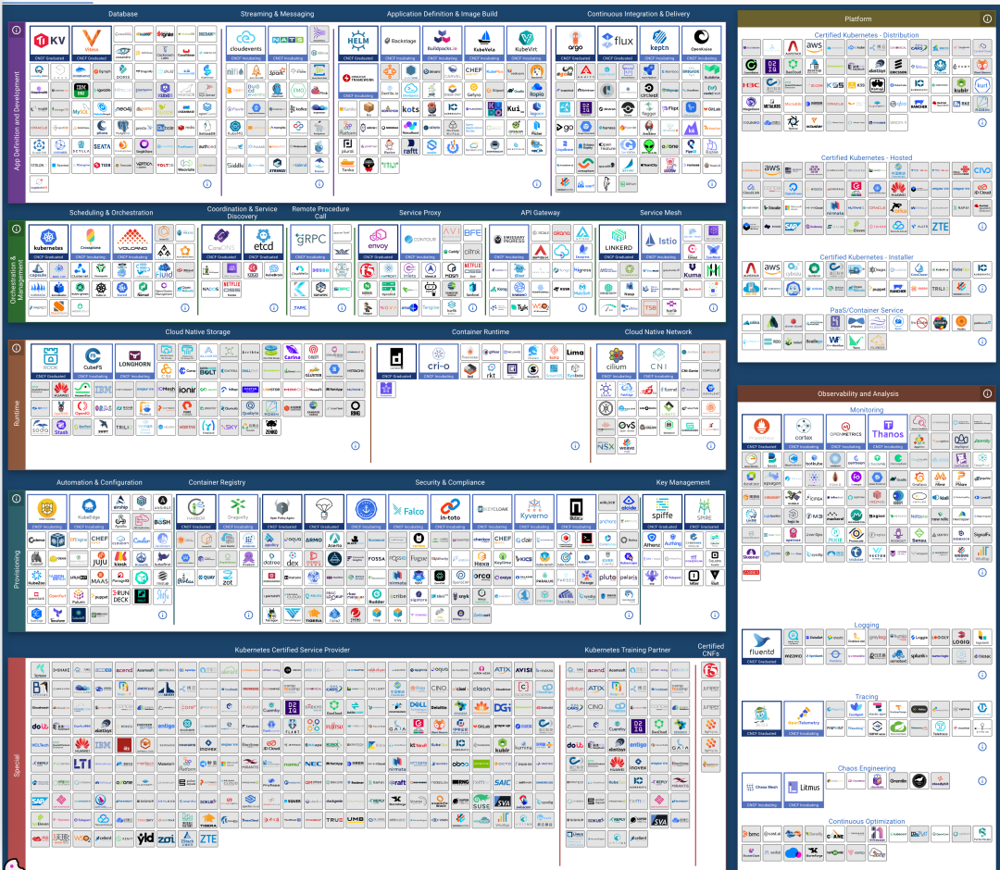
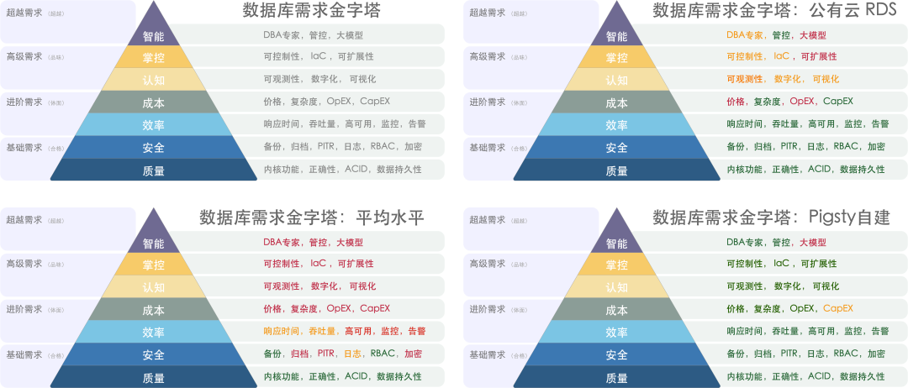
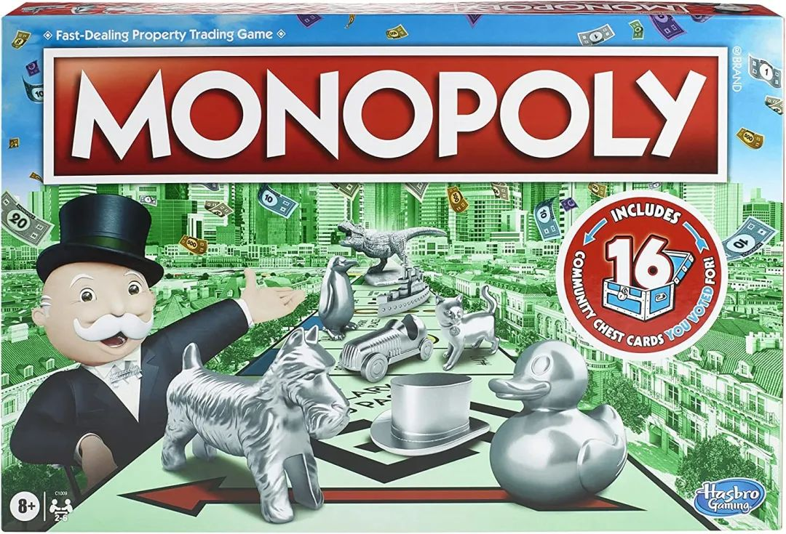

[公有云毛利不如挖沙子](#公有云毛利不如挖沙子)，

[杀猪盘为何成为赔钱货](#杀猪盘为何成为赔钱货)？

[卖资源模式走向价格战](#卖资源模式走向价格战)，

[开源替代打破垄断幻梦](#开源替代打破垄断幻梦)！

[服务竞争力逐渐被抹平](#服务竞争力逐渐被抹平)，

[云计算行业将走向何方](#云计算行业将走向何方)？

-------------------

## 公有云毛利不如挖沙子

在《[云盘是不是杀猪盘](/cloud/ebs/)》、《[云数据库是不是智商税](/cloud/rds/)》以及《[云SLA是不是安慰剂](/cloud/sla/)》中，我们已经研究过关键云服务的真实成本。规模以上以核·月单价计算的云服务器成本是自建的 5～10 倍，云数据库则可达十几倍，云盘更是能高达上百倍，按这个定价模型，云的毛利率做到八九十也不稀奇。

业界标杆的 AWS 与 Azure 毛利就可以轻松到 60% 与 70% 。反观国内云计算行业，毛利普遍在个位数到 **15%** 徘徊，榜一大哥阿里云最多给一句“预估远期整体毛利 40%” ，至于像金山云这样的云厂商，毛利率直接一路干到 **2.1%**，还不如打工挖沙子的毛利高。

而说起净利润，国内公有云厂商更是惨不忍睹。AWS / Azure 净利润率能到 30% ～ 40% 。标杆阿里云也不过在盈亏线上下徘徊挣扎。这不禁让人好奇，这些云厂商是怎么把一门百分之三四十纯利的生意能做到这种地步的？

-------------------

## 杀猪盘为何成为赔钱货

我们可以列举出许许多多多可能的原因：营收压倒一切的KPI，销售主导的增长模式，大公司病与团队内耗，冗员导致的高昂成本，恶意竞争价格战同行卷翻，反佣产生的回扣贪腐，不顾生态亲自下场抢食吃，忘记初心迷失方向陷入歧途，等等等等。

但国内云厂商赔钱的核心问题，还是在于**利润空间被两头挤压**，**能提供的用户价值也因为资源云（国资云/IDC2.0）和开源平替的出现越来越少**。而要理解这一点，就需要从从公有云的业务结构说起。

公有云可以分为 IaaS， PaaS，SaaS 三层，尽管这三层都带 **S**(ervice)，但还是有不小的区别：**底层更偏向于卖资源，顶层更偏向于卖能力**（服务/技术/知识/认知/保险）。**IaaS 层资源占主导地位，SaaS 层能力占主导地位，PaaS 层介于两者之间** —— 例如数据库，既可以视为一种利用整合底层存算资源的**能力**，又可以视作一种更高层次的抽象软件**资源**。

在云刚出现的时候，核心是硬件 / **IaaS**层 ：存储、带宽、算力、服务器。云厂商的初心故事是：**让计算和存储资源像水电一样，自己扮演基础设施的提供者的角色**。这是一个很有吸引力的愿景：公有云厂商可以通过规模效应，压低硬件成本并均摊人力成本；理想情况下，在给自己留下足够利润的前提下，还可以向公众提供比 IDC 价格更有优势，更有弹性的存储算力**资源**。

但很快，公有云就不满足只卖包装硬件卖资源的 IaaS 了：卖资源吃饭的 **IaaS** 定价没有太大水分空间，可以对着 BOM 一笔一笔精算。但是像云数据库这样的 **PaaS**， 里面包含的“**服务/保险**”，人力 / 研发成本就包含大量水分，难以厘定，就可以名正言顺地卖出天价并攫取高额利润。

尽管国内公有云 **IaaS** 层存储、计算、网络三大件的收入能占营收一半的比例，但其毛利率只有 **15% ～ 20%**，而以云数据库为代表的公有云 **PaaS** 毛利率可以达到 **50%** 或更高，完爆卖资源吃饭的 **IaaS**。

对公有云来说，**PaaS 是核心技术壁垒**，**IaaS 是营收基本盘**，云厂商的主要营收也来自这两者。然而，**前者面临开源平替的冲击，后者受到价格战的挑战。**

AWS 的壁垒是先发优势，繁荣的软件生态，Azure 的壁垒是Office SaaS和大模型 PaaS，GCP的壁垒是全球一张网。反观国内云厂商的壁垒：阿里云的数据库，腾讯云的微信生态，百度云的大模型？

-------------------

## 卖资源模式走向价格战

拔了毛的凤凰不如鸡，失去技术垄断的公有云将陷入卖资源价格战的泥潭。当**质量**、**安全**、**效率**搞不出亮点时，唯一能抢占市场份额的选择就是在**成本**上做文章 —— **价格战**。

然而与公有云 **IaaS** 云硬件竞争的，是运营商/国资云/IDC2.0。这些对手的特点就是有各种各样的资源 —— 特殊血统身份关系，自有机房网络土地，廉价带宽低息贷款；卖资源躺着挣钱，主打一个物美价廉：没啥高精尖 PaaS/SaaS，但IDC可以爽快的卖给用户公有云列表价两折或更低的虚拟机，租机柜自建托管更是便宜上天。云列表价 1/5 ～ 1/10 的综合成本，不玩[云盘杀猪](http://mp.weixin.qq.com/s?__biz=MzU5ODAyNTM5Ng==&mid=2247485391&idx=1&sn=4cec9af2b58160eb345a6b12411f0b68&chksm=fe4b3214c93cbb023c13a89133c75bf1e88e1543de9359df7447498e4a9d5ec555313a954566&scene=21#wechat_redirect)之类花里胡哨的东西，就是纯卖资源。

公有云厂商在面对这些对手时，敢卖天价甚至“涨价”（请注意，**资源降价速度慢于摩尔定律等于涨价**）的最大的**壁垒**就是自己有“技术” —— IaaS 层差距拉不了太大，靠的就是还有不错的 PaaS 作为壁垒，来吸引用户 —— 数据库，K8S，大模型以及配套的基础设施。**而拥有能力的技术专家多被互联网/云计算大厂垄断，很多客户上云就是因为找不到稀缺的专家来自建这些服务，因而不得不向公有云缴纳高昂的“无专家税”与“保护费”**。

**然而，****开源的管控软件****以普惠赋能的方式，起到了降维打击的效果**。当这些资源型选手或者用户自己就可以轻松使用开源软件拉起、搭建、组织起自己的“私有云平台”时，公有云构造的技术壁垒护城河就被打破了。曾经靠技术垄断高高在上的云厂商被拉下神坛，拉到了和躺平纯卖资源同侪相近的起跑线。公有云厂商不得不卷入泥潭中厮杀斗兽起来，和这些自己曾经“看不上”的对手打成一团。

-------------------

## 开源替代打破垄断幻梦

自由软件 / 开源软件曾经彻底改变了整个软件与互联网行业，而我们将再次见证历史。

**最初，软件吞噬世界**，例如以 Oracle / Unix 为代表的商业软件，用机器取代了人工，极大提高了效率，节省了很多开销。商业软件凭借“人无我有”形成了垄断优势，牢牢掌握了定价权。像 Oracle 这样的商业数据库非常昂贵，一核·一月光是软件授权费用就能破万，不是大型机构都不一定用得起，即使像壕如淘宝，上了量后也不得不”去O“。

**接着，开源吞噬软件**，像 PostgreSQL 和 Linux 这样”开源免费“的软件应运而生，打破商业软件的垄断。软件开源本身是免费的，只需要几十块钱每核·每月的硬件成本，即可获取接近商业软件的效能。比如在大多数场景下，如果能找到专家帮助企业用好开源操作系统数据库，那么要比用商业软件划算太多了。互联网的历史就是开源软件的历史，互联网的繁荣便是建立在开源软件之上。

开源的“商业逻辑”不是“卖产品”，而是创造专家岗位：免费的开源软件吸引用户，用户需求产生开源专家岗位，开源专家产出更好的开源软件，形成一个闭环。开源软件免费，但能帮助企业**用好/管好** 开源数据库的**专家非常稀缺昂贵**。这也产生了新的垄断机会 —— **产品没法垄断，那就垄断专家。垄断了专家，就能垄断提供服务的能力**。于是，“云服务”出现了。

**然后，云吞噬开源**。公有云软件，是互联网大厂将自己使用开源软件的能力产品化对外输出的结果。公有云厂商把开源数据库内核套上壳，跑在自己的硬件资源上，并雇佣专家编写管控软件并提供代运维与专家咨询服务。大量高端专家人才被头部互联网厂商高薪垄断，普通公司想要**用好**开源软件，除了少数幸运者能找到“专家”自建，大部分不得不选择云服务，并支付十几倍甚至百倍的资源溢价。

那么，**谁来吃云呢**？**云原生运动**，就是开源社区对公有云垄断的反击 —— 在公有云的话语体系中，CloudNative 被解释为长在公有云上的服务；而开源世界对此的理解是“在本地运行云一样的”服务。如何在本地运行云一样的服务？**服务真正的壁垒，不是软件/资源本身，而是能用好这些软件的知识**。—— 无论是以直接堆专家人力的形式，还是专家经验沉淀而成的管控软件 / K8S Operator  的形式，或者专家经验训练得到的大模型的形式。

实际上，真正负责云服务日常性、高频性、运维性核心主体工作的往往并不是专家本身，而是**管控软件** —— **沉淀了专家经验的元软件**。一旦这些云管控软件出现开源替代，开源软件打破商业软件垄断的剧情会再一次上演。

这一次，是[**本地优先**](/cloud/paradigm/)的管控软件掀翻云管控软件。PaaS 失去**垄断度**，将使云厂商丧失部分**定价权**，进而**利润受损**。但真正让云受伤的，是**基本盘** **IaaS 资源生意失去壁垒，不得不直面纯资源厂商的价格战。**

-------------------

## 服务竞争力逐渐被抹平

**利润源于定价权，定价权源于垄断度，垄断度取决于产品在市场上的相对竞争力**。随着开源社区滚雪球形成合力，开源管控软件与云管控软件的竞争力已经被逐步抹平，甚至在一些领域出现了**反超**。

例如，Kubernetes / OpenStack / SealOS，可以理解为云厂商 EC2/ECS/VPS 管控软件的开源替代；MinIO / Ceph 旨在作为为云厂商 S3 / OSS 管控软件的开源替代；而 [**Pigsty**](http://mp.weixin.qq.com/s?__biz=MzU5ODAyNTM5Ng==&mid=2247485349&idx=1&sn=96fde26dd9efd399ef7ae11e52e05843&chksm=fe4b327ec93cbb688e2708ff4e709a7ba32eee2be9d8637e9b941f47e6600dc7fcd2710a42c4&scene=21#wechat_redirect) / 各种数据库 Operator 就是 RDS 云数据库管控软件的开源替代。

这些软件的特点在于：它们旨在解决管理好**资源**的问题，并提供用好软件本身的**能力**。此类自建服务的质量水平在很多方面不逊色甚至超越了所对标的云服务，而上手复杂度与人力成本基本持平，却只需要几分之一到十几分之一的纯资源成本即可：**The more you run, the more you save!**

自建的门槛也在以惊人的速度不断降低，一个初中级的研发运维，可以轻松使用 Sealos 这样的软件创建起具有弹性伸缩，资源调度能力的 Kubernetes 集群运行无状态应用；也可以轻松地使用 [**Pigsty**](http://mp.weixin.qq.com/s?__biz=MzU5ODAyNTM5Ng==&mid=2247485518&idx=1&sn=3d5f3c753facc829b2300a15df50d237&chksm=fe4b3d95c93cb4833b8e80433cff46a893f939154be60a2a24ee96598f96b32271301abfda1f&scene=21#wechat_redirect) 部署 PostgreSQL / Redis / MinIO / Greenplum 集群，声明式地拉起“自动驾驶”的本地云数据库（数仓/缓存/对象存储）存储状态，补完K8S的短板。

即使是云厂商，也不得不承认 Kubernetes 的成功：它已经成为了运行无状态弹性应用的事实标准，并且有很大概率成为下个时代的数据中心级“操作系统” —— 在应用与底层物理机资源之间，可能并不需要一层 EC2/VM 作为中间商。

同理，在用户使用数据库的平均水平就是yum安装+定时备份+设置密码的时代，云数据库RDS服务可以凭借质量安全效率合格标品的先进优势大杀四方，然而当顶尖水平的用户以可复制的形式输出最佳实践，出现开源免费的上位优质替代后，大锅饭合格品层次的 RDS 就只能相形见绌了。

作为公有云壁垒的云 PaaS 将在开源替代的冲击下走向独立/解体/萎缩/消亡，然而一鲸落，万物生，这也意味着更多的 PaaS/SaaS 创业团队将会迎来解放。

-------------------

## 云计算行业将走向何方？

如果我们把目光回退至上世纪初，从电力的推广普及垄断监管中汲取历史经验。就不难看云计算行业的剧本走向 —— 云的故事与电力行业如出一辙，**资源与能力的拆分是未来的方向**。

**资源与基础设施性质的行业，最终的归宿是国家垄断**。公有云的资源部分 —— IaaS 层会被剥离，整合，招安，成为算力/存储的“国家电网”。作为央企，国家电网并不负责发电，也不负责制造电器，它做的就是电力垄断资源的传输与分发。云 IaaS 也不会去制造芯片，硬盘，光纤，服务器，而是将其整合为存算网资源，交付到用户手上。国资云，运营商云，阿里云/华为云等会瓜分这一市场。

**能力性质的行业，主旋律将是自由竞争，百花齐放**。如果 IaaS 是供电行业，那么 PaaS/SaaS 便是电器行业 —— 提供各种不同的，使用存算网资源的能力。洗衣机，冰箱，热水器，电脑，都会涌现出无数创业公司与开源社区同台竞技，充分竞争。当然也会有一部分软件可以享受例外的垄断保护地位 —— 比如安可信创。

**同时有着 IaaS / PaaS / SaaS 的公有云可能会解体**。云内部的博弈可能要比外部竞争更激烈：IaaS 团队会认为，就连自己用的 IDC机房都有 30% 的毛利，凭啥有躺着卖资源挣钱的机会，却要去陪 PaaS/SaaS 一起卷？有能力的云软件团队会认为，在哪家云甚至私有云上卖不是卖，为啥要绑在一棵树上吊死，为 IaaS 作嫁衣裳？像 OceanBase 一样独立出去到处卖或者自己出来创业难道不香？

**公有云厂商寡头价格战只是这个进程的开始**，云厂 IaaS 在相互斗兽竞争中，通过垄断并购形成“规模效应”，利用“峰谷电”，“弹性定价”等各种方式优化整体资源利用率，会将算力成本不断压低至新的底线，最终实现“家家有电用”。中小云厂商估计不太可能活过这一场，当然，最后也少不了政府监管介入，公私合营国资入场。各家云 IaaS 成为类似于电信运营商的国有垄断企业，通过控制竞争烈度维持一个可观的利润率，边挣边躺。

公有云的 PaaS / SaaS 在被更好，更优质，更便宜的替代物冲击下逐渐萎缩，或回归到足够低廉的价格水平。数据库，K8S，云安全等业务团队会从云中拆分与独立，**能打的云软件团队必然选择出来单干****，采取云中立的立场**，在各种云底座上与各种供应商、开源社区同台赛马，各显所长。

正如当年开源运动的死对头微软现在也选择拥抱开源。公有云厂商肯定也会有这一天，与自由软件世界达成和解，心平气和地接受基础设施供应商的角色定位，为社会提供水与电一般的平价存算网资源，**云软件也会**回归正常毛利率，不卑不亢，不骗不抢，采购软件如同购买家电一样稀松寻常。

博弈的终点非常清晰，然而道阻且长。但能肯定的是，我们的下一代将对于云端的**存**与**算**习以为常，正如上一代看**水**与**气**，这一代看**电**与**网**。

