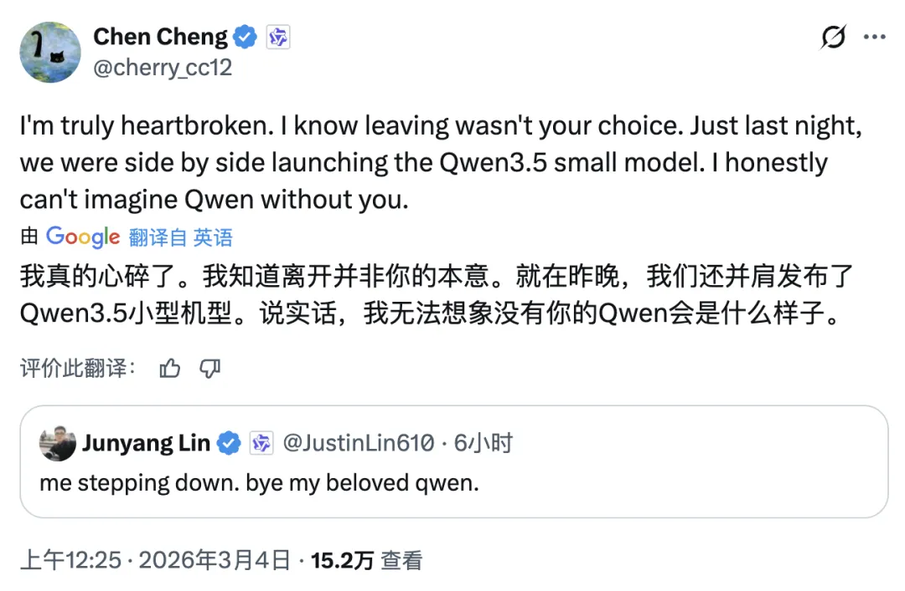
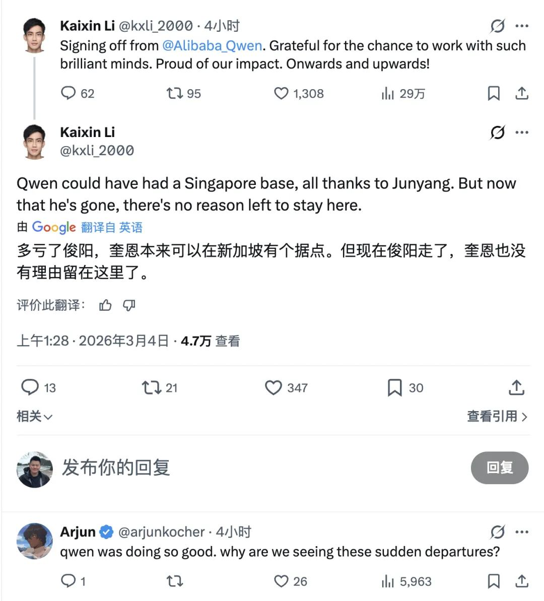
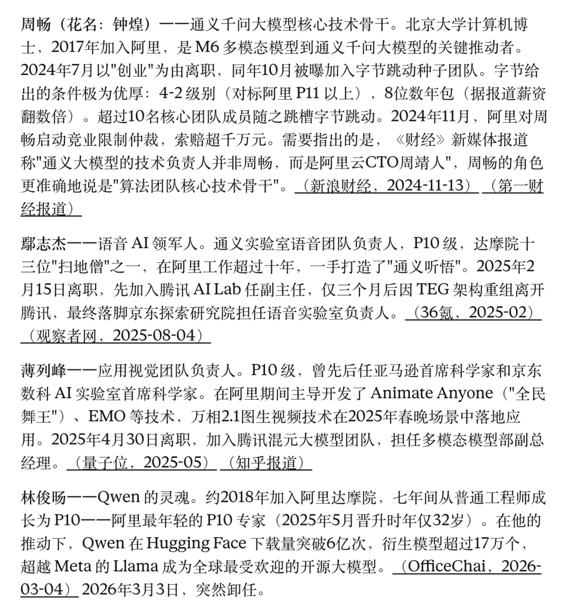
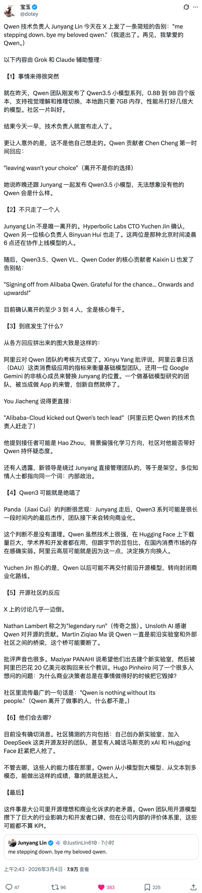
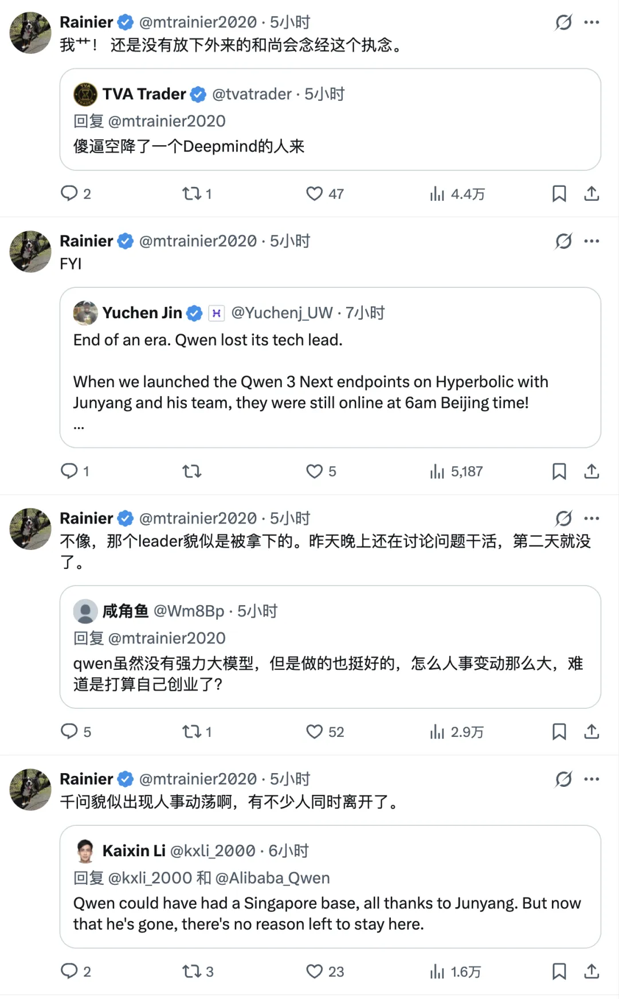
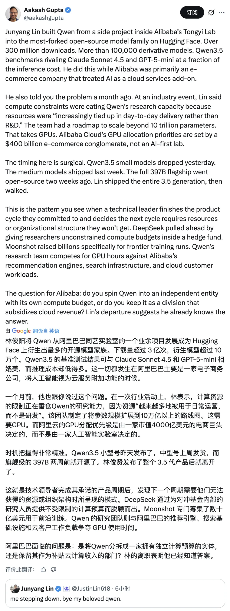

I had become more optimistic about Alibaba over the last year, largely because the Qwen team seemed to be doing real work: shipping strong models, contributing to open source, and earning genuine international attention.

That is why this personnel shock felt so significant.

On March 3, 2026, Qwen technical lead Justin Lin posted a short farewell message on X:

Not long after, the public narrative turned from resignation to upheaval.

## 1. Publishing one night, gone the next

Qwen contributor Chen Cheng replied bluntly that leaving had not really been Justin Lin's choice, and that they had still been shipping models together the night before.

That timing is what made the incident feel less like a planned career transition and more like a sudden internal power move.

The same day, other researchers also announced departures, including Kaixin Li and Binyuan Hui. Kaixin Li mentioned that Qwen had once planned to build a technical outpost in Singapore, but that the plan was no longer viable after Lin's exit.

## 2. Eighteen months of talent drain

Lin's departure did not happen in isolation. Over roughly the last year and a half, leadership across language, speech, and vision had already been thinning out.

The larger concern is not just turnover. It is the sense that the original core of Tongyi Lab has been repeatedly destabilized.

## 3. What may be behind it

Public discussion on X and in the broader AI community points to four recurring explanations:

1. **Mismatch between compute and research**: too much compute goes to delivery demands and not enough to frontier work.
2. **Misaligned KPIs**: rumors suggest consumer metrics such as DAU were being pushed onto foundation-model teams.
3. **Constant org reshuffles**: changing reporting lines often means changing power centers.
4. **External parachute leadership**: speculation quickly focused on who might be inserted next.

These are all plausible dynamics in a large cloud company trying to turn a frontier model team into a product and business unit at the same time.

## 4. My read

### Qwen may keep shipping, but something important has changed

The models may still launch. The APIs will still run. The app may still grow.

But the globally visible, open-source-native human face behind Qwen is gone.

That matters more than many executives think. A project like Qwen does not just need model checkpoints. It needs a living bridge to global developers.

### Cloud companies are often bad homes for model teams

I have long thought that frontier model teams should not be too tightly fused to cloud-company logic. Cloud businesses optimize for delivery, utilization, internal politics, and monetization. Research teams need room to spend compute on uncertain bets.

### Organization still beats money

Alibaba can spend aggressively. But no amount of money automatically fixes organizational friction. If your best researchers think they are trapped inside delivery quotas and KPI theater, you can still lose them.

## Closing

Qwen will probably continue as a product line. But the team that made it feel alive to the outside world has clearly been shaken.

That may be the most serious loss of all.

The reporting and commentary around this incident rely heavily on public discussion from X and other open sources. Some details remain difficult to verify independently, so treat the organizational interpretation with appropriate caution.
