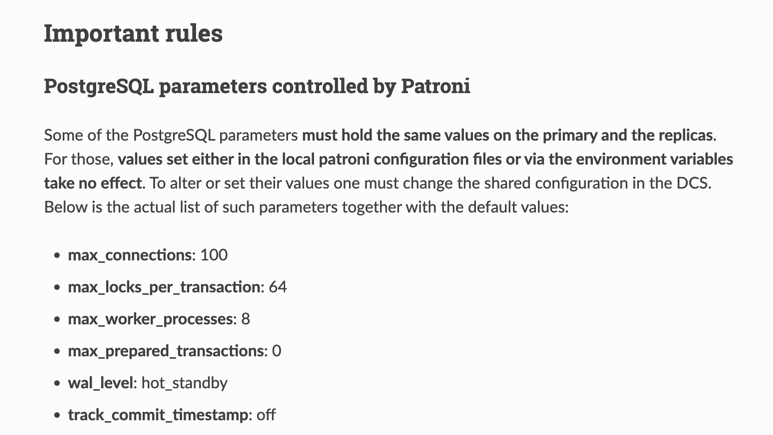
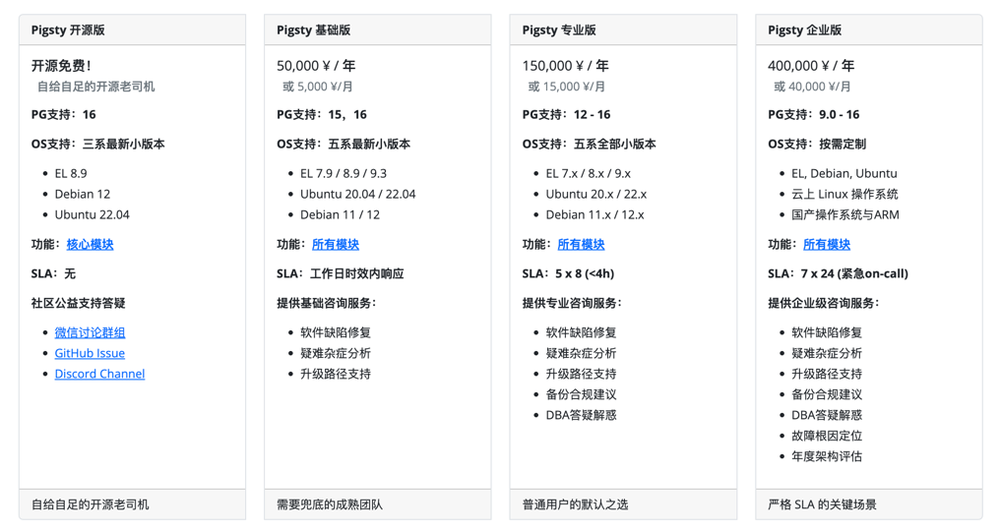

In "[Are Cloud Databases an IQ Tax](/cloud/rds)", I evaluated cloud database RDS as: "**selling sky-high pre-made meals at five-star hotel prices**" — but legitimate pre-made meals from industrial kitchens are at least edible and generally won't kill you. However, a recent incident on Alibaba Cloud has changed my perspective.

I have a client L who recently vented to me about an outrageous cascade of failures encountered on their cloud database: a high-availability PG RDS cluster completely failed - both primary and replica servers - after attempting a simple memory expansion, causing them to troubleshoot until dawn. Poor recommendations abounded during the incident, and the postmortem provided was quite perfunctory. With client L's consent, I share this case study here for everyone's reference and review.

- [The Incident: Beyond Belief](#the-incident-beyond-belief)
- [Memory Expansion: Creating Problems Out of Nothing](#memory-expansion-creating-problems-out-of-nothing)
- [Replica Failure: Questionable Competence](#replica-failure-questionable-competence)
- [Primary Failure: Suffocating Operation](#primary-failure-suffocating-operation)
- [WAL Accumulation: Missing Expertise](#wal-accumulation-missing-expertise)
- [Disk Expansion: Revenue Generation Tactics](#disk-expansion-revenue-generation-tactics)
- [Compensation Agreement: Hush Money Pills](#compensation-agreement-hush-money-pills)
- [Solution: Cloud Exit and Self-Building](#solution-cloud-exit-and-self-building)
- [Advertisement Time: Expert Consulting](#advertisement-time-expert-consulting)

---------------

## The Incident: Beyond Belief

Client L's database scenario is quite robust: several TB of data, TPS under 20,000, write throughput of 8,000 rows/second, read throughput of 70,000 rows/s. They used ESSD PL1 with 16c 32g instances, one primary one standby high-availability version, dedicated instance family, with six-figure annual consumption.

The entire incident unfolded roughly as follows: Client L received **memory alerts**, submitted a ticket, and the attending after-sales engineer diagnosed: data volume too large, extensive row scanning causing memory shortage, recommending memory expansion. The client agreed, then the engineer expanded memory, which took three hours, **during which both primary and replica servers failed**, requiring manual troubleshooting and fixing.

After the expansion was completed, they encountered **WAL log accumulation** issues, with 800 GB of WAL logs accumulated threatening to fill up the disk, taking another two hours until after 11 PM. The after-sales team said WAL log archive upload failures caused the accumulation, failures were due to disk IO throughput being maxed out, recommending upgrading to ESSD PL2.

Having learned their lesson from the memory expansion failure, the client didn't immediately buy into this disk expansion recommendation but consulted me instead. Looking at the incident scene, I found it beyond belief:

1. Your load is quite stable, why expand memory for no reason?
2. Doesn't RDS claim elastic second-level scaling? How did a memory upgrade take three hours?
3. Three hours aside, how did a simple expansion bring down both primary and replica servers?
4. The replica failed supposedly due to parameter mismatch, fine, but how did the primary server fail?
5. Primary failed - did high-availability failover take effect? How did WAL start accumulating again?
6. WAL accumulation means something is stuck - how would upgrading cloud disk tier/IOPS help?

Post-incident explanations from the vendor made it even more bewildering:

- Replica failed because parameters were misconfigured and it couldn't start
- Primary failed because "special handling was done to avoid data corruption"
- WAL accumulation was due to hitting a BUG, which the client discovered, deduced, and pushed to resolve
- The BUG was "allegedly" caused by cloud disk throughput being maxed out

My friend Swedish Ma has consistently advocated that "[cloud databases can replace DBAs](https://mp.weixin.qq.com/s/PqCD80H927s0yJrBr4QQqw)".
I believe this has theoretical feasibility — cloud vendors could build an expert pool providing [time-shared DBA services](/cloud/dba-vs-rds).

But the current reality is likely: **cloud vendors lack qualified DBAs, unprofessional engineers may even give you terrible advice, breaking well-running databases, then blame it on insufficient resources and recommend you expand and upgrade to earn more money.**

After hearing about this case, Ma could only helplessly argue: "**Garbage RDS isn't real RDS**".

--------

## Memory Expansion: Creating Problems Out of Nothing

**Resource shortage is a common cause of failures, but precisely because of this, it's sometimes abused as an excuse to shift blame, deflect responsibility, or demand resources - a universal excuse for selling hardware.**

Memory alerts and OOM might be a problem for other databases, but for PostgreSQL it's completely absurd. In my years of experience, I've witnessed all kinds of failures: large data volumes bursting disks, heavy queries maxing out CPU, memory bit flips corrupting data, but an OLTP PG instance causing memory alerts due to heavy read queries - I've never seen that.

PostgreSQL uses double buffering. In OLTP instances using memory, pages are all placed in a fixed-size SharedBuffer. As a **well-known best practice**, PG SharedBuffer is typically configured to about 1/4 of physical memory, with the remaining memory used by the filesystem cache. This means typically 60-70% of memory is flexibly managed by the operating system - when not enough, just evict some cache. If heavy read queries cause memory alerts, I personally find it bewildering.

So, for what might not even be a real problem (false alarm?), the RDS after-sales engineer's recommendation was: *insufficient memory, please expand memory*. The client believed this recommendation and chose to double the memory.

Logically, cloud databases advertise their ultimate elasticity and flexible scaling, managed with Docker. Shouldn't this be as simple as changing MemLimit and PG SharedBuffer parameters in place and restarting? A few seconds would make sense. Instead, this expansion took three full hours and triggered a series of cascading failures.

For memory shortage, upgrading two 32G servers to 64G, according to the pricing model we calculated in "[Analyzing Alibaba Cloud Server Computing Cost](/cloud/ecs/#实例族对价格的影响)", this memory expansion operation alone could bring in tens of thousands in additional annual revenue. If it could solve the problem, that would be one thing, but in fact this memory expansion not only failed to solve the problem but also triggered bigger problems.

--------

## Replica Failure: Questionable Competence

The first cascading failure caused by memory expansion was this: the standby server crashed. Why did it crash? Because PG parameters weren't configured correctly: `max_prepared_transaction`. Why would this parameter cause crashes? Because in a PG cluster, this parameter must be consistent between primary and replica servers, otherwise the replica will refuse to start.

Why did primary-replica parameter inconsistency occur here? **I speculate** that in RDS design, this parameter's value is set proportionally to instance memory, so when memory expansion doubled, this parameter also doubled. Primary-replica inconsistency, then when the replica restarted, it couldn't come up.

Regardless, crashing due to this parameter is an extremely absurd error, a PostgreSQL DBA 101 issue. The PG documentation clearly emphasizes this point. Any DBA who has performed rolling upgrade/downgrade basic operations would either have learned about this issue when reading documentation, or crashed here and then read the documentation.

If you manually create replicas with `pg_basebackup`, you won't encounter this problem because replica parameters default to match the primary. If you use mature high-availability components, you also won't encounter this problem: the open-source PG high-availability component Patroni forcibly controls these parameters and [prominently tells users in documentation](https://patroni.readthedocs.io/en/latest/patroni_configuration.html#important-rules): these parameters must be consistent between primary and replica, we manage them, don't mess with them.

You would encounter this problem in one situation: poorly designed homegrown high-availability service components or insufficiently tested automation scripts that **presumptuously "optimize" this parameter for you**.

--------

## Primary Failure: Suffocating Operation

If the replica failing affected only some read-only traffic, that might be acceptable. But the primary failing is a matter of life and death for client L's real-time data reporting business. Regarding the primary failure, the engineer's explanation was: during expansion, due to busy transactions, primary-replica replication lag couldn't catch up, so "**special handling was done to avoid data corruption**".

This explanation is vague, but based on literal and contextual understanding, it should mean: expansion required primary-replica failover, but due to significant primary-replica replication lag, direct failover would lose some data not yet replicated to the replica, so RDS shut off the primary's traffic tap for you, catching up replication lag before performing primary-replica failover.

Honestly, I find this operation suffocating. Primary fencing is indeed a core issue in high availability, but when a proper production PG high-availability cluster handles this problem, the standard SOP is to first temporarily switch the cluster to synchronous commit mode, then execute Switchover, naturally not losing a single piece of data, and the switch only affects queries executing at that moment with sub-second interruption.

"**Special handling was done to avoid data corruption**" is indeed quite artistic — yes, directly shutting down the primary can achieve fencing and indeed won't lose data during high-availability failover due to replication lag, **but client data can't be written anymore**! This lost data is far more than that little lag. This operation inevitably reminds one of the famous "[Treating Hunchbacks](https://www.gushiwen.cn/shiwenv_ddbe67aad03d.aspx)" joke:

--------

## WAL Accumulation: Missing Expertise

After fixing the primary-replica failure issues, spending another hour and a half, the primary memory expansion was finally completed. However, when one wave subsides, another rises - WAL logs started accumulating again, reaching nearly 800 GB within a few hours. If not discovered and handled in time, filling up the disk causing database unavailability would be inevitable.

> The two pitfalls are also visible from monitoring

The RDS engineer's diagnosis was disk IO maxed out causing WAL accumulation, recommending disk upgrade from ESSD PL1 to PL2. However, having learned their lesson from the memory expansion, the client didn't immediately believe this recommendation but consulted me instead.

After reviewing the situation, I found it extremely absurd - load hadn't changed significantly, and IO being maxed out wouldn't manifest as this kind of complete standstill. So the reasons for WAL accumulation could only be those few: replication lag behind by 100+ GB, replication slots retaining less than 1GB, so the remaining bulk must be **WAL archive failures**.

I had the client submit a ticket to RDS for root cause analysis. RDS eventually found the problem was indeed WAL archiving being stuck and manually resolved it, but this was nearly six hours after WAL accumulation began, demonstrating very amateurish competence throughout the process with many absurd recommendations.

> Another absurd recommendation: direct traffic to a replica with 16 minutes replication lag

Alibaba Cloud's database team isn't without PostgreSQL DBA experts - Digoal working at Alibaba Cloud is absolutely a PostgreSQL DBA master. However, it seems that in RDS product design, not much domain knowledge and experience from DBA masters has been distilled; and the professional competence demonstrated by RDS after-sales engineers is far inferior to that of a qualified PG DBA, or even a GPT4 bot.

I often see RDS users encounter problems that aren't resolved through official tickets, having to bypass tickets and directly seek help from Digoal in the PG community to [solve problems](/cloud/drop-rds/) — which is indeed quite dependent on luck and connections.

--------

## Disk Expansion: Revenue Generation Tactics

After resolving the cascade of issues including "memory alerts," "replica failure," "primary failure," and "WAL accumulation," it was nearly dawn. But the root cause of WAL accumulation remained unclear, with the engineer's response being "**related to disk throughput being maxed out**", again recommending ESSD cloud disk upgrade.

In the post-incident review, the engineer mentioned the cause of WAL archive failures was "**RDS upload component BUG**". Looking back, if the client had really followed the recommendation to upgrade cloud disks, it would have been wasted money.

In "[Are Cloud Disks Pig-Slaughtering Scams](/cloud/ebs)" we analyzed that the most ruthlessly overpriced basic resource in cloud is ESSD cloud disks. According to numbers in "[Alibaba Cloud Storage and Computing Cost Analysis](/cloud/ebs/#pig-slaughtering-scam-pricing)": client's 5TB ESSD PL1 cloud disk monthly price is **1 ¥/GB**, so annual cloud disk costs alone would be **120,000**.

| Unit Price: ¥/GiB·month | IOPS | Bandwidth    | Capacity  | On-Demand Price | Monthly Price | Annual Price | 3-Year Prepaid+ |
|:-----------------------:|:----:|-------------|:---------:|:---------------:|:------------:|:------------:|:---------------:|
| ESSD Cloud Disk PL0    | 10K  | 180 MB/s    | 40G-32T   |      0.76       |     0.50     |     0.43     |      0.25       |
| ESSD Cloud Disk PL1    | 50K  | 350 MB/s    | 20G-32T   |      1.51       |     1.00     |     0.85     |      0.50       |
| ESSD Cloud Disk PL2    | 100K | 750 MB/s    | 461G-32T  |      3.02       |     2.00     |     1.70     |      1.00       |
| ESSD Cloud Disk PL3    |  1M  | 4 GB/s      | 1.2T-32T  |      6.05       |     4.00     |     3.40     |      2.00       |
| Local NVMe SSD          |  3M  | 7 GB/s      | Max 64T/card | **0.02**      |     0.02     |     0.02     |      0.02       |

Following the recommendation to "upgrade" to ESSD PL2, yes, IOPS throughput would double, but unit price would also double. This single "upgrade" operation alone **could bring cloud vendors an additional 120,000 in revenue**.

Even the ESSD PL1 beggar disk comes with 50K IOPS, while client L's scenario of 20K TPS, 80K RowPS converted to random 4K page IOPS - even taking ten thousand steps back and not considering PG and OS buffers (like 99% cache hit rate being very normal for this type of business scenario), trying to max it out would still be quite difficult.

I can't judge whether the practice of recommending memory expansion / disk expansion whenever problems arise is due to professional incompetence leading to misdiagnosis, or the evil desire to exploit information asymmetry for revenue generation, or both — but this practice of price gouging during illness inevitably reminds me of the once notorious Putian hospitals.

--------

## Compensation Agreement: Hush Money Pills

In "[Are Cloud SLAs Placebos](/cloud/sla/)" I already warned users: cloud service SLAs aren't commitments to service quality at all. **In the best case they're placebos providing emotional value, and in the worst case they're bitter pills you have to swallow without recourse.**

In this incident, client L received a compensation offer of **1000** yuan in vouchers, which for their scale would let this RDS system run a few more days. From the user's perspective, this is basically naked humiliation.

Some say cloud provides "**scapegoat**" value, but that only means something to irresponsible decision-makers and foot soldiers. For CXOs who directly bear consequences, overall gains and losses are most important. Shifting business continuity interruption blame to cloud vendors in exchange for 1000 yuan vouchers has no meaning.

Of course, things like this have happened more than once. Two months ago client L encountered another absurd replica failure incident — the replica failed, then monitoring on the console couldn't see it at all. The client discovered this problem themselves, submitted tickets, initiated appeals, and still received **1000¥** SLA consolation compensation.

Of course this is because client L's technical team has competence and ability to independently discover problems and actively seek redress. If it were those technically near-zero novice users, they might just [muddle through](https://mp.weixin.qq.com/s/mgkOybNeEH3LO0gRa1rQBQ) with the problem being covered up.

There are also problems "SLA" doesn't cover at all — for example, another case from client L earlier (direct quote): "*To get discounts, we needed to migrate to another new Alibaba Cloud account. The new account started a same-configuration RDS with logical replication. After nearly a month of replication, data still wasn't synchronized, forcing us to abandon the new account migration, resulting in wasting tens of thousands of yuan.*" — This was truly paying money to buy suffering, with nowhere to seek justice.

After several incidents bringing terrible experiences, client L finally couldn't tolerate it after this accident and decided to exit the cloud.

--------

## Solution: Cloud Exit and Self-Building

Client L had cloud exit plans several years ago. They got several servers in an IDC and used Pigsty to build several PostgreSQL clusters as cloud replicas with dual writes, running very well. But taking down the cloud RDS would still require some effort, so they just kept running both systems in parallel. Including multiple terrible experiences before this incident, it finally pushed client L to make the cloud exit decision.

Client L directly ordered four new servers plus 8 Gen4 15TB NVMe SSDs. Particularly these NVMe disks have IOPS performance that's **20 times** that of cloud ESSD PL1 beggar disks (1M vs 50K), while TB·month unit price is **1/166** of cloud prices (1000¥ vs 6¥).

> Side note: 6 yuan TB·month price, I've only seen on Amazon during Black Friday sales. 125 TB for only 44K ¥ (total new hardware adding 9.6K ¥), truly specialized expertise - a cost control master who's handled hundreds of millions in procurement.

As DHH said in "[Cloud Exit Odyssey: Time to Give Up on Cloud Computing](/cloud/odyssey/#02-22-指导下云的五条价值观)":

> "We spend money wisely: In several key examples, cloud costs are extremely high — whether it's **large physical machine databases, large NVMe storage, or just the latest fastest computing** power. The money spent renting the production team's donkey is so high that a few months' rent equals the price of buying it outright. In this case, you should just buy that donkey directly! We'll spend our money on our own hardware and our own people, everything else will be compressed."

For client L, the benefits of cloud exit are immediate: just a **one-time investment** of a few months' RDS costs is enough for hardware resources over-provisioned by several to ten-fold, reclaiming [hardware development dividends](/cloud/bonus/), [achieving stunning cost reduction and efficiency improvement](/cloud/finops) — **you no longer need to penny-pinch over bills, nor worry about insufficient resources**. This is indeed a question worth pondering: if cloud-off resource unit prices become one-tenth or even a few percent, how much meaning does the elasticity touted by cloud still have? And what would prevent cloud users from exiting to self-build?

**The biggest challenge in cloud exit and self-building RDS services is actually people and skills**. Client L already has a technically solid team but indeed lacks professional knowledge and experience with PostgreSQL. This is also a core reason why client L was willing to pay high premiums for RDS. But the professional competence RDS demonstrated in several incidents was even inferior to the client's own technical team, making continued cloud presence meaningless.

--------

## Advertisement Time: Expert Consulting

In cloud exit matters, I'm happy to provide help and support for client L. [Pigsty](https://pigsty.cc/zh/) distills my domain knowledge and experience as a top PG DBA into an open-source RDS [self-building tool](/cloud/rds/#dba的工作与自动化管控), having helped countless users worldwide build their own enterprise-grade PostgreSQL database services. Although it has solved operational issues like out-of-box usability, scaling integration, monitoring systems, backup recovery, security compliance, and IaC quite well, to fully unleash the complete power of PostgreSQL and Pigsty still requires expert help for implementation.

So I provide clearly priced [**expert consulting services**](/zh/docs/about/service) — for clients like L with mature technical teams who just lack domain knowledge, I only charge a fixed **5K ¥/month** consulting fee, equivalent to half a junior operations engineer's salary. But sufficient to let clients confidently use hardware resource costs an order of magnitude lower than cloud, self-building better local PG RDS services — and even when continuing to run RDS on cloud, avoid being fooled and harvested by "experts".

I believe **consulting** is a dignified mode of earning money while standing upright: I have no motivation to sell memory and cloud disks, or talk nonsense peddling my own products (because the products are open source and free!). So I can completely stand on the client's side and give recommendations optimal for client interests. Neither client nor vendor needs to do the tedious database operations work, because this work has been completely automated by Pigsty, the open-source tool I wrote. I only need to provide expert opinions and decision support at occasional key moments, consuming little energy and time, yet helping clients achieve effects that originally required full-time employment of top DBA experts, ultimately achieving win-win for both parties.

But I must also emphasize that I advocate cloud exit concepts always targeting customers with **certain data scale and technical strength**, like client L here. If your scenario falls within cloud computing's comfort spectrum (like using 1C2G discount MySQL for OA), and you lack technically solid or trustworthy engineers, I would honestly advise against tinkering — 99 yuan/year RDS is still much better than your own yum install, what more could you want? Of course for such use cases, I do suggest considering free tiers from [cyber bodhisattvas](/cloud/cloudflare) like Neon, Supabase, Cloudflare - **might not even cost a yuan**.

For those customers with certain scale who are tied to cloud databases being continuously bled dry, you can indeed consider another option: self-building database services is by no means rocket science — **you just need to find the right tools and the right people**.

--------

## Extended Reading

[Are Cloud Disks Pig-Slaughtering Scams?](http://mp.weixin.qq.com/s?__biz=MzU5ODAyNTM5Ng==&mid=2247485745&idx=4&sn=93746ecea381afd8e2f9820447b09ec7&chksm=fe4b3ceac93cb5fc44f33ffff226747bc317854acbb3882aeb0d9a7e196eeb5df002d0e77275&scene=21#wechat_redirect)

### [**Are Cloud Databases an IQ Tax**](http://mp.weixin.qq.com/s?__biz=MzU5ODAyNTM5Ng==&mid=2247485745&idx=5&sn=a7d610ea37c3f3fa78ee4ba0ee705962&chksm=fe4b3ceac93cb5fc6f1975f94be04424e7b3690eedd1658951deb8d016f5f19ade8806d86417&scene=21#wechat_redirect)

[Exposing Cloud Object Storage: From Cost Reduction to Pig Slaughtering](http://mp.weixin.qq.com/s?__biz=MzU5ODAyNTM5Ng==&mid=2247486688&idx=1&sn=bbdee063b65994cb5e15d3e3b7d87523&chksm=fe4b393bc93cb02d76c48f0fbfe3d60c8821b8079b1cfc05f8ccc56c1351b4a7a76b5794019a&scene=21#wechat_redirect)

[**Analyzing Cloud Computing Cost: Did Alibaba Cloud Really Cut Prices?**](http://mp.weixin.qq.com/s?__biz=MzU5ODAyNTM5Ng==&mid=2247487089&idx=1&sn=ca16c2e7e534380eadcb3a3870d8e3b4&chksm=fe4b3baac93cb2bc8c4b68c468acf3e8ac5ee124080a3e738262fe99dd1765c3adf9c56ea650&scene=21#wechat_redirect)

[**From Cost Reduction Jokes to Real Cost Reduction and Efficiency**](http://mp.weixin.qq.com/s?__biz=MzU5ODAyNTM5Ng==&mid=2247486527&idx=1&sn=8e26f644f2b908fd21c83b81d329155d&chksm=fe4b39e4c93cb0f22271127a154a6ac5c45947b2051b06b7667ee5c203d136b5d2e8f6577b10&scene=21#wechat_redirect)

[What Can We Learn from Alibaba Cloud's Epic Failure](http://mp.weixin.qq.com/s?__biz=MzU5ODAyNTM5Ng==&mid=2247486468&idx=1&sn=7fead2b49f12bc2a2a94aae942403c22&chksm=fe4b39dfc93cb0c92e5d4c67241de0519ae6a23ce6f07fe5411b95041accb69e5efb86a38150&scene=21#wechat_redirect)

[Alibaba Cloud Down Again: Cable Cut This Time?](http://mp.weixin.qq.com/s?__biz=MzU5ODAyNTM5Ng==&mid=2247487926&idx=1&sn=2edbd59c845944dc9ba38021f42d1d63&chksm=fe4b246dc93cad7b35b7517b489371eaa08244ec561359e0a610bc9f6f2aa11cf1e3c2b34fb3&scene=21#wechat_redirect)

[Amateur Hour Stages Behind Internet Outages](https://mp.weixin.qq.com/s?__biz=MzU5ODAyNTM5Ng==&mid=2247486590&idx=1&sn=d4d85de483fafb867487f024631a3e6c&scene=21#wechat_redirect)

[Alibaba Cloud Weekly Explosions: Cloud Database Management Down Again](http://mp.weixin.qq.com/s?__biz=MzU5ODAyNTM5Ng==&mid=2247486512&idx=1&sn=43d6340fce93bfbf5439cc2cd8e3b8dd&chksm=fe4b39ebc93cb0fd192c69d9f589ccd36f1c1eb5d34fffc357cf0b8177c746c4b3445ea5f63a&scene=21#wechat_redirect)

[【Alibaba】Epic Cloud Computing Disaster Strikes](http://mp.weixin.qq.com/s?__biz=MzU5ODAyNTM5Ng==&mid=2247486452&idx=1&sn=29cff4ee30b90483bd0a4f0963876f28&chksm=fe4b3e2fc93cb739af6ce49cffa4fa3d010781190d99d3052b4dbfa87d28c0386f44667e4908&scene=21#wechat_redirect)

[taobao.com Certificate Expired](http://mp.weixin.qq.com/s?__biz=MzU5ODAyNTM5Ng==&mid=2247487367&idx=1&sn=d6e4abd2b2249d27bd8b8146b591b026&chksm=fe4b3a5cc93cb34a8e90e4b7f06803fa11ee8234014cd4f1aedff59e3bf3c846b3cb133090f2&scene=21#wechat_redirect)

[What Can We Learn from Tencent Cloud's Failure Postmortem?](http://mp.weixin.qq.com/s?__biz=MzU5ODAyNTM5Ng==&mid=2247487348&idx=1&sn=412cf2afcd93c3f0a83d65219c4a28e8&chksm=fe4b3aafc93cb3b900cef33bd0510c7c86367d71877b0ee65d4847da0ae1298e2b1fd88d0b3f&scene=21#wechat_redirect)

[【Tencent】Epic Cloud Computing Disaster Part Two](http://mp.weixin.qq.com/s?__biz=MzU5ODAyNTM5Ng==&mid=2247487267&idx=1&sn=7d31d44e89560356b5c5a2e7a40bb1e1&chksm=fe4b3af8c93cb3ee9b8000cd90a12a798395f67205d4ba5b0c77b8c5b6ce9ea448d9fc014921&scene=21#wechat_redirect)

[Are Cloud SLAs Placebos or Toilet Paper Contracts?](http://mp.weixin.qq.com/s?__biz=MzU5ODAyNTM5Ng==&mid=2247487339&idx=1&sn=fce4c0d415d87026013169c737faeacb&chksm=fe4b3ab0c93cb3a61bd2831fcad6dfb36419540e690420b1229053b1de2e3d3533a66f44fb4c&scene=21#wechat_redirect)

[Tencent Cloud: Face-Lost Amateur Hour](http://mp.weixin.qq.com/s?__biz=MzU5ODAyNTM5Ng==&mid=2247487279&idx=1&sn=95231614887e129f298644ddc194909f&chksm=fe4b3af4c93cb3e29078b4716d3b633246db8e2081acff8b821181c9ae058a0daf91e45a40b9&scene=21#wechat_redirect)

[Garbage Tencent Cloud CDN: From Getting Started to Giving Up](https://mp.weixin.qq.com/s?__biz=MzU5ODAyNTM5Ng==&mid=2247485363&idx=1&sn=8622b25fd2309d4fc969d22964a04129&scene=21#wechat_redirect)

[What Can We Learn from NetEase Cloud Music's Outage?](http://mp.weixin.qq.com/s?__biz=MzU5ODAyNTM5Ng==&mid=2247488183&idx=1&sn=955849e8698fadcea9211b2731456222&chksm=fe4b276cc93cae7aeb43cc4128c9a18e7a5cb02721277cb61bba1e32b61a57ecdd18bd949277&scene=21#wechat_redirect)

[GitHub Global Outage: Database Failure Again?](http://mp.weixin.qq.com/s?__biz=MzU5ODAyNTM5Ng==&mid=2247488151&idx=1&sn=556731d65228f07f443cfb27b5e7bd8b&chksm=fe4b274cc93cae5ae1a32d423f2f7285eff3e184903d62182ad5f17c4772b4baf38b6a9c89c8&scene=21#wechat_redirect)

[Global Windows Blue Screen: Amateur Hour on Both Sides](http://mp.weixin.qq.com/s?__biz=MzU5ODAyNTM5Ng==&mid=2247488036&idx=1&sn=7bbcc3e8979a5f97a519a7a1684caa06&chksm=fe4b27ffc93caee9701d4a94830417e281c5c08e345d12b007ebaca84dc79c3224b880d75f4c&scene=21#wechat_redirect)

[Database Deletion: Google Cloud Nuked a Major Fund's Entire Cloud Account](http://mp.weixin.qq.com/s?__biz=MzU5ODAyNTM5Ng==&mid=2247487552&idx=1&sn=799ae77dda3b80d2296070826142adea&chksm=fe4b259bc93cac8da2cc20f864e5a8b62ecb6f5dd57e7435db1d3fb2f2864a5d991b3a016358&scene=21#wechat_redirect)

[Cloud Dark Forest: Exploding AWS Bills with Just S3 Bucket Names](http://mp.weixin.qq.com/s?__biz=MzU5ODAyNTM5Ng==&mid=2247487536&idx=1&sn=0cd598f426de0b617c7f3318aed9bd95&chksm=fe4b25ebc93cacfd2d96a9704a0ae4dc2d330aee7cd4579641df513edce307ccdd3a9f94736e&scene=21#wechat_redirect)

[Ahrefs Stays Off Cloud, Saves $400 Million](http://mp.weixin.qq.com/s?__biz=MzU5ODAyNTM5Ng==&mid=2247487617&idx=1&sn=090b10e96e7e64c0ab0c5deb0cbb46ed&chksm=fe4b255ac93cac4cb270be6091ca6e1257afaa03d50c53316ce82a2be6150151f6077e07e9da&scene=21#wechat_redirect)

[Cyber Buddha Cloudflare Roundtable Interview Q&A](http://mp.weixin.qq.com/s?__biz=MzU5ODAyNTM5Ng==&mid=2247487400&idx=1&sn=cf5b94165d2791030e0e874dca8383c7&chksm=fe4b3a73c93cb3652df4d53316e554e5bd0a0d659c7cad7214e10c4a9892d8d1a679e2187583&scene=21#wechat_redirect)

[Redis Going Closed Source is a Disgrace to "Open Source" and Public Cloud](http://mp.weixin.qq.com/s?__biz=MzU5ODAyNTM5Ng==&mid=2247487184&idx=1&sn=afa93b16ae95dba95d99a87ef6ff7605&chksm=fe4b3b0bc93cb21d07adb10713c1061a53b6438a5db0bd93a2e7a0f11ea365ba3d24ae02d13d&scene=21#wechat_redirect)

[Cloudflare: The Cyber Buddha That Destroys Public Cloud](http://mp.weixin.qq.com/s?__biz=MzU5ODAyNTM5Ng==&mid=2247487240&idx=1&sn=ba535fd0c1026bc2482ea6ad1e1fb8bf&chksm=fe4b3ad3c93cb3c50bfeaed64963cce25c49bee80364d3a8ca78b87d7c9f19fd4d79d3c62ddc&scene=21#wechat_redirect)

[Cloud Exit Odyssey](https://mp.weixin.qq.com/s?__biz=MzU5ODAyNTM5Ng==&mid=2247485760&idx=1&sn=97096da1077a4fbb4c43452a3c4983c7&scene=21#wechat_redirect)

[FinOps Endpoint is Cloud Exit](https://mp.weixin.qq.com/s?__biz=MzU5ODAyNTM5Ng==&mid=2247485745&idx=1&sn=6109bb1be67f9e7e02124c4fc3b47ea3&scene=21#wechat_redirect)

[Are Cloud SLAs Placebos?](https://mp.weixin.qq.com/s?__biz=MzU5ODAyNTM5Ng==&mid=2247485601&idx=1&sn=5521562d414b547a192b3dbc45ce720f&scene=21#wechat_redirect)

[Why Isn't Cloud Computing More Profitable Than Sand Mining?](https://mp.weixin.qq.com/s?__biz=MzU5ODAyNTM5Ng==&mid=2247485629&idx=1&sn=7ec768fac5905b0c7052e7b3a6825c4e&scene=21#wechat_redirect)

[Reclaiming Computer Hardware Dividends](https://mp.weixin.qq.com/s?__biz=MzU5ODAyNTM5Ng==&mid=2247486489&idx=1&sn=f2be1be496de46ac5ca816ac39cfdf24&scene=21#wechat_redirect)

[Paradigm Shift: From Cloud to Local-First](https://mp.weixin.qq.com/s?__biz=MzU5ODAyNTM5Ng==&mid=2247485301&idx=1&sn=2fb038f8b9f26c095d97eb0d87e8b262&scene=21#wechat_redirect)

[Time to Give Up on Cloud Computing?](https://mp.weixin.qq.com/s?__biz=MzU5ODAyNTM5Ng==&mid=2247486366&idx=1&sn=c28407399af8b1ddeadf93e902ed23cc&scene=21#wechat_redirect)

[RDS Castrated PostgreSQL's Soul](http://mp.weixin.qq.com/s?__biz=MzU5ODAyNTM5Ng==&mid=2247487111&idx=1&sn=f02c3a7fc8ba9cc0919518b3c5805675&chksm=fe4b3b5cc93cb24a71d0847bcd7f1655f7466f7f7864457413d3ca80cd79df974b7b9279b9e9&scene=21#wechat_redirect)

[Will DBAs Be Eliminated by Cloud?](http://mp.weixin.qq.com/s?__biz=MzU5ODAyNTM5Ng==&mid=2247486903&idx=1&sn=01c57499f41e8f51045bb8dd52586595&chksm=fe4b386cc93cb17a2d2fad903e809107162cc1e67e8ad7c8bfdd51de657c97f32f912cabe550&scene=21#wechat_redirect)
